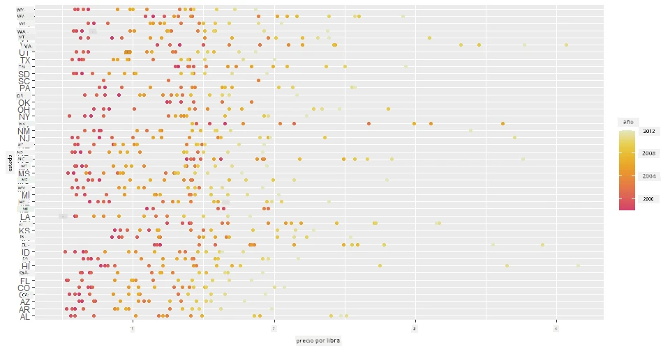
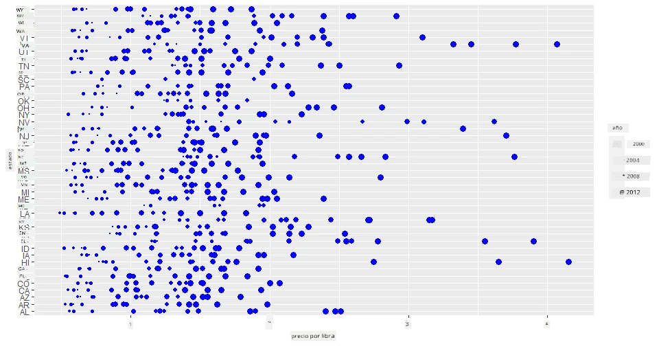
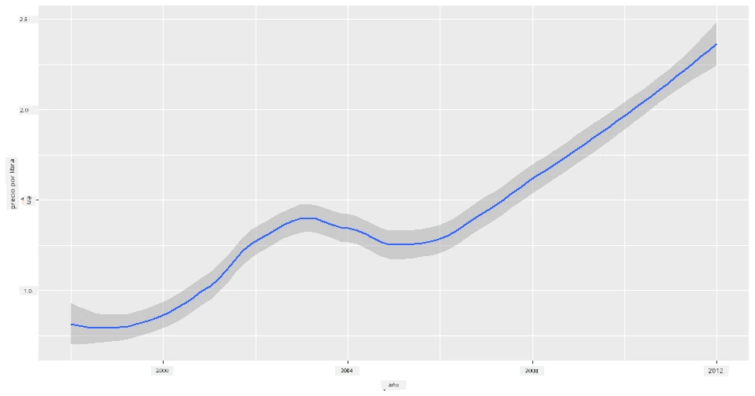
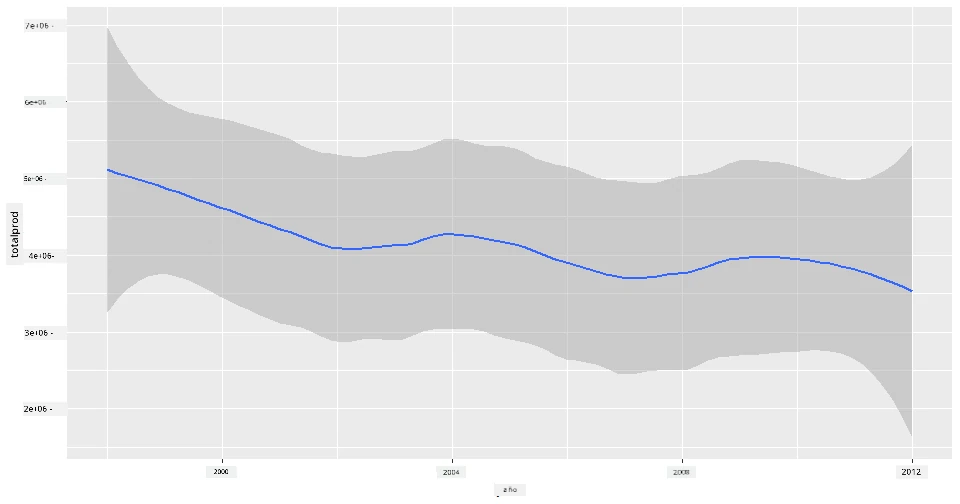
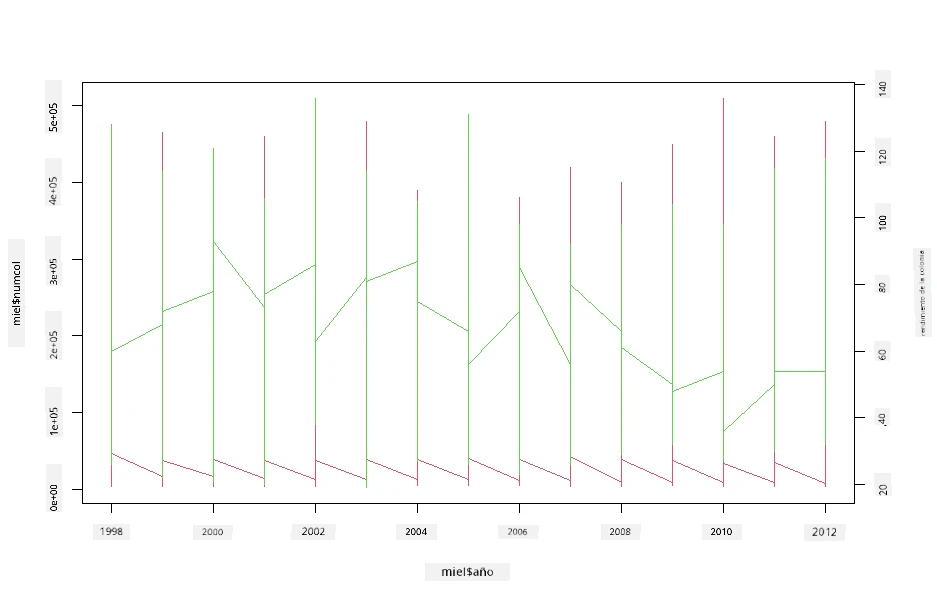

<!--
CO_OP_TRANSLATOR_METADATA:
{
  "original_hash": "a33c5d4b4156a2b41788d8720b6f724c",
  "translation_date": "2025-08-24T22:46:14+00:00",
  "source_file": "3-Data-Visualization/R/12-visualization-relationships/README.md",
  "language_code": "es"
}
-->
# Visualizando Relaciones: Todo Sobre la Miel 🍯

| ](../../../sketchnotes/12-Visualizing-Relationships.png)|
|:---:|
|Visualizando Relaciones - _Sketchnote por [@nitya](https://twitter.com/nitya)_ |

Continuando con el enfoque en la naturaleza de nuestra investigación, descubramos visualizaciones interesantes para mostrar las relaciones entre varios tipos de miel, según un conjunto de datos derivado del [Departamento de Agricultura de los Estados Unidos](https://www.nass.usda.gov/About_NASS/index.php).

Este conjunto de datos, que incluye alrededor de 600 elementos, muestra la producción de miel en muchos estados de EE. UU. Por ejemplo, puedes observar el número de colonias, el rendimiento por colonia, la producción total, las existencias, el precio por libra y el valor de la miel producida en un estado determinado desde 1998 hasta 2012, con una fila por año para cada estado.

Será interesante visualizar la relación entre la producción anual de un estado y, por ejemplo, el precio de la miel en ese estado. Alternativamente, podrías visualizar la relación entre el rendimiento de miel por colonia en diferentes estados. Este período abarca el devastador 'CCD' o 'Desorden del Colapso de Colonias', que se observó por primera vez en 2006 (http://npic.orst.edu/envir/ccd.html), por lo que es un conjunto de datos conmovedor para estudiar. 🐝

## [Cuestionario previo a la lección](https://purple-hill-04aebfb03.1.azurestaticapps.net/quiz/22)

En esta lección, puedes usar ggplot2, que ya has utilizado antes, como una buena biblioteca para visualizar relaciones entre variables. Es particularmente interesante el uso de las funciones `geom_point` y `qplot` de ggplot2, que permiten crear gráficos de dispersión y gráficos de líneas para visualizar rápidamente '[relaciones estadísticas](https://ggplot2.tidyverse.org/)', lo que ayuda al científico de datos a comprender mejor cómo se relacionan las variables entre sí.

## Gráficos de dispersión

Usa un gráfico de dispersión para mostrar cómo ha evolucionado el precio de la miel, año tras año, por estado. ggplot2, utilizando `ggplot` y `geom_point`, agrupa convenientemente los datos de los estados y muestra puntos de datos tanto para datos categóricos como numéricos.

Comencemos importando los datos y Seaborn:

```r
honey=read.csv('../../data/honey.csv')
head(honey)
```
Notarás que los datos de miel tienen varias columnas interesantes, incluyendo el año y el precio por libra. Exploremos estos datos, agrupados por estado de EE. UU.:

| estado | numcol | yieldpercol | totalprod | stocks   | priceperlb | prodvalue | year |
| ------ | ------ | ----------- | --------- | -------- | ---------- | --------- | ---- |
| AL     | 16000  | 71          | 1136000   | 159000   | 0.72       | 818000    | 1998 |
| AZ     | 55000  | 60          | 3300000   | 1485000  | 0.64       | 2112000   | 1998 |
| AR     | 53000  | 65          | 3445000   | 1688000  | 0.59       | 2033000   | 1998 |
| CA     | 450000 | 83          | 37350000  | 12326000 | 0.62       | 23157000  | 1998 |
| CO     | 27000  | 72          | 1944000   | 1594000  | 0.7        | 1361000   | 1998 |
| FL     | 230000 | 98          |22540000   | 4508000  | 0.64       | 14426000  | 1998 |

Crea un gráfico de dispersión básico para mostrar la relación entre el precio por libra de miel y su estado de origen en EE. UU. Haz que el eje `y` sea lo suficientemente alto para mostrar todos los estados:

```r
library(ggplot2)
ggplot(honey, aes(x = priceperlb, y = state)) +
  geom_point(colour = "blue")
```


Ahora, muestra los mismos datos con un esquema de colores de miel para mostrar cómo evoluciona el precio a lo largo de los años. Puedes hacerlo agregando un parámetro 'scale_color_gradientn' para mostrar el cambio, año tras año:

> ✅ Aprende más sobre [scale_color_gradientn](https://www.rdocumentation.org/packages/ggplot2/versions/0.9.1/topics/scale_colour_gradientn) - ¡prueba un hermoso esquema de colores arcoíris!

```r
ggplot(honey, aes(x = priceperlb, y = state, color=year)) +
  geom_point()+scale_color_gradientn(colours = colorspace::heat_hcl(7))
```


Con este cambio de esquema de colores, puedes ver que hay una progresión evidente a lo largo de los años en términos de precio de la miel por libra. De hecho, si observas un conjunto de muestra en los datos para verificar (elige un estado, Arizona por ejemplo), puedes ver un patrón de aumento de precios año tras año, con pocas excepciones:

| estado | numcol | yieldpercol | totalprod | stocks  | priceperlb | prodvalue | year |
| ------ | ------ | ----------- | --------- | ------- | ---------- | --------- | ---- |
| AZ     | 55000  | 60          | 3300000   | 1485000 | 0.64       | 2112000   | 1998 |
| AZ     | 52000  | 62          | 3224000   | 1548000 | 0.62       | 1999000   | 1999 |
| AZ     | 40000  | 59          | 2360000   | 1322000 | 0.73       | 1723000   | 2000 |
| AZ     | 43000  | 59          | 2537000   | 1142000 | 0.72       | 1827000   | 2001 |
| AZ     | 38000  | 63          | 2394000   | 1197000 | 1.08       | 2586000   | 2002 |
| AZ     | 35000  | 72          | 2520000   | 983000  | 1.34       | 3377000   | 2003 |
| AZ     | 32000  | 55          | 1760000   | 774000  | 1.11       | 1954000   | 2004 |
| AZ     | 36000  | 50          | 1800000   | 720000  | 1.04       | 1872000   | 2005 |
| AZ     | 30000  | 65          | 1950000   | 839000  | 0.91       | 1775000   | 2006 |
| AZ     | 30000  | 64          | 1920000   | 902000  | 1.26       | 2419000   | 2007 |
| AZ     | 25000  | 64          | 1600000   | 336000  | 1.26       | 2016000   | 2008 |
| AZ     | 20000  | 52          | 1040000   | 562000  | 1.45       | 1508000   | 2009 |
| AZ     | 24000  | 77          | 1848000   | 665000  | 1.52       | 2809000   | 2010 |
| AZ     | 23000  | 53          | 1219000   | 427000  | 1.55       | 1889000   | 2011 |
| AZ     | 22000  | 46          | 1012000   | 253000  | 1.79       | 1811000   | 2012 |

Otra forma de visualizar esta progresión es usar tamaño en lugar de color. Para usuarios con daltonismo, esta podría ser una mejor opción. Edita tu visualización para mostrar un aumento de precio mediante un aumento en la circunferencia de los puntos:

```r
ggplot(honey, aes(x = priceperlb, y = state)) +
  geom_point(aes(size = year),colour = "blue") +
  scale_size_continuous(range = c(0.25, 3))
```
Puedes ver que el tamaño de los puntos aumenta gradualmente.



¿Es este un caso simple de oferta y demanda? Debido a factores como el cambio climático y el colapso de colonias, ¿hay menos miel disponible para la compra año tras año, y por eso el precio aumenta?

Para descubrir una correlación entre algunas de las variables en este conjunto de datos, exploremos algunos gráficos de líneas.

## Gráficos de líneas

Pregunta: ¿Hay un aumento claro en el precio de la miel por libra año tras año? Puedes descubrirlo fácilmente creando un gráfico de líneas único:

```r
qplot(honey$year,honey$priceperlb, geom='smooth', span =0.5, xlab = "year",ylab = "priceperlb")
```
Respuesta: Sí, con algunas excepciones alrededor del año 2003:



Pregunta: Bueno, ¿en 2003 también podemos ver un aumento en el suministro de miel? ¿Qué pasa si observas la producción total año tras año?

```python
qplot(honey$year,honey$totalprod, geom='smooth', span =0.5, xlab = "year",ylab = "totalprod")
```



Respuesta: No realmente. Si observas la producción total, parece haber aumentado en ese año en particular, aunque en general la cantidad de miel producida está en declive durante estos años.

Pregunta: En ese caso, ¿qué podría haber causado ese aumento en el precio de la miel alrededor de 2003?

Para descubrir esto, puedes explorar una cuadrícula de facetas.

## Cuadrículas de facetas

Las cuadrículas de facetas toman un aspecto de tu conjunto de datos (en nuestro caso, puedes elegir 'año' para evitar producir demasiadas facetas). Seaborn puede entonces hacer un gráfico para cada una de esas facetas de tus coordenadas x e y elegidas para una comparación visual más sencilla. ¿Destaca el año 2003 en este tipo de comparación?

Crea una cuadrícula de facetas usando `facet_wrap` como se recomienda en la [documentación de ggplot2](https://ggplot2.tidyverse.org/reference/facet_wrap.html).

```r
ggplot(honey, aes(x=yieldpercol, y = numcol,group = 1)) + 
  geom_line() + facet_wrap(vars(year))
```
En esta visualización, puedes comparar el rendimiento por colonia y el número de colonias año tras año, lado a lado con un ajuste de envoltura de 3 para las columnas:


Para este conjunto de datos, nada particularmente destaca con respecto al número de colonias y su rendimiento, año tras año y estado por estado. ¿Hay una forma diferente de buscar una correlación entre estas dos variables?

## Gráficos de líneas duales

Prueba un gráfico de líneas múltiples superponiendo dos gráficos de líneas uno encima del otro, usando las funciones `par` y `plot` de R. Estaremos graficando el año en el eje x y mostrando dos ejes y. Así, muestra el rendimiento por colonia y el número de colonias, superpuestos:

```r
par(mar = c(5, 4, 4, 4) + 0.3)              
plot(honey$year, honey$numcol, pch = 16, col = 2,type="l")              
par(new = TRUE)                             
plot(honey$year, honey$yieldpercol, pch = 17, col = 3,              
     axes = FALSE, xlab = "", ylab = "",type="l")
axis(side = 4, at = pretty(range(y2)))      
mtext("colony yield", side = 4, line = 3)   
```


Aunque nada salta a la vista alrededor del año 2003, esto nos permite terminar esta lección con una nota un poco más feliz: aunque hay un número decreciente de colonias en general, el número de colonias se está estabilizando, incluso si su rendimiento por colonia está disminuyendo.

¡Vamos, abejas, vamos!

🐝❤️
## 🚀 Desafío

En esta lección, aprendiste un poco más sobre otros usos de los gráficos de dispersión y las cuadrículas de líneas, incluyendo las cuadrículas de facetas. Desafíate a crear una cuadrícula de facetas usando un conjunto de datos diferente, tal vez uno que hayas usado antes en estas lecciones. Nota cuánto tiempo tardan en crearse y cómo necesitas ser cuidadoso con la cantidad de cuadrículas que necesitas dibujar usando estas técnicas.
## [Cuestionario posterior a la lección](https://purple-hill-04aebfb03.1.azurestaticapps.net/quiz/23)

## Revisión y Autoestudio

Los gráficos de líneas pueden ser simples o bastante complejos. Investiga un poco en la [documentación de ggplot2](https://ggplot2.tidyverse.org/reference/geom_path.html#:~:text=geom_line()%20connects%20them%20in,which%20cases%20are%20connected%20together) sobre las diversas formas en que puedes construirlos. Intenta mejorar los gráficos de líneas que construiste en esta lección con otros métodos listados en la documentación.
## Tarea

[Sumérgete en la colmena](assignment.md)

**Descargo de responsabilidad**:  
Este documento ha sido traducido utilizando el servicio de traducción automática [Co-op Translator](https://github.com/Azure/co-op-translator). Aunque nos esforzamos por garantizar la precisión, tenga en cuenta que las traducciones automatizadas pueden contener errores o imprecisiones. El documento original en su idioma nativo debe considerarse como la fuente autorizada. Para información crítica, se recomienda una traducción profesional realizada por humanos. No nos hacemos responsables de malentendidos o interpretaciones erróneas que puedan surgir del uso de esta traducción.