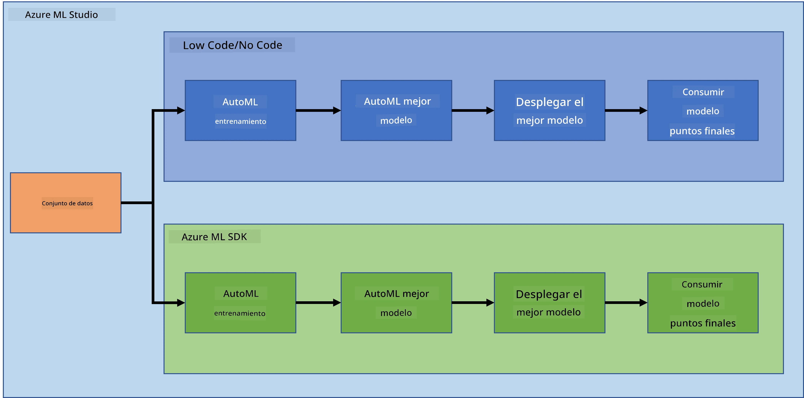

<!--
CO_OP_TRANSLATOR_METADATA:
{
  "original_hash": "8dfe141a0f46f7d253e07f74913c7f44",
  "translation_date": "2025-08-24T21:52:29+00:00",
  "source_file": "5-Data-Science-In-Cloud/README.md",
  "language_code": "es"
}
-->
# Ciencia de Datos en la Nube

> Foto de [Jelleke Vanooteghem](https://unsplash.com/@ilumire) en [Unsplash](https://unsplash.com/s/photos/cloud?orientation=landscape)

Cuando se trata de hacer ciencia de datos con grandes volúmenes de datos, la nube puede marcar una gran diferencia. En las próximas tres lecciones, veremos qué es la nube y por qué puede ser muy útil. También exploraremos un conjunto de datos sobre insuficiencia cardíaca y construiremos un modelo para ayudar a evaluar la probabilidad de que alguien sufra una insuficiencia cardíaca. Usaremos el poder de la nube para entrenar, implementar y consumir un modelo de dos maneras diferentes. Una forma utilizando únicamente la interfaz de usuario en un enfoque de bajo código/sin código, y la otra utilizando el Azure Machine Learning Software Developer Kit (Azure ML SDK).

### Temas

1. [¿Por qué usar la nube para la Ciencia de Datos?](17-Introduction/README.md)  
2. [Ciencia de Datos en la Nube: La forma de "Bajo código/Sin código"](18-Low-Code/README.md)  
3. [Ciencia de Datos en la Nube: La forma de "Azure ML SDK"](19-Azure/README.md)  

### Créditos  
Estas lecciones fueron escritas con ☁️ y 💕 por [Maud Levy](https://twitter.com/maudstweets) y [Tiffany Souterre](https://twitter.com/TiffanySouterre)  

Los datos para el proyecto de Predicción de Insuficiencia Cardíaca provienen de [Larxel](https://www.kaggle.com/andrewmvd) en [Kaggle](https://www.kaggle.com/andrewmvd/heart-failure-clinical-data). Están licenciados bajo la [Attribution 4.0 International (CC BY 4.0)](https://creativecommons.org/licenses/by/4.0/).  

**Descargo de responsabilidad**:  
Este documento ha sido traducido utilizando el servicio de traducción automática [Co-op Translator](https://github.com/Azure/co-op-translator). Aunque nos esforzamos por garantizar la precisión, tenga en cuenta que las traducciones automatizadas pueden contener errores o imprecisiones. El documento original en su idioma nativo debe considerarse la fuente autorizada. Para información crítica, se recomienda una traducción profesional realizada por humanos. No nos hacemos responsables de malentendidos o interpretaciones erróneas que puedan surgir del uso de esta traducción.