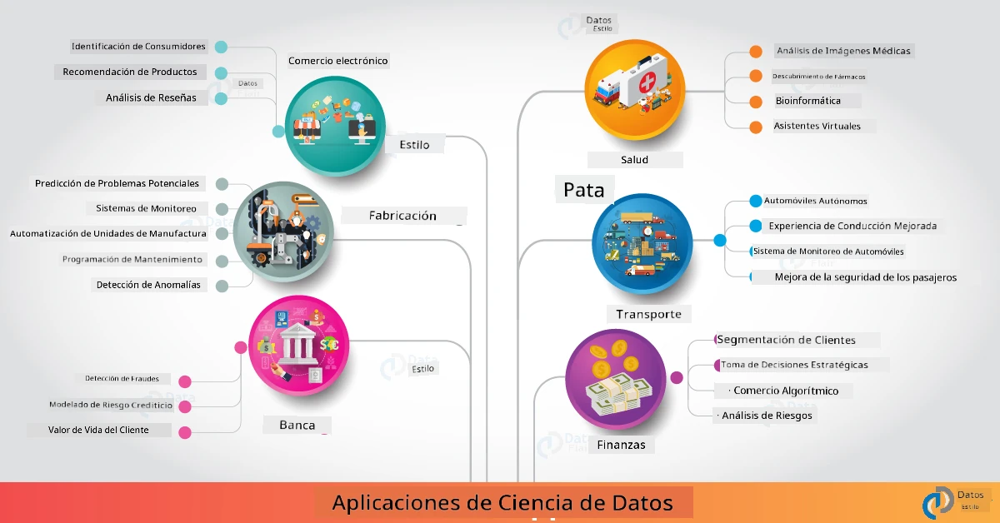

<!--
CO_OP_TRANSLATOR_METADATA:
{
  "original_hash": "0f67a4139454816631526779a456b734",
  "translation_date": "2025-09-06T18:12:00+00:00",
  "source_file": "6-Data-Science-In-Wild/20-Real-World-Examples/README.md",
  "language_code": "es"
}
-->
# Ciencia de Datos en el Mundo Real

|  ](../../sketchnotes/20-DataScience-RealWorld.png) |
| :--------------------------------------------------------------------------------------------------------------: |
|               Ciencia de Datos en el Mundo Real - _Sketchnote por [@nitya](https://twitter.com/nitya)_               |

¡Estamos casi al final de este viaje de aprendizaje!

Comenzamos con definiciones de ciencia de datos y ética, exploramos diversas herramientas y técnicas para el análisis y la visualización de datos, revisamos el ciclo de vida de la ciencia de datos y analizamos cómo escalar y automatizar flujos de trabajo de ciencia de datos con servicios de computación en la nube. Entonces, probablemente te estés preguntando: _"¿Cómo exactamente puedo aplicar todo este aprendizaje en contextos del mundo real?"_

En esta lección, exploraremos aplicaciones reales de la ciencia de datos en la industria y profundizaremos en ejemplos específicos en los contextos de investigación, humanidades digitales y sostenibilidad. También veremos oportunidades para proyectos estudiantiles y concluiremos con recursos útiles para ayudarte a continuar tu viaje de aprendizaje.

## Cuestionario Previo a la Clase

## [Cuestionario previo a la clase](https://ff-quizzes.netlify.app/en/ds/quiz/38)

## Ciencia de Datos + Industria

Gracias a la democratización de la IA, los desarrolladores ahora encuentran más fácil diseñar e integrar decisiones impulsadas por IA y conocimientos basados en datos en experiencias de usuario y flujos de trabajo de desarrollo. Aquí hay algunos ejemplos de cómo la ciencia de datos se "aplica" a aplicaciones reales en la industria:

 * [Google Flu Trends](https://www.wired.com/2015/10/can-learn-epic-failure-google-flu-trends/) utilizó la ciencia de datos para correlacionar términos de búsqueda con tendencias de gripe. Aunque el enfoque tuvo fallas, generó conciencia sobre las posibilidades (y desafíos) de las predicciones de salud basadas en datos.

 * [Predicciones de Rutas de UPS](https://www.technologyreview.com/2018/11/21/139000/how-ups-uses-ai-to-outsmart-bad-weather/) - explica cómo UPS utiliza la ciencia de datos y el aprendizaje automático para predecir rutas óptimas de entrega, teniendo en cuenta condiciones climáticas, patrones de tráfico, plazos de entrega y más.

 * [Visualización de Rutas de Taxis en NYC](http://chriswhong.github.io/nyctaxi/) - datos recopilados utilizando [Leyes de Libertad de Información](https://chriswhong.com/open-data/foil_nyc_taxi/) ayudaron a visualizar un día en la vida de los taxis de NYC, ayudándonos a entender cómo navegan por la ciudad, el dinero que generan y la duración de los viajes en un período de 24 horas.

 * [Uber Data Science Workbench](https://eng.uber.com/dsw/) - utiliza datos (sobre ubicaciones de recogida y destino, duración de viajes, rutas preferidas, etc.) recopilados de millones de viajes diarios de Uber para construir una herramienta de análisis de datos que ayuda con precios, seguridad, detección de fraudes y decisiones de navegación.

 * [Analítica Deportiva](https://towardsdatascience.com/scope-of-analytics-in-sports-world-37ed09c39860) - se centra en _analítica predictiva_ (análisis de equipos y jugadores - piensa en [Moneyball](https://datasciencedegree.wisconsin.edu/blog/moneyball-proves-importance-big-data-big-ideas/) - y gestión de fanáticos) y _visualización de datos_ (tableros de equipos y fanáticos, juegos, etc.) con aplicaciones como búsqueda de talentos, apuestas deportivas y gestión de inventarios/recintos.

 * [Ciencia de Datos en la Banca](https://data-flair.training/blogs/data-science-in-banking/) - destaca el valor de la ciencia de datos en la industria financiera con aplicaciones que van desde modelado de riesgos y detección de fraudes, hasta segmentación de clientes, predicción en tiempo real y sistemas de recomendación. La analítica predictiva también impulsa medidas críticas como [puntuaciones de crédito](https://dzone.com/articles/using-big-data-and-predictive-analytics-for-credit).

 * [Ciencia de Datos en la Salud](https://data-flair.training/blogs/data-science-in-healthcare/) - destaca aplicaciones como imágenes médicas (por ejemplo, MRI, Rayos X, Tomografía), genómica (secuenciación de ADN), desarrollo de medicamentos (evaluación de riesgos, predicción de éxito), analítica predictiva (cuidado de pacientes y logística de suministros), seguimiento y prevención de enfermedades, entre otros.

 Crédito de la Imagen: [Data Flair: 6 Amazing Data Science Applications ](https://data-flair.training/blogs/data-science-applications/)

La figura muestra otros dominios y ejemplos para aplicar técnicas de ciencia de datos. ¿Quieres explorar otras aplicaciones? Consulta la sección [Revisión y Autoestudio](../../../../6-Data-Science-In-Wild/20-Real-World-Examples) a continuación.

## Ciencia de Datos + Investigación

|  ](../../sketchnotes/20-DataScience-Research.png) |
| :---------------------------------------------------------------------------------------------------------------: |
|              Ciencia de Datos e Investigación - _Sketchnote por [@nitya](https://twitter.com/nitya)_              |

Aunque las aplicaciones del mundo real suelen centrarse en casos de uso industrial a gran escala, las aplicaciones y proyectos de _investigación_ pueden ser útiles desde dos perspectivas:

* _oportunidades de innovación_ - explorar prototipos rápidos de conceptos avanzados y probar experiencias de usuario para aplicaciones de próxima generación.
* _desafíos de implementación_ - investigar posibles daños o consecuencias no deseadas de las tecnologías de ciencia de datos en contextos reales.

Para los estudiantes, estos proyectos de investigación pueden proporcionar oportunidades de aprendizaje y colaboración que mejoren su comprensión del tema y amplíen su conciencia e interacción con personas o equipos relevantes que trabajan en áreas de interés. Entonces, ¿cómo son los proyectos de investigación y cómo pueden tener impacto?

Veamos un ejemplo: el [Estudio Gender Shades del MIT](http://gendershades.org/overview.html) de Joy Buolamwini (MIT Media Labs) con un [artículo de investigación destacado](http://proceedings.mlr.press/v81/buolamwini18a/buolamwini18a.pdf) coautorado con Timnit Gebru (entonces en Microsoft Research) que se centró en:

 * **Qué:** El objetivo del proyecto de investigación era _evaluar el sesgo presente en algoritmos y conjuntos de datos de análisis facial automatizado_ basado en género y tipo de piel.
 * **Por qué:** El análisis facial se utiliza en áreas como la aplicación de la ley, seguridad en aeropuertos, sistemas de contratación y más - contextos donde clasificaciones inexactas (por ejemplo, debido al sesgo) pueden causar daños económicos y sociales a individuos o grupos afectados. Comprender (y eliminar o mitigar) los sesgos es clave para la equidad en el uso.
 * **Cómo:** Los investigadores reconocieron que los puntos de referencia existentes utilizaban predominantemente sujetos de piel más clara y crearon un nuevo conjunto de datos (más de 1000 imágenes) que estaba _más equilibrado_ por género y tipo de piel. El conjunto de datos se utilizó para evaluar la precisión de tres productos de clasificación de género (de Microsoft, IBM y Face++).

Los resultados mostraron que, aunque la precisión general de la clasificación era buena, había una diferencia notable en las tasas de error entre varios subgrupos, con **errores de clasificación de género** más altos para mujeres o personas con piel más oscura, lo que indicaba sesgo.

**Resultados Clave:** Generó conciencia de que la ciencia de datos necesita más _conjuntos de datos representativos_ (subgrupos equilibrados) y más _equipos inclusivos_ (antecedentes diversos) para reconocer y eliminar o mitigar dichos sesgos en las soluciones de IA desde etapas tempranas. Esfuerzos de investigación como este también son fundamentales para que muchas organizaciones definan principios y prácticas para una _IA responsable_ que mejore la equidad en sus productos y procesos de IA.

**¿Quieres aprender sobre esfuerzos de investigación relevantes en Microsoft?**

* Consulta [Proyectos de Investigación de Microsoft](https://www.microsoft.com/research/research-area/artificial-intelligence/?facet%5Btax%5D%5Bmsr-research-area%5D%5B%5D=13556&facet%5Btax%5D%5Bmsr-content-type%5D%5B%5D=msr-project) en Inteligencia Artificial.
* Explora proyectos estudiantiles de la [Escuela de Verano de Ciencia de Datos de Microsoft Research](https://www.microsoft.com/en-us/research/academic-program/data-science-summer-school/).
* Consulta el proyecto [Fairlearn](https://fairlearn.org/) y las iniciativas de [IA Responsable](https://www.microsoft.com/en-us/ai/responsible-ai?activetab=pivot1%3aprimaryr6).

## Ciencia de Datos + Humanidades

|  ](../../sketchnotes/20-DataScience-Humanities.png) |
| :---------------------------------------------------------------------------------------------------------------: |
|              Ciencia de Datos y Humanidades Digitales - _Sketchnote por [@nitya](https://twitter.com/nitya)_              |

Las Humanidades Digitales [se han definido](https://digitalhumanities.stanford.edu/about-dh-stanford) como "una colección de prácticas y enfoques que combinan métodos computacionales con investigación humanística". Los proyectos de [Stanford](https://digitalhumanities.stanford.edu/projects) como _"rebooting history"_ y _"poetic thinking"_ ilustran la conexión entre [Humanidades Digitales y Ciencia de Datos](https://digitalhumanities.stanford.edu/digital-humanities-and-data-science), enfatizando técnicas como análisis de redes, visualización de información, análisis espacial y de texto que pueden ayudarnos a revisar conjuntos de datos históricos y literarios para derivar nuevas perspectivas e ideas.

*¿Quieres explorar y ampliar un proyecto en este espacio?*

Consulta ["Emily Dickinson and the Meter of Mood"](https://gist.github.com/jlooper/ce4d102efd057137bc000db796bfd671) - un excelente ejemplo de [Jen Looper](https://twitter.com/jenlooper) que pregunta cómo podemos usar la ciencia de datos para revisar poesía familiar y reevaluar su significado y las contribuciones de su autora en nuevos contextos. Por ejemplo, _¿podemos predecir la estación en la que se escribió un poema analizando su tono o sentimiento_ - y qué nos dice esto sobre el estado de ánimo de la autora durante el período relevante?

Para responder a esa pregunta, seguimos los pasos del ciclo de vida de la ciencia de datos:
 * [`Adquisición de Datos`](https://gist.github.com/jlooper/ce4d102efd057137bc000db796bfd671#acquiring-the-dataset) - para recopilar un conjunto de datos relevante para el análisis. Las opciones incluyen usar una API (por ejemplo, [Poetry DB API](https://poetrydb.org/index.html)) o extraer páginas web (por ejemplo, [Project Gutenberg](https://www.gutenberg.org/files/12242/12242-h/12242-h.htm)) utilizando herramientas como [Scrapy](https://scrapy.org/).
 * [`Limpieza de Datos`](https://gist.github.com/jlooper/ce4d102efd057137bc000db796bfd671#clean-the-data) - explica cómo el texto puede ser formateado, sanitizado y simplificado utilizando herramientas básicas como Visual Studio Code y Microsoft Excel.
 * [`Análisis de Datos`](https://gist.github.com/jlooper/ce4d102efd057137bc000db796bfd671#working-with-the-data-in-a-notebook) - explica cómo podemos importar el conjunto de datos en "Notebooks" para análisis utilizando paquetes de Python (como pandas, numpy y matplotlib) para organizar y visualizar los datos.
 * [`Análisis de Sentimientos`](https://gist.github.com/jlooper/ce4d102efd057137bc000db796bfd671#sentiment-analysis-using-cognitive-services) - explica cómo podemos integrar servicios en la nube como Text Analytics, utilizando herramientas de bajo código como [Power Automate](https://flow.microsoft.com/en-us/) para flujos de trabajo automatizados de procesamiento de datos.

Usando este flujo de trabajo, podemos explorar los impactos estacionales en el sentimiento de los poemas y ayudarnos a formar nuestras propias perspectivas sobre la autora. ¡Pruébalo tú mismo y luego amplía el notebook para hacer otras preguntas o visualizar los datos de nuevas maneras!

> Puedes usar algunas de las herramientas en el [kit de herramientas de Humanidades Digitales](https://github.com/Digital-Humanities-Toolkit) para seguir estas líneas de investigación.

## Ciencia de Datos + Sostenibilidad

|  ](../../sketchnotes/20-DataScience-Sustainability.png) |
| :---------------------------------------------------------------------------------------------------------------: |
|              Ciencia de Datos y Sostenibilidad - _Sketchnote por [@nitya](https://twitter.com/nitya)_              |

La [Agenda 2030 para el Desarrollo Sostenible](https://sdgs.un.org/2030agenda) - adoptada por todos los miembros de las Naciones Unidas en 2015 - identifica 17 objetivos, incluyendo aquellos que se centran en **Proteger el Planeta** de la degradación y el impacto del cambio climático. La iniciativa de [Sostenibilidad de Microsoft](https://www.microsoft.com/en-us/sustainability) apoya estos objetivos explorando formas en que las soluciones tecnológicas pueden respaldar y construir futuros más sostenibles con un [enfoque en 4 metas](https://dev.to/azure/a-visual-guide-to-sustainable-software-engineering-53hh): ser carbono negativo, agua positiva, cero residuos y biodiverso para 2030.

Abordar estos desafíos de manera escalable y oportuna requiere pensamiento a escala de nube y grandes volúmenes de datos. La iniciativa [Planetary Computer](https://planetarycomputer.microsoft.com/) proporciona 4 componentes para ayudar a los científicos de datos y desarrolladores en este esfuerzo:

 * [Catálogo de Datos](https://planetarycomputer.microsoft.com/catalog) - con petabytes de datos de sistemas terrestres (gratuitos y alojados en Azure).
 * [API Planetaria](https://planetarycomputer.microsoft.com/docs/reference/stac/) - para ayudar a los usuarios a buscar datos relevantes en espacio y tiempo.
 * [Hub](https://planetarycomputer.microsoft.com/docs/overview/environment/) - entorno gestionado para que los científicos procesen conjuntos de datos geoespaciales masivos.
 * [Aplicaciones](https://planetarycomputer.microsoft.com/applications) - muestran casos de uso y herramientas para obtener conocimientos sobre sostenibilidad.
**El Proyecto Planetary Computer está actualmente en vista previa (a partir de septiembre de 2021)** - aquí tienes cómo puedes comenzar a contribuir a soluciones de sostenibilidad utilizando ciencia de datos.

* [Solicita acceso](https://planetarycomputer.microsoft.com/account/request) para empezar a explorar y conectarte con otros.
* [Explora la documentación](https://planetarycomputer.microsoft.com/docs/overview/about) para entender los conjuntos de datos y APIs compatibles.
* Explora aplicaciones como [Ecosystem Monitoring](https://analytics-lab.org/ecosystemmonitoring/) para inspirarte en ideas de aplicaciones.

Piensa en cómo puedes usar la visualización de datos para exponer o amplificar ideas relevantes en áreas como el cambio climático y la deforestación. O reflexiona sobre cómo los conocimientos obtenidos pueden ser utilizados para crear nuevas experiencias de usuario que motiven cambios de comportamiento hacia una vida más sostenible.

## Ciencia de Datos + Estudiantes

Hemos hablado sobre aplicaciones reales en la industria y la investigación, y explorado ejemplos de aplicaciones de ciencia de datos en humanidades digitales y sostenibilidad. Entonces, ¿cómo puedes desarrollar tus habilidades y compartir tu experiencia como principiante en ciencia de datos?

Aquí tienes algunos ejemplos de proyectos estudiantiles de ciencia de datos para inspirarte.

 * [Escuela de Verano de Ciencia de Datos de MSR](https://www.microsoft.com/en-us/research/academic-program/data-science-summer-school/#!projects) con [proyectos](https://github.com/msr-ds3) en GitHub que exploran temas como:
    - [Sesgo racial en el uso de la fuerza policial](https://www.microsoft.com/en-us/research/video/data-science-summer-school-2019-replicating-an-empirical-analysis-of-racial-differences-in-police-use-of-force/) | [Github](https://github.com/msr-ds3/stop-question-frisk)
    - [Fiabilidad del sistema de metro de Nueva York](https://www.microsoft.com/en-us/research/video/data-science-summer-school-2018-exploring-the-reliability-of-the-nyc-subway-system/) | [Github](https://github.com/msr-ds3/nyctransit)
 * [Digitalizando la cultura material: Explorando distribuciones socioeconómicas en Sirkap](https://claremont.maps.arcgis.com/apps/Cascade/index.html?appid=bdf2aef0f45a4674ba41cd373fa23afc) - de [Ornella Altunyan](https://twitter.com/ornelladotcom) y su equipo en Claremont, utilizando [ArcGIS StoryMaps](https://storymaps.arcgis.com/).

## 🚀 Desafío

Busca artículos que recomienden proyectos de ciencia de datos para principiantes - como [estas 50 áreas temáticas](https://www.upgrad.com/blog/data-science-project-ideas-topics-beginners/) o [estas 21 ideas de proyectos](https://www.intellspot.com/data-science-project-ideas) o [estos 16 proyectos con código fuente](https://data-flair.training/blogs/data-science-project-ideas/) que puedes descomponer y adaptar. Y no olvides escribir en tu blog sobre tus aprendizajes y compartir tus ideas con todos nosotros.

## Cuestionario Post-Clase

## [Cuestionario post-clase](https://ff-quizzes.netlify.app/en/ds/quiz/39)

## Revisión y Autoestudio

¿Quieres explorar más casos de uso? Aquí tienes algunos artículos relevantes:
 * [17 Aplicaciones y Ejemplos de Ciencia de Datos](https://builtin.com/data-science/data-science-applications-examples) - julio 2021
 * [11 Impresionantes Aplicaciones de Ciencia de Datos en el Mundo Real](https://myblindbird.com/data-science-applications-real-world/) - mayo 2021
 * [Ciencia de Datos en el Mundo Real](https://towardsdatascience.com/data-science-in-the-real-world/home) - Colección de artículos
 * [12 Aplicaciones de Ciencia de Datos en el Mundo Real con Ejemplos](https://www.scaler.com/blog/data-science-applications/) - mayo 2024
 * Ciencia de Datos en: [Educación](https://data-flair.training/blogs/data-science-in-education/), [Agricultura](https://data-flair.training/blogs/data-science-in-agriculture/), [Finanzas](https://data-flair.training/blogs/data-science-in-finance/), [Cine](https://data-flair.training/blogs/data-science-at-movies/), [Salud](https://onlinedegrees.sandiego.edu/data-science-health-care/) y más.

## Tarea

[Explora un conjunto de datos de Planetary Computer](assignment.md)

---

**Descargo de responsabilidad**:  
Este documento ha sido traducido utilizando el servicio de traducción automática [Co-op Translator](https://github.com/Azure/co-op-translator). Aunque nos esforzamos por garantizar la precisión, tenga en cuenta que las traducciones automatizadas pueden contener errores o imprecisiones. El documento original en su idioma nativo debe considerarse como la fuente autorizada. Para información crítica, se recomienda una traducción profesional realizada por humanos. No nos hacemos responsables de malentendidos o interpretaciones erróneas que puedan surgir del uso de esta traducción.