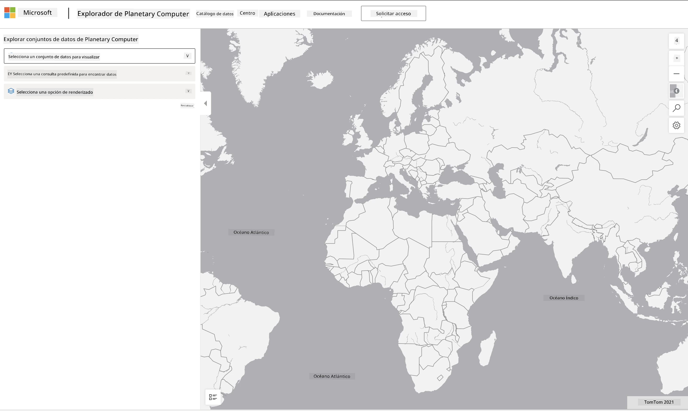

<!--
CO_OP_TRANSLATOR_METADATA:
{
  "original_hash": "d1e05715f9d97de6c4f1fb0c5a4702c0",
  "translation_date": "2025-08-24T21:51:29+00:00",
  "source_file": "6-Data-Science-In-Wild/20-Real-World-Examples/assignment.md",
  "language_code": "es"
}
-->
# Explora un Conjunto de Datos del Planetary Computer

## Instrucciones

En esta lección, hablamos sobre varios dominios de aplicación de la ciencia de datos, profundizando en ejemplos relacionados con la investigación, la sostenibilidad y las humanidades digitales. En esta tarea, explorarás uno de estos ejemplos en mayor detalle y aplicarás algunos de tus aprendizajes sobre visualizaciones y análisis de datos para obtener información sobre datos de sostenibilidad.

El proyecto [Planetary Computer](https://planetarycomputer.microsoft.com/) tiene conjuntos de datos y APIs que se pueden acceder con una cuenta. Solicita una para probar el paso adicional de la tarea. El sitio también ofrece una función de [Explorer](https://planetarycomputer.microsoft.com/explore) que puedes usar sin necesidad de crear una cuenta.

`Pasos:`
La interfaz de Explorer (mostrada en la captura de pantalla abajo) te permite seleccionar un conjunto de datos (de las opciones disponibles), una consulta predefinida (para filtrar datos) y una opción de representación (para crear una visualización relevante). En esta tarea, tu objetivo es:

 1. Leer la [documentación de Explorer](https://planetarycomputer.microsoft.com/docs/overview/explorer/) - entender las opciones.
 2. Explorar el [Catálogo](https://planetarycomputer.microsoft.com/catalog) de conjuntos de datos - aprender el propósito de cada uno.
 3. Usar el Explorer - elegir un conjunto de datos de interés, seleccionar una consulta relevante y una opción de representación.

`Tu tarea:`
Ahora estudia la visualización que se genera en el navegador y responde lo siguiente:
 * ¿Qué _características_ tiene el conjunto de datos?
 * ¿Qué _información_ o resultados proporciona la visualización?
 * ¿Cuáles son las _implicaciones_ de esa información para los objetivos de sostenibilidad del proyecto?
 * ¿Cuáles son las _limitaciones_ de la visualización (es decir, qué información no obtuviste)?
 * Si pudieras obtener los datos en bruto, ¿qué _visualizaciones alternativas_ crearías y por qué?

`Puntos Adicionales:`
Solicita una cuenta y accede cuando sea aceptada.
 * Usa la opción _Launch Hub_ para abrir los datos en bruto en un Notebook.
 * Explora los datos de manera interactiva e implementa las visualizaciones alternativas que pensaste.
 * Ahora analiza tus visualizaciones personalizadas: ¿pudiste obtener la información que te faltaba antes?

## Rúbrica

Excepcional | Adecuado | Necesita Mejorar
--- | --- | -- |
Se respondieron las cinco preguntas principales. El estudiante identificó claramente cómo las visualizaciones actuales y alternativas podrían proporcionar información sobre los objetivos o resultados de sostenibilidad. | El estudiante respondió al menos las tres primeras preguntas con gran detalle, mostrando que tuvo experiencia práctica con el Explorer. | El estudiante no respondió varias preguntas o proporcionó detalles insuficientes, indicando que no se hizo un intento significativo para el proyecto. |

**Descargo de responsabilidad**:  
Este documento ha sido traducido utilizando el servicio de traducción automática [Co-op Translator](https://github.com/Azure/co-op-translator). Aunque nos esforzamos por garantizar la precisión, tenga en cuenta que las traducciones automatizadas pueden contener errores o imprecisiones. El documento original en su idioma nativo debe considerarse como la fuente autorizada. Para información crítica, se recomienda una traducción profesional realizada por humanos. No nos hacemos responsables de malentendidos o interpretaciones erróneas que puedan surgir del uso de esta traducción.