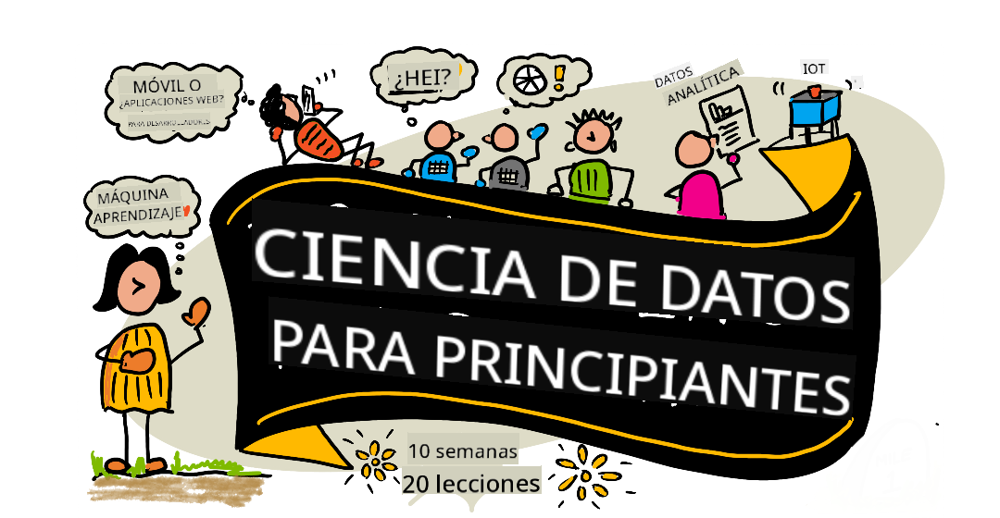

<!--
CO_OP_TRANSLATOR_METADATA:
{
  "original_hash": "278a30661fe9f10afd81dea999adc63a",
  "translation_date": "2025-12-21T10:14:33+00:00",
  "source_file": "README.md",
  "language_code": "es"
}
-->
# Ciencia de Datos para Principiantes - Un plan de estudios

Los Azure Cloud Advocates de Microsoft se complacen en ofrecer un plan de estudios de 10 semanas y 20 lecciones dedicado a la Ciencia de Datos. Cada lección incluye cuestionarios previos y posteriores, instrucciones escritas para completar la lección, una solución y una tarea. Nuestra pedagogía basada en proyectos te permite aprender mientras construyes, una forma probada para que las nuevas habilidades "se queden".

**Un agradecimiento especial a nuestros autores:** [Jasmine Greenaway](https://www.twitter.com/paladique), [Dmitry Soshnikov](http://soshnikov.com), [Nitya Narasimhan](https://twitter.com/nitya), [Jalen McGee](https://twitter.com/JalenMcG), [Jen Looper](https://twitter.com/jenlooper), [Maud Levy](https://twitter.com/maudstweets), [Tiffany Souterre](https://twitter.com/TiffanySouterre), [Christopher Harrison](https://www.twitter.com/geektrainer).

**🙏 Agradecimientos especiales 🙏 a nuestros autores, revisores y colaboradores de contenido de [Microsoft Student Ambassador](https://studentambassadors.microsoft.com/),** notablemente Aaryan Arora, [Aditya Garg](https://github.com/AdityaGarg00), [Alondra Sanchez](https://www.linkedin.com/in/alondra-sanchez-molina/), [Ankita Singh](https://www.linkedin.com/in/ankitasingh007), [Anupam Mishra](https://www.linkedin.com/in/anupam--mishra/), [Arpita Das](https://www.linkedin.com/in/arpitadas01/), ChhailBihari Dubey, [Dibri Nsofor](https://www.linkedin.com/in/dibrinsofor), [Dishita Bhasin](https://www.linkedin.com/in/dishita-bhasin-7065281bb), [Majd Safi](https://www.linkedin.com/in/majd-s/), [Max Blum](https://www.linkedin.com/in/max-blum-6036a1186/), [Miguel Correa](https://www.linkedin.com/in/miguelmque/), [Mohamma Iftekher (Iftu) Ebne Jalal](https://twitter.com/iftu119), [Nawrin Tabassum](https://www.linkedin.com/in/nawrin-tabassum), [Raymond Wangsa Putra](https://www.linkedin.com/in/raymond-wp/), [Rohit Yadav](https://www.linkedin.com/in/rty2423), Samridhi Sharma, [Sanya Sinha](https://www.linkedin.com/mwlite/in/sanya-sinha-13aab1200),
[Sheena Narula](https://www.linkedin.com/in/sheena-narua-n/), [Tauqeer Ahmad](https://www.linkedin.com/in/tauqeerahmad5201/), Yogendrasingh Pawar , [Vidushi Gupta](https://www.linkedin.com/in/vidushi-gupta07/), [Jasleen Sondhi](https://www.linkedin.com/in/jasleen-sondhi/)

||
|:---:|
| Ciencia de Datos para Principiantes - _Sketchnote por [@nitya](https://twitter.com/nitya)_ |

### 🌐 Soporte multilingüe

#### Soportado vía GitHub Action (Automatizado y siempre actualizado)

<!-- CO-OP TRANSLATOR LANGUAGES TABLE START -->
[Arabic](../ar/README.md) | [Bengali](../bn/README.md) | [Bulgarian](../bg/README.md) | [Burmese (Myanmar)](../my/README.md) | [Chinese (Simplified)](../zh/README.md) | [Chinese (Traditional, Hong Kong)](../hk/README.md) | [Chinese (Traditional, Macau)](../mo/README.md) | [Chinese (Traditional, Taiwan)](../tw/README.md) | [Croatian](../hr/README.md) | [Czech](../cs/README.md) | [Danish](../da/README.md) | [Dutch](../nl/README.md) | [Estonian](../et/README.md) | [Finnish](../fi/README.md) | [French](../fr/README.md) | [German](../de/README.md) | [Greek](../el/README.md) | [Hebrew](../he/README.md) | [Hindi](../hi/README.md) | [Hungarian](../hu/README.md) | [Indonesian](../id/README.md) | [Italian](../it/README.md) | [Japanese](../ja/README.md) | [Kannada](../kn/README.md) | [Korean](../ko/README.md) | [Lithuanian](../lt/README.md) | [Malay](../ms/README.md) | [Malayalam](../ml/README.md) | [Marathi](../mr/README.md) | [Nepali](../ne/README.md) | [Nigerian Pidgin](../pcm/README.md) | [Norwegian](../no/README.md) | [Persian (Farsi)](../fa/README.md) | [Polish](../pl/README.md) | [Portuguese (Brazil)](../br/README.md) | [Portuguese (Portugal)](../pt/README.md) | [Punjabi (Gurmukhi)](../pa/README.md) | [Romanian](../ro/README.md) | [Russian](../ru/README.md) | [Serbian (Cyrillic)](../sr/README.md) | [Slovak](../sk/README.md) | [Slovenian](../sl/README.md) | [Spanish](./README.md) | [Swahili](../sw/README.md) | [Swedish](../sv/README.md) | [Tagalog (Filipino)](../tl/README.md) | [Tamil](../ta/README.md) | [Telugu](../te/README.md) | [Thai](../th/README.md) | [Turkish](../tr/README.md) | [Ukrainian](../uk/README.md) | [Urdu](../ur/README.md) | [Vietnamese](../vi/README.md)
<!-- CO-OP TRANSLATOR LANGUAGES TABLE END -->

**Si deseas que se agreguen idiomas de traducción adicionales, los idiomas compatibles están listados [aquí](https://github.com/Azure/co-op-translator/blob/main/getting_started/supported-languages.md)**

#### Únete a nuestra comunidad 

Tenemos una serie en Discord llamada "Aprende con IA" en curso; obtén más información y únete a nosotros en [Learn with AI Series](https://aka.ms/learnwithai/discord) del 18 al 30 de septiembre de 2025. Recibirás consejos y trucos para usar GitHub Copilot en Ciencia de Datos.

# ¿Eres estudiante?

Comienza con los siguientes recursos:

- [Página Student Hub](https://docs.microsoft.com/en-gb/learn/student-hub?WT.mc_id=academic-77958-bethanycheum) En esta página, encontrarás recursos para principiantes, paquetes para estudiantes e incluso formas de obtener un cupón para una certificación gratuita. Esta es una página que querrás marcar y revisar de vez en cuando, ya que cambiamos el contenido al menos mensualmente.
- [Microsoft Learn Student Ambassadors](https://studentambassadors.microsoft.com?WT.mc_id=academic-77958-bethanycheum) Únete a una comunidad global de embajadores estudiantiles; esta podría ser tu puerta de entrada a Microsoft.

# Primeros pasos

## 📚 Documentación

- **[Guía de instalación](INSTALLATION.md)** - Instrucciones paso a paso para configurar el entorno para principiantes
- **[Guía de uso](USAGE.md)** - Ejemplos y flujos de trabajo comunes
- **[Solución de problemas](TROUBLESHOOTING.md)** - Soluciones a problemas comunes
- **[Guía de contribución](CONTRIBUTING.md)** - Cómo contribuir a este proyecto
- **[Para profesores](for-teachers.md)** - Orientación para la enseñanza y recursos para el aula

## 👨‍🎓 Para estudiantes
> **Principiantes absolutos**: ¿Nuevo en la ciencia de datos? ¡Comienza con nuestros [ejemplos amigables para principiantes](examples/README.md)! Estos ejemplos simples y bien comentados te ayudarán a entender lo básico antes de sumergirte en el plan de estudios completo.
> **[Estudiantes](https://aka.ms/student-page)**: para usar este plan de estudios por tu cuenta, haz un fork del repositorio completo y completa los ejercicios por tu cuenta, comenzando con un cuestionario previo a la lección. Luego lee la lección y completa el resto de las actividades. Intenta crear los proyectos comprendiendo las lecciones en lugar de copiar el código de la solución; sin embargo, ese código está disponible en las carpetas /solutions en cada lección orientada a proyectos. Otra idea sería formar un grupo de estudio con amigos y recorrer el contenido juntos. Para un estudio adicional, recomendamos [Microsoft Learn](https://docs.microsoft.com/en-us/users/jenlooper-2911/collections/qprpajyoy3x0g7?WT.mc_id=academic-77958-bethanycheum).

**Inicio rápido:**
1. Revisa la [Guía de instalación](INSTALLATION.md) para configurar tu entorno
2. Revisa la [Guía de uso](USAGE.md) para aprender cómo trabajar con el plan de estudios
3. Comienza con la Lección 1 y avanza de forma secuencial
4. Únete a nuestra [comunidad de Discord](https://aka.ms/ds4beginners/discord) para obtener soporte

## 👩‍🏫 Para profesores

> **Profesores**: hemos [incluido algunas sugerencias](for-teachers.md) sobre cómo usar este plan de estudios. ¡Nos encantaría recibir sus comentarios [en nuestro foro de discusión](https://github.com/microsoft/Data-Science-For-Beginners/discussions)!

## Conoce al equipo

**Gif por** [Mohit Jaisal](https://www.linkedin.com/in/mohitjaisal)
> 🎥 Haz clic en la imagen de arriba para ver un video sobre el proyecto  la gente que lo creó!

## Pedagogía

Hemos elegido dos principios pedagógicos al construir este plan de estudios: asegurar que esté basado en proyectos y que incluya cuestionarios frecuentes. Al final de esta serie, los estudiantes habrán aprendido los principios básicos de la ciencia de datos, incluidos conceptos éticos, preparación de datos, diferentes formas de trabajar con datos, visualización de datos, análisis de datos, casos de uso de la ciencia de datos en el mundo real y más.

Además, un cuestionario de baja dificultad antes de una clase orienta la intención del estudiante hacia el aprendizaje de un tema, mientras que un segundo cuestionario después de la clase asegura una mayor retención. Este plan de estudios fue diseñado para ser flexible y divertido y puede tomarse en su totalidad o en parte. Los proyectos comienzan siendo pequeños y se vuelven progresivamente más complejos al final del ciclo de 10 semanas.

> Encuentra nuestras pautas de [Código de Conducta](CODE_OF_CONDUCT.md), [Contribución](CONTRIBUTING.md),  [Traducción](TRANSLATIONS.md). ¡Agradecemos tus comentarios constructivos!

## Cada lección incluye:

- Sketchnote opcional
- Video complementario opcional
- Cuestionario previo a la lección
- Lección escrita
- Para lecciones basadas en proyectos, guías paso a paso sobre cómo construir el proyecto
- Verificaciones de conocimiento
- Un desafío
- Lectura complementaria
- Tarea
- [Cuestionario posterior a la lección](https://ff-quizzes.netlify.app/en/)

> **Una nota sobre los cuestionarios**: Todos los cuestionarios están contenidos en la carpeta Quiz-App, con 40 cuestionarios en total de tres preguntas cada uno. Están enlazados desde las lecciones, pero la aplicación de cuestionarios se puede ejecutar localmente o desplegar en Azure; sigue las instrucciones en la carpeta `quiz-app`. Se están localizando de forma gradual.

## 🎓 Ejemplos aptos para principiantes

**¿Nuevo en la ciencia de datos?** Hemos creado un [directorio de ejemplos](examples/README.md) especial con código simple y bien comentado para ayudarte a empezar:

- 🌟 **Hello World** - Tu primer programa de ciencia de datos
- 📂 **Cargar datos** - Aprende a leer y explorar conjuntos de datos
- 📊 **Análisis simple** - Calcula estadísticas y encuentra patrones
- 📈 **Visualización básica** - Crea gráficos
- 🔬 **Proyecto del mundo real** - Flujo de trabajo completo de principio a fin

Cada ejemplo incluye comentarios detallados que explican cada paso, ¡lo que los hace perfectos para principiantes absolutos!

👉 **[Comienza con los ejemplos](examples/README.md)** 👈

## Lecciones

||
|:---:|
| Ciencia de datos para principiantes: Hoja de ruta - _Sketchnote por [@nitya](https://twitter.com/nitya)_ |

| Lesson Number | Topic | Lesson Grouping | Learning Objectives | Linked Lesson | Author |
| :-----------: | :----------------------------------------: | :--------------------------------------------------: | :-----------------------------------------------------------------------------------------------------------------------------------------------------------------------: | :---------------------------------------------------------------------: | :----: |
| 01 | Definir la ciencia de datos | [Introducción](1-Introduction/README.md) | Aprende los conceptos básicos detrás de la ciencia de datos y cómo se relaciona con la inteligencia artificial, el aprendizaje automático y el big data. | [lección](1-Introduction/01-defining-data-science/README.md) [video](https://youtu.be/beZ7Mb_oz9I) | [Dmitry](http://soshnikov.com) |
| 02 | Ética en la ciencia de datos | [Introducción](1-Introduction/README.md) | Conceptos, desafíos y marcos de la ética de datos. | [lección](1-Introduction/02-ethics/README.md) | [Nitya](https://twitter.com/nitya) |
| 03 | Definición de datos | [Introducción](1-Introduction/README.md) | Cómo se clasifican los datos y sus fuentes comunes. | [lección](1-Introduction/03-defining-data/README.md) | [Jasmine](https://www.twitter.com/paladique) |
| 04 | Introducción a la estadística y la probabilidad | [Introducción](1-Introduction/README.md) | Las técnicas matemáticas de probabilidad y estadística para entender los datos. | [lección](1-Introduction/04-stats-and-probability/README.md) [video](https://youtu.be/Z5Zy85g4Yjw) | [Dmitry](http://soshnikov.com) |
| 05 | Trabajar con datos relacionales | [Trabajando con datos](2-Working-With-Data/README.md) | Introducción a los datos relacionales y los fundamentos de explorar y analizar datos relacionales con el Lenguaje de Consulta Estructurado, también conocido como SQL (pronunciado “see-quell”). | [lección](2-Working-With-Data/05-relational-databases/README.md) | [Christopher](https://www.twitter.com/geektrainer) | | |
| 06 | Trabajar con datos NoSQL | [Trabajando con datos](2-Working-With-Data/README.md) | Introducción a los datos no relacionales, sus distintos tipos y los fundamentos de explorar y analizar bases de datos de documentos. | [lección](2-Working-With-Data/06-non-relational/README.md) | [Jasmine](https://twitter.com/paladique)|
| 07 | Trabajar con Python | [Trabajando con datos](2-Working-With-Data/README.md) | Conceptos básicos del uso de Python para la exploración de datos con bibliotecas como Pandas. Se recomienda tener comprensión básica de programación en Python. | [lección](2-Working-With-Data/07-python/README.md) [video](https://youtu.be/dZjWOGbsN4Y) | [Dmitry](http://soshnikov.com) |
| 08 | Preparación de datos | [Trabajando con datos](2-Working-With-Data/README.md) | Temas sobre técnicas de datos para limpiar y transformar los datos para manejar desafíos de datos faltantes, inexactos o incompletos. | [lección](2-Working-With-Data/08-data-preparation/README.md) | [Jasmine](https://www.twitter.com/paladique) |
| 09 | Visualizar cantidades | [Visualización de datos](3-Data-Visualization/README.md) | Aprende a usar Matplotlib para visualizar datos de aves 🦆 | [lección](3-Data-Visualization/09-visualization-quantities/README.md) | [Jen](https://twitter.com/jenlooper) |
| 10 | Visualizar distribuciones de datos | [Visualización de datos](3-Data-Visualization/README.md) | Visualizar observaciones y tendencias dentro de un intervalo. | [lección](3-Data-Visualization/10-visualization-distributions/README.md) | [Jen](https://twitter.com/jenlooper) |
| 11 | Visualizar proporciones | [Visualización de datos](3-Data-Visualization/README.md) | Visualizar porcentajes discretos y agrupados. | [lección](3-Data-Visualization/11-visualization-proportions/README.md) | [Jen](https://twitter.com/jenlooper) |
| 12 | Visualizar relaciones | [Visualización de datos](3-Data-Visualization/README.md) | Visualizar conexiones y correlaciones entre conjuntos de datos y sus variables. | [lección](3-Data-Visualization/12-visualization-relationships/README.md) | [Jen](https://twitter.com/jenlooper) |
| 13 | Visualizaciones significativas | [Visualización de datos](3-Data-Visualization/README.md) | Técnicas y orientaciones para que tus visualizaciones sean valiosas para la resolución efectiva de problemas y la obtención de conclusiones. | [lección](3-Data-Visualization/13-meaningful-visualizations/README.md) | [Jen](https://twitter.com/jenlooper) |
| 14 | Introducción al ciclo de vida de la ciencia de datos | [Lifecycle](4-Data-Science-Lifecycle/README.md) | Introducción al ciclo de vida de la ciencia de datos y su primer paso de adquisición y extracción de datos. | [lección](4-Data-Science-Lifecycle/14-Introduction/README.md) | [Jasmine](https://twitter.com/paladique) |
| 15 | Análisis | [Lifecycle](4-Data-Science-Lifecycle/README.md) | Esta fase del ciclo de vida de la ciencia de datos se centra en técnicas para analizar datos. | [lección](4-Data-Science-Lifecycle/15-analyzing/README.md) | [Jasmine](https://twitter.com/paladique) | | |
| 16 | Comunicación | [Lifecycle](4-Data-Science-Lifecycle/README.md) | Esta fase del ciclo de vida de la ciencia de datos se centra en presentar las conclusiones de los datos de una manera que facilite la comprensión por parte de los responsables de la toma de decisiones. | [lección](4-Data-Science-Lifecycle/16-communication/README.md) | [Jalen](https://twitter.com/JalenMcG) | | |
| 17 | Ciencia de datos en la nube | [Cloud Data](5-Data-Science-In-Cloud/README.md) | Esta serie de lecciones introduce la ciencia de datos en la nube y sus beneficios. | [lección](5-Data-Science-In-Cloud/17-Introduction/README.md) | [Tiffany](https://twitter.com/TiffanySouterre) and [Maud](https://twitter.com/maudstweets) |
| 18 | Ciencia de datos en la nube | [Cloud Data](5-Data-Science-In-Cloud/README.md) | Entrenar modelos usando herramientas de Low Code. |[lección](5-Data-Science-In-Cloud/18-Low-Code/README.md) | [Tiffany](https://twitter.com/TiffanySouterre) and [Maud](https://twitter.com/maudstweets) |
| 19 | Ciencia de datos en la nube | [Cloud Data](5-Data-Science-In-Cloud/README.md) | Despliegue de modelos con Azure Machine Learning Studio. | [lección](5-Data-Science-In-Cloud/19-Azure/README.md)| [Tiffany](https://twitter.com/TiffanySouterre) and [Maud](https://twitter.com/maudstweets) |
| 20 | Ciencia de datos en el mundo real | [En el mundo real](6-Data-Science-In-Wild/README.md) | Proyectos impulsados por la ciencia de datos en el mundo real. | [lección](6-Data-Science-In-Wild/20-Real-World-Examples/README.md) | [Nitya](https://twitter.com/nitya) |

## GitHub Codespaces

Sigue estos pasos para abrir este ejemplo en un Codespace:
1. Haz clic en el menú desplegable Code y selecciona la opción Open with Codespaces.
2. Selecciona + New codespace en la parte inferior del panel.
For more info, check out the [GitHub documentation](https://docs.github.com/en/codespaces/developing-in-codespaces/creating-a-codespace-for-a-repository#creating-a-codespace).

## VSCode Remote - Containers
Sigue estos pasos para abrir este repo en un contenedor usando tu máquina local y VSCode usando  la extensión VS Code Remote - Containers:

1. If this is your first time using a development container, please ensure your system meets the pre-reqs (i.e. have Docker installed) in [la documentación para comenzar](https://code.visualstudio.com/docs/devcontainers/containers#_getting-started).

To use this repository, you can either open the repository in an isolated Docker volume:

**Note**: Under the hood, this will use the Remote-Containers: **Clone Repository in Container Volume...** command to clone the source code in a Docker volume instead of the local filesystem. [Volumes](https://docs.docker.com/storage/volumes/) are the preferred mechanism for persisting container data.

Or open a locally cloned or downloaded version of the repository:

- Clona este repositorio en tu sistema de archivos local.
- Presiona F1 y selecciona el comando **Remote-Containers: Open Folder in Container...**.
- Selecciona la copia clonada de esta carpeta, espera a que el contenedor se inicie y prueba las cosas.

## Acceso sin conexión

Puedes ejecutar esta documentación sin conexión usando [Docsify](https://docsify.js.org/#/). Haz un fork de este repo, [instala Docsify](https://docsify.js.org/#/quickstart) en tu máquina local,  luego en la carpeta raíz de este repositorio, escribe `docsify serve`. El sitio web se servirá en el puerto 3000 en tu localhost: `localhost:3000`.

> Ten en cuenta que los notebooks no se renderizarán mediante Docsify, así que cuando necesites ejecutar un notebook, hazlo por separado en VS Code con un kernel de Python.

## Otros planes de estudio

¡Nuestro equipo produce otros programas educativos! Mira:

<!-- CO-OP TRANSLATOR OTHER COURSES START -->
### LangChain

---

### Azure / Edge / MCP / Agents

---
 
### Serie de IA Generativa

[-9333EA?style=for-the-badge&labelColor=E5E7EB&color=9333EA)](https://github.com/microsoft/Generative-AI-for-beginners-dotnet?WT.mc_id=academic-105485-koreyst)
[-C084FC?style=for-the-badge&labelColor=E5E7EB&color=C084FC)](https://github.com/microsoft/generative-ai-for-beginners-java?WT.mc_id=academic-105485-koreyst)
[-E879F9?style=for-the-badge&labelColor=E5E7EB&color=E879F9)](https://github.com/microsoft/generative-ai-with-javascript?WT.mc_id=academic-105485-koreyst)

---
 
### Aprendizaje esencial

---
 
### Serie Copilot

<!-- CO-OP TRANSLATOR OTHER COURSES END -->

## Obtener ayuda

**¿Tienes problemas?** Consulta nuestra [Guía de solución de problemas](TROUBLESHOOTING.md) para soluciones a problemas comunes.

Si te quedas atascado o tienes alguna pregunta sobre cómo crear aplicaciones de IA. Únete a otros aprendices y desarrolladores experimentados en las discusiones sobre MCP. Es una comunidad de apoyo donde las preguntas son bienvenidas y el conocimiento se comparte libremente.

Si tienes comentarios sobre el producto o errores durante la creación, visita:

---

<!-- CO-OP TRANSLATOR DISCLAIMER START -->
**Descargo de responsabilidad**:
Este documento ha sido traducido usando el servicio de traducción automática [Co-op Translator](https://github.com/Azure/co-op-translator). Aunque nos esforzamos por la exactitud, por favor tenga en cuenta que las traducciones automáticas pueden contener errores o inexactitudes. El documento original en su idioma nativo debe considerarse la fuente autorizada. Para información crítica, se recomienda una traducción profesional realizada por un traductor humano. No nos hacemos responsables de ningún malentendido o interpretación errónea que surja del uso de esta traducción.
<!-- CO-OP TRANSLATOR DISCLAIMER END -->