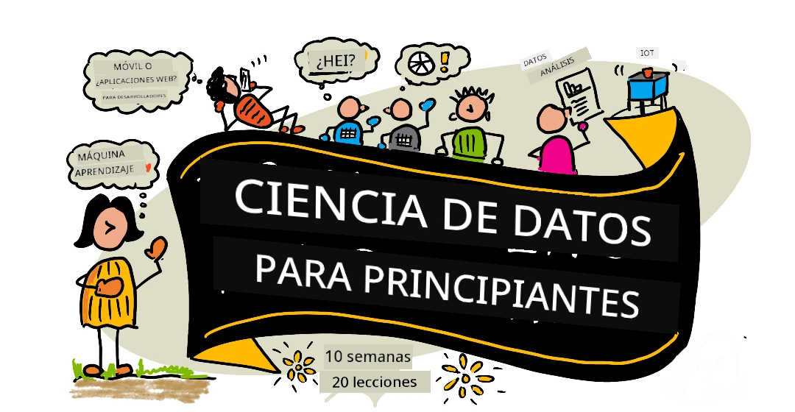
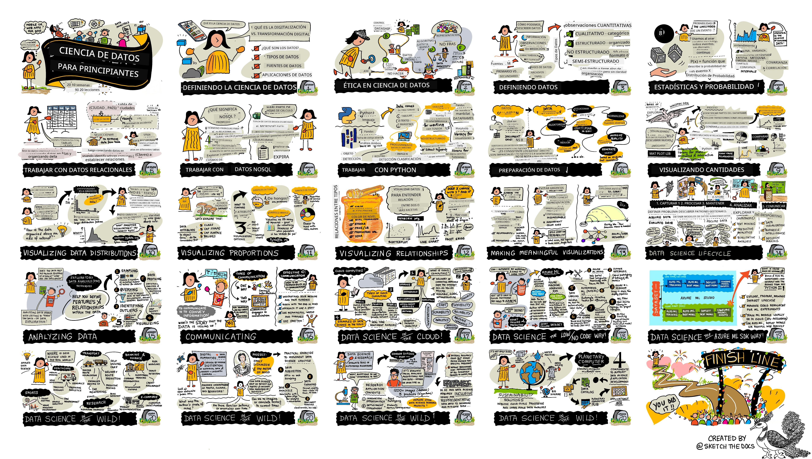

# Ciencia de Datos para Principiantes - Un Currículum

[](https://github.com/codespaces/new?hide_repo_select=true&ref=main&repo=344191198)

[](https://github.com/microsoft/Data-Science-For-Beginners/blob/master/LICENSE)
[](https://GitHub.com/microsoft/Data-Science-For-Beginners/graphs/contributors/)
[](https://GitHub.com/microsoft/Data-Science-For-Beginners/issues/)
[](https://GitHub.com/microsoft/Data-Science-For-Beginners/pulls/)
[](http://makeapullrequest.com)

[](https://GitHub.com/microsoft/Data-Science-For-Beginners/watchers/)
[](https://GitHub.com/microsoft/Data-Science-For-Beginners/network/)
[](https://GitHub.com/microsoft/Data-Science-For-Beginners/stargazers/)


[](https://discord.gg/nTYy5BXMWG)

[](https://aka.ms/foundry/forum)

Los Azure Cloud Advocates de Microsoft tienen el placer de ofrecer un currículo de 10 semanas y 20 lecciones sobre Ciencia de Datos. Cada lección incluye un cuestionario previo y posterior a la lección, instrucciones escritas para completar la lección, una solución y una tarea. Nuestra pedagogía basada en proyectos te permite aprender mientras construyes, una forma comprobada de que las nuevas habilidades se "fijen".

**Muchas gracias a nuestros autores:** [Jasmine Greenaway](https://www.twitter.com/paladique), [Dmitry Soshnikov](http://soshnikov.com), [Nitya Narasimhan](https://twitter.com/nitya), [Jalen McGee](https://twitter.com/JalenMcG), [Jen Looper](https://twitter.com/jenlooper), [Maud Levy](https://twitter.com/maudstweets), [Tiffany Souterre](https://twitter.com/TiffanySouterre), [Christopher Harrison](https://www.twitter.com/geektrainer).

**🙏 Agradecimientos especiales 🙏 a nuestros autores, revisores y colaboradores de contenido [Microsoft Student Ambassador](https://studentambassadors.microsoft.com/),** entre ellos Aaryan Arora, [Aditya Garg](https://github.com/AdityaGarg00), [Alondra Sanchez](https://www.linkedin.com/in/alondra-sanchez-molina/), [Ankita Singh](https://www.linkedin.com/in/ankitasingh007), [Anupam Mishra](https://www.linkedin.com/in/anupam--mishra/), [Arpita Das](https://www.linkedin.com/in/arpitadas01/), ChhailBihari Dubey, [Dibri Nsofor](https://www.linkedin.com/in/dibrinsofor), [Dishita Bhasin](https://www.linkedin.com/in/dishita-bhasin-7065281bb), [Majd Safi](https://www.linkedin.com/in/majd-s/), [Max Blum](https://www.linkedin.com/in/max-blum-6036a1186/), [Miguel Correa](https://www.linkedin.com/in/miguelmque/), [Mohamma Iftekher (Iftu) Ebne Jalal](https://twitter.com/iftu119), [Nawrin Tabassum](https://www.linkedin.com/in/nawrin-tabassum), [Raymond Wangsa Putra](https://www.linkedin.com/in/raymond-wp/), [Rohit Yadav](https://www.linkedin.com/in/rty2423), Samridhi Sharma, [Sanya Sinha](https://www.linkedin.com/mwlite/in/sanya-sinha-13aab1200),
[Sheena Narula](https://www.linkedin.com/in/sheena-narua-n/), [Tauqeer Ahmad](https://www.linkedin.com/in/tauqeerahmad5201/), Yogendrasingh Pawar , [Vidushi Gupta](https://www.linkedin.com/in/vidushi-gupta07/), [Jasleen Sondhi](https://www.linkedin.com/in/jasleen-sondhi/)

||
|:---:|
| Ciencia de Datos para Principiantes - _Sketchnote por [@nitya](https://twitter.com/nitya)_ |

### 🌐 Soporte Multilingüe

#### Soportado vía GitHub Action (Automatizado y siempre actualizado)

<!-- CO-OP TRANSLATOR LANGUAGES TABLE START -->
[Árabe](../ar/README.md) | [Bengalí](../bn/README.md) | [Búlgaro](../bg/README.md) | [Birmano (Myanmar)](../my/README.md) | [Chino (Simplificado)](../zh-CN/README.md) | [Chino (Tradicional, Hong Kong)](../zh-HK/README.md) | [Chino (Tradicional, Macao)](../zh-MO/README.md) | [Chino (Tradicional, Taiwán)](../zh-TW/README.md) | [Croata](../hr/README.md) | [Checo](../cs/README.md) | [Danés](../da/README.md) | [Neerlandés](../nl/README.md) | [Estonio](../et/README.md) | [Finlandés](../fi/README.md) | [Francés](../fr/README.md) | [Alemán](../de/README.md) | [Griego](../el/README.md) | [Hebreo](../he/README.md) | [Hindi](../hi/README.md) | [Húngaro](../hu/README.md) | [Indonesio](../id/README.md) | [Italiano](../it/README.md) | [Japonés](../ja/README.md) | [Kannada](../kn/README.md) | [Jemer](../km/README.md) | [Coreano](../ko/README.md) | [Lituano](../lt/README.md) | [Malayo](../ms/README.md) | [Malayalam](../ml/README.md) | [Maratí](../mr/README.md) | [Nepalí](../ne/README.md) | [Pidgin Nigeriano](../pcm/README.md) | [Noruego](../no/README.md) | [Persa (Farsi)](../fa/README.md) | [Polaco](../pl/README.md) | [Portugués (Brasil)](../pt-BR/README.md) | [Portugués (Portugal)](../pt-PT/README.md) | [Punjabi (Gurmukhi)](../pa/README.md) | [Rumano](../ro/README.md) | [Ruso](../ru/README.md) | [Serbio (Cirílico)](../sr/README.md) | [Eslovaco](../sk/README.md) | [Esloveno](../sl/README.md) | [Español](./README.md) | [Swahili](../sw/README.md) | [Sueco](../sv/README.md) | [Tagalo (Filipino)](../tl/README.md) | [Tamil](../ta/README.md) | [Telugu](../te/README.md) | [Tailandés](../th/README.md) | [Turco](../tr/README.md) | [Ucraniano](../uk/README.md) | [Urdu](../ur/README.md) | [Vietnamita](../vi/README.md)

> **¿Prefieres clonar localmente?**
>
> Este repositorio incluye más de 50 traducciones de idiomas, lo que aumenta significativamente el tamaño de la descarga. Para clonar sin traducciones, usa sparse checkout:
>
> **Bash / macOS / Linux:**
> ```bash
> git clone --filter=blob:none --sparse https://github.com/microsoft/Data-Science-For-Beginners.git
> cd Data-Science-For-Beginners
> git sparse-checkout set --no-cone '/*' '!translations' '!translated_images'
> ```
>
> **CMD (Windows):**
> ```cmd
> git clone --filter=blob:none --sparse https://github.com/microsoft/Data-Science-For-Beginners.git
> cd Data-Science-For-Beginners
> git sparse-checkout set --no-cone "/*" "!translations" "!translated_images"
> ```
>
> Esto te brinda todo lo que necesitas para completar el curso con una descarga mucho más rápida.
<!-- CO-OP TRANSLATOR LANGUAGES TABLE END -->

**Si deseas que se apoyen idiomas adicionales para las traducciones, se listan [aquí](https://github.com/Azure/co-op-translator/blob/main/getting_started/supported-languages.md)**

#### Únete a Nuestra Comunidad 
[](https://discord.gg/nTYy5BXMWG)

Tenemos en marcha una serie de aprendizaje en Discord con IA, aprende más y únete a nosotros en [Serie Aprende con IA](https://aka.ms/learnwithai/discord) del 18 al 30 de septiembre de 2025. Obtendrás consejos y trucos para usar GitHub Copilot para Ciencia de Datos.


# ¿Eres estudiante?

Comienza con los siguientes recursos:

- [Página del Centro para Estudiantes](https://docs.microsoft.com/en-gb/learn/student-hub?WT.mc_id=academic-77958-bethanycheum) En esta página encontrarás recursos para principiantes, paquetes para estudiantes e incluso formas de obtener un cupón para certificación gratis. Esta es una página que querrás tener en favoritos y revisar de vez en cuando, ya que cambiamos contenido al menos cada mes.
- [Microsoft Learn Student Ambassadors](https://studentambassadors.microsoft.com?WT.mc_id=academic-77958-bethanycheum) Únete a una comunidad global de embajadores estudiantiles, esta podría ser tu vía hacia Microsoft.

# Comenzando

## 📚 Documentación

- **[Guía de Instalación](INSTALLATION.md)** - Instrucciones paso a paso para principiantes
- **[Guía de Uso](USAGE.md)** - Ejemplos y flujos de trabajo comunes
- **[Solución de Problemas](TROUBLESHOOTING.md)** - Soluciones a problemas comunes
- **[Guía de Contribución](CONTRIBUTING.md)** - Cómo contribuir a este proyecto
- **[Para Profesores](for-teachers.md)** - Guía para la enseñanza y recursos para aulas

## 👨‍🎓 Para Estudiantes
> **Principiantes Completos**: ¿Nuevo en ciencia de datos? Comienza con nuestros [ejemplos amigables para principiantes](examples/README.md)! Estos ejemplos simples y bien comentados te ayudarán a entender lo básico antes de sumergirte en el currículo completo.
> **[Estudiantes](https://aka.ms/student-page)**: para usar este currículo por tu cuenta, haz un fork de todo el repositorio y completa los ejercicios por ti mismo, comenzando con un cuestionario previo a la lección. Luego lee la clase y completa el resto de las actividades. Intenta crear los proyectos comprendiendo las lecciones en lugar de copiar el código de la solución; sin embargo, ese código está disponible en las carpetas /solutions de cada lección orientada a proyectos. Otra idea sería formar un grupo de estudio con amigos y repasar juntos el contenido. Para estudiar más a fondo, recomendamos [Microsoft Learn](https://docs.microsoft.com/en-us/users/jenlooper-2911/collections/qprpajyoy3x0g7?WT.mc_id=academic-77958-bethanycheum).

**Inicio rápido:**
1. Revisa la [Guía de Instalación](INSTALLATION.md) para configurar tu entorno
2. Consulta la [Guía de Uso](USAGE.md) para aprender a trabajar con el currículo
3. Comienza con la Lección 1 y sigue secuencialmente
4. Únete a nuestra [comunidad en Discord](https://aka.ms/ds4beginners/discord) para recibir apoyo

## 👩‍🏫 Para Profesores
> **Profesores**: hemos [incluido algunas sugerencias](for-teachers.md) sobre cómo usar este currículo. ¡Nos encantaría recibir sus comentarios [en nuestro foro de discusión](https://github.com/microsoft/Data-Science-For-Beginners/discussions)!

## Conoce al Equipo

[](https://youtu.be/8mzavjQSMM4 "Video promocional")

**Gif por** [Mohit Jaisal](https://www.linkedin.com/in/mohitjaisal)

> 🎥 ¡Haz clic en la imagen de arriba para ver un video sobre el proyecto y las personas que lo crearon!

## Pedagogía

Hemos elegido dos principios pedagógicos al construir este currículo: asegurarnos de que sea basado en proyectos y que incluya cuestionarios frecuentes. Al final de esta serie, los estudiantes habrán aprendido principios básicos de ciencia de datos, incluyendo conceptos éticos, preparación de datos, diferentes formas de trabajar con datos, visualización de datos, análisis de datos, casos de uso reales de la ciencia de datos y más.

Además, un cuestionario de bajo riesgo antes de una clase establece la intención del estudiante hacia el aprendizaje de un tema, mientras que un segundo cuestionario después de la clase asegura una mayor retención. Este currículo fue diseñado para ser flexible y divertido y se puede tomar en su totalidad o en parte. Los proyectos comienzan pequeños y se vuelven cada vez más complejos al final del ciclo de 10 semanas.

> Encuentra nuestro [Código de Conducta](CODE_OF_CONDUCT.md), [Contribuciones](CONTRIBUTING.md), y pautas de [Traducción](TRANSLATIONS.md). ¡Agradecemos tus comentarios constructivos!

## Cada lección incluye:

- Esquema opcional (sketchnote)
- Video suplementario opcional
- Cuestionario previo a la lección
- Lección escrita
- Para lecciones basadas en proyectos, guías paso a paso sobre cómo construir el proyecto
- Chequeos de conocimiento
- Un reto
- Lectura suplementaria
- Asignación
- [Cuestionario post-lección](https://ff-quizzes.netlify.app/en/)

> **Una nota sobre los cuestionarios**: Todos los cuestionarios están contenidos en la carpeta Quiz-App, para un total de 40 cuestionarios con tres preguntas cada uno. Están enlazados dentro de las lecciones, pero la app de cuestionarios puede ejecutarse localmente o desplegarse en Azure; sigue las instrucciones en la carpeta `quiz-app`. Se están localizando gradualmente.

## 🎓 Ejemplos amigables para principiantes

**¿Nuevo en Ciencia de Datos?** Hemos creado un directorio especial de [ejemplos](examples/README.md) con código simple y bien comentado para ayudarte a comenzar:

- 🌟 **Hola Mundo** - Tu primer programa de ciencia de datos
- 📂 **Cargando Datos** - Aprende a leer y explorar conjuntos de datos
- 📊 **Análisis Simple** - Calcula estadísticas y encuentra patrones
- 📈 **Visualización Básica** - Crea gráficos y diagramas
- 🔬 **Proyecto del Mundo Real** - Flujo de trabajo completo de principio a fin

Cada ejemplo incluye comentarios detallados que explican cada paso, ¡perfecto para principiantes absolutos!

👉 **[Empieza con los ejemplos](examples/README.md)** 👈

## Lecciones


||
|:---:|
| Ciencia de Datos para Principiantes: Hoja de Ruta - _Esquema por [@nitya](https://twitter.com/nitya)_ |


| Número de Lección | Tema | Agrupación de Lección | Objetivos de Aprendizaje | Lección Enlazada | Autor |
| :---------------: | :----------------------------------------: | :----------------------------------------------: | :-----------------------------------------------------------------------------------------------------------------------------------------------------------------------: | :---------------------------------------------------------------------: | :----: |
| 01 | Definición de Ciencia de Datos | [Introducción](1-Introduction/README.md) | Aprende los conceptos básicos detrás de la ciencia de datos y cómo se relaciona con inteligencia artificial, aprendizaje automático y big data. | [lección](1-Introduction/01-defining-data-science/README.md) [video](https://youtu.be/beZ7Mb_oz9I) | [Dmitry](http://soshnikov.com) |
| 02 | Ética en Ciencia de Datos | [Introducción](1-Introduction/README.md) | Conceptos, desafíos y marcos de ética en datos. | [lección](1-Introduction/02-ethics/README.md) | [Nitya](https://twitter.com/nitya) |
| 03 | Definiendo Datos | [Introducción](1-Introduction/README.md) | Cómo se clasifican los datos y sus fuentes comunes. | [lección](1-Introduction/03-defining-data/README.md) | [Jasmine](https://www.twitter.com/paladique) |
| 04 | Introducción a Estadística y Probabilidad | [Introducción](1-Introduction/README.md) | Técnicas matemáticas de probabilidad y estadística para entender datos. | [lección](1-Introduction/04-stats-and-probability/README.md) [video](https://youtu.be/Z5Zy85g4Yjw) | [Dmitry](http://soshnikov.com) |
| 05 | Trabajando con Datos Relacionales | [Trabajando con Datos](2-Working-With-Data/README.md) | Introducción a datos relacionales y conceptos básicos de exploración y análisis con el Lenguaje de Consulta Estructurada, conocido como SQL (pronunciado “see-quell”). | [lección](2-Working-With-Data/05-relational-databases/README.md) | [Christopher](https://www.twitter.com/geektrainer) | | |
| 06 | Trabajando con Datos NoSQL | [Trabajando con Datos](2-Working-With-Data/README.md) | Introducción a datos no relacionales, sus tipos diversos y los conceptos básicos para explorar y analizar bases de datos de documentos. | [lección](2-Working-With-Data/06-non-relational/README.md) | [Jasmine](https://twitter.com/paladique)|
| 07 | Trabajando con Python | [Trabajando con Datos](2-Working-With-Data/README.md) | Fundamentos del uso de Python para exploración de datos con librerías como Pandas. Se recomienda un entendimiento básico de programación en Python. | [lección](2-Working-With-Data/07-python/README.md) [video](https://youtu.be/dZjWOGbsN4Y) | [Dmitry](http://soshnikov.com) |
| 08 | Preparación de Datos | [Trabajando con Datos](2-Working-With-Data/README.md) | Temas sobre técnicas de datos para limpiar y transformar la información para manejar datos faltantes, inexactos o incompletos. | [lección](2-Working-With-Data/08-data-preparation/README.md) | [Jasmine](https://www.twitter.com/paladique) |
| 09 | Visualización de Cantidades | [Visualización de Datos](3-Data-Visualization/README.md) | Aprende a usar Matplotlib para visualizar datos de aves 🦆 | [lección](3-Data-Visualization/09-visualization-quantities/README.md) | [Jen](https://twitter.com/jenlooper) |
| 10 | Visualización de Distribuciones de Datos | [Visualización de Datos](3-Data-Visualization/README.md) | Visualizar observaciones y tendencias dentro de un intervalo. | [lección](3-Data-Visualization/10-visualization-distributions/README.md) | [Jen](https://twitter.com/jenlooper) |
| 11 | Visualización de Proporciones | [Visualización de Datos](3-Data-Visualization/README.md) | Visualizar porcentajes discretos y agrupados. | [lección](3-Data-Visualization/11-visualization-proportions/README.md) | [Jen](https://twitter.com/jenlooper) |
| 12 | Visualización de Relaciones | [Visualización de Datos](3-Data-Visualization/README.md) | Visualizar conexiones y correlaciones entre conjuntos de datos y sus variables. | [lección](3-Data-Visualization/12-visualization-relationships/README.md) | [Jen](https://twitter.com/jenlooper) |
| 13 | Visualizaciones Significativas | [Visualización de Datos](3-Data-Visualization/README.md) | Técnicas y orientación para hacer que tus visualizaciones sean valiosas para la resolución efectiva de problemas e insights. | [lección](3-Data-Visualization/13-meaningful-visualizations/README.md) | [Jen](https://twitter.com/jenlooper) |
| 14 | Introducción al ciclo de vida de Ciencia de Datos | [Ciclo de Vida](4-Data-Science-Lifecycle/README.md) | Introducción al ciclo de vida de la ciencia de datos y su primer paso: adquisición y extracción de datos. | [lección](4-Data-Science-Lifecycle/14-Introduction/README.md) | [Jasmine](https://twitter.com/paladique) |
| 15 | Análisis | [Ciclo de Vida](4-Data-Science-Lifecycle/README.md) | Esta fase del ciclo de vida de la ciencia de datos se enfoca en técnicas para analizar datos. | [lección](4-Data-Science-Lifecycle/15-analyzing/README.md) | [Jasmine](https://twitter.com/paladique) | | |
| 16 | Comunicación | [Ciclo de Vida](4-Data-Science-Lifecycle/README.md) | Esta fase del ciclo de vida de la ciencia de datos se enfoca en presentar los insights de los datos de una forma que facilite la comprensión a los tomadores de decisiones. | [lección](4-Data-Science-Lifecycle/16-communication/README.md) | [Jalen](https://twitter.com/JalenMcG) | | |
| 17 | Ciencia de Datos en la Nube | [Datos en la Nube](5-Data-Science-In-Cloud/README.md) | Esta serie de lecciones introduce la ciencia de datos en la nube y sus beneficios. | [lección](5-Data-Science-In-Cloud/17-Introduction/README.md) | [Tiffany](https://twitter.com/TiffanySouterre) y [Maud](https://twitter.com/maudstweets) |
| 18 | Ciencia de Datos en la Nube | [Datos en la Nube](5-Data-Science-In-Cloud/README.md) | Entrenamiento de modelos usando herramientas de Bajo Código. |[lección](5-Data-Science-In-Cloud/18-Low-Code/README.md) | [Tiffany](https://twitter.com/TiffanySouterre) y [Maud](https://twitter.com/maudstweets) |
| 19 | Ciencia de Datos en la Nube | [Datos en la Nube](5-Data-Science-In-Cloud/README.md) | Despliegue de modelos con Azure Machine Learning Studio. | [lección](5-Data-Science-In-Cloud/19-Azure/README.md)| [Tiffany](https://twitter.com/TiffanySouterre) y [Maud](https://twitter.com/maudstweets) |
| 20 | Ciencia de Datos en el Mundo Real | [En el Mundo Real](6-Data-Science-In-Wild/README.md) | Proyectos impulsados por ciencia de datos en el mundo real. | [lección](6-Data-Science-In-Wild/20-Real-World-Examples/README.md) | [Nitya](https://twitter.com/nitya) |

## GitHub Codespaces

Sigue estos pasos para abrir esta muestra en un Codespace:
1. Haz clic en el menú desplegable de Código y selecciona la opción Abrir con Codespaces.
2. Selecciona + Nuevo codespace en la parte inferior del panel.
Para más información, consulta la [documentación de GitHub](https://docs.github.com/en/codespaces/developing-in-codespaces/creating-a-codespace-for-a-repository#creating-a-codespace).

## VSCode Remote - Containers
Sigue estos pasos para abrir este repositorio en un contenedor usando tu máquina local y VSCode con la extensión  VS Code Remote - Containers:

1. Si es tu primera vez usando un contenedor de desarrollo, asegúrate de que tu sistema cumple los requisitos previos (es decir, tener Docker instalado) en [la documentación para empezar](https://code.visualstudio.com/docs/devcontainers/containers#_getting-started).

Para usar este repositorio, puedes abrirlo en un volumen Docker aislado:

**Nota**: Bajo el capó, esto usará el comando Remote-Containers: **Clone Repository in Container Volume...** para clonar el código fuente en un volumen Docker en lugar del sistema de archivos local. Los [volúmenes](https://docs.docker.com/storage/volumes/) son el mecanismo preferido para persistir datos del contenedor.

O abrir una versión clonada o descargada localmente del repositorio:

- Clona este repositorio en tu sistema de archivos local.
- Presiona F1 y selecciona el comando **Remote-Containers: Open Folder in Container...**.
- Selecciona la copia clonada de esta carpeta, espera a que el contenedor inicie y prueba.

## Acceso sin conexión

Puedes ejecutar esta documentación sin conexión usando [Docsify](https://docsify.js.org/#/). Haz un fork de este repo, [instala Docsify](https://docsify.js.org/#/quickstart) en tu máquina local, luego en la carpeta raíz de este repo, escribe `docsify serve`. El sitio web se servirá en el puerto 3000 en tu localhost: `localhost:3000`.

> Nota: los cuadernos (notebooks) no se renderizarán via Docsify, así que cuando necesites ejecutar un cuaderno, hazlo por separado en VS Code con un kernel de Python.

## Otros Currículos

¡Nuestro equipo produce otros currículos! Consulta:

<!-- CO-OP TRANSLATOR OTHER COURSES START -->
### LangChain
[](https://aka.ms/langchain4j-for-beginners)
[](https://aka.ms/langchainjs-for-beginners?WT.mc_id=m365-94501-dwahlin)
[](https://github.com/microsoft/langchain-for-beginners?WT.mc_id=m365-94501-dwahlin)
---

### Azure / Edge / MCP / Agentes
[](https://github.com/microsoft/AZD-for-beginners?WT.mc_id=academic-105485-koreyst)
[](https://github.com/microsoft/edgeai-for-beginners?WT.mc_id=academic-105485-koreyst)
[](https://github.com/microsoft/mcp-for-beginners?WT.mc_id=academic-105485-koreyst)
[](https://github.com/microsoft/ai-agents-for-beginners?WT.mc_id=academic-105485-koreyst)

---
 
### Serie de IA Generativa
[](https://github.com/microsoft/generative-ai-for-beginners?WT.mc_id=academic-105485-koreyst)
[-9333EA?style=for-the-badge&labelColor=E5E7EB&color=9333EA)](https://github.com/microsoft/Generative-AI-for-beginners-dotnet?WT.mc_id=academic-105485-koreyst)
[-C084FC?style=for-the-badge&labelColor=E5E7EB&color=C084FC)](https://github.com/microsoft/generative-ai-for-beginners-java?WT.mc_id=academic-105485-koreyst)
[-E879F9?style=for-the-badge&labelColor=E5E7EB&color=E879F9)](https://github.com/microsoft/generative-ai-with-javascript?WT.mc_id=academic-105485-koreyst)

---
 
### Aprendizaje Básico
[](https://aka.ms/ml-beginners?WT.mc_id=academic-105485-koreyst)
[](https://aka.ms/datascience-beginners?WT.mc_id=academic-105485-koreyst)
[](https://aka.ms/ai-beginners?WT.mc_id=academic-105485-koreyst)
[](https://github.com/microsoft/Security-101?WT.mc_id=academic-96948-sayoung)
[](https://aka.ms/webdev-beginners?WT.mc_id=academic-105485-koreyst)
[](https://aka.ms/iot-beginners?WT.mc_id=academic-105485-koreyst)
[](https://github.com/microsoft/xr-development-for-beginners?WT.mc_id=academic-105485-koreyst)

---
 
### Serie Copilot
[](https://aka.ms/GitHubCopilotAI?WT.mc_id=academic-105485-koreyst)
[](https://github.com/microsoft/mastering-github-copilot-for-dotnet-csharp-developers?WT.mc_id=academic-105485-koreyst)
[](https://github.com/microsoft/CopilotAdventures?WT.mc_id=academic-105485-koreyst)
<!-- CO-OP TRANSLATOR OTHER COURSES END -->

## Obtener Ayuda

**¿Tienes problemas?** Consulta nuestra [Guía de Solución de Problemas](TROUBLESHOOTING.md) para soluciones a problemas comunes.

Si te quedas atascado o tienes alguna pregunta sobre cómo construir aplicaciones de IA. Únete a otros aprendices y desarrolladores experimentados en discusiones sobre MCP. Es una comunidad de apoyo donde las preguntas son bienvenidas y el conocimiento se comparte libremente.

[](https://discord.gg/nTYy5BXMWG)

Si tienes comentarios sobre productos o errores mientras construyes visita:

[](https://aka.ms/foundry/forum)

---

<!-- CO-OP TRANSLATOR DISCLAIMER START -->
**Descargo de responsabilidad**:  
Este documento ha sido traducido utilizando el servicio de traducción automática [Co-op Translator](https://github.com/Azure/co-op-translator). Aunque nos esforzamos por la precisión, tenga en cuenta que las traducciones automáticas pueden contener errores o inexactitudes. El documento original en su idioma nativo debe considerarse la fuente autorizada. Para información crítica, se recomienda la traducción profesional humana. No nos hacemos responsables de malentendidos o interpretaciones erróneas resultantes del uso de esta traducción.
<!-- CO-OP TRANSLATOR DISCLAIMER END -->