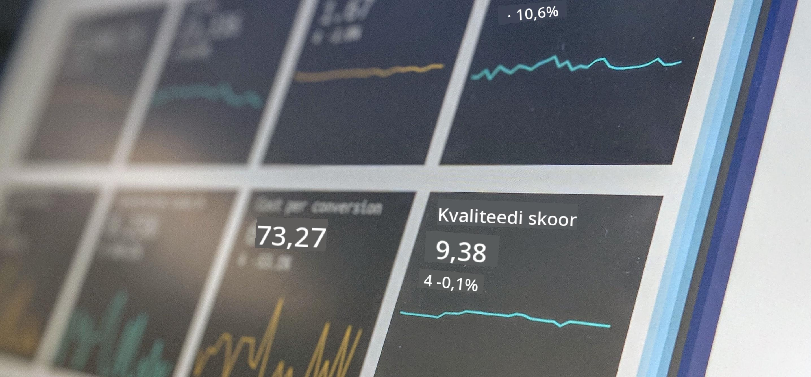

<!--
CO_OP_TRANSLATOR_METADATA:
{
  "original_hash": "696a8474a01054281704cbfb09148949",
  "translation_date": "2025-10-11T15:32:32+00:00",
  "source_file": "1-Introduction/README.md",
  "language_code": "et"
}
-->
# Sissejuhatus andmeteadusesse

> Foto autorilt <a href="https://unsplash.com/@dawson2406?utm_source=unsplash&utm_medium=referral&utm_content=creditCopyText">Stephen Dawson</a> lehel <a href="https://unsplash.com/s/photos/data?utm_source=unsplash&utm_medium=referral&utm_content=creditCopyText">Unsplash</a>
  
Nendes tundides avastad, kuidas andmeteadust defineeritakse, ning õpid tundma eetilisi kaalutlusi, mida andmeteadlane peab arvesse võtma. Samuti saad teada, kuidas andmeid defineeritakse, ning õpid veidi statistika ja tõenäosusteooria kohta, mis on andmeteaduse põhivaldkonnad.

### Teemad

1. [Andmeteaduse defineerimine](01-defining-data-science/README.md)
2. [Andmeteaduse eetika](02-ethics/README.md)
3. [Andmete defineerimine](03-defining-data/README.md)
4. [Sissejuhatus statistikasse ja tõenäosusteooriasse](04-stats-and-probability/README.md)

### Autorid

Need tunnid on kirjutatud ❤️ poolt [Nitya Narasimhan](https://twitter.com/nitya) ja [Dmitry Soshnikov](https://twitter.com/shwars).

---

**Lahtiütlus**:  
See dokument on tõlgitud AI tõlketeenuse [Co-op Translator](https://github.com/Azure/co-op-translator) abil. Kuigi püüame tagada täpsust, palume arvestada, et automaatsed tõlked võivad sisaldada vigu või ebatäpsusi. Originaaldokumenti selle algses keeles tuleks pidada autoriteetseks allikaks. Olulise teabe puhul soovitame kasutada professionaalset inimtõlget. Me ei vastuta selle tõlke kasutamisest tulenevate arusaamatuste või valesti tõlgenduste eest.