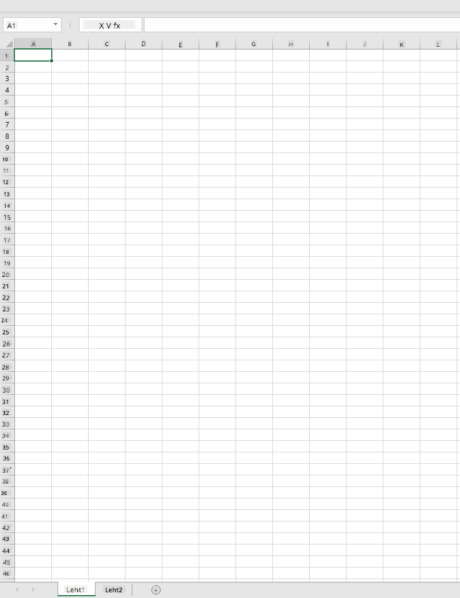
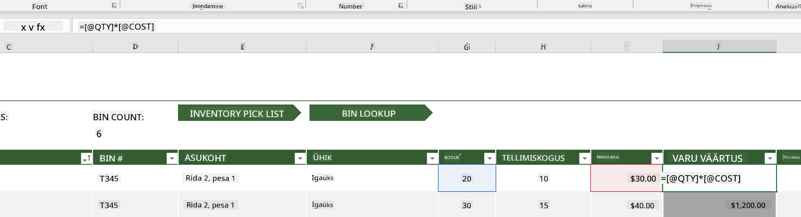
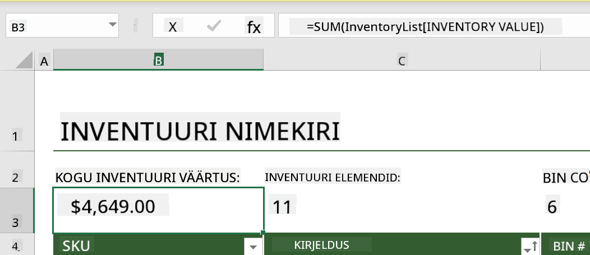
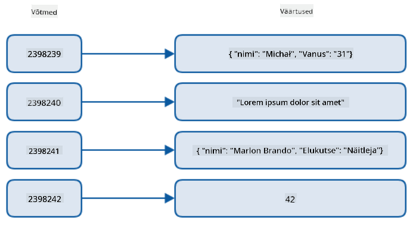
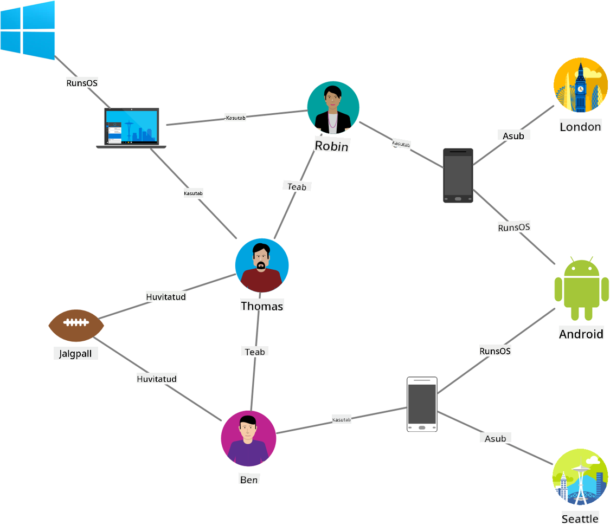
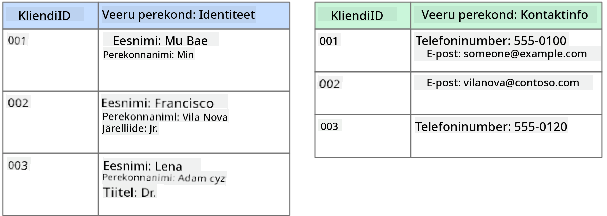
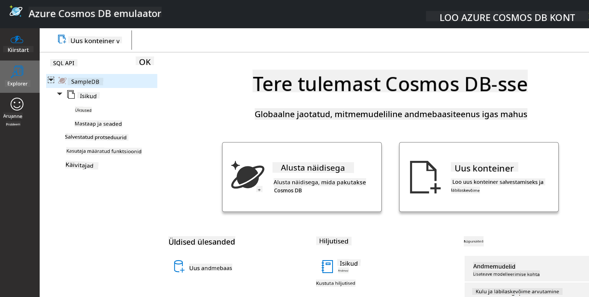
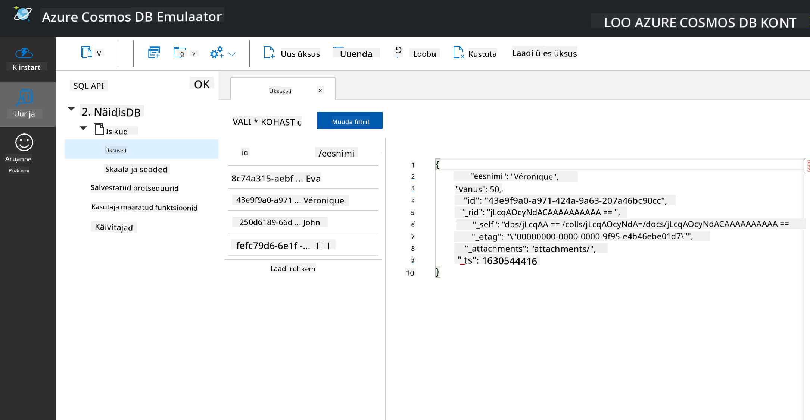
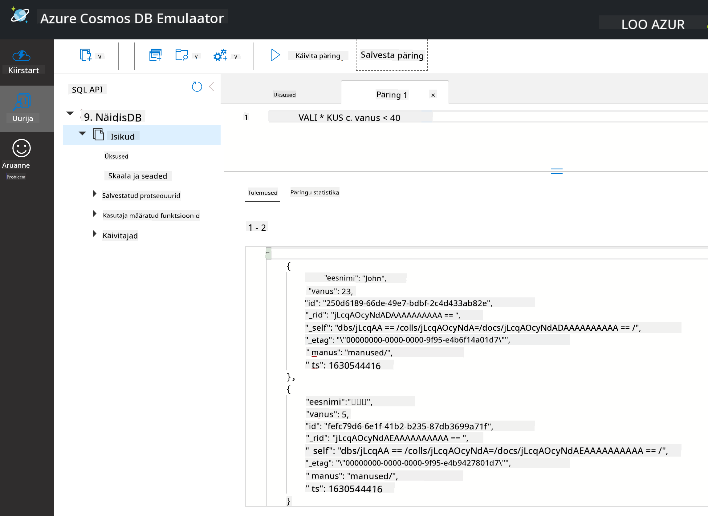

<!--
CO_OP_TRANSLATOR_METADATA:
{
  "original_hash": "c182e87f9f80be7e7cdffc7b40bbfccf",
  "translation_date": "2025-10-11T15:23:01+00:00",
  "source_file": "2-Working-With-Data/06-non-relational/README.md",
  "language_code": "et"
}
-->
# Töötamine andmetega: Mitte-relatsioonilised andmed

| ](../../sketchnotes/06-NoSQL.png)|
|:---:|
|Töötamine NoSQL andmetega - _Sketchnote autorilt [@nitya](https://twitter.com/nitya)_ |

## [Eelloengu viktoriin](https://ff-quizzes.netlify.app/en/ds/quiz/10)

Andmed ei piirdu ainult relatsiooniliste andmebaasidega. See õppetund keskendub mitte-relatsioonilistele andmetele ja hõlmab tabelarvutuste ning NoSQL-i põhitõdesid.

## Tabelarvutused

Tabelarvutused on populaarne viis andmete salvestamiseks ja uurimiseks, kuna nende seadistamine ja kasutuselevõtt nõuab vähem tööd. Selles õppetunnis õpid tabelarvutuse põhikomponente, samuti valemeid ja funktsioone. Näited illustreeritakse Microsoft Exceliga, kuid enamik osasid ja teemasid on sarnaste nimede ja sammudega võrreldavad teiste tabelarvutustarkvaradega.



Tabelarvutus on fail, mis on ligipääsetav arvuti, seadme või pilvepõhise failisüsteemi failisüsteemis. Tarkvara ise võib olla brauseripõhine või rakendus, mis tuleb arvutisse installida või rakendusena alla laadida. Excelis nimetatakse neid faile **töövihikuteks** ja seda terminoloogiat kasutatakse kogu õppetunni vältel.

Töövihik sisaldab ühte või mitut **töölehte**, kus iga tööleht on tähistatud vahekaartidega. Töölehel on ristkülikud, mida nimetatakse **lahtriteks**, mis sisaldavad tegelikke andmeid. Lahter on rea ja veeru ristumiskoht, kus veerud on tähistatud tähestikuliste tähemärkidega ja read numbriliselt. Mõned tabelarvutused sisaldavad esimestel ridadel päiseid, mis kirjeldavad lahtris olevaid andmeid.

Nende Exceli töövihiku põhielementidega kasutame näidet [Microsofti mallidest](https://templates.office.com/), mis keskendub inventarile, et tutvuda tabelarvutuse täiendavate osadega.

### Inventari haldamine

Tabelarvutusfail nimega "InventoryExample" on vormindatud inventari esemete tabelarvutus, mis sisaldab kolme töölehte, kus vahekaardid on tähistatud "Inventory List", "Inventory Pick List" ja "Bin Lookup". Inventari loendi töölehe 4. rida on päis, mis kirjeldab iga lahtri väärtust päiseveerus.



On juhtumeid, kus lahtri väärtus sõltub teiste lahtrite väärtustest, et genereerida oma väärtus. Inventari loendi tabelarvutus jälgib iga inventari eseme maksumust, kuid mis siis, kui me peame teadma kogu inventari väärtust? [**Valemid**](https://support.microsoft.com/en-us/office/overview-of-formulas-34519a4e-1e8d-4f4b-84d4-d642c4f63263) teostavad toiminguid lahtriandmetega ja neid kasutatakse inventari maksumuse arvutamiseks selles näites. See tabelarvutus kasutab valemit inventari väärtuse veerus, et arvutada iga eseme väärtus, korrutades koguse päise QTY all ja selle maksumuse päise COST all olevate lahtritega. Lahtri topeltklõpsamine või esiletõstmine näitab valemit. Näed, et valemid algavad võrdusmärgiga, millele järgneb arvutus või toiming.



Me saame kasutada teist valemit, et liita kõik inventari väärtuse lahtrid kokku ja saada selle koguväärtus. Seda võiks arvutada, liites iga lahtri, et genereerida summa, kuid see võib olla tülikas ülesanne. Excelil on [**funktsioonid**](https://support.microsoft.com/en-us/office/sum-function-043e1c7d-7726-4e80-8f32-07b23e057f89), ehk eelmääratud valemid, mis teostavad arvutusi lahtriandmetega. Funktsioonid vajavad argumente, mis on vajalikud väärtused nende arvutuste tegemiseks. Kui funktsioonid vajavad rohkem kui ühte argumenti, tuleb need loetleda kindlas järjekorras, vastasel juhul ei pruugi funktsioon arvutada õiget väärtust. Selles näites kasutatakse SUM-funktsiooni ja inventari väärtuse väärtusi argumendina, et genereerida kogusumma, mis on loetletud rea 3, veeru B all (tuntud ka kui B3).

## NoSQL

NoSQL on üldtermin erinevate viiside kohta mitte-relatsiooniliste andmete salvestamiseks ja seda võib tõlgendada kui "mitte-SQL", "mitte-relatsiooniline" või "mitte ainult SQL". Selliseid andmebaasisüsteeme saab kategoriseerida nelja tüüpi.


> Allikas: [Michał Białecki Blog](https://www.michalbialecki.com/2018/03/18/azure-cosmos-db-key-value-database-cloud/)

[Võtme-väärtuse](https://docs.microsoft.com/en-us/azure/architecture/data-guide/big-data/non-relational-data#keyvalue-data-stores) andmebaasid seovad unikaalsed võtmed, mis on unikaalsed identifikaatorid, väärtusega. Need paarid salvestatakse [hash-tabelis](https://www.hackerearth.com/practice/data-structures/hash-tables/basics-of-hash-tables/tutorial/) sobiva hash-funktsiooniga.


> Allikas: [Microsoft](https://docs.microsoft.com/en-us/azure/cosmos-db/graph/graph-introduction#graph-database-by-example)

[Graafi](https://docs.microsoft.com/en-us/azure/architecture/data-guide/big-data/non-relational-data#graph-data-stores) andmebaasid kirjeldavad andmete seoseid ja on esitatud sõlmede ja servade kogumina. Sõlm esindab üksust, midagi, mis eksisteerib pärismaailmas, näiteks õpilane või pangaväljavõte. Servad esindavad kahe üksuse vahelist seost. Igal sõlmel ja serval on omadused, mis annavad täiendavat teavet iga sõlme ja serva kohta.



[Veerupõhised](https://docs.microsoft.com/en-us/azure/architecture/data-guide/big-data/non-relational-data#columnar-data-stores) andmehoidlad korraldavad andmeid veergudesse ja ridadesse nagu relatsiooniline andmestruktuur, kuid iga veerg jagatakse gruppidesse, mida nimetatakse veeruperekonnaks, kus kõik ühe veeru andmed on seotud ja neid saab ühes üksuses hankida ja muuta.

### Dokumentide andmehoidlad Azure Cosmos DB-ga

[Dokumentide](https://docs.microsoft.com/en-us/azure/architecture/data-guide/big-data/non-relational-data#document-data-stores) andmehoidlad põhinevad võtme-väärtuse andmehoidla kontseptsioonil ja koosnevad väljade ja objektide kogumist. Selles jaotises uuritakse dokumentide andmebaase Cosmos DB emulaatoriga.

Cosmos DB andmebaas vastab "mitte ainult SQL" definitsioonile, kus Cosmos DB dokumentide andmebaas tugineb SQL-ile andmete pärimiseks. [Eelmine õppetund](../05-relational-databases/README.md) SQL-i kohta hõlmab keele põhitõdesid ja me saame rakendada mõningaid samu päringuid dokumentide andmebaasis siin. Kasutame Cosmos DB emulaatorit, mis võimaldab meil luua ja uurida dokumentide andmebaasi kohapeal arvutis. Loe emulaatori kohta lähemalt [siin](https://docs.microsoft.com/en-us/azure/cosmos-db/local-emulator?tabs=ssl-netstd21).

Dokument on väljade ja objektiväärtuste kogum, kus väljad kirjeldavad, mida objektiväärtus esindab. Allpool on näide dokumendist.

```json
{
    "firstname": "Eva",
    "age": 44,
    "id": "8c74a315-aebf-4a16-bb38-2430a9896ce5",
    "_rid": "bHwDAPQz8s0BAAAAAAAAAA==",
    "_self": "dbs/bHwDAA==/colls/bHwDAPQz8s0=/docs/bHwDAPQz8s0BAAAAAAAAAA==/",
    "_etag": "\"00000000-0000-0000-9f95-010a691e01d7\"",
    "_attachments": "attachments/",
    "_ts": 1630544034
}
```

Selle dokumendi huvipakkuvad väljad on: `firstname`, `id` ja `age`. Ülejäänud väljad koos allkriipsudega genereeriti Cosmos DB poolt.

#### Andmete uurimine Cosmos DB emulaatoriga

Saate emulaatori alla laadida ja installida [Windowsi jaoks siit](https://aka.ms/cosmosdb-emulator). Vaadake [dokumentatsiooni](https://docs.microsoft.com/en-us/azure/cosmos-db/local-emulator?tabs=ssl-netstd21#run-on-linux-macos) võimaluste kohta, kuidas emulaatorit macOS-i ja Linuxi jaoks käivitada.

Emulaator avab brauseriakna, kus Explorer vaade võimaldab dokumente uurida.



Kui järgite juhiseid, klõpsake "Start with Sample", et genereerida näidisandmebaas nimega SampleDB. Kui laiendate SampleDB-d, klõpsates noolel, leiate konteineri nimega `Persons`. Konteiner sisaldab esemete kogumit, mis on konteineri dokumendid. Saate uurida nelja individuaalset dokumenti `Items` all.



#### Dokumentide andmete pärimine Cosmos DB emulaatoriga

Saame ka näidisandmeid pärida, klõpsates uue SQL Query nupul (teine nupp vasakult).

`SELECT * FROM c` tagastab kõik dokumendid konteineris. Lisame where klausli ja otsime kõiki, kes on nooremad kui 40.

`SELECT * FROM c where c.age < 40`



Päring tagastab kaks dokumenti, märkige, et iga dokumendi age-väärtus on väiksem kui 40.

#### JSON ja dokumendid

Kui olete tuttav JavaScript Object Notation (JSON) formaadiga, märkate, et dokumendid näevad välja sarnased JSON-iga. Selles kataloogis on `PersonsData.json` fail, mille saate üles laadida Persons konteinerisse emulaatoris, kasutades `Upload Item` nuppu.

Enamasti saab API-d, mis tagastavad JSON-andmeid, otse üle kanda ja salvestada dokumentide andmebaasidesse. Allpool on veel üks dokument, mis esindab Microsofti Twitteri konto säutse, mis saadi Twitter API abil ja sisestati Cosmos DB-sse.

```json
{
    "created_at": "2021-08-31T19:03:01.000Z",
    "id": "1432780985872142341",
    "text": "Blank slate. Like this tweet if you’ve ever painted in Microsoft Paint before. https://t.co/cFeEs8eOPK",
    "_rid": "dhAmAIUsA4oHAAAAAAAAAA==",
    "_self": "dbs/dhAmAA==/colls/dhAmAIUsA4o=/docs/dhAmAIUsA4oHAAAAAAAAAA==/",
    "_etag": "\"00000000-0000-0000-9f84-a0958ad901d7\"",
    "_attachments": "attachments/",
    "_ts": 1630537000
```

Selle dokumendi huvipakkuvad väljad on: `created_at`, `id` ja `text`.

## 🚀 Väljakutse

Kataloogis on `TwitterData.json` fail, mille saate üles laadida SampleDB andmebaasi. Soovitatav on lisada see eraldi konteinerisse. Seda saab teha järgmiselt:

1. Klõpsake paremas ülanurgas uue konteineri nupul
1. Valige olemasolev andmebaas (SampleDB), looge konteineri ID konteinerile
1. Määrake partitsioonivõti `/id`
1. Klõpsake OK (võite ignoreerida ülejäänud teavet selles vaates, kuna tegemist on väikese andmekogumiga, mis töötab kohapeal teie arvutis)
1. Avage oma uus konteiner ja laadige Twitter Data fail üles `Upload Item` nupuga

Proovige käivitada mõned SELECT päringud, et leida dokumendid, mille tekstiväljas on Microsoft. Vihje: proovige kasutada [LIKE märksõna](https://docs.microsoft.com/en-us/azure/cosmos-db/sql/sql-query-keywords#using-like-with-the--wildcard-character).

## [Järelloengu viktoriin](https://ff-quizzes.netlify.app/en/ds/quiz/11)

## Ülevaade ja iseseisev õppimine

- Selles tabelarvutuses on lisatud mõningaid täiendavaid vormindusi ja funktsioone, mida see õppetund ei käsitle. Microsoftil on [suur dokumentatsiooni ja videote raamatukogu](https://support.microsoft.com/excel) Exceli kohta, kui olete huvitatud rohkem õppimisest.

- See arhitektuuriline dokumentatsioon kirjeldab erinevat tüüpi mitte-relatsiooniliste andmete omadusi: [Mitte-relatsioonilised andmed ja NoSQL](https://docs.microsoft.com/en-us/azure/architecture/data-guide/big-data/non-relational-data)

- Cosmos DB on pilvepõhine mitte-relatsiooniline andmebaas, mis suudab salvestada ka erinevaid NoSQL tüüpe, mida selles õppetunnis mainiti. Lisateavet nende tüüpide kohta leiate [Cosmos DB Microsoft Learn moodulist](https://docs.microsoft.com/en-us/learn/paths/work-with-nosql-data-in-azure-cosmos-db/).

## Ülesanne

[Sooda kasumid](assignment.md)

---

**Lahtiütlus**:  
See dokument on tõlgitud AI tõlketeenuse [Co-op Translator](https://github.com/Azure/co-op-translator) abil. Kuigi püüame tagada täpsust, palume arvestada, et automaatsed tõlked võivad sisaldada vigu või ebatäpsusi. Algne dokument selle algses keeles tuleks pidada autoriteetseks allikaks. Olulise teabe puhul soovitame kasutada professionaalset inimtõlget. Me ei vastuta selle tõlke kasutamisest tulenevate arusaamatuste või valesti tõlgenduste eest.