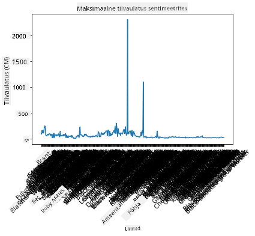
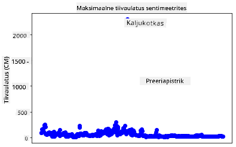
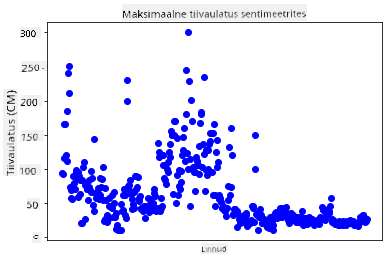
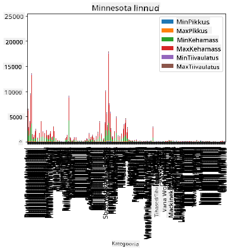
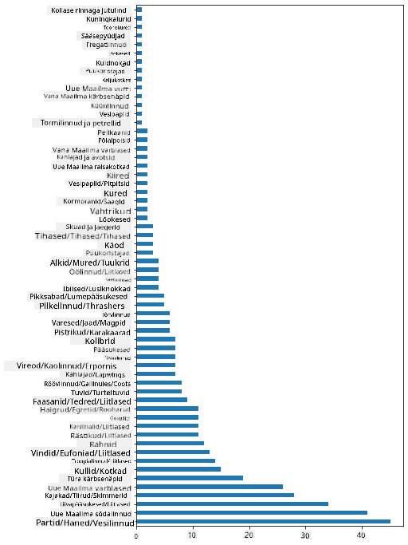
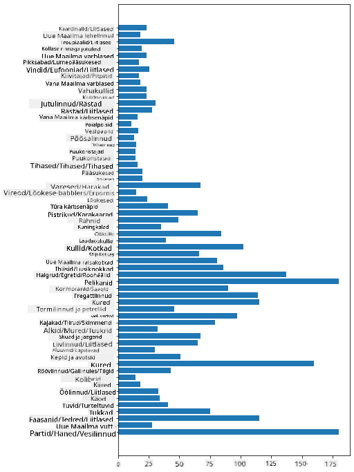
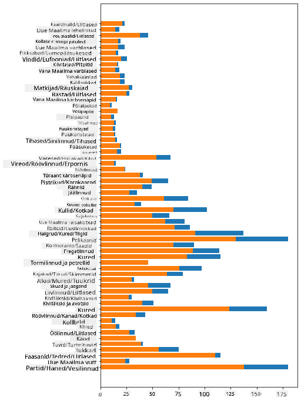

<!--
CO_OP_TRANSLATOR_METADATA:
{
  "original_hash": "a49d78e32e280c410f04e5f2a2068e77",
  "translation_date": "2025-10-11T16:05:03+00:00",
  "source_file": "3-Data-Visualization/09-visualization-quantities/README.md",
  "language_code": "et"
}
-->
# Koguste visualiseerimine

| ](../../sketchnotes/09-Visualizing-Quantities.png)|
|:---:|
| Koguste visualiseerimine - _Sketchnote by [@nitya](https://twitter.com/nitya)_ |

Selles tunnis uurid, kuidas kasutada ühte paljudest Python'i teekidest, et õppida looma huvitavaid visualiseeringuid koguste kontseptsiooni ümber. Kasutades puhastatud andmekogumit Minnesota lindude kohta, saad teada palju huvitavaid fakte kohaliku eluslooduse kohta.  
## [Eelloengu viktoriin](https://ff-quizzes.netlify.app/en/ds/quiz/16)

## Tiivaulatuse vaatlemine Matplotlibiga

Suurepärane teek erinevate lihtsate ja keerukate graafikute ning diagrammide loomiseks on [Matplotlib](https://matplotlib.org/stable/index.html). Üldiselt hõlmab andmete visualiseerimise protsess nende teekide abil andmekogumi osade tuvastamist, mida soovid sihtida, vajalike andmetransformatsioonide tegemist, x- ja y-telje väärtuste määramist, graafiku tüübi valimist ja graafiku kuvamist. Matplotlib pakub laia valikut visualiseeringuid, kuid selles tunnis keskendume kõige sobivamatele koguste visualiseerimiseks: joondiagrammid, hajusdiagrammid ja tulpdiagrammid.

> ✅ Kasuta graafikut, mis sobib kõige paremini sinu andmete struktuuri ja loo jutustamiseks.  
> - Trendide analüüsimiseks ajas: joon  
> - Väärtuste võrdlemiseks: tulp, veerg, sektordiagramm, hajusdiagramm  
> - Osade ja terviku suhte näitamiseks: sektordiagramm  
> - Andmete jaotuse näitamiseks: hajusdiagramm, tulp  
> - Trendide näitamiseks: joon, veerg  
> - Väärtustevaheliste seoste näitamiseks: joon, hajusdiagramm, mull  

Kui sul on andmekogum ja soovid teada saada, kui palju mingit konkreetset eset sisaldub, on üks esimesi ülesandeid selle väärtuste uurimine.

✅ Matplotlibi jaoks on saadaval väga head 'spikrid' [siin](https://matplotlib.org/cheatsheets/cheatsheets.pdf).

## Loo joondiagramm lindude tiivaulatuse väärtuste kohta

Ava `notebook.ipynb` fail selle tunni kausta juurest ja lisa lahter.

> Märkus: andmed on salvestatud selle repo juures `/data` kaustas.

```python
import pandas as pd
import matplotlib.pyplot as plt
birds = pd.read_csv('../../data/birds.csv')
birds.head()
```
Need andmed on segu tekstist ja numbritest:

|      | Nimi                         | TeaduslikNimi          | Kategooria            | Selts        | Sugukond | Perekond    | Kaitsestaatus        | MinPikkus | MaxPikkus | MinKehakaal | MaxKehakaal | MinTiivaulatus | MaxTiivaulatus |
| ---: | :--------------------------- | :--------------------- | :-------------------- | :----------- | :------- | :---------- | :----------------- | --------: | --------: | ----------: | ----------: | ----------: | ----------: |
|    0 | Mustkõht-vilepart            | Dendrocygna autumnalis | Pardid/Haned/Vesilinnud | Anseriformes | Anatidae | Dendrocygna | LC                 |        47 |        56 |         652 |        1020 |          76 |          94 |
|    1 | Kollakas-vilepart            | Dendrocygna bicolor    | Pardid/Haned/Vesilinnud | Anseriformes | Anatidae | Dendrocygna | LC                 |        45 |        53 |         712 |        1050 |          85 |          93 |
|    2 | Lumepart                     | Anser caerulescens     | Pardid/Haned/Vesilinnud | Anseriformes | Anatidae | Anser       | LC                 |        64 |        79 |        2050 |        4050 |         135 |         165 |
|    3 | Rossi hani                   | Anser rossii           | Pardid/Haned/Vesilinnud | Anseriformes | Anatidae | Anser       | LC                 |      57.3 |        64 |        1066 |        1567 |         113 |         116 |
|    4 | Suur-valgeots-hani           | Anser albifrons        | Pardid/Haned/Vesilinnud | Anseriformes | Anatidae | Anser       | LC                 |        64 |        81 |        1930 |        3310 |         130 |         165 |

Alustame mõne numbrilise andmeosa visualiseerimist, kasutades lihtsat joondiagrammi. Oletame, et soovid vaadata nende huvitavate lindude maksimaalset tiivaulatust.

```python
wingspan = birds['MaxWingspan'] 
wingspan.plot()
```


Mida sa kohe märkad? Tundub, et on vähemalt üks erand - see on päris suur tiivaulatus! 2300 sentimeetri tiivaulatus võrdub 23 meetriga - kas Minnesotas rändavad pterodaktülid? Uurime lähemalt.

Kuigi sa võiksid Excelis kiiresti sorteerida, et leida need erandid, jätkame visualiseerimisprotsessi graafiku sees töötades.

Lisa x-teljele sildid, et näidata, millistest lindudest jutt käib:

```
plt.title('Max Wingspan in Centimeters')
plt.ylabel('Wingspan (CM)')
plt.xlabel('Birds')
plt.xticks(rotation=45)
x = birds['Name'] 
y = birds['MaxWingspan']

plt.plot(x, y)

plt.show()
```


Isegi kui siltide pööramine on seatud 45 kraadi, on neid liiga palju, et lugeda. Proovime teistsugust strateegiat: märgime ainult erandid ja seame sildid graafiku sisse. Võid kasutada hajusdiagrammi, et siltidele rohkem ruumi teha:

```python
plt.title('Max Wingspan in Centimeters')
plt.ylabel('Wingspan (CM)')
plt.tick_params(axis='both',which='both',labelbottom=False,bottom=False)

for i in range(len(birds)):
    x = birds['Name'][i]
    y = birds['MaxWingspan'][i]
    plt.plot(x, y, 'bo')
    if birds['MaxWingspan'][i] > 500:
        plt.text(x, y * (1 - 0.05), birds['Name'][i], fontsize=12)
    
plt.show()
```
Mis siin toimub? Kasutasid `tick_params`, et peita alumised sildid, ja seejärel lõid tsükli oma lindude andmekogumi üle. Graafiku kuvamiseks väikeste siniste punktidega, kasutades `bo`, kontrollisid iga lindu, mille maksimaalne tiivaulatus ületas 500, ja kuvati nende silt punkti kõrval, kui see nii oli. Nihutasid sildid veidi y-teljel (`y * (1 - 0.05)`) ja kasutasid linnu nime sildina.

Mida sa avastasid?


## Filtreeri oma andmeid

Nii kiilaskotkas kui ka preeriapistrik, kuigi tõenäoliselt väga suured linnud, tunduvad olevat valesti märgistatud, nende maksimaalse tiivaulatuse juurde on lisatud ekstra `0`. On ebatõenäoline, et kohtad kiilaskotkast 25-meetrise tiivaulatusega, aga kui nii, siis anna meile teada! Loome uue andmekogumi ilma nende kahe erandita:

```python
plt.title('Max Wingspan in Centimeters')
plt.ylabel('Wingspan (CM)')
plt.xlabel('Birds')
plt.tick_params(axis='both',which='both',labelbottom=False,bottom=False)
for i in range(len(birds)):
    x = birds['Name'][i]
    y = birds['MaxWingspan'][i]
    if birds['Name'][i] not in ['Bald eagle', 'Prairie falcon']:
        plt.plot(x, y, 'bo')
plt.show()
```

Erandite filtreerimisega on sinu andmed nüüd ühtsemad ja arusaadavamad.



Nüüd, kui meil on vähemalt tiivaulatuse osas puhtam andmekogum, uurime rohkem nende lindude kohta.

Kuigi joon- ja hajusdiagrammid võivad kuvada teavet andmeväärtuste ja nende jaotuse kohta, tahame mõelda selle andmekogumi sisemistele väärtustele. Võiksid luua visualiseeringuid, et vastata järgmistele koguste kohta käivatele küsimustele:

> Kui palju linnukategooriaid on ja millised on nende arvud?  
> Kui palju linde on välja surnud, ohustatud, haruldased või tavalised?  
> Kui palju on erinevaid perekondi ja seltside arvu Linnaeuse terminoloogias?  
## Uuri tulpdiagramme

Tulpdiagrammid on praktilised, kui pead näitama andmete rühmitusi. Uurime, millised linnukategooriad selles andmekogumis eksisteerivad, et näha, milline on kõige levinum.

Loo märkmikufailis lihtne tulpdiagramm.

✅ Märkus: võid kas filtreerida välja kaks erandlindu, mida tuvastasime eelmises osas, parandada nende tiivaulatuse viga või jätta need sisse, kuna need harjutused ei sõltu tiivaulatuse väärtustest.

Kui soovid luua tulpdiagrammi, saad valida andmed, millele keskenduda. Tulpdiagramme saab luua toorandmetest:

```python
birds.plot(x='Category',
        kind='bar',
        stacked=True,
        title='Birds of Minnesota')

```


See tulpdiagramm on aga loetamatu, kuna seal on liiga palju rühmitamata andmeid. Pead valima ainult andmed, mida soovid kuvada, nii et vaatame lindude pikkust nende kategooria põhjal.

Filtreeri oma andmed, et sisaldada ainult linnu kategooriat.

✅ Pane tähele, et kasutad Pandast andmete haldamiseks ja lased Matplotlibil graafiku koostada.

Kuna kategooriaid on palju, saad kuvada selle diagrammi vertikaalselt ja kohandada selle kõrgust, et arvestada kõigi andmetega:

```python
category_count = birds.value_counts(birds['Category'].values, sort=True)
plt.rcParams['figure.figsize'] = [6, 12]
category_count.plot.barh()
```


See tulpdiagramm näitab head ülevaadet lindude arvust igas kategoorias. Ühe pilguga näed, et suurim arv linde selles piirkonnas kuulub Pardid/Haned/Vesilinnud kategooriasse. Minnesota on '10 000 järve maa', nii et see pole üllatav!

✅ Proovi selle andmekogumiga mõnda muud loendust. Kas miski üllatab sind?

## Andmete võrdlemine

Võid proovida erinevaid rühmitatud andmete võrdlusi, luues uusi telgi. Proovi võrdlust linnu MaxPikkuse kohta, lähtudes selle kategooriast:

```python
maxlength = birds['MaxLength']
plt.barh(y=birds['Category'], width=maxlength)
plt.rcParams['figure.figsize'] = [6, 12]
plt.show()
```


Siin pole midagi üllatavat: koolibrid on kõige väiksema MaxPikkusega võrreldes pelikani või hanega. On hea, kui andmed on loogilised!

Võid luua huvitavamaid tulpdiagramme, superimposeerides andmeid. Superimposeerime Minimaalne ja Maksimaalne Pikkus antud linnukategooria kohta:

```python
minLength = birds['MinLength']
maxLength = birds['MaxLength']
category = birds['Category']

plt.barh(category, maxLength)
plt.barh(category, minLength)

plt.show()
```
Selles graafikus näed iga linnukategooria Minimaalne Pikkus ja Maksimaalne Pikkus vahemikku. Võid kindlalt öelda, et nende andmete põhjal, mida suurem lind, seda suurem on selle pikkuse vahemik. Põnev!



## 🚀 Väljakutse

See linnuandmekogum pakub rikkalikku teavet erinevat tüüpi lindude kohta konkreetses ökosüsteemis. Otsi internetist ja vaata, kas leiad muid linnuandmekogumeid. Harjuta graafikute ja diagrammide koostamist nende lindude kohta, et avastada fakte, mida sa ei teadnud.

## [Järelloengu viktoriin](https://ff-quizzes.netlify.app/en/ds/quiz/17)

## Ülevaade ja iseseisev õppimine

See esimene tund andis sulle teavet, kuidas kasutada Matplotlibi koguste visualiseerimiseks. Uuri teisi viise andmekogumitega töötamiseks visualiseerimise eesmärgil. [Plotly](https://github.com/plotly/plotly.py) on üks, mida me nendes tundides ei käsitle, nii et vaata, mida see pakkuda võib.  
## Ülesanne

[Joondiagrammid, hajusdiagrammid ja tulpdiagrammid](assignment.md)

---

**Lahtiütlus**:  
See dokument on tõlgitud, kasutades AI tõlketeenust [Co-op Translator](https://github.com/Azure/co-op-translator). Kuigi püüame tagada täpsust, palun arvestage, et automaatsed tõlked võivad sisaldada vigu või ebatäpsusi. Algne dokument selle algkeeles tuleks lugeda autoriteetseks allikaks. Olulise teabe puhul on soovitatav kasutada professionaalset inimtõlget. Me ei vastuta selle tõlke kasutamisest tulenevate arusaamatuste või valede tõlgenduste eest.