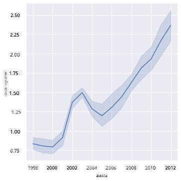
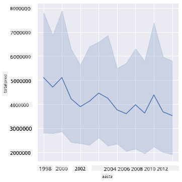
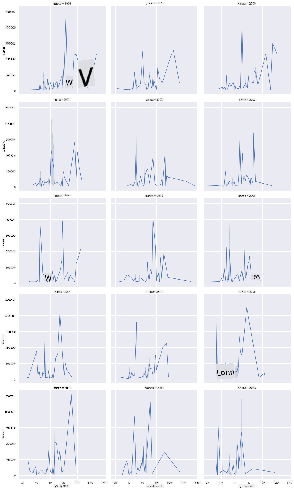
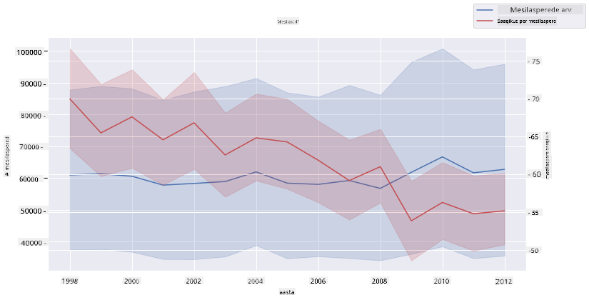

<!--
CO_OP_TRANSLATOR_METADATA:
{
  "original_hash": "0764fd4077f3f04a1d968ec371227744",
  "translation_date": "2025-10-11T16:03:41+00:00",
  "source_file": "3-Data-Visualization/12-visualization-relationships/README.md",
  "language_code": "et"
}
-->
# Suhete visualiseerimine: Kõik mee kohta 🍯

| ](../../sketchnotes/12-Visualizing-Relationships.png)|
|:---:|
|Suhete visualiseerimine - _Sketchnote by [@nitya](https://twitter.com/nitya)_ |

Jätkates meie uurimistöö looduse fookusega, avastame huvitavaid visualiseerimisviise, et näidata erinevate mee tüüpide vahelisi suhteid, tuginedes andmestikule, mis pärineb [Ameerika Ühendriikide Põllumajandusministeeriumist](https://www.nass.usda.gov/About_NASS/index.php).

See umbes 600 kirjet sisaldav andmestik näitab mee tootmist paljudes USA osariikides. Näiteks saate vaadata kolooniate arvu, saagikust koloonia kohta, kogutoodangut, varusid, hinna naela kohta ja toodetud mee väärtust antud osariigis aastatel 1998–2012, kus iga osariigi kohta on üks rida aastas.

Huvitav oleks visualiseerida suhet antud osariigi aastase tootmise ja näiteks mee hinna vahel selles osariigis. Alternatiivina võiks visualiseerida osariikide mee saagikust koloonia kohta. See ajavahemik hõlmab laastavat "CCD" ehk "kolooniate kokkuvarisemise sündroomi", mis esmakordselt ilmnes 2006. aastal (http://npic.orst.edu/envir/ccd.html), mistõttu on see andmestik uurimiseks väga tähendusrikas. 🐝

## [Eelloengu viktoriin](https://ff-quizzes.netlify.app/en/ds/quiz/22)

Selles tunnis saate kasutada Seaborn'i, mida olete varem kasutanud, kui head teeki, et visualiseerida muutujate vahelisi suhteid. Eriti huvitav on Seaborn'i `relplot` funktsioon, mis võimaldab kiiresti luua hajuvusdiagramme ja joondiagramme, et visualiseerida '[statistilisi suhteid](https://seaborn.pydata.org/tutorial/relational.html?highlight=relationships)', mis aitavad andmeteadlasel paremini mõista, kuidas muutujad üksteisega seotud on.

## Hajuvusdiagrammid

Kasutage hajuvusdiagrammi, et näidata, kuidas mee hind on aastate jooksul osariikide lõikes muutunud. Seaborn, kasutades `relplot`, rühmitab mugavalt osariikide andmed ja kuvab andmepunkte nii kategooriliste kui ka numbriliste andmete jaoks.

Alustame andmete ja Seaborn'i importimisest:

```python
import pandas as pd
import matplotlib.pyplot as plt
import seaborn as sns
honey = pd.read_csv('../../data/honey.csv')
honey.head()
```
Te märkate, et mee andmestikus on mitmeid huvitavaid veerge, sealhulgas aasta ja hind naela kohta. Uurime neid andmeid, rühmitatuna USA osariikide kaupa:

| osariik | kolooniate arv | saagikus koloonia kohta | kogutoodang | varud   | hind naela kohta | toodangu väärtus | aasta |
| ------- | -------------- | ----------------------- | ----------- | ------- | ---------------- | ---------------- | ----- |
| AL      | 16000          | 71                     | 1136000     | 159000  | 0.72             | 818000           | 1998  |
| AZ      | 55000          | 60                     | 3300000     | 1485000 | 0.64             | 2112000          | 1998  |
| AR      | 53000          | 65                     | 3445000     | 1688000 | 0.59             | 2033000          | 1998  |
| CA      | 450000         | 83                     | 37350000    | 12326000| 0.62             | 23157000         | 1998  |
| CO      | 27000          | 72                     | 1944000     | 1594000 | 0.7              | 1361000          | 1998  |

Looge lihtne hajuvusdiagramm, et näidata suhet mee hinna naela kohta ja selle päritoluosariigi vahel. Tehke `y`-telg piisavalt kõrge, et kuvada kõik osariigid:

```python
sns.relplot(x="priceperlb", y="state", data=honey, height=15, aspect=.5);
```


Nüüd näidake samu andmeid mee värviskeemiga, et näidata, kuidas hind aastate jooksul muutub. Seda saate teha, lisades 'hue' parameetri, et näidata muutust aastate lõikes:

> ✅ Lisateavet [Seaborn'i värvipalettide kohta](https://seaborn.pydata.org/tutorial/color_palettes.html) - proovige kaunist vikerkaare värviskeemi!

```python
sns.relplot(x="priceperlb", y="state", hue="year", palette="YlOrBr", data=honey, height=15, aspect=.5);
```


Selle värviskeemi muutusega näete selgelt tugevat arengut aastate jooksul mee hinna osas naela kohta. Tõepoolest, kui vaatate andmestikus valimit, näiteks Arizona osariiki, näete aastate lõikes hinnatõusu mustrit, kus on vähe erandeid:

| osariik | kolooniate arv | saagikus koloonia kohta | kogutoodang | varud  | hind naela kohta | toodangu väärtus | aasta |
| ------- | -------------- | ----------------------- | ----------- | ------ | ---------------- | ---------------- | ----- |
| AZ      | 55000          | 60                     | 3300000     | 1485000| 0.64             | 2112000          | 1998  |
| AZ      | 52000          | 62                     | 3224000     | 1548000| 0.62             | 1999000          | 1999  |
| AZ      | 40000          | 59                     | 2360000     | 1322000| 0.73             | 1723000          | 2000  |
| AZ      | 43000          | 59                     | 2537000     | 1142000| 0.72             | 1827000          | 2001  |
| AZ      | 38000          | 63                     | 2394000     | 1197000| 1.08             | 2586000          | 2002  |
| AZ      | 35000          | 72                     | 2520000     | 983000 | 1.34             | 3377000          | 2003  |
| AZ      | 32000          | 55                     | 1760000     | 774000 | 1.11             | 1954000          | 2004  |
| AZ      | 36000          | 50                     | 1800000     | 720000 | 1.04             | 1872000          | 2005  |
| AZ      | 30000          | 65                     | 1950000     | 839000 | 0.91             | 1775000          | 2006  |
| AZ      | 30000          | 64                     | 1920000     | 902000 | 1.26             | 2419000          | 2007  |
| AZ      | 25000          | 64                     | 1600000     | 336000 | 1.26             | 2016000          | 2008  |
| AZ      | 20000          | 52                     | 1040000     | 562000 | 1.45             | 1508000          | 2009  |
| AZ      | 24000          | 77                     | 1848000     | 665000 | 1.52             | 2809000          | 2010  |
| AZ      | 23000          | 53                     | 1219000     | 427000 | 1.55             | 1889000          | 2011  |
| AZ      | 22000          | 46                     | 1012000     | 253000 | 1.79             | 1811000          | 2012  |

Teine viis selle arengu visualiseerimiseks on kasutada värvi asemel suurust. Värvipimedatele kasutajatele võib see olla parem valik. Muutke oma visualiseerimist, et näidata hinna tõusu punktide ümbermõõdu suurenemise kaudu:

```python
sns.relplot(x="priceperlb", y="state", size="year", data=honey, height=15, aspect=.5);
```
Näete, et punktide suurus suureneb järk-järgult.


Kas see on lihtne pakkumise ja nõudluse juhtum? Kas kliimamuutuste ja kolooniate kokkuvarisemise tõttu on aastate jooksul vähem mett saadaval, mistõttu hind tõuseb?

Et avastada korrelatsiooni mõnede selle andmestiku muutujate vahel, uurime joondiagramme.

## Joondiagrammid

Küsimus: Kas mee hind naela kohta tõuseb aastate lõikes selgelt? Seda saate kõige lihtsamini avastada, luues ühe joondiagrammi:

```python
sns.relplot(x="year", y="priceperlb", kind="line", data=honey);
```
Vastus: Jah, mõningate eranditega umbes 2003. aasta paiku:



✅ Kuna Seaborn koondab andmeid ühe joone ümber, kuvab see "mitu mõõtmist iga x väärtuse juures, joonistades keskmise ja 95% usaldusvahemiku keskmise ümber". [Allikas](https://seaborn.pydata.org/tutorial/relational.html). Selle ajamahuka käitumise saab keelata, lisades `ci=None`.

Küsimus: Noh, kas 2003. aastal näeme ka mee pakkumise kasvu? Mis siis, kui vaatate kogutoodangut aastate lõikes?

```python
sns.relplot(x="year", y="totalprod", kind="line", data=honey);
```



Vastus: Mitte päris. Kui vaatate kogutoodangut, tundub, et see tegelikult suurenes sel konkreetsel aastal, kuigi üldiselt mee tootmise kogus väheneb nendel aastatel.

Küsimus: Sel juhul, mis võis põhjustada mee hinna tõusu umbes 2003. aastal?

Selle avastamiseks saate uurida facet grid'i.

## Facet grid'id

Facet grid'id võtavad ühe aspekti teie andmestikust (meie puhul saate valida 'aasta', et vältida liiga paljude facet'ide loomist). Seaborn saab seejärel teha iga valitud x- ja y-koordinaadi jaoks facet'i kohta graafiku, et hõlbustada visuaalset võrdlust. Kas 2003. aasta paistab sellises võrdluses silma?

Looge facet grid, jätkates `relplot` kasutamist, nagu soovitatakse [Seaborn'i dokumentatsioonis](https://seaborn.pydata.org/generated/seaborn.FacetGrid.html?highlight=facetgrid#seaborn.FacetGrid).

```python
sns.relplot(
    data=honey, 
    x="yieldpercol", y="numcol",
    col="year", 
    col_wrap=3,
    kind="line"
    )
```
Selles visualiseerimises saate võrrelda saagikust koloonia kohta ja kolooniate arvu aastate lõikes kõrvuti, veergude wrap'iga 3:



Selle andmestiku puhul ei paista kolooniate arvu ja nende saagikuse osas aastate lõikes ja osariikide lõikes midagi erilist silma. Kas on olemas teine viis, kuidas leida korrelatsiooni nende kahe muutuja vahel?

## Kahe joonega diagrammid

Proovige mitmejoonelist diagrammi, asetades kaks joondiagrammi üksteise peale, kasutades Seaborn'i 'despine', et eemaldada nende ülemised ja parempoolsed servad, ning kasutades `ax.twinx` [pärineb Matplotlib'ist](https://matplotlib.org/stable/api/_as_gen/matplotlib.axes.Axes.twinx.html). Twinx võimaldab graafikul jagada x-telge ja kuvada kaks y-telge. Kuvage saagikus koloonia kohta ja kolooniate arv, üksteise peale asetatuna:

```python
fig, ax = plt.subplots(figsize=(12,6))
lineplot = sns.lineplot(x=honey['year'], y=honey['numcol'], data=honey, 
                        label = 'Number of bee colonies', legend=False)
sns.despine()
plt.ylabel('# colonies')
plt.title('Honey Production Year over Year');

ax2 = ax.twinx()
lineplot2 = sns.lineplot(x=honey['year'], y=honey['yieldpercol'], ax=ax2, color="r", 
                         label ='Yield per colony', legend=False) 
sns.despine(right=False)
plt.ylabel('colony yield')
ax.figure.legend();
```


Kuigi 2003. aasta paiku ei paista midagi silma, võimaldab see meil lõpetada selle tunni veidi rõõmsama noodiga: kuigi kolooniate arv on üldiselt vähenemas, stabiliseerub kolooniate arv isegi siis, kui nende saagikus koloonia kohta väheneb.

Edu, mesilased, edu!

🐝❤️
## 🚀 Väljakutse

Selles tunnis õppisite veidi rohkem hajuvusdiagrammide ja joondiagrammide, sealhulgas facet grid'ide kasutamise kohta. Esitage endale väljakutse, luues facet grid'i, kasutades mõnda teist andmestikku, võib-olla mõnda, mida olete varem nendes tundides kasutanud. Pange tähele, kui kaua nende loomine aega võtab ja kuidas peate olema ettevaatlik, kui palju grid'e te nende tehnikate abil joonistate.

## [Järelloengu viktoriin](https://ff-quizzes.netlify.app/en/ds/quiz/23)

## Ülevaade ja iseseisev õppimine

Joondiagrammid võivad olla lihtsad või üsna keerulised. Tehke veidi lugemist [Seaborn'i dokumentatsioonis](https://seaborn.pydata.org/generated/seaborn.lineplot.html) erinevate viiside kohta, kuidas neid luua. Proovige täiustada joondiagramme, mida selles tunnis ehitasite, kasutades dokumentatsioonis loetletud meetodeid.
## Ülesanne

[Sukeldu mesitarusse](assignment.md)

---

**Lahtiütlus**:  
See dokument on tõlgitud AI tõlketeenuse [Co-op Translator](https://github.com/Azure/co-op-translator) abil. Kuigi püüame tagada täpsust, palume arvestada, et automaatsed tõlked võivad sisaldada vigu või ebatäpsusi. Algne dokument selle algses keeles tuleks pidada autoriteetseks allikaks. Olulise teabe puhul soovitame kasutada professionaalset inimtõlget. Me ei vastuta selle tõlke kasutamisest tulenevate arusaamatuste või valesti tõlgenduste eest.