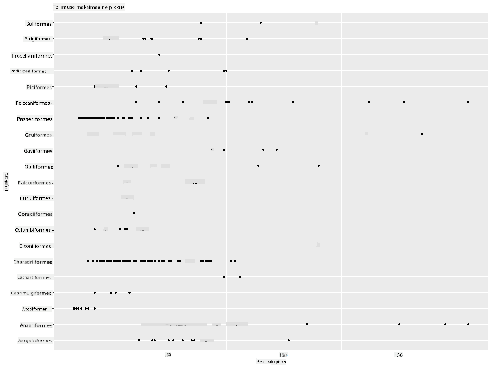
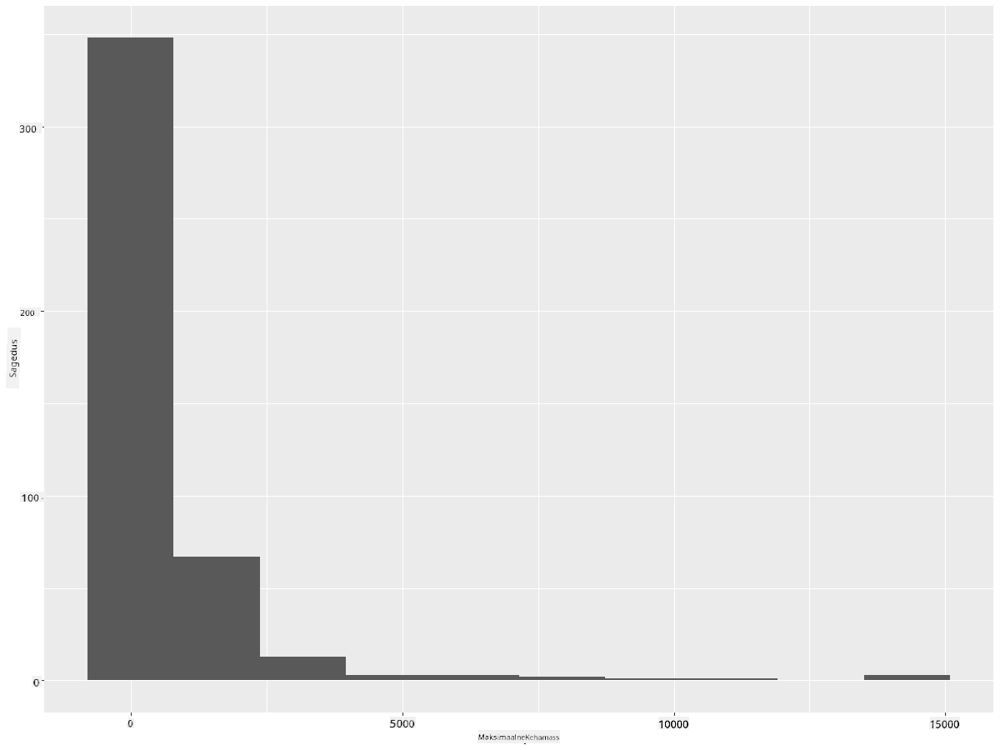
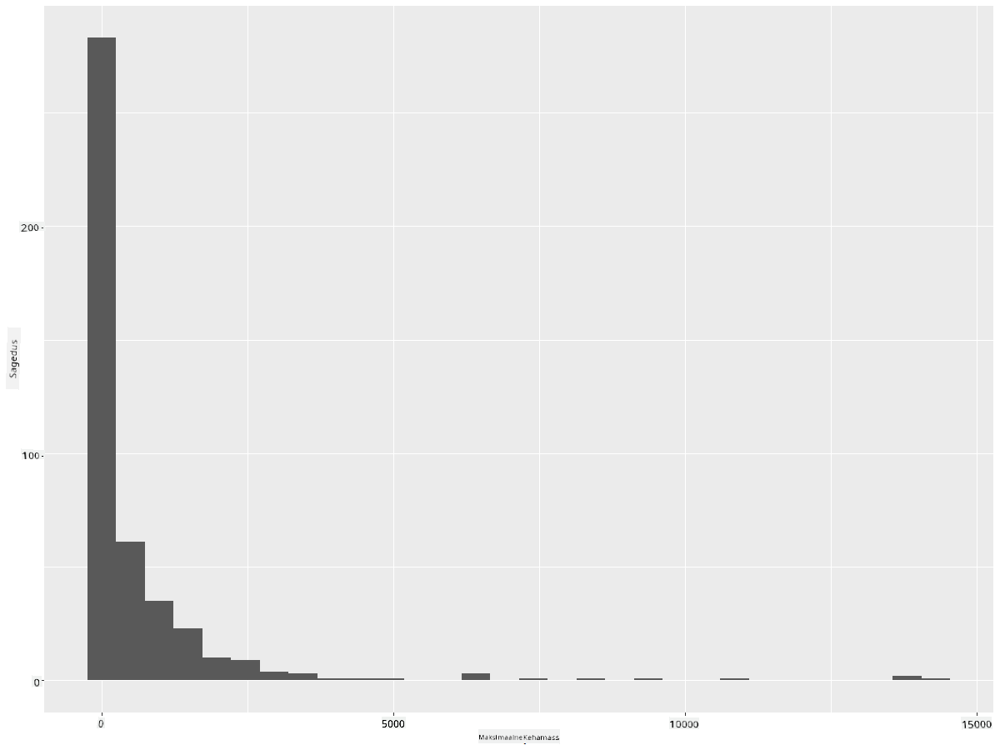
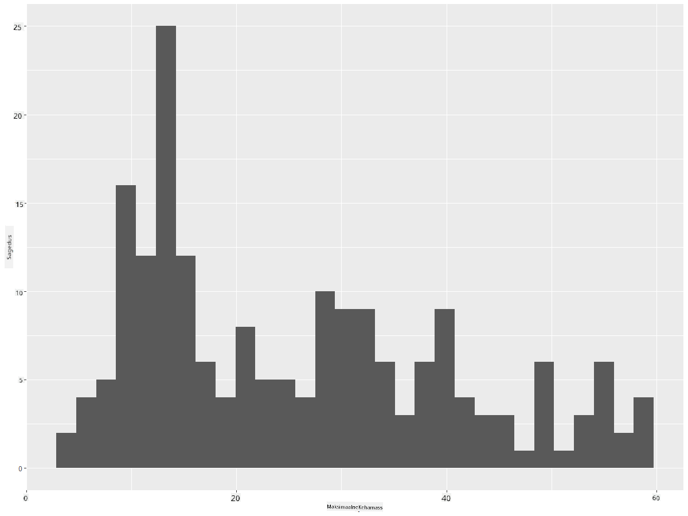
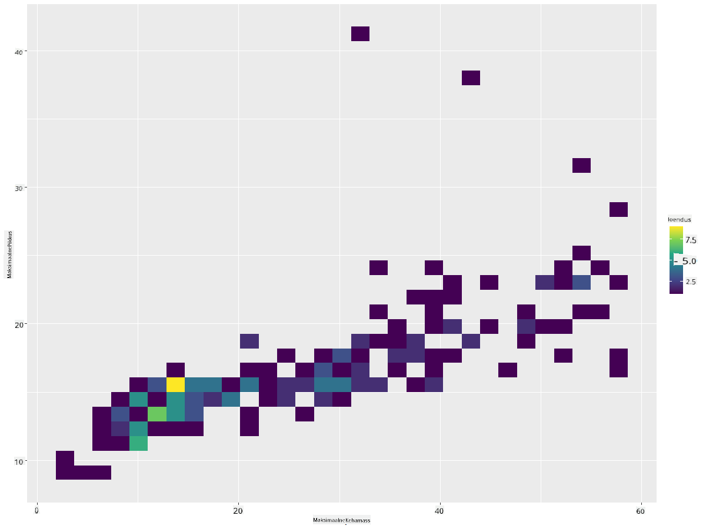
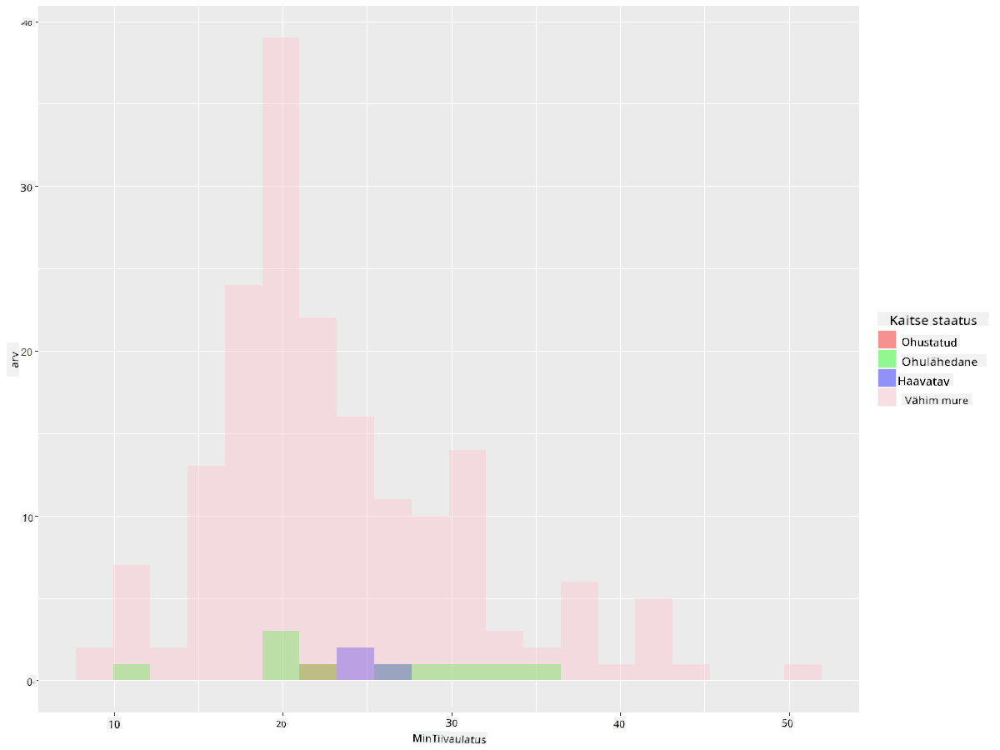
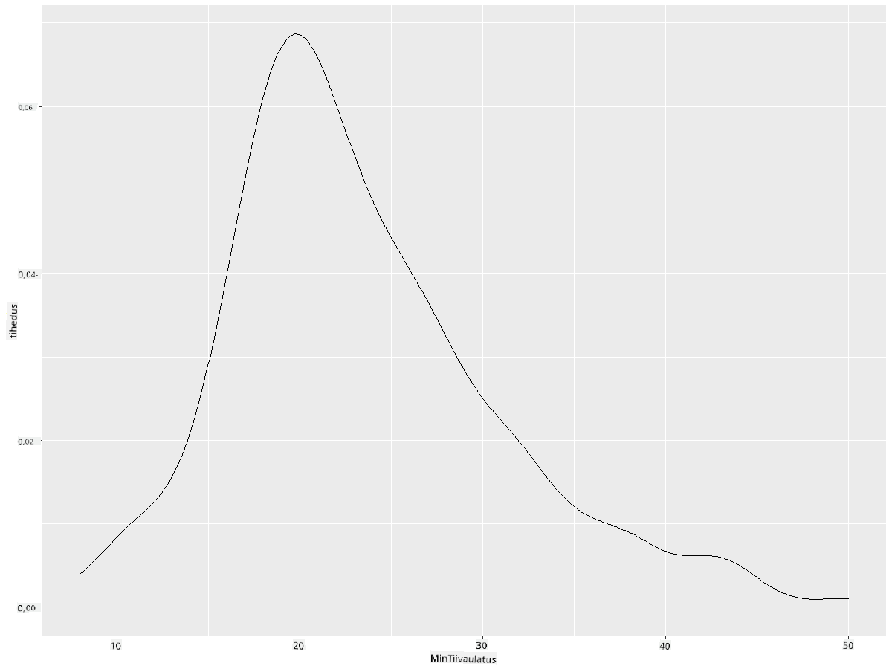
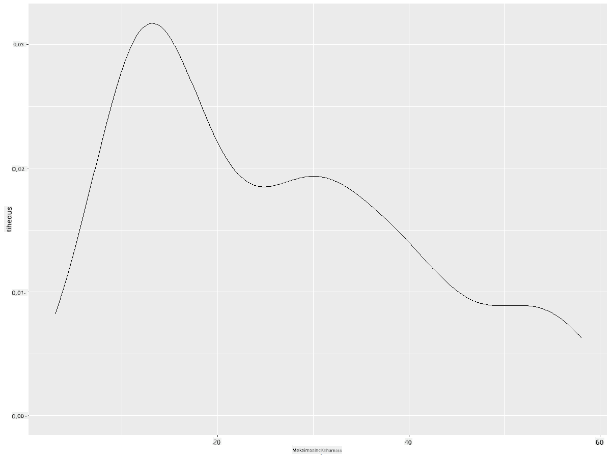
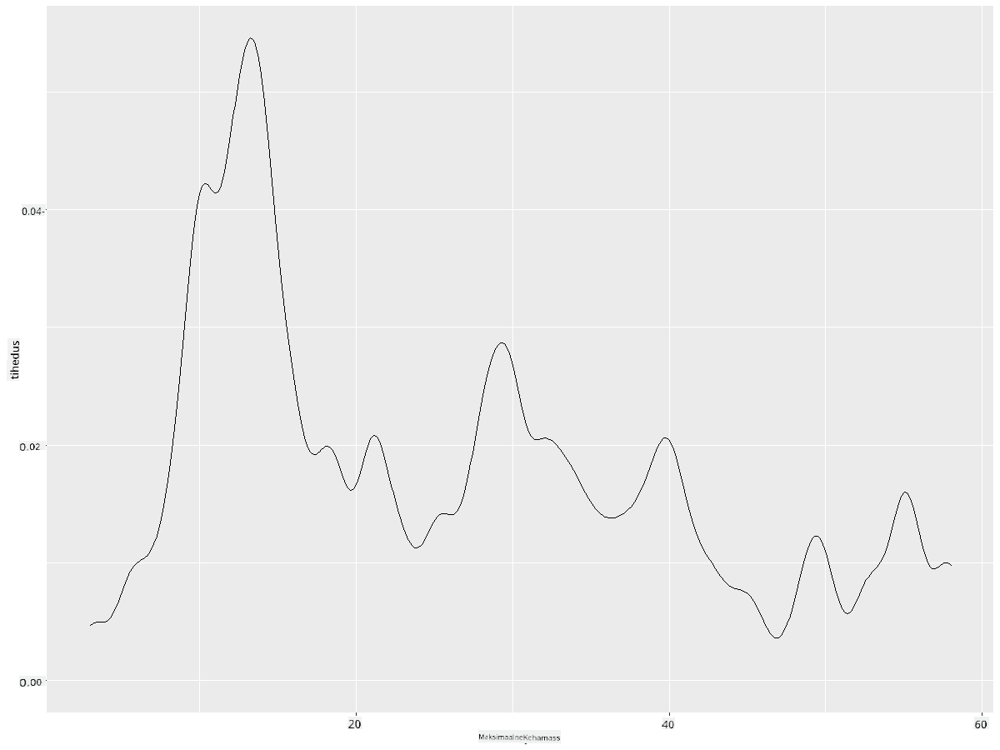
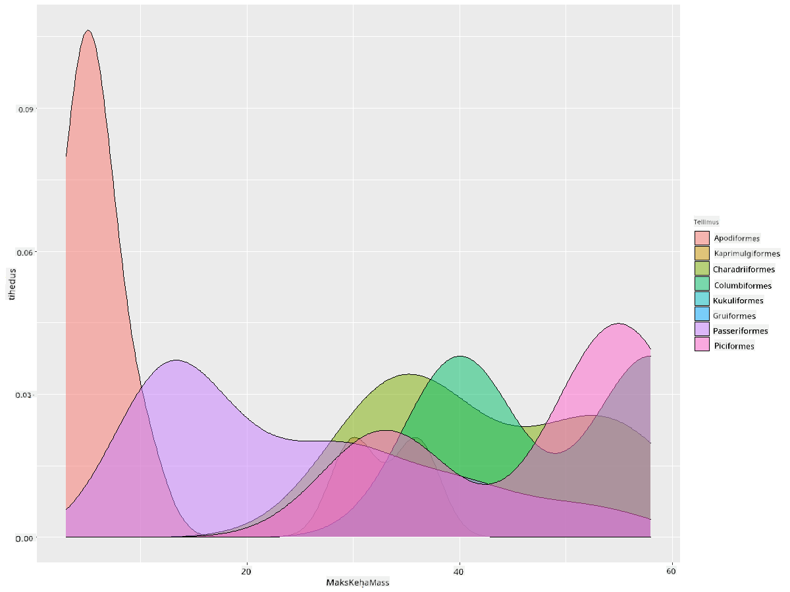

<!--
CO_OP_TRANSLATOR_METADATA:
{
  "original_hash": "ea67c0c40808fd723594de6896c37ccf",
  "translation_date": "2025-10-11T15:57:48+00:00",
  "source_file": "3-Data-Visualization/R/10-visualization-distributions/README.md",
  "language_code": "et"
}
-->
# Andmete jaotuse visualiseerimine

| ](https://github.com/microsoft/Data-Science-For-Beginners/blob/main/sketchnotes/10-Visualizing-Distributions.png)|
|:---:|
| Andmete jaotuse visualiseerimine - _Sketchnote by [@nitya](https://twitter.com/nitya)_ |

Eelmises tunnis õppisite huvitavaid fakte Minnesota lindude andmestiku kohta. Leidsite vigaseid andmeid, visualiseerides kõrvalekaldeid, ja uurisite erinevusi lindude kategooriate vahel nende maksimaalse pikkuse järgi.

## [Eelloengu viktoriin](https://purple-hill-04aebfb03.1.azurestaticapps.net/quiz/18)
## Uurime lindude andmestikku

Üks viis andmete sügavamaks uurimiseks on vaadata nende jaotust ehk seda, kuidas andmed on telje ulatuses organiseeritud. Näiteks võiksite teada saada, kuidas on jaotunud Minnesota lindude maksimaalne tiivaulatus või maksimaalne kehamass.

Avastame mõned faktid selle andmestiku jaotuste kohta. Oma R konsoolis importige `ggplot2` ja andmebaas. Eemaldage andmebaasist kõrvalekalded, nagu tegite eelmises teemas.

```r
library(ggplot2)

birds <- read.csv("../../data/birds.csv",fileEncoding="UTF-8-BOM")

birds_filtered <- subset(birds, MaxWingspan < 500)
head(birds_filtered)
```
|      | Nimi                         | Teaduslik nimi         | Kategooria            | Selts        | Sugukond | Perekond    | Kaitsestaatus       | MinPikkus | MaxPikkus | MinKehamass | MaxKehamass | MinTiivaulatus | MaxTiivaulatus |
| ---: | :--------------------------- | :--------------------- | :-------------------- | :----------- | :------- | :---------- | :----------------- | --------: | --------: | ----------: | ----------: | ----------: | ----------: |
|    0 | Mustkõht-vilepart            | Dendrocygna autumnalis | Pardid/Haned/Vesilinnud | Anseriformes | Anatidae | Dendrocygna | LC                 |        47 |        56 |         652 |        1020 |          76 |          94 |
|    1 | Kollakas-vilepart            | Dendrocygna bicolor    | Pardid/Haned/Vesilinnud | Anseriformes | Anatidae | Dendrocygna | LC                 |        45 |        53 |         712 |        1050 |          85 |          93 |
|    2 | Lumehani                     | Anser caerulescens     | Pardid/Haned/Vesilinnud | Anseriformes | Anatidae | Anser       | LC                 |        64 |        79 |        2050 |        4050 |         135 |         165 |
|    3 | Rossi hani                   | Anser rossii           | Pardid/Haned/Vesilinnud | Anseriformes | Anatidae | Anser       | LC                 |      57.3 |        64 |        1066 |        1567 |         113 |         116 |
|    4 | Suur-valgehan                | Anser albifrons        | Pardid/Haned/Vesilinnud | Anseriformes | Anatidae | Anser       | LC                 |        64 |        81 |        1930 |        3310 |         130 |         165 |

Üldiselt saate andmete jaotust kiiresti vaadata hajuvusdiagrammi abil, nagu tegime eelmises tunnis:

```r
ggplot(data=birds_filtered, aes(x=Order, y=MaxLength,group=1)) +
  geom_point() +
  ggtitle("Max Length per order") + coord_flip()
```


See annab ülevaate lindude pikkuse jaotusest seltsi järgi, kuid see pole parim viis tõeliste jaotuste kuvamiseks. Selle ülesande jaoks kasutatakse tavaliselt histogrammi.
## Töötamine histogrammidega

`ggplot2` pakub väga häid viise andmete jaotuse visualiseerimiseks histogrammide abil. See diagrammitüüp sarnaneb tulpdiagrammiga, kus jaotust saab näha tulpade tõusu ja languse kaudu. Histogrammi loomiseks on vaja numbrilisi andmeid. Histogrammi loomiseks saate määrata diagrammi tüübi 'hist' histogrammi jaoks. See diagramm näitab MaxBodyMass jaotust kogu andmestiku numbriliste andmete ulatuses. Jagades andmete massiivi väiksemateks osadeks, saab kuvada andmete väärtuste jaotust:

```r
ggplot(data = birds_filtered, aes(x = MaxBodyMass)) + 
  geom_histogram(bins=10)+ylab('Frequency')
```


Nagu näete, kuulub enamik 400+ linnust selles andmestikus Max Body Mass väärtusega alla 2000. Saate andmetest rohkem aru, kui muudate `bins` parameetri kõrgemaks, näiteks 30:

```r
ggplot(data = birds_filtered, aes(x = MaxBodyMass)) + geom_histogram(bins=30)+ylab('Frequency')
```



See diagramm näitab jaotust veidi detailsemalt. Vähem vasakule kaldu diagrammi saab luua, kui valite andmed ainult teatud vahemikus:

Filtreerige oma andmed, et saada ainult need linnud, kelle kehamass on alla 60, ja kuvage 30 `bins`:

```r
birds_filtered_1 <- subset(birds_filtered, MaxBodyMass > 1 & MaxBodyMass < 60)
ggplot(data = birds_filtered_1, aes(x = MaxBodyMass)) + 
  geom_histogram(bins=30)+ylab('Frequency')
```



✅ Proovige mõnda muud filtrit ja andmepunkti. Andmete täieliku jaotuse nägemiseks eemaldage `['MaxBodyMass']` filter, et kuvada märgistatud jaotused.

Histogramm pakub ka mõningaid toredaid värvi- ja märgistuse täiustusi, mida proovida:

Looge 2D histogramm, et võrrelda kahe jaotuse vahelist seost. Võrdleme `MaxBodyMass` ja `MaxLength`. `ggplot2` pakub sisseehitatud viisi kokkulangevuse kuvamiseks heledamate värvide abil:

```r
ggplot(data=birds_filtered_1, aes(x=MaxBodyMass, y=MaxLength) ) +
  geom_bin2d() +scale_fill_continuous(type = "viridis")
```
Tundub, et nende kahe elemendi vahel on oodatud korrelatsioon mööda oodatud telge, kus üks kokkulangevuse punkt on eriti tugev:



Histogrammid töötavad vaikimisi hästi numbriliste andmetega. Aga mis siis, kui peate nägema jaotusi tekstiliste andmete järgi? 
## Uurime andmestikku jaotuste leidmiseks tekstiliste andmete abil 

See andmestik sisaldab ka head teavet lindude kategooria, perekonna, liigi ja sugukonna kohta ning nende kaitsestaatuse kohta. Uurime seda kaitsestaatuse teavet. Milline on lindude jaotus nende kaitsestaatuse järgi?

> ✅ Andmestikus kasutatakse mitmeid lühendeid kaitsestaatuse kirjeldamiseks. Need lühendid pärinevad [IUCN Red List Categories](https://www.iucnredlist.org/) organisatsioonilt, mis kataloogib liikide staatust.
> 
> - CR: Kriitiliselt ohustatud
> - EN: Ohustatud
> - EX: Väljasurnud
> - LC: Vähem muret tekitav
> - NT: Ohulähedane
> - VU: Haavatav

Need on tekstipõhised väärtused, seega peate histogrammi loomiseks tegema teisenduse. Kasutades filtritudBirds andmeraami, kuvage selle kaitsestaatus koos minimaalse tiivaulatusega. Mida te näete? 

```r
birds_filtered_1$ConservationStatus[birds_filtered_1$ConservationStatus == 'EX'] <- 'x1' 
birds_filtered_1$ConservationStatus[birds_filtered_1$ConservationStatus == 'CR'] <- 'x2'
birds_filtered_1$ConservationStatus[birds_filtered_1$ConservationStatus == 'EN'] <- 'x3'
birds_filtered_1$ConservationStatus[birds_filtered_1$ConservationStatus == 'NT'] <- 'x4'
birds_filtered_1$ConservationStatus[birds_filtered_1$ConservationStatus == 'VU'] <- 'x5'
birds_filtered_1$ConservationStatus[birds_filtered_1$ConservationStatus == 'LC'] <- 'x6'

ggplot(data=birds_filtered_1, aes(x = MinWingspan, fill = ConservationStatus)) +
  geom_histogram(position = "identity", alpha = 0.4, bins = 20) +
  scale_fill_manual(name="Conservation Status",values=c("red","green","blue","pink"),labels=c("Endangered","Near Threathened","Vulnerable","Least Concern"))
```



Tundub, et minimaalse tiivaulatuse ja kaitsestaatuse vahel pole head korrelatsiooni. Testige selle meetodiga andmestiku teisi elemente. Võite proovida ka erinevaid filtreid. Kas leiate korrelatsiooni?

## Tiheduse diagrammid

Võib-olla olete märganud, et seni vaadatud histogrammid on "astmelised" ega voola sujuvalt kaares. Sujuvama tiheduse diagrammi kuvamiseks võite proovida tiheduse diagrammi.

Töötame nüüd tiheduse diagrammidega!

```r
ggplot(data = birds_filtered_1, aes(x = MinWingspan)) + 
  geom_density()
```


Näete, kuidas diagramm kajastab varasemat minimaalse tiivaulatuse diagrammi; see on lihtsalt veidi sujuvam. Kui soovite uuesti vaadata seda sakilist MaxBodyMass joont teises loodud diagrammis, saate selle väga hästi siluda, luues selle uuesti selle meetodiga:

```r
ggplot(data = birds_filtered_1, aes(x = MaxBodyMass)) + 
  geom_density()
```


Kui soovite sujuvat, kuid mitte liiga sujuvat joont, muutke `adjust` parameetrit: 

```r
ggplot(data = birds_filtered_1, aes(x = MaxBodyMass)) + 
  geom_density(adjust = 1/5)
```


✅ Lugege selle diagrammitüübi jaoks saadaolevate parameetrite kohta ja katsetage!

See diagrammitüüp pakub kaunilt selgitavaid visualiseeringuid. Näiteks mõne koodirea abil saate näidata maksimaalse kehamassi tihedust lindude seltsi järgi:

```r
ggplot(data=birds_filtered_1,aes(x = MaxBodyMass, fill = Order)) +
  geom_density(alpha=0.5)
```


## 🚀 Väljakutse

Histogrammid on keerukamad diagrammitüübid kui lihtsad hajuvusdiagrammid, tulpdiagrammid või joondiagrammid. Otsige internetist häid näiteid histogrammide kasutamise kohta. Kuidas neid kasutatakse, mida need näitavad ja millistes valdkondades või uurimisvaldkondades neid tavaliselt kasutatakse?

## [Järelloengu viktoriin](https://purple-hill-04aebfb03.1.azurestaticapps.net/quiz/19)

## Ülevaade ja iseseisev õppimine

Selles tunnis kasutasite `ggplot2` ja hakkasite looma keerukamaid diagramme. Tehke uurimistööd `geom_density_2d()` kohta, mis on "pidev tõenäosuse tiheduse kõver ühes või mitmes dimensioonis". Lugege [dokumentatsiooni](https://ggplot2.tidyverse.org/reference/geom_density_2d.html), et mõista, kuidas see töötab.

## Ülesanne

[Rakendage oma oskusi](assignment.md)

---

**Lahtiütlus**:  
See dokument on tõlgitud AI tõlketeenuse [Co-op Translator](https://github.com/Azure/co-op-translator) abil. Kuigi püüame tagada täpsust, palume arvestada, et automaatsed tõlked võivad sisaldada vigu või ebatäpsusi. Algne dokument selle algses keeles tuleks pidada autoriteetseks allikaks. Olulise teabe puhul soovitame kasutada professionaalset inimtõlget. Me ei vastuta selle tõlke kasutamisest tulenevate arusaamatuste või valesti tõlgenduste eest.