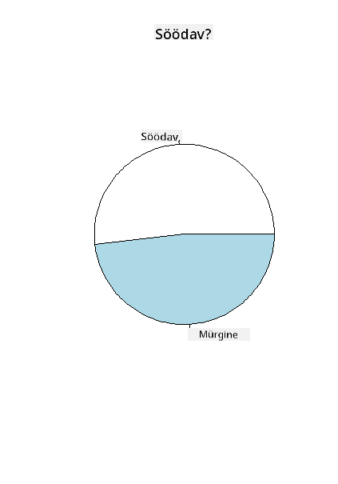
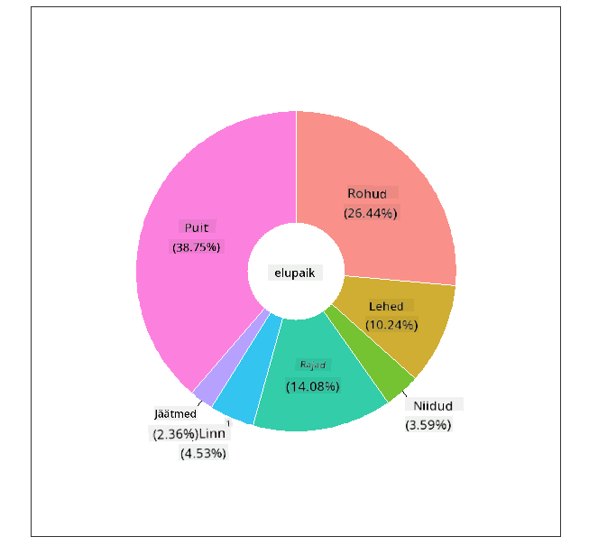
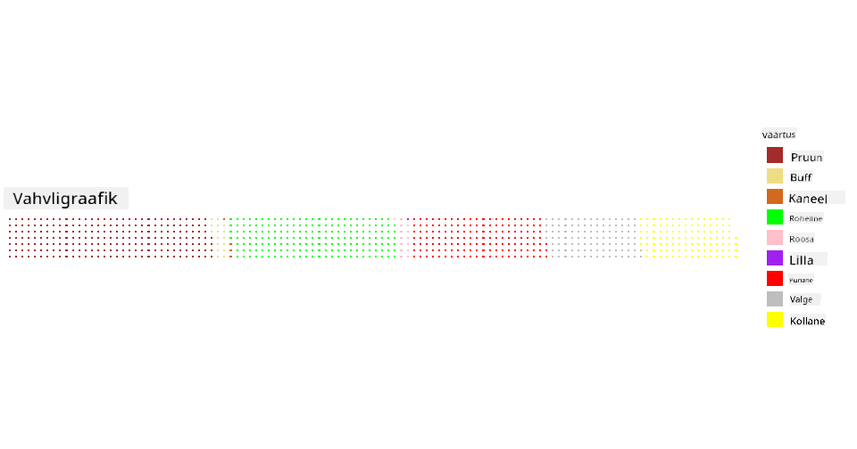

<!--
CO_OP_TRANSLATOR_METADATA:
{
  "original_hash": "47028abaaafa2bcb1079702d20569066",
  "translation_date": "2025-10-11T15:58:54+00:00",
  "source_file": "3-Data-Visualization/R/11-visualization-proportions/README.md",
  "language_code": "et"
}
-->
# Proportsioonide visualiseerimine

| ](../../../sketchnotes/11-Visualizing-Proportions.png)|
|:---:|
|Proportsioonide visualiseerimine - _Sketchnote by [@nitya](https://twitter.com/nitya)_ |

Selles õppetükis kasutad looduskeskkonnale keskenduvat andmestikku, et visualiseerida proportsioone, näiteks kui palju erinevaid seeneliike esineb antud andmestikus seente kohta. Uurime neid põnevaid seeni, kasutades Auduboni andmestikku, mis sisaldab üksikasju 23 liigi kohta, mis kuuluvad Agaricus ja Lepiota perekondadesse. Katsetad maitsvaid visualiseerimismeetodeid, nagu:

- Pirukadiagrammid 🥧
- Sõõrikdiagrammid 🍩
- Vahvlidiagrammid 🧇

> 💡 Microsoft Researchi väga huvitav projekt nimega [Charticulator](https://charticulator.com) pakub tasuta lohistamisliidest andmete visualiseerimiseks. Ühes nende õpetuses kasutatakse samuti seda seente andmestikku! Nii saad andmeid uurida ja samal ajal raamatukogu tundma õppida: [Charticulator õpetus](https://charticulator.com/tutorials/tutorial4.html).

## [Eelloengu viktoriin](https://purple-hill-04aebfb03.1.azurestaticapps.net/quiz/20)

## Tutvu oma seentega 🍄

Seened on väga huvitavad. Impordime andmestiku, et neid uurida:

```r
mushrooms = read.csv('../../data/mushrooms.csv')
head(mushrooms)
```
Tabelis kuvatakse suurepärased andmed analüüsimiseks:


| klass     | kübara kuju | kübara pind | kübara värv | muljumisjäljed | lõhn    | eoslehe kinnitus | eoslehe vahe | eoslehe suurus | eoslehe värv | jala kuju | jala alus | jala pind rõnga kohal | jala pind rõnga all | jala värv rõnga kohal | jala värv rõnga all | loor tüüp | loor värv | rõngaste arv | rõnga tüüp | eospulbri värv | populatsioon | elupaik |
| --------- | --------- | ----------- | --------- | ------- | ------- | --------------- | ------------ | --------- | ---------- | ----------- | ---------- | ------------------------ | ------------------------ | ---------------------- | ---------------------- | --------- | ---------- | ----------- | --------- | ----------------- | ---------- | ------- |
| Mürgine | Kumer    | Sile      | Pruun     | Muljumisjäljed | Torkav | Vaba            | Tihe        | Kitsas    | Must      | Suurenev   | Võrdne      | Sile                   | Sile                   | Valge                  | Valge                  | Osaline   | Valge      | Üks         | Rippuv   | Must             | Hajutatud  | Linn   |
| Söödav    | Kumer    | Sile      | Kollane    | Muljumisjäljed | Mandli | Vaba            | Tihe        | Lai     | Must      | Suurenev   | Klubikujuline       | Sile                   | Sile                   | Valge                  | Valge                  | Osaline   | Valge      | Üks         | Rippuv   | Pruun             | Arvukas   | Rohumaa |
| Söödav    | Kellukakujuline      | Sile      | Valge     | Muljumisjäljed | Aniisi   | Vaba            | Tihe        | Lai     | Pruun      | Suurenev   | Klubikujuline       | Sile                   | Sile                   | Valge                  | Valge                  | Osaline   | Valge      | Üks         | Rippuv   | Pruun             | Arvukas   | Niidud |
| Mürgine | Kumer    | Kaaluline       | Valge     | Muljumisjäljed | Torkav | Vaba            | Tihe        | Kitsas    | Pruun      | Suurenev   | Võrdne      | Sile                   | Sile                   | Valge                  | Valge                  | Osaline   | Valge      | Üks         | Rippuv   | Must             | Hajutatud  | Linn 
| Söödav | Kumer       |Sile       | Roheline     | Ei muljumisjälgi| Puudub   |Vaba            | Tihe       | Lai     | Must      | Kitsenev   | Võrdne      |  Sile | Sile                    | Valge                 | Valge                  | Osaline    | Valge     | Üks         | Kaduv | Pruun             | Rohke | Rohumaa
|Söödav  |  Kumer      | Kaaluline   | Kollane         | Muljumisjäljed  | Mandli  | Vaba | Tihe  |   Lai   |   Pruun  | Suurenev   |   Klubikujuline                      | Sile                  | Sile    | Valge                 |  Valge                | Osaline      | Valge    |  Üks  |  Rippuv | Must   | Arvukas | Rohumaa
      
Kohe märkad, et kõik andmed on tekstilised. Pead need andmed teisendama, et neid diagrammil kasutada. Enamik andmetest on tegelikult esitatud objektina:

```r
names(mushrooms)
```

Väljund on:

```output
[1] "class"                    "cap.shape"               
 [3] "cap.surface"              "cap.color"               
 [5] "bruises"                  "odor"                    
 [7] "gill.attachment"          "gill.spacing"            
 [9] "gill.size"                "gill.color"              
[11] "stalk.shape"              "stalk.root"              
[13] "stalk.surface.above.ring" "stalk.surface.below.ring"
[15] "stalk.color.above.ring"   "stalk.color.below.ring"  
[17] "veil.type"                "veil.color"              
[19] "ring.number"              "ring.type"               
[21] "spore.print.color"        "population"              
[23] "habitat"            
```
Võta need andmed ja teisenda 'klass' veerg kategooriaks:

```r
library(dplyr)
grouped=mushrooms %>%
  group_by(class) %>%
  summarise(count=n())
```


Kui prindid seente andmed välja, näed, et need on rühmitatud kategooriatesse vastavalt mürgise/söödava klassile:
```r
View(grouped)
```


| klass | arv |
| --------- | --------- |
| Söödav | 4208 |
| Mürgine| 3916 |


Kui järgida tabelis esitatud järjekorda klassi kategooria siltide loomiseks, saad koostada pirukadiagrammi. 

## Pirukas!

```r
pie(grouped$count,grouped$class, main="Edible?")
```
Voila, pirukadiagramm, mis näitab nende kahe seeneklassi andmete proportsioone. On üsna oluline saada siltide järjekord õigeks, eriti siin, seega kontrolli kindlasti, kuidas siltide massiiv on koostatud!



## Sõõrikud!

Visuaalselt veidi huvitavam pirukadiagramm on sõõrikdiagramm, mis on pirukadiagramm, mille keskel on auk. Vaatame meie andmeid selle meetodi abil.

Vaata erinevaid elupaiku, kus seened kasvavad:

```r
library(dplyr)
habitat=mushrooms %>%
  group_by(habitat) %>%
  summarise(count=n())
View(habitat)
```
Väljund on:
| elupaik| arv |
| --------- | --------- |
| Rohumaa    | 2148 |
| Lehed| 832 |
| Niidud    | 292 |
| Rajad| 1144 |
| Linn    | 368 |
| Jäätmed| 192 |
| Mets| 3148 |


Siin rühmitad oma andmed elupaikade järgi. Neid on loetletud 7, seega kasuta neid sõõrikdiagrammi siltidena:

```r
library(ggplot2)
library(webr)
PieDonut(habitat, aes(habitat, count=count))
```



See kood kasutab kahte teeki - ggplot2 ja webr. Kasutades webr teegi PieDonut funktsiooni, saame hõlpsasti luua sõõrikdiagrammi!

Sõõrikdiagramme saab R-is koostada ka ainult ggplot2 teegi abil. Saad sellest rohkem teada [siin](https://www.r-graph-gallery.com/128-ring-or-donut-plot.html) ja proovida ise.

Nüüd, kui tead, kuidas oma andmeid rühmitada ja seejärel kuvada piruka või sõõrikuna, saad uurida teisi diagrammitüüpe. Proovi vahvlidiagrammi, mis on lihtsalt teistsugune viis koguste uurimiseks.
## Vahvlid!

'Vahvli' tüüpi diagramm on teistsugune viis koguste visualiseerimiseks 2D ruutude massiivina. Proovi visualiseerida erinevaid seente kübara värve selles andmestikus. Selleks pead installima abiteegi nimega [waffle](https://cran.r-project.org/web/packages/waffle/waffle.pdf) ja kasutama seda oma visualiseerimise loomiseks:

```r
install.packages("waffle", repos = "https://cinc.rud.is")
```

Vali oma andmetest segment, mida rühmitada:

```r
library(dplyr)
cap_color=mushrooms %>%
  group_by(cap.color) %>%
  summarise(count=n())
View(cap_color)
```

Loo vahvlidiagramm, luues sildid ja rühmitades oma andmed:

```r
library(waffle)
names(cap_color$count) = paste0(cap_color$cap.color)
waffle((cap_color$count/10), rows = 7, title = "Waffle Chart")+scale_fill_manual(values=c("brown", "#F0DC82", "#D2691E", "green", 
                                                                                     "pink", "purple", "red", "grey", 
                                                                                     "yellow","white"))
```

Vahvlidiagrammi abil näed selgelt seente kübara värvide proportsioone selles andmestikus. Huvitaval kombel on palju rohelise kübaraga seeni!



Selles õppetükis õppisid kolme viisi proportsioonide visualiseerimiseks. Kõigepealt pead oma andmed rühmitama kategooriatesse ja seejärel otsustama, milline on parim viis andmete kuvamiseks - pirukas, sõõrik või vahvel. Kõik on maitsvad ja pakuvad kasutajale kohest ülevaadet andmestikust.

## 🚀 Väljakutse

Proovi neid maitsvaid diagramme uuesti luua [Charticulatoris](https://charticulator.com).
## [Järelloengu viktoriin](https://purple-hill-04aebfb03.1.azurestaticapps.net/quiz/21)

## Ülevaade ja iseseisev õppimine

Mõnikord pole ilmne, millal kasutada piruka-, sõõriku- või vahvlidiagrammi. Siin on mõned artiklid, mida sellel teemal lugeda:

https://www.beautiful.ai/blog/battle-of-the-charts-pie-chart-vs-donut-chart

https://medium.com/@hypsypops/pie-chart-vs-donut-chart-showdown-in-the-ring-5d24fd86a9ce

https://www.mit.edu/~mbarker/formula1/f1help/11-ch-c6.htm

https://medium.datadriveninvestor.com/data-visualization-done-the-right-way-with-tableau-waffle-chart-fdf2a19be402

Tee veidi uurimistööd, et leida rohkem teavet selle keerulise otsuse kohta.
## Ülesanne

[Proovi Excelis](assignment.md)

---

**Lahtiütlus**:  
See dokument on tõlgitud AI tõlketeenuse [Co-op Translator](https://github.com/Azure/co-op-translator) abil. Kuigi püüame tagada täpsust, palume arvestada, et automaatsed tõlked võivad sisaldada vigu või ebatäpsusi. Algne dokument selle algses keeles tuleks pidada autoriteetseks allikaks. Olulise teabe puhul soovitame kasutada professionaalset inimtõlget. Me ei vastuta selle tõlke kasutamisest tulenevate arusaamatuste või valesti tõlgenduste eest.