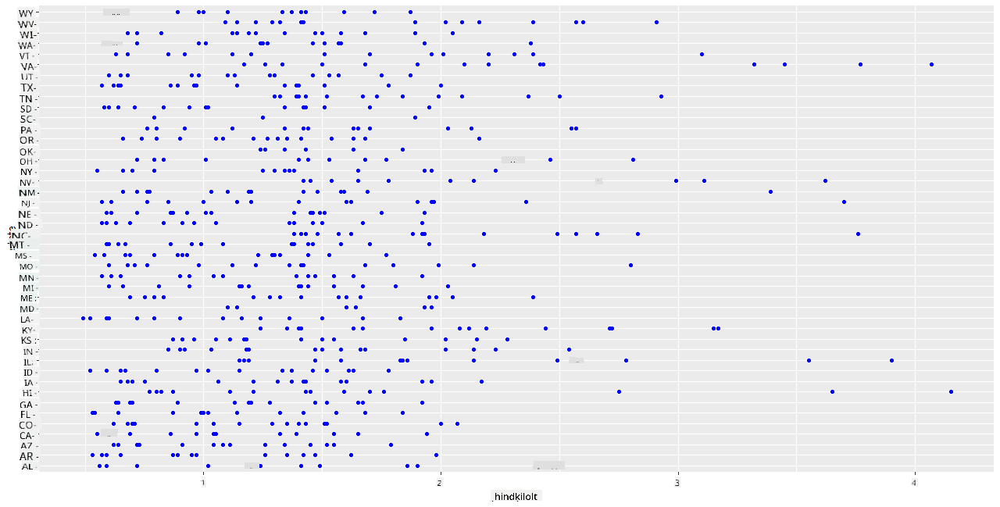
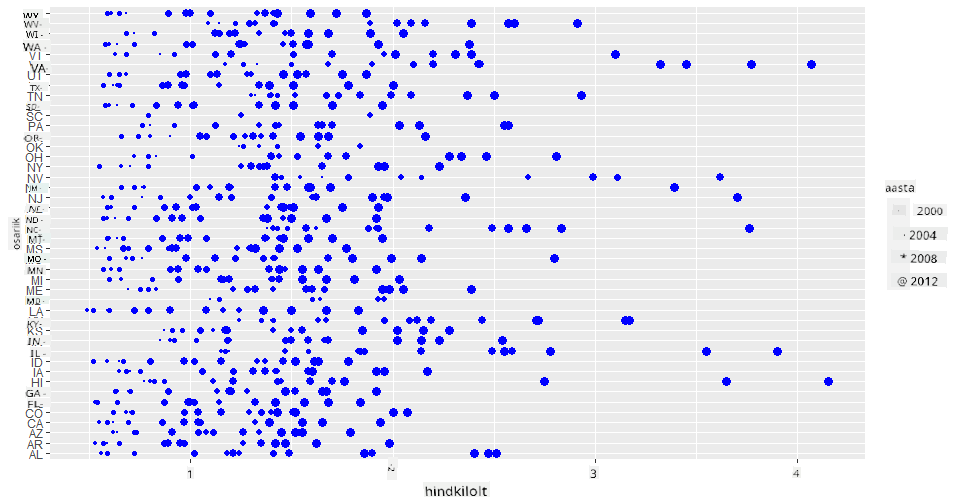
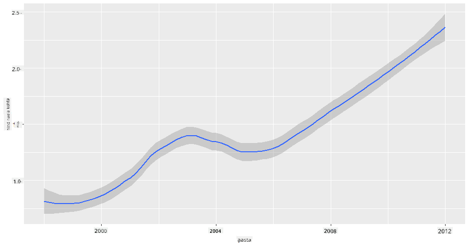
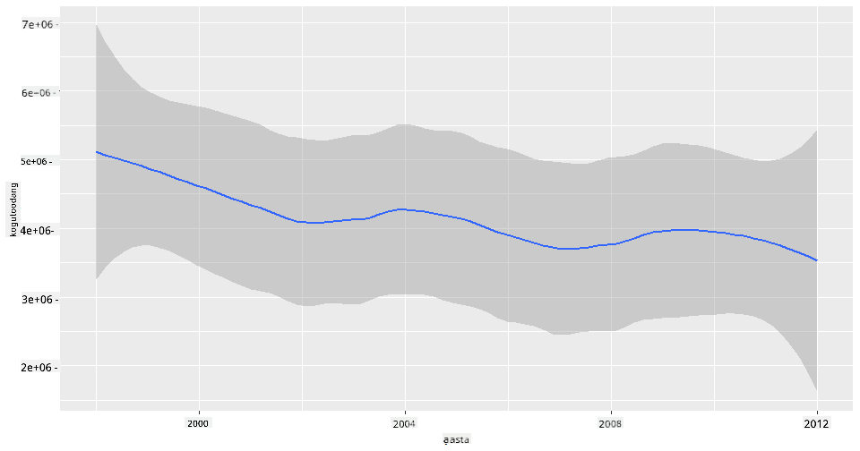
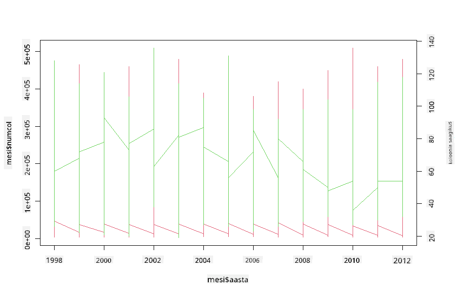

<!--
CO_OP_TRANSLATOR_METADATA:
{
  "original_hash": "a33c5d4b4156a2b41788d8720b6f724c",
  "translation_date": "2025-10-11T16:00:58+00:00",
  "source_file": "3-Data-Visualization/R/12-visualization-relationships/README.md",
  "language_code": "et"
}
-->
# Suhete visualiseerimine: Kõik mesist 🍯

| ](../../../sketchnotes/12-Visualizing-Relationships.png)|
|:---:|
|Suhete visualiseerimine - _Sketchnote by [@nitya](https://twitter.com/nitya)_ |

Jätkates meie uurimistöö looduse fookusega, avastame huvitavaid visualiseerimisviise, et näidata erinevate mee tüüpide vahelisi seoseid, tuginedes andmestikule, mis pärineb [Ameerika Ühendriikide Põllumajandusministeeriumist](https://www.nass.usda.gov/About_NASS/index.php).

See umbes 600 kirjet sisaldav andmestik näitab mee tootmist paljudes USA osariikides. Näiteks saate vaadata kolooniate arvu, saagikust koloonia kohta, kogutoodangut, varusid, hinna naela kohta ja mee tootmise väärtust antud osariigis aastatel 1998–2012, kus iga osariigi kohta on üks rida aastas.

Huvitav oleks visualiseerida seos antud osariigi aastase tootmise ja näiteks mee hinna vahel selles osariigis. Alternatiivselt võiks visualiseerida osariikide mee saagikust koloonia kohta. See ajavahemik hõlmab laastavat 'CCD' ehk 'Colony Collapse Disorder' nähtust, mida esmakordselt täheldati 2006. aastal (http://npic.orst.edu/envir/ccd.html), mistõttu on see andmestik emotsionaalselt tähendusrikas uurimiseks. 🐝

## [Eel-loengu viktoriin](https://purple-hill-04aebfb03.1.azurestaticapps.net/quiz/22)

Selles õppetükis saate kasutada ggplot2-teeki, mida olete varem kasutanud, et visualiseerida muutujate vahelisi seoseid. Eriti huvitav on ggplot2 `geom_point` ja `qplot` funktsioonide kasutamine, mis võimaldavad kiiresti luua hajuvusdiagramme ja joondiagramme, et visualiseerida '[statistilisi seoseid](https://ggplot2.tidyverse.org/)', mis aitavad andmeteadlasel paremini mõista, kuidas muutujad omavahel seotud on.

## Hajuvusdiagrammid

Kasutage hajuvusdiagrammi, et näidata, kuidas mee hind on aastate jooksul osariikide lõikes muutunud. ggplot2, kasutades `ggplot` ja `geom_point`, rühmitab mugavalt osariikide andmed ja kuvab andmepunkte nii kategooriliste kui ka numbriliste andmete jaoks.

Alustame andmete importimise ja Seaborniga:

```r
honey=read.csv('../../data/honey.csv')
head(honey)
```
Te märkate, et mee andmestikus on mitmeid huvitavaid veerge, sealhulgas aasta ja hind naela kohta. Uurime neid andmeid, rühmitatuna USA osariikide kaupa:

| osariik | kolooniate arv | saagikus koloonia kohta | kogutoodang | varud   | hind naela kohta | tootmise väärtus | aasta |
| ------- | -------------- | ----------------------- | ----------- | ------- | ---------------- | ---------------- | ----- |
| AL      | 16000          | 71                     | 1136000     | 159000  | 0.72             | 818000           | 1998  |
| AZ      | 55000          | 60                     | 3300000     | 1485000 | 0.64             | 2112000          | 1998  |
| AR      | 53000          | 65                     | 3445000     | 1688000 | 0.59             | 2033000          | 1998  |
| CA      | 450000         | 83                     | 37350000    | 12326000| 0.62             | 23157000         | 1998  |
| CO      | 27000          | 72                     | 1944000     | 1594000 | 0.7              | 1361000          | 1998  |
| FL      | 230000         | 98                     | 22540000    | 4508000 | 0.64             | 14426000         | 1998  |

Looge lihtne hajuvusdiagramm, et näidata seost mee hinna naela kohta ja selle päritolu osariigi vahel. Tehke `y` telg piisavalt kõrge, et kuvada kõik osariigid:

```r
library(ggplot2)
ggplot(honey, aes(x = priceperlb, y = state)) +
  geom_point(colour = "blue")
```


Nüüd näidake samu andmeid mee värviskeemiga, et näidata, kuidas hind aastate jooksul muutub. Seda saate teha, lisades 'scale_color_gradientn' parameetri, et näidata muutust aastate lõikes:

> ✅ Lisateavet [scale_color_gradientn](https://www.rdocumentation.org/packages/ggplot2/versions/0.9.1/topics/scale_colour_gradientn) kohta - proovige kaunist vikerkaare värviskeemi!

```r
ggplot(honey, aes(x = priceperlb, y = state, color=year)) +
  geom_point()+scale_color_gradientn(colours = colorspace::heat_hcl(7))
```


Selle värviskeemi muutusega näete selgelt tugevat arengut aastate jooksul mee hinna osas naela kohta. Kui vaatate andmestiku näidisosa, näiteks Arizona osariiki, näete aastate lõikes hinnatõusu mustrit, kus on vähe erandeid:

| osariik | kolooniate arv | saagikus koloonia kohta | kogutoodang | varud  | hind naela kohta | tootmise väärtus | aasta |
| ------- | -------------- | ----------------------- | ----------- | ------ | ---------------- | ---------------- | ----- |
| AZ      | 55000          | 60                     | 3300000     | 1485000| 0.64             | 2112000          | 1998  |
| AZ      | 52000          | 62                     | 3224000     | 1548000| 0.62             | 1999000          | 1999  |
| AZ      | 40000          | 59                     | 2360000     | 1322000| 0.73             | 1723000          | 2000  |
| AZ      | 43000          | 59                     | 2537000     | 1142000| 0.72             | 1827000          | 2001  |
| AZ      | 38000          | 63                     | 2394000     | 1197000| 1.08             | 2586000          | 2002  |
| AZ      | 35000          | 72                     | 2520000     | 983000 | 1.34             | 3377000          | 2003  |
| AZ      | 32000          | 55                     | 1760000     | 774000 | 1.11             | 1954000          | 2004  |
| AZ      | 36000          | 50                     | 1800000     | 720000 | 1.04             | 1872000          | 2005  |
| AZ      | 30000          | 65                     | 1950000     | 839000 | 0.91             | 1775000          | 2006  |
| AZ      | 30000          | 64                     | 1920000     | 902000 | 1.26             | 2419000          | 2007  |
| AZ      | 25000          | 64                     | 1600000     | 336000 | 1.26             | 2016000          | 2008  |
| AZ      | 20000          | 52                     | 1040000     | 562000 | 1.45             | 1508000          | 2009  |
| AZ      | 24000          | 77                     | 1848000     | 665000 | 1.52             | 2809000          | 2010  |
| AZ      | 23000          | 53                     | 1219000     | 427000 | 1.55             | 1889000          | 2011  |
| AZ      | 22000          | 46                     | 1012000     | 253000 | 1.79             | 1811000          | 2012  |

Teine viis selle arengu visualiseerimiseks on kasutada värvi asemel suurust. Värvipimedatele kasutajatele võib see olla parem valik. Muutke oma visualiseerimist, et näidata hinnatõusu punktide ümbermõõdu suurenemise kaudu:

```r
ggplot(honey, aes(x = priceperlb, y = state)) +
  geom_point(aes(size = year),colour = "blue") +
  scale_size_continuous(range = c(0.25, 3))
```
Näete, et punktide suurus suureneb järk-järgult.



Kas see on lihtne pakkumise ja nõudluse juhtum? Kas kliimamuutuste ja kolooniate kokkuvarisemise tõttu on aastate jooksul vähem mett saadaval, mistõttu hind tõuseb?

Et avastada korrelatsiooni mõnede selle andmestiku muutujate vahel, uurime joondiagramme.

## Joondiagrammid

Küsimus: Kas mee hind naela kohta tõuseb aastate lõikes selgelt? Seda saate kõige lihtsamalt avastada, luues ühe joondiagrammi:

```r
qplot(honey$year,honey$priceperlb, geom='smooth', span =0.5, xlab = "year",ylab = "priceperlb")
```
Vastus: Jah, mõningate eranditega umbes 2003. aasta paiku:



Küsimus: Kas 2003. aastal näeme ka mee pakkumise kasvu? Mis juhtub, kui vaatate kogutoodangut aastate lõikes?

```python
qplot(honey$year,honey$totalprod, geom='smooth', span =0.5, xlab = "year",ylab = "totalprod")
```



Vastus: Mitte päris. Kui vaatate kogutoodangut, tundub, et see tegelikult suurenes sel konkreetsel aastal, kuigi üldiselt mee tootmise kogus väheneb nendel aastatel.

Küsimus: Sel juhul, mis võis põhjustada mee hinna tõusu umbes 2003. aastal?

Selle avastamiseks saate uurida facet grid'i.

## Facet grid'id

Facet grid'id võtavad ühe aspekti teie andmestikust (meie puhul saate valida 'aasta', et vältida liiga paljude aspektide loomist). Seaborn saab seejärel teha graafiku iga valitud x- ja y-koordinaadi aspekti kohta, et hõlbustada visuaalset võrdlust. Kas 2003. aasta paistab sellises võrdluses silma?

Looge facet grid, kasutades `facet_wrap` nagu soovitatud [ggplot2 dokumentatsioonis](https://ggplot2.tidyverse.org/reference/facet_wrap.html).

```r
ggplot(honey, aes(x=yieldpercol, y = numcol,group = 1)) + 
  geom_line() + facet_wrap(vars(year))
```
Selles visualiseerimises saate võrrelda koloonia saagikust ja kolooniate arvu aastate lõikes kõrvuti, kus veergude wrap on seatud 3-le:


Selle andmestiku puhul ei paista kolooniate arv ja nende saagikus aastate lõikes ja osariikide lõikes millegi erilisega silma. Kas on olemas teine viis, kuidas leida korrelatsiooni nende kahe muutuja vahel?

## Kahe joonega graafikud

Proovige mitmejoonelist graafikut, asetades kaks joondiagrammi üksteise peale, kasutades R-i `par` ja `plot` funktsioone. Me joonistame x-teljel aasta ja kuvame kaks y-telge. Kuvage koloonia saagikus ja kolooniate arv üksteise peal:

```r
par(mar = c(5, 4, 4, 4) + 0.3)              
plot(honey$year, honey$numcol, pch = 16, col = 2,type="l")              
par(new = TRUE)                             
plot(honey$year, honey$yieldpercol, pch = 17, col = 3,              
     axes = FALSE, xlab = "", ylab = "",type="l")
axis(side = 4, at = pretty(range(y2)))      
mtext("colony yield", side = 4, line = 3)   
```


Kuigi 2003. aasta paiku ei paista midagi silma, võimaldab see meil lõpetada õppetund veidi rõõmsama noodiga: kuigi kolooniate arv on üldiselt vähenemas, stabiliseerub kolooniate arv isegi siis, kui nende saagikus koloonia kohta väheneb.

Edu, mesilased, edu!

🐝❤️
## 🚀 Väljakutse

Selles õppetükis õppisite veidi rohkem hajuvusdiagrammide ja joondiagrammide, sealhulgas facet grid'ide kasutamise kohta. Esitage endale väljakutse luua facet grid, kasutades mõnda teist andmestikku, võib-olla mõnda, mida kasutasite enne neid õppetunde. Pange tähele, kui kaua nende loomine võtab ja kuidas peate olema ettevaatlik, kui palju grid'e te nende tehnikate abil joonistate.
## [Järel-loengu viktoriin](https://purple-hill-04aebfb03.1.azurestaticapps.net/quiz/23)

## Ülevaade ja iseseisev õppimine

Joondiagrammid võivad olla lihtsad või üsna keerukad. Tehke veidi lugemist [ggplot2 dokumentatsioonis](https://ggplot2.tidyverse.org/reference/geom_path.html#:~:text=geom_line()%20connects%20them%20in,which%20cases%20are%20connected%20together) erinevate viiside kohta, kuidas neid saab ehitada. Proovige täiustada joondiagramme, mida selles õppetükis ehitasite, kasutades dokumentatsioonis loetletud meetodeid.
## Ülesanne

[Sukeldu mesitarusse](assignment.md)

---

**Lahtiütlus**:  
See dokument on tõlgitud, kasutades AI tõlketeenust [Co-op Translator](https://github.com/Azure/co-op-translator). Kuigi püüame tagada täpsust, palun arvestage, et automaatsed tõlked võivad sisaldada vigu või ebatäpsusi. Algne dokument selle algkeeles tuleks lugeda autoriteetseks allikaks. Olulise teabe puhul on soovitatav kasutada professionaalset inimtõlget. Me ei vastuta selle tõlke kasutamisest tulenevate arusaamatuste või valede tõlgenduste eest.