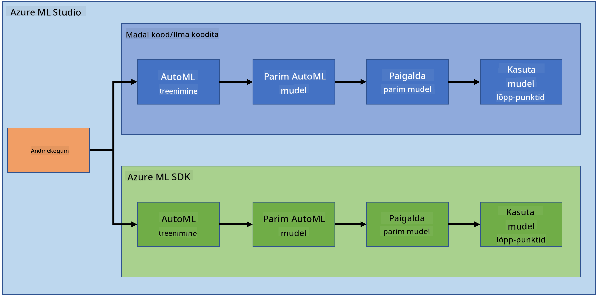
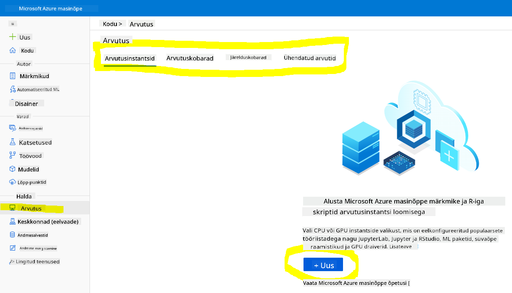
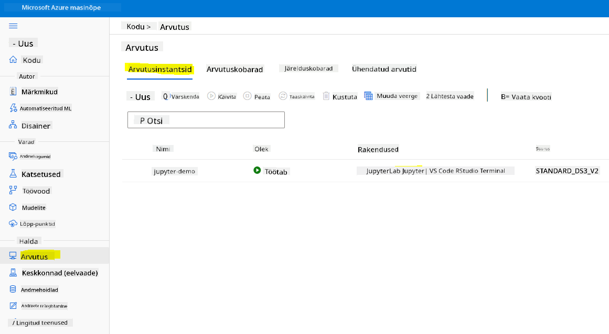
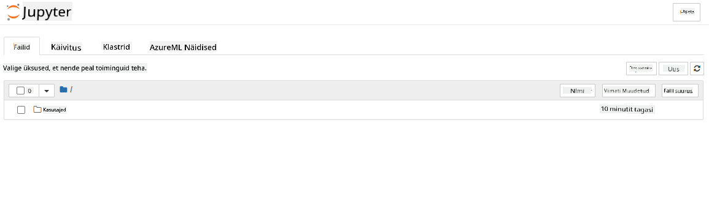

<!--
CO_OP_TRANSLATOR_METADATA:
{
  "original_hash": "472d3fab1c5be50f387336e7a686dbe1",
  "translation_date": "2025-10-11T15:31:31+00:00",
  "source_file": "5-Data-Science-In-Cloud/19-Azure/README.md",
  "language_code": "et"
}
-->
# Andmeteadus pilves: "Azure ML SDK" meetod

| ](../../sketchnotes/19-DataScience-Cloud.png)|
|:---:|
| Andmeteadus pilves: Azure ML SDK - _Sketchnote by [@nitya](https://twitter.com/nitya)_ |

Sisukord:

- [Andmeteadus pilves: "Azure ML SDK" meetod](../../../../5-Data-Science-In-Cloud/19-Azure)
  - [Loengu-eelne viktoriin](../../../../5-Data-Science-In-Cloud/19-Azure)
  - [1. Sissejuhatus](../../../../5-Data-Science-In-Cloud/19-Azure)
    - [1.1 Mis on Azure ML SDK?](../../../../5-Data-Science-In-Cloud/19-Azure)
    - [1.2 Südamepuudulikkuse ennustusprojekti ja andmestiku tutvustus](../../../../5-Data-Science-In-Cloud/19-Azure)
  - [2. Mudeli treenimine Azure ML SDK-ga](../../../../5-Data-Science-In-Cloud/19-Azure)
    - [2.1 Azure ML tööruumi loomine](../../../../5-Data-Science-In-Cloud/19-Azure)
    - [2.2 Arvutusressursi loomine](../../../../5-Data-Science-In-Cloud/19-Azure)
    - [2.3 Andmestiku laadimine](../../../../5-Data-Science-In-Cloud/19-Azure)
    - [2.4 Märkmike loomine](../../../../5-Data-Science-In-Cloud/19-Azure)
    - [2.5 Mudeli treenimine](../../../../5-Data-Science-In-Cloud/19-Azure)
      - [2.5.1 Tööruumi, eksperimendi, arvutusklastri ja andmestiku seadistamine](../../../../5-Data-Science-In-Cloud/19-Azure)
      - [2.5.2 AutoML konfiguratsioon ja treenimine](../../../../5-Data-Science-In-Cloud/19-Azure)
  - [3. Mudeli juurutamine ja lõpp-punkti tarbimine Azure ML SDK-ga](../../../../5-Data-Science-In-Cloud/19-Azure)
    - [3.1 Parima mudeli salvestamine](../../../../5-Data-Science-In-Cloud/19-Azure)
    - [3.2 Mudeli juurutamine](../../../../5-Data-Science-In-Cloud/19-Azure)
    - [3.3 Lõpp-punkti tarbimine](../../../../5-Data-Science-In-Cloud/19-Azure)
  - [🚀 Väljakutse](../../../../5-Data-Science-In-Cloud/19-Azure)
  - [Loengu-järgne viktoriin](../../../../5-Data-Science-In-Cloud/19-Azure)
  - [Ülevaade ja iseseisev õppimine](../../../../5-Data-Science-In-Cloud/19-Azure)
  - [Ülesanne](../../../../5-Data-Science-In-Cloud/19-Azure)

## [Loengu-eelne viktoriin](https://ff-quizzes.netlify.app/en/ds/quiz/36)

## 1. Sissejuhatus

### 1.1 Mis on Azure ML SDK?

Andmeteadlased ja tehisintellekti arendajad kasutavad Azure Machine Learning SDK-d masinõppe töövoogude loomiseks ja käitamiseks Azure Machine Learning teenuse abil. Teenusega saab suhelda igas Python keskkonnas, sealhulgas Jupyter Notebooks, Visual Studio Code või teie lemmik Python IDE.

SDK peamised valdkonnad:

- Uurige, valmistage ette ja hallake masinõppe eksperimentides kasutatavate andmestike elutsüklit.
- Hallake pilveressursse masinõppe eksperimentide jälgimiseks, logimiseks ja organiseerimiseks.
- Treenige mudeleid kas lokaalselt või pilveressursse kasutades, sealhulgas GPU-kiirendatud mudelite treenimine.
- Kasutage automatiseeritud masinõpet, mis aktsepteerib konfiguratsiooniparameetreid ja treeningandmeid. See iteratsioonib automaatselt algoritmide ja hüperparameetrite seadistuste kaudu, et leida parim mudel ennustuste tegemiseks.
- Juurutage veebiteenuseid, et muuta treenitud mudelid RESTful teenusteks, mida saab tarbida igas rakenduses.

[Lisateave Azure Machine Learning SDK kohta](https://docs.microsoft.com/python/api/overview/azure/ml?WT.mc_id=academic-77958-bethanycheum&ocid=AID3041109)

[Varasemas õppetunnis](../18-Low-Code/README.md) nägime, kuidas treenida, juurutada ja tarbida mudelit madala koodi/ilma koodita meetodil. Kasutasime südamepuudulikkuse andmestikku, et luua südamepuudulikkuse ennustusmudel. Selles õppetunnis teeme täpselt sama, kuid kasutades Azure Machine Learning SDK-d.



### 1.2 Südamepuudulikkuse ennustusprojekti ja andmestiku tutvustus

Vaadake [siit](../18-Low-Code/README.md) südamepuudulikkuse ennustusprojekti ja andmestiku tutvustust.

## 2. Mudeli treenimine Azure ML SDK-ga
### 2.1 Azure ML tööruumi loomine

Lihtsuse huvides töötame Jupyter märkmikus. See eeldab, et teil on juba tööruum ja arvutusressurss. Kui teil on juba tööruum, võite otse hüpata jaotisse 2.3 Märkmiku loomine.

Kui ei, järgige juhiseid jaotises **2.1 Azure ML tööruumi loomine** [varasemas õppetunnis](../18-Low-Code/README.md), et luua tööruum.

### 2.2 Arvutusressursi loomine

[Azure ML tööruumis](https://ml.azure.com/), mille me varem lõime, minge menüüsse Compute ja näete erinevaid arvutusressursse.



Loome arvutusressursi Jupyter märkmiku jaoks. 
1. Klõpsake nupul + New. 
2. Pange oma arvutusressursile nimi.
3. Valige oma valikud: CPU või GPU, VM suurus ja tuumade arv.
4. Klõpsake nupul Create.

Palju õnne, olete just loonud arvutusressursi! Kasutame seda arvutusressurssi märkmiku loomiseks jaotises [Märkmike loomine](../../../../5-Data-Science-In-Cloud/19-Azure).

### 2.3 Andmestiku laadimine
Kui te pole veel andmestikku üles laadinud, vaadake jaotist **2.3 Andmestiku laadimine** [varasemas õppetunnis](../18-Low-Code/README.md).

### 2.4 Märkmike loomine

> **_MÄRKUS:_** Järgmise sammu jaoks võite kas luua uue märkmiku nullist või laadida üles [märkmiku, mille me lõime](notebook.ipynb) oma Azure ML Studio keskkonda. Märkmiku üleslaadimiseks klõpsake lihtsalt menüül "Notebook" ja laadige märkmik üles.

Märkmikud on andmeteaduse protsessis väga olulised. Neid saab kasutada andmete uurimiseks (EDA), mudeli treenimiseks arvutusklastris või lõpp-punkti juurutamiseks inferentsiklastris.

Märkmiku loomiseks vajame arvutusressurssi, mis teenindab Jupyter märkmiku instantsi. Minge tagasi [Azure ML tööruumi](https://ml.azure.com/) ja klõpsake Compute instances. Arvutusressursside loendis peaksite nägema [varem loodud arvutusressurssi](../../../../5-Data-Science-In-Cloud/19-Azure). 

1. Rakenduste jaotises klõpsake Jupyter valikul. 
2. Märkige ruut "Yes, I understand" ja klõpsake nupul Continue.

3. See avab uue brauseri vahekaardi teie Jupyter märkmiku instantsiga. Klõpsake nupul "New", et luua märkmik.



Nüüd, kui meil on märkmik, saame alustada mudeli treenimist Azure ML SDK-ga.

### 2.5 Mudeli treenimine

Kui teil tekib kahtlusi, vaadake [Azure ML SDK dokumentatsiooni](https://docs.microsoft.com/python/api/overview/azure/ml?WT.mc_id=academic-77958-bethanycheum&ocid=AID3041109). Seal on kogu vajalik teave, et mõista mooduleid, mida selles õppetunnis käsitleme.

#### 2.5.1 Tööruumi, eksperimendi, arvutusklastri ja andmestiku seadistamine

Tööruumi laadimiseks konfiguratsioonifailist kasutage järgmist koodi:

```python
from azureml.core import Workspace
ws = Workspace.from_config()
```

See tagastab objekti tüüpi `Workspace`, mis esindab tööruumi. Seejärel peate looma `eksperimendi`, kasutades järgmist koodi:

```python
from azureml.core import Experiment
experiment_name = 'aml-experiment'
experiment = Experiment(ws, experiment_name)
```
Eksperimendi loomiseks või hankimiseks tööruumist küsitakse eksperimenti nime järgi. Eksperimendi nimi peab olema 3–36 tähemärki pikk, algama tähe või numbriga ning sisaldama ainult tähti, numbreid, alakriipse ja sidekriipse. Kui eksperimenti tööruumis ei leita, luuakse uus eksperiment.

Nüüd peate looma treenimiseks arvutusklastri, kasutades järgmist koodi. Pange tähele, et see samm võib võtta paar minutit.

```python
from azureml.core.compute import AmlCompute

aml_name = "heart-f-cluster"
try:
    aml_compute = AmlCompute(ws, aml_name)
    print('Found existing AML compute context.')
except:
    print('Creating new AML compute context.')
    aml_config = AmlCompute.provisioning_configuration(vm_size = "Standard_D2_v2", min_nodes=1, max_nodes=3)
    aml_compute = AmlCompute.create(ws, name = aml_name, provisioning_configuration = aml_config)
    aml_compute.wait_for_completion(show_output = True)

cts = ws.compute_targets
compute_target = cts[aml_name]
```

Andmestiku saab tööruumist hankida andmestiku nime järgi järgmiselt:

```python
dataset = ws.datasets['heart-failure-records']
df = dataset.to_pandas_dataframe()
df.describe()
```
#### 2.5.2 AutoML konfiguratsioon ja treenimine

AutoML konfiguratsiooni seadistamiseks kasutage [AutoMLConfig klassi](https://docs.microsoft.com/python/api/azureml-train-automl-client/azureml.train.automl.automlconfig(class)?WT.mc_id=academic-77958-bethanycheum&ocid=AID3041109).

Nagu dokumentatsioonis kirjeldatud, on palju parameetreid, millega saate mängida. Selle projekti jaoks kasutame järgmisi parameetreid:

- `experiment_timeout_minutes`: Maksimaalne aeg (minutites), mille jooksul eksperiment võib töötada enne automaatset peatamist ja tulemuste kättesaadavaks tegemist.
- `max_concurrent_iterations`: Maksimaalne lubatud treeningiteratsioonide arv eksperimendi jaoks.
- `primary_metric`: Peamine mõõdik, mida kasutatakse eksperimendi oleku määramiseks.
- `compute_target`: Azure Machine Learning arvutusressurss, millel käitatakse automatiseeritud masinõppe eksperimenti.
- `task`: Ülesande tüüp, mida käitada. Väärtused võivad olla 'classification', 'regression' või 'forecasting', sõltuvalt automatiseeritud ML probleemi tüübist.
- `training_data`: Treeningandmed, mida eksperimendis kasutatakse. See peaks sisaldama nii treeningfunktsioone kui ka märgistusveergu (valikuliselt ka näidiskaalu veergu).
- `label_column_name`: Märgistusveeru nimi.
- `path`: Täielik tee Azure Machine Learning projekti kaustani.
- `enable_early_stopping`: Kas lubada varajane lõpetamine, kui skoor lühiajaliselt ei parane.
- `featurization`: Näitaja, kas featurization samm tuleks automaatselt teha või mitte, või kas kasutada kohandatud featurizationi.
- `debug_log`: Logifail, kuhu kirjutatakse silumisinfo.

```python
from azureml.train.automl import AutoMLConfig

project_folder = './aml-project'

automl_settings = {
    "experiment_timeout_minutes": 20,
    "max_concurrent_iterations": 3,
    "primary_metric" : 'AUC_weighted'
}

automl_config = AutoMLConfig(compute_target=compute_target,
                             task = "classification",
                             training_data=dataset,
                             label_column_name="DEATH_EVENT",
                             path = project_folder,  
                             enable_early_stopping= True,
                             featurization= 'auto',
                             debug_log = "automl_errors.log",
                             **automl_settings
                            )
```
Nüüd, kui teie konfiguratsioon on seadistatud, saate mudelit treenida, kasutades järgmist koodi. See samm võib võtta kuni tund, sõltuvalt teie klastri suurusest.

```python
remote_run = experiment.submit(automl_config)
```
RunDetails vidinat saab kasutada erinevate eksperimentide kuvamiseks.
```python
from azureml.widgets import RunDetails
RunDetails(remote_run).show()
```
## 3. Mudeli juurutamine ja lõpp-punkti tarbimine Azure ML SDK-ga

### 3.1 Parima mudeli salvestamine

`remote_run` on objekt tüüpi [AutoMLRun](https://docs.microsoft.com/python/api/azureml-train-automl-client/azureml.train.automl.run.automlrun?WT.mc_id=academic-77958-bethanycheum&ocid=AID3041109). See objekt sisaldab meetodit `get_output()`, mis tagastab parima jooksu ja vastava treenitud mudeli.

```python
best_run, fitted_model = remote_run.get_output()
```
Parameetreid, mida parim mudel kasutas, saab näha lihtsalt `fitted_model` printimisega, ja parima mudeli omadusi saab vaadata meetodi [get_properties()](https://docs.microsoft.com/python/api/azureml-core/azureml.core.run(class)?view=azure-ml-py#azureml_core_Run_get_properties?WT.mc_id=academic-77958-bethanycheum&ocid=AID3041109) abil.

```python
best_run.get_properties()
```

Nüüd registreerige mudel meetodiga [register_model](https://docs.microsoft.com/python/api/azureml-train-automl-client/azureml.train.automl.run.automlrun?view=azure-ml-py#register-model-model-name-none--description-none--tags-none--iteration-none--metric-none-?WT.mc_id=academic-77958-bethanycheum&ocid=AID3041109).
```python
model_name = best_run.properties['model_name']
script_file_name = 'inference/score.py'
best_run.download_file('outputs/scoring_file_v_1_0_0.py', 'inference/score.py')
description = "aml heart failure project sdk"
model = best_run.register_model(model_name = model_name,
                                model_path = './outputs/',
                                description = description,
                                tags = None)
```
### 3.2 Mudeli juurutamine

Kui parim mudel on salvestatud, saame selle juurutada klassi [InferenceConfig](https://docs.microsoft.com/python/api/azureml-core/azureml.core.model.inferenceconfig?view=azure-ml-py?ocid=AID3041109) abil. InferenceConfig esindab konfiguratsiooniseadeid kohandatud keskkonna jaoks, mida kasutatakse juurutamiseks. Klass [AciWebservice](https://docs.microsoft.com/python/api/azureml-core/azureml.core.webservice.aciwebservice?view=azure-ml-py) esindab masinõppe mudelit, mis on juurutatud veebiteenuse lõpp-punktina Azure Container Instances keskkonnas. Juurutatud teenus luuakse mudeli, skripti ja seotud failide põhjal. Tulemuseks on koormustasakaalustatud HTTP lõpp-punkt koos REST API-ga. Selle API-le saab saata andmeid ja saada mudeli tagastatud ennustuse.

Mudelit juurutatakse meetodiga [deploy](https://docs.microsoft.com/python/api/azureml-core/azureml.core.model(class)?view=azure-ml-py#deploy-workspace--name--models--inference-config-none--deployment-config-none--deployment-target-none--overwrite-false--show-output-false-?WT.mc_id=academic-77958-bethanycheum&ocid=AID3041109).

```python
from azureml.core.model import InferenceConfig, Model
from azureml.core.webservice import AciWebservice

inference_config = InferenceConfig(entry_script=script_file_name, environment=best_run.get_environment())

aciconfig = AciWebservice.deploy_configuration(cpu_cores = 1,
                                               memory_gb = 1,
                                               tags = {'type': "automl-heart-failure-prediction"},
                                               description = 'Sample service for AutoML Heart Failure Prediction')

aci_service_name = 'automl-hf-sdk'
aci_service = Model.deploy(ws, aci_service_name, [model], inference_config, aciconfig)
aci_service.wait_for_deployment(True)
print(aci_service.state)
```
See samm võib võtta paar minutit.

### 3.3 Lõpp-punkti tarbimine

Lõpp-punkti tarbimiseks looge näidis sisend:
```python
data = {
    "data":
    [
        {
            'age': "60",
            'anaemia': "false",
            'creatinine_phosphokinase': "500",
            'diabetes': "false",
            'ejection_fraction': "38",
            'high_blood_pressure': "false",
            'platelets': "260000",
            'serum_creatinine': "1.40",
            'serum_sodium': "137",
            'sex': "false",
            'smoking': "false",
            'time': "130",
        },
    ],
}

test_sample = str.encode(json.dumps(data))
```
Ja siis saate selle sisendi saata oma mudelile ennustamiseks:

```python
response = aci_service.run(input_data=test_sample)
response
```
See peaks tagastama `'{"result": [false]}'`. See tähendab, et patsiendi sisend, mille me saatsime lõpp-punkti, genereeris ennustuse `false`, mis tähendab, et see inimene ei ole tõenäoliselt südameinfarkti ohus.

Palju õnne! Te just kasutasite Azure ML-i abil treenitud ja juurutatud mudelit Azure ML SDK-ga!

> **_NOTE:_** Kui olete projektiga lõpetanud, ärge unustage kõiki ressursse kustutada.

## 🚀 Väljakutse

SDK abil saab teha palju muudki, kahjuks ei jõua me kõike selles tunnis käsitleda. Kuid hea uudis on see, et SDK dokumentatsiooni sirvimise oskus võib teid iseseisvalt kaugele viia. Vaadake Azure ML SDK dokumentatsiooni ja leidke `Pipeline` klass, mis võimaldab luua töövooge. Töövoog koosneb sammudest, mida saab järjestikku täita.

**VIHJE:** Minge [SDK dokumentatsiooni](https://docs.microsoft.com/python/api/overview/azure/ml/?view=azure-ml-py?WT.mc_id=academic-77958-bethanycheum&ocid=AID3041109) lehele ja sisestage otsinguribale märksõnu nagu "Pipeline". Otsingutulemustes peaks olema `azureml.pipeline.core.Pipeline` klass.

## [Loengu järgne viktoriin](https://ff-quizzes.netlify.app/en/ds/quiz/37)

## Ülevaade ja iseseisev õppimine

Selles tunnis õppisite, kuidas treenida, juurutada ja kasutada mudelit südamepuudulikkuse riski ennustamiseks Azure ML SDK abil pilves. Vaadake seda [dokumentatsiooni](https://docs.microsoft.com/python/api/overview/azure/ml/?view=azure-ml-py?WT.mc_id=academic-77958-bethanycheum&ocid=AID3041109), et saada lisateavet Azure ML SDK kohta. Proovige luua oma mudel Azure ML SDK-ga.

## Ülesanne

[Andmeteaduse projekt Azure ML SDK abil](assignment.md)

---

**Lahtiütlus**:  
See dokument on tõlgitud AI tõlketeenuse [Co-op Translator](https://github.com/Azure/co-op-translator) abil. Kuigi püüame tagada täpsust, palume arvestada, et automaatsed tõlked võivad sisaldada vigu või ebatäpsusi. Algne dokument selle algses keeles tuleks pidada autoriteetseks allikaks. Olulise teabe puhul soovitame kasutada professionaalset inimtõlget. Me ei vastuta selle tõlke kasutamisest tulenevate arusaamatuste või valesti tõlgenduste eest.