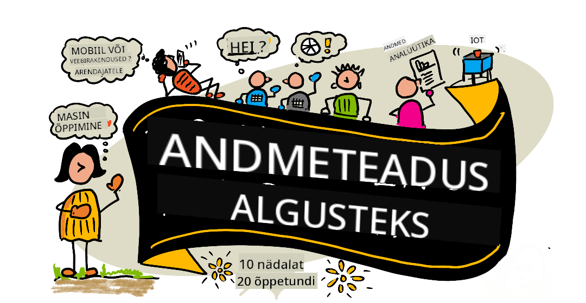

<!--
CO_OP_TRANSLATOR_METADATA:
{
  "original_hash": "210052dafe5b5d956c427824e2c96686",
  "translation_date": "2025-12-19T12:34:32+00:00",
  "source_file": "README.md",
  "language_code": "et"
}
-->
# Andmeteadus algajatele - õppekava

Microsofti Azure Cloud Advocates pakuvad 10-nädalast, 20-õppetunnist koosnevat õppekava, mis käsitleb andmeteadust. Iga õppetund sisaldab eelküsimustikku ja järelküsimustikku, kirjalikke juhiseid õppetunni läbimiseks, lahendust ja ülesannet. Meie projektipõhine pedagoogika võimaldab õppida ehitades, mis on tõestatud viis uute oskuste kinnistamiseks.

**Südamlik tänu meie autoritele:** [Jasmine Greenaway](https://www.twitter.com/paladique), [Dmitry Soshnikov](http://soshnikov.com), [Nitya Narasimhan](https://twitter.com/nitya), [Jalen McGee](https://twitter.com/JalenMcG), [Jen Looper](https://twitter.com/jenlooper), [Maud Levy](https://twitter.com/maudstweets), [Tiffany Souterre](https://twitter.com/TiffanySouterre), [Christopher Harrison](https://www.twitter.com/geektrainer).

**🙏 Eriline tänu 🙏 meie [Microsoft Student Ambassador](https://studentambassadors.microsoft.com/) autoritele, ülevaatajatele ja sisuloojatele,** eriti Aaryan Arora, [Aditya Garg](https://github.com/AdityaGarg00), [Alondra Sanchez](https://www.linkedin.com/in/alondra-sanchez-molina/), [Ankita Singh](https://www.linkedin.com/in/ankitasingh007), [Anupam Mishra](https://www.linkedin.com/in/anupam--mishra/), [Arpita Das](https://www.linkedin.com/in/arpitadas01/), ChhailBihari Dubey, [Dibri Nsofor](https://www.linkedin.com/in/dibrinsofor), [Dishita Bhasin](https://www.linkedin.com/in/dishita-bhasin-7065281bb), [Majd Safi](https://www.linkedin.com/in/majd-s/), [Max Blum](https://www.linkedin.com/in/max-blum-6036a1186/), [Miguel Correa](https://www.linkedin.com/in/miguelmque/), [Mohamma Iftekher (Iftu) Ebne Jalal](https://twitter.com/iftu119), [Nawrin Tabassum](https://www.linkedin.com/in/nawrin-tabassum), [Raymond Wangsa Putra](https://www.linkedin.com/in/raymond-wp/), [Rohit Yadav](https://www.linkedin.com/in/rty2423), Samridhi Sharma, [Sanya Sinha](https://www.linkedin.com/mwlite/in/sanya-sinha-13aab1200),
[Sheena Narula](https://www.linkedin.com/in/sheena-narua-n/), [Tauqeer Ahmad](https://www.linkedin.com/in/tauqeerahmad5201/), Yogendrasingh Pawar , [Vidushi Gupta](https://www.linkedin.com/in/vidushi-gupta07/), [Jasleen Sondhi](https://www.linkedin.com/in/jasleen-sondhi/)

||
|:---:|
| Andmeteadus algajatele - _Sketchnote autor [@nitya](https://twitter.com/nitya)_ |

### 🌐 Mitmekeelne tugi

#### Toetatud GitHub Actioni kaudu (automatiseeritud ja alati ajakohane)

<!-- CO-OP TRANSLATOR LANGUAGES TABLE START -->
[Arabic](../ar/README.md) | [Bengali](../bn/README.md) | [Bulgarian](../bg/README.md) | [Burmese (Myanmar)](../my/README.md) | [Chinese (Simplified)](../zh/README.md) | [Chinese (Traditional, Hong Kong)](../hk/README.md) | [Chinese (Traditional, Macau)](../mo/README.md) | [Chinese (Traditional, Taiwan)](../tw/README.md) | [Croatian](../hr/README.md) | [Czech](../cs/README.md) | [Danish](../da/README.md) | [Dutch](../nl/README.md) | [Estonian](./README.md) | [Finnish](../fi/README.md) | [French](../fr/README.md) | [German](../de/README.md) | [Greek](../el/README.md) | [Hebrew](../he/README.md) | [Hindi](../hi/README.md) | [Hungarian](../hu/README.md) | [Indonesian](../id/README.md) | [Italian](../it/README.md) | [Japanese](../ja/README.md) | [Kannada](../kn/README.md) | [Korean](../ko/README.md) | [Lithuanian](../lt/README.md) | [Malay](../ms/README.md) | [Malayalam](../ml/README.md) | [Marathi](../mr/README.md) | [Nepali](../ne/README.md) | [Nigerian Pidgin](../pcm/README.md) | [Norwegian](../no/README.md) | [Persian (Farsi)](../fa/README.md) | [Polish](../pl/README.md) | [Portuguese (Brazil)](../br/README.md) | [Portuguese (Portugal)](../pt/README.md) | [Punjabi (Gurmukhi)](../pa/README.md) | [Romanian](../ro/README.md) | [Russian](../ru/README.md) | [Serbian (Cyrillic)](../sr/README.md) | [Slovak](../sk/README.md) | [Slovenian](../sl/README.md) | [Spanish](../es/README.md) | [Swahili](../sw/README.md) | [Swedish](../sv/README.md) | [Tagalog (Filipino)](../tl/README.md) | [Tamil](../ta/README.md) | [Telugu](../te/README.md) | [Thai](../th/README.md) | [Turkish](../tr/README.md) | [Ukrainian](../uk/README.md) | [Urdu](../ur/README.md) | [Vietnamese](../vi/README.md)
<!-- CO-OP TRANSLATOR LANGUAGES TABLE END -->

**Kui soovite, et toetataks täiendavaid tõlkekeeli, on need loetletud [siin](https://github.com/Azure/co-op-translator/blob/main/getting_started/supported-languages.md)**

#### Liitu meie kogukonnaga 

Meil on käimas Discordi õppesari koos tehisintellektiga, lisateabe saamiseks ja liitumiseks külastage [Learn with AI Series](https://aka.ms/learnwithai/discord) 18. - 30. septembril 2025. Saate näpunäiteid ja nippe GitHub Copiloti kasutamiseks andmeteaduses.

# Kas oled üliõpilane?

Alusta järgmiste ressurssidega:

- [Üliõpilaste keskuse leht](https://docs.microsoft.com/en-gb/learn/student-hub?WT.mc_id=academic-77958-bethanycheum) Sellel lehel leiad algajatele mõeldud ressursid, üliõpilaste komplektid ja isegi võimalused saada tasuta sertifikaadivautšer. See on leht, mille soovid järjehoidjatesse lisada ja aeg-ajalt kontrollida, kuna sisu vahetatakse vähemalt kord kuus.
- [Microsoft Learn Student Ambassadors](https://studentambassadors.microsoft.com?WT.mc_id=academic-77958-bethanycheum) Liitu ülemaailmse üliõpilasambassadoreid ühendava kogukonnaga, see võib olla sinu tee Microsofti.

# Alustamine

## 📚 Dokumentatsioon

- **[Paigaldusjuhend](INSTALLATION.md)** - samm-sammult juhised algajatele
- **[Kasutusjuhend](USAGE.md)** - näited ja levinud töövood
- **[Tõrkeotsing](TROUBLESHOOTING.md)** - lahendused levinud probleemidele
- **[Panustamise juhend](CONTRIBUTING.md)** - kuidas sellesse projekti panustada
- **[Õpetajatele](for-teachers.md)** - juhised õpetamiseks ja klassiruumi ressursid

## 👨‍🎓 Üliõpilastele
> **Täielikud algajad**: Kas oled andmeteaduses uus? Alusta meie [algajasõbralike näidete](examples/README.md) juurest! Need lihtsad, hästi kommenteeritud näited aitavad sul mõista põhialuseid enne kogu õppekavasse süvenemist.
> **[Üliõpilased](https://aka.ms/student-page)**: selle õppekava iseseisvaks kasutamiseks tee kogu hoidla fork ja täida harjutused iseseisvalt, alustades eelloengu viktoriiniga. Seejärel loe loeng läbi ja täida ülejäänud tegevused. Proovi projekte luua õppetunde mõistes, mitte lahenduskoodi kopeerides; see kood on siiski saadaval iga projektipõhise õppetunni /solutions kaustas. Teine mõte on moodustada sõpradega õpperühm ja läbida sisu koos. Edasiseks õppimiseks soovitame [Microsoft Learn](https://docs.microsoft.com/en-us/users/jenlooper-2911/collections/qprpajyoy3x0g7?WT.mc_id=academic-77958-bethanycheum).

**Kiire algus:**
1. Vaata [paigaldusjuhendit](INSTALLATION.md), et seadistada oma keskkond
2. Tutvu [kasutusjuhendiga](USAGE.md), et õppida õppekavaga töötama
3. Alusta 1. õppetunnist ja tööta järjestikku edasi
4. Liitu meie [Discordi kogukonnaga](https://aka.ms/ds4beginners/discord) toe saamiseks

## 👩‍🏫 Õpetajatele

> **Õpetajad**: oleme lisanud [mõningaid soovitusi](for-teachers.md) selle õppekava kasutamiseks. Ootame teie tagasisidet [meie arutelufoorumis](https://github.com/microsoft/Data-Science-For-Beginners/discussions)!

## Tutvu meeskonnaga

**Gif autor:** [Mohit Jaisal](https://www.linkedin.com/in/mohitjaisal)
> 🎥 Klõpsake ülaloleval pildil, et vaadata videot projektist ja inimestest, kes selle lõid!

## Pedagoogika

Selle õppekava loomisel oleme valinud kaks pedagoogilist põhimõtet: tagada, et see põhineb projektidel ja sisaldab sagedasi viktoriine. Selle sarja lõpuks on õpilased omandanud andmeteaduse põhialused, sealhulgas eetilised kontseptsioonid, andmete ettevalmistamise, erinevad viisid andmetega töötamiseks, andmete visualiseerimise, andmete analüüsi, andmeteaduse reaalse maailma kasutusjuhtumid ja palju muud.

Lisaks seab madala panusega viktoriin enne tundi õpilasele eesmärgi õppida teemat, samas kui teine viktoriin pärast tundi tagab teadmiste parema kinnistumise. See õppekava on loodud olema paindlik ja lõbus ning seda saab läbida tervikuna või osaliselt. Projektid algavad väikestena ja muutuvad 10-nädalase tsükli lõpuks järjest keerukamaks.

> Leidke meie [käitumiskoodeks](CODE_OF_CONDUCT.md), [panustamise](CONTRIBUTING.md), [tõlke](TRANSLATIONS.md) juhised. Ootame teie konstruktiivset tagasisidet!

## Iga õppetund sisaldab:

- Valikuline visandmärkmed
- Valikuline täiendav video
- Soojendav viktoriin enne õppetundi
- Kirjalik õppetund
- Projektipõhiste õppetundide puhul samm-sammult juhendid projekti ehitamiseks
- Teadmiste kontroll
- Väljakutse
- Täiendav lugemine
- Kodune ülesanne
- [Pärast õppetundi viktoriin](https://ff-quizzes.netlify.app/en/)

> **Märkused viktoriinide kohta**: Kõik viktoriinid asuvad Quiz-App kaustas, kokku 40 viktoriini, igaühes kolm küsimust. Neile viidatakse õppetundide sees, kuid viktoriini rakendust saab käivitada lokaalselt või juurutada Azure’i; järgige juhiseid `quiz-app` kaustas. Neid lokaliseeritakse järk-järgult.

## 🎓 Algajale sobivad näited

**Uus andmeteaduses?** Oleme loonud spetsiaalse [näidiste kataloogi](examples/README.md) lihtsa ja hästi kommenteeritud koodiga, mis aitab teil alustada:

- 🌟 **Tere maailm** - Teie esimene andmeteaduse programm
- 📂 **Andmete laadimine** - Õppige andmekogumeid lugema ja uurima
- 📊 **Lihtne analüüs** - Arvutage statistikat ja leidke mustreid
- 📈 **Põhiline visualiseerimine** - Looge diagramme ja graafikuid
- 🔬 **Reaalmaailma projekt** - Täielik töövoog algusest lõpuni

Iga näide sisaldab üksikasjalikke kommentaare, mis selgitavad iga sammu, muutes selle ideaalseks täiesti algajatele!

👉 **[Alustage näidetega](examples/README.md)** 👈

## Õppetunnid

||
|:---:|
| Andmeteadus algajatele: teekaart - _Visandmärkmed autorilt [@nitya](https://twitter.com/nitya)_ |

| Õppetunni number | Teema | Õppetunni grupp | Õpieesmärgid | Lingitud õppetund | Autor |
| :-----------: | :----------------------------------------: | :--------------------------------------------------: | :-----------------------------------------------------------------------------------------------------------------------------------------------------------------------: | :---------------------------------------------------------------------: | :----: |
| 01 | Andmeteaduse määratlemine | [Sissejuhatus](1-Introduction/README.md) | Õppida andmeteaduse põhimõisteid ja kuidas see on seotud tehisintellekti, masinõppe ja suurandmetega. | [õppetund](1-Introduction/01-defining-data-science/README.md) [video](https://youtu.be/beZ7Mb_oz9I) | [Dmitry](http://soshnikov.com) |
| 02 | Andmeteaduse eetika | [Sissejuhatus](1-Introduction/README.md) | Andmete eetika kontseptsioonid, väljakutsed ja raamistikud. | [õppetund](1-Introduction/02-ethics/README.md) | [Nitya](https://twitter.com/nitya) |
| 03 | Andmete määratlemine | [Sissejuhatus](1-Introduction/README.md) | Kuidas andmeid klassifitseeritakse ja nende levinumad allikad. | [õppetund](1-Introduction/03-defining-data/README.md) | [Jasmine](https://www.twitter.com/paladique) |
| 04 | Statistika ja tõenäosuse sissejuhatus | [Sissejuhatus](1-Introduction/README.md) | Matemaatilised tõenäosuse ja statistika tehnikad andmete mõistmiseks. | [õppetund](1-Introduction/04-stats-and-probability/README.md) [video](https://youtu.be/Z5Zy85g4Yjw) | [Dmitry](http://soshnikov.com) |
| 05 | Töötamine relatsioonandmetega | [Andmetega töötamine](2-Working-With-Data/README.md) | Sissejuhatus relatsioonandmetesse ja relatsioonandmete uurimise ja analüüsi põhialused struktureeritud päringukeele ehk SQL-iga (hääldatakse "sii-kwell"). | [õppetund](2-Working-With-Data/05-relational-databases/README.md) | [Christopher](https://www.twitter.com/geektrainer) | | |
| 06 | Töötamine NoSQL andmetega | [Andmetega töötamine](2-Working-With-Data/README.md) | Sissejuhatus mitte-relatsioonandmetesse, nende erinevatesse tüüpidesse ja dokumentandmebaaside uurimise ja analüüsi põhialustesse. | [õppetund](2-Working-With-Data/06-non-relational/README.md) | [Jasmine](https://twitter.com/paladique)|
| 07 | Töötamine Pythoniga | [Andmetega töötamine](2-Working-With-Data/README.md) | Põhitõed Pythoniga andmete uurimiseks, kasutades raamatukogusid nagu Pandas. Soovitatav on põhiteadmised Python programmeerimisest. | [õppetund](2-Working-With-Data/07-python/README.md) [video](https://youtu.be/dZjWOGbsN4Y) | [Dmitry](http://soshnikov.com) |
| 08 | Andmete ettevalmistamine | [Andmetega töötamine](2-Working-With-Data/README.md) | Teemad andmetehnikate kohta andmete puhastamiseks ja teisendamiseks, et toime tulla puuduvate, ebatäpsete või puudulike andmetega seotud väljakutsetega. | [õppetund](2-Working-With-Data/08-data-preparation/README.md) | [Jasmine](https://www.twitter.com/paladique) |
| 09 | Koguste visualiseerimine | [Andmete visualiseerimine](3-Data-Visualization/README.md) | Õppige kasutama Matplotlibi lindude andmete visualiseerimiseks 🦆 | [õppetund](3-Data-Visualization/09-visualization-quantities/README.md) | [Jen](https://twitter.com/jenlooper) |
| 10 | Andmete jaotuste visualiseerimine | [Andmete visualiseerimine](3-Data-Visualization/README.md) | Vaatluste ja trendide visualiseerimine kindlas vahemikus. | [õppetund](3-Data-Visualization/10-visualization-distributions/README.md) | [Jen](https://twitter.com/jenlooper) |
| 11 | Proportsioonide visualiseerimine | [Andmete visualiseerimine](3-Data-Visualization/README.md) | Diskreetsete ja rühmitatud protsentide visualiseerimine. | [õppetund](3-Data-Visualization/11-visualization-proportions/README.md) | [Jen](https://twitter.com/jenlooper) |
| 12 | Suhete visualiseerimine | [Andmete visualiseerimine](3-Data-Visualization/README.md) | Andmekogumite ja nende muutujate vaheliste seoste ja korrelatsioonide visualiseerimine. | [õppetund](3-Data-Visualization/12-visualization-relationships/README.md) | [Jen](https://twitter.com/jenlooper) |
| 13 | Mõtestatud visualiseeringud | [Andmete visualiseerimine](3-Data-Visualization/README.md) | Tehnikad ja juhised, kuidas muuta oma visualiseeringud väärtuslikuks tõhusa probleemilahenduse ja teadmiste saamiseks. | [õppetund](3-Data-Visualization/13-meaningful-visualizations/README.md) | [Jen](https://twitter.com/jenlooper) |
| 14 | Sissejuhatus andmeteaduse elutsüklisse | [Elutsükkel](4-Data-Science-Lifecycle/README.md) | Sissejuhatus andmeteaduse elutsüklisse ja selle esimesele etapile andmete hankimisel ja väljavõtmisel. | [õppetund](4-Data-Science-Lifecycle/14-Introduction/README.md) | [Jasmine](https://twitter.com/paladique) |
| 15 | Analüüs | [Elutsükkel](4-Data-Science-Lifecycle/README.md) | See andmeteaduse elutsükli faas keskendub andmete analüüsi tehnikatele. | [õppetund](4-Data-Science-Lifecycle/15-analyzing/README.md) | [Jasmine](https://twitter.com/paladique) | | |
| 16 | Kommunikatsioon | [Elutsükkel](4-Data-Science-Lifecycle/README.md) | See andmeteaduse elutsükli faas keskendub andmetest saadud teadmiste esitamisele viisil, mis teeb otsustajatele nende mõistmise lihtsamaks. | [õppetund](4-Data-Science-Lifecycle/16-communication/README.md) | [Jalen](https://twitter.com/JalenMcG) | | |
| 17 | Andmeteadus pilves | [Pilvandmed](5-Data-Science-In-Cloud/README.md) | See õppetundide sari tutvustab andmeteadust pilves ja selle eeliseid. | [õppetund](5-Data-Science-In-Cloud/17-Introduction/README.md) | [Tiffany](https://twitter.com/TiffanySouterre) ja [Maud](https://twitter.com/maudstweets) |
| 18 | Andmeteadus pilves | [Pilvandmed](5-Data-Science-In-Cloud/README.md) | Mudelite koolitamine madala koodiga tööriistadega. |[õppetund](5-Data-Science-In-Cloud/18-Low-Code/README.md) | [Tiffany](https://twitter.com/TiffanySouterre) ja [Maud](https://twitter.com/maudstweets) |
| 19 | Andmeteadus pilves | [Pilvandmed](5-Data-Science-In-Cloud/README.md) | Mudelite juurutamine Azure Machine Learning Studio abil. | [õppetund](5-Data-Science-In-Cloud/19-Azure/README.md)| [Tiffany](https://twitter.com/TiffanySouterre) ja [Maud](https://twitter.com/maudstweets) |
| 20 | Andmeteadus looduses | [Looduses](6-Data-Science-In-Wild/README.md) | Andmeteadusel põhinevad projektid reaalses maailmas. | [õppetund](6-Data-Science-In-Wild/20-Real-World-Examples/README.md) | [Nitya](https://twitter.com/nitya) |

## GitHub Codespaces

Järgige neid samme, et avada see näidis Codespaces'is:
1. Klõpsake menüüd Code ja valige valik Open with Codespaces.
2. Valige paneeli allosas + New codespace.
Lisateabe saamiseks vaadake [GitHubi dokumentatsiooni](https://docs.github.com/en/codespaces/developing-in-codespaces/creating-a-codespace-for-a-repository#creating-a-codespace).

## VSCode Remote - Containers
Järgige neid samme, et avada see hoidla konteineris, kasutades oma kohalikku masinat ja VSCode'i koos VS Code Remote - Containers laiendusega:

1. Kui kasutate arenduskonteinerit esimest korda, veenduge, et teie süsteem vastab eeltingimustele (nt Docker on installitud) [algusjuhendis](https://code.visualstudio.com/docs/devcontainers/containers#_getting-started).

Selle hoidla kasutamiseks võite avada hoidla isoleeritud Docker mahtudes:

**Märkus**: Tegemist on Remote-Containers: **Clone Repository in Container Volume...** käsuga, mis kloonib lähtekoodi Docker mahutisse, mitte kohalikku failisüsteemi. [Mahutid](https://docs.docker.com/storage/volumes/) on eelistatud mehhanism konteineri andmete säilitamiseks.

Või avage kohalikult kloonitud või alla laaditud hoidla versioon:

- Kloonige see hoidla oma kohalikku failisüsteemi.
- Vajutage F1 ja valige käsk **Remote-Containers: Open Folder in Container...**.
- Valige selle kausta kloonitud koopia, oodake konteineri käivitumist ja proovige.

## Võrguühenduseta juurdepääs

Seda dokumentatsiooni saab võrguühenduseta kasutada, kasutades [Docsify](https://docsify.js.org/#/). Forkige see hoidla, [installige Docsify](https://docsify.js.org/#/quickstart) oma kohalikule masinale, seejärel tippige selle hoidla juurkaustas `docsify serve`. Veebisait on saadaval pordil 3000 teie kohalikus hostis: `localhost:3000`.

> Märkus, märkmikud ei renderdata Docsify abil, nii et kui peate märkmikku käivitama, tehke seda eraldi VS Code'is, kasutades Python kernelit.

## Muud õppekavad

Meie meeskond toodab ka teisi õppekavasid! Vaadake:

<!-- CO-OP TRANSLATOR OTHER COURSES START -->
### LangChain

---

### Azure / Edge / MCP / Agents

---
 
### Generatiivse tehisintellekti sari

[-9333EA?style=for-the-badge&labelColor=E5E7EB&color=9333EA)](https://github.com/microsoft/Generative-AI-for-beginners-dotnet?WT.mc_id=academic-105485-koreyst)
[-C084FC?style=for-the-badge&labelColor=E5E7EB&color=C084FC)](https://github.com/microsoft/generative-ai-for-beginners-java?WT.mc_id=academic-105485-koreyst)
[-E879F9?style=for-the-badge&labelColor=E5E7EB&color=E879F9)](https://github.com/microsoft/generative-ai-with-javascript?WT.mc_id=academic-105485-koreyst)

---
 
### Põhialused

---
 
### Copiloti sari

<!-- CO-OP TRANSLATOR OTHER COURSES END -->

## Abi saamine

**Kas teil on probleeme?** Vaadake meie [Tõrkeotsingu juhendit](TROUBLESHOOTING.md), et leida lahendusi levinud probleemidele.

Kui jääte hätta või teil on küsimusi AI rakenduste loomise kohta, liituge teiste õppijate ja kogenud arendajatega MCP aruteludes. See on toetav kogukond, kus küsimused on teretulnud ja teadmisi jagatakse vabalt.

Kui teil on toote tagasisidet või ehitamisel vigu, külastage:

---

<!-- CO-OP TRANSLATOR DISCLAIMER START -->
**Vastutusest loobumine**:
See dokument on tõlgitud kasutades tehisintellektil põhinevat tõlketeenust [Co-op Translator](https://github.com/Azure/co-op-translator). Kuigi püüame tagada täpsust, palun arvestage, et automaatsed tõlked võivad sisaldada vigu või ebatäpsusi. Originaaldokument selle emakeeles tuleks pidada autoriteetseks allikaks. Olulise teabe puhul soovitatakse kasutada professionaalset inimtõlget. Me ei vastuta selle tõlke kasutamisest tulenevate arusaamatuste või valesti mõistmiste eest.
<!-- CO-OP TRANSLATOR DISCLAIMER END -->