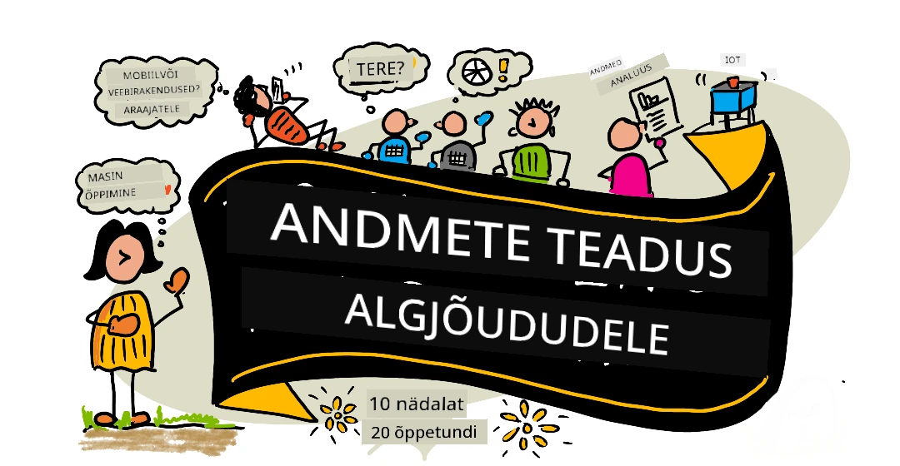
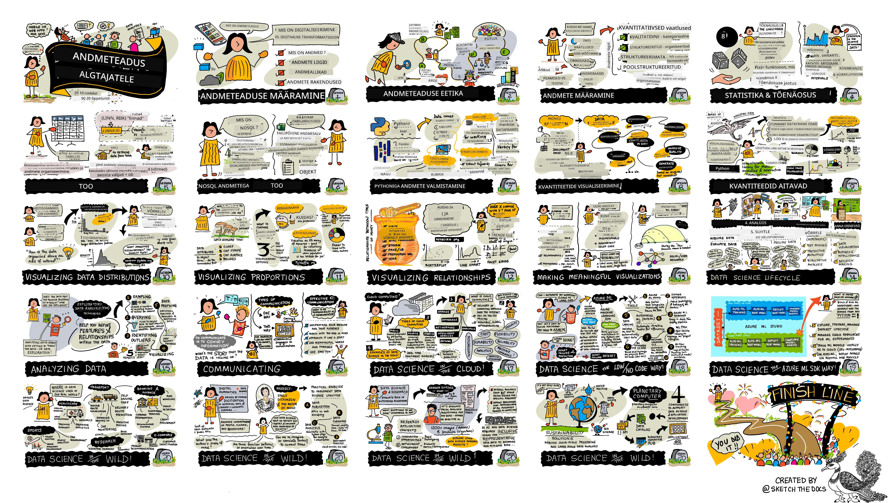

# Andmeteadus algajatele – õppekava

[](https://github.com/codespaces/new?hide_repo_select=true&ref=main&repo=344191198)

[](https://github.com/microsoft/Data-Science-For-Beginners/blob/master/LICENSE)
[](https://GitHub.com/microsoft/Data-Science-For-Beginners/graphs/contributors/)
[](https://GitHub.com/microsoft/Data-Science-For-Beginners/issues/)
[](https://GitHub.com/microsoft/Data-Science-For-Beginners/pulls/)
[](http://makeapullrequest.com)

[](https://GitHub.com/microsoft/Data-Science-For-Beginners/watchers/)
[](https://GitHub.com/microsoft/Data-Science-For-Beginners/network/)
[](https://GitHub.com/microsoft/Data-Science-For-Beginners/stargazers/)


[](https://discord.gg/nTYy5BXMWG)

[](https://aka.ms/foundry/forum)

Microsofti Azure Cloud Advocates pakuvad rõõmuga 10-nädalast ja 20-õppetunnist koosnevat andmeteaduse õppekava. Iga õppetund sisaldab eel- ja järelekatseid, kirjalikke juhiseid õppetunni lõpuleviimiseks, lahendust ning ülesannet. Meie projektipõhine pedagoogika võimaldab õppida ehitamise käigus, mis on tõestatud viis uute oskuste omandamiseks.

**Südamlik tänu meie autoritele:** [Jasmine Greenaway](https://www.twitter.com/paladique), [Dmitry Soshnikov](http://soshnikov.com), [Nitya Narasimhan](https://twitter.com/nitya), [Jalen McGee](https://twitter.com/JalenMcG), [Jen Looper](https://twitter.com/jenlooper), [Maud Levy](https://twitter.com/maudstweets), [Tiffany Souterre](https://twitter.com/TiffanySouterre), [Christopher Harrison](https://www.twitter.com/geektrainer).

**🙏 Eriti suur tänu 🙏 meie [Microsoft Student Ambassador](https://studentambassadors.microsoft.com/) autoritele, läbivaatajatele ja sisukontributooridele,** eriti Aaryan Arora, [Aditya Garg](https://github.com/AdityaGarg00), [Alondra Sanchez](https://www.linkedin.com/in/alondra-sanchez-molina/), [Ankita Singh](https://www.linkedin.com/in/ankitasingh007), [Anupam Mishra](https://www.linkedin.com/in/anupam--mishra/), [Arpita Das](https://www.linkedin.com/in/arpitadas01/), ChhailBihari Dubey, [Dibri Nsofor](https://www.linkedin.com/in/dibrinsofor), [Dishita Bhasin](https://www.linkedin.com/in/dishita-bhasin-7065281bb), [Majd Safi](https://www.linkedin.com/in/majd-s/), [Max Blum](https://www.linkedin.com/in/max-blum-6036a1186/), [Miguel Correa](https://www.linkedin.com/in/miguelmque/), [Mohamma Iftekher (Iftu) Ebne Jalal](https://twitter.com/iftu119), [Nawrin Tabassum](https://www.linkedin.com/in/nawrin-tabassum), [Raymond Wangsa Putra](https://www.linkedin.com/in/raymond-wp/), [Rohit Yadav](https://www.linkedin.com/in/rty2423), Samridhi Sharma, [Sanya Sinha](https://www.linkedin.com/mwlite/in/sanya-sinha-13aab1200),
[Sheena Narula](https://www.linkedin.com/in/sheena-narua-n/), [Tauqeer Ahmad](https://www.linkedin.com/in/tauqeerahmad5201/), Yogendrasingh Pawar , [Vidushi Gupta](https://www.linkedin.com/in/vidushi-gupta07/), [Jasleen Sondhi](https://www.linkedin.com/in/jasleen-sondhi/)

||
|:---:|
| Andmeteadus algajatele – _visandimärkus autorilt [@nitya](https://twitter.com/nitya)_ |

### 🌐 Mitmekeelne tugi

#### GitHub Actioni kaudu toetatud (automaatselt ja alati uuendatud)

<!-- CO-OP TRANSLATOR LANGUAGES TABLE START -->
[Arabic](../ar/README.md) | [Bengali](../bn/README.md) | [Bulgarian](../bg/README.md) | [Burmese (Myanmar)](../my/README.md) | [Chinese (Simplified)](../zh-CN/README.md) | [Chinese (Traditional, Hong Kong)](../zh-HK/README.md) | [Chinese (Traditional, Macau)](../zh-MO/README.md) | [Chinese (Traditional, Taiwan)](../zh-TW/README.md) | [Croatian](../hr/README.md) | [Czech](../cs/README.md) | [Danish](../da/README.md) | [Dutch](../nl/README.md) | [Estonian](./README.md) | [Finnish](../fi/README.md) | [French](../fr/README.md) | [German](../de/README.md) | [Greek](../el/README.md) | [Hebrew](../he/README.md) | [Hindi](../hi/README.md) | [Hungarian](../hu/README.md) | [Indonesian](../id/README.md) | [Italian](../it/README.md) | [Japanese](../ja/README.md) | [Kannada](../kn/README.md) | [Khmer](../km/README.md) | [Korean](../ko/README.md) | [Lithuanian](../lt/README.md) | [Malay](../ms/README.md) | [Malayalam](../ml/README.md) | [Marathi](../mr/README.md) | [Nepali](../ne/README.md) | [Nigerian Pidgin](../pcm/README.md) | [Norwegian](../no/README.md) | [Persian (Farsi)](../fa/README.md) | [Polish](../pl/README.md) | [Portuguese (Brazil)](../pt-BR/README.md) | [Portuguese (Portugal)](../pt-PT/README.md) | [Punjabi (Gurmukhi)](../pa/README.md) | [Romanian](../ro/README.md) | [Russian](../ru/README.md) | [Serbian (Cyrillic)](../sr/README.md) | [Slovak](../sk/README.md) | [Slovenian](../sl/README.md) | [Spanish](../es/README.md) | [Swahili](../sw/README.md) | [Swedish](../sv/README.md) | [Tagalog (Filipino)](../tl/README.md) | [Tamil](../ta/README.md) | [Telugu](../te/README.md) | [Thai](../th/README.md) | [Turkish](../tr/README.md) | [Ukrainian](../uk/README.md) | [Urdu](../ur/README.md) | [Vietnamese](../vi/README.md)

> **Eelistate kloonida lokaalselt?**
>
> Selles hoidlasse on lisatud üle 50 keele tõlke, mis suurendab oluliselt allalaaditava faili suurust. Kui soovite kloonida ilma tõlgeteta, kasutage sparse checkouti:
>
> **Bash / macOS / Linux:**
> ```bash
> git clone --filter=blob:none --sparse https://github.com/microsoft/Data-Science-For-Beginners.git
> cd Data-Science-For-Beginners
> git sparse-checkout set --no-cone '/*' '!translations' '!translated_images'
> ```
>
> **CMD (Windows):**
> ```cmd
> git clone --filter=blob:none --sparse https://github.com/microsoft/Data-Science-For-Beginners.git
> cd Data-Science-For-Beginners
> git sparse-checkout set --no-cone "/*" "!translations" "!translated_images"
> ```
>
> Sel viisil saate kogu vajaliku kursuse läbimiseks palju kiirema allalaadimise.
<!-- CO-OP TRANSLATOR LANGUAGES TABLE END -->

**Kui soovite, et toetataks rohkem tõlkekeeli, on need nimekirjas [siin](https://github.com/Azure/co-op-translator/blob/main/getting_started/supported-languages.md)**

#### Liitu meie kogukonnaga
[](https://discord.gg/nTYy5BXMWG)

Meil jookseb Discordis õppesari "Learn with AI", uurige lähemalt ja liituge meiega aadressil [Learn with AI Series](https://aka.ms/learnwithai/discord) 18.–30. septembril 2025. Saate GitHub Copiloti kasutamise nippe ja nippe andmeteaduse jaoks.


# Kas oled tudeng?

Alusta järgmiste ressurssidega:

- [Student Hub leht](https://docs.microsoft.com/en-gb/learn/student-hub?WT.mc_id=academic-77958-bethanycheum) Sellel lehel leiad algajale mõeldud ressursid, tudengipakid ja isegi võimalused saada tasuta sertifikaadikuponk. See on leht, mille soovid järjehoidjates hoida ja aeg-ajalt kontrollida, kuna sisu vahetub vähemalt kord kuus.
- [Microsoft Learn Student Ambassadors](https://studentambassadors.microsoft.com?WT.mc_id=academic-77958-bethanycheum) Liitu tudengisaadikute globaalse kogukonnaga, see võib olla sinu tee Microsofti.

# Alustamine

## 📚 Dokumentatsioon

- **[Paigaldusjuhend](INSTALLATION.md)** – samm-sammult juhised algajatele
- **[Kasutusjuhend](USAGE.md)** – näited ja levinumad tööd
- **[Veaotsing](TROUBLESHOOTING.md)** – lahendused sagedastele probleemidele
- **[Panustamise juhend](CONTRIBUTING.md)** – kuidas sellesse projekti panustada
- **[Õpetajatele](for-teachers.md)** – juhendamine ja klassiruumis kasutatavad ressursid

## 👨‍🎓 Tudengitele
> **Täielik algaja**: Oled uus andmeteaduses? Alusta meie [algajasõbralikest näidetest](examples/README.md)! Need lihtsad, hästi kommenteeritud näited aitavad sul mõista põhialuseid enne kogu õppekavasse süvenemist.
> **[Tudengid](https://aka.ms/student-page)**: et kasutada seda õppekava iseseisvalt, tee kogu hoidla fork ja lahenda ülesanded iseseisvalt, alustades eel-loenguteenistusega. Seejärel loe loeng läbi ja täida ülejäänud tegevused. Proovi projekte luua, mõistes loenguid, mitte kopeerides lahenduskoodi; kuid see kood on kättesaadav igas projektikeskses õppetunnis /solutions kaustas. Teine idee on moodustada sõpradega õpperühm ja õppida sisu koos läbi. Edasiseks õppeks soovitame [Microsoft Learn](https://docs.microsoft.com/en-us/users/jenlooper-2911/collections/qprpajyoy3x0g7?WT.mc_id=academic-77958-bethanycheum).

**Kiire algus:**
1. Vaata [Paigaldusjuhendit](INSTALLATION.md) oma keskkonna seadistamiseks
2. Tutvu [Kasutusjuhendiga](USAGE.md), et õppida, kuidas õppekavaga töötada
3. Alusta õppetunnist 1 ja tööta järjestikku läbi
4. Liitu meie [Discordi kogukonnaga](https://aka.ms/ds4beginners/discord) abi saamiseks

## 👩‍🏫 Õpetajatele
> **Õpetajad**: oleme lisanud [mõningaid soovitusi](for-teachers.md), kuidas seda õppekava kasutada. Oleme väga tänulikud teie tagasiside eest [meie arutelufoorumis](https://github.com/microsoft/Data-Science-For-Beginners/discussions)!

## Tutvuge meeskonnaga

[](https://youtu.be/8mzavjQSMM4 "Promo video")

**Gif autor** [Mohit Jaisal](https://www.linkedin.com/in/mohitjaisal)

> 🎥 Klõpsake ülaloleval pildil, et vaadata videot projektist ja inimestest, kes selle lõid!

## Pedagoogika

Selle õppekava koostamisel oleme valinud kaks pedagoogilist põhimõtet: tagada, et see põhineb projektidel, ja et see sisaldab sageli teste. Selle sarja lõpuks on üliõpilased õppinud andmeteaduse põhialuseid, sealhulgas eetilisi mõisteid, andmete ettevalmistamist, erinevaid viise andmetega töötamiseks, andmete visualiseerimist, andmeanalüüsi, andmeteaduse reaalse maailma kasutusjuhtumeid ja palju muud.

Lisaks seab enne tundi toimuv madala panusega test õppija eesmärgiks teema omandamise, samas kui pärast tundi toimuv teine test tagab teadmiste kinnistumise. See õppekava on disainitud olema paindlik ja lõbus ning seda saab läbida täielikult või osaliselt. Projektid algavad väikeselt ja muutuvad 10-nädalase tsükli lõpuks järjest keerulisemaks.

> Leiame meie [käitumisjuhised](CODE_OF_CONDUCT.md), [panustamise](CONTRIBUTING.md), [tõlke](TRANSLATIONS.md) juhised. Ootame teie konstruktiivset tagasisidet!

## Iga õppetund sisaldab:

- Valikuline skechnote
- Valikuline täiendav video
- Eelõppe sooendusülesanne (test)
- Kirjalik õppetund
- Projektipõhiste õppetundide korral samm-sammult juhendid projekti ehitamiseks
- Teadmiste kontroll
- Väljakutse
- Täiendav lugemine
- Kodutöö
- [Pärast õppetundi testi](https://ff-quizzes.netlify.app/en/)

> **Märkused testide kohta**: Kõik testid asuvad kaustas Quiz-App, kokku 40 testi, igaühes kolm küsimust. Need on lingitud õppetundides, kuid testirakendust saab käivitada kohapeal või juurutada Azure’is; juhiseid leiate kaustast `quiz-app`. Need localization protsess on pooleli.

## 🎓 Algajasõbralikud näited

**Oled andmeteadusega alles alustamas?** Oleme loonud spetsiaalse [näidiste kausta](examples/README.md), kus on lihtne ja hästi kommenteeritud kood, mis aitab sul alustada:

- 🌟 **Tere maailm** – sinu esimene andmeteaduse programm  
- 📂 **Andmete laadimine** – õpi lugema ja andmestikke uurima  
- 📊 **Lihtne analüüs** – arvuta statistikat ja leia mustreid  
- 📈 **Põhiline visualiseerimine** – loo diagramme ja graafikuid  
- 🔬 **Reaalne projekt** – kogu töövoog algusest lõpuni

Iga näide sisaldab detailseid kommentaare, mis selgitavad iga sammu, muutes selle ideaalseks täiesti algajatele!

👉 **[Alusta näidistest](examples/README.md)** 👈

## Õppetunnid


||
|:---:|
| Andmeteadus algajatele: teekaart - _Skechnote autor [@nitya](https://twitter.com/nitya)_ |


| Õppetunni number | Teema | Õppetunni grupp | Õpieesmärgid | Lingitud õppetund | Autor |
| :-----------: | :----------------------------------------: | :--------------------------------------------------: | :-----------------------------------------------------------------------------------------------------------------------------------------------------------------------: | :---------------------------------------------------------------------: | :----: |
| 01 | Andmeteaduse määratlemine | [Sissejuhatus](1-Introduction/README.md) | Õpi andmeteaduse põhimõisteid ja kuidas see seostub tehisintellekti, masinõppe ja suurandmetega. | [õppetund](1-Introduction/01-defining-data-science/README.md) [video](https://youtu.be/beZ7Mb_oz9I) | [Dmitry](http://soshnikov.com) |
| 02 | Andmeteaduse eetika | [Sissejuhatus](1-Introduction/README.md) | Andmeteaduse eetika mõisted, väljakutsed ja raamistikud. | [õppetund](1-Introduction/02-ethics/README.md) | [Nitya](https://twitter.com/nitya) |
| 03 | Andmete määratlemine | [Sissejuhatus](1-Introduction/README.md) | Kuidas andmeid klassifitseeritakse ja nende levinud allikad. | [õppetund](1-Introduction/03-defining-data/README.md) | [Jasmine](https://www.twitter.com/paladique) |
| 04 | Statistika ja tõenäosuse sissejuhatus | [Sissejuhatus](1-Introduction/README.md) | Matemaatilised tõenäosuse ja statistika tehnikad andmete mõistmiseks. | [õppetund](1-Introduction/04-stats-and-probability/README.md) [video](https://youtu.be/Z5Zy85g4Yjw) | [Dmitry](http://soshnikov.com) |
| 05 | Suhteliste andmetega töötamine | [Andmetega töötamine](2-Working-With-Data/README.md) | Sissejuhatus suhtelisse andmetesse ja põhitõed suhtelise andmebaasi uurimisel ja analüüsimisel Structured Query Language'i ehk SQL-i (hääldatakse “see-kwell”) abil. | [õppetund](2-Working-With-Data/05-relational-databases/README.md) | [Christopher](https://www.twitter.com/geektrainer) | | |
| 06 | NoSQL-andmetega töötamine | [Andmetega töötamine](2-Working-With-Data/README.md) | Sissejuhatus mittenõustavatesse andmetesse, nende erinevatesse tüüpidesse ja põhitõed dokumentandmebaaside uurimisel ja analüüsimisel. | [õppetund](2-Working-With-Data/06-non-relational/README.md) | [Jasmine](https://twitter.com/paladique)|
| 07 | Pythoniga töötamine | [Andmetega töötamine](2-Working-With-Data/README.md) | Andmete uurimiseks Pythoni kasutamise põhitõed Pandase jt teekidega. Soovitatav on baasteadmised Python programmeerimisest. | [õppetund](2-Working-With-Data/07-python/README.md) [video](https://youtu.be/dZjWOGbsN4Y) | [Dmitry](http://soshnikov.com) |
| 08 | Andmete ettevalmistamine | [Andmetega töötamine](2-Working-With-Data/README.md) | Andmete puhastamise ja teisendamise tehnikad, et tulla toime puuduvate, ebatäpsete või puudulike andmetega seotud probleemidega. | [õppetund](2-Working-With-Data/08-data-preparation/README.md) | [Jasmine](https://www.twitter.com/paladique) |
| 09 | Kvantiteetide visualiseerimine | [Andmete visualiseerimine](3-Data-Visualization/README.md) | Õpi kasutama Matplotlibi linnuandmete visualiseerimiseks 🦆 | [õppetund](3-Data-Visualization/09-visualization-quantities/README.md) | [Jen](https://twitter.com/jenlooper) |
| 10 | Andmete jaotuste visualiseerimine | [Andmete visualiseerimine](3-Data-Visualization/README.md) | Tähelduste ja trendide visualiseerimine vahemikus. | [õppetund](3-Data-Visualization/10-visualization-distributions/README.md) | [Jen](https://twitter.com/jenlooper) |
| 11 | Proportsioonide visualiseerimine | [Andmete visualiseerimine](3-Data-Visualization/README.md) | Diskreetsete ja grupeeritud protsentide visualiseerimine. | [õppetund](3-Data-Visualization/11-visualization-proportions/README.md) | [Jen](https://twitter.com/jenlooper) |
| 12 | Suhete visualiseerimine | [Andmete visualiseerimine](3-Data-Visualization/README.md) | Ühenduste ja korrelatsioonide visualiseerimine andmekogumite ja nende muutujate vahel. | [õppetund](3-Data-Visualization/12-visualization-relationships/README.md) | [Jen](https://twitter.com/jenlooper) |
| 13 | Mõtestatud visualiseeringud | [Andmete visualiseerimine](3-Data-Visualization/README.md) | Tehnikad ja juhised, kuidas muuta oma visualiseeringud väärtuslikeks tõhusaks probleemilahenduseks ja teadmiste saamiseks. | [õppetund](3-Data-Visualization/13-meaningful-visualizations/README.md) | [Jen](https://twitter.com/jenlooper) |
| 14 | Sissejuhatus andmeteaduse elutsüklisse | [Elutsükkel](4-Data-Science-Lifecycle/README.md) | Sissejuhatus andmeteaduse elutsüklisse ja selle esimesele sammule: andmete hankimisele ja väljavõtmisele. | [õppetund](4-Data-Science-Lifecycle/14-Introduction/README.md) | [Jasmine](https://twitter.com/paladique) |
| 15 | Analüüsimine | [Elutsükkel](4-Data-Science-Lifecycle/README.md) | See andmeteaduse elutsükli faas keskendub andmete analüüsi tehnikatele. | [õppetund](4-Data-Science-Lifecycle/15-analyzing/README.md) | [Jasmine](https://twitter.com/paladique) | | |
| 16 | Kommunikatsioon | [Elutsükkel](4-Data-Science-Lifecycle/README.md) | See andmeteaduse elutsükli faas keskendub teadmiste esitamisele andmetest viisil, mis teeb otsustajatel nende mõistmise lihtsamaks. | [õppetund](4-Data-Science-Lifecycle/16-communication/README.md) | [Jalen](https://twitter.com/JalenMcG) | | |
| 17 | Andmeteadus pilves | [Pilvede andmed](5-Data-Science-In-Cloud/README.md) | See õppesari tutvustab andmeteadust pilves ja selle eeliseid. | [õppetund](5-Data-Science-In-Cloud/17-Introduction/README.md) | [Tiffany](https://twitter.com/TiffanySouterre) ja [Maud](https://twitter.com/maudstweets) |
| 18 | Andmeteadus pilves | [Pilvede andmed](5-Data-Science-In-Cloud/README.md) | Madala koodiga tööriistadega mudelite treenimine. |[õppetund](5-Data-Science-In-Cloud/18-Low-Code/README.md) | [Tiffany](https://twitter.com/TiffanySouterre) ja [Maud](https://twitter.com/maudstweets) |
| 19 | Andmeteadus pilves | [Pilvede andmed](5-Data-Science-In-Cloud/README.md) | Mudelite juurutamine Azure Machine Learning Studio abil. | [õppetund](5-Data-Science-In-Cloud/19-Azure/README.md)| [Tiffany](https://twitter.com/TiffanySouterre) ja [Maud](https://twitter.com/maudstweets) |
| 20 | Andmeteadus looduses | [Looduses](6-Data-Science-In-Wild/README.md) | Andmeteadusest juhitud projektid reaalses maailmas. | [õppetund](6-Data-Science-In-Wild/20-Real-World-Examples/README.md) | [Nitya](https://twitter.com/nitya) |

## GitHub Codespaces

Järgige neid samme selle näidisprojekti avamiseks Codespace'is:
1. Klikkige nupul Code ja valige Open with Codespaces.
2. Valige akna allosas + New codespace.
Lisateabe saamiseks vaadake [GitHub dokumentatsiooni](https://docs.github.com/en/codespaces/developing-in-codespaces/creating-a-codespace-for-a-repository#creating-a-codespace).

## VSCode Remote - Containers
Järgige neid samme, et avada see hoidla konteineris oma kohalikust masinast VSCode abil, kasutades VS Code Remote - Containers laiendust:

1. Kui kasutate arenduskonteinerit esimest korda, veenduge, et teie süsteem vastab eeltingimustele (näiteks Docker on installitud) [alustamise dokumentatsioonis](https://code.visualstudio.com/docs/devcontainers/containers#_getting-started).

Selle hoidla kasutamiseks saate kas avada hoidla isoleeritud Docker mahtu:

**Märkus**: Selle taga kasutatakse Remote-Containers: **Clone Repository in Container Volume...** käsku, et kloonida lähtekood Docker mahus, mitte kohalikus failisüsteemis. [Mahud](https://docs.docker.com/storage/volumes/) on soovitatav mehhanism konteineri andmete säilitamiseks.

Või avada kohalikku kloonitud või alla laaditud hoidla versiooni:

- Kloonige hoidla oma kohalikku failisüsteemi.
- Vajutage F1 ja valige käsk **Remote-Containers: Open Folder in Container...**.
- Valige selle kausta kloonitud koopia, oodake konteineri käivitamist ja proovige.

## Võrguühenduseta ligipääs

Seda dokumentatsiooni saate võrguühenduseta kasutada, kasutades [Docsify](https://docsify.js.org/#/). Forkige see hoidlasse, [installige Docsify](https://docsify.js.org/#/quickstart) oma kohalikku masinasse ja seejärel käivitage hoidlakausta juurest käsk `docsify serve`. Veebisait jookseb porti 3000 aadressil `localhost:3000`.

> Märkus, märkmikud ei renderdu Docsify abil, seega kui peate märkmikku jooksma, tehke seda eraldi VS Code'is, kasutades Python kernelit.

## Muud õppekavad

Meie meeskond toodab ka teisi õppekavasid! Vaadake:

<!-- CO-OP TRANSLATOR OTHER COURSES START -->
### LangChain
[](https://aka.ms/langchain4j-for-beginners)
[](https://aka.ms/langchainjs-for-beginners?WT.mc_id=m365-94501-dwahlin)
[](https://github.com/microsoft/langchain-for-beginners?WT.mc_id=m365-94501-dwahlin)
---

### Azure / Edge / MCP / Agentid
[](https://github.com/microsoft/AZD-for-beginners?WT.mc_id=academic-105485-koreyst)
[](https://github.com/microsoft/edgeai-for-beginners?WT.mc_id=academic-105485-koreyst)
[](https://github.com/microsoft/mcp-for-beginners?WT.mc_id=academic-105485-koreyst)
[](https://github.com/microsoft/ai-agents-for-beginners?WT.mc_id=academic-105485-koreyst)

---

### Generatiivse tehisintellekti sari
[](https://github.com/microsoft/generative-ai-for-beginners?WT.mc_id=academic-105485-koreyst)
[-9333EA?style=for-the-badge&labelColor=E5E7EB&color=9333EA)](https://github.com/microsoft/Generative-AI-for-beginners-dotnet?WT.mc_id=academic-105485-koreyst)
[-C084FC?style=for-the-badge&labelColor=E5E7EB&color=C084FC)](https://github.com/microsoft/generative-ai-for-beginners-java?WT.mc_id=academic-105485-koreyst)
[-E879F9?style=for-the-badge&labelColor=E5E7EB&color=E879F9)](https://github.com/microsoft/generative-ai-with-javascript?WT.mc_id=academic-105485-koreyst)

---

### Põhiteadmised
[](https://aka.ms/ml-beginners?WT.mc_id=academic-105485-koreyst)
[](https://aka.ms/datascience-beginners?WT.mc_id=academic-105485-koreyst)
[](https://aka.ms/ai-beginners?WT.mc_id=academic-105485-koreyst)
[](https://github.com/microsoft/Security-101?WT.mc_id=academic-96948-sayoung)
[](https://aka.ms/webdev-beginners?WT.mc_id=academic-105485-koreyst)
[](https://aka.ms/iot-beginners?WT.mc_id=academic-105485-koreyst)
[](https://github.com/microsoft/xr-development-for-beginners?WT.mc_id=academic-105485-koreyst)

---

### Copiloti sari
[](https://aka.ms/GitHubCopilotAI?WT.mc_id=academic-105485-koreyst)
[](https://github.com/microsoft/mastering-github-copilot-for-dotnet-csharp-developers?WT.mc_id=academic-105485-koreyst)
[](https://github.com/microsoft/CopilotAdventures?WT.mc_id=academic-105485-koreyst)
<!-- CO-OP TRANSLATOR OTHER COURSES END -->

## Abi saamine

**Kas teil on probleeme?** Kontrollige meie [Tõrkeotsingu juhendit](TROUBLESHOOTING.md), et leida lahendusi levinud probleemidele.

Kui ummikusse satute või teil on küsimusi AI-rakenduste loomise kohta, liituge teiste õppijate ja kogenud arendajatega MCP teemalistes aruteludes. See on toetav kogukond, kus küsimusi võetakse vastu ja teadmisi jagatakse vabalt.

[](https://discord.gg/nTYy5BXMWG)

Kui teil on toote tagasisidet või ehitamise ajal vigu, külastage:

[](https://aka.ms/foundry/forum)

---

<!-- CO-OP TRANSLATOR DISCLAIMER START -->
**Vastutusest loobumine**:  
See dokument on tõlgitud AI tõlke teenuse [Co-op Translator](https://github.com/Azure/co-op-translator) abil. Kuigi püüame täpsust tagada, palun arvestage, et automaatsed tõlked võivad sisaldada vigu või ebatäpsusi. Originaaldokument algkeeles tuleks pidada autoriteetseks allikaks. Tähtsa teabe puhul soovitatakse kasutada professionaalset inimtõlget. Me ei vastuta selle tõlke kasutamisest tulenevate arusaamatuste või valesti mõistmiste eest.
<!-- CO-OP TRANSLATOR DISCLAIMER END -->