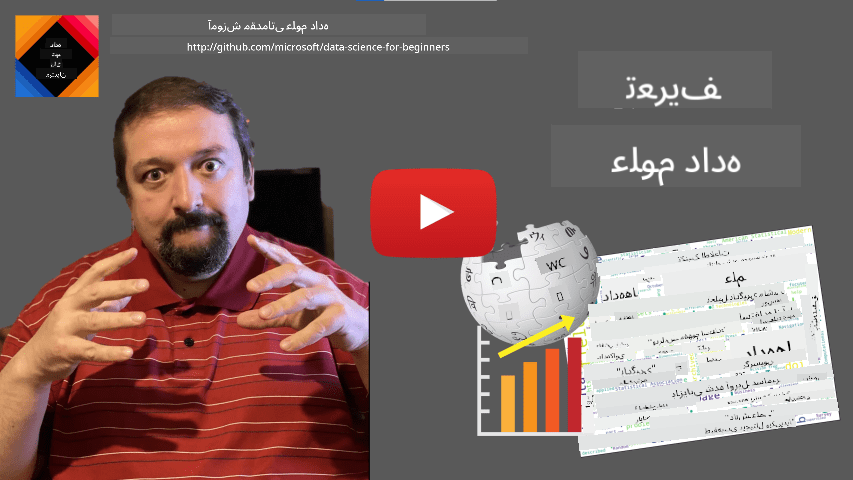
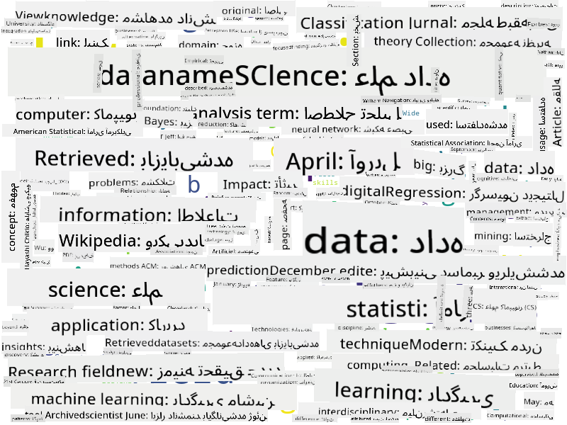

<!--
CO_OP_TRANSLATOR_METADATA:
{
  "original_hash": "43212cc1ac137b7bb1dcfb37ca06b0f4",
  "translation_date": "2025-10-25T18:36:48+00:00",
  "source_file": "1-Introduction/01-defining-data-science/README.md",
  "language_code": "fa"
}
-->
# تعریف علم داده

|  ](../../sketchnotes/01-Definitions.png) |
| :----------------------------------------------------------------------------------------------------: |
|              تعریف علم داده - _طرح دستی توسط [@nitya](https://twitter.com/nitya)_                      |

---

## [آزمون پیش از درس](https://ff-quizzes.netlify.app/en/ds/quiz/0)

## داده چیست؟
در زندگی روزمره، ما دائماً توسط داده‌ها احاطه شده‌ایم. متنی که اکنون می‌خوانید داده است. لیست شماره تلفن‌های دوستانتان در گوشی هوشمندتان داده است، همانطور که زمان فعلی نمایش داده شده روی ساعتتان نیز داده است. به عنوان انسان، ما به طور طبیعی با داده‌ها کار می‌کنیم، مثلاً پولی که داریم را می‌شماریم یا نامه‌هایی به دوستانمان می‌نویسیم.

با این حال، داده‌ها با ایجاد کامپیوترها اهمیت بیشتری پیدا کردند. نقش اصلی کامپیوترها انجام محاسبات است، اما آن‌ها برای کار کردن به داده نیاز دارند. بنابراین، باید بفهمیم که کامپیوترها چگونه داده‌ها را ذخیره و پردازش می‌کنند.

با ظهور اینترنت، نقش کامپیوترها به عنوان دستگاه‌های مدیریت داده افزایش یافت. اگر به آن فکر کنید، اکنون بیشتر از کامپیوترها برای پردازش و ارتباط داده استفاده می‌کنیم تا انجام محاسبات واقعی. وقتی به یک دوست ایمیل می‌نویسیم یا در اینترنت به دنبال اطلاعاتی می‌گردیم - در واقع در حال ایجاد، ذخیره، انتقال و دستکاری داده‌ها هستیم.
> آیا می‌توانید آخرین باری که از کامپیوتر برای انجام محاسبات واقعی استفاده کرده‌اید را به یاد بیاورید؟

## علم داده چیست؟

در [ویکی‌پدیا](https://en.wikipedia.org/wiki/Data_science)، **علم داده** به عنوان *یک حوزه علمی که از روش‌های علمی برای استخراج دانش و بینش از داده‌های ساختاریافته و غیرساختاریافته استفاده می‌کند و دانش و بینش‌های عملی را از داده‌ها در طیف گسترده‌ای از حوزه‌های کاربردی به کار می‌برد* تعریف شده است.

این تعریف جنبه‌های مهم زیر را در مورد علم داده برجسته می‌کند:

* هدف اصلی علم داده **استخراج دانش** از داده‌ها است، به عبارت دیگر - **درک** داده‌ها، یافتن روابط پنهان و ساختن یک **مدل**.
* علم داده از **روش‌های علمی** مانند احتمال و آمار استفاده می‌کند. در واقع، زمانی که اصطلاح *علم داده* برای اولین بار معرفی شد، برخی افراد استدلال کردند که علم داده فقط یک نام جدید و جذاب برای آمار است. امروزه مشخص شده است که این حوزه بسیار گسترده‌تر است.
* دانش به‌دست‌آمده باید برای تولید **بینش‌های عملی** به کار گرفته شود، یعنی بینش‌های عملی که می‌توان آن‌ها را در موقعیت‌های واقعی کسب‌وکار اعمال کرد.
* باید بتوانیم با داده‌های **ساختاریافته** و **غیرساختاریافته** کار کنیم. بعداً در دوره به بحث درباره انواع مختلف داده‌ها بازخواهیم گشت.
* **حوزه کاربرد** یک مفهوم مهم است و دانشمندان داده اغلب به حداقل درجه‌ای از تخصص در حوزه مسئله نیاز دارند، برای مثال: امور مالی، پزشکی، بازاریابی و غیره.

> جنبه مهم دیگر علم داده این است که مطالعه می‌کند چگونه داده‌ها می‌توانند با استفاده از کامپیوترها جمع‌آوری، ذخیره و پردازش شوند. در حالی که آمار پایه‌های ریاضی را به ما می‌دهد، علم داده مفاهیم ریاضی را به کار می‌گیرد تا واقعاً از داده‌ها بینش کسب کند.

یکی از روش‌ها (که به [جیم گری](https://en.wikipedia.org/wiki/Jim_Gray_(computer_scientist)) نسبت داده شده است) برای نگاه به علم داده این است که آن را به عنوان یک پارادایم جداگانه از علم در نظر بگیریم:
* **تجربی**، که در آن بیشتر به مشاهدات و نتایج آزمایش‌ها تکیه می‌کنیم
* **نظری**، که در آن مفاهیم جدید از دانش علمی موجود ظهور می‌کنند
* **محاسباتی**، که در آن اصول جدیدی بر اساس برخی آزمایش‌های محاسباتی کشف می‌شود
* **مبتنی بر داده**، بر اساس کشف روابط و الگوها در داده‌ها  

## سایر حوزه‌های مرتبط

از آنجا که داده‌ها همه‌جا هستند، علم داده نیز یک حوزه گسترده است که با بسیاری از رشته‌های دیگر در ارتباط است.

<dl>
<dt>پایگاه‌های داده</dt>
<dd>
یک ملاحظه مهم این است که <b>چگونه داده‌ها را ذخیره کنیم</b>، یعنی چگونه آن‌ها را به گونه‌ای ساختاربندی کنیم که پردازش سریع‌تر انجام شود. انواع مختلفی از پایگاه‌های داده وجود دارند که داده‌های ساختاریافته و غیرساختاریافته را ذخیره می‌کنند، که <a href="../../2-Working-With-Data/README.md">در دوره خود به آن‌ها خواهیم پرداخت</a>.
</dd>
<dt>کلان‌داده</dt>
<dd>
اغلب نیاز داریم که مقادیر بسیار زیادی از داده‌ها را با ساختار نسبتاً ساده ذخیره و پردازش کنیم. روش‌ها و ابزارهای خاصی وجود دارند که داده‌ها را به صورت توزیع‌شده در یک خوشه کامپیوتری ذخیره کرده و به طور کارآمد پردازش می‌کنند.
</dd>
<dt>یادگیری ماشین</dt>
<dd>
یکی از روش‌های درک داده‌ها <b>ساختن یک مدل</b> است که بتواند نتیجه مطلوب را پیش‌بینی کند. توسعه مدل‌ها از داده‌ها به عنوان <b>یادگیری ماشین</b> شناخته می‌شود. ممکن است بخواهید به <a href="https://aka.ms/ml-beginners">دوره یادگیری ماشین برای مبتدیان</a> ما نگاهی بیندازید تا اطلاعات بیشتری کسب کنید.
</dd>
<dt>هوش مصنوعی</dt>
<dd>
یک حوزه از یادگیری ماشین که به عنوان هوش مصنوعی (AI) شناخته می‌شود نیز به داده‌ها وابسته است و شامل ساخت مدل‌های پیچیده‌ای است که فرآیندهای تفکر انسانی را تقلید می‌کنند. روش‌های هوش مصنوعی اغلب به ما امکان می‌دهند داده‌های غیرساختاریافته (مانند زبان طبیعی) را به بینش‌های ساختاریافته تبدیل کنیم.
</dd>
<dt>بصری‌سازی</dt>
<dd>
مقادیر زیادی از داده‌ها برای انسان قابل درک نیستند، اما وقتی با استفاده از آن داده‌ها بصری‌سازی‌های مفیدی ایجاد می‌کنیم، می‌توانیم داده‌ها را بهتر درک کنیم و به نتایجی برسیم. بنابراین، مهم است که روش‌های مختلفی برای بصری‌سازی اطلاعات بدانیم - چیزی که در <a href="../../3-Data-Visualization/README.md">بخش ۳</a> دوره خود به آن خواهیم پرداخت. حوزه‌های مرتبط همچنین شامل <b>اینفوگرافیک</b> و به طور کلی <b>تعامل انسان و کامپیوتر</b> می‌شوند.
</dd>
</dl>

## انواع داده‌ها

همانطور که قبلاً اشاره کردیم، داده‌ها همه‌جا هستند. فقط باید آن‌ها را به روش درست ثبت کنیم! مفید است که بین داده‌های **ساختاریافته** و **غیرساختاریافته** تمایز قائل شویم. داده‌های ساختاریافته معمولاً به صورت یک فرم خوب ساختار یافته، اغلب به صورت جدول یا تعدادی جدول نمایش داده می‌شوند، در حالی که داده‌های غیرساختاریافته فقط مجموعه‌ای از فایل‌ها هستند. گاهی اوقات می‌توانیم درباره داده‌های **نیمه‌ساختاریافته** صحبت کنیم که دارای نوعی ساختار هستند که ممکن است بسیار متفاوت باشد.

| ساختاریافته                                                               | نیمه‌ساختاریافته                                                                                  | غیرساختاریافته                          |
| -------------------------------------------------------------------------- | -------------------------------------------------------------------------------------------------- | --------------------------------------- |
| لیست افراد با شماره تلفن‌هایشان                                            | صفحات ویکی‌پدیا با لینک‌ها                                                                         | متن دایرة‌المعارف بریتانیکا            |
| دمای تمام اتاق‌های یک ساختمان در هر دقیقه در طول ۲۰ سال گذشته              | مجموعه‌ای از مقالات علمی در قالب JSON با نویسندگان، تاریخ انتشار و چکیده                         | اشتراک فایل با اسناد شرکتی             |
| داده‌های سن و جنسیت تمام افرادی که وارد ساختمان می‌شوند                    | صفحات اینترنت                                                                                     | فیلم خام از دوربین نظارتی              |

## از کجا داده بگیریم

منابع زیادی برای داده وجود دارد و فهرست کردن همه آن‌ها غیرممکن خواهد بود! با این حال، بیایید برخی از مکان‌های معمولی که می‌توانید داده‌ها را از آن‌ها دریافت کنید، ذکر کنیم:

* **ساختاریافته**
  - **اینترنت اشیا** (IoT)، شامل داده‌های مختلف از حسگرها، مانند حسگرهای دما یا فشار، داده‌های مفیدی را فراهم می‌کند. برای مثال، اگر یک ساختمان اداری با حسگرهای IoT مجهز باشد، می‌توانیم به طور خودکار گرمایش و روشنایی را کنترل کنیم تا هزینه‌ها را به حداقل برسانیم.
  - **نظرسنجی‌ها** که از کاربران می‌خواهیم پس از خرید یا بازدید از یک وب‌سایت تکمیل کنند.
  - **تحلیل رفتار** می‌تواند به ما کمک کند تا بفهمیم یک کاربر چقدر در یک سایت پیش می‌رود و دلیل معمول ترک سایت چیست.
* **غیرساختاریافته**
  - **متون** می‌توانند منبع غنی از بینش‌ها باشند، مانند یک **امتیاز کلی احساسات**، یا استخراج کلمات کلیدی و معنای معنایی.
  - **تصاویر** یا **ویدیو**. یک ویدیو از دوربین نظارتی می‌تواند برای تخمین ترافیک جاده و اطلاع‌رسانی به مردم درباره احتمال ترافیک سنگین استفاده شود.
  - **لاگ‌های سرور وب** می‌توانند برای درک اینکه کدام صفحات سایت ما بیشتر بازدید می‌شوند و برای چه مدت، استفاده شوند.
* نیمه‌ساختاریافته
  - **گراف‌های شبکه‌های اجتماعی** می‌توانند منابع عالی داده درباره شخصیت کاربران و اثربخشی احتمالی در انتشار اطلاعات باشند.
  - وقتی مجموعه‌ای از عکس‌ها از یک مهمانی داریم، می‌توانیم سعی کنیم داده‌های **دینامیک گروهی** را با ساختن یک گراف از افرادی که با یکدیگر عکس می‌گیرند، استخراج کنیم.

با دانستن منابع مختلف داده، می‌توانید به سناریوهای مختلفی فکر کنید که در آن‌ها تکنیک‌های علم داده می‌توانند برای درک بهتر وضعیت و بهبود فرآیندهای کسب‌وکار به کار گرفته شوند.

## چه کاری می‌توانید با داده‌ها انجام دهید

در علم داده، ما بر مراحل زیر در مسیر داده تمرکز می‌کنیم:

<dl>
<dt>۱) جمع‌آوری داده</dt>
<dd>
اولین مرحله جمع‌آوری داده‌ها است. در بسیاری از موارد، این می‌تواند یک فرآیند ساده باشد، مانند داده‌هایی که از یک برنامه وب به پایگاه داده می‌آیند، اما گاهی اوقات نیاز به استفاده از تکنیک‌های خاص داریم. برای مثال، داده‌های حسگرهای IoT می‌توانند بسیار زیاد باشند و بهتر است از نقاط انتهایی بافر مانند IoT Hub برای جمع‌آوری تمام داده‌ها قبل از پردازش بیشتر استفاده کنیم.
</dd>
<dt>۲) ذخیره‌سازی داده</dt>
<dd>
ذخیره داده‌ها می‌تواند چالش‌برانگیز باشد، به ویژه اگر درباره کلان‌داده صحبت کنیم. هنگام تصمیم‌گیری درباره نحوه ذخیره داده‌ها، منطقی است که پیش‌بینی کنیم چگونه می‌خواهید داده‌ها را در آینده جستجو کنید. روش‌های مختلفی برای ذخیره داده‌ها وجود دارد:
<ul>
<li>یک پایگاه داده رابطه‌ای مجموعه‌ای از جداول را ذخیره می‌کند و از یک زبان خاص به نام SQL برای جستجوی آن‌ها استفاده می‌کند. معمولاً جداول به گروه‌های مختلفی به نام اسکیماها سازماندهی می‌شوند. در بسیاری از موارد، نیاز داریم داده‌ها را از فرم اصلی به اسکیما تبدیل کنیم.</li>
<li><a href="https://en.wikipedia.org/wiki/NoSQL">یک پایگاه داده NoSQL</a> مانند <a href="https://azure.microsoft.com/services/cosmos-db/?WT.mc_id=academic-77958-bethanycheum">CosmosDB</a> اسکیماها را بر داده‌ها تحمیل نمی‌کند و اجازه می‌دهد داده‌های پیچیده‌تر، مانند اسناد JSON سلسله‌مراتبی یا گراف‌ها ذخیره شوند. با این حال، پایگاه‌های داده NoSQL قابلیت‌های جستجوی غنی SQL را ندارند و نمی‌توانند یکپارچگی ارجاعی را تضمین کنند، یعنی قوانین مربوط به نحوه ساختار داده‌ها در جداول و روابط بین جداول.</li>
<li><a href="https://en.wikipedia.org/wiki/Data_lake">ذخیره‌سازی دریاچه داده</a> برای مجموعه‌های بزرگ داده در فرم خام و غیرساختاریافته استفاده می‌شود. دریاچه‌های داده اغلب با کلان‌داده استفاده می‌شوند، جایی که تمام داده‌ها نمی‌توانند روی یک ماشین جا شوند و باید توسط یک خوشه سرورها ذخیره و پردازش شوند. <a href="https://en.wikipedia.org/wiki/Apache_Parquet">Parquet</a> فرمت داده‌ای است که اغلب در ارتباط با کلان‌داده استفاده می‌شود.</li> 
</ul>
</dd>
<dt>۳) پردازش داده</dt>
<dd>
این هیجان‌انگیزترین بخش مسیر داده است که شامل تبدیل داده‌ها از فرم اصلی به فرمی است که می‌توان از آن برای بصری‌سازی/آموزش مدل استفاده کرد. هنگام کار با داده‌های غیرساختاریافته مانند متن یا تصاویر، ممکن است نیاز به استفاده از برخی تکنیک‌های هوش مصنوعی برای استخراج <b>ویژگی‌ها</b> از داده‌ها داشته باشیم، بنابراین آن‌ها را به فرم ساختاریافته تبدیل کنیم.
</dd>
<dt>۴) بصری‌سازی / بینش انسانی</dt>
<dd>
اغلب، برای درک داده‌ها، نیاز داریم آن‌ها را بصری‌سازی کنیم. با داشتن تکنیک‌های مختلف بصری‌سازی در جعبه ابزارمان، می‌توانیم نمای مناسب را پیدا کنیم تا به یک بینش برسیم. اغلب، یک دانشمند داده نیاز دارد "با داده‌ها بازی کند"، آن‌ها را بارها بصری‌سازی کند و به دنبال روابطی باشد. همچنین، ممکن است از تکنیک‌های آماری برای آزمایش یک فرضیه یا اثبات همبستگی بین قطعات مختلف داده استفاده کنیم.
</dd>
<dt>۵) آموزش یک مدل پیش‌بینی‌کننده</dt>
<dd>
از آنجا که هدف نهایی علم داده این است که بتوانیم بر اساس داده‌ها تصمیم‌گیری کنیم، ممکن است بخواهیم از تکنیک‌های <a href="http://github.com/microsoft/ml-for-beginners">یادگیری ماشین</a> برای ساخت یک مدل پیش‌بینی‌کننده استفاده کنیم. سپس می‌توانیم از این مدل برای پیش‌بینی با استفاده از مجموعه داده‌های جدید با ساختار مشابه استفاده کنیم.
</dd>
</dl>

البته، بسته به داده‌های واقعی، برخی مراحل ممکن است حذف شوند (مثلاً وقتی داده‌ها از قبل در پایگاه داده موجود هستند یا وقتی نیازی به آموزش مدل نداریم)، یا برخی مراحل ممکن است چندین بار تکرار شوند (مانند پردازش داده‌ها).

## دیجیتالی‌سازی و تحول دیجیتال

در دهه گذشته، بسیاری از کسب‌وکارها اهمیت داده‌ها را در تصمیم‌گیری‌های تجاری درک کرده‌اند. برای اعمال اصول علم داده در مدیریت یک کسب‌وکار، ابتدا باید داده‌هایی جمع‌آوری شود، یعنی فرآیندهای کسب‌وکار به فرم دیجیتال ترجمه شوند. این به عنوان **دیجیتالی‌سازی** شناخته می‌شود. اعمال تکنیک‌های علم داده بر این داده‌ها برای هدایت تصمیمات می‌تواند منجر به افزایش قابل توجهی در بهره‌وری (یا حتی تغییر مسیر کسب‌وکار) شود که به آن **تحول دیجیتال** می‌گویند.

بیایید یک مثال را در نظر بگیریم. فرض کنید یک دوره علم داده (مانند این دوره) داریم که به صورت آنلاین به دانشجویان ارائه می‌شود و می‌خواهیم از علم داده برای بهبود آن استفاده کنیم. چگونه می‌توانیم این کار را انجام دهیم؟

می‌توانیم با پرسیدن این سوال شروع کنیم: "چه چیزی را می‌توان دیجیتالی کرد؟" ساده‌ترین راه این است که زمان لازم برای تکمیل هر ماژول توسط هر دانشجو را اندازه‌گیری کنیم و دانش کسب‌شده را با دادن یک آزمون چندگزینه‌ای در پایان هر ماژول اندازه‌گیری کنیم. با میانگین‌گیری زمان تکمیل در بین همه دانشجویان، می‌توانیم بفهمیم کدام ماژول‌ها بیشترین دشواری را برای دانشجویان ایجاد می‌کنند و روی ساده‌تر کردن آن‌ها کار کنیم.
> ممکن است استدلال کنید که این روش ایده‌آل نیست، زیرا طول ماژول‌ها می‌تواند متفاوت باشد. احتمالاً منصفانه‌تر است که زمان را بر اساس طول ماژول (بر حسب تعداد کاراکترها) تقسیم کنیم و سپس این مقادیر را مقایسه کنیم.

وقتی شروع به تحلیل نتایج آزمون‌های چند گزینه‌ای می‌کنیم، می‌توانیم سعی کنیم مفاهیمی را که دانش‌آموزان در درک آن‌ها مشکل دارند شناسایی کنیم و از این اطلاعات برای بهبود محتوا استفاده کنیم. برای انجام این کار، باید آزمون‌ها را به گونه‌ای طراحی کنیم که هر سؤال به یک مفهوم یا بخش خاص از دانش مرتبط باشد.

اگر بخواهیم حتی پیچیده‌تر عمل کنیم، می‌توانیم زمان صرف شده برای هر ماژول را در مقابل دسته سنی دانش‌آموزان رسم کنیم. ممکن است متوجه شویم که برای برخی دسته‌های سنی، زمان لازم برای تکمیل ماژول به طور نامناسبی طولانی است یا دانش‌آموزان قبل از تکمیل آن از ادامه منصرف می‌شوند. این می‌تواند به ما کمک کند تا توصیه‌های سنی برای ماژول ارائه دهیم و نارضایتی افراد از انتظارات نادرست را به حداقل برسانیم.

## 🚀 چالش

در این چالش، سعی خواهیم کرد مفاهیم مرتبط با حوزه علم داده را با بررسی متون پیدا کنیم. ما یک مقاله ویکی‌پدیا درباره علم داده را انتخاب می‌کنیم، متن را دانلود و پردازش می‌کنیم، و سپس یک ابر کلمات مانند این تصویر ایجاد می‌کنیم:

به [`notebook.ipynb`](../../../../1-Introduction/01-defining-data-science/notebook.ipynb ':ignore') مراجعه کنید تا کد را مرور کنید. همچنین می‌توانید کد را اجرا کنید و ببینید که چگونه تمام تبدیل‌های داده را به صورت زنده انجام می‌دهد.

> اگر نمی‌دانید چگونه کد را در Jupyter Notebook اجرا کنید، به [این مقاله](https://soshnikov.com/education/how-to-execute-notebooks-from-github/) نگاهی بیندازید.

## [آزمون پس از درس](https://ff-quizzes.netlify.app/en/ds/quiz/1)

## تکالیف

* **وظیفه ۱**: کد بالا را تغییر دهید تا مفاهیم مرتبط با حوزه‌های **کلان داده** و **یادگیری ماشین** را پیدا کنید.
* **وظیفه ۲**: [درباره سناریوهای علم داده فکر کنید](assignment.md)

## اعتبارها

این درس با ♥️ توسط [دمیتری سوشنیکوف](http://soshnikov.com) نوشته شده است.

---

**سلب مسئولیت**:  
این سند با استفاده از سرویس ترجمه هوش مصنوعی [Co-op Translator](https://github.com/Azure/co-op-translator) ترجمه شده است. در حالی که ما تلاش می‌کنیم دقت را حفظ کنیم، لطفاً توجه داشته باشید که ترجمه‌های خودکار ممکن است شامل خطاها یا نادرستی‌ها باشند. سند اصلی به زبان اصلی آن باید به عنوان منبع معتبر در نظر گرفته شود. برای اطلاعات حیاتی، ترجمه حرفه‌ای انسانی توصیه می‌شود. ما مسئولیتی در قبال سوء تفاهم‌ها یا تفسیرهای نادرست ناشی از استفاده از این ترجمه نداریم.