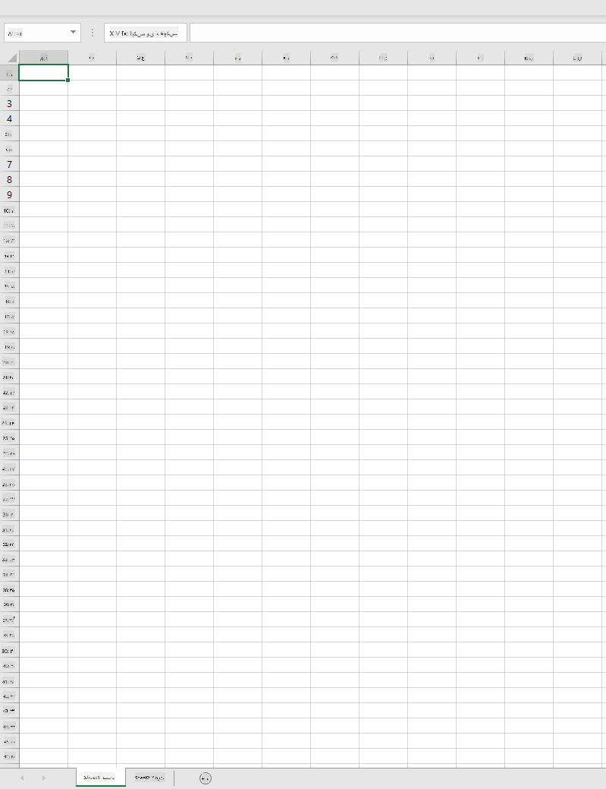
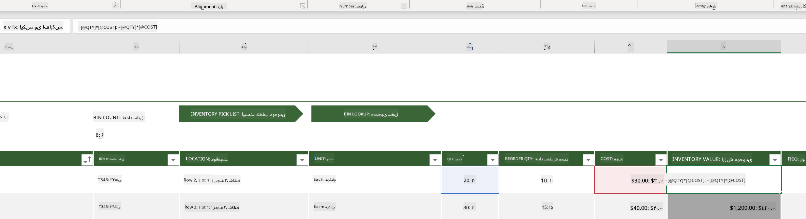
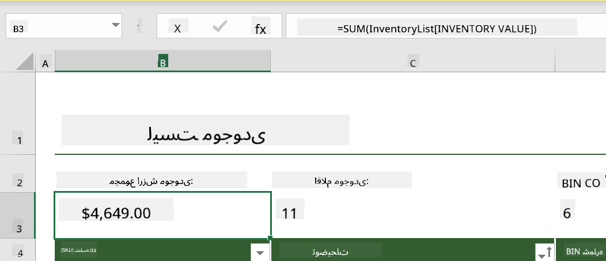
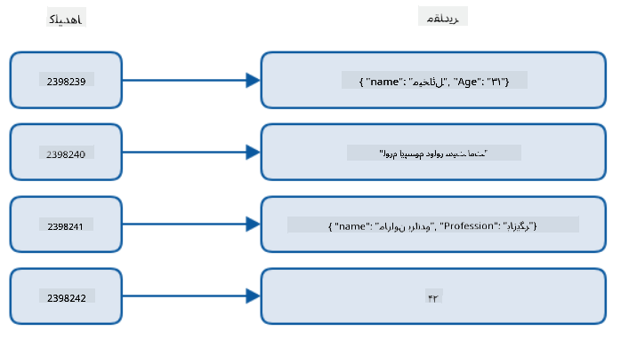
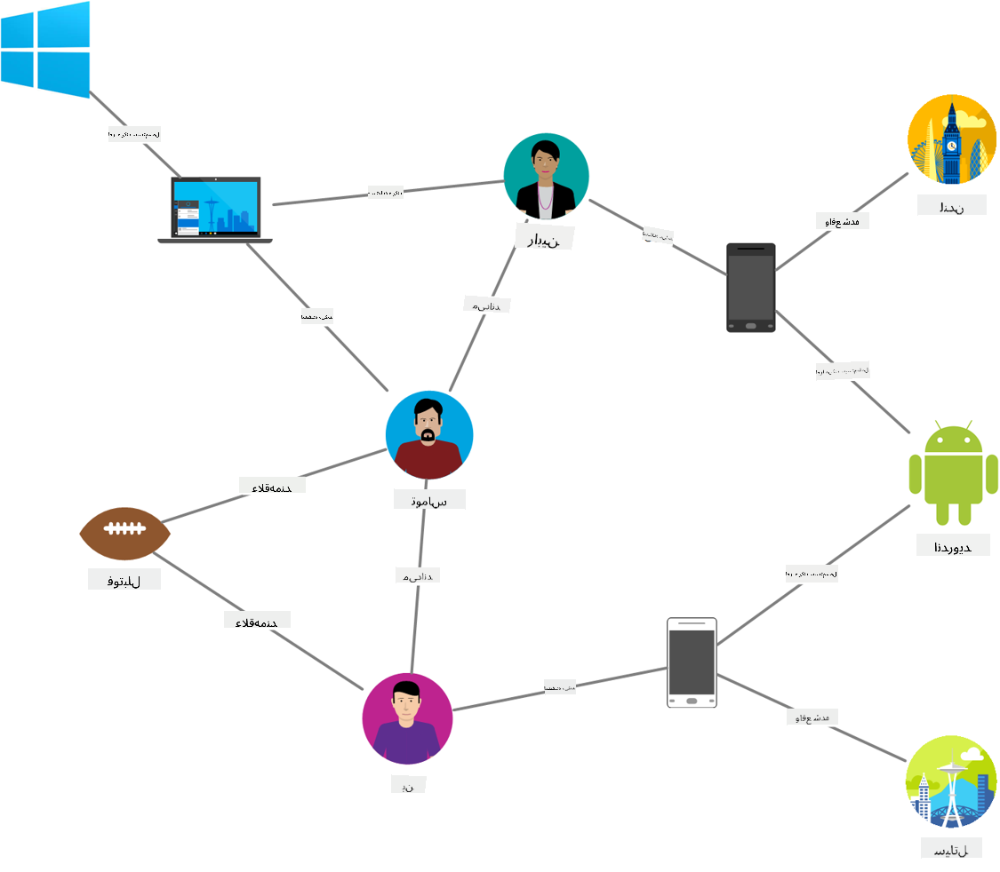
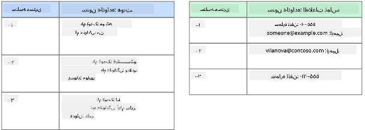
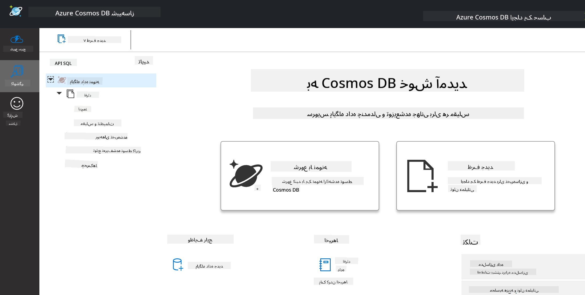
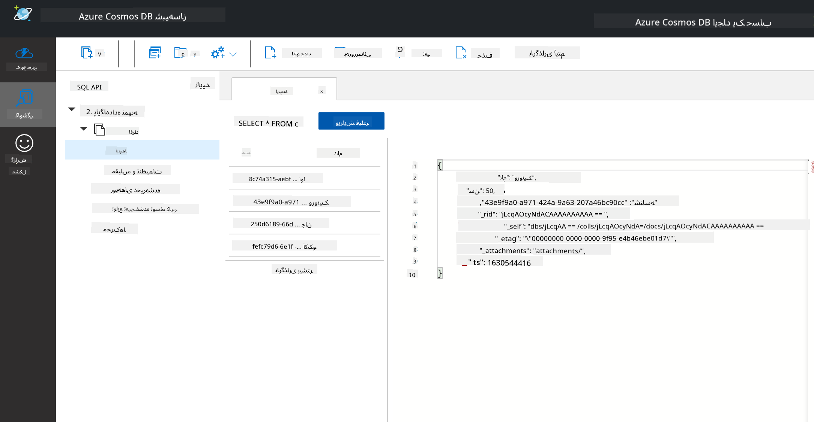
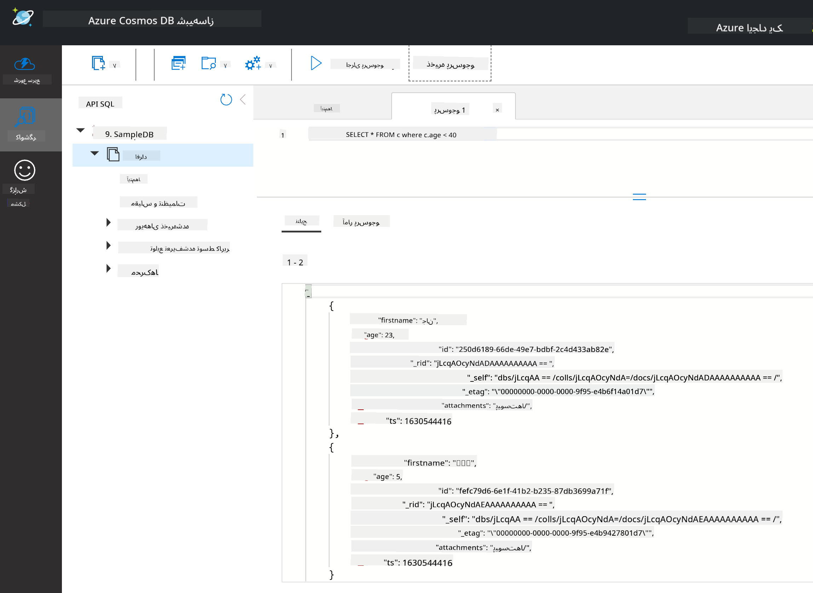

<!--
CO_OP_TRANSLATOR_METADATA:
{
  "original_hash": "54c5a1c74aecb69d2f9099300a4b7eea",
  "translation_date": "2025-09-04T14:21:16+00:00",
  "source_file": "2-Working-With-Data/06-non-relational/README.md",
  "language_code": "fa"
}
-->
# کار با داده‌ها: داده‌های غیر رابطه‌ای

| ](../../sketchnotes/06-NoSQL.png)|
|:---:|
|کار با داده‌های NoSQL - _اسکیچ‌نوت توسط [@nitya](https://twitter.com/nitya)_ |

## [پیش‌از‌درس: آزمون](https://purple-hill-04aebfb03.1.azurestaticapps.net/quiz/10)

داده‌ها محدود به پایگاه‌های داده رابطه‌ای نیستند. این درس بر داده‌های غیر رابطه‌ای تمرکز دارد و اصول اولیه صفحات گسترده و NoSQL را پوشش می‌دهد.

## صفحات گسترده

صفحات گسترده یکی از روش‌های محبوب برای ذخیره و بررسی داده‌ها هستند زیرا راه‌اندازی و شروع کار با آن‌ها نیاز به تلاش کمتری دارد. در این درس، شما با اجزای اصلی یک صفحه گسترده، فرمول‌ها و توابع آشنا خواهید شد. مثال‌ها با استفاده از Microsoft Excel نشان داده می‌شوند، اما بیشتر بخش‌ها و موضوعات نام‌ها و مراحل مشابهی در مقایسه با سایر نرم‌افزارهای صفحات گسترده دارند.



یک صفحه گسترده یک فایل است و در سیستم فایل یک کامپیوتر، دستگاه یا سیستم فایل مبتنی بر ابر قابل دسترسی خواهد بود. نرم‌افزار ممکن است مبتنی بر مرورگر باشد یا به‌عنوان یک برنامه که باید روی کامپیوتر نصب شود یا به‌صورت اپلیکیشن دانلود شود. در Excel این فایل‌ها به‌عنوان **دفتر کار** تعریف می‌شوند و این اصطلاح در ادامه این درس استفاده خواهد شد.

یک دفتر کار شامل یک یا چند **برگه** است که هر برگه با زبانه‌ها برچسب‌گذاری شده است. درون یک برگه، مستطیل‌هایی به نام **سلول‌ها** وجود دارند که داده‌های واقعی را در خود جای می‌دهند. یک سلول محل تقاطع یک ردیف و ستون است، جایی که ستون‌ها با حروف الفبایی و ردیف‌ها به‌صورت عددی برچسب‌گذاری شده‌اند. برخی صفحات گسترده ممکن است در چند ردیف اول دارای سرصفحه‌هایی باشند که داده‌های موجود در یک سلول را توصیف می‌کنند.

با این عناصر اصلی یک دفتر کار Excel، ما از یک مثال از [الگوهای Microsoft](https://templates.office.com/) که بر موجودی تمرکز دارد استفاده خواهیم کرد تا برخی از بخش‌های اضافی یک صفحه گسترده را مرور کنیم.

### مدیریت موجودی

فایل صفحه گسترده‌ای به نام "InventoryExample" یک صفحه گسترده قالب‌بندی‌شده از اقلام موجود در یک موجودی است که شامل سه برگه است، جایی که زبانه‌ها با نام‌های "Inventory List"، "Inventory Pick List" و "Bin Lookup" برچسب‌گذاری شده‌اند. ردیف ۴ از برگه Inventory List سرصفحه است که مقدار هر سلول در ستون سرصفحه را توصیف می‌کند.



مواردی وجود دارند که یک سلول به مقادیر سایر سلول‌ها وابسته است تا مقدار خود را تولید کند. صفحه گسترده Inventory List هزینه هر آیتم موجود در موجودی را پیگیری می‌کند، اما اگر بخواهیم ارزش کل موجودی را بدانیم چه؟ [**فرمول‌ها**](https://support.microsoft.com/en-us/office/overview-of-formulas-34519a4e-1e8d-4f4b-84d4-d642c4f63263) عملیات‌هایی را بر داده‌های سلول انجام می‌دهند و در این مثال برای محاسبه هزینه موجودی استفاده می‌شوند. این صفحه گسترده از یک فرمول در ستون Inventory Value استفاده کرده است تا ارزش هر آیتم را با ضرب مقدار زیر سرصفحه QTY و هزینه‌های زیر سرصفحه COST محاسبه کند. با دوبار کلیک کردن یا برجسته کردن یک سلول، فرمول نمایش داده می‌شود. خواهید دید که فرمول‌ها با علامت مساوی شروع می‌شوند و به‌دنبال آن محاسبه یا عملیات انجام می‌شود.



ما می‌توانیم از یک فرمول دیگر برای جمع کردن تمام مقادیر ستون Inventory Value استفاده کنیم تا ارزش کل آن را به دست آوریم. این کار می‌تواند با جمع کردن هر سلول برای تولید مجموع انجام شود، اما این کار می‌تواند خسته‌کننده باشد. Excel دارای [**توابع**](https://support.microsoft.com/en-us/office/sum-function-043e1c7d-7726-4e80-8f32-07b23e057f89) یا فرمول‌های از پیش تعریف‌شده‌ای است که محاسباتی را بر داده‌های سلول انجام می‌دهند. توابع نیاز به آرگومان دارند، که مقادیر مورد نیاز برای انجام این محاسبات هستند. هنگامی که توابع به بیش از یک آرگومان نیاز دارند، باید به ترتیب خاصی فهرست شوند وگرنه ممکن است تابع مقدار صحیح را محاسبه نکند. این مثال از تابع SUM استفاده می‌کند و مقادیر ستون Inventory Value را به‌عنوان آرگومان برای تولید مجموع زیر ردیف ۳، ستون B (که همچنین به‌عنوان B3 شناخته می‌شود) استفاده می‌کند.

## NoSQL

NoSQL یک اصطلاح کلی برای روش‌های مختلف ذخیره داده‌های غیر رابطه‌ای است و می‌تواند به‌عنوان "غیر-SQL"، "غیر رابطه‌ای" یا "نه فقط SQL" تفسیر شود. این نوع سیستم‌های پایگاه داده را می‌توان به ۴ نوع دسته‌بندی کرد.


> منبع از [وبلاگ Michał Białecki](https://www.michalbialecki.com/2018/03/18/azure-cosmos-db-key-value-database-cloud/)

پایگاه‌های داده [کلید-مقدار](https://docs.microsoft.com/en-us/azure/architecture/data-guide/big-data/non-relational-data#keyvalue-data-stores) کلیدهای منحصر‌به‌فرد را که شناسه‌ای منحصر‌به‌فرد مرتبط با یک مقدار هستند، جفت می‌کنند. این جفت‌ها با استفاده از یک [جدول هش](https://www.hackerearth.com/practice/data-structures/hash-tables/basics-of-hash-tables/tutorial/) با یک تابع هش مناسب ذخیره می‌شوند.


> منبع از [Microsoft](https://docs.microsoft.com/en-us/azure/cosmos-db/graph/graph-introduction#graph-database-by-example)

پایگاه‌های داده [گراف](https://docs.microsoft.com/en-us/azure/architecture/data-guide/big-data/non-relational-data#graph-data-stores) روابط در داده‌ها را توصیف می‌کنند و به‌صورت مجموعه‌ای از گره‌ها و لبه‌ها نمایش داده می‌شوند. یک گره نمایانگر یک موجودیت است، چیزی که در دنیای واقعی وجود دارد مانند یک دانش‌آموز یا صورت‌حساب بانکی. لبه‌ها رابطه بین دو موجودیت را نشان می‌دهند. هر گره و لبه دارای ویژگی‌هایی هستند که اطلاعات اضافی درباره هر گره و لبه ارائه می‌دهند.



پایگاه‌های داده [ستونی](https://docs.microsoft.com/en-us/azure/architecture/data-guide/big-data/non-relational-data#columnar-data-stores) داده‌ها را به ستون‌ها و ردیف‌ها سازماندهی می‌کنند، مشابه یک ساختار داده رابطه‌ای، اما هر ستون به گروه‌هایی به نام خانواده ستون تقسیم می‌شود، جایی که تمام داده‌های زیر یک ستون مرتبط هستند و می‌توانند به‌صورت یک واحد بازیابی و تغییر داده شوند.

### پایگاه‌های داده سندی با Azure Cosmos DB

پایگاه‌های داده [سندی](https://docs.microsoft.com/en-us/azure/architecture/data-guide/big-data/non-relational-data#document-data-stores) بر اساس مفهوم پایگاه داده کلید-مقدار ساخته شده‌اند و از مجموعه‌ای از فیلدها و اشیاء تشکیل شده‌اند. این بخش پایگاه‌های داده سندی را با شبیه‌ساز Cosmos DB بررسی خواهد کرد.

یک پایگاه داده Cosmos DB تعریف "نه فقط SQL" را برآورده می‌کند، جایی که پایگاه داده سندی Cosmos DB برای جستجوی داده‌ها به SQL متکی است. [درس قبلی](../05-relational-databases/README.md) درباره SQL اصول اولیه این زبان را پوشش می‌دهد و ما قادر خواهیم بود برخی از همان جستجوها را در اینجا به یک پایگاه داده سندی اعمال کنیم. ما از شبیه‌ساز Cosmos DB استفاده خواهیم کرد که به ما امکان می‌دهد یک پایگاه داده سندی را به‌صورت محلی روی یک کامپیوتر ایجاد و بررسی کنیم. درباره شبیه‌ساز [اینجا](https://docs.microsoft.com/en-us/azure/cosmos-db/local-emulator?tabs=ssl-netstd21) بیشتر بخوانید.

یک سند مجموعه‌ای از فیلدها و مقادیر اشیاء است، جایی که فیلدها توصیف می‌کنند که مقدار شیء چه چیزی را نشان می‌دهد. در زیر یک مثال از یک سند آورده شده است.

```json
{
    "firstname": "Eva",
    "age": 44,
    "id": "8c74a315-aebf-4a16-bb38-2430a9896ce5",
    "_rid": "bHwDAPQz8s0BAAAAAAAAAA==",
    "_self": "dbs/bHwDAA==/colls/bHwDAPQz8s0=/docs/bHwDAPQz8s0BAAAAAAAAAA==/",
    "_etag": "\"00000000-0000-0000-9f95-010a691e01d7\"",
    "_attachments": "attachments/",
    "_ts": 1630544034
}
```

فیلدهای مورد توجه در این سند عبارتند از: `firstname`، `id` و `age`. سایر فیلدها با زیرخط‌ها توسط Cosmos DB تولید شده‌اند.

#### بررسی داده‌ها با شبیه‌ساز Cosmos DB

شما می‌توانید شبیه‌ساز را [برای ویندوز از اینجا](https://aka.ms/cosmosdb-emulator) دانلود و نصب کنید. برای گزینه‌های اجرای شبیه‌ساز برای macOS و Linux به این [مستندات](https://docs.microsoft.com/en-us/azure/cosmos-db/local-emulator?tabs=ssl-netstd21#run-on-linux-macos) مراجعه کنید.

شبیه‌ساز یک پنجره مرورگر را باز می‌کند، جایی که نمای Explorer به شما امکان می‌دهد اسناد را بررسی کنید.



اگر همراه هستید، روی "Start with Sample" کلیک کنید تا یک پایگاه داده نمونه به نام SampleDB ایجاد شود. اگر SampleDB را با کلیک بر روی فلش گسترش دهید، یک کانتینر به نام `Persons` پیدا خواهید کرد، یک کانتینر مجموعه‌ای از آیتم‌ها را نگه می‌دارد که اسناد درون کانتینر هستند. شما می‌توانید چهار سند فردی زیر `Items` را بررسی کنید.



#### جستجوی داده‌های سندی با شبیه‌ساز Cosmos DB

ما همچنین می‌توانیم داده‌های نمونه را با کلیک بر روی دکمه جستجوی SQL جدید (دومین دکمه از سمت چپ) جستجو کنیم.

`SELECT * FROM c` تمام اسناد موجود در کانتینر را بازمی‌گرداند. بیایید یک عبارت where اضافه کنیم و همه افراد زیر ۴۰ سال را پیدا کنیم.

`SELECT * FROM c where c.age < 40`



این جستجو دو سند را بازمی‌گرداند، توجه کنید که مقدار age برای هر سند کمتر از ۴۰ است.

#### JSON و اسناد

اگر با JavaScript Object Notation (JSON) آشنا باشید، متوجه خواهید شد که اسناد شبیه JSON هستند. یک فایل `PersonsData.json` در این دایرکتوری وجود دارد که می‌توانید آن را به کانتینر Persons در شبیه‌ساز از طریق دکمه `Upload Item` آپلود کنید.

در بیشتر موارد، APIهایی که داده‌های JSON بازمی‌گردانند می‌توانند مستقیماً منتقل شده و در پایگاه‌های داده سندی ذخیره شوند. در زیر یک سند دیگر آورده شده است، این سند نمایانگر توییت‌هایی از حساب توییتر Microsoft است که با استفاده از API توییتر بازیابی شده و سپس در Cosmos DB وارد شده است.

```json
{
    "created_at": "2021-08-31T19:03:01.000Z",
    "id": "1432780985872142341",
    "text": "Blank slate. Like this tweet if you’ve ever painted in Microsoft Paint before. https://t.co/cFeEs8eOPK",
    "_rid": "dhAmAIUsA4oHAAAAAAAAAA==",
    "_self": "dbs/dhAmAA==/colls/dhAmAIUsA4o=/docs/dhAmAIUsA4oHAAAAAAAAAA==/",
    "_etag": "\"00000000-0000-0000-9f84-a0958ad901d7\"",
    "_attachments": "attachments/",
    "_ts": 1630537000
```

فیلدهای مورد توجه در این سند عبارتند از: `created_at`، `id` و `text`.

## 🚀 چالش

یک فایل `TwitterData.json` وجود دارد که می‌توانید آن را به پایگاه داده SampleDB آپلود کنید. توصیه می‌شود که آن را به یک کانتینر جداگانه اضافه کنید. این کار را می‌توان با:

1. کلیک بر روی دکمه کانتینر جدید در بالا سمت راست
1. انتخاب پایگاه داده موجود (SampleDB) و ایجاد یک شناسه کانتینر برای کانتینر
1. تنظیم کلید پارتیشن به `/id`
1. کلیک بر روی OK (می‌توانید بقیه اطلاعات در این نما را نادیده بگیرید زیرا این یک مجموعه داده کوچک است که به‌صورت محلی روی دستگاه شما اجرا می‌شود)
1. کانتینر جدید خود را باز کنید و فایل داده‌های توییتر را با دکمه `Upload Item` آپلود کنید

سعی کنید چند جستجوی SELECT اجرا کنید تا اسنادی را پیدا کنید که Microsoft در فیلد text آن‌ها وجود دارد. نکته: سعی کنید از [کلمه کلیدی LIKE](https://docs.microsoft.com/en-us/azure/cosmos-db/sql/sql-query-keywords#using-like-with-the--wildcard-character) استفاده کنید.

## [آزمون پس از درس](https://ff-quizzes.netlify.app/en/ds/)

## مرور و مطالعه شخصی

- برخی از قالب‌بندی‌ها و ویژگی‌های اضافی به این صفحه گسترده اضافه شده‌اند که این درس آن‌ها را پوشش نمی‌دهد. Microsoft دارای [کتابخانه بزرگی از مستندات و ویدیوها](https://support.microsoft.com/excel) درباره Excel است اگر علاقه‌مند به یادگیری بیشتر هستید.

- این مستندات معماری ویژگی‌های انواع مختلف داده‌های غیر رابطه‌ای را شرح می‌دهد: [داده‌های غیر رابطه‌ای و NoSQL](https://docs.microsoft.com/en-us/azure/architecture/data-guide/big-data/non-relational-data)

- Cosmos DB یک پایگاه داده غیر رابطه‌ای مبتنی بر ابر است که می‌تواند انواع مختلف NoSQL ذکر شده در این درس را نیز ذخیره کند. درباره این انواع بیشتر در این [ماژول یادگیری Cosmos DB Microsoft](https://docs.microsoft.com/en-us/learn/paths/work-with-nosql-data-in-azure-cosmos-db/) بیاموزید.

## تکلیف

[Soda Profits](assignment.md)

---

**سلب مسئولیت**:  
این سند با استفاده از سرویس ترجمه هوش مصنوعی [Co-op Translator](https://github.com/Azure/co-op-translator) ترجمه شده است. در حالی که ما برای دقت تلاش می‌کنیم، لطفاً توجه داشته باشید که ترجمه‌های خودکار ممکن است شامل خطاها یا نادرستی‌ها باشند. سند اصلی به زبان اصلی آن باید به عنوان منبع معتبر در نظر گرفته شود. برای اطلاعات حساس، ترجمه حرفه‌ای انسانی توصیه می‌شود. ما هیچ مسئولیتی در قبال سوءتفاهم‌ها یا تفسیرهای نادرست ناشی از استفاده از این ترجمه نداریم.