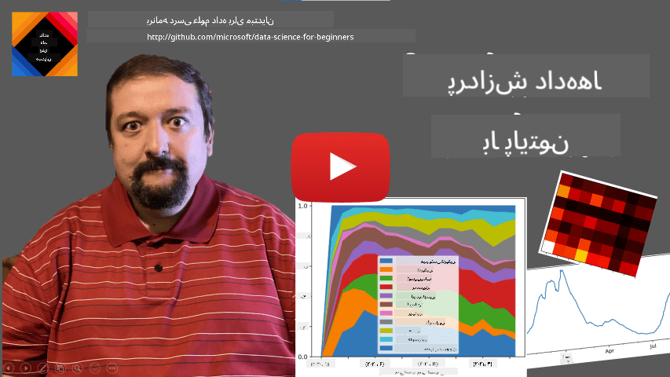
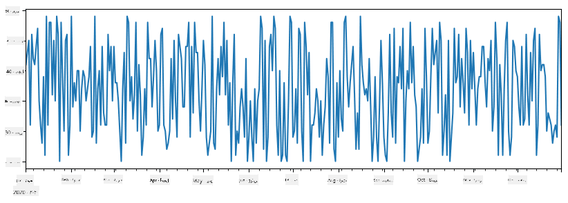
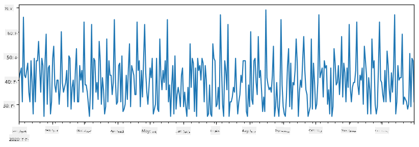
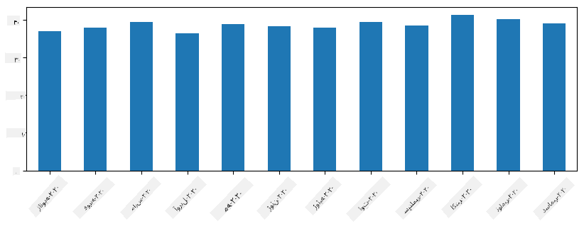
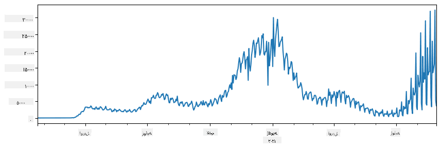
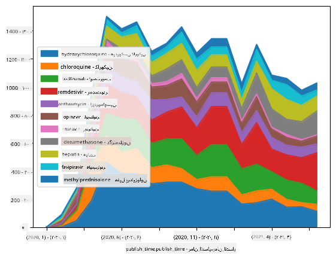

<!--
CO_OP_TRANSLATOR_METADATA:
{
  "original_hash": "57f7db1f4c3ae3361c1d1fbafcdd690c",
  "translation_date": "2025-09-04T14:21:54+00:00",
  "source_file": "2-Working-With-Data/07-python/README.md",
  "language_code": "fa"
}
-->
# کار با داده‌ها: پایتون و کتابخانه Pandas

|  ](../../sketchnotes/07-WorkWithPython.png) |
| :-------------------------------------------------------------------------------------------------------: |
|                 کار با پایتون - _طرح دستی توسط [@nitya](https://twitter.com/nitya)_                       |

[](https://youtu.be/dZjWOGbsN4Y)

در حالی که پایگاه‌های داده روش‌های بسیار کارآمدی برای ذخیره‌سازی داده‌ها و جستجوی آن‌ها با استفاده از زبان‌های پرس‌وجو ارائه می‌دهند، انعطاف‌پذیرترین روش پردازش داده‌ها نوشتن برنامه‌ای است که داده‌ها را دستکاری کند. در بسیاری از موارد، انجام یک پرس‌وجوی پایگاه داده می‌تواند مؤثرتر باشد. اما در برخی موارد که پردازش داده‌های پیچیده‌تر مورد نیاز است، این کار به راحتی با استفاده از SQL قابل انجام نیست.  
پردازش داده‌ها را می‌توان در هر زبان برنامه‌نویسی انجام داد، اما برخی زبان‌ها سطح بالاتری برای کار با داده‌ها دارند. دانشمندان داده معمولاً یکی از زبان‌های زیر را ترجیح می‌دهند:

* **[پایتون](https://www.python.org/)**، یک زبان برنامه‌نویسی عمومی که به دلیل سادگی‌اش اغلب به عنوان یکی از بهترین گزینه‌ها برای مبتدیان در نظر گرفته می‌شود. پایتون دارای کتابخانه‌های زیادی است که می‌توانند به شما در حل بسیاری از مشکلات عملی کمک کنند، مانند استخراج داده‌ها از آرشیو ZIP یا تبدیل تصویر به حالت خاکستری. علاوه بر علم داده، پایتون اغلب برای توسعه وب نیز استفاده می‌شود.  
* **[R](https://www.r-project.org/)** یک ابزار سنتی است که با هدف پردازش داده‌های آماری توسعه یافته است. این زبان همچنین دارای مخزن بزرگی از کتابخانه‌ها (CRAN) است که آن را به گزینه‌ای مناسب برای پردازش داده‌ها تبدیل می‌کند. با این حال، R یک زبان برنامه‌نویسی عمومی نیست و به ندرت خارج از حوزه علم داده استفاده می‌شود.  
* **[Julia](https://julialang.org/)** یک زبان دیگر است که به طور خاص برای علم داده توسعه یافته است. این زبان برای ارائه عملکرد بهتر نسبت به پایتون طراحی شده است و آن را به ابزاری عالی برای آزمایش‌های علمی تبدیل می‌کند.

در این درس، ما بر استفاده از پایتون برای پردازش ساده داده‌ها تمرکز خواهیم کرد. فرض می‌کنیم که با اصول اولیه این زبان آشنا هستید. اگر می‌خواهید یک مرور عمیق‌تر از پایتون داشته باشید، می‌توانید به یکی از منابع زیر مراجعه کنید:

* [یادگیری پایتون به روش سرگرم‌کننده با گرافیک لاک‌پشتی و فراکتال‌ها](https://github.com/shwars/pycourse) - دوره مقدماتی سریع در GitHub برای برنامه‌نویسی پایتون  
* [اولین قدم‌های خود را با پایتون بردارید](https://docs.microsoft.com/en-us/learn/paths/python-first-steps/?WT.mc_id=academic-77958-bethanycheum) مسیر یادگیری در [Microsoft Learn](http://learn.microsoft.com/?WT.mc_id=academic-77958-bethanycheum)

داده‌ها می‌توانند به اشکال مختلفی ظاهر شوند. در این درس، ما سه شکل داده را در نظر خواهیم گرفت - **داده‌های جدولی**، **متن** و **تصاویر**.

ما بر چند مثال از پردازش داده‌ها تمرکز خواهیم کرد، به جای اینکه یک مرور کامل از تمام کتابخانه‌های مرتبط ارائه دهیم. این کار به شما اجازه می‌دهد تا ایده اصلی از آنچه ممکن است را دریافت کنید و درک کنید که کجا می‌توانید راه‌حل‌هایی برای مشکلات خود پیدا کنید.

> **مهم‌ترین توصیه**. وقتی نیاز دارید عملیاتی خاص روی داده‌ها انجام دهید و نمی‌دانید چگونه این کار را انجام دهید، سعی کنید آن را در اینترنت جستجو کنید. [Stackoverflow](https://stackoverflow.com/) معمولاً شامل نمونه‌های کد مفید زیادی در پایتون برای بسیاری از وظایف معمول است.

## [پیش‌زمینه آزمون](https://purple-hill-04aebfb03.1.azurestaticapps.net/quiz/12)

## داده‌های جدولی و Dataframes

شما قبلاً با داده‌های جدولی آشنا شده‌اید وقتی درباره پایگاه‌های داده رابطه‌ای صحبت کردیم. وقتی داده‌های زیادی دارید و این داده‌ها در جداول مختلف مرتبط ذخیره شده‌اند، قطعاً استفاده از SQL برای کار با آن‌ها منطقی است. با این حال، موارد زیادی وجود دارد که ما یک جدول داده داریم و نیاز داریم تا برخی **درک‌ها** یا **بینش‌ها** درباره این داده‌ها کسب کنیم، مانند توزیع، همبستگی بین مقادیر و غیره. در علم داده، موارد زیادی وجود دارد که نیاز داریم برخی تغییرات در داده‌های اصلی انجام دهیم و سپس آن‌ها را بصری‌سازی کنیم. هر دو مرحله به راحتی با استفاده از پایتون قابل انجام هستند.

دو کتابخانه بسیار مفید در پایتون وجود دارند که می‌توانند به شما در کار با داده‌های جدولی کمک کنند:
* **[Pandas](https://pandas.pydata.org/)** به شما اجازه می‌دهد تا با **Dataframes** کار کنید، که مشابه جداول رابطه‌ای هستند. شما می‌توانید ستون‌های نام‌گذاری شده داشته باشید و عملیات مختلفی روی ردیف‌ها، ستون‌ها و Dataframes به طور کلی انجام دهید.  
* **[Numpy](https://numpy.org/)** یک کتابخانه برای کار با **تنسورها**، یعنی **آرایه‌های چندبعدی** است. آرایه دارای مقادیر از نوع پایه یکسان است و ساده‌تر از Dataframe است، اما عملیات ریاضی بیشتری ارائه می‌دهد و سربار کمتری ایجاد می‌کند.

چند کتابخانه دیگر نیز وجود دارند که باید درباره آن‌ها بدانید:
* **[Matplotlib](https://matplotlib.org/)** یک کتابخانه برای بصری‌سازی داده‌ها و رسم نمودارها است  
* **[SciPy](https://www.scipy.org/)** یک کتابخانه با برخی توابع علمی اضافی است. ما قبلاً هنگام صحبت درباره احتمال و آمار با این کتابخانه آشنا شده‌ایم.

در اینجا یک قطعه کد آورده شده است که معمولاً برای وارد کردن این کتابخانه‌ها در ابتدای برنامه پایتون خود استفاده می‌کنید:
```python
import numpy as np
import pandas as pd
import matplotlib.pyplot as plt
from scipy import ... # you need to specify exact sub-packages that you need
```

Pandas حول چند مفهوم اساسی متمرکز است.

### Series

**Series** یک دنباله از مقادیر است، مشابه لیست یا آرایه numpy. تفاوت اصلی این است که Series همچنین دارای یک **شاخص** است و وقتی روی Series عملیات انجام می‌دهیم (مثلاً آن‌ها را جمع می‌کنیم)، شاخص در نظر گرفته می‌شود. شاخص می‌تواند به سادگی شماره ردیف عدد صحیح باشد (این شاخص به طور پیش‌فرض هنگام ایجاد یک Series از لیست یا آرایه استفاده می‌شود)، یا می‌تواند ساختار پیچیده‌ای مانند بازه زمانی داشته باشد.

> **توجه**: کد مقدماتی Pandas در دفترچه همراه [`notebook.ipynb`](notebook.ipynb) موجود است. ما فقط برخی از مثال‌ها را اینجا بیان می‌کنیم و شما قطعاً می‌توانید دفترچه کامل را بررسی کنید.

یک مثال را در نظر بگیرید: ما می‌خواهیم فروش یک مغازه بستنی‌فروشی را تحلیل کنیم. بیایید یک سری از اعداد فروش (تعداد اقلام فروخته شده در هر روز) برای یک دوره زمانی ایجاد کنیم:

```python
start_date = "Jan 1, 2020"
end_date = "Mar 31, 2020"
idx = pd.date_range(start_date,end_date)
print(f"Length of index is {len(idx)}")
items_sold = pd.Series(np.random.randint(25,50,size=len(idx)),index=idx)
items_sold.plot()
```


حالا فرض کنید که هر هفته یک مهمانی برای دوستان برگزار می‌کنیم و 10 بسته بستنی اضافی برای مهمانی می‌گیریم. می‌توانیم یک سری دیگر، با شاخص هفته، برای نشان دادن این موضوع ایجاد کنیم:
```python
additional_items = pd.Series(10,index=pd.date_range(start_date,end_date,freq="W"))
```
وقتی دو سری را با هم جمع می‌کنیم، تعداد کل را دریافت می‌کنیم:
```python
total_items = items_sold.add(additional_items,fill_value=0)
total_items.plot()
```


> **توجه** که ما از نحو ساده `total_items+additional_items` استفاده نمی‌کنیم. اگر این کار را می‌کردیم، تعداد زیادی مقدار `NaN` (*Not a Number*) در سری حاصل دریافت می‌کردیم. این به این دلیل است که مقادیر گم‌شده‌ای برای برخی از نقاط شاخص در سری `additional_items` وجود دارد و افزودن `NaN` به هر چیزی نتیجه `NaN` می‌دهد. بنابراین باید پارامتر `fill_value` را هنگام جمع مشخص کنیم.

با سری‌های زمانی، ما همچنین می‌توانیم سری را با بازه‌های زمانی مختلف **نمونه‌گیری مجدد** کنیم. برای مثال، فرض کنید می‌خواهیم میانگین حجم فروش را به صورت ماهانه محاسبه کنیم. می‌توانیم از کد زیر استفاده کنیم:
```python
monthly = total_items.resample("1M").mean()
ax = monthly.plot(kind='bar')
```


### DataFrame

یک DataFrame اساساً مجموعه‌ای از سری‌ها با همان شاخص است. ما می‌توانیم چند سری را با هم ترکیب کنیم تا یک DataFrame ایجاد کنیم:
```python
a = pd.Series(range(1,10))
b = pd.Series(["I","like","to","play","games","and","will","not","change"],index=range(0,9))
df = pd.DataFrame([a,b])
```
این یک جدول افقی مانند این ایجاد می‌کند:
|     | 0   | 1    | 2   | 3   | 4      | 5   | 6      | 7    | 8    |
| --- | --- | ---- | --- | --- | ------ | --- | ------ | ---- | ---- |
| 0   | 1   | 2    | 3   | 4   | 5      | 6   | 7      | 8    | 9    |
| 1   | I   | like | to  | use | Python | and | Pandas | very | much |

ما همچنین می‌توانیم از Series به عنوان ستون‌ها استفاده کنیم و نام ستون‌ها را با استفاده از دیکشنری مشخص کنیم:
```python
df = pd.DataFrame({ 'A' : a, 'B' : b })
```
این جدول زیر را به ما می‌دهد:

|     | A   | B      |
| --- | --- | ------ |
| 0   | 1   | I      |
| 1   | 2   | like   |
| 2   | 3   | to     |
| 3   | 4   | use    |
| 4   | 5   | Python |
| 5   | 6   | and    |
| 6   | 7   | Pandas |
| 7   | 8   | very   |
| 8   | 9   | much   |

**توجه** که ما همچنین می‌توانیم این طرح جدول را با ترانهاده کردن جدول قبلی دریافت کنیم، مثلاً با نوشتن 
```python
df = pd.DataFrame([a,b]).T..rename(columns={ 0 : 'A', 1 : 'B' })
```
اینجا `.T` به معنای عملیات ترانهاده کردن DataFrame است، یعنی تغییر ردیف‌ها و ستون‌ها، و عملیات `rename` به ما اجازه می‌دهد تا ستون‌ها را برای مطابقت با مثال قبلی تغییر نام دهیم.

در اینجا چند عملیات مهم وجود دارد که می‌توانیم روی DataFrames انجام دهیم:

**انتخاب ستون‌ها**. ما می‌توانیم ستون‌های جداگانه را با نوشتن `df['A']` انتخاب کنیم - این عملیات یک Series را برمی‌گرداند. ما همچنین می‌توانیم زیرمجموعه‌ای از ستون‌ها را به یک DataFrame دیگر انتخاب کنیم با نوشتن `df[['B','A']]` - این یک DataFrame دیگر را برمی‌گرداند.

**فیلتر کردن** فقط ردیف‌های خاص بر اساس معیارها. برای مثال، برای نگه داشتن فقط ردیف‌هایی که ستون `A` بزرگ‌تر از 5 است، می‌توانیم بنویسیم `df[df['A']>5]`.

> **توجه**: نحوه کار فیلتر کردن به این صورت است. عبارت `df['A']<5` یک سری بولی برمی‌گرداند که نشان می‌دهد آیا عبارت برای هر عنصر از سری اصلی `df['A']` درست یا غلط است. وقتی سری بولی به عنوان شاخص استفاده می‌شود، زیرمجموعه‌ای از ردیف‌ها را در DataFrame برمی‌گرداند. بنابراین امکان استفاده از عبارت بولی دلخواه پایتون وجود ندارد، برای مثال، نوشتن `df[df['A']>5 and df['A']<7]` اشتباه خواهد بود. در عوض، باید از عملیات خاص `&` روی سری بولی استفاده کنید، با نوشتن `df[(df['A']>5) & (df['A']<7)]` (*پرانتزها اینجا مهم هستند*).

**ایجاد ستون‌های محاسباتی جدید**. ما می‌توانیم به راحتی ستون‌های محاسباتی جدید برای DataFrame خود ایجاد کنیم با استفاده از عبارت‌های شهودی مانند این:
```python
df['DivA'] = df['A']-df['A'].mean() 
``` 
این مثال انحراف A از مقدار میانگین آن را محاسبه می‌کند. آنچه در واقع اینجا اتفاق می‌افتد این است که ما یک سری محاسبه می‌کنیم و سپس این سری را به سمت چپ اختصاص می‌دهیم، یک ستون جدید ایجاد می‌کنیم. بنابراین، نمی‌توانیم از هیچ عملیاتی که با سری‌ها سازگار نیست استفاده کنیم، برای مثال، کد زیر اشتباه است:
```python
# Wrong code -> df['ADescr'] = "Low" if df['A'] < 5 else "Hi"
df['LenB'] = len(df['B']) # <- Wrong result
``` 
مثال آخر، در حالی که از نظر نحوی صحیح است، نتیجه اشتباهی به ما می‌دهد، زیرا طول سری `B` را به همه مقادیر در ستون اختصاص می‌دهد، نه طول عناصر فردی همانطور که قصد داشتیم.

اگر نیاز به محاسبه عبارات پیچیده مانند این داریم، می‌توانیم از تابع `apply` استفاده کنیم. مثال آخر را می‌توان به صورت زیر نوشت:
```python
df['LenB'] = df['B'].apply(lambda x : len(x))
# or 
df['LenB'] = df['B'].apply(len)
```

بعد از عملیات‌های بالا، ما به DataFrame زیر خواهیم رسید:

|     | A   | B      | DivA | LenB |
| --- | --- | ------ | ---- | ---- |
| 0   | 1   | I      | -4.0 | 1    |
| 1   | 2   | like   | -3.0 | 4    |
| 2   | 3   | to     | -2.0 | 2    |
| 3   | 4   | use    | -1.0 | 3    |
| 4   | 5   | Python | 0.0  | 6    |
| 5   | 6   | and    | 1.0  | 3    |
| 6   | 7   | Pandas | 2.0  | 6    |
| 7   | 8   | very   | 3.0  | 4    |
| 8   | 9   | much   | 4.0  | 4    |

**انتخاب ردیف‌ها بر اساس شماره‌ها** را می‌توان با استفاده از ساختار `iloc` انجام داد. برای مثال، برای انتخاب 5 ردیف اول از DataFrame:
```python
df.iloc[:5]
```

**گروه‌بندی** اغلب برای دریافت نتیجه‌ای مشابه *جدول‌های محوری* در Excel استفاده می‌شود. فرض کنید که می‌خواهیم مقدار میانگین ستون `A` را برای هر عدد داده شده از `LenB` محاسبه کنیم. سپس می‌توانیم DataFrame خود را بر اساس `LenB` گروه‌بندی کنیم و `mean` را فراخوانی کنیم:
```python
df.groupby(by='LenB').mean()
```
اگر نیاز به محاسبه میانگین و تعداد عناصر در گروه داریم، می‌توانیم از تابع پیچیده‌تر `aggregate` استفاده کنیم:
```python
df.groupby(by='LenB') \
 .aggregate({ 'DivA' : len, 'A' : lambda x: x.mean() }) \
 .rename(columns={ 'DivA' : 'Count', 'A' : 'Mean'})
```
این جدول زیر را به ما می‌دهد:

| LenB | Count | Mean     |
| ---- | ----- | -------- |
| 1    | 1     | 1.000000 |
| 2    | 1     | 3.000000 |
| 3    | 2     | 5.000000 |
| 4    | 3     | 6.333333 |
| 6    | 2     | 6.000000 |

### دریافت داده‌ها
ما دیده‌ایم که ساخت سری‌ها و دیتافریم‌ها از اشیاء پایتون چقدر آسان است. با این حال، داده‌ها معمولاً به صورت یک فایل متنی یا جدول اکسل ارائه می‌شوند. خوشبختانه، Pandas راه ساده‌ای برای بارگذاری داده‌ها از دیسک به ما ارائه می‌دهد. به عنوان مثال، خواندن فایل CSV به سادگی زیر است:
```python
df = pd.read_csv('file.csv')
```
ما مثال‌های بیشتری از بارگذاری داده‌ها، از جمله دریافت آن از وب‌سایت‌های خارجی، در بخش "چالش" خواهیم دید.

### چاپ و ترسیم

یک دانشمند داده اغلب باید داده‌ها را بررسی کند، بنابراین توانایی بصری‌سازی آن‌ها بسیار مهم است. وقتی دیتافریم بزرگ است، بسیاری مواقع فقط می‌خواهیم مطمئن شویم که همه چیز را درست انجام می‌دهیم، با چاپ چند ردیف اول. این کار با فراخوانی `df.head()` انجام می‌شود. اگر آن را از Jupyter Notebook اجرا کنید، دیتافریم را به صورت یک جدول زیبا چاپ خواهد کرد.

ما همچنین استفاده از تابع `plot` را برای بصری‌سازی برخی ستون‌ها دیده‌ایم. در حالی که `plot` برای بسیاری از وظایف بسیار مفید است و انواع مختلف نمودارها را از طریق پارامتر `kind=` پشتیبانی می‌کند، شما همیشه می‌توانید از کتابخانه خام `matplotlib` برای ترسیم چیزی پیچیده‌تر استفاده کنید. ما بصری‌سازی داده‌ها را به طور مفصل در درس‌های جداگانه دوره پوشش خواهیم داد.

این مرور کلی مهم‌ترین مفاهیم Pandas را پوشش می‌دهد، اما این کتابخانه بسیار غنی است و هیچ محدودیتی برای کاری که می‌توانید با آن انجام دهید وجود ندارد! حالا بیایید این دانش را برای حل یک مشکل خاص به کار ببریم.

## 🚀 چالش ۱: تحلیل گسترش کووید

اولین مشکلی که روی آن تمرکز خواهیم کرد مدل‌سازی گسترش اپیدمی کووید-۱۹ است. برای این کار، از داده‌های مربوط به تعداد افراد مبتلا در کشورهای مختلف استفاده خواهیم کرد که توسط [مرکز علوم سیستم‌ها و مهندسی](https://systems.jhu.edu/) (CSSE) در [دانشگاه جانز هاپکینز](https://jhu.edu/) ارائه شده است. مجموعه داده در [این مخزن GitHub](https://github.com/CSSEGISandData/COVID-19) موجود است.

از آنجا که می‌خواهیم نشان دهیم چگونه با داده‌ها کار کنیم، از شما دعوت می‌کنیم [`notebook-covidspread.ipynb`](notebook-covidspread.ipynb) را باز کنید و از ابتدا تا انتها بخوانید. همچنین می‌توانید سلول‌ها را اجرا کنید و برخی چالش‌هایی که در انتها برای شما گذاشته‌ایم را انجام دهید.



> اگر نمی‌دانید چگونه کد را در Jupyter Notebook اجرا کنید، به [این مقاله](https://soshnikov.com/education/how-to-execute-notebooks-from-github/) نگاهی بیندازید.

## کار با داده‌های غیرساختاریافته

در حالی که داده‌ها اغلب به صورت جدولی ارائه می‌شوند، در برخی موارد باید با داده‌های کمتر ساختاریافته مانند متن یا تصاویر کار کنیم. در این حالت، برای اعمال تکنیک‌های پردازش داده که در بالا دیده‌ایم، باید به نوعی داده‌های **ساختاریافته** استخراج کنیم. در اینجا چند مثال آورده شده است:

* استخراج کلمات کلیدی از متن و بررسی اینکه این کلمات کلیدی چند بار ظاهر می‌شوند
* استفاده از شبکه‌های عصبی برای استخراج اطلاعات درباره اشیاء موجود در تصویر
* دریافت اطلاعات درباره احساسات افراد در فید دوربین ویدئویی

## 🚀 چالش ۲: تحلیل مقالات کووید

در این چالش، موضوع همه‌گیری کووید را ادامه می‌دهیم و بر پردازش مقالات علمی در این زمینه تمرکز می‌کنیم. مجموعه داده [CORD-19](https://www.kaggle.com/allen-institute-for-ai/CORD-19-research-challenge) شامل بیش از ۷۰۰۰ مقاله (در زمان نگارش) درباره کووید است که با متاداده و چکیده‌ها (و برای حدود نیمی از آن‌ها متن کامل نیز ارائه شده) در دسترس است.

یک مثال کامل از تحلیل این مجموعه داده با استفاده از سرویس شناختی [Text Analytics for Health](https://docs.microsoft.com/azure/cognitive-services/text-analytics/how-tos/text-analytics-for-health/?WT.mc_id=academic-77958-bethanycheum) در [این پست وبلاگ](https://soshnikov.com/science/analyzing-medical-papers-with-azure-and-text-analytics-for-health/) توضیح داده شده است. ما نسخه ساده‌شده‌ای از این تحلیل را بررسی خواهیم کرد.

> **NOTE**: ما نسخه‌ای از مجموعه داده را به عنوان بخشی از این مخزن ارائه نمی‌دهیم. ممکن است ابتدا نیاز داشته باشید فایل [`metadata.csv`](https://www.kaggle.com/allen-institute-for-ai/CORD-19-research-challenge?select=metadata.csv) را از [این مجموعه داده در Kaggle](https://www.kaggle.com/allen-institute-for-ai/CORD-19-research-challenge) دانلود کنید. ممکن است ثبت‌نام در Kaggle لازم باشد. همچنین می‌توانید مجموعه داده را بدون ثبت‌نام [از اینجا](https://ai2-semanticscholar-cord-19.s3-us-west-2.amazonaws.com/historical_releases.html) دانلود کنید، اما شامل تمام متن‌های کامل علاوه بر فایل متاداده خواهد بود.

[`notebook-papers.ipynb`](notebook-papers.ipynb) را باز کنید و از ابتدا تا انتها بخوانید. همچنین می‌توانید سلول‌ها را اجرا کنید و برخی چالش‌هایی که در انتها برای شما گذاشته‌ایم را انجام دهید.



## پردازش داده‌های تصویری

اخیراً مدل‌های هوش مصنوعی بسیار قدرتمندی توسعه یافته‌اند که به ما امکان درک تصاویر را می‌دهند. بسیاری از وظایف را می‌توان با استفاده از شبکه‌های عصبی از پیش آموزش‌دیده یا خدمات ابری حل کرد. برخی مثال‌ها شامل موارد زیر هستند:

* **طبقه‌بندی تصویر**، که می‌تواند به شما کمک کند تصویر را در یکی از کلاس‌های از پیش تعریف‌شده دسته‌بندی کنید. شما می‌توانید به راحتی طبقه‌بندی‌کننده‌های تصویر خود را با استفاده از خدماتی مانند [Custom Vision](https://azure.microsoft.com/services/cognitive-services/custom-vision-service/?WT.mc_id=academic-77958-bethanycheum) آموزش دهید.
* **تشخیص اشیاء** برای شناسایی اشیاء مختلف در تصویر. خدماتی مانند [computer vision](https://azure.microsoft.com/services/cognitive-services/computer-vision/?WT.mc_id=academic-77958-bethanycheum) می‌توانند تعدادی از اشیاء رایج را شناسایی کنند و شما می‌توانید مدل [Custom Vision](https://azure.microsoft.com/services/cognitive-services/custom-vision-service/?WT.mc_id=academic-77958-bethanycheum) را برای شناسایی برخی اشیاء خاص مورد علاقه آموزش دهید.
* **تشخیص چهره**، شامل سن، جنسیت و تشخیص احساسات. این کار را می‌توان از طریق [Face API](https://azure.microsoft.com/services/cognitive-services/face/?WT.mc_id=academic-77958-bethanycheum) انجام داد.

تمام این خدمات ابری را می‌توان با استفاده از [Python SDKs](https://docs.microsoft.com/samples/azure-samples/cognitive-services-python-sdk-samples/cognitive-services-python-sdk-samples/?WT.mc_id=academic-77958-bethanycheum) فراخوانی کرد و بنابراین به راحتی می‌توان آن‌ها را در جریان کاری اکتشاف داده‌های خود گنجاند.

در اینجا چند مثال از اکتشاف داده‌ها از منابع داده تصویری آورده شده است:
* در پست وبلاگ [چگونه علم داده را بدون کدنویسی یاد بگیریم](https://soshnikov.com/azure/how-to-learn-data-science-without-coding/) ما عکس‌های اینستاگرام را بررسی می‌کنیم و سعی می‌کنیم بفهمیم چه چیزی باعث می‌شود افراد به یک عکس بیشتر لایک بدهند. ابتدا تا حد ممکن اطلاعات را از تصاویر با استفاده از [computer vision](https://azure.microsoft.com/services/cognitive-services/computer-vision/?WT.mc_id=academic-77958-bethanycheum) استخراج می‌کنیم و سپس از [Azure Machine Learning AutoML](https://docs.microsoft.com/azure/machine-learning/concept-automated-ml/?WT.mc_id=academic-77958-bethanycheum) برای ساخت مدل قابل تفسیر استفاده می‌کنیم.
* در [کارگاه مطالعات چهره](https://github.com/CloudAdvocacy/FaceStudies) ما از [Face API](https://azure.microsoft.com/services/cognitive-services/face/?WT.mc_id=academic-77958-bethanycheum) برای استخراج احساسات افراد در عکس‌های گرفته‌شده از رویدادها استفاده می‌کنیم تا سعی کنیم بفهمیم چه چیزی باعث خوشحالی افراد می‌شود.

## نتیجه‌گیری

چه داده‌های ساختاریافته داشته باشید یا غیرساختاریافته، با استفاده از پایتون می‌توانید تمام مراحل مربوط به پردازش و درک داده‌ها را انجام دهید. این احتمالاً انعطاف‌پذیرترین روش پردازش داده‌ها است و به همین دلیل اکثر دانشمندان داده از پایتون به عنوان ابزار اصلی خود استفاده می‌کنند. یادگیری عمیق پایتون احتمالاً ایده خوبی است اگر در مسیر علم داده جدی هستید!

## [آزمون پس از درس](https://ff-quizzes.netlify.app/en/ds/)

## مرور و مطالعه خودآموز

**کتاب‌ها**
* [Wes McKinney. Python for Data Analysis: Data Wrangling with Pandas, NumPy, and IPython](https://www.amazon.com/gp/product/1491957662)

**منابع آنلاین**
* آموزش رسمی [10 دقیقه با Pandas](https://pandas.pydata.org/pandas-docs/stable/user_guide/10min.html)
* [مستندات درباره بصری‌سازی در Pandas](https://pandas.pydata.org/pandas-docs/stable/user_guide/visualization.html)

**یادگیری پایتون**
* [یادگیری پایتون به روشی سرگرم‌کننده با گرافیک لاک‌پشتی و فراکتال‌ها](https://github.com/shwars/pycourse)
* [اولین قدم‌های خود را با پایتون بردارید](https://docs.microsoft.com/learn/paths/python-first-steps/?WT.mc_id=academic-77958-bethanycheum) مسیر یادگیری در [Microsoft Learn](http://learn.microsoft.com/?WT.mc_id=academic-77958-bethanycheum)

## تکلیف

[مطالعه دقیق‌تر داده‌ها برای چالش‌های بالا انجام دهید](assignment.md)

## اعتبارها

این درس با ♥️ توسط [Dmitry Soshnikov](http://soshnikov.com) نوشته شده است.

---

**سلب مسئولیت**:  
این سند با استفاده از سرویس ترجمه هوش مصنوعی [Co-op Translator](https://github.com/Azure/co-op-translator) ترجمه شده است. در حالی که ما برای دقت تلاش می‌کنیم، لطفاً توجه داشته باشید که ترجمه‌های خودکار ممکن است شامل خطاها یا نادقتی‌هایی باشند. سند اصلی به زبان اصلی آن باید به عنوان منبع معتبر در نظر گرفته شود. برای اطلاعات حساس، ترجمه حرفه‌ای انسانی توصیه می‌شود. ما هیچ مسئولیتی در قبال سوءتفاهم‌ها یا تفسیرهای نادرست ناشی از استفاده از این ترجمه نداریم.