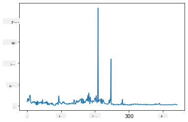
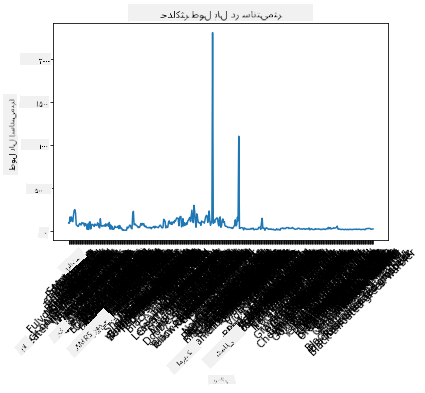
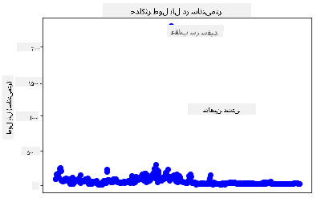
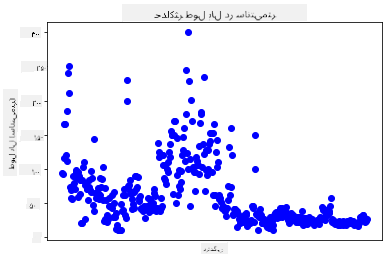
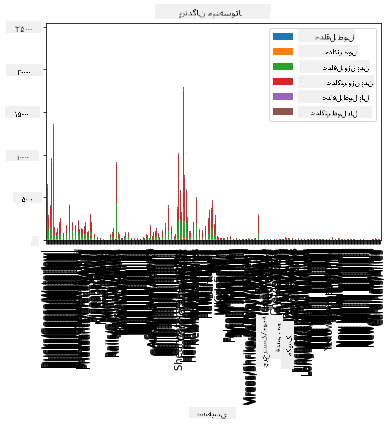
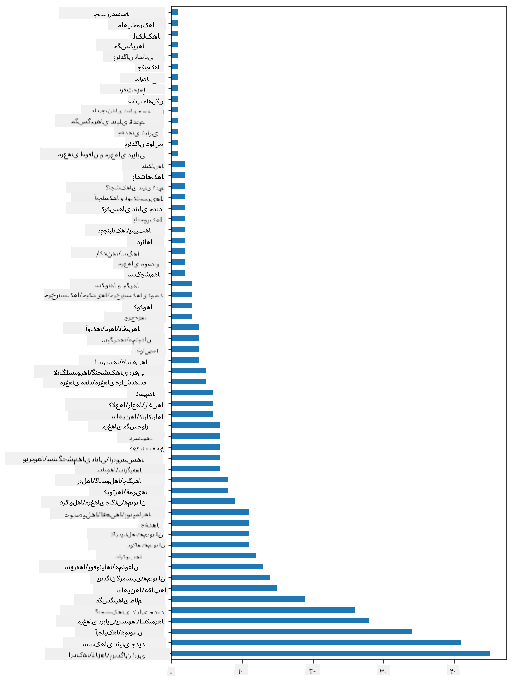
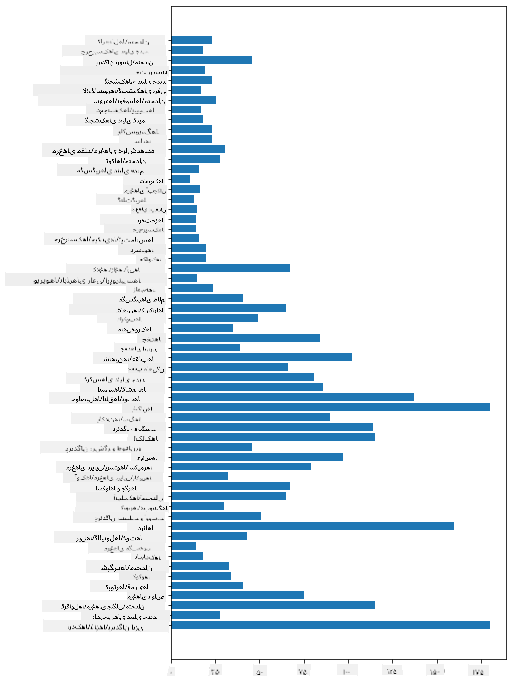

<!--
CO_OP_TRANSLATOR_METADATA:
{
  "original_hash": "69b32b6789a91f796ebc7a02f5575e03",
  "translation_date": "2025-09-04T14:28:31+00:00",
  "source_file": "3-Data-Visualization/09-visualization-quantities/README.md",
  "language_code": "fa"
}
-->
# تجسم مقادیر

|](../../sketchnotes/09-Visualizing-Quantities.png)|
|:---:|
| تجسم مقادیر - _طرح دستی توسط [@nitya](https://twitter.com/nitya)_ |

در این درس، شما یاد خواهید گرفت که چگونه از یکی از کتابخانه‌های موجود پایتون استفاده کنید تا تجسم‌های جالبی پیرامون مفهوم مقدار ایجاد کنید. با استفاده از یک مجموعه داده پاک شده درباره پرندگان مینه‌سوتا، می‌توانید حقایق جالبی درباره حیات وحش محلی یاد بگیرید.

## [آزمون پیش از درس](https://purple-hill-04aebfb03.1.azurestaticapps.net/quiz/16)

## مشاهده طول بال‌ها با Matplotlib

یک کتابخانه عالی برای ایجاد نمودارها و چارت‌های ساده و پیچیده از انواع مختلف، [Matplotlib](https://matplotlib.org/stable/index.html) است. به طور کلی، فرآیند رسم داده‌ها با استفاده از این کتابخانه‌ها شامل شناسایی بخش‌های مورد نظر از دیتافریم، انجام تغییرات لازم روی داده‌ها، اختصاص مقادیر محور x و y، تصمیم‌گیری درباره نوع نمودار و سپس نمایش نمودار است. Matplotlib انواع زیادی از تجسم‌ها را ارائه می‌دهد، اما در این درس، بیایید روی مواردی تمرکز کنیم که برای تجسم مقدار مناسب‌تر هستند: نمودارهای خطی، نمودارهای پراکندگی و نمودارهای میله‌ای.

> ✅ از بهترین نمودار برای ساختار داده‌های خود و داستانی که می‌خواهید بگویید استفاده کنید.
> - برای تحلیل روندها در طول زمان: خطی
> - برای مقایسه مقادیر: میله‌ای، ستونی، دایره‌ای، پراکندگی
> - برای نشان دادن ارتباط بخش‌ها با کل: دایره‌ای
> - برای نشان دادن توزیع داده‌ها: پراکندگی، میله‌ای
> - برای نشان دادن روندها: خطی، ستونی
> - برای نشان دادن روابط بین مقادیر: خطی، پراکندگی، حبابی

اگر یک مجموعه داده دارید و نیاز دارید که کشف کنید چه مقدار از یک آیتم خاص در آن وجود دارد، یکی از اولین وظایف شما بررسی مقادیر آن خواهد بود.

✅ 'برگه‌های تقلب' بسیار خوبی برای Matplotlib [اینجا](https://matplotlib.org/cheatsheets/cheatsheets.pdf) موجود است.

## ساخت یک نمودار خطی درباره مقادیر طول بال پرندگان

فایل `notebook.ipynb` را در ریشه پوشه این درس باز کنید و یک سلول اضافه کنید.

> توجه: داده‌ها در ریشه این مخزن در پوشه `/data` ذخیره شده‌اند.

```python
import pandas as pd
import matplotlib.pyplot as plt
birds = pd.read_csv('../../data/birds.csv')
birds.head()
```
این داده‌ها ترکیبی از متن و اعداد هستند:

|      | نام                          | نام علمی                | دسته‌بندی              | راسته        | خانواده   | جنس        | وضعیت حفاظتی         | حداقل طول | حداکثر طول | حداقل وزن بدن | حداکثر وزن بدن | حداقل طول بال | حداکثر طول بال |
| ---: | :--------------------------- | :--------------------- | :-------------------- | :----------- | :------- | :---------- | :----------------- | --------: | --------: | ----------: | ----------: | ----------: | ----------: |
|    0 | اردک سوت‌زن شکم‌سیاه         | Dendrocygna autumnalis | اردک‌ها/غازها/آبزیان  | Anseriformes | Anatidae | Dendrocygna | LC                 |        47 |        56 |         652 |        1020 |          76 |          94 |
|    1 | اردک سوت‌زن قهوه‌ای          | Dendrocygna bicolor    | اردک‌ها/غازها/آبزیان  | Anseriformes | Anatidae | Dendrocygna | LC                 |        45 |        53 |         712 |        1050 |          85 |          93 |
|    2 | غاز برفی                     | Anser caerulescens     | اردک‌ها/غازها/آبزیان  | Anseriformes | Anatidae | Anser       | LC                 |        64 |        79 |        2050 |        4050 |         135 |         165 |
|    3 | غاز راس                      | Anser rossii           | اردک‌ها/غازها/آبزیان  | Anseriformes | Anatidae | Anser       | LC                 |      57.3 |        64 |        1066 |        1567 |         113 |         116 |
|    4 | غاز پیشانی سفید بزرگ         | Anser albifrons        | اردک‌ها/غازها/آبزیان  | Anseriformes | Anatidae | Anser       | LC                 |        64 |        81 |        1930 |        3310 |         130 |         165 |

بیایید با رسم برخی از داده‌های عددی با استفاده از یک نمودار خطی ساده شروع کنیم. فرض کنید می‌خواهید نمایی از حداکثر طول بال این پرندگان جالب داشته باشید.

```python
wingspan = birds['MaxWingspan'] 
wingspan.plot()
```


چه چیزی بلافاصله توجه شما را جلب می‌کند؟ به نظر می‌رسد حداقل یک مقدار غیرعادی وجود دارد - این طول بال بسیار زیاد است! طول بال 2300 سانتی‌متر برابر با 23 متر است - آیا پتروسورها در مینه‌سوتا پرسه می‌زنند؟ بیایید بررسی کنیم.

در حالی که می‌توانید با یک مرتب‌سازی سریع در اکسل این مقادیر غیرعادی را پیدا کنید، بهتر است فرآیند تجسم را از داخل نمودار ادامه دهید.

برچسب‌هایی به محور x اضافه کنید تا نشان دهید چه نوع پرندگانی در اینجا مورد بررسی هستند:

```
plt.title('Max Wingspan in Centimeters')
plt.ylabel('Wingspan (CM)')
plt.xlabel('Birds')
plt.xticks(rotation=45)
x = birds['Name'] 
y = birds['MaxWingspan']

plt.plot(x, y)

plt.show()
```


حتی با چرخش برچسب‌ها به 45 درجه، تعداد زیادی وجود دارد که خواندن آن‌ها دشوار است. بیایید استراتژی دیگری را امتحان کنیم: فقط مقادیر غیرعادی را برچسب‌گذاری کنیم و برچسب‌ها را در داخل نمودار قرار دهیم. می‌توانید از نمودار پراکندگی برای ایجاد فضای بیشتر برای برچسب‌گذاری استفاده کنید:

```python
plt.title('Max Wingspan in Centimeters')
plt.ylabel('Wingspan (CM)')
plt.tick_params(axis='both',which='both',labelbottom=False,bottom=False)

for i in range(len(birds)):
    x = birds['Name'][i]
    y = birds['MaxWingspan'][i]
    plt.plot(x, y, 'bo')
    if birds['MaxWingspan'][i] > 500:
        plt.text(x, y * (1 - 0.05), birds['Name'][i], fontsize=12)
    
plt.show()
```
اینجا چه اتفاقی افتاده است؟ شما از `tick_params` برای مخفی کردن برچسب‌های پایین استفاده کردید و سپس یک حلقه روی مجموعه داده پرندگان خود ایجاد کردید. با رسم نمودار با نقاط کوچک آبی گرد با استفاده از `bo`، بررسی کردید که آیا پرنده‌ای با طول بال بیش از 500 وجود دارد و اگر چنین بود، برچسب آن را در کنار نقطه نمایش دادید. برچسب‌ها را کمی در محور y جابجا کردید (`y * (1 - 0.05)`) و از نام پرنده به عنوان برچسب استفاده کردید.

چه چیزی کشف کردید؟



## فیلتر کردن داده‌ها

هم عقاب سر سفید و هم شاهین دشتی، در حالی که احتمالاً پرندگان بسیار بزرگی هستند، به نظر می‌رسد که اشتباه برچسب‌گذاری شده‌اند و یک `0` اضافی به طول بال حداکثر آن‌ها اضافه شده است. بعید است که با عقاب سر سفیدی با طول بال 25 متر روبرو شوید، اما اگر چنین شد، لطفاً به ما اطلاع دهید! بیایید یک دیتافریم جدید بدون این دو مقدار غیرعادی ایجاد کنیم:

```python
plt.title('Max Wingspan in Centimeters')
plt.ylabel('Wingspan (CM)')
plt.xlabel('Birds')
plt.tick_params(axis='both',which='both',labelbottom=False,bottom=False)
for i in range(len(birds)):
    x = birds['Name'][i]
    y = birds['MaxWingspan'][i]
    if birds['Name'][i] not in ['Bald eagle', 'Prairie falcon']:
        plt.plot(x, y, 'bo')
plt.show()
```

با فیلتر کردن مقادیر غیرعادی، داده‌های شما اکنون منسجم‌تر و قابل فهم‌تر هستند.



اکنون که مجموعه داده‌ای تمیزتر داریم، حداقل از نظر طول بال، بیایید اطلاعات بیشتری درباره این پرندگان کشف کنیم.

در حالی که نمودارهای خطی و پراکندگی می‌توانند اطلاعاتی درباره مقادیر داده‌ها و توزیع آن‌ها نمایش دهند، ما می‌خواهیم درباره مقادیر ذاتی این مجموعه داده فکر کنیم. شما می‌توانید تجسم‌هایی ایجاد کنید تا به سوالات زیر درباره مقدار پاسخ دهید:

> چند دسته از پرندگان وجود دارد و تعداد آن‌ها چقدر است؟
> چند پرنده منقرض شده، در معرض خطر، نادر یا معمولی هستند؟
> چند پرنده از جنس‌ها و راسته‌های مختلف در اصطلاحات لینائوس وجود دارند؟

## بررسی نمودارهای میله‌ای

نمودارهای میله‌ای زمانی که نیاز به نمایش گروه‌بندی داده‌ها دارید، کاربردی هستند. بیایید دسته‌بندی‌های پرندگان موجود در این مجموعه داده را بررسی کنیم تا ببینیم کدام دسته بیشترین تعداد را دارد.

در فایل نوت‌بوک، یک نمودار میله‌ای ساده ایجاد کنید.

✅ توجه داشته باشید که می‌توانید دو پرنده غیرعادی که در بخش قبلی شناسایی کردیم را فیلتر کنید، خطای تایپی در طول بال آن‌ها را اصلاح کنید یا آن‌ها را برای این تمرین‌ها که به مقادیر طول بال وابسته نیستند، نگه دارید.

اگر می‌خواهید یک نمودار میله‌ای ایجاد کنید، می‌توانید داده‌هایی را که می‌خواهید روی آن تمرکز کنید انتخاب کنید. نمودارهای میله‌ای می‌توانند از داده‌های خام ایجاد شوند:

```python
birds.plot(x='Category',
        kind='bar',
        stacked=True,
        title='Birds of Minnesota')

```


این نمودار میله‌ای، با این حال، خوانا نیست زیرا داده‌های غیرگروه‌بندی شده زیادی وجود دارد. شما باید فقط داده‌هایی را که می‌خواهید رسم کنید انتخاب کنید، بنابراین بیایید طول پرندگان را بر اساس دسته‌بندی آن‌ها بررسی کنیم.

داده‌های خود را فیلتر کنید تا فقط دسته‌بندی پرندگان را شامل شود.

✅ توجه داشته باشید که از Pandas برای مدیریت داده‌ها استفاده می‌کنید و سپس اجازه می‌دهید Matplotlib نمودار را رسم کند.

از آنجا که دسته‌بندی‌های زیادی وجود دارد، می‌توانید این نمودار را به صورت عمودی نمایش دهید و ارتفاع آن را برای نمایش تمام داده‌ها تنظیم کنید:

```python
category_count = birds.value_counts(birds['Category'].values, sort=True)
plt.rcParams['figure.figsize'] = [6, 12]
category_count.plot.barh()
```


این نمودار میله‌ای نمای خوبی از تعداد پرندگان در هر دسته‌بندی نشان می‌دهد. در یک نگاه، می‌بینید که بیشترین تعداد پرندگان در این منطقه در دسته اردک‌ها/غازها/آبزیان قرار دارند. مینه‌سوتا 'سرزمین 10,000 دریاچه' است، بنابراین این موضوع تعجب‌آور نیست!

✅ برخی شمارش‌های دیگر را روی این مجموعه داده امتحان کنید. آیا چیزی شما را شگفت‌زده می‌کند؟

## مقایسه داده‌ها

می‌توانید مقایسه‌های مختلفی از داده‌های گروه‌بندی شده را با ایجاد محورهای جدید امتحان کنید. یک مقایسه از حداکثر طول یک پرنده، بر اساس دسته‌بندی آن را امتحان کنید:

```python
maxlength = birds['MaxLength']
plt.barh(y=birds['Category'], width=maxlength)
plt.rcParams['figure.figsize'] = [6, 12]
plt.show()
```


اینجا چیزی تعجب‌آور نیست: مرغ مگس‌خوار کمترین حداکثر طول را در مقایسه با پلیکان‌ها یا غازها دارد. خوب است وقتی داده‌ها منطقی به نظر می‌رسند!

می‌توانید تجسم‌های جالب‌تری از نمودارهای میله‌ای با قرار دادن داده‌ها روی هم ایجاد کنید. بیایید حداقل و حداکثر طول را روی یک دسته‌بندی پرنده قرار دهیم:

```python
minLength = birds['MinLength']
maxLength = birds['MaxLength']
category = birds['Category']

plt.barh(category, maxLength)
plt.barh(category, minLength)

plt.show()
```
در این نمودار، می‌توانید محدوده طول حداقل و حداکثر را برای هر دسته‌بندی پرنده مشاهده کنید. می‌توانید با اطمینان بگویید که، با توجه به این داده‌ها، هرچه پرنده بزرگ‌تر باشد، محدوده طول آن نیز بزرگ‌تر است. جالب است!


## 🚀 چالش

این مجموعه داده پرندگان اطلاعات زیادی درباره انواع مختلف پرندگان در یک اکوسیستم خاص ارائه می‌دهد. در اینترنت جستجو کنید و ببینید آیا می‌توانید مجموعه داده‌های دیگری درباره پرندگان پیدا کنید. تمرین کنید نمودارها و گراف‌هایی پیرامون این پرندگان بسازید تا حقایقی را کشف کنید که قبلاً نمی‌دانستید.

## [آزمون پس از درس](https://ff-quizzes.netlify.app/en/ds/)

## مرور و مطالعه شخصی

این درس اول اطلاعاتی درباره نحوه استفاده از Matplotlib برای تجسم مقادیر به شما داده است. تحقیق کنید درباره روش‌های دیگر کار با مجموعه داده‌ها برای تجسم. [Plotly](https://github.com/plotly/plotly.py) یکی از مواردی است که در این درس‌ها پوشش داده نمی‌شود، بنابراین نگاهی به آن بیندازید تا ببینید چه چیزی ارائه می‌دهد.

## تکلیف

[خطوط، پراکندگی‌ها و میله‌ها](assignment.md)

---

**سلب مسئولیت**:  
این سند با استفاده از سرویس ترجمه هوش مصنوعی [Co-op Translator](https://github.com/Azure/co-op-translator) ترجمه شده است. در حالی که ما برای دقت تلاش می‌کنیم، لطفاً توجه داشته باشید که ترجمه‌های خودکار ممکن است شامل خطاها یا نادرستی‌هایی باشند. سند اصلی به زبان اصلی آن باید به عنوان منبع معتبر در نظر گرفته شود. برای اطلاعات حساس، ترجمه حرفه‌ای انسانی توصیه می‌شود. ما هیچ مسئولیتی در قبال سوءتفاهم‌ها یا تفسیرهای نادرست ناشی از استفاده از این ترجمه نداریم.