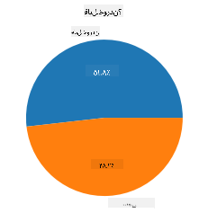
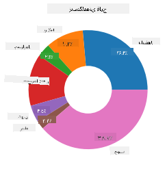
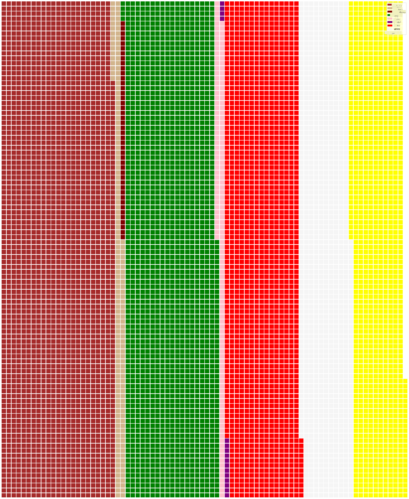

<!--
CO_OP_TRANSLATOR_METADATA:
{
  "original_hash": "af6a12015c6e250e500b570a9fa42593",
  "translation_date": "2025-08-24T23:05:29+00:00",
  "source_file": "3-Data-Visualization/11-visualization-proportions/README.md",
  "language_code": "fa"
}
-->
# تجسم نسبت‌ها

| ](../../sketchnotes/11-Visualizing-Proportions.png)|
|:---:|
|تجسم نسبت‌ها - _طرح دستی توسط [@nitya](https://twitter.com/nitya)_ |

در این درس، شما از یک مجموعه داده با محوریت طبیعت استفاده خواهید کرد تا نسبت‌ها را تجسم کنید، مانند تعداد انواع مختلف قارچ‌ها در یک مجموعه داده درباره قارچ‌ها. بیایید این قارچ‌های شگفت‌انگیز را با استفاده از مجموعه داده‌ای که از Audubon گرفته شده و شامل جزئیاتی درباره ۲۳ گونه قارچ‌های تیغه‌دار از خانواده‌های Agaricus و Lepiota است، بررسی کنیم. شما با تجسم‌های جذابی مانند موارد زیر کار خواهید کرد:

- نمودارهای دایره‌ای 🥧  
- نمودارهای دونات 🍩  
- نمودارهای وافل 🧇  

> 💡 یک پروژه بسیار جالب به نام [Charticulator](https://charticulator.com) از Microsoft Research یک رابط کاربری کشیدن و رها کردن رایگان برای تجسم داده‌ها ارائه می‌دهد. در یکی از آموزش‌های آن‌ها نیز از این مجموعه داده قارچ استفاده شده است! بنابراین می‌توانید داده‌ها را بررسی کرده و همزمان کتابخانه را یاد بگیرید: [آموزش Charticulator](https://charticulator.com/tutorials/tutorial4.html).

## [آزمون پیش از درس](https://purple-hill-04aebfb03.1.azurestaticapps.net/quiz/20)

## با قارچ‌های خود آشنا شوید 🍄

قارچ‌ها بسیار جالب هستند. بیایید یک مجموعه داده وارد کنیم تا آن‌ها را مطالعه کنیم:

```python
import pandas as pd
import matplotlib.pyplot as plt
mushrooms = pd.read_csv('../../data/mushrooms.csv')
mushrooms.head()
```  
یک جدول با داده‌های عالی برای تحلیل چاپ می‌شود:

| class     | cap-shape | cap-surface | cap-color | bruises | odor    | gill-attachment | gill-spacing | gill-size | gill-color | stalk-shape | stalk-root | stalk-surface-above-ring | stalk-surface-below-ring | stalk-color-above-ring | stalk-color-below-ring | veil-type | veil-color | ring-number | ring-type | spore-print-color | population | habitat |
| --------- | --------- | ----------- | --------- | ------- | ------- | --------------- | ------------ | --------- | ---------- | ----------- | ---------- | ------------------------ | ------------------------ | ---------------------- | ---------------------- | --------- | ---------- | ----------- | --------- | ----------------- | ---------- | ------- |
| Poisonous | Convex    | Smooth      | Brown     | Bruises | Pungent | Free            | Close        | Narrow    | Black      | Enlarging   | Equal      | Smooth                   | Smooth                   | White                  | White                  | Partial   | White      | One         | Pendant   | Black             | Scattered  | Urban   |
| Edible    | Convex    | Smooth      | Yellow    | Bruises | Almond  | Free            | Close        | Broad     | Black      | Enlarging   | Club       | Smooth                   | Smooth                   | White                  | White                  | Partial   | White      | One         | Pendant   | Brown             | Numerous   | Grasses |
| Edible    | Bell      | Smooth      | White     | Bruises | Anise   | Free            | Close        | Broad     | Brown      | Enlarging   | Club       | Smooth                   | Smooth                   | White                  | White                  | Partial   | White      | One         | Pendant   | Brown             | Numerous   | Meadows |
| Poisonous | Convex    | Scaly       | White     | Bruises | Pungent | Free            | Close        | Narrow    | Brown      | Enlarging   | Equal      | Smooth                   | Smooth                   | White                  | White                  | Partial   | White      | One         | Pendant   | Black             | Scattered  | Urban   |

بلافاصله متوجه می‌شوید که تمام داده‌ها متنی هستند. شما باید این داده‌ها را تبدیل کنید تا بتوانید از آن‌ها در یک نمودار استفاده کنید. در واقع، بیشتر داده‌ها به صورت یک شیء نمایش داده شده‌اند:

```python
print(mushrooms.select_dtypes(["object"]).columns)
```

خروجی به این صورت است:

```output
Index(['class', 'cap-shape', 'cap-surface', 'cap-color', 'bruises', 'odor',
       'gill-attachment', 'gill-spacing', 'gill-size', 'gill-color',
       'stalk-shape', 'stalk-root', 'stalk-surface-above-ring',
       'stalk-surface-below-ring', 'stalk-color-above-ring',
       'stalk-color-below-ring', 'veil-type', 'veil-color', 'ring-number',
       'ring-type', 'spore-print-color', 'population', 'habitat'],
      dtype='object')
```  
این داده‌ها را بگیرید و ستون 'class' را به یک دسته‌بندی تبدیل کنید:

```python
cols = mushrooms.select_dtypes(["object"]).columns
mushrooms[cols] = mushrooms[cols].astype('category')
```

```python
edibleclass=mushrooms.groupby(['class']).count()
edibleclass
```

حالا اگر داده‌های قارچ را چاپ کنید، می‌بینید که بر اساس دسته‌بندی‌های سمی/خوراکی گروه‌بندی شده‌اند:

|           | cap-shape | cap-surface | cap-color | bruises | odor | gill-attachment | gill-spacing | gill-size | gill-color | stalk-shape | ... | stalk-surface-below-ring | stalk-color-above-ring | stalk-color-below-ring | veil-type | veil-color | ring-number | ring-type | spore-print-color | population | habitat |
| --------- | --------- | ----------- | --------- | ------- | ---- | --------------- | ------------ | --------- | ---------- | ----------- | --- | ------------------------ | ---------------------- | ---------------------- | --------- | ---------- | ----------- | --------- | ----------------- | ---------- | ------- |
| class     |           |             |           |         |      |                 |              |           |            |             |     |                          |                        |                        |           |            |             |           |                   |            |         |
| Edible    | 4208      | 4208        | 4208      | 4208    | 4208 | 4208            | 4208         | 4208      | 4208       | 4208        | ... | 4208                     | 4208                   | 4208                   | 4208      | 4208       | 4208        | 4208      | 4208              | 4208       | 4208    |
| Poisonous | 3916      | 3916        | 3916      | 3916    | 3916 | 3916            | 3916         | 3916      | 3916       | 3916        | ... | 3916                     | 3916                   | 3916                   | 3916      | 3916       | 3916        | 3916      | 3916              | 3916       | 3916    |

اگر ترتیب ارائه‌شده در این جدول را برای ایجاد برچسب‌های دسته‌بندی کلاس دنبال کنید، می‌توانید یک نمودار دایره‌ای بسازید:

## دایره‌ای!

```python
labels=['Edible','Poisonous']
plt.pie(edibleclass['population'],labels=labels,autopct='%.1f %%')
plt.title('Edible?')
plt.show()
```  
وویلا، یک نمودار دایره‌ای که نسبت‌های این داده‌ها را بر اساس این دو دسته قارچ نشان می‌دهد. بسیار مهم است که ترتیب برچسب‌ها را به درستی تنظیم کنید، به خصوص در اینجا، بنابراین حتماً ترتیب آرایه برچسب‌ها را بررسی کنید!



## دونات!

یک نمودار دایره‌ای کمی جذاب‌تر، نمودار دونات است که یک نمودار دایره‌ای با یک حفره در وسط است. بیایید داده‌های خود را با این روش بررسی کنیم.

به زیستگاه‌های مختلفی که قارچ‌ها در آن رشد می‌کنند نگاهی بیندازید:

```python
habitat=mushrooms.groupby(['habitat']).count()
habitat
```  
در اینجا، داده‌های خود را بر اساس زیستگاه گروه‌بندی می‌کنید. ۷ زیستگاه فهرست شده است، بنابراین از آن‌ها به عنوان برچسب‌های نمودار دونات خود استفاده کنید:

```python
labels=['Grasses','Leaves','Meadows','Paths','Urban','Waste','Wood']

plt.pie(habitat['class'], labels=labels,
        autopct='%1.1f%%', pctdistance=0.85)
  
center_circle = plt.Circle((0, 0), 0.40, fc='white')
fig = plt.gcf()

fig.gca().add_artist(center_circle)
  
plt.title('Mushroom Habitats')
  
plt.show()
```



این کد یک نمودار و یک دایره مرکزی رسم می‌کند، سپس آن دایره مرکزی را به نمودار اضافه می‌کند. عرض دایره مرکزی را با تغییر مقدار `0.40` به مقدار دیگر ویرایش کنید.

نمودارهای دونات را می‌توان به روش‌های مختلفی برای تغییر برچسب‌ها تنظیم کرد. به خصوص برچسب‌ها را می‌توان برای خوانایی بیشتر برجسته کرد. اطلاعات بیشتر را در [مستندات](https://matplotlib.org/stable/gallery/pie_and_polar_charts/pie_and_donut_labels.html?highlight=donut) بیابید.

حالا که می‌دانید چگونه داده‌های خود را گروه‌بندی کرده و سپس به صورت دایره‌ای یا دونات نمایش دهید، می‌توانید انواع دیگر نمودارها را بررسی کنید. یک نمودار وافل را امتحان کنید که فقط یک روش متفاوت برای بررسی کمیت است.

## وافل!

یک نمودار نوع 'وافل' یک روش متفاوت برای تجسم کمیت‌ها به صورت آرایه دوبعدی از مربع‌ها است. سعی کنید کمیت‌های مختلف رنگ کلاهک قارچ‌ها را در این مجموعه داده تجسم کنید. برای این کار، باید یک کتابخانه کمکی به نام [PyWaffle](https://pypi.org/project/pywaffle/) نصب کرده و از Matplotlib استفاده کنید:

```python
pip install pywaffle
```

یک بخش از داده‌های خود را برای گروه‌بندی انتخاب کنید:

```python
capcolor=mushrooms.groupby(['cap-color']).count()
capcolor
```

با ایجاد برچسب‌ها و سپس گروه‌بندی داده‌های خود، یک نمودار وافل ایجاد کنید:

```python
import pandas as pd
import matplotlib.pyplot as plt
from pywaffle import Waffle
  
data ={'color': ['brown', 'buff', 'cinnamon', 'green', 'pink', 'purple', 'red', 'white', 'yellow'],
    'amount': capcolor['class']
     }
  
df = pd.DataFrame(data)
  
fig = plt.figure(
    FigureClass = Waffle,
    rows = 100,
    values = df.amount,
    labels = list(df.color),
    figsize = (30,30),
    colors=["brown", "tan", "maroon", "green", "pink", "purple", "red", "whitesmoke", "yellow"],
)
```

با استفاده از یک نمودار وافل، می‌توانید به وضوح نسبت‌های رنگ کلاهک قارچ‌ها را در این مجموعه داده مشاهده کنید. جالب است که قارچ‌های زیادی با کلاهک سبز وجود دارند!



✅ PyWaffle از آیکون‌ها در نمودارها پشتیبانی می‌کند که از هر آیکونی که در [Font Awesome](https://fontawesome.com/) موجود است استفاده می‌کند. آزمایش‌هایی انجام دهید تا یک نمودار وافل حتی جالب‌تر با استفاده از آیکون‌ها به جای مربع‌ها ایجاد کنید.

در این درس، شما سه روش برای تجسم نسبت‌ها یاد گرفتید. ابتدا باید داده‌های خود را به دسته‌بندی‌ها گروه‌بندی کنید و سپس تصمیم بگیرید که بهترین روش برای نمایش داده‌ها چیست - دایره‌ای، دونات، یا وافل. همه این روش‌ها جذاب هستند و به کاربر یک نمای کلی فوری از مجموعه داده ارائه می‌دهند.

## 🚀 چالش

سعی کنید این نمودارهای جذاب را در [Charticulator](https://charticulator.com) بازسازی کنید.

## [آزمون پس از درس](https://purple-hill-04aebfb03.1.azurestaticapps.net/quiz/21)

## مرور و مطالعه شخصی

گاهی اوقات مشخص نیست که چه زمانی باید از نمودار دایره‌ای، دونات، یا وافل استفاده کرد. در اینجا چند مقاله برای مطالعه در این زمینه آورده شده است:

https://www.beautiful.ai/blog/battle-of-the-charts-pie-chart-vs-donut-chart

https://medium.com/@hypsypops/pie-chart-vs-donut-chart-showdown-in-the-ring-5d24fd86a9ce

https://www.mit.edu/~mbarker/formula1/f1help/11-ch-c6.htm

https://medium.datadriveninvestor.com/data-visualization-done-the-right-way-with-tableau-waffle-chart-fdf2a19be402

تحقیقاتی انجام دهید تا اطلاعات بیشتری درباره این تصمیم‌گیری دشوار پیدا کنید.

## تکلیف

[آن را در اکسل امتحان کنید](assignment.md)

**سلب مسئولیت**:  
این سند با استفاده از سرویس ترجمه هوش مصنوعی [Co-op Translator](https://github.com/Azure/co-op-translator) ترجمه شده است. در حالی که ما تلاش می‌کنیم دقت را حفظ کنیم، لطفاً توجه داشته باشید که ترجمه‌های خودکار ممکن است شامل خطاها یا نادرستی‌ها باشند. سند اصلی به زبان اصلی آن باید به عنوان منبع معتبر در نظر گرفته شود. برای اطلاعات حساس، توصیه می‌شود از ترجمه انسانی حرفه‌ای استفاده کنید. ما مسئولیتی در قبال سوء تفاهم‌ها یا تفسیرهای نادرست ناشی از استفاده از این ترجمه نداریم.