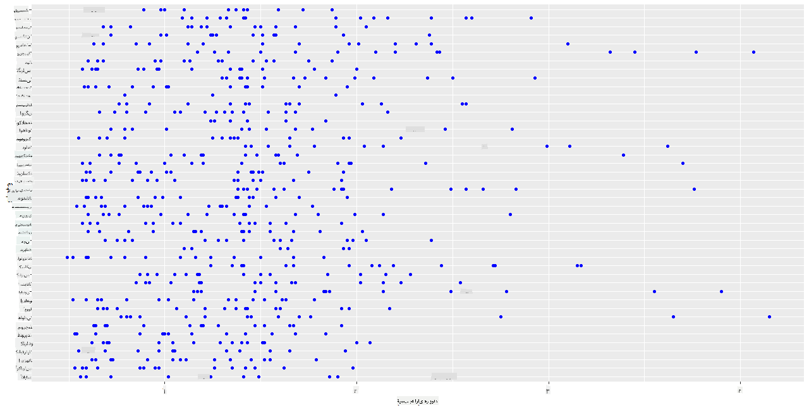
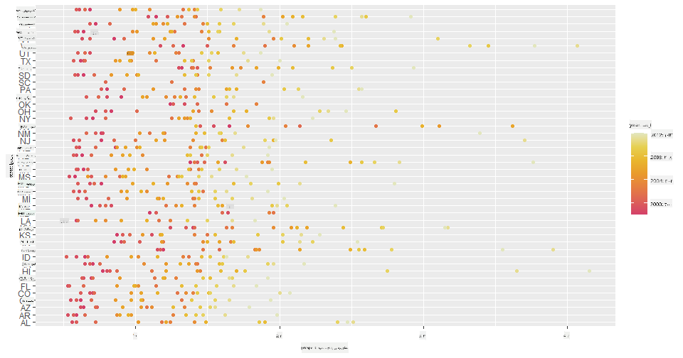
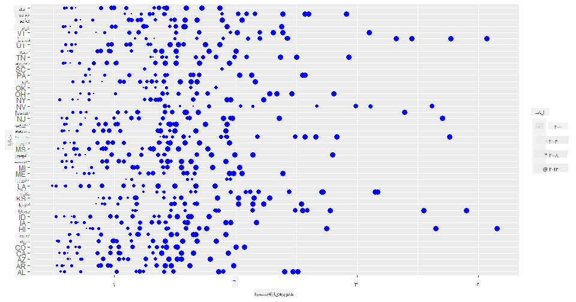
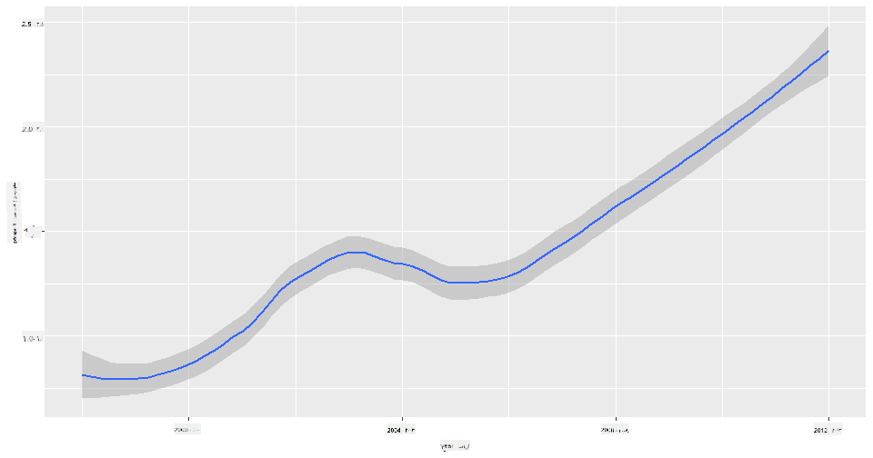
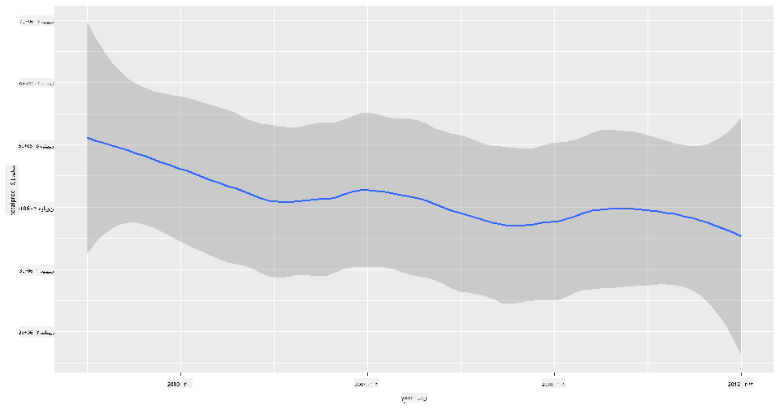
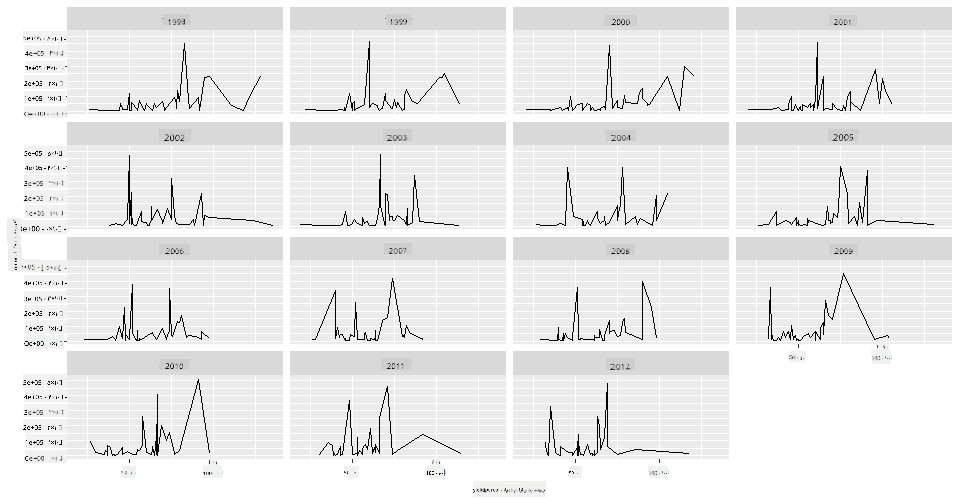

<!--
CO_OP_TRANSLATOR_METADATA:
{
  "original_hash": "a33c5d4b4156a2b41788d8720b6f724c",
  "translation_date": "2025-08-24T22:47:13+00:00",
  "source_file": "3-Data-Visualization/R/12-visualization-relationships/README.md",
  "language_code": "fa"
}
-->
# تجسم روابط: همه چیز درباره عسل 🍯

|](../../../sketchnotes/12-Visualizing-Relationships.png)|
|:---:|
|تجسم روابط - _طرح دستی توسط [@nitya](https://twitter.com/nitya)_ |

با ادامه تمرکز بر طبیعت در تحقیقاتمان، بیایید تجسم‌های جالبی را کشف کنیم که روابط بین انواع مختلف عسل را نشان می‌دهند، بر اساس مجموعه داده‌ای که از [وزارت کشاورزی ایالات متحده](https://www.nass.usda.gov/About_NASS/index.php) استخراج شده است.

این مجموعه داده شامل حدود ۶۰۰ آیتم است که تولید عسل در بسیاری از ایالت‌های آمریکا را نمایش می‌دهد. به عنوان مثال، می‌توانید تعداد کلنی‌ها، بازده هر کلنی، تولید کل، ذخایر، قیمت هر پوند و ارزش عسل تولید شده در یک ایالت خاص را از سال ۱۹۹۸ تا ۲۰۱۲ بررسی کنید، به طوری که هر ردیف مربوط به یک سال برای هر ایالت است.

جالب خواهد بود که رابطه بین تولید سالانه یک ایالت و مثلاً قیمت عسل در آن ایالت را تجسم کنیم. یا می‌توانید رابطه بین بازده عسل هر کلنی در ایالت‌های مختلف را تجسم کنید. این بازه زمانی شامل دوره‌ای است که اختلال فروپاشی کلنی (CCD) برای اولین بار در سال ۲۰۰۶ مشاهده شد (http://npic.orst.edu/envir/ccd.html)، بنابراین این مجموعه داده برای مطالعه بسیار قابل توجه است. 🐝

## [آزمون پیش از درس](https://purple-hill-04aebfb03.1.azurestaticapps.net/quiz/22)

در این درس، می‌توانید از ggplot2 که قبلاً استفاده کرده‌اید، به عنوان یک کتابخانه خوب برای تجسم روابط بین متغیرها استفاده کنید. به خصوص استفاده از `geom_point` و تابع `qplot` در ggplot2 جالب است که امکان ایجاد نمودارهای پراکندگی و خطی را فراهم می‌کند تا به سرعت روابط آماری را تجسم کنید، که به دانشمند داده کمک می‌کند بهتر بفهمد چگونه متغیرها به یکدیگر مرتبط هستند.

## نمودارهای پراکندگی

از نمودار پراکندگی استفاده کنید تا نشان دهید قیمت عسل چگونه سال به سال در هر ایالت تغییر کرده است. ggplot2 با استفاده از `ggplot` و `geom_point` به راحتی داده‌های ایالت‌ها را گروه‌بندی کرده و نقاط داده را برای داده‌های دسته‌ای و عددی نمایش می‌دهد.

بیایید با وارد کردن داده‌ها و Seaborn شروع کنیم:

```r
honey=read.csv('../../data/honey.csv')
head(honey)
```
متوجه می‌شوید که داده‌های عسل شامل چندین ستون جالب است، از جمله سال و قیمت هر پوند. بیایید این داده‌ها را که بر اساس ایالت‌های آمریکا گروه‌بندی شده‌اند، بررسی کنیم:

| ایالت | تعداد کلنی‌ها | بازده هر کلنی | تولید کل | ذخایر | قیمت هر پوند | ارزش تولید | سال |
| ----- | ------------- | ------------- | -------- | ------ | ------------ | ---------- | --- |
| AL    | 16000         | 71            | 1136000  | 159000 | 0.72         | 818000     | 1998 |
| AZ    | 55000         | 60            | 3300000  | 1485000| 0.64         | 2112000    | 1998 |
| AR    | 53000         | 65            | 3445000  | 1688000| 0.59         | 2033000    | 1998 |
| CA    | 450000        | 83            | 37350000 | 12326000| 0.62        | 23157000   | 1998 |
| CO    | 27000         | 72            | 1944000  | 1594000| 0.7          | 1361000    | 1998 |
| FL    | 230000        | 98            | 22540000 | 4508000| 0.64         | 14426000   | 1998 |

یک نمودار پراکندگی ساده ایجاد کنید تا رابطه بین قیمت هر پوند عسل و ایالت مبدا آن را نشان دهید. محور `y` را به اندازه کافی بلند کنید تا تمام ایالت‌ها نمایش داده شوند:

```r
library(ggplot2)
ggplot(honey, aes(x = priceperlb, y = state)) +
  geom_point(colour = "blue")
```


حالا همان داده‌ها را با یک طرح رنگی عسل نمایش دهید تا نشان دهید قیمت چگونه در طول سال‌ها تغییر کرده است. می‌توانید این کار را با افزودن پارامتر 'scale_color_gradientn' انجام دهید تا تغییرات سال به سال را نشان دهید:

> ✅ اطلاعات بیشتر درباره [scale_color_gradientn](https://www.rdocumentation.org/packages/ggplot2/versions/0.9.1/topics/scale_colour_gradientn) - یک طرح رنگی رنگین‌کمان زیبا را امتحان کنید!

```r
ggplot(honey, aes(x = priceperlb, y = state, color=year)) +
  geom_point()+scale_color_gradientn(colours = colorspace::heat_hcl(7))
```


با این تغییر طرح رنگی، می‌توانید ببینید که به وضوح یک پیشرفت قوی در طول سال‌ها از نظر قیمت هر پوند عسل وجود دارد. در واقع، اگر یک مجموعه نمونه در داده‌ها را بررسی کنید (مثلاً ایالت آریزونا)، می‌توانید الگویی از افزایش قیمت سال به سال را مشاهده کنید، با چند استثنا:

| ایالت | تعداد کلنی‌ها | بازده هر کلنی | تولید کل | ذخایر | قیمت هر پوند | ارزش تولید | سال |
| ----- | ------------- | ------------- | -------- | ------ | ------------ | ---------- | --- |
| AZ    | 55000         | 60            | 3300000  | 1485000| 0.64         | 2112000    | 1998 |
| AZ    | 52000         | 62            | 3224000  | 1548000| 0.62         | 1999000    | 1999 |
| AZ    | 40000         | 59            | 2360000  | 1322000| 0.73         | 1723000    | 2000 |
| AZ    | 43000         | 59            | 2537000  | 1142000| 0.72         | 1827000    | 2001 |
| AZ    | 38000         | 63            | 2394000  | 1197000| 1.08         | 2586000    | 2002 |
| AZ    | 35000         | 72            | 2520000  | 983000 | 1.34         | 3377000    | 2003 |
| AZ    | 32000         | 55            | 1760000  | 774000 | 1.11         | 1954000    | 2004 |
| AZ    | 36000         | 50            | 1800000  | 720000 | 1.04         | 1872000    | 2005 |
| AZ    | 30000         | 65            | 1950000  | 839000 | 0.91         | 1775000    | 2006 |
| AZ    | 30000         | 64            | 1920000  | 902000 | 1.26         | 2419000    | 2007 |
| AZ    | 25000         | 64            | 1600000  | 336000 | 1.26         | 2016000    | 2008 |
| AZ    | 20000         | 52            | 1040000  | 562000 | 1.45         | 1508000    | 2009 |
| AZ    | 24000         | 77            | 1848000  | 665000 | 1.52         | 2809000    | 2010 |
| AZ    | 23000         | 53            | 1219000  | 427000 | 1.55         | 1889000    | 2011 |
| AZ    | 22000         | 46            | 1012000  | 253000 | 1.79         | 1811000    | 2012 |

راه دیگری برای تجسم این پیشرفت استفاده از اندازه به جای رنگ است. برای کاربران کوررنگ، این ممکن است گزینه بهتری باشد. تجسم خود را ویرایش کنید تا افزایش قیمت را با افزایش اندازه نقاط نشان دهید:

```r
ggplot(honey, aes(x = priceperlb, y = state)) +
  geom_point(aes(size = year),colour = "blue") +
  scale_size_continuous(range = c(0.25, 3))
```
می‌توانید ببینید که اندازه نقاط به تدریج افزایش می‌یابد.



آیا این یک مورد ساده از عرضه و تقاضا است؟ به دلیل عواملی مانند تغییرات اقلیمی و فروپاشی کلنی، آیا عسل کمتری برای خرید در دسترس است و بنابراین قیمت افزایش می‌یابد؟

برای کشف همبستگی بین برخی از متغیرهای این مجموعه داده، بیایید برخی نمودارهای خطی را بررسی کنیم.

## نمودارهای خطی

سؤال: آیا افزایش واضحی در قیمت هر پوند عسل سال به سال وجود دارد؟ می‌توانید به راحتی این موضوع را با ایجاد یک نمودار خطی واحد کشف کنید:

```r
qplot(honey$year,honey$priceperlb, geom='smooth', span =0.5, xlab = "year",ylab = "priceperlb")
```
پاسخ: بله، با چند استثنا در حدود سال ۲۰۰۳:



سؤال: خب، در سال ۲۰۰۳ آیا می‌توانیم افزایش عرضه عسل را نیز مشاهده کنیم؟ اگر تولید کل را سال به سال بررسی کنید چه؟

```python
qplot(honey$year,honey$totalprod, geom='smooth', span =0.5, xlab = "year",ylab = "totalprod")
```



پاسخ: نه واقعاً. اگر تولید کل را بررسی کنید، به نظر می‌رسد که در آن سال خاص افزایش یافته است، حتی اگر به طور کلی مقدار عسل تولید شده در این سال‌ها در حال کاهش باشد.

سؤال: در این صورت، چه چیزی می‌توانست باعث افزایش قیمت عسل در حدود سال ۲۰۰۳ شود؟

برای کشف این موضوع، می‌توانید یک شبکه فاست را بررسی کنید.

## شبکه‌های فاست

شبکه‌های فاست یک جنبه از مجموعه داده شما را می‌گیرند (در مورد ما، می‌توانید 'سال' را انتخاب کنید تا تعداد فاست‌های تولید شده زیاد نشود). سپس Seaborn می‌تواند یک نمودار برای هر یک از این جنبه‌ها از مختصات x و y انتخابی شما ایجاد کند تا مقایسه بصری آسان‌تر شود. آیا سال ۲۰۰۳ در این نوع مقایسه برجسته است؟

یک شبکه فاست با استفاده از `facet_wrap` ایجاد کنید، همانطور که در [مستندات ggplot2](https://ggplot2.tidyverse.org/reference/facet_wrap.html) توصیه شده است.

```r
ggplot(honey, aes(x=yieldpercol, y = numcol,group = 1)) + 
  geom_line() + facet_wrap(vars(year))
```
در این تجسم، می‌توانید بازده هر کلنی و تعداد کلنی‌ها را سال به سال، کنار هم با تنظیم wrap در ۳ برای ستون‌ها مقایسه کنید:



برای این مجموعه داده، هیچ چیز خاصی در مورد تعداد کلنی‌ها و بازده آن‌ها، سال به سال و ایالت به ایالت برجسته نیست. آیا راه دیگری برای یافتن همبستگی بین این دو متغیر وجود دارد؟

## نمودارهای خطی دوگانه

یک نمودار چندخطی را امتحان کنید که دو نمودار خطی را روی یکدیگر قرار می‌دهد، با استفاده از `par` و `plot` در R. ما سال را در محور x رسم خواهیم کرد و دو محور y را نمایش خواهیم داد. بنابراین، بازده هر کلنی و تعداد کلنی‌ها را روی هم قرار دهید:

```r
par(mar = c(5, 4, 4, 4) + 0.3)              
plot(honey$year, honey$numcol, pch = 16, col = 2,type="l")              
par(new = TRUE)                             
plot(honey$year, honey$yieldpercol, pch = 17, col = 3,              
     axes = FALSE, xlab = "", ylab = "",type="l")
axis(side = 4, at = pretty(range(y2)))      
mtext("colony yield", side = 4, line = 3)   
```


در حالی که هیچ چیز خاصی در حدود سال ۲۰۰۳ به چشم نمی‌آید، این اجازه را به ما می‌دهد که این درس را با یک نکته خوشحال‌کننده‌تر به پایان برسانیم: در حالی که تعداد کلنی‌ها به طور کلی در حال کاهش است، تعداد کلنی‌ها در حال تثبیت است حتی اگر بازده هر کلنی کاهش یابد.

زنده باد زنبورها! 🐝❤️

## 🚀 چالش

در این درس، شما کمی بیشتر درباره استفاده‌های دیگر نمودارهای پراکندگی و شبکه‌های خطی، از جمله شبکه‌های فاست یاد گرفتید. خودتان را به چالش بکشید تا یک شبکه فاست با استفاده از یک مجموعه داده دیگر ایجاد کنید، شاید یکی از مجموعه داده‌هایی که قبلاً در این درس‌ها استفاده کرده‌اید. توجه کنید که چقدر زمان می‌برد تا آن‌ها را ایجاد کنید و چگونه باید مراقب باشید که تعداد شبکه‌هایی که با این تکنیک‌ها رسم می‌کنید زیاد نشود.

## [آزمون پس از درس](https://purple-hill-04aebfb03.1.azurestaticapps.net/quiz/23)

## مرور و مطالعه شخصی

نمودارهای خطی می‌توانند ساده یا بسیار پیچیده باشند. کمی مطالعه در [مستندات ggplot2](https://ggplot2.tidyverse.org/reference/geom_path.html#:~:text=geom_line()%20connects%20them%20in,which%20cases%20are%20connected%20together) درباره روش‌های مختلفی که می‌توانید آن‌ها را بسازید انجام دهید. سعی کنید نمودارهای خطی که در این درس ساختید را با روش‌های دیگر ذکر شده در مستندات بهبود دهید.

## تکلیف

[به کندوی زنبور شیرجه بزنید](assignment.md)

**سلب مسئولیت**:  
این سند با استفاده از سرویس ترجمه هوش مصنوعی [Co-op Translator](https://github.com/Azure/co-op-translator) ترجمه شده است. در حالی که ما تلاش می‌کنیم دقت را حفظ کنیم، لطفاً توجه داشته باشید که ترجمه‌های خودکار ممکن است شامل خطاها یا نادرستی‌ها باشند. سند اصلی به زبان اصلی آن باید به عنوان منبع معتبر در نظر گرفته شود. برای اطلاعات حساس، توصیه می‌شود از ترجمه انسانی حرفه‌ای استفاده کنید. ما مسئولیتی در قبال سوء تفاهم‌ها یا تفسیرهای نادرست ناشی از استفاده از این ترجمه نداریم.