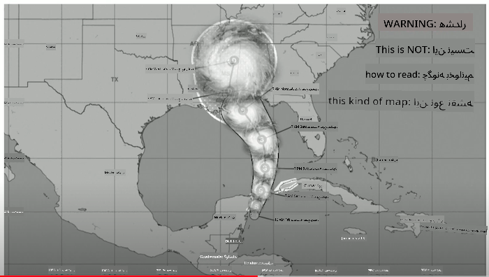
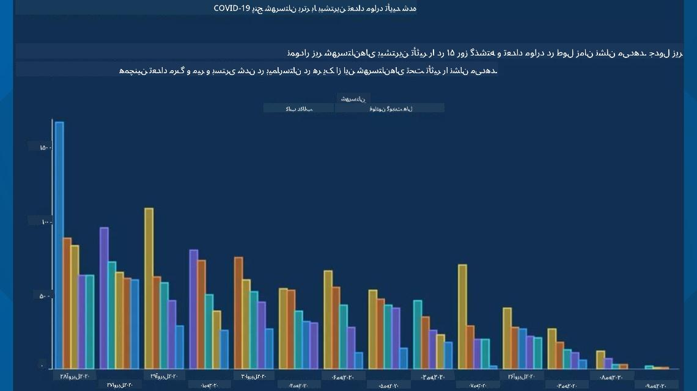
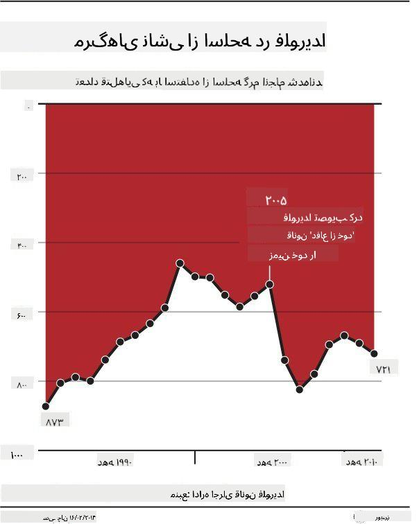
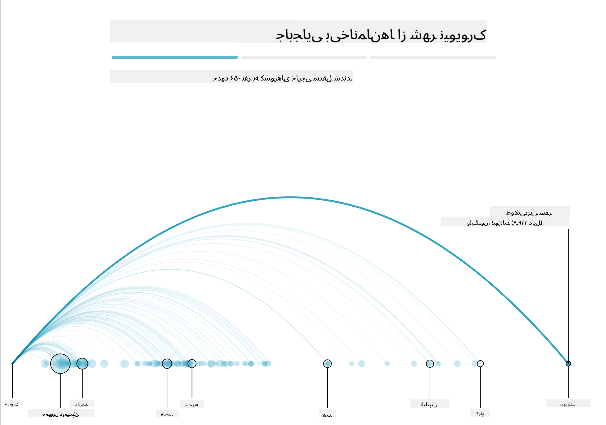
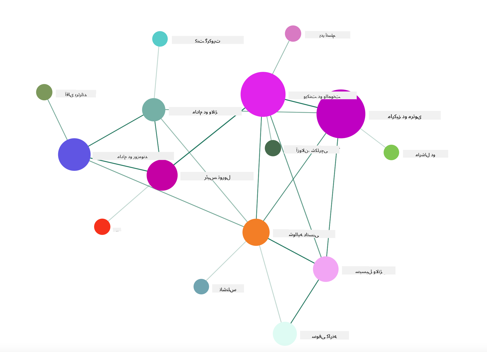

<!--
CO_OP_TRANSLATOR_METADATA:
{
  "original_hash": "b4039f1c76548d144a0aee0bf28304ec",
  "translation_date": "2025-08-24T22:55:31+00:00",
  "source_file": "3-Data-Visualization/R/13-meaningful-vizualizations/README.md",
  "language_code": "fa"
}
-->
# ایجاد مصورسازی‌های معنادار

|](../../../sketchnotes/13-MeaningfulViz.png)|
|:---:|
| مصورسازی‌های معنادار - _اسکچ‌نوت توسط [@nitya](https://twitter.com/nitya)_ |

> "اگر داده‌ها را به اندازه کافی شکنجه کنید، به هر چیزی اعتراف خواهند کرد" -- [رونالد کوز](https://en.wikiquote.org/wiki/Ronald_Coase)

یکی از مهارت‌های اساسی یک دانشمند داده توانایی ایجاد مصورسازی داده‌ای معنادار است که به پاسخ دادن به سوالات کمک کند. پیش از مصورسازی داده‌ها، باید مطمئن شوید که داده‌ها تمیز و آماده شده‌اند، همان‌طور که در درس‌های قبلی انجام دادید. پس از آن، می‌توانید تصمیم بگیرید که چگونه بهترین شکل ممکن داده‌ها را ارائه دهید.

در این درس، شما بررسی خواهید کرد:

1. چگونه نوع نمودار مناسب را انتخاب کنید
2. چگونه از نمودارهای گمراه‌کننده اجتناب کنید
3. چگونه با رنگ کار کنید
4. چگونه نمودارهای خود را برای خوانایی بهتر طراحی کنید
5. چگونه راه‌حل‌های نمودارهای متحرک یا سه‌بعدی بسازید
6. چگونه یک مصورسازی خلاقانه ایجاد کنید

## [پیش‌درس آزمون](https://purple-hill-04aebfb03.1.azurestaticapps.net/quiz/24)

## انتخاب نوع نمودار مناسب

در درس‌های قبلی، شما با استفاده از Matplotlib و Seaborn برای نمودارها انواع مختلفی از مصورسازی‌های داده‌ای جالب را آزمایش کردید. به طور کلی، می‌توانید با استفاده از این جدول [نوع مناسب نمودار](https://chartio.com/learn/charts/how-to-select-a-data-vizualization/) را برای سوالی که می‌پرسید انتخاب کنید:

| نیاز دارید:               | باید استفاده کنید:                 |
| -------------------------- | ----------------------------------- |
| نمایش روند داده‌ها در طول زمان | خطی                              |
| مقایسه دسته‌ها              | میله‌ای، دایره‌ای                  |
| مقایسه مجموع‌ها             | دایره‌ای، میله‌ای انباشته          |
| نمایش روابط                | پراکنده، خطی، Facet، خطی دوگانه    |
| نمایش توزیع‌ها              | پراکنده، هیستوگرام، جعبه‌ای        |
| نمایش نسبت‌ها               | دایره‌ای، دونات، وافل              |

> ✅ بسته به ترکیب داده‌های شما، ممکن است نیاز باشد داده‌ها را از متن به عددی تبدیل کنید تا نمودار مورد نظر از آن پشتیبانی کند.

## اجتناب از گمراهی

حتی اگر یک دانشمند داده در انتخاب نمودار مناسب برای داده‌ها دقت کند، روش‌های زیادی وجود دارد که داده‌ها می‌توانند به گونه‌ای نمایش داده شوند که یک نکته را ثابت کنند، اغلب به قیمت تضعیف خود داده‌ها. نمونه‌های زیادی از نمودارها و اینفوگرافیک‌های گمراه‌کننده وجود دارد!

[](https://www.youtube.com/watch?v=oX74Nge8Wkw "چگونه نمودارها دروغ می‌گویند")

> 🎥 روی تصویر بالا کلیک کنید تا یک سخنرانی کنفرانس درباره نمودارهای گمراه‌کننده مشاهده کنید

این نمودار محور X را معکوس می‌کند تا بر اساس تاریخ، حقیقت را وارونه نشان دهد:


[این نمودار](https://media.firstcoastnews.com/assets/WTLV/images/170ae16f-4643-438f-b689-50d66ca6a8d8/170ae16f-4643-438f-b689-50d66ca6a8d8_1140x641.jpg) حتی گمراه‌کننده‌تر است، زیرا چشم به سمت راست کشیده می‌شود تا نتیجه‌گیری کند که در طول زمان، موارد COVID در شهرستان‌های مختلف کاهش یافته است. در واقع، اگر به تاریخ‌ها دقت کنید، متوجه می‌شوید که آن‌ها به گونه‌ای مرتب شده‌اند که روند نزولی گمراه‌کننده‌ای ایجاد کنند.



این مثال معروف از رنگ و محور Y معکوس برای گمراه کردن استفاده می‌کند: به جای نتیجه‌گیری اینکه مرگ‌های ناشی از اسلحه پس از تصویب قوانین دوستدار اسلحه افزایش یافته است، در واقع چشم فریب داده می‌شود تا فکر کند که عکس آن درست است:



این نمودار عجیب نشان می‌دهد که چگونه نسبت‌ها می‌توانند به شکلی دستکاری شوند که خنده‌دار باشد:


مقایسه موارد غیرقابل مقایسه یکی دیگر از ترفندهای مشکوک است. یک [وب‌سایت فوق‌العاده](https://tylervigen.com/spurious-correlations) وجود دارد که تماماً درباره 'همبستگی‌های جعلی' است و 'حقایق'ی را نمایش می‌دهد که چیزهایی مانند نرخ طلاق در مین و مصرف مارگارین را همبسته می‌کند. یک گروه در Reddit نیز [استفاده‌های زشت](https://www.reddit.com/r/dataisugly/top/?t=all) از داده‌ها را جمع‌آوری می‌کند.

مهم است که بفهمید چگونه چشم به راحتی می‌تواند توسط نمودارهای گمراه‌کننده فریب داده شود. حتی اگر نیت دانشمند داده خوب باشد، انتخاب نوع بدی از نمودار، مانند نمودار دایره‌ای که دسته‌های زیادی را نشان می‌دهد، می‌تواند گمراه‌کننده باشد.

## رنگ

شما در نمودار 'خشونت با اسلحه در فلوریدا' بالا دیدید که چگونه رنگ می‌تواند لایه‌ای اضافی از معنا به نمودارها اضافه کند، به خصوص نمودارهایی که با استفاده از کتابخانه‌هایی مانند ggplot2 و RColorBrewer طراحی نشده‌اند که دارای کتابخانه‌ها و پالت‌های رنگی معتبر مختلف هستند. اگر نموداری را به صورت دستی طراحی می‌کنید، کمی مطالعه درباره [نظریه رنگ](https://colormatters.com/color-and-design/basic-color-theory) انجام دهید.

> ✅ هنگام طراحی نمودارها، آگاه باشید که دسترسی‌پذیری جنبه مهمی از مصورسازی است. برخی از کاربران شما ممکن است کوررنگ باشند - آیا نمودار شما برای کاربران با اختلالات بینایی به خوبی نمایش داده می‌شود؟

هنگام انتخاب رنگ‌ها برای نمودار خود، مراقب باشید، زیرا رنگ می‌تواند معنایی را منتقل کند که ممکن است قصد نداشته باشید. 'بانوان صورتی' در نمودار 'قد' بالا معنای مشخصاً 'زنانه‌ای' را منتقل می‌کنند که به عجیب بودن خود نمودار اضافه می‌کند.

در حالی که [معنای رنگ](https://colormatters.com/color-symbolism/the-meanings-of-colors) ممکن است در بخش‌های مختلف جهان متفاوت باشد و تمایل دارد بر اساس سایه‌های خود تغییر کند، به طور کلی، معانی رنگ‌ها شامل موارد زیر است:

| رنگ    | معنا                 |
| ------ | ------------------- |
| قرمز   | قدرت                |
| آبی    | اعتماد، وفاداری     |
| زرد    | شادی، احتیاط        |
| سبز    | محیط زیست، شانس، حسادت |
| بنفش   | شادی                |
| نارنجی | سرزندگی             |

اگر وظیفه دارید نموداری با رنگ‌های سفارشی بسازید، مطمئن شوید که نمودارهای شما هم دسترسی‌پذیر هستند و هم رنگی که انتخاب می‌کنید با معنایی که قصد دارید منتقل کنید همخوانی دارد.

## طراحی نمودارهای خود برای خوانایی

نمودارها زمانی معنادار هستند که خوانا باشند! لحظه‌ای وقت بگذارید تا عرض و ارتفاع نمودار خود را برای تناسب خوب با داده‌ها طراحی کنید. اگر یک متغیر (مانند تمام 50 ایالت) نیاز به نمایش دارد، آن‌ها را به صورت عمودی روی محور Y نمایش دهید تا از نمودارهای اسکرول افقی اجتناب کنید.

محورهای خود را برچسب‌گذاری کنید، در صورت نیاز یک راهنما ارائه دهید و برای درک بهتر داده‌ها ابزارهای کمکی (tooltip) ارائه دهید.

اگر داده‌های شما متنی و طولانی روی محور X است، می‌توانید متن را برای خوانایی بهتر زاویه دهید. [plot3D](https://cran.r-project.org/web/packages/plot3D/index.html) امکان رسم سه‌بعدی را ارائه می‌دهد، اگر داده‌های شما از آن پشتیبانی کند. مصورسازی‌های داده‌ای پیشرفته می‌توانند با استفاده از آن تولید شوند.


## نمایش نمودارهای متحرک و سه‌بعدی

برخی از بهترین مصورسازی‌های داده‌ای امروز متحرک هستند. شرلی وو نمونه‌های شگفت‌انگیزی با D3 دارد، مانند '[گل‌های فیلم](http://bl.ocks.org/sxywu/raw/d612c6c653fb8b4d7ff3d422be164a5d/)'، که هر گل یک مصورسازی از یک فیلم است. نمونه دیگری برای گاردین 'بیرون فرستاده شده' است، یک تجربه تعاملی که مصورسازی‌ها را با Greensock و D3 به علاوه یک قالب مقاله اسکرول‌تلیگ ترکیب می‌کند تا نشان دهد چگونه نیویورک با مشکل بی‌خانمان‌های خود با بیرون فرستادن افراد از شهر برخورد می‌کند.



> "بیرون فرستاده شده: چگونه آمریکا بی‌خانمان‌های خود را جابه‌جا می‌کند" از [گاردین](https://www.theguardian.com/us-news/ng-interactive/2017/dec/20/bussed-out-america-moves-homeless-people-country-study). مصورسازی‌ها توسط نادیه برمر و شرلی وو

در حالی که این درس برای آموزش عمیق این کتابخانه‌های قدرتمند مصورسازی کافی نیست، دست خود را در D3 در یک اپلیکیشن Vue.js امتحان کنید و از یک کتابخانه برای نمایش مصورسازی کتاب "روابط خطرناک" به عنوان یک شبکه اجتماعی متحرک استفاده کنید.

> "روابط خطرناک" یک رمان نامه‌نگاری است، یا رمانی که به صورت مجموعه‌ای از نامه‌ها ارائه شده است. این رمان که در سال 1782 توسط شودرلو دو لاکلو نوشته شده است، داستان مانورهای اجتماعی بی‌رحمانه و اخلاقاً ورشکسته دو شخصیت اصلی اشرافی فرانسه در اواخر قرن 18، ویکنت دو والمون و مارکیز دو مرتوی را روایت می‌کند. هر دو در نهایت نابود می‌شوند اما نه بدون ایجاد آسیب اجتماعی زیاد. این رمان به صورت مجموعه‌ای از نامه‌ها نوشته شده به افراد مختلف در دایره‌های آن‌ها، برای انتقام یا صرفاً ایجاد مشکل، گشوده می‌شود. یک مصورسازی از این نامه‌ها ایجاد کنید تا پادشاهان اصلی روایت را به صورت بصری کشف کنید.

شما یک اپلیکیشن وب کامل خواهید کرد که نمای متحرکی از این شبکه اجتماعی را نمایش می‌دهد. این اپلیکیشن از یک کتابخانه استفاده می‌کند که برای ایجاد [نمایی از یک شبکه](https://github.com/emiliorizzo/vue-d3-network) با استفاده از Vue.js و D3 ساخته شده است. هنگامی که اپلیکیشن اجرا می‌شود، می‌توانید گره‌ها را روی صفحه بکشید تا داده‌ها را جابه‌جا کنید.



## پروژه: ساخت نموداری برای نمایش یک شبکه با استفاده از D3.js

> این پوشه درس شامل یک پوشه `solution` است که می‌توانید پروژه کامل شده را برای مرجع خود پیدا کنید.

1. دستورالعمل‌های موجود در فایل README.md در پوشه ریشه استارتر را دنبال کنید. مطمئن شوید که NPM و Node.js روی دستگاه شما اجرا می‌شوند قبل از نصب وابستگی‌های پروژه خود.

2. پوشه `starter/src` را باز کنید. یک پوشه `assets` پیدا خواهید کرد که شامل یک فایل .json با تمام نامه‌های رمان، شماره‌گذاری شده، با توضیحات 'به' و 'از' است.

3. کد موجود در `components/Nodes.vue` را کامل کنید تا مصورسازی فعال شود. به دنبال متدی به نام `createLinks()` بگردید و حلقه تو در تو زیر را اضافه کنید.

حلقه‌ای در شیء .json ایجاد کنید تا داده‌های 'به' و 'از' نامه‌ها را ضبط کنید و شیء `links` را بسازید تا کتابخانه مصورسازی بتواند از آن استفاده کند:

```javascript
//loop through letters
      let f = 0;
      let t = 0;
      for (var i = 0; i < letters.length; i++) {
          for (var j = 0; j < characters.length; j++) {
              
            if (characters[j] == letters[i].from) {
              f = j;
            }
            if (characters[j] == letters[i].to) {
              t = j;
            }
        }
        this.links.push({ sid: f, tid: t });
      }
  ```

اپلیکیشن خود را از ترمینال اجرا کنید (npm run serve) و از مصورسازی لذت ببرید!

## 🚀 چالش

یک گشت و گذار در اینترنت انجام دهید تا مصورسازی‌های گمراه‌کننده را کشف کنید. نویسنده چگونه کاربر را فریب می‌دهد و آیا این کار عمدی است؟ سعی کنید مصورسازی‌ها را اصلاح کنید تا نشان دهید که چگونه باید به نظر برسند.

## [پس‌درس آزمون](https://purple-hill-04aebfb03.1.azurestaticapps.net/quiz/25)

## مرور و مطالعه شخصی

در اینجا چند مقاله برای مطالعه درباره مصورسازی داده‌های گمراه‌کننده آورده شده است:

https://gizmodo.com/how-to-lie-with-data-visualization-1563576606

http://ixd.prattsi.org/2017/12/visual-lies-usability-in-deceptive-data-visualizations/

این مصورسازی‌های جالب برای دارایی‌ها و آثار تاریخی را بررسی کنید:

https://handbook.pubpub.org/

این مقاله را درباره اینکه چگونه انیمیشن می‌تواند مصورسازی‌های شما را بهبود بخشد، مرور کنید:

https://medium.com/@EvanSinar/use-animation-to-supercharge-data-visualization-cd905a882ad4

## تکلیف

[مصورسازی سفارشی خود را بسازید](assignment.md)

**سلب مسئولیت**:  
این سند با استفاده از سرویس ترجمه هوش مصنوعی [Co-op Translator](https://github.com/Azure/co-op-translator) ترجمه شده است. در حالی که ما تلاش می‌کنیم دقت را حفظ کنیم، لطفاً توجه داشته باشید که ترجمه‌های خودکار ممکن است شامل خطاها یا نادرستی‌ها باشند. سند اصلی به زبان اصلی آن باید به عنوان منبع معتبر در نظر گرفته شود. برای اطلاعات حساس، توصیه می‌شود از ترجمه حرفه‌ای انسانی استفاده کنید. ما مسئولیتی در قبال سوء تفاهم‌ها یا تفسیرهای نادرست ناشی از استفاده از این ترجمه نداریم.