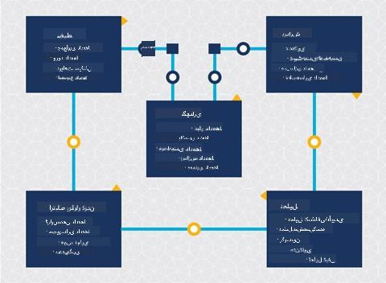
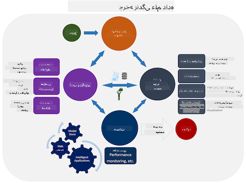
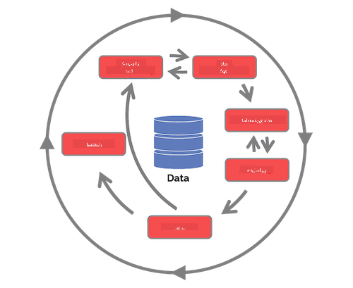

<!--
CO_OP_TRANSLATOR_METADATA:
{
  "original_hash": "07e12a25d20b8f191e3cb651c27fdb2b",
  "translation_date": "2025-09-06T20:22:29+00:00",
  "source_file": "4-Data-Science-Lifecycle/14-Introduction/README.md",
  "language_code": "fa"
}
-->
# معرفی چرخه عمر علم داده

|](../../sketchnotes/14-DataScience-Lifecycle.png)|
|:---:|
| معرفی چرخه عمر علم داده - _طرح توسط [@nitya](https://twitter.com/nitya)_ |

## [پیش‌ آزمون](https://ff-quizzes.netlify.app/en/ds/quiz/26)

تا این مرحله احتمالاً متوجه شده‌اید که علم داده یک فرآیند است. این فرآیند را می‌توان به ۵ مرحله تقسیم کرد:

- جمع‌آوری
- پردازش
- تحلیل
- ارتباط
- نگهداری

این درس بر سه بخش از چرخه عمر تمرکز دارد: جمع‌آوری، پردازش و نگهداری.

  
> عکس از [مدرسه اطلاعات برکلی](https://ischoolonline.berkeley.edu/data-science/what-is-data-science/)

## جمع‌آوری

اولین مرحله چرخه عمر بسیار مهم است زیرا مراحل بعدی به آن وابسته هستند. این مرحله عملاً دو بخش را در یک مرحله ترکیب می‌کند: به دست آوردن داده‌ها و تعریف هدف و مشکلاتی که باید حل شوند.  
تعریف اهداف پروژه نیازمند درک عمیق‌تر از مسئله یا سوال است. ابتدا باید افرادی را شناسایی و به دست آوریم که نیاز به حل مشکل خود دارند. این افراد ممکن است ذینفعان یک کسب‌وکار یا حامیان پروژه باشند که می‌توانند کمک کنند تا مشخص شود چه کسی یا چه چیزی از این پروژه بهره‌مند خواهد شد و چرا به آن نیاز دارند. یک هدف خوب تعریف‌شده باید قابل اندازه‌گیری و کمی باشد تا بتوان نتیجه قابل قبولی را تعریف کرد.

سوالاتی که یک دانشمند داده ممکن است بپرسد:
- آیا این مشکل قبلاً مورد بررسی قرار گرفته است؟ چه چیزی کشف شده است؟
- آیا هدف و منظور برای همه افراد درگیر قابل درک است؟
- آیا ابهامی وجود دارد و چگونه می‌توان آن را کاهش داد؟
- محدودیت‌ها چیست؟
- نتیجه نهایی احتمالاً چگونه خواهد بود؟
- چه مقدار منابع (زمان، افراد، محاسبات) در دسترس است؟

مرحله بعدی شناسایی، جمع‌آوری و در نهایت بررسی داده‌های مورد نیاز برای دستیابی به این اهداف تعریف‌شده است. در این مرحله از جمع‌آوری، دانشمندان داده باید کمیت و کیفیت داده‌ها را نیز ارزیابی کنند. این نیازمند مقداری بررسی داده‌ها است تا تأیید شود که داده‌های جمع‌آوری‌شده به دستیابی به نتیجه مطلوب کمک خواهند کرد.

سوالاتی که یک دانشمند داده ممکن است درباره داده‌ها بپرسد:
- چه داده‌هایی در حال حاضر در دسترس من است؟
- مالک این داده‌ها کیست؟
- نگرانی‌های مربوط به حریم خصوصی چیست؟
- آیا داده کافی برای حل این مشکل دارم؟
- آیا کیفیت داده برای این مشکل قابل قبول است؟
- اگر از طریق این داده‌ها اطلاعات اضافی کشف کنم، آیا باید اهداف را تغییر داده یا دوباره تعریف کنیم؟

## پردازش

مرحله پردازش چرخه عمر بر کشف الگوها در داده‌ها و همچنین مدل‌سازی تمرکز دارد. برخی از تکنیک‌های مورد استفاده در مرحله پردازش نیازمند روش‌های آماری برای کشف الگوها هستند. معمولاً این کار برای انسان با مجموعه داده‌های بزرگ خسته‌کننده خواهد بود و به کامپیوترها برای انجام کارهای سنگین و سرعت بخشیدن به فرآیند متکی خواهد بود. این مرحله همچنین جایی است که علم داده و یادگیری ماشین با یکدیگر تلاقی می‌کنند. همان‌طور که در درس اول یاد گرفتید، یادگیری ماشین فرآیند ساخت مدل‌ها برای درک داده‌ها است. مدل‌ها نمایشی از رابطه بین متغیرهای داده هستند که به پیش‌بینی نتایج کمک می‌کنند.

تکنیک‌های رایج مورد استفاده در این مرحله در برنامه درسی یادگیری ماشین برای مبتدیان پوشش داده شده‌اند. برای یادگیری بیشتر درباره آن‌ها، لینک‌های زیر را دنبال کنید:

- [طبقه‌بندی](https://github.com/microsoft/ML-For-Beginners/tree/main/4-Classification): سازماندهی داده‌ها در دسته‌ها برای استفاده کارآمدتر.
- [خوشه‌بندی](https://github.com/microsoft/ML-For-Beginners/tree/main/5-Clustering): گروه‌بندی داده‌ها در گروه‌های مشابه.
- [رگرسیون](https://github.com/microsoft/ML-For-Beginners/tree/main/2-Regression): تعیین روابط بین متغیرها برای پیش‌بینی یا پیش‌بینی مقادیر.

## نگهداری

در نمودار چرخه عمر، ممکن است متوجه شده باشید که نگهداری بین جمع‌آوری و پردازش قرار دارد. نگهداری یک فرآیند مداوم برای مدیریت، ذخیره و ایمن‌سازی داده‌ها در طول فرآیند یک پروژه است و باید در طول کل پروژه مورد توجه قرار گیرد.

### ذخیره‌سازی داده‌ها

نحوه و محل ذخیره‌سازی داده‌ها می‌تواند بر هزینه ذخیره‌سازی و همچنین عملکرد دسترسی سریع به داده‌ها تأثیر بگذارد. تصمیماتی از این دست احتمالاً تنها توسط یک دانشمند داده گرفته نمی‌شود، اما ممکن است آن‌ها مجبور شوند بر اساس نحوه ذخیره‌سازی داده‌ها، انتخاب‌هایی در مورد نحوه کار با داده‌ها انجام دهند.

در اینجا برخی جنبه‌های سیستم‌های ذخیره‌سازی داده مدرن که می‌توانند این انتخاب‌ها را تحت تأثیر قرار دهند آورده شده است:

**در محل، خارج از محل، یا ابر عمومی و خصوصی**

در محل به معنای میزبانی و مدیریت داده‌ها بر روی تجهیزات خودتان است، مانند داشتن یک سرور با هارد دیسک‌هایی که داده‌ها را ذخیره می‌کنند، در حالی که خارج از محل به تجهیزات متعلق به شما نیست، مانند یک مرکز داده متکی است. ابر عمومی یک انتخاب محبوب برای ذخیره‌سازی داده‌ها است که نیاز به دانش در مورد نحوه یا محل دقیق ذخیره‌سازی داده‌ها ندارد، جایی که عمومی به زیرساخت یکپارچه‌ای اشاره دارد که توسط همه کسانی که از ابر استفاده می‌کنند به اشتراک گذاشته می‌شود. برخی سازمان‌ها سیاست‌های امنیتی سختگیرانه‌ای دارند که نیازمند دسترسی کامل به تجهیزات میزبان داده‌ها هستند و به یک ابر خصوصی که خدمات ابری خود را ارائه می‌دهد، متکی خواهند بود. شما در [درس‌های بعدی](https://github.com/microsoft/Data-Science-For-Beginners/tree/main/5-Data-Science-In-Cloud) بیشتر درباره داده‌ها در ابر یاد خواهید گرفت.

**داده سرد در مقابل داده گرم**

هنگام آموزش مدل‌های خود، ممکن است به داده‌های آموزشی بیشتری نیاز داشته باشید. اگر از مدل خود راضی هستید، داده‌های بیشتری برای خدمت به هدف مدل وارد خواهند شد. در هر صورت، هزینه ذخیره‌سازی و دسترسی به داده‌ها با افزایش حجم آن افزایش خواهد یافت. جدا کردن داده‌هایی که به ندرت استفاده می‌شوند، معروف به داده سرد، از داده‌هایی که به طور مکرر دسترسی دارند، معروف به داده گرم، می‌تواند یک گزینه ذخیره‌سازی داده ارزان‌تر از طریق خدمات سخت‌افزاری یا نرم‌افزاری باشد. اگر نیاز به دسترسی به داده سرد باشد، ممکن است کمی بیشتر طول بکشد تا در مقایسه با داده گرم بازیابی شود.

### مدیریت داده‌ها

هنگام کار با داده‌ها ممکن است متوجه شوید که برخی از داده‌ها نیاز به پاک‌سازی دارند، با استفاده از تکنیک‌هایی که در درس مربوط به [آماده‌سازی داده‌ها](https://github.com/microsoft/Data-Science-For-Beginners/tree/main/2-Working-With-Data/08-data-preparation) پوشش داده شده‌اند، برای ساخت مدل‌های دقیق. هنگامی که داده‌های جدید وارد می‌شوند، نیاز به همان کاربردها برای حفظ کیفیت دارند. برخی پروژه‌ها شامل استفاده از یک ابزار خودکار برای پاک‌سازی، تجمیع و فشرده‌سازی داده‌ها قبل از انتقال آن‌ها به محل نهایی خواهند بود. Azure Data Factory نمونه‌ای از یکی از این ابزارها است.

### ایمن‌سازی داده‌ها

یکی از اهداف اصلی ایمن‌سازی داده‌ها این است که اطمینان حاصل شود کسانی که با داده‌ها کار می‌کنند کنترل کاملی بر آنچه جمع‌آوری شده و در چه زمینه‌ای استفاده می‌شود دارند. حفظ امنیت داده‌ها شامل محدود کردن دسترسی فقط به کسانی است که به آن نیاز دارند، رعایت قوانین و مقررات محلی، و همچنین حفظ استانداردهای اخلاقی، همان‌طور که در درس [اخلاق](https://github.com/microsoft/Data-Science-For-Beginners/tree/main/1-Introduction/02-ethics) پوشش داده شده است.

در اینجا برخی از کارهایی که یک تیم ممکن است با در نظر گرفتن امنیت انجام دهد آورده شده است:
- اطمینان حاصل کنید که تمام داده‌ها رمزگذاری شده‌اند
- به مشتریان اطلاعاتی درباره نحوه استفاده از داده‌هایشان ارائه دهید
- دسترسی به داده‌ها را از کسانی که پروژه را ترک کرده‌اند حذف کنید
- اجازه دهید فقط اعضای خاص پروژه داده‌ها را تغییر دهند

## 🚀 چالش

نسخه‌های مختلفی از چرخه عمر علم داده وجود دارد که هر مرحله ممکن است نام‌ها و تعداد مراحل متفاوتی داشته باشد اما شامل همان فرآیندهای ذکر شده در این درس خواهد بود.

چرخه عمر [فرآیند تیم علم داده](https://docs.microsoft.com/en-us/azure/architecture/data-science-process/lifecycle) و [استاندارد صنعتی برای داده‌کاوی](https://www.datascience-pm.com/crisp-dm-2/) را بررسی کنید. سه شباهت و تفاوت بین این دو را نام ببرید.

|فرآیند تیم علم داده (TDSP)|استاندارد صنعتی برای داده‌کاوی (CRISP-DM)|
|--|--|
| |  |
| تصویر توسط [Microsoft](https://docs.microsoft.comazure/architecture/data-science-process/lifecycle) | تصویر توسط [Data Science Process Alliance](https://www.datascience-pm.com/crisp-dm-2/) |

## [پس‌آزمون](https://ff-quizzes.netlify.app/en/ds/quiz/27)

## مرور و مطالعه خودآموز

اجرای چرخه عمر علم داده شامل نقش‌ها و وظایف متعدد است، جایی که برخی ممکن است بر بخش‌های خاصی از هر مرحله تمرکز کنند. فرآیند تیم علم داده چندین منبع ارائه می‌دهد که انواع نقش‌ها و وظایفی را که ممکن است کسی در یک پروژه داشته باشد توضیح می‌دهد.

* [نقش‌ها و وظایف فرآیند تیم علم داده](https://docs.microsoft.com/en-us/azure/architecture/data-science-process/roles-tasks)  
* [اجرای وظایف علم داده: کاوش، مدل‌سازی و استقرار](https://docs.microsoft.com/en-us/azure/architecture/data-science-process/execute-data-science-tasks)

## تکلیف

[ارزیابی یک مجموعه داده](assignment.md)

---

**سلب مسئولیت**:  
این سند با استفاده از سرویس ترجمه هوش مصنوعی [Co-op Translator](https://github.com/Azure/co-op-translator) ترجمه شده است. در حالی که ما برای دقت تلاش می‌کنیم، لطفاً توجه داشته باشید که ترجمه‌های خودکار ممکن است شامل خطاها یا نادرستی‌هایی باشند. سند اصلی به زبان اصلی آن باید به عنوان منبع معتبر در نظر گرفته شود. برای اطلاعات حساس، ترجمه حرفه‌ای انسانی توصیه می‌شود. ما هیچ مسئولیتی در قبال سوءتفاهم‌ها یا تفسیرهای نادرست ناشی از استفاده از این ترجمه نداریم.