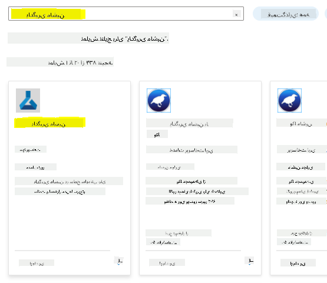
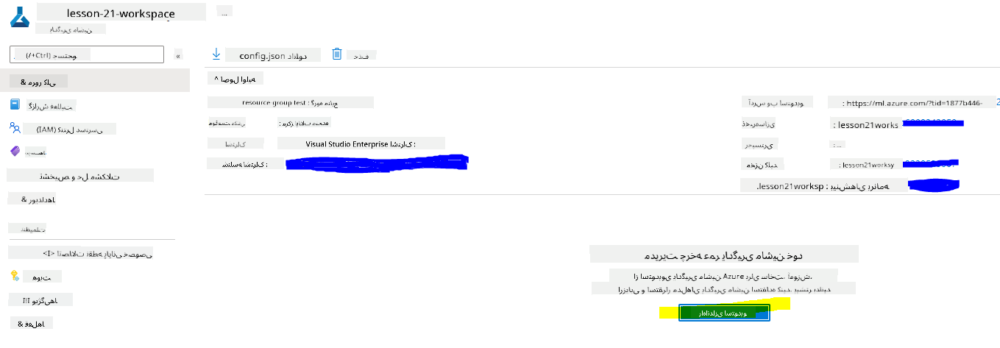
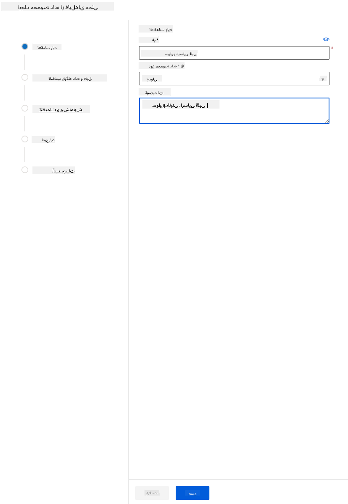

<!--
CO_OP_TRANSLATOR_METADATA:
{
  "original_hash": "39f3b3a9d873eaa522c2e792ce0ca503",
  "translation_date": "2025-09-04T14:18:08+00:00",
  "source_file": "5-Data-Science-In-Cloud/18-Low-Code/README.md",
  "language_code": "fa"
}
-->
# علم داده در فضای ابری: روش "کدنویسی کم/بدون کدنویسی"

|](../../sketchnotes/18-DataScience-Cloud.png)|
|:---:|
| علم داده در فضای ابری: کدنویسی کم - _طرح توسط [@nitya](https://twitter.com/nitya)_ |

فهرست مطالب:

- [علم داده در فضای ابری: روش "کدنویسی کم/بدون کدنویسی"](../../../../5-Data-Science-In-Cloud/18-Low-Code)
  - [آزمون پیش از درس](../../../../5-Data-Science-In-Cloud/18-Low-Code)
  - [1. مقدمه](../../../../5-Data-Science-In-Cloud/18-Low-Code)
    - [1.1 Azure Machine Learning چیست؟](../../../../5-Data-Science-In-Cloud/18-Low-Code)
    - [1.2 پروژه پیش‌بینی نارسایی قلبی:](../../../../5-Data-Science-In-Cloud/18-Low-Code)
    - [1.3 مجموعه داده نارسایی قلبی:](../../../../5-Data-Science-In-Cloud/18-Low-Code)
  - [2. آموزش مدل با کدنویسی کم/بدون کدنویسی در Azure ML Studio](../../../../5-Data-Science-In-Cloud/18-Low-Code)
    - [2.1 ایجاد یک فضای کاری Azure ML](../../../../5-Data-Science-In-Cloud/18-Low-Code)
    - [2.2 منابع محاسباتی](../../../../5-Data-Science-In-Cloud/18-Low-Code)
      - [2.2.1 انتخاب گزینه‌های مناسب برای منابع محاسباتی](../../../../5-Data-Science-In-Cloud/18-Low-Code)
      - [2.2.2 ایجاد یک خوشه محاسباتی](../../../../5-Data-Science-In-Cloud/18-Low-Code)
    - [2.3 بارگذاری مجموعه داده](../../../../5-Data-Science-In-Cloud/18-Low-Code)
    - [2.4 آموزش با کدنویسی کم/بدون کدنویسی با AutoML](../../../../5-Data-Science-In-Cloud/18-Low-Code)
  - [3. استقرار مدل با کدنویسی کم/بدون کدنویسی و مصرف نقطه پایانی](../../../../5-Data-Science-In-Cloud/18-Low-Code)
    - [3.1 استقرار مدل](../../../../5-Data-Science-In-Cloud/18-Low-Code)
    - [3.2 مصرف نقطه پایانی](../../../../5-Data-Science-In-Cloud/18-Low-Code)
  - [🚀 چالش](../../../../5-Data-Science-In-Cloud/18-Low-Code)
  - [آزمون پس از درس](../../../../5-Data-Science-In-Cloud/18-Low-Code)
  - [مرور و مطالعه خودآموز](../../../../5-Data-Science-In-Cloud/18-Low-Code)
  - [تکلیف](../../../../5-Data-Science-In-Cloud/18-Low-Code)

## [آزمون پیش از درس](https://ff-quizzes.netlify.app/en/ds/)

## 1. مقدمه
### 1.1 Azure Machine Learning چیست؟

پلتفرم ابری Azure شامل بیش از 200 محصول و خدمات ابری است که برای کمک به شما در ایجاد راه‌حل‌های جدید طراحی شده‌اند. دانشمندان داده زمان زیادی را صرف بررسی و پیش‌پردازش داده‌ها و آزمایش انواع مختلف الگوریتم‌های آموزش مدل می‌کنند تا مدل‌های دقیقی تولید کنند. این وظایف زمان‌بر هستند و اغلب استفاده ناکارآمدی از سخت‌افزارهای محاسباتی گران‌قیمت دارند.

[Azure ML](https://docs.microsoft.com/azure/machine-learning/overview-what-is-azure-machine-learning?WT.mc_id=academic-77958-bethanycheum&ocid=AID3041109) یک پلتفرم مبتنی بر فضای ابری برای ساخت و اجرای راه‌حل‌های یادگیری ماشین در Azure است. این پلتفرم شامل طیف گسترده‌ای از ویژگی‌ها و قابلیت‌ها است که به دانشمندان داده کمک می‌کند داده‌ها را آماده کنند، مدل‌ها را آموزش دهند، خدمات پیش‌بینی را منتشر کنند و استفاده از آن‌ها را نظارت کنند. مهم‌تر از همه، این پلتفرم با خودکارسازی بسیاری از وظایف زمان‌بر مرتبط با آموزش مدل‌ها، کارایی آن‌ها را افزایش می‌دهد؛ و امکان استفاده از منابع محاسباتی مبتنی بر فضای ابری را فراهم می‌کند که به طور مؤثر مقیاس‌پذیر هستند، حجم زیادی از داده‌ها را مدیریت می‌کنند و فقط زمانی هزینه ایجاد می‌کنند که واقعاً استفاده شوند.

Azure ML تمام ابزارهای مورد نیاز توسعه‌دهندگان و دانشمندان داده را برای جریان‌های کاری یادگیری ماشین فراهم می‌کند. این ابزارها شامل موارد زیر هستند:

- **Azure Machine Learning Studio**: یک پورتال وب در Azure Machine Learning برای گزینه‌های کدنویسی کم و بدون کدنویسی برای آموزش مدل، استقرار، خودکارسازی، ردیابی و مدیریت دارایی‌ها. این استودیو با Azure Machine Learning SDK یکپارچه شده است تا تجربه‌ای یکپارچه ارائه دهد.
- **دفترچه‌های Jupyter**: برای نمونه‌سازی سریع و آزمایش مدل‌های یادگیری ماشین.
- **Azure Machine Learning Designer**: امکان کشیدن و رها کردن ماژول‌ها برای ساخت آزمایش‌ها و سپس استقرار خطوط لوله در محیط کدنویسی کم.
- **رابط کاربری یادگیری ماشین خودکار (AutoML)**: وظایف تکراری توسعه مدل‌های یادگیری ماشین را خودکار می‌کند و امکان ساخت مدل‌های یادگیری ماشین با مقیاس بالا، کارایی و بهره‌وری را فراهم می‌کند، در حالی که کیفیت مدل را حفظ می‌کند.
- **برچسب‌گذاری داده‌ها**: یک ابزار یادگیری ماشین کمکی برای برچسب‌گذاری خودکار داده‌ها.
- **افزونه یادگیری ماشین برای Visual Studio Code**: یک محیط توسعه کامل برای ساخت و مدیریت پروژه‌های یادگیری ماشین فراهم می‌کند.
- **رابط خط فرمان یادگیری ماشین**: دستورات مدیریت منابع Azure ML از طریق خط فرمان را ارائه می‌دهد.
- **یکپارچگی با چارچوب‌های متن‌باز** مانند PyTorch، TensorFlow، Scikit-learn و بسیاری دیگر برای آموزش، استقرار و مدیریت فرآیند یادگیری ماشین از ابتدا تا انتها.
- **MLflow**: یک کتابخانه متن‌باز برای مدیریت چرخه عمر آزمایش‌های یادگیری ماشین شما است. **MLFlow Tracking** یک مؤلفه از MLflow است که معیارهای اجرای آموزش و مصنوعات مدل شما را ثبت و ردیابی می‌کند، صرف‌نظر از محیط آزمایش شما.

### 1.2 پروژه پیش‌بینی نارسایی قلبی:

بدون شک ساخت و ایجاد پروژه‌ها بهترین راه برای آزمایش مهارت‌ها و دانش شما است. در این درس، ما دو روش مختلف برای ساخت یک پروژه علم داده برای پیش‌بینی حملات نارسایی قلبی در Azure ML Studio را بررسی خواهیم کرد: از طریق کدنویسی کم/بدون کدنویسی و از طریق Azure ML SDK، همان‌طور که در نمودار زیر نشان داده شده است:


هر روش مزایا و معایب خاص خود را دارد. روش کدنویسی کم/بدون کدنویسی شروع آسان‌تری دارد زیرا شامل تعامل با یک رابط کاربری گرافیکی (GUI) است و نیازی به دانش قبلی کدنویسی ندارد. این روش امکان آزمایش سریع قابلیت پروژه و ایجاد نمونه اولیه (POC) را فراهم می‌کند. با این حال، با رشد پروژه و نیاز به آماده‌سازی برای تولید، ایجاد منابع از طریق GUI عملی نیست. ما باید همه چیز را به صورت برنامه‌ریزی شده خودکار کنیم، از ایجاد منابع گرفته تا استقرار مدل. اینجاست که دانستن نحوه استفاده از Azure ML SDK اهمیت پیدا می‌کند.

|                   | کدنویسی کم/بدون کدنویسی | Azure ML SDK              |
|-------------------|--------------------------|---------------------------|
| تخصص در کدنویسی  | لازم نیست                | لازم است                  |
| زمان توسعه        | سریع و آسان             | بستگی به تخصص کدنویسی دارد|
| آماده برای تولید | خیر                      | بله                       |

### 1.3 مجموعه داده نارسایی قلبی:

بیماری‌های قلبی عروقی (CVDs) علت شماره 1 مرگ و میر در سراسر جهان هستند و 31٪ از کل مرگ و میرهای جهانی را تشکیل می‌دهند. عوامل خطر محیطی و رفتاری مانند استفاده از تنباکو، رژیم غذایی ناسالم و چاقی، فعالیت بدنی کم و مصرف مضر الکل می‌توانند به عنوان ویژگی‌هایی برای مدل‌های تخمینی استفاده شوند. توانایی تخمین احتمال توسعه یک بیماری قلبی عروقی می‌تواند برای جلوگیری از حملات در افراد پرخطر بسیار مفید باشد.

Kaggle یک [مجموعه داده نارسایی قلبی](https://www.kaggle.com/andrewmvd/heart-failure-clinical-data) را به صورت عمومی در دسترس قرار داده است که ما قصد داریم از آن برای این پروژه استفاده کنیم. شما می‌توانید این مجموعه داده را اکنون دانلود کنید. این مجموعه داده جدولی شامل 13 ستون (12 ویژگی و 1 متغیر هدف) و 299 ردیف است.

|    | نام متغیر                 | نوع            | توضیحات                                               | مثال              |
|----|---------------------------|-----------------|-------------------------------------------------------|-------------------|
| 1  | age                       | عددی            | سن بیمار                                              | 25                |
| 2  | anaemia                   | بولی            | کاهش گلبول‌های قرمز یا هموگلوبین                     | 0 یا 1            |
| 3  | creatinine_phosphokinase  | عددی            | سطح آنزیم CPK در خون                                  | 542               |
| 4  | diabetes                  | بولی            | آیا بیمار دیابت دارد                                 | 0 یا 1            |
| 5  | ejection_fraction         | عددی            | درصد خون خارج شده از قلب در هر انقباض                | 45                |
| 6  | high_blood_pressure       | بولی            | آیا بیمار فشار خون بالا دارد                         | 0 یا 1            |
| 7  | platelets                 | عددی            | پلاکت‌ها در خون                                       | 149000            |
| 8  | serum_creatinine          | عددی            | سطح کراتینین سرم در خون                              | 0.5               |
| 9  | serum_sodium              | عددی            | سطح سدیم سرم در خون                                  | jun               |
| 10 | sex                       | بولی            | زن یا مرد                                             | 0 یا 1            |
| 11 | smoking                   | بولی            | آیا بیمار سیگار می‌کشد                               | 0 یا 1            |
| 12 | time                      | عددی            | دوره پیگیری (روزها)                                  | 4                 |
|----|---------------------------|-----------------|-------------------------------------------------------|-------------------|
| 21 | DEATH_EVENT [هدف]         | بولی            | آیا بیمار در دوره پیگیری فوت می‌کند                  | 0 یا 1            |

پس از دریافت مجموعه داده، می‌توانیم پروژه را در Azure شروع کنیم.

## 2. آموزش مدل با کدنویسی کم/بدون کدنویسی در Azure ML Studio
### 2.1 ایجاد یک فضای کاری Azure ML
برای آموزش یک مدل در Azure ML ابتدا باید یک فضای کاری Azure ML ایجاد کنید. فضای کاری منبع سطح بالای Azure Machine Learning است که مکانی مرکزی برای کار با تمام مصنوعات ایجاد شده هنگام استفاده از Azure Machine Learning فراهم می‌کند. فضای کاری تاریخچه تمام اجرای‌های آموزشی، شامل گزارش‌ها، معیارها، خروجی‌ها و یک عکس فوری از اسکریپت‌های شما را نگه می‌دارد. شما از این اطلاعات برای تعیین اینکه کدام اجرای آموزشی بهترین مدل را تولید می‌کند استفاده می‌کنید. [بیشتر بدانید](https://docs.microsoft.com/azure/machine-learning/concept-workspace?WT.mc_id=academic-77958-bethanycheum&ocid=AID3041109)

توصیه می‌شود از مرورگر به‌روز و سازگار با سیستم‌عامل خود استفاده کنید. مرورگرهای زیر پشتیبانی می‌شوند:

- Microsoft Edge (نسخه جدید Microsoft Edge، آخرین نسخه. نه Microsoft Edge legacy)
- Safari (آخرین نسخه، فقط Mac)
- Chrome (آخرین نسخه)
- Firefox (آخرین نسخه)

برای استفاده از Azure Machine Learning، یک فضای کاری در اشتراک Azure خود ایجاد کنید. سپس می‌توانید از این فضای کاری برای مدیریت داده‌ها، منابع محاسباتی، کد، مدل‌ها و سایر مصنوعات مرتبط با بارهای کاری یادگیری ماشین خود استفاده کنید.

> **_توجه:_** اشتراک Azure شما برای ذخیره داده‌ها هزینه کمی دریافت خواهد کرد تا زمانی که فضای کاری Azure Machine Learning در اشتراک شما وجود داشته باشد، بنابراین توصیه می‌کنیم فضای کاری Azure Machine Learning را زمانی که دیگر از آن استفاده نمی‌کنید حذف کنید.

1. وارد [پرتال Azure](https://ms.portal.azure.com/) شوید و از اعتبار Microsoft مرتبط با اشتراک Azure خود استفاده کنید.
2. گزینه **＋ایجاد یک منبع** را انتخاب کنید.
   
   

   جستجو کنید Machine Learning و کاشی Machine Learning را انتخاب کنید.

   

   دکمه ایجاد را کلیک کنید.

   

   تنظیمات را به صورت زیر پر کنید:
   - اشتراک: اشتراک Azure شما
   - گروه منابع: ایجاد یا انتخاب یک گروه منابع
   - نام فضای کاری: یک نام منحصر به فرد برای فضای کاری خود وارد کنید
   - منطقه: منطقه جغرافیایی نزدیک به شما را انتخاب کنید
   - حساب ذخیره‌سازی: توجه به حساب ذخیره‌سازی جدیدی که برای فضای کاری شما ایجاد خواهد شد
   - کلید خزانه: توجه به کلید خزانه جدیدی که برای فضای کاری شما ایجاد خواهد شد
   - بینش‌های برنامه: توجه به منبع جدید بینش‌های برنامه که برای فضای کاری شما ایجاد خواهد شد
   - رجیستری کانتینر: هیچ (یکی به طور خودکار اولین بار که یک مدل را به کانتینر مستقر می‌کنید ایجاد خواهد شد)

    

   - دکمه ایجاد + بررسی را کلیک کنید و سپس دکمه ایجاد را فشار دهید.
3. منتظر بمانید تا فضای کاری شما ایجاد شود (این ممکن است چند دقیقه طول بکشد). سپس به آن در پرتال بروید. می‌توانید آن را از طریق سرویس Azure Machine Learning پیدا کنید.
4. در صفحه نمای کلی فضای کاری خود، Azure Machine Learning studio را راه‌اندازی کنید (یا یک تب جدید مرورگر باز کنید و به https://ml.azure.com بروید)، و وارد Azure Machine Learning studio شوید و از حساب Microsoft خود استفاده کنید. اگر درخواست شد، دایرکتوری و اشتراک Azure خود و فضای کاری Azure Machine Learning خود را انتخاب کنید.
   


5. در Azure Machine Learning studio، نماد ☰ در بالا سمت چپ را تغییر دهید تا صفحات مختلف در رابط کاربری را مشاهده کنید. می‌توانید از این صفحات برای مدیریت منابع در فضای کاری خود استفاده کنید.


شما می‌توانید فضای کاری خود را با استفاده از پرتال Azure مدیریت کنید، اما برای دانشمندان داده و مهندسان عملیات یادگیری ماشین، Azure Machine Learning Studio یک رابط کاربری متمرکزتر برای مدیریت منابع فضای کاری فراهم می‌کند.

### 2.2 منابع محاسباتی

منابع محاسباتی منابع مبتنی بر فضای ابری هستند که می‌توانید فرآیندهای آموزش مدل و بررسی داده‌ها را روی آن‌ها اجرا کنید. چهار نوع منبع محاسباتی وجود دارد که می‌توانید ایجاد کنید:

- **نمونه‌های محاسباتی**: ایستگاه‌های کاری توسعه که دانشمندان داده می‌توانند برای کار با داده‌ها و مدل‌ها استفاده کنند. این شامل ایجاد یک ماشین مجازی (VM) و راه‌اندازی یک نمونه دفترچه است. سپس می‌توانید یک مدل را با فراخوانی یک خوشه محاسباتی از دفترچه آموزش دهید.
- **خوشه‌های محاسباتی**: خوشه‌های مقیاس‌پذیر ماشین‌های مجازی برای پردازش کد آزمایش به صورت درخواستی. شما به آن نیاز خواهید داشت زمانی که یک مدل را آموزش می‌دهید. خوشه‌های محاسباتی همچنین می‌توانند از منابع تخصصی GPU یا CPU استفاده کنند.
- **خوشه‌های استنتاج**: اهداف استقرار برای خدمات پیش‌بینی که از مدل‌های آموزش‌دیده شما استفاده می‌کنند.
- **اتصال به منابع محاسباتی**: لینک‌دهی به منابع محاسباتی موجود در Azure، مانند ماشین‌های مجازی یا کلاسترهای Azure Databricks.

#### 2.2.1 انتخاب گزینه‌های مناسب برای منابع محاسباتی

برخی عوامل کلیدی وجود دارند که هنگام ایجاد یک منبع محاسباتی باید در نظر گرفته شوند و این انتخاب‌ها می‌توانند تصمیمات حیاتی باشند.

**آیا به CPU نیاز دارید یا GPU؟**

یک CPU (واحد پردازش مرکزی) مداری الکترونیکی است که دستورالعمل‌های یک برنامه کامپیوتری را اجرا می‌کند. یک GPU (واحد پردازش گرافیکی) مداری تخصصی است که می‌تواند کدهای مرتبط با گرافیک را با سرعت بسیار بالا اجرا کند.

تفاوت اصلی بین معماری CPU و GPU این است که CPU برای انجام سریع طیف گسترده‌ای از وظایف طراحی شده است (که با سرعت کلاک CPU اندازه‌گیری می‌شود)، اما در تعداد وظایف همزمان محدود است. GPU‌ها برای محاسبات موازی طراحی شده‌اند و بنابراین برای وظایف یادگیری عمیق بسیار بهتر هستند.

| CPU                                     | GPU                         |
|-----------------------------------------|-----------------------------|
| ارزان‌تر                                | گران‌تر                    |
| سطح همزمانی پایین‌تر                   | سطح همزمانی بالاتر         |
| کندتر در آموزش مدل‌های یادگیری عمیق     | بهینه برای یادگیری عمیق     |

**اندازه کلاستر**

کلاسترهای بزرگ‌تر گران‌تر هستند اما پاسخگویی بهتری ارائه می‌دهند. بنابراین، اگر زمان دارید اما بودجه کافی ندارید، باید با یک کلاستر کوچک شروع کنید. برعکس، اگر بودجه دارید اما زمان کمی دارید، باید با یک کلاستر بزرگ‌تر شروع کنید.

**اندازه ماشین مجازی (VM Size)**

بسته به محدودیت‌های زمانی و بودجه‌ای خود، می‌توانید اندازه RAM، دیسک، تعداد هسته‌ها و سرعت کلاک را تغییر دهید. افزایش این پارامترها هزینه بیشتری خواهد داشت، اما عملکرد بهتری ارائه می‌دهد.

**نمونه‌های اختصاصی یا با اولویت پایین؟**

یک نمونه با اولویت پایین به این معناست که قابل قطع شدن است: اساساً، Microsoft Azure می‌تواند این منابع را گرفته و به کار دیگری اختصاص دهد، بنابراین یک کار را متوقف کند. یک نمونه اختصاصی یا غیرقابل قطع به این معناست که کار بدون اجازه شما هرگز متوقف نخواهد شد.  
این نیز یکی دیگر از ملاحظات زمان در مقابل هزینه است، زیرا نمونه‌های قابل قطع ارزان‌تر از نمونه‌های اختصاصی هستند.

#### 2.2.2 ایجاد یک کلاستر محاسباتی

در [محیط کاری Azure ML](https://ml.azure.com/) که قبلاً ایجاد کردیم، به بخش Compute بروید و می‌توانید منابع محاسباتی مختلفی که قبلاً بحث کردیم (مانند Compute Instances، Compute Clusters، Inference Clusters و Attached Compute) را مشاهده کنید. برای این پروژه، ما به یک کلاستر محاسباتی برای آموزش مدل نیاز داریم. در Studio، روی منوی "Compute" کلیک کنید، سپس تب "Compute cluster" را انتخاب کرده و روی دکمه "+ New" کلیک کنید تا یک کلاستر محاسباتی ایجاد کنید.


1. گزینه‌های خود را انتخاب کنید: اختصاصی یا با اولویت پایین، CPU یا GPU، اندازه ماشین مجازی و تعداد هسته‌ها (می‌توانید تنظیمات پیش‌فرض را برای این پروژه نگه دارید).  
2. روی دکمه Next کلیک کنید.


3. یک نام برای کلاستر انتخاب کنید.  
4. گزینه‌های خود را انتخاب کنید: حداقل/حداکثر تعداد نودها، ثانیه‌های بیکار قبل از کاهش مقیاس، دسترسی SSH. توجه داشته باشید که اگر حداقل تعداد نودها 0 باشد، در زمان بیکار بودن کلاستر، هزینه‌ای صرفه‌جویی می‌شود. همچنین توجه داشته باشید که هرچه تعداد نودهای حداکثر بیشتر باشد، آموزش کوتاه‌تر خواهد بود. تعداد حداکثر نودهای پیشنهادی 3 است.  
5. روی دکمه "Create" کلیک کنید. این مرحله ممکن است چند دقیقه طول بکشد.


عالی! حالا که یک کلاستر محاسباتی داریم، باید داده‌ها را به Azure ML Studio بارگذاری کنیم.

### 2.3 بارگذاری مجموعه داده

1. در [محیط کاری Azure ML](https://ml.azure.com/) که قبلاً ایجاد کردیم، روی "Datasets" در منوی سمت چپ کلیک کنید و روی دکمه "+ Create dataset" کلیک کنید تا یک مجموعه داده ایجاد کنید. گزینه "From local files" را انتخاب کرده و مجموعه داده Kaggle که قبلاً دانلود کردیم را انتخاب کنید.

   

2. به مجموعه داده خود یک نام، نوع و توضیح بدهید. روی Next کلیک کنید. داده‌ها را از فایل‌ها آپلود کنید. روی Next کلیک کنید.

   

3. در بخش Schema، نوع داده را برای ویژگی‌های زیر به Boolean تغییر دهید: anaemia، diabetes، high blood pressure، sex، smoking، و DEATH_EVENT. روی Next کلیک کنید و سپس روی Create کلیک کنید.

   

عالی! حالا که مجموعه داده در جای خود قرار دارد و کلاستر محاسباتی ایجاد شده است، می‌توانیم آموزش مدل را شروع کنیم!

### 2.4 آموزش بدون کدنویسی یا با کدنویسی کم با AutoML

توسعه مدل‌های سنتی یادگیری ماشین منابع زیادی مصرف می‌کند، نیاز به دانش تخصصی دارد و زمان زیادی برای تولید و مقایسه ده‌ها مدل می‌طلبد.  
یادگیری ماشین خودکار (AutoML) فرآیند خودکارسازی وظایف تکراری و زمان‌بر توسعه مدل‌های یادگیری ماشین است. این فرآیند به دانشمندان داده، تحلیل‌گران و توسعه‌دهندگان اجازه می‌دهد مدل‌های یادگیری ماشین را با مقیاس، کارایی و بهره‌وری بالا ایجاد کنند، در حالی که کیفیت مدل حفظ می‌شود. این فرآیند زمان لازم برای تولید مدل‌های آماده تولید را کاهش می‌دهد و با سهولت و کارایی بالا انجام می‌شود. [بیشتر بخوانید](https://docs.microsoft.com/azure/machine-learning/concept-automated-ml?WT.mc_id=academic-77958-bethanycheum&ocid=AID3041109)

1. در [محیط کاری Azure ML](https://ml.azure.com/) که قبلاً ایجاد کردیم، روی "Automated ML" در منوی سمت چپ کلیک کنید و مجموعه داده‌ای که به‌تازگی آپلود کردید را انتخاب کنید. روی Next کلیک کنید.

   

2. یک نام جدید برای آزمایش وارد کنید، ستون هدف (DEATH_EVENT) و کلاستر محاسباتی که ایجاد کردیم را انتخاب کنید. روی Next کلیک کنید.

   

3. "Classification" را انتخاب کنید و روی Finish کلیک کنید. این مرحله ممکن است بین 30 دقیقه تا 1 ساعت طول بکشد، بسته به اندازه کلاستر محاسباتی شما.

   

4. پس از اتمام اجرا، روی تب "Automated ML" کلیک کنید، روی اجرای خود کلیک کنید و روی الگوریتم در کارت "Best model summary" کلیک کنید.

   

در اینجا می‌توانید توضیحات دقیقی از بهترین مدلی که AutoML تولید کرده است مشاهده کنید. همچنین می‌توانید مدل‌های دیگر تولید شده را در تب Models بررسی کنید. چند دقیقه وقت بگذارید تا مدل‌ها را در بخش Explanations (پیش‌نمایش) بررسی کنید. پس از انتخاب مدلی که می‌خواهید استفاده کنید (در اینجا ما بهترین مدل انتخاب شده توسط AutoML را انتخاب می‌کنیم)، خواهیم دید که چگونه می‌توان آن را مستقر کرد.

## 3. استقرار مدل بدون کدنویسی یا با کدنویسی کم و مصرف نقطه پایانی
### 3.1 استقرار مدل

رابط کاربری یادگیری ماشین خودکار به شما اجازه می‌دهد بهترین مدل را به‌عنوان یک سرویس وب در چند مرحله مستقر کنید. استقرار به معنای یکپارچه‌سازی مدل است تا بتواند بر اساس داده‌های جدید پیش‌بینی کند و مناطق بالقوه فرصت را شناسایی کند. برای این پروژه، استقرار به‌عنوان یک سرویس وب به این معناست که برنامه‌های پزشکی می‌توانند مدل را مصرف کنند تا پیش‌بینی‌های زنده‌ای از خطر حمله قلبی بیماران خود داشته باشند.

در توضیحات بهترین مدل، روی دکمه "Deploy" کلیک کنید.


15. به آن یک نام، توضیح، نوع محاسباتی (Azure Container Instance) بدهید، احراز هویت را فعال کنید و روی Deploy کلیک کنید. این مرحله ممکن است حدود 20 دقیقه طول بکشد. فرآیند استقرار شامل چندین مرحله است، از جمله ثبت مدل، ایجاد منابع و پیکربندی آن‌ها برای سرویس وب. یک پیام وضعیت در زیر Deploy status ظاهر می‌شود. برای بررسی وضعیت استقرار، به‌طور دوره‌ای روی Refresh کلیک کنید. زمانی که وضعیت "Healthy" باشد، مدل مستقر شده و در حال اجرا است.


16. پس از استقرار، روی تب Endpoint کلیک کنید و روی نقطه پایانی که به‌تازگی مستقر کردید کلیک کنید. در اینجا می‌توانید تمام جزئیاتی که باید درباره نقطه پایانی بدانید را پیدا کنید.


شگفت‌انگیز! حالا که یک مدل مستقر شده داریم، می‌توانیم مصرف نقطه پایانی را شروع کنیم.

### 3.2 مصرف نقطه پایانی

روی تب "Consume" کلیک کنید. در اینجا می‌توانید نقطه پایانی REST و یک اسکریپت پایتون را در گزینه مصرف پیدا کنید. کمی وقت بگذارید و کد پایتون را بخوانید.

این اسکریپت می‌تواند مستقیماً از ماشین محلی شما اجرا شود و نقطه پایانی شما را مصرف کند.


کمی وقت بگذارید و این دو خط کد را بررسی کنید:

```python
url = 'http://98e3715f-xxxx-xxxx-xxxx-9ec22d57b796.centralus.azurecontainer.io/score'
api_key = '' # Replace this with the API key for the web service
```  
متغیر `url` نقطه پایانی REST است که در تب مصرف یافت می‌شود و متغیر `api_key` کلید اصلی است که در تب مصرف نیز یافت می‌شود (فقط در صورتی که احراز هویت را فعال کرده باشید). این همان چیزی است که اسکریپت برای مصرف نقطه پایانی استفاده می‌کند.

18. با اجرای اسکریپت، باید خروجی زیر را ببینید:  
    ```python
    b'"{\\"result\\": [true]}"'
    ```  
این به این معناست که پیش‌بینی نارسایی قلبی برای داده‌های داده شده درست است. این منطقی است زیرا اگر به داده‌هایی که به‌طور خودکار در اسکریپت تولید شده‌اند نگاه کنید، همه چیز به‌طور پیش‌فرض 0 و false است. می‌توانید داده‌ها را با نمونه ورودی زیر تغییر دهید:

```python
data = {
    "data":
    [
        {
            'age': "0",
            'anaemia': "false",
            'creatinine_phosphokinase': "0",
            'diabetes': "false",
            'ejection_fraction': "0",
            'high_blood_pressure': "false",
            'platelets': "0",
            'serum_creatinine': "0",
            'serum_sodium': "0",
            'sex': "false",
            'smoking': "false",
            'time': "0",
        },
        {
            'age': "60",
            'anaemia': "false",
            'creatinine_phosphokinase': "500",
            'diabetes': "false",
            'ejection_fraction': "38",
            'high_blood_pressure': "false",
            'platelets': "260000",
            'serum_creatinine': "1.40",
            'serum_sodium': "137",
            'sex': "false",
            'smoking': "false",
            'time': "130",
        },
    ],
}
```  
اسکریپت باید این مقدار را برگرداند:  
    ```python
    b'"{\\"result\\": [true, false]}"'
    ```  

تبریک می‌گویم! شما به‌تازگی مدل مستقر شده را مصرف کردید و آن را در Azure ML آموزش دادید!

> **_توجه:_** پس از اتمام پروژه، فراموش نکنید که تمام منابع را حذف کنید.

## 🚀 چالش

به توضیحات و جزئیاتی که AutoML برای مدل‌های برتر تولید کرده است، با دقت نگاه کنید. سعی کنید بفهمید چرا بهترین مدل بهتر از مدل‌های دیگر است. چه الگوریتم‌هایی مقایسه شدند؟ تفاوت‌های آن‌ها چیست؟ چرا بهترین مدل در این مورد عملکرد بهتری دارد؟

## [آزمون پس از درس](https://ff-quizzes.netlify.app/en/ds/)

## مرور و مطالعه شخصی

در این درس، یاد گرفتید که چگونه یک مدل را برای پیش‌بینی خطر نارسایی قلبی به‌صورت بدون کدنویسی یا با کدنویسی کم در فضای ابری آموزش دهید، مستقر کنید و مصرف کنید. اگر هنوز این کار را نکرده‌اید، به توضیحات مدل‌هایی که AutoML برای مدل‌های برتر تولید کرده است عمیق‌تر نگاه کنید و سعی کنید بفهمید چرا بهترین مدل بهتر از دیگران است.

می‌توانید با خواندن این [مستندات](https://docs.microsoft.com/azure/machine-learning/tutorial-first-experiment-automated-ml?WT.mc_id=academic-77958-bethanycheum&ocid=AID3041109) بیشتر درباره AutoML بدون کدنویسی یا با کدنویسی کم اطلاعات کسب کنید.

## تکلیف

[پروژه داده‌کاوی بدون کدنویسی یا با کدنویسی کم در Azure ML](assignment.md)

---

**سلب مسئولیت**:  
این سند با استفاده از سرویس ترجمه هوش مصنوعی [Co-op Translator](https://github.com/Azure/co-op-translator) ترجمه شده است. در حالی که ما برای دقت تلاش می‌کنیم، لطفاً توجه داشته باشید که ترجمه‌های خودکار ممکن است شامل خطاها یا نادرستی‌هایی باشند. سند اصلی به زبان اصلی آن باید به عنوان منبع معتبر در نظر گرفته شود. برای اطلاعات حساس، ترجمه حرفه‌ای انسانی توصیه می‌شود. ما هیچ مسئولیتی در قبال سوءتفاهم‌ها یا تفسیرهای نادرست ناشی از استفاده از این ترجمه نداریم.