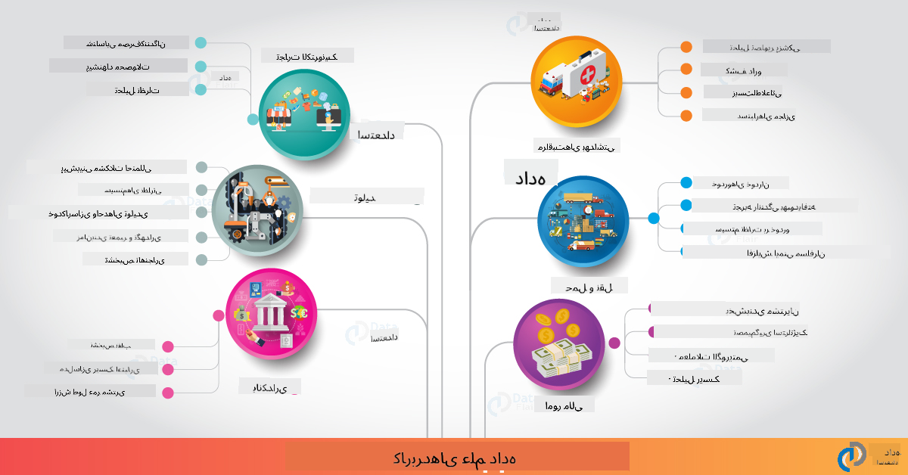

<!--
CO_OP_TRANSLATOR_METADATA:
{
  "original_hash": "f95679140c7cb39c30ccba535cd8f03f",
  "translation_date": "2025-09-04T14:32:45+00:00",
  "source_file": "6-Data-Science-In-Wild/20-Real-World-Examples/README.md",
  "language_code": "fa"
}
-->
# علم داده در دنیای واقعی

|  ](../../sketchnotes/20-DataScience-RealWorld.png) |
| :--------------------------------------------------------------------------------------------------------------: |
|               علم داده در دنیای واقعی - _Sketchnote by [@nitya](https://twitter.com/nitya)_               |

ما تقریباً به پایان این مسیر یادگیری رسیده‌ایم!

ما با تعریف‌های علم داده و اخلاق شروع کردیم، ابزارها و تکنیک‌های مختلف برای تحلیل و مصورسازی داده‌ها را بررسی کردیم، چرخه عمر علم داده را مرور کردیم و به مقیاس‌پذیری و خودکارسازی جریان‌های کاری علم داده با خدمات رایانش ابری پرداختیم. بنابراین، احتمالاً از خود می‌پرسید: _"چطور می‌توانم همه این یادگیری‌ها را به زمینه‌های دنیای واقعی مرتبط کنم؟"_

در این درس، کاربردهای واقعی علم داده در صنعت را بررسی می‌کنیم و به مثال‌های خاص در زمینه‌های تحقیق، علوم انسانی دیجیتال و پایداری می‌پردازیم. همچنین فرصت‌های پروژه‌های دانشجویی را مرور کرده و با منابع مفیدی برای ادامه مسیر یادگیری شما به پایان می‌رسیم!

## آزمون پیش از درس

[آزمون پیش از درس](https://ff-quizzes.netlify.app/en/ds/)

## علم داده + صنعت

با دموکراتیزه شدن هوش مصنوعی، توسعه‌دهندگان اکنون راحت‌تر می‌توانند تصمیم‌گیری‌های مبتنی بر هوش مصنوعی و بینش‌های مبتنی بر داده را در تجربه‌های کاربری و جریان‌های کاری توسعه ادغام کنند. در اینجا چند مثال از نحوه "کاربرد" علم داده در دنیای واقعی در صنعت آورده شده است:

 * [Google Flu Trends](https://www.wired.com/2015/10/can-learn-epic-failure-google-flu-trends/) از علم داده برای ارتباط دادن اصطلاحات جستجو با روندهای آنفولانزا استفاده کرد. اگرچه این روش دارای نقص‌هایی بود، اما آگاهی از امکانات (و چالش‌های) پیش‌بینی‌های بهداشتی مبتنی بر داده را افزایش داد.

 * [پیش‌بینی مسیرهای UPS](https://www.technologyreview.com/2018/11/21/139000/how-ups-uses-ai-to-outsmart-bad-weather/) - توضیح می‌دهد که چگونه UPS از علم داده و یادگیری ماشین برای پیش‌بینی مسیرهای بهینه برای تحویل استفاده می‌کند، با در نظر گرفتن شرایط آب و هوایی، الگوهای ترافیکی، مهلت‌های تحویل و موارد دیگر.

 * [مصورسازی مسیرهای تاکسی‌های NYC](http://chriswhong.github.io/nyctaxi/) - داده‌های جمع‌آوری‌شده با استفاده از [قوانین آزادی اطلاعات](https://chriswhong.com/open-data/foil_nyc_taxi/) به مصورسازی یک روز از زندگی تاکسی‌های NYC کمک کرد، و به ما نشان داد که چگونه در شهر شلوغ حرکت می‌کنند، چقدر درآمد دارند و مدت زمان سفرها در هر دوره ۲۴ ساعته چقدر است.

 * [محیط کار علم داده Uber](https://eng.uber.com/dsw/) - از داده‌های جمع‌آوری‌شده از میلیون‌ها سفر روزانه Uber (مانند مکان‌های سوار شدن و پیاده شدن، مدت زمان سفر، مسیرهای ترجیحی و غیره) برای ساخت ابزار تحلیل داده استفاده می‌کند که به تصمیم‌گیری‌های مربوط به قیمت‌گذاری، ایمنی، تشخیص تقلب و مسیریابی کمک می‌کند.

 * [تحلیل‌های ورزشی](https://towardsdatascience.com/scope-of-analytics-in-sports-world-37ed09c39860) - بر تحلیل‌های پیش‌بینی‌کننده (تحلیل تیم و بازیکن - مانند [Moneyball](https://datasciencedegree.wisconsin.edu/blog/moneyball-proves-importance-big-data-big-ideas/) - و مدیریت طرفداران) و مصورسازی داده‌ها (داشبوردهای تیم و طرفداران، بازی‌ها و غیره) تمرکز دارد، با کاربردهایی مانند استعدادیابی، شرط‌بندی ورزشی و مدیریت موجودی/مکان.

 * [علم داده در بانکداری](https://data-flair.training/blogs/data-science-in-banking/) - ارزش علم داده در صنعت مالی را با کاربردهایی از مدل‌سازی ریسک و تشخیص تقلب گرفته تا تقسیم‌بندی مشتریان، پیش‌بینی‌های لحظه‌ای و سیستم‌های توصیه‌کننده برجسته می‌کند. تحلیل‌های پیش‌بینی‌کننده همچنین اقدامات حیاتی مانند [امتیازات اعتباری](https://dzone.com/articles/using-big-data-and-predictive-analytics-for-credit) را هدایت می‌کنند.

 * [علم داده در مراقبت‌های بهداشتی](https://data-flair.training/blogs/data-science-in-healthcare/) - کاربردهایی مانند تصویربرداری پزشکی (مانند MRI، اشعه ایکس، سی‌تی‌اسکن)، ژنومیک (توالی‌یابی DNA)، توسعه دارو (ارزیابی ریسک، پیش‌بینی موفقیت)، تحلیل‌های پیش‌بینی‌کننده (مراقبت از بیمار و لجستیک تأمین)، ردیابی و پیشگیری بیماری و غیره را برجسته می‌کند.

 اعتبار تصویر: [Data Flair: 6 Amazing Data Science Applications ](https://data-flair.training/blogs/data-science-applications/)

این شکل حوزه‌ها و مثال‌های دیگری برای کاربرد تکنیک‌های علم داده را نشان می‌دهد. آیا می‌خواهید کاربردهای دیگری را بررسی کنید؟ بخش [مرور و مطالعه خود](../../../../6-Data-Science-In-Wild/20-Real-World-Examples) را در زیر ببینید.

## علم داده + تحقیق

|  ](../../sketchnotes/20-DataScience-Research.png) |
| :---------------------------------------------------------------------------------------------------------------: |
|              علم داده و تحقیق - _Sketchnote by [@nitya](https://twitter.com/nitya)_              |

در حالی که کاربردهای دنیای واقعی اغلب بر موارد استفاده صنعتی در مقیاس بزرگ تمرکز دارند، کاربردها و پروژه‌های تحقیقاتی می‌توانند از دو منظر مفید باشند:

* _فرصت‌های نوآوری_ - بررسی نمونه‌سازی سریع مفاهیم پیشرفته و آزمایش تجربه‌های کاربری برای کاربردهای نسل بعدی.
* _چالش‌های استقرار_ - تحقیق در مورد آسیب‌های احتمالی یا پیامدهای ناخواسته فناوری‌های علم داده در زمینه‌های دنیای واقعی.

برای دانشجویان، این پروژه‌های تحقیقاتی می‌توانند فرصت‌های یادگیری و همکاری فراهم کنند که درک شما از موضوع را بهبود می‌بخشند و آگاهی و تعامل شما با افراد یا تیم‌های مرتبط در حوزه‌های مورد علاقه را گسترش می‌دهند. پس پروژه‌های تحقیقاتی چگونه به نظر می‌رسند و چگونه می‌توانند تأثیرگذار باشند؟

بیایید یک مثال را بررسی کنیم - [مطالعه Gender Shades MIT](http://gendershades.org/overview.html) از Joy Buolamwini (آزمایشگاه‌های رسانه‌ای MIT) با یک [مقاله تحقیقاتی برجسته](http://proceedings.mlr.press/v81/buolamwini18a/buolamwini18a.pdf) که با همکاری Timnit Gebru (در آن زمان در Microsoft Research) نوشته شده است و بر موارد زیر تمرکز دارد:

 * **چه چیزی:** هدف پروژه تحقیقاتی _ارزیابی تعصب موجود در الگوریتم‌ها و مجموعه داده‌های تحلیل خودکار چهره_ بر اساس جنسیت و نوع پوست بود.
 * **چرا:** تحلیل چهره در زمینه‌هایی مانند اجرای قانون، امنیت فرودگاه، سیستم‌های استخدام و موارد دیگر استفاده می‌شود - زمینه‌هایی که طبقه‌بندی‌های نادرست (مثلاً به دلیل تعصب) می‌توانند آسیب‌های اقتصادی و اجتماعی بالقوه‌ای به افراد یا گروه‌های تحت تأثیر وارد کنند. درک (و حذف یا کاهش) تعصب‌ها کلید عدالت در استفاده است.
 * **چگونه:** محققان تشخیص دادند که معیارهای موجود عمدتاً از افراد با پوست روشن‌تر استفاده می‌کنند و یک مجموعه داده جدید (بیش از ۱۰۰۰ تصویر) که _متعادل‌تر_ از نظر جنسیت و نوع پوست بود، ایجاد کردند. این مجموعه داده برای ارزیابی دقت سه محصول طبقه‌بندی جنسیت (از Microsoft، IBM و Face++) استفاده شد.

نتایج نشان داد که اگرچه دقت کلی طبقه‌بندی خوب بود، تفاوت قابل توجهی در نرخ خطا بین زیرگروه‌های مختلف وجود داشت - با **اشتباه در تشخیص جنسیت** بیشتر برای زنان یا افراد با پوست تیره‌تر، که نشان‌دهنده تعصب بود.

**نتایج کلیدی:** آگاهی ایجاد شد که علم داده به مجموعه داده‌های _نماینده‌تر_ (زیرگروه‌های متعادل) و تیم‌های _فراگیرتر_ (پیشینه‌های متنوع) نیاز دارد تا این تعصب‌ها را زودتر در راه‌حل‌های هوش مصنوعی شناسایی و حذف یا کاهش دهد. تلاش‌های تحقیقاتی مانند این همچنین در تعریف اصول و شیوه‌ها برای _هوش مصنوعی مسئولانه_ در بسیاری از سازمان‌ها برای بهبود عدالت در محصولات و فرآیندهای هوش مصنوعی آن‌ها نقش دارند.

**آیا می‌خواهید درباره تلاش‌های تحقیقاتی مرتبط در Microsoft اطلاعات کسب کنید؟**

* پروژه‌های [تحقیقاتی Microsoft](https://www.microsoft.com/research/research-area/artificial-intelligence/?facet%5Btax%5D%5Bmsr-research-area%5D%5B%5D=13556&facet%5Btax%5D%5Bmsr-content-type%5D%5B%5D=msr-project) در زمینه هوش مصنوعی را بررسی کنید.
* پروژه‌های دانشجویی از [مدرسه تابستانی علم داده Microsoft Research](https://www.microsoft.com/en-us/research/academic-program/data-science-summer-school/) را مرور کنید.
* پروژه [Fairlearn](https://fairlearn.org/) و ابتکارات [هوش مصنوعی مسئولانه](https://www.microsoft.com/en-us/ai/responsible-ai?activetab=pivot1%3aprimaryr6) را بررسی کنید.

## علم داده + علوم انسانی

|  ](../../sketchnotes/20-DataScience-Humanities.png) |
| :---------------------------------------------------------------------------------------------------------------: |
|              علم داده و علوم انسانی دیجیتال - _Sketchnote by [@nitya](https://twitter.com/nitya)_              |

علوم انسانی دیجیتال [تعریف شده است](https://digitalhumanities.stanford.edu/about-dh-stanford) به عنوان "مجموعه‌ای از شیوه‌ها و رویکردها که روش‌های محاسباتی را با تحقیق انسانی ترکیب می‌کنند". پروژه‌های [Stanford](https://digitalhumanities.stanford.edu/projects) مانند _"بازنگری تاریخ"_ و _"تفکر شاعرانه"_ ارتباط بین [علوم انسانی دیجیتال و علم داده](https://digitalhumanities.stanford.edu/digital-humanities-and-data-science) را نشان می‌دهند - تأکید بر تکنیک‌هایی مانند تحلیل شبکه، مصورسازی اطلاعات، تحلیل فضایی و متنی که می‌توانند به ما کمک کنند مجموعه داده‌های تاریخی و ادبی را بازنگری کنیم و بینش‌ها و دیدگاه‌های جدیدی استخراج کنیم.

*آیا می‌خواهید پروژه‌ای در این زمینه را بررسی و گسترش دهید؟*

پروژه ["امیلی دیکینسون و وزن احساسات"](https://gist.github.com/jlooper/ce4d102efd057137bc000db796bfd671) را بررسی کنید - یک مثال عالی از [Jen Looper](https://twitter.com/jenlooper) که می‌پرسد چگونه می‌توانیم از علم داده برای بازنگری شعرهای آشنا و ارزیابی مجدد معنای آن‌ها و مشارکت‌های نویسنده در زمینه‌های جدید استفاده کنیم. برای مثال، _آیا می‌توانیم فصل سرودن یک شعر را با تحلیل لحن یا احساسات آن پیش‌بینی کنیم_ - و این چه چیزی درباره حالت ذهن نویسنده در دوره مربوطه به ما می‌گوید؟

برای پاسخ به این سؤال، مراحل چرخه عمر علم داده را دنبال می‌کنیم:
 * [`جمع‌آوری داده‌ها`](https://gist.github.com/jlooper/ce4d102efd057137bc000db796bfd671#acquiring-the-dataset) - برای جمع‌آوری مجموعه داده مرتبط برای تحلیل. گزینه‌ها شامل استفاده از API (مانند [Poetry DB API](https://poetrydb.org/index.html)) یا استخراج صفحات وب (مانند [Project Gutenberg](https://www.gutenberg.org/files/12242/12242-h/12242-h.htm)) با استفاده از ابزارهایی مانند [Scrapy](https://scrapy.org/).
 * [`پاک‌سازی داده‌ها`](https://gist.github.com/jlooper/ce4d102efd057137bc000db796bfd671#clean-the-data) - توضیح می‌دهد که چگونه متن می‌تواند با ابزارهای ساده مانند Visual Studio Code و Microsoft Excel قالب‌بندی، بهینه‌سازی و ساده شود.
 * [`تحلیل داده‌ها`](https://gist.github.com/jlooper/ce4d102efd057137bc000db796bfd671#working-with-the-data-in-a-notebook) - توضیح می‌دهد که چگونه می‌توانیم اکنون مجموعه داده را برای تحلیل وارد "دفترچه‌ها" کنیم و با استفاده از بسته‌های پایتون (مانند pandas، numpy و matplotlib) داده‌ها را سازماندهی و مصورسازی کنیم.
 * [`تحلیل احساسات`](https://gist.github.com/jlooper/ce4d102efd057137bc000db796bfd671#sentiment-analysis-using-cognitive-services) - توضیح می‌دهد که چگونه می‌توانیم خدمات ابری مانند Text Analytics را با استفاده از ابزارهای کم‌کد مانند [Power Automate](https://flow.microsoft.com/en-us/) برای جریان‌های کاری پردازش داده خودکار ادغام کنیم.

با استفاده از این جریان کاری، می‌توانیم تأثیرات فصلی بر احساسات شعرها را بررسی کنیم و به ما کمک کنیم دیدگاه‌های خودمان را درباره نویسنده شکل دهیم. خودتان امتحان کنید - سپس دفترچه را گسترش دهید تا سؤالات دیگری بپرسید یا داده‌ها را به روش‌های جدید مصورسازی کنید!

> می‌توانید از برخی ابزارهای موجود در [جعبه‌ابزار علوم انسانی دیجیتال](https://github.com/Digital-Humanities-Toolkit) برای دنبال کردن این مسیرهای تحقیق استفاده کنید.

## علم داده + پایداری

|  ](../../sketchnotes/20-DataScience-Sustainability.png) |
| :---------------------------------------------------------------------------------------------------------------: |
|              علم داده و پایداری - _Sketchnote by [@nitya](https://twitter.com/nitya)_              |

[دستور کار ۲۰۳۰ برای توسعه پایدار](https://sdgs.un.org/2030agenda) - که توسط همه اعضای سازمان ملل در سال ۲۰۱۵ تصویب شد - ۱۷ هدف را شناسایی می‌کند، از جمله اهدافی که بر **حفاظت از سیاره** در برابر تخریب و تأثیر تغییرات آب و هوایی تمرکز دارند. ابتکار [پایداری Microsoft](https://www.microsoft.com/en-us/sustainability) از این اهداف حمایت می‌کند و راه‌هایی را بررسی می‌کند که راه‌حل‌های فناوری می‌توانند آینده‌های پایدارتر را پشتیبانی و ایجاد کنند، با [تمرکز بر ۴ هدف](https://dev.to/azure/a-visual-guide-to-sustainable-software-engineering-53hh) - کربن منفی، آب مثبت، صفر زباله و تنوع زیستی تا سال ۲۰۳۰.

مقابله با این چالش‌ها به صورت مقیاس‌پذیر و به موقع نیازمند تفکر در مقیاس ابری - و داده‌های بزرگ است. ابتکار [Planetary Computer](https://planetarycomputer.microsoft.com/) ۴ مؤلفه را برای کمک به دانشمندان داده و توسعه‌دهندگان در این تلاش ارائه می‌دهد:

 * [کاتالوگ داده‌ها](https://planetarycomputer.microsoft.com/catalog) - با پتابایت‌های داده‌های سیستم‌های زمین (رایگان و میزبانی‌شده در Azure).
 * [API سیاره‌ای](https://planetarycomputer.microsoft.com/docs/reference/stac/) - برای کمک به کاربران در جستجوی داده‌های مرتبط در فضا و زمان.
 * [هاب](https://planetarycomputer.microsoft.com/docs/overview/environment/) - محیط مدیریت‌شده برای دانشمندان برای پردازش مجموعه داده‌های عظیم جغرافیایی.
 * [برنامه‌ها](https://planetarycomputer.microsoft.com/applications) - نمایش موارد استفاده و ابزارهایی برای بینش‌های پایداری.
**پروژه کامپیوتر سیاره‌ای در حال حاضر در حالت پیش‌نمایش است (از سپتامبر 2021)** - در اینجا نحوه شروع مشارکت در راه‌حل‌های پایداری با استفاده از علم داده آورده شده است.

* [درخواست دسترسی](https://planetarycomputer.microsoft.com/account/request) برای شروع کاوش و ارتباط با همتایان.
* [بررسی مستندات](https://planetarycomputer.microsoft.com/docs/overview/about) برای درک مجموعه داده‌ها و API‌های پشتیبانی‌شده.
* برنامه‌هایی مانند [پایش اکوسیستم](https://analytics-lab.org/ecosystemmonitoring/) را برای الهام گرفتن از ایده‌های کاربردی بررسی کنید.

به این فکر کنید که چگونه می‌توانید از تجسم داده‌ها برای آشکار کردن یا تقویت بینش‌های مرتبط در زمینه‌هایی مانند تغییرات اقلیمی و جنگل‌زدایی استفاده کنید. یا به این فکر کنید که چگونه می‌توان از این بینش‌ها برای ایجاد تجربیات جدید کاربری که تغییرات رفتاری را برای زندگی پایدارتر انگیزه می‌دهد، استفاده کرد.

## علم داده + دانشجویان

ما درباره کاربردهای واقعی در صنعت و پژوهش صحبت کرده‌ایم و نمونه‌هایی از کاربردهای علم داده در علوم انسانی دیجیتال و پایداری را بررسی کرده‌ایم. پس چگونه می‌توانید مهارت‌های خود را بسازید و تخصص خود را به عنوان مبتدیان علم داده به اشتراک بگذارید؟

در اینجا چند نمونه از پروژه‌های دانشجویی علم داده برای الهام گرفتن آورده شده است.

 * [مدرسه تابستانی علم داده MSR](https://www.microsoft.com/en-us/research/academic-program/data-science-summer-school/#!projects) با [پروژه‌های GitHub](https://github.com/msr-ds3) که موضوعاتی مانند:
    - [تعصب نژادی در استفاده پلیس از زور](https://www.microsoft.com/en-us/research/video/data-science-summer-school-2019-replicating-an-empirical-analysis-of-racial-differences-in-police-use-of-force/) | [Github](https://github.com/msr-ds3/stop-question-frisk)
    - [قابلیت اطمینان سیستم مترو نیویورک](https://www.microsoft.com/en-us/research/video/data-science-summer-school-2018-exploring-the-reliability-of-the-nyc-subway-system/) | [Github](https://github.com/msr-ds3/nyctransit)
 * [دیجیتالی کردن فرهنگ مادی: بررسی توزیع‌های اجتماعی-اقتصادی در سیرکاپ](https://claremont.maps.arcgis.com/apps/Cascade/index.html?appid=bdf2aef0f45a4674ba41cd373fa23afc) - از [اورنلا آلتونیان](https://twitter.com/ornelladotcom) و تیم در کلرمونت، با استفاده از [ArcGIS StoryMaps](https://storymaps.arcgis.com/).

## 🚀 چالش

مقالات را جستجو کنید که پروژه‌های علم داده مناسب برای مبتدیان را توصیه می‌کنند - مانند [این 50 موضوع](https://www.upgrad.com/blog/data-science-project-ideas-topics-beginners/) یا [این 21 ایده پروژه](https://www.intellspot.com/data-science-project-ideas) یا [این 16 پروژه با کد منبع](https://data-flair.training/blogs/data-science-project-ideas/) که می‌توانید آنها را تجزیه و تحلیل کنید و دوباره ترکیب کنید. و فراموش نکنید که درباره سفرهای یادگیری خود وبلاگ بنویسید و بینش‌های خود را با همه ما به اشتراک بگذارید.

## آزمون پس از سخنرانی

## [آزمون پس از سخنرانی](https://ff-quizzes.netlify.app/en/ds/)

## مرور و مطالعه خودآموز

می‌خواهید موارد استفاده بیشتری را بررسی کنید؟ در اینجا چند مقاله مرتبط آورده شده است:
 * [17 کاربرد و مثال علم داده](https://builtin.com/data-science/data-science-applications-examples) - جولای 2021
 * [11 کاربرد شگفت‌انگیز علم داده در دنیای واقعی](https://myblindbird.com/data-science-applications-real-world/) - مه 2021
 * [علم داده در دنیای واقعی](https://towardsdatascience.com/data-science-in-the-real-world/home) - مجموعه مقالات
 * علم داده در: [آموزش](https://data-flair.training/blogs/data-science-in-education/)، [کشاورزی](https://data-flair.training/blogs/data-science-in-agriculture/)، [مالی](https://data-flair.training/blogs/data-science-in-finance/)، [فیلم‌ها](https://data-flair.training/blogs/data-science-at-movies/) و موارد دیگر.

## تکلیف

[یک مجموعه داده کامپیوتر سیاره‌ای را بررسی کنید](assignment.md)

---

**سلب مسئولیت**:  
این سند با استفاده از سرویس ترجمه هوش مصنوعی [Co-op Translator](https://github.com/Azure/co-op-translator) ترجمه شده است. در حالی که ما برای دقت تلاش می‌کنیم، لطفاً توجه داشته باشید که ترجمه‌های خودکار ممکن است شامل خطاها یا نادقتی‌هایی باشند. سند اصلی به زبان اصلی آن باید به عنوان منبع معتبر در نظر گرفته شود. برای اطلاعات حساس، ترجمه حرفه‌ای انسانی توصیه می‌شود. ما هیچ مسئولیتی در قبال سوءتفاهم‌ها یا تفسیرهای نادرست ناشی از استفاده از این ترجمه نداریم.