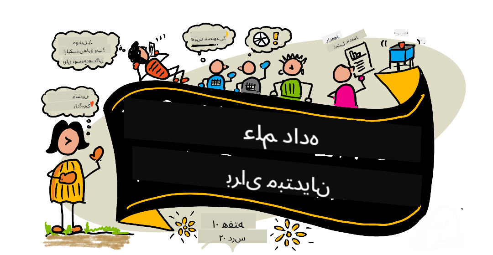

<!--
CO_OP_TRANSLATOR_METADATA:
{
  "original_hash": "d24976d371de57bb657d3127f4195542",
  "translation_date": "2025-10-03T13:27:02+00:00",
  "source_file": "README.md",
  "language_code": "fa"
}
-->
# علم داده برای مبتدیان - یک برنامه آموزشی

Azure Cloud Advocates در مایکروسافت با افتخار یک برنامه آموزشی ۱۰ هفته‌ای و ۲۰ درس درباره علم داده ارائه می‌دهند. هر درس شامل آزمون‌های پیش از درس و پس از درس، دستورالعمل‌های نوشتاری برای تکمیل درس، یک راه‌حل و یک تکلیف است. روش آموزشی مبتنی بر پروژه ما به شما امکان می‌دهد در حین ساختن یاد بگیرید، که یک روش اثبات‌شده برای تثبیت مهارت‌های جدید است.

**تشکر ویژه از نویسندگان ما:** [جاسمین گرین‌اوی](https://www.twitter.com/paladique)، [دمیتری سوشنیکوف](http://soshnikov.com)، [نیتیا ناراسیمهان](https://twitter.com/nitya)، [جالن مک‌گی](https://twitter.com/JalenMcG)، [جن لوپر](https://twitter.com/jenlooper)، [مود لوی](https://twitter.com/maudstweets)، [تیفانی سوتر](https://twitter.com/TiffanySouterre)، [کریستوفر هریسون](https://www.twitter.com/geektrainer).

**🙏 تشکر ویژه 🙏 از [سفیران دانشجویی مایکروسافت](https://studentambassadors.microsoft.com/) نویسندگان، بازبینان و مشارکت‌کنندگان محتوا،** به‌ویژه آریان آرورا، [آدیتیا گارگ](https://github.com/AdityaGarg00)، [آلوندرا سانچز](https://www.linkedin.com/in/alondra-sanchez-molina/)، [آنکیتا سینگ](https://www.linkedin.com/in/ankitasingh007)، [انوپام میشرا](https://www.linkedin.com/in/anupam--mishra/)، [آرپیتا داس](https://www.linkedin.com/in/arpitadas01/)، چهل‌بیهاری دوبی، [دیبری نسوفور](https://www.linkedin.com/in/dibrinsofor)، [دیشیتا باسین](https://www.linkedin.com/in/dishita-bhasin-7065281bb)، [مجد صافی](https://www.linkedin.com/in/majd-s/)، [مکس بلوم](https://www.linkedin.com/in/max-blum-6036a1186/)، [میگل کوریا](https://www.linkedin.com/in/miguelmque/)، [محمد افتخار (ایفتو) ابن جلال](https://twitter.com/iftu119)، [ناورین تبسم](https://www.linkedin.com/in/nawrin-tabassum)، [ریموند وانگسا پوترا](https://www.linkedin.com/in/raymond-wp/)، [روهیت یاداو](https://www.linkedin.com/in/rty2423)، سامریدی شارما، [سانیا سینها](https://www.linkedin.com/mwlite/in/sanya-sinha-13aab1200)، [شینا نارولا](https://www.linkedin.com/in/sheena-narua-n/)، [توقیر احمد](https://www.linkedin.com/in/tauqeerahmad5201/)، یوگندرا سینگ پاوار، [ویدوشی گوپتا](https://www.linkedin.com/in/vidushi-gupta07/)، [جسلین سوندی](https://www.linkedin.com/in/jasleen-sondhi/)

||
|:---:|
| علم داده برای مبتدیان - _طرح‌نگاری توسط [@nitya](https://twitter.com/nitya)_ |

### 🌐 پشتیبانی چندزبانه

#### پشتیبانی شده از طریق GitHub Action (خودکار و همیشه به‌روز)

[فرانسوی](../fr/README.md) | [اسپانیایی](../es/README.md) | [آلمانی](../de/README.md) | [روسی](../ru/README.md) | [عربی](../ar/README.md) | [فارسی](./README.md) | [اردو](../ur/README.md) | [چینی (ساده‌شده)](../zh/README.md) | [چینی (سنتی، ماکائو)](../mo/README.md) | [چینی (سنتی، هنگ‌کنگ)](../hk/README.md) | [چینی (سنتی، تایوان)](../tw/README.md) | [ژاپنی](../ja/README.md) | [کره‌ای](../ko/README.md) | [هندی](../hi/README.md) | [بنگالی](../bn/README.md) | [مراتی](../mr/README.md) | [نپالی](../ne/README.md) | [پنجابی (گرمکی)](../pa/README.md) | [پرتغالی (پرتغال)](../pt/README.md) | [پرتغالی (برزیل)](../br/README.md) | [ایتالیایی](../it/README.md) | [لهستانی](../pl/README.md) | [ترکی](../tr/README.md) | [یونانی](../el/README.md) | [تایلندی](../th/README.md) | [سوئدی](../sv/README.md) | [دانمارکی](../da/README.md) | [نروژی](../no/README.md) | [فنلاندی](../fi/README.md) | [هلندی](../nl/README.md) | [عبری](../he/README.md) | [ویتنامی](../vi/README.md) | [اندونزیایی](../id/README.md) | [مالایی](../ms/README.md) | [تاگالوگ (فیلیپینی)](../tl/README.md) | [سواحیلی](../sw/README.md) | [مجاری](../hu/README.md) | [چکی](../cs/README.md) | [اسلواکی](../sk/README.md) | [رومانیایی](../ro/README.md) | [بلغاری](../bg/README.md) | [صربی (سیریلیک)](../sr/README.md) | [کرواتی](../hr/README.md) | [اسلوونیایی](../sl/README.md) | [اوکراینی](../uk/README.md) | [برمه‌ای (میانمار)](../my/README.md)

**اگر می‌خواهید زبان‌های ترجمه اضافی پشتیبانی شوند، لیست زبان‌های موجود [اینجا](https://github.com/Azure/co-op-translator/blob/main/getting_started/supported-languages.md) قرار دارد**

#### به جامعه ما بپیوندید 

ما یک سری یادگیری با AI در Discord داریم، بیشتر بدانید و به ما بپیوندید در [Learn with AI Series](https://aka.ms/learnwithai/discord) از ۱۸ تا ۳۰ سپتامبر ۲۰۲۵. شما نکات و ترفندهای استفاده از GitHub Copilot برای علم داده را دریافت خواهید کرد.

# آیا شما دانشجو هستید؟

با منابع زیر شروع کنید:

- [صفحه مرکز دانشجویی](https://docs.microsoft.com/en-gb/learn/student-hub?WT.mc_id=academic-77958-bethanycheum) در این صفحه، منابع مبتدی، بسته‌های دانشجویی و حتی راه‌هایی برای دریافت یک کوپن گواهی رایگان را خواهید یافت. این صفحه‌ای است که می‌خواهید نشانک‌گذاری کنید و هر از گاهی بررسی کنید زیرا ما حداقل ماهانه محتوا را تغییر می‌دهیم.
- [سفیران دانشجویی مایکروسافت](https://studentambassadors.microsoft.com?WT.mc_id=academic-77958-bethanycheum) به یک جامعه جهانی از سفیران دانشجویی بپیوندید، این می‌تواند راه شما به مایکروسافت باشد.

# شروع به کار

## 📚 مستندات

- **[راهنمای نصب](INSTALLATION.md)** - دستورالعمل‌های گام‌به‌گام برای مبتدیان
- **[راهنمای استفاده](USAGE.md)** - مثال‌ها و جریان‌های کاری رایج
- **[رفع اشکال](TROUBLESHOOTING.md)** - راه‌حل‌های مشکلات رایج
- **[راهنمای مشارکت](CONTRIBUTING.md)** - نحوه مشارکت در این پروژه
- **[برای معلمان](for-teachers.md)** - راهنمایی‌های آموزشی و منابع کلاس درس

## 👨‍🎓 برای دانشجویان
> **مبتدیان کامل**: تازه وارد علم داده شده‌اید؟ با [مثال‌های مبتدی‌پسند](examples/README.md) ما شروع کنید! این مثال‌های ساده و دارای توضیحات به شما کمک می‌کنند تا اصول اولیه را قبل از ورود به برنامه کامل درک کنید.
> **[دانشجویان](https://aka.ms/student-page)**: برای استفاده از این برنامه آموزشی به‌صورت مستقل، کل مخزن را فورک کنید و تمرین‌ها را به‌صورت مستقل انجام دهید، با آزمون پیش از درس شروع کنید. سپس درس را بخوانید و بقیه فعالیت‌ها را تکمیل کنید. سعی کنید پروژه‌ها را با درک درس‌ها ایجاد کنید نه با کپی کردن کد راه‌حل؛ با این حال، آن کد در پوشه‌های /solutions در هر درس مبتنی بر پروژه موجود است. ایده دیگر این است که یک گروه مطالعه با دوستان تشکیل دهید و محتوا را با هم مرور کنید. برای مطالعه بیشتر، ما [Microsoft Learn](https://docs.microsoft.com/en-us/users/jenlooper-2911/collections/qprpajyoy3x0g7?WT.mc_id=academic-77958-bethanycheum) را توصیه می‌کنیم.

**شروع سریع:**
1. [راهنمای نصب](INSTALLATION.md) را بررسی کنید تا محیط خود را تنظیم کنید
2. [راهنمای استفاده](USAGE.md) را مرور کنید تا نحوه کار با برنامه آموزشی را یاد بگیرید
3. با درس ۱ شروع کنید و به ترتیب پیش بروید
4. به جامعه [Discord ما](https://aka.ms/ds4beginners/discord) برای پشتیبانی بپیوندید

## 👩‍🏫 برای معلمان

> **معلمان**: ما [برخی پیشنهادات](for-teachers.md) در مورد نحوه استفاده از این برنامه آموزشی را گنجانده‌ایم. ما مشتاقانه منتظر بازخورد شما [در انجمن بحث ما](https://github.com/microsoft/Data-Science-For-Beginners/discussions) هستیم!

## آشنایی با تیم

**Gif توسط** [موهیت جایسال](https://www.linkedin.com/in/mohitjaisal)

> 🎥 روی تصویر بالا کلیک کنید تا ویدیویی درباره پروژه و افرادی که آن را ایجاد کرده‌اند ببینید!

## روش آموزشی

ما دو اصل آموزشی را در هنگام ساخت این برنامه آموزشی انتخاب کرده‌ایم: اطمینان از اینکه مبتنی بر پروژه است و اینکه شامل آزمون‌های مکرر می‌شود. تا پایان این سری، دانشجویان اصول اولیه علم داده را یاد خواهند گرفت، از جمله مفاهیم اخلاقی، آماده‌سازی داده‌ها، روش‌های مختلف کار با داده‌ها، مصورسازی داده‌ها، تحلیل داده‌ها، موارد استفاده واقعی از علم داده و موارد دیگر.
علاوه بر این، یک آزمون کم‌اهمیت قبل از کلاس، توجه دانش‌آموز را به یادگیری یک موضوع جلب می‌کند، در حالی که یک آزمون دوم بعد از کلاس، به حفظ بیشتر مطالب کمک می‌کند. این برنامه آموزشی به گونه‌ای طراحی شده است که انعطاف‌پذیر و سرگرم‌کننده باشد و می‌توان آن را به صورت کامل یا جزئی انجام داد. پروژه‌ها از کوچک شروع می‌شوند و تا پایان چرخه ۱۰ هفته‌ای به تدریج پیچیده‌تر می‌شوند.

> راهنمای [Code of Conduct](CODE_OF_CONDUCT.md)، [Contributing](CONTRIBUTING.md)، و [Translation](TRANSLATIONS.md) ما را پیدا کنید. ما از بازخورد سازنده شما استقبال می‌کنیم!

## هر درس شامل موارد زیر است:

- یادداشت تصویری اختیاری
- ویدئوی تکمیلی اختیاری
- آزمون گرم‌آپ قبل از درس
- درس نوشتاری
- برای درس‌های مبتنی بر پروژه، راهنمای گام‌به‌گام برای ساخت پروژه
- بررسی دانش
- یک چالش
- مطالعه تکمیلی
- تکلیف
- [آزمون بعد از درس](https://ff-quizzes.netlify.app/en/)

> **نکته‌ای درباره آزمون‌ها**: تمام آزمون‌ها در پوشه Quiz-App قرار دارند و شامل ۴۰ آزمون با سه سؤال در هر آزمون هستند. این آزمون‌ها از داخل درس‌ها لینک شده‌اند، اما اپلیکیشن آزمون را می‌توان به صورت محلی اجرا کرد یا در Azure مستقر کرد؛ دستورالعمل‌ها را در پوشه `quiz-app` دنبال کنید. این آزمون‌ها به تدریج بومی‌سازی می‌شوند.

## 🎓 مثال‌های مناسب برای مبتدیان

**تازه وارد علم داده هستید؟** ما یک [پوشه مثال‌ها](examples/README.md) ویژه با کدهای ساده و دارای توضیحات کامل ایجاد کرده‌ایم تا به شما در شروع کمک کند:

- 🌟 **سلام دنیا** - اولین برنامه علم داده شما
- 📂 **بارگذاری داده‌ها** - یادگیری خواندن و بررسی مجموعه داده‌ها
- 📊 **تحلیل ساده** - محاسبه آمار و یافتن الگوها
- 📈 **بصری‌سازی پایه** - ایجاد نمودارها و گراف‌ها
- 🔬 **پروژه واقعی** - جریان کاری کامل از ابتدا تا انتها

هر مثال شامل توضیحات دقیق برای هر مرحله است که آن را برای مبتدیان کاملاً مناسب می‌کند!

👉 **[با مثال‌ها شروع کنید](examples/README.md)** 👈

## درس‌ها

||
|:---:|
| علم داده برای مبتدیان: نقشه راه - _یادداشت تصویری توسط [@nitya](https://twitter.com/nitya)_ |

| شماره درس | موضوع | گروه‌بندی درس | اهداف یادگیری | درس مرتبط | نویسنده |
| :-----------: | :----------------------------------------: | :--------------------------------------------------: | :-----------------------------------------------------------------------------------------------------------------------------------------------------------------------: | :---------------------------------------------------------------------: | :----: |
| 01 | تعریف علم داده | [مقدمه](1-Introduction/README.md) | یادگیری مفاهیم پایه علم داده و ارتباط آن با هوش مصنوعی، یادگیری ماشین و داده‌های کلان. | [درس](1-Introduction/01-defining-data-science/README.md) [ویدئو](https://youtu.be/beZ7Mb_oz9I) | [Dmitry](http://soshnikov.com) |
| 02 | اخلاق علم داده | [مقدمه](1-Introduction/README.md) | مفاهیم اخلاق داده، چالش‌ها و چارچوب‌ها. | [درس](1-Introduction/02-ethics/README.md) | [Nitya](https://twitter.com/nitya) |
| 03 | تعریف داده | [مقدمه](1-Introduction/README.md) | نحوه طبقه‌بندی داده‌ها و منابع رایج آن‌ها. | [درس](1-Introduction/03-defining-data/README.md) | [Jasmine](https://www.twitter.com/paladique) |
| 04 | مقدمه‌ای بر آمار و احتمال | [مقدمه](1-Introduction/README.md) | تکنیک‌های ریاضی احتمال و آمار برای درک داده‌ها. | [درس](1-Introduction/04-stats-and-probability/README.md) [ویدئو](https://youtu.be/Z5Zy85g4Yjw) | [Dmitry](http://soshnikov.com) |
| 05 | کار با داده‌های رابطه‌ای | [کار با داده‌ها](2-Working-With-Data/README.md) | مقدمه‌ای بر داده‌های رابطه‌ای و اصول بررسی و تحلیل داده‌های رابطه‌ای با زبان Structured Query Language، معروف به SQL (تلفظ "سی‌کوئل"). | [درس](2-Working-With-Data/05-relational-databases/README.md) | [Christopher](https://www.twitter.com/geektrainer) | | |
| 06 | کار با داده‌های NoSQL | [کار با داده‌ها](2-Working-With-Data/README.md) | مقدمه‌ای بر داده‌های غیررابطه‌ای، انواع مختلف آن و اصول بررسی و تحلیل پایگاه‌های داده سندی. | [درس](2-Working-With-Data/06-non-relational/README.md) | [Jasmine](https://twitter.com/paladique)|
| 07 | کار با پایتون | [کار با داده‌ها](2-Working-With-Data/README.md) | اصول استفاده از پایتون برای بررسی داده‌ها با کتابخانه‌هایی مانند Pandas. توصیه می‌شود که درک پایه‌ای از برنامه‌نویسی پایتون داشته باشید. | [درس](2-Working-With-Data/07-python/README.md) [ویدئو](https://youtu.be/dZjWOGbsN4Y) | [Dmitry](http://soshnikov.com) |
| 08 | آماده‌سازی داده‌ها | [کار با داده‌ها](2-Working-With-Data/README.md) | موضوعاتی درباره تکنیک‌های داده برای پاکسازی و تبدیل داده‌ها به منظور مقابله با چالش‌های داده‌های ناقص، نادرست یا ناکامل. | [درس](2-Working-With-Data/08-data-preparation/README.md) | [Jasmine](https://www.twitter.com/paladique) |
| 09 | بصری‌سازی مقادیر | [بصری‌سازی داده‌ها](3-Data-Visualization/README.md) | یادگیری نحوه استفاده از Matplotlib برای بصری‌سازی داده‌های پرندگان 🦆 | [درس](3-Data-Visualization/09-visualization-quantities/README.md) | [Jen](https://twitter.com/jenlooper) |
| 10 | بصری‌سازی توزیع داده‌ها | [بصری‌سازی داده‌ها](3-Data-Visualization/README.md) | بصری‌سازی مشاهدات و روندها در یک بازه. | [درس](3-Data-Visualization/10-visualization-distributions/README.md) | [Jen](https://twitter.com/jenlooper) |
| 11 | بصری‌سازی نسبت‌ها | [بصری‌سازی داده‌ها](3-Data-Visualization/README.md) | بصری‌سازی درصدهای گسسته و گروه‌بندی‌شده. | [درس](3-Data-Visualization/11-visualization-proportions/README.md) | [Jen](https://twitter.com/jenlooper) |
| 12 | بصری‌سازی روابط | [بصری‌سازی داده‌ها](3-Data-Visualization/README.md) | بصری‌سازی ارتباطات و همبستگی‌ها بین مجموعه‌های داده و متغیرهای آن‌ها. | [درس](3-Data-Visualization/12-visualization-relationships/README.md) | [Jen](https://twitter.com/jenlooper) |
| 13 | بصری‌سازی‌های معنادار | [بصری‌سازی داده‌ها](3-Data-Visualization/README.md) | تکنیک‌ها و راهنمایی‌هایی برای ارزشمند کردن بصری‌سازی‌ها به منظور حل مؤثر مشکلات و ارائه بینش‌ها. | [درس](3-Data-Visualization/13-meaningful-visualizations/README.md) | [Jen](https://twitter.com/jenlooper) |
| 14 | مقدمه‌ای بر چرخه عمر علم داده | [چرخه عمر](4-Data-Science-Lifecycle/README.md) | مقدمه‌ای بر چرخه عمر علم داده و اولین مرحله آن یعنی کسب و استخراج داده‌ها. | [درس](4-Data-Science-Lifecycle/14-Introduction/README.md) | [Jasmine](https://twitter.com/paladique) |
| 15 | تحلیل | [چرخه عمر](4-Data-Science-Lifecycle/README.md) | این مرحله از چرخه عمر علم داده بر تکنیک‌های تحلیل داده‌ها تمرکز دارد. | [درس](4-Data-Science-Lifecycle/15-analyzing/README.md) | [Jasmine](https://twitter.com/paladique) | | |
| 16 | ارتباط | [چرخه عمر](4-Data-Science-Lifecycle/README.md) | این مرحله از چرخه عمر علم داده بر ارائه بینش‌های حاصل از داده‌ها به گونه‌ای که تصمیم‌گیرندگان بتوانند آن را بهتر درک کنند، تمرکز دارد. | [درس](4-Data-Science-Lifecycle/16-communication/README.md) | [Jalen](https://twitter.com/JalenMcG) | | |
| 17 | علم داده در فضای ابری | [داده‌های ابری](5-Data-Science-In-Cloud/README.md) | این مجموعه درس‌ها علم داده در فضای ابری و مزایای آن را معرفی می‌کند. | [درس](5-Data-Science-In-Cloud/17-Introduction/README.md) | [Tiffany](https://twitter.com/TiffanySouterre) و [Maud](https://twitter.com/maudstweets) |
| 18 | علم داده در فضای ابری | [داده‌های ابری](5-Data-Science-In-Cloud/README.md) | آموزش مدل‌ها با استفاده از ابزارهای Low Code. |[درس](5-Data-Science-In-Cloud/18-Low-Code/README.md) | [Tiffany](https://twitter.com/TiffanySouterre) و [Maud](https://twitter.com/maudstweets) |
| 19 | علم داده در فضای ابری | [داده‌های ابری](5-Data-Science-In-Cloud/README.md) | استقرار مدل‌ها با Azure Machine Learning Studio. | [درس](5-Data-Science-In-Cloud/19-Azure/README.md)| [Tiffany](https://twitter.com/TiffanySouterre) و [Maud](https://twitter.com/maudstweets) |
| 20 | علم داده در دنیای واقعی | [در دنیای واقعی](6-Data-Science-In-Wild/README.md) | پروژه‌های مبتنی بر علم داده در دنیای واقعی. | [درس](6-Data-Science-In-Wild/20-Real-World-Examples/README.md) | [Nitya](https://twitter.com/nitya) |

## GitHub Codespaces

برای باز کردن این نمونه در یک Codespace مراحل زیر را دنبال کنید:
1. روی منوی کشویی Code کلیک کنید و گزینه Open with Codespaces را انتخاب کنید.
2. در پایین پنل، گزینه + New codespace را انتخاب کنید.
برای اطلاعات بیشتر، به [مستندات GitHub](https://docs.github.com/en/codespaces/developing-in-codespaces/creating-a-codespace-for-a-repository#creating-a-codespace) مراجعه کنید.

## VSCode Remote - Containers
برای باز کردن این مخزن در یک کانتینر با استفاده از ماشین محلی و VSCode با استفاده از افزونه VS Code Remote - Containers مراحل زیر را دنبال کنید:

1. اگر این اولین بار است که از یک کانتینر توسعه استفاده می‌کنید، لطفاً مطمئن شوید که سیستم شما پیش‌نیازها را برآورده می‌کند (مانند نصب Docker) در [مستندات شروع به کار](https://code.visualstudio.com/docs/devcontainers/containers#_getting-started).

برای استفاده از این مخزن، می‌توانید مخزن را در یک حجم ایزوله Docker باز کنید:

**توجه**: در پشت صحنه، این کار از دستور Remote-Containers: **Clone Repository in Container Volume...** برای کلون کردن کد منبع در یک حجم Docker به جای سیستم فایل محلی استفاده می‌کند. [Volumes](https://docs.docker.com/storage/volumes/) مکانیزم ترجیحی برای حفظ داده‌های کانتینر هستند.

یا یک نسخه کلون‌شده یا دانلودشده محلی از مخزن را باز کنید:

- این مخزن را به سیستم فایل محلی خود کلون کنید.
- کلید F1 را فشار دهید و دستور **Remote-Containers: Open Folder in Container...** را انتخاب کنید.
- نسخه کلون‌شده این پوشه را انتخاب کنید، منتظر بمانید تا کانتینر شروع شود و موارد را امتحان کنید.

## دسترسی آفلاین

می‌توانید این مستندات را به صورت آفلاین با استفاده از [Docsify](https://docsify.js.org/#/) اجرا کنید. این مخزن را Fork کنید، [Docsify را نصب کنید](https://docsify.js.org/#/quickstart) روی ماشین محلی خود، سپس در پوشه ریشه این مخزن، دستور `docsify serve` را تایپ کنید. وب‌سایت روی پورت 3000 در localhost شما اجرا خواهد شد: `localhost:3000`.

> توجه داشته باشید، نوت‌بوک‌ها از طریق Docsify رندر نمی‌شوند، بنابراین زمانی که نیاز به اجرای یک نوت‌بوک دارید، آن را جداگانه در VS Code با اجرای یک کرنل پایتون انجام دهید.

## برنامه‌های آموزشی دیگر

تیم ما برنامه‌های آموزشی دیگری تولید می‌کند! بررسی کنید:

- [Edge AI for Beginners](https://aka.ms/edgeai-for-beginners)
- [AI Agents for Beginners](https://aka.ms/ai-agents-beginners)
- [Generative AI for Beginners](https://aka.ms/genai-beginners)
- [Generative AI for Beginners .NET](https://github.com/microsoft/Generative-AI-for-beginners-dotnet)
- [Generative AI with JavaScript](https://github.com/microsoft/generative-ai-with-javascript)
- [Generative AI with Java](https://aka.ms/genaijava)
- [AI for Beginners](https://aka.ms/ai-beginners)
- [Data Science for Beginners](https://aka.ms/datascience-beginners)
- [Bash for Beginners](https://github.com/microsoft/bash-for-beginners)
- [ML for Beginners](https://aka.ms/ml-beginners)
- [Cybersecurity for Beginners](https://github.com/microsoft/Security-101) 
- [Web Dev for Beginners](https://aka.ms/webdev-beginners)
- [IoT for Beginners](https://aka.ms/iot-beginners)
- [Machine Learning for Beginners](https://aka.ms/ml-beginners)
- [XR Development for Beginners](https://aka.ms/xr-dev-for-beginners)
- [تسلط بر GitHub Copilot برای برنامه‌نویسی جفتی هوش مصنوعی](https://aka.ms/GitHubCopilotAI)
- [توسعه XR برای مبتدیان](https://github.com/microsoft/xr-development-for-beginners)
- [تسلط بر GitHub Copilot برای توسعه‌دهندگان C#/.NET](https://github.com/microsoft/mastering-github-copilot-for-dotnet-csharp-developers)
- [ماجراجویی خود را با Copilot انتخاب کنید](https://github.com/microsoft/CopilotAdventures)

## دریافت کمک

**با مشکل مواجه شده‌اید؟** راهنمای [رفع مشکلات](TROUBLESHOOTING.md) ما را برای حل مشکلات رایج بررسی کنید.

اگر گیر کردید یا سوالی درباره ساخت اپلیکیشن‌های هوش مصنوعی دارید، به اینجا بپیوندید:

اگر بازخورد محصول دارید یا هنگام ساخت با خطا مواجه شدید، به اینجا مراجعه کنید:

---

**سلب مسئولیت**:  
این سند با استفاده از سرویس ترجمه هوش مصنوعی [Co-op Translator](https://github.com/Azure/co-op-translator) ترجمه شده است. در حالی که ما تلاش می‌کنیم دقت را حفظ کنیم، لطفاً توجه داشته باشید که ترجمه‌های خودکار ممکن است شامل خطاها یا نادرستی‌ها باشند. سند اصلی به زبان اصلی آن باید به عنوان منبع معتبر در نظر گرفته شود. برای اطلاعات حساس، ترجمه حرفه‌ای انسانی توصیه می‌شود. ما مسئولیتی در قبال سوء تفاهم‌ها یا تفسیرهای نادرست ناشی از استفاده از این ترجمه نداریم.