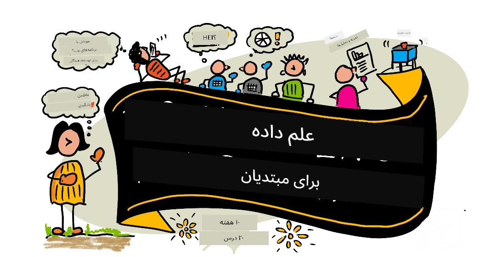
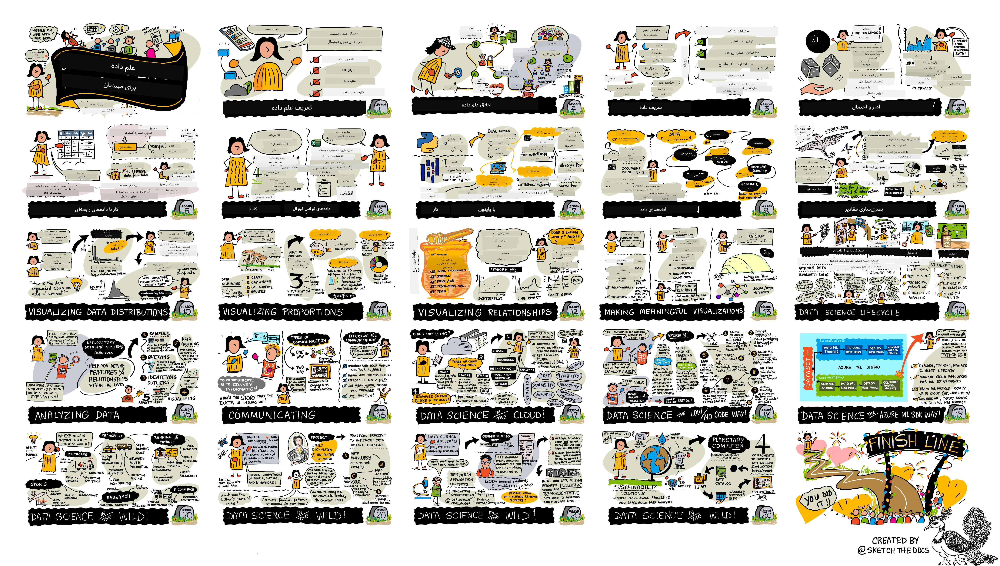

# علم داده برای مبتدیان - یک برنامه آموزشی

[](https://github.com/codespaces/new?hide_repo_select=true&ref=main&repo=344191198)

[](https://github.com/microsoft/Data-Science-For-Beginners/blob/master/LICENSE)
[](https://GitHub.com/microsoft/Data-Science-For-Beginners/graphs/contributors/)
[](https://GitHub.com/microsoft/Data-Science-For-Beginners/issues/)
[](https://GitHub.com/microsoft/Data-Science-For-Beginners/pulls/)
[](http://makeapullrequest.com)

[](https://GitHub.com/microsoft/Data-Science-For-Beginners/watchers/)
[](https://GitHub.com/microsoft/Data-Science-For-Beginners/network/)
[](https://GitHub.com/microsoft/Data-Science-For-Beginners/stargazers/)


[](https://discord.gg/nTYy5BXMWG)

[](https://aka.ms/foundry/forum)

مدافعان ابر Azure در مایکروسافت خوشحالند یک برنامه ۱۰ هفته‌ای شامل ۲۰ درس در زمینه علم داده ارائه دهند. هر درس شامل آزمون‌های قبل و بعد از درس، دستورالعمل‌های مکتوب برای تکمیل درس، پاسخ و یک تمرین است. روش یادگیری ما بر پایه پروژه به شما اجازه می‌دهد در هنگام ساخت، یاد بگیرید که این راه اثبات شده‌ای برای تثبیت مهارت‌های جدید است.

**با تشکر صمیمانه از نویسندگان ما:** [Jasmine Greenaway](https://www.twitter.com/paladique)، [Dmitry Soshnikov](http://soshnikov.com)، [Nitya Narasimhan](https://twitter.com/nitya)، [Jalen McGee](https://twitter.com/JalenMcG)، [Jen Looper](https://twitter.com/jenlooper)، [Maud Levy](https://twitter.com/maudstweets)، [Tiffany Souterre](https://twitter.com/TiffanySouterre)، [Christopher Harrison](https://www.twitter.com/geektrainer).

**🙏 تشکر ویژه 🙏 از نویسندگان، بازبین‌ها و مشارکت‌کنندگان محتوا از [سفیران دانشجویی مایکروسافت](https://studentambassadors.microsoft.com/)،** به ویژه Aaryan Arora، [Aditya Garg](https://github.com/AdityaGarg00)، [Alondra Sanchez](https://www.linkedin.com/in/alondra-sanchez-molina/)، [Ankita Singh](https://www.linkedin.com/in/ankitasingh007)، [Anupam Mishra](https://www.linkedin.com/in/anupam--mishra/)، [Arpita Das](https://www.linkedin.com/in/arpitadas01/)، ChhailBihari Dubey، [Dibri Nsofor](https://www.linkedin.com/in/dibrinsofor)، [Dishita Bhasin](https://www.linkedin.com/in/dishita-bhasin-7065281bb)، [Majd Safi](https://www.linkedin.com/in/majd-s/)، [Max Blum](https://www.linkedin.com/in/max-blum-6036a1186/)، [Miguel Correa](https://www.linkedin.com/in/miguelmque/)، [Mohamma Iftekher (Iftu) Ebne Jalal](https://twitter.com/iftu119)، [Nawrin Tabassum](https://www.linkedin.com/in/nawrin-tabassum)، [Raymond Wangsa Putra](https://www.linkedin.com/in/raymond-wp/)، [Rohit Yadav](https://www.linkedin.com/in/rty2423)، Samridhi Sharma، [Sanya Sinha](https://www.linkedin.com/mwlite/in/sanya-sinha-13aab1200)،
[Sheena Narula](https://www.linkedin.com/in/sheena-narua-n/)، [Tauqeer Ahmad](https://www.linkedin.com/in/tauqeerahmad5201/)، Yogendrasingh Pawar، [Vidushi Gupta](https://www.linkedin.com/in/vidushi-gupta07/)، [Jasleen Sondhi](https://www.linkedin.com/in/jasleen-sondhi/)

||
|:---:|
| علم داده برای مبتدیان - _کادر نقاشی توسط [@nitya](https://twitter.com/nitya)_ |

### 🌐 پشتیبانی چند زبان

#### پشتیبانی شده توسط GitHub Action (خودکار و همیشه به‌روز)

<!-- CO-OP TRANSLATOR LANGUAGES TABLE START -->
[Arabic](../ar/README.md) | [Bengali](../bn/README.md) | [Bulgarian](../bg/README.md) | [Burmese (Myanmar)](../my/README.md) | [Chinese (Simplified)](../zh-CN/README.md) | [Chinese (Traditional, Hong Kong)](../zh-HK/README.md) | [Chinese (Traditional, Macau)](../zh-MO/README.md) | [Chinese (Traditional, Taiwan)](../zh-TW/README.md) | [Croatian](../hr/README.md) | [Czech](../cs/README.md) | [Danish](../da/README.md) | [Dutch](../nl/README.md) | [Estonian](../et/README.md) | [Finnish](../fi/README.md) | [French](../fr/README.md) | [German](../de/README.md) | [Greek](../el/README.md) | [Hebrew](../he/README.md) | [Hindi](../hi/README.md) | [Hungarian](../hu/README.md) | [Indonesian](../id/README.md) | [Italian](../it/README.md) | [Japanese](../ja/README.md) | [Kannada](../kn/README.md) | [Khmer](../km/README.md) | [Korean](../ko/README.md) | [Lithuanian](../lt/README.md) | [Malay](../ms/README.md) | [Malayalam](../ml/README.md) | [Marathi](../mr/README.md) | [Nepali](../ne/README.md) | [Nigerian Pidgin](../pcm/README.md) | [Norwegian](../no/README.md) | [Persian (Farsi)](./README.md) | [Polish](../pl/README.md) | [Portuguese (Brazil)](../pt-BR/README.md) | [Portuguese (Portugal)](../pt-PT/README.md) | [Punjabi (Gurmukhi)](../pa/README.md) | [Romanian](../ro/README.md) | [Russian](../ru/README.md) | [Serbian (Cyrillic)](../sr/README.md) | [Slovak](../sk/README.md) | [Slovenian](../sl/README.md) | [Spanish](../es/README.md) | [Swahili](../sw/README.md) | [Swedish](../sv/README.md) | [Tagalog (Filipino)](../tl/README.md) | [Tamil](../ta/README.md) | [Telugu](../te/README.md) | [Thai](../th/README.md) | [Turkish](../tr/README.md) | [Ukrainian](../uk/README.md) | [Urdu](../ur/README.md) | [Vietnamese](../vi/README.md)

> **ترجیح می‌دهید به صورت محلی کلون کنید؟**
>
> این مخزن شامل بیش از ۵۰ ترجمه زبانی است که به طور قابل توجهی حجم دانلود را افزایش می‌دهد. برای کلون کردن بدون ترجمه‌ها، از sparse checkout استفاده کنید:
>
> **Bash / macOS / Linux:**
> ```bash
> git clone --filter=blob:none --sparse https://github.com/microsoft/Data-Science-For-Beginners.git
> cd Data-Science-For-Beginners
> git sparse-checkout set --no-cone '/*' '!translations' '!translated_images'
> ```
>
> **CMD (ویندوز):**
> ```cmd
> git clone --filter=blob:none --sparse https://github.com/microsoft/Data-Science-For-Beginners.git
> cd Data-Science-For-Beginners
> git sparse-checkout set --no-cone "/*" "!translations" "!translated_images"
> ```
>
> این به شما همه چیزهایی را می‌دهد که برای تکمیل دوره نیاز دارید با سرعت دانلود بسیار بیشتر.
<!-- CO-OP TRANSLATOR LANGUAGES TABLE END -->

**اگر می‌خواهید زبان‌های ترجمه بیشتری پشتیبانی شوند، لیست آن‌ها را [اینجا](https://github.com/Azure/co-op-translator/blob/main/getting_started/supported-languages.md) ببینید**

#### به جامعه ما بپیوندید
[](https://discord.gg/nTYy5BXMWG)

ما یک سری یادگیری با هوش مصنوعی در دیسکورد برگزار می‌کنیم، برای اطلاعات بیشتر و پیوستن به ما به [سری یادگیری با هوش مصنوعی](https://aka.ms/learnwithai/discord) از ۱۸ تا ۳۰ سپتامبر ۲۰۲۵ مراجعه کنید. شما نکات و ترفندهای استفاده از GitHub Copilot برای علم داده را دریافت خواهید کرد.


# آیا شما دانشجو هستید؟

با منابع زیر شروع کنید:

- [صفحه مرکز دانشجویان](https://docs.microsoft.com/en-gb/learn/student-hub?WT.mc_id=academic-77958-bethanycheum) در این صفحه منابع برای مبتدیان، بسته‌های دانشجویی و حتی راه‌هایی برای دریافت کوپن رایگان گواهینامه خواهید یافت. این یکی صفحه‌ای است که می‌خواهید نشانک بزنید و هر از گاهی آن را بررسی کنید چون ما محتوای آن را حداقل ماهیانه تغییر می‌دهیم.
- [سفیران دانشجویی مایکروسافت](https://studentambassadors.microsoft.com?WT.mc_id=academic-77958-bethanycheum) به یک جامعه جهانی از سفرای دانشجویی بپیوندید، این می‌تواند راه شما به سمت مایکروسافت باشد.

# شروع به کار

## 📚 مستندات

- **[راهنمای نصب](INSTALLATION.md)** - دستورالعمل‌های قدم به قدم نصب برای مبتدیان
- **[راهنمای استفاده](USAGE.md)** - نمونه‌ها و گردش‌های کاری رایج
- **[رفع اشکال](TROUBLESHOOTING.md)** - راه‌حل مشکلات رایج
- **[راهنمای مشارکت](CONTRIBUTING.md)** - چطور به این پروژه کمک کنید
- **[برای معلمان](for-teachers.md)** - راهنمای تدریس و منابع کلاسی

## 👨‍🎓 برای دانشجویان
> **کاملاً مبتدی**: به علم داده تازه واردید؟ با [نمونه‌های مناسب مبتدیان](examples/README.md) ما شروع کنید! این نمونه‌های ساده و با کامنت‌های خوب به شما کمک می‌کنند تا اصول اولیه را قبل از ورود به دوره کامل بفهمید.
> **[دانشجویان](https://aka.ms/student-page)**: برای استفاده از این برنامه آموزشی به صورت مستقل، کل مخزن را فورک کنید و تمرین‌ها را با آزمون پیش‌درس شروع کنید. سپس درس را بخوانید و بقیه فعالیت‌ها را تکمیل کنید. سعی کنید پروژه‌ها را با درک درس‌ها بسازید نه با کپی کردن کد راه‌حل؛ البته آن کد در پوشه /solutions در هر درس مرتبط با پروژه موجود است. ایده دیگر تشکیل یک گروه مطالعه با دوستان است و با هم از مطالب عبور کنید. برای مطالعات بیشتر، ما [Microsoft Learn](https://docs.microsoft.com/en-us/users/jenlooper-2911/collections/qprpajyoy3x0g7?WT.mc_id=academic-77958-bethanycheum) را توصیه می‌کنیم.

**شروع سریع:**
1. [راهنمای نصب](INSTALLATION.md) را برای راه‌اندازی محیط خود بررسی کنید
2. [راهنمای استفاده](USAGE.md) را برای یادگیری کار با دوره مرور کنید
3. با درس ۱ شروع کنید و به ترتیب پیش بروید
4. برای پشتیبانی به [جامعه دیسکورد ما](https://aka.ms/ds4beginners/discord) بپیوندید

## 👩‍🏫 برای معلمان
> **معلمان**: ما [چند پیشنهاد](for-teachers.md) درباره نحوه استفاده از این برنامه درسی گنجانده‌ایم. خوشحال می‌شویم بازخورد شما را [در انجمن بحث ما](https://github.com/microsoft/Data-Science-For-Beginners/discussions) دریافت کنیم!

## معرفی تیم

[](https://youtu.be/8mzavjQSMM4 "ویدئو تبلیغاتی")

**گیف ساخته شده توسط** [موهیت جایسال](https://www.linkedin.com/in/mohitjaisal)

> 🎥 برای دیدن ویدئویی درباره پروژه و افرادی که آن را ایجاد کرده‌اند، روی تصویر بالا کلیک کنید!

## روش تدریس

در ساخت این برنامه درسی دو اصل آموزشی را انتخاب کرده‌ایم: اطمینان از اینکه مبتنی بر پروژه است و شامل آزمون‌های مکرر می‌باشد. تا پایان این مجموعه، دانش‌آموزان اصول پایه علم داده را خواهند آموخت، از جمله مفاهیم اخلاقی، آماده‌سازی داده‌ها، روش‌های مختلف کار با داده، مصورسازی داده‌ها، تحلیل داده، کاربردهای دنیای واقعی علم داده و غیره.

علاوه بر این، آزمون ساده قبل از کلاس، نیت دانش‌آموز را برای یادگیری موضوع تنظیم می‌کند، در حالی که آزمون دوم بعد از کلاس به تثبیت بیشتر مطالب کمک می‌کند. این برنامه درسی به گونه‌ای طراحی شده که انعطاف‌پذیر و سرگرم‌کننده باشد و می‌توان آن را به طور کامل یا بخشی از آن را مطالعه کرد. پروژه‌ها از ساده شروع شده و با پایان دوره ده هفته‌ای به تدریج پیچیده‌تر می‌شوند.

> می‌توانید [قانون رفتار](CODE_OF_CONDUCT.md)، [راهنمای مشارکت](CONTRIBUTING.md)، و [راهنمای ترجمه](TRANSLATIONS.md) ما را بیابید. بازخورد سازنده شما را خوش‌آمد می‌گوییم!

## هر درس شامل موارد زیر است:

- نکته‌نویسی اختیاری
- ویدئوی مکمل اختیاری
- آزمون گرم کردن پیش از درس
- درس مکتوب
- برای درس‌های مبتنی بر پروژه، راهنمای گام‌به‌گام ساخت پروژه
- ارزیابی دانش
- یک چالش
- مطالعه مکمل
- تمرین
- [آزمون پس از درس](https://ff-quizzes.netlify.app/en/)

> **یادداشتی درباره آزمون‌ها**: همه آزمون‌ها در پوشه Quiz-App قرار دارند، شامل مجموعاً ۴۰ آزمون با سه سوال هر کدام. این آزمون‌ها از داخل دروس لینک شده‌اند، اما اپلیکیشن آزمون را می‌توان محلی اجرا کرد یا در Azure مستقر نمود؛ دستورالعمل در پوشه `quiz-app` موجود است. در حال تدریج بومی‌سازی می‌شوند.

## 🎓 مثال‌های مناسب مبتدیان

**جدید در علم داده؟** ما یک [دایرکتوری مثال](examples/README.md) ویژه ساخته‌ایم که شامل کدهای ساده و خوب کامنت‌گذاری شده برای شروع کار شماست:

- 🌟 **سلام دنیا** - اولین برنامه علم داده شما
- 📂 **بارگذاری داده‌ها** - یادگیری نحوه خواندن و کاوش مجموعه داده‌ها
- 📊 **تحلیل ساده** - محاسبه آمار و یافتن الگوها
- 📈 **مصورسازی پایه** - ایجاد نمودارها و گراف‌ها
- 🔬 **پروژه دنیای واقعی** - روند کامل از شروع تا پایان

هر مثال شامل نظرات مفصل برای توضیح هر مرحله است که آن را برای مبتدیان مطلق ایده‌آل می‌کند!

👉 **[شروع با مثال‌ها](examples/README.md)** 👈

## دروس

||
|:---:|
| نقشه راه علم داده برای مبتدیان - _نکته‌نویسی توسط [@nitya](https://twitter.com/nitya)_ |

| شماره درس | موضوع | گروه‌بندی درس | اهداف یادگیری | درس مرتبط | نویسنده |
| :-------: | :----------------------------------------: | :--------------------------------------------------: | :-----------------------------------------------------------------------------------------------------------------------------------------------------------------------: | :---------------------------------------------------------------------: | :----: |
| ۰۱ | تعریف علم داده | [مقدمه](1-Introduction/README.md) | آشنایی با مفاهیم پایه علم داده و ارتباط آن با هوش مصنوعی، یادگیری ماشین و کلان داده. | [درس](1-Introduction/01-defining-data-science/README.md) [ویدئو](https://youtu.be/beZ7Mb_oz9I) | [دیمیتری](http://soshnikov.com) |
| ۰۲ | اخلاقیات علم داده | [مقدمه](1-Introduction/README.md) | مفاهیم اخلاق داده، چالش‌ها و چارچوب‌ها. | [درس](1-Introduction/02-ethics/README.md) | [نیتیا](https://twitter.com/nitya) |
| ۰۳ | تعریف داده | [مقدمه](1-Introduction/README.md) | نحوه طبقه‌بندی داده و منابع رایج آن. | [درس](1-Introduction/03-defining-data/README.md) | [یاسمین](https://www.twitter.com/paladique) |
| ۰۴ | مقدمه‌ای بر آمار و احتمال | [مقدمه](1-Introduction/README.md) | استفاده از فنون ریاضی احتمال و آمار برای درک داده‌ها. | [درس](1-Introduction/04-stats-and-probability/README.md) [ویدئو](https://youtu.be/Z5Zy85g4Yjw) | [دیمیتری](http://soshnikov.com) |
| ۰۵ | کار با داده‌های رابطه‌ای | [کار با داده‌ها](2-Working-With-Data/README.md) | معرفی داده‌های رابطه‌ای و اصول کاوش و تحلیل داده‌های رابطه‌ای با زبان ساختاری پرس و جو که به اختصار SQL گفته می‌شود. | [درس](2-Working-With-Data/05-relational-databases/README.md) | [کریستوفر](https://www.twitter.com/geektrainer) |
| ۰۶ | کار با داده‌های NoSQL | [کار با داده‌ها](2-Working-With-Data/README.md) | معرفی داده‌های غیر رابطه‌ای، انواع مختلف آن و اصول کاوش و تحلیل پایگاه‌های داده سند محور. | [درس](2-Working-With-Data/06-non-relational/README.md) | [یاسمین](https://twitter.com/paladique) |
| ۰۷ | کار با پایتون | [کار با داده‌ها](2-Working-With-Data/README.md) | اصول استفاده از پایتون برای کاوش داده‌ها با کتابخانه‌هایی مانند Pandas. داشتن دانش پایه برنامه‌نویسی پایتون توصیه می‌شود. | [درس](2-Working-With-Data/07-python/README.md) [ویدئو](https://youtu.be/dZjWOGbsN4Y) | [دیمیتری](http://soshnikov.com) |
| ۰۸ | آماده‌سازی داده‌ها | [کار با داده‌ها](2-Working-With-Data/README.md) | موضوعات مربوط به تکنیک‌های داده برای پاک‌سازی و تبدیل داده‌ها به منظور مقابله با مشکلات داده‌های گمشده، نادرست یا ناقص. | [درس](2-Working-With-Data/08-data-preparation/README.md) | [یاسمین](https://www.twitter.com/paladique) |
| ۰۹ | مصورسازی مقادیر | [مصورسازی داده](3-Data-Visualization/README.md) | یادگیری استفاده از Matplotlib برای مصورسازی داده‌های پرندگان 🦆 | [درس](3-Data-Visualization/09-visualization-quantities/README.md) | [جن](https://twitter.com/jenlooper) |
| ۱۰ | مصورسازی توزیع داده‌ها | [مصورسازی داده](3-Data-Visualization/README.md) | مصورسازی مشاهدات و روندها در بازه‌ای مشخص. | [درس](3-Data-Visualization/10-visualization-distributions/README.md) | [جن](https://twitter.com/jenlooper) |
| ۱۱ | مصورسازی نسبت‌ها | [مصورسازی داده](3-Data-Visualization/README.md) | مصورسازی درصدهای گسسته و گروه‌بندی شده. | [درس](3-Data-Visualization/11-visualization-proportions/README.md) | [جن](https://twitter.com/jenlooper) |
| ۱۲ | مصورسازی روابط | [مصورسازی داده](3-Data-Visualization/README.md) | مصورسازی ارتباطات و همبستگی بین مجموعه داده‌ها و متغیرهای آنها. | [درس](3-Data-Visualization/12-visualization-relationships/README.md) | [جن](https://twitter.com/jenlooper) |
| ۱۳ | مصورسازی‌های معنادار | [مصورسازی داده](3-Data-Visualization/README.md) | تکنیک‌ها و راهنمایی برای ساخت مصورسازی‌های ارزشمند برای حل موثر مسئله و کسب بینش. | [درس](3-Data-Visualization/13-meaningful-visualizations/README.md) | [جن](https://twitter.com/jenlooper) |
| ۱۴ | مقدمه‌ای بر چرخه عمر علم داده | [چرخه عمر](4-Data-Science-Lifecycle/README.md) | معرفی چرخه عمر علم داده و اولین مرحله آن یعنی کسب و استخراج داده. | [درس](4-Data-Science-Lifecycle/14-Introduction/README.md) | [یاسمین](https://twitter.com/paladique) |
| ۱۵ | تحلیل داده‌ها | [چرخه عمر](4-Data-Science-Lifecycle/README.md) | این مرحله از چرخه عمر علم داده بر فنون تحلیل داده تمرکز دارد. | [درس](4-Data-Science-Lifecycle/15-analyzing/README.md) | [یاسمین](https://twitter.com/paladique) |
| ۱۶ | ارتباطات | [چرخه عمر](4-Data-Science-Lifecycle/README.md) | این مرحله از چرخه عمر علم داده بر ارائه بینش‌های داده به گونه‌ای که برای تصمیم‌گیرندگان قابل فهم‌تر باشد، متمرکز است. | [درس](4-Data-Science-Lifecycle/16-communication/README.md) | [جالن](https://twitter.com/JalenMcG) |
| ۱۷ | علم داده در فضای ابری | [داده‌های ابری](5-Data-Science-In-Cloud/README.md) | این سری دروس، علم داده در فضای ابری و مزایای آن را معرفی می‌کند. | [درس](5-Data-Science-In-Cloud/17-Introduction/README.md) | [تیفانی](https://twitter.com/TiffanySouterre) و [ماد](https://twitter.com/maudstweets) |
| ۱۸ | علم داده در فضای ابری | [داده‌های ابری](5-Data-Science-In-Cloud/README.md) | آموزش مدل‌ها با استفاده از ابزارهای کد کم. |[درس](5-Data-Science-In-Cloud/18-Low-Code/README.md) | [تیفانی](https://twitter.com/TiffanySouterre) و [ماد](https://twitter.com/maudstweets) |
| ۱۹ | علم داده در فضای ابری | [داده‌های ابری](5-Data-Science-In-Cloud/README.md) | استقرار مدل‌ها با Azure Machine Learning Studio. | [درس](5-Data-Science-In-Cloud/19-Azure/README.md) | [تیفانی](https://twitter.com/TiffanySouterre) و [ماد](https://twitter.com/maudstweets) |
| ۲۰ | علم داده در دنیای واقعی | [در دنیای واقعی](6-Data-Science-In-Wild/README.md) | پروژه‌های مبتنی بر علم داده در دنیای واقعی. | [درس](6-Data-Science-In-Wild/20-Real-World-Examples/README.md) | [نیتیا](https://twitter.com/nitya) |

## کد‌اسپیس‌های گیت‌هاب

برای باز کردن این نمونه در یک کد‌اسپیس گیت‌هاب مراحل زیر را دنبال کنید:
۱. منوی کشویی Code را کلیک کرده و گزینه Open with Codespaces را انتخاب کنید.
۲. در پایین صفحه گزینه + New codespace را انتخاب کنید.
برای اطلاعات بیشتر، به [مستندات گیت‌هاب](https://docs.github.com/en/codespaces/developing-in-codespaces/creating-a-codespace-for-a-repository#creating-a-codespace) مراجعه کنید.

## VSCode Remote - Containers
برای باز کردن این مخزن در یک کانتینر با استفاده از ماشین محلی و VSCode با افزونه VS Code Remote - Containers:

۱. اگر برای اولین بار از کانتینر توسعه استفاده می‌کنید، مطمئن شوید سیستم شما پیش‌نیازها را دارد (مثلاً Docker نصب شده باشد) در [مستندات شروع به کار](https://code.visualstudio.com/docs/devcontainers/containers#_getting-started).

برای استفاده از این مخزن، می‌توانید یا مخزن را در یک حجم جداشده Docker باز کنید:

**نکته**: در پشت صحنه، این به کمک دستور Remote-Containers: **Clone Repository in Container Volume...** کد منبع را در یک حجم Docker به جای فایل سیستم محلی کلون می‌کند. [حجم‌ها](https://docs.docker.com/storage/volumes/) مکانیزم ترجیحی برای حفظ داده‌های کانتینر هستند.

یا نسخه کلون شده یا دانلود شده مخزن را باز کنید:

- این مخزن را روی فایل سیستم محلی کپی کنید.
- کلید F1 را فشار دهید و دستور **Remote-Containers: Open Folder in Container...** را انتخاب کنید.
- نسخه کپی شده این پوشه را انتخاب کنید، منتظر بمانید تا کانتینر شروع به کار کند و امتحان کنید.

## دسترسی آفلاین

می‌توانید این مستندات را به صورت آفلاین با استفاده از [Docsify](https://docsify.js.org/#/) اجرا کنید. این مخزن را فورک کنید، [Docsify را نصب کنید](https://docsify.js.org/#/quickstart) روی ماشین محلی خود، سپس در پوشه ریشه این مخزن، دستور `docsify serve` را وارد کنید. وبسایت روی پورت ۳۰۰۰ در لوکال‌هاست: `localhost:3000` سرو خواهد شد.

> توجه داشته باشید، دفترچه‌ها (نوت‌بوک‌ها) توسط Docsify رندر نخواهند شد، بنابراین وقتی نیاز به اجرای نوت‌بوک دارید، آن را جداگانه در VS Code با کرنل پایتون اجرا کنید.

## برنامه‌های درسی دیگر

تیم ما برنامه‌های درسی دیگری نیز تولید می‌کند! بررسی کنید:

<!-- CO-OP TRANSLATOR OTHER COURSES START -->
### LangChain
[](https://aka.ms/langchain4j-for-beginners)
[](https://aka.ms/langchainjs-for-beginners?WT.mc_id=m365-94501-dwahlin)
[](https://github.com/microsoft/langchain-for-beginners?WT.mc_id=m365-94501-dwahlin)
---

### Azure / Edge / MCP / عامل‌ها
[](https://github.com/microsoft/AZD-for-beginners?WT.mc_id=academic-105485-koreyst)
[](https://github.com/microsoft/edgeai-for-beginners?WT.mc_id=academic-105485-koreyst)
[](https://github.com/microsoft/mcp-for-beginners?WT.mc_id=academic-105485-koreyst)
[](https://github.com/microsoft/ai-agents-for-beginners?WT.mc_id=academic-105485-koreyst)

---
 
### مجموعه هوش مصنوعی مولد
[](https://github.com/microsoft/generative-ai-for-beginners?WT.mc_id=academic-105485-koreyst)
[-9333EA?style=for-the-badge&labelColor=E5E7EB&color=9333EA)](https://github.com/microsoft/Generative-AI-for-beginners-dotnet?WT.mc_id=academic-105485-koreyst)
[-C084FC?style=for-the-badge&labelColor=E5E7EB&color=C084FC)](https://github.com/microsoft/generative-ai-for-beginners-java?WT.mc_id=academic-105485-koreyst)
[-E879F9?style=for-the-badge&labelColor=E5E7EB&color=E879F9)](https://github.com/microsoft/generative-ai-with-javascript?WT.mc_id=academic-105485-koreyst)

---
 
### یادگیری اصلی
[](https://aka.ms/ml-beginners?WT.mc_id=academic-105485-koreyst)
[](https://aka.ms/datascience-beginners?WT.mc_id=academic-105485-koreyst)
[](https://aka.ms/ai-beginners?WT.mc_id=academic-105485-koreyst)
[](https://github.com/microsoft/Security-101?WT.mc_id=academic-96948-sayoung)
[](https://aka.ms/webdev-beginners?WT.mc_id=academic-105485-koreyst)
[](https://aka.ms/iot-beginners?WT.mc_id=academic-105485-koreyst)
[](https://github.com/microsoft/xr-development-for-beginners?WT.mc_id=academic-105485-koreyst)

---
 
### مجموعه کاپیلوت
[](https://aka.ms/GitHubCopilotAI?WT.mc_id=academic-105485-koreyst)
[](https://github.com/microsoft/mastering-github-copilot-for-dotnet-csharp-developers?WT.mc_id=academic-105485-koreyst)
[](https://github.com/microsoft/CopilotAdventures?WT.mc_id=academic-105485-koreyst)
<!-- CO-OP TRANSLATOR OTHER COURSES END -->

## دریافت کمک

**با مشکلات مواجه شده‌اید؟** راهنمای [عیب‌یابی](TROUBLESHOOTING.md) ما را برای راه حل‌های مشکلات رایج بررسی کنید.

اگر گیر کرده‌اید یا سوالی درباره ساخت برنامه‌های هوش مصنوعی دارید، به جمع یادگیرندگان و توسعه‌دهندگان مجرب در بحث‌های MCP بپیوندید. این یک جامعه حمایتی است که سوالات خوش‌آمد گفته می‌شوند و دانش به‌صورت آزادانه به اشتراک گذاشته می‌شود.

[](https://discord.gg/nTYy5BXMWG)

اگر بازخورد محصول یا خطایی هنگام ساخت دارید به:

[](https://aka.ms/foundry/forum) مراجعه کنید.

---

<!-- CO-OP TRANSLATOR DISCLAIMER START -->
**سلب مسئولیت**:  
این سند با استفاده از سرویس ترجمه ماشینی [Co-op Translator](https://github.com/Azure/co-op-translator) ترجمه شده است. در حالی که ما برای دقت تلاش می‌کنیم، لطفاً توجه داشته باشید که ترجمه‌های خودکار ممکن است حاوی اشتباهات یا نواقصی باشند. سند اصلی به زبان بومی خود باید منبع معتبر تلقی شود. برای اطلاعات حیاتی، ترجمه حرفه‌ای انسانی توصیه می‌شود. ما مسئول هیچ گونه سوتفاهم یا برداشت نادرست ناشی از استفاده از این ترجمه نیستیم.
<!-- CO-OP TRANSLATOR DISCLAIMER END -->