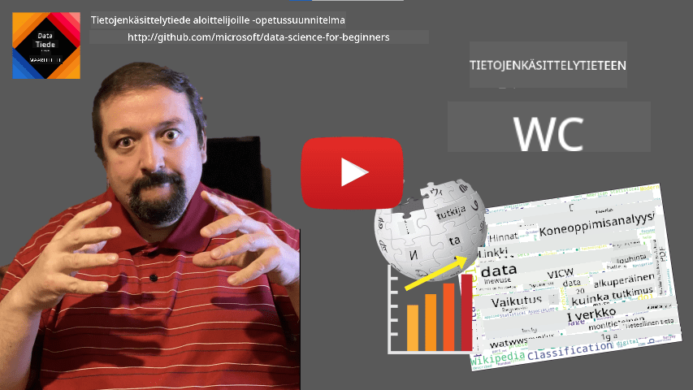
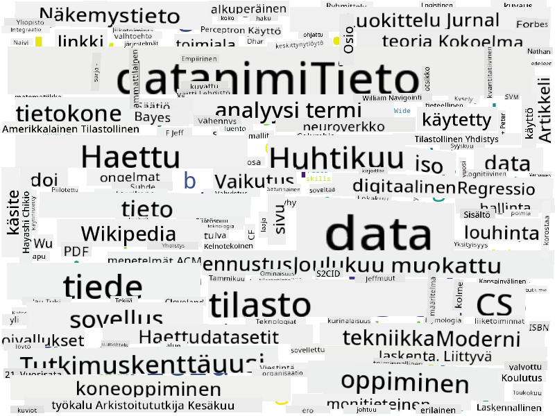

<!--
CO_OP_TRANSLATOR_METADATA:
{
  "original_hash": "2583a9894af7123b2fcae3376b14c035",
  "translation_date": "2025-08-26T21:33:30+00:00",
  "source_file": "1-Introduction/01-defining-data-science/README.md",
  "language_code": "fi"
}
-->
# Määritellään datatiede

|  ](../../sketchnotes/01-Definitions.png) |
| :----------------------------------------------------------------------------------------------------: |
|              Datatieteen määritelmä - _Sketchnote by [@nitya](https://twitter.com/nitya)_              |

---

## [Esiluento-kysely](https://purple-hill-04aebfb03.1.azurestaticapps.net/quiz/0)

## Mitä data on?
Arjessamme olemme jatkuvasti datan ympäröimiä. Teksti, jota luet juuri nyt, on dataa. Ystäviesi puhelinnumerolista älypuhelimessasi on dataa, samoin kuin kellossasi näkyvä nykyinen aika. Ihmisinä käsittelemme luonnostaan dataa esimerkiksi laskemalla rahojamme tai kirjoittamalla kirjeitä ystävillemme.

Tietokoneiden myötä datasta tuli kuitenkin paljon tärkeämpää. Tietokoneiden päätehtävä on suorittaa laskutoimituksia, mutta ne tarvitsevat dataa toimiakseen. Siksi meidän on ymmärrettävä, miten tietokoneet tallentavat ja käsittelevät dataa.

Internetin myötä tietokoneiden rooli datan käsittelylaitteina kasvoi. Jos mietit asiaa, käytämme nykyään tietokoneita yhä enemmän datan käsittelyyn ja viestintään kuin varsinaisiin laskutoimituksiin. Kun kirjoitamme sähköpostia ystävälle tai etsimme tietoa internetistä, luomme, tallennamme, siirrämme ja käsittelemme dataa.
> Muistatko, milloin viimeksi käytit tietokonetta varsinaiseen laskemiseen?

## Mitä on datatiede?

[Wikipedian](https://en.wikipedia.org/wiki/Data_science) mukaan **datatiede** määritellään *tieteelliseksi alaksi, joka käyttää tieteellisiä menetelmiä tiedon ja oivallusten hankkimiseen rakenteisesta ja rakenteettomasta datasta sekä soveltaa näitä oivalluksia monilla eri sovellusalueilla*.

Tämä määritelmä korostaa seuraavia datatieteen tärkeitä piirteitä:

* Datatieteen päätavoite on **hankkia tietoa** datasta, toisin sanoen **ymmärtää** dataa, löytää piilotettuja yhteyksiä ja luoda **malleja**.
* Datatiede käyttää **tieteellisiä menetelmiä**, kuten todennäköisyyslaskentaa ja tilastotiedettä. Kun termi *datatiede* otettiin ensimmäistä kertaa käyttöön, jotkut väittivät, että se oli vain uusi hieno nimi tilastotieteelle. Nykyään on selvää, että ala on paljon laajempi.
* Hankittua tietoa tulisi soveltaa tuottamaan **käytännön oivalluksia**, eli käytännöllisiä näkemyksiä, joita voidaan hyödyntää todellisissa liiketoimintatilanteissa.
* Meidän tulisi pystyä käsittelemään sekä **rakenteista** että **rakenteetonta** dataa. Palaamme myöhemmin kurssilla keskustelemaan eri datatyypeistä.
* **Sovellusalue** on tärkeä käsite, ja datatieteilijöillä on usein oltava ainakin jonkin verran asiantuntemusta ongelma-alueesta, esimerkiksi rahoituksesta, lääketieteestä tai markkinoinnista.

> Toinen tärkeä datatieteen osa-alue on se, että se tutkii, miten dataa voidaan kerätä, tallentaa ja käsitellä tietokoneilla. Vaikka tilastotiede antaa meille matemaattiset perusteet, datatiede soveltaa matemaattisia käsitteitä saadakseen todellisia oivalluksia datasta.

Yksi tapa (liitetty [Jim Grayhin](https://en.wikipedia.org/wiki/Jim_Gray_(computer_scientist))) tarkastella datatiedettä on pitää sitä erillisenä tieteen paradigmana:
* **Empiirinen**, jossa luotamme pääasiassa havaintoihin ja kokeiden tuloksiin
* **Teoreettinen**, jossa uudet käsitteet syntyvät olemassa olevasta tieteellisestä tiedosta
* **Laskennallinen**, jossa löydämme uusia periaatteita laskennallisten kokeiden avulla
* **Dataohjautuva**, jossa löydämme suhteita ja kuvioita datasta  

## Muita läheisiä aloja

Koska data on kaikkialla, myös datatiede on laaja ala, joka koskettaa monia muita tieteenaloja.

## Datatyypit

Kuten jo mainitsimme, dataa on kaikkialla. Meidän tarvitsee vain tallentaa se oikealla tavalla! On hyödyllistä erottaa toisistaan **rakenteinen** ja **rakenteeton** data. Ensimmäinen on tyypillisesti esitetty hyvin jäsennellyssä muodossa, usein taulukkona tai useina taulukoina, kun taas jälkimmäinen on vain kokoelma tiedostoja. Joskus voimme myös puhua **puolistrukturoidusta** datasta, jolla on jonkinlainen rakenne, joka voi vaihdella suuresti.

| Rakenteinen                                                                | Puolistrukturoitu                                                                            | Rakenteeton                          |
| -------------------------------------------------------------------------- | ------------------------------------------------------------------------------------------- | ------------------------------------ |
| Lista ihmisistä ja heidän puhelinnumeroistaan                              | Wikipedian sivut linkkeineen                                                                | Encyclopedia Britannican teksti      |
| Rakennuksen kaikkien huoneiden lämpötila joka minuutti viimeisen 20 vuoden ajalta | Tieteellisten artikkelien kokoelma JSON-muodossa, sisältäen kirjoittajat, julkaisupäivän ja tiivistelmän | Yrityksen asiakirjojen tiedostokansio |
| Rakennukseen saapuvien ihmisten ikä- ja sukupuolitiedot                    | Internet-sivut                                                                              | Valvontakameran raakavideomateriaali |

## Mistä dataa saa?

Datalla on lukemattomia mahdollisia lähteitä, eikä kaikkia voi listata! Mainitaan kuitenkin joitakin tyypillisiä paikkoja, joista dataa voi saada:

* **Rakenteinen**
  - **Esineiden internet** (IoT), mukaan lukien erilaiset sensorit, kuten lämpötila- tai paineanturit, tuottavat paljon hyödyllistä dataa. Esimerkiksi, jos toimistorakennus on varustettu IoT-sensoreilla, voimme automaattisesti ohjata lämmitystä ja valaistusta kustannusten minimoimiseksi.
  - **Kyselyt**, joita pyydämme käyttäjiä täyttämään esimerkiksi ostoksen jälkeen tai verkkosivustolla vierailun jälkeen.
  - **Käyttäytymisanalyysi** voi auttaa meitä ymmärtämään esimerkiksi, kuinka syvälle käyttäjä menee sivustolla ja mikä on tyypillinen syy sivustolta poistumiseen.
* **Rakenteeton**
  - **Tekstit** voivat olla rikas oivallusten lähde, kuten yleinen **tunnelmapisteytys** tai avainsanojen ja semanttisen merkityksen poimiminen.
  - **Kuvat** tai **videot**. Valvontakameran videoita voidaan käyttää liikenteen arvioimiseen ja ihmisten tiedottamiseen mahdollisista ruuhkista.
  - Verkkopalvelimen **lokitiedostot** voivat auttaa ymmärtämään, mitkä sivuston sivut ovat suosituimpia ja kuinka kauan niillä viivytään.
* **Puolistrukturoitu**
  - **Sosiaalisen verkoston** graafit voivat olla loistavia tietolähteitä käyttäjien persoonallisuuksista ja potentiaalisesta tehokkuudesta tiedon levittämisessä.
  - Kun meillä on joukko valokuvia juhlista, voimme yrittää poimia **ryhmädynamiikkaa** rakentamalla graafin ihmisistä, jotka ottavat kuvia yhdessä.

Kun tunnet erilaiset mahdolliset datalähteet, voit miettiä erilaisia skenaarioita, joissa datatieteen tekniikoita voidaan soveltaa tilanteen ymmärtämiseksi paremmin ja liiketoimintaprosessien parantamiseksi.

## Mitä datalla voi tehdä?

Datatieteessä keskitymme seuraaviin datan käsittelyn vaiheisiin:

Tietenkin, riippuen itse datasta, jotkin vaiheet voivat puuttua (esim. kun data on jo tietokannassa tai kun mallin koulutusta ei tarvita), tai jotkin vaiheet voivat toistua useita kertoja (kuten datan käsittely).

## Digitalisaatio ja digitaalinen transformaatio

Viimeisen vuosikymmenen aikana monet yritykset ovat alkaneet ymmärtää datan merkityksen liiketoimintapäätösten tekemisessä. Jotta datatieteen periaatteita voidaan soveltaa liiketoiminnan johtamiseen, on ensin kerättävä dataa, eli muutettava liiketoimintaprosessit digitaaliseen muotoon. Tätä kutsutaan **digitalisaatioksi**. Datatieteen tekniikoiden soveltaminen tähän dataan päätöksenteon ohjaamiseksi voi johtaa merkittäviin tuottavuuden kasvuun (tai jopa liiketoiminnan suunnanmuutokseen), jota kutsutaan **digitaaliseksi transformaatioksi**.

Otetaan esimerkki. Oletetaan, että meillä on datatieteen kurssi (kuten tämä), jonka toimitamme verkossa opiskelijoille, ja haluamme käyttää datatiedettä sen parantamiseen. Miten voimme tehdä sen?

Voimme aloittaa kysymällä "Mitä voidaan digitalisoida?" Yksinkertaisin tapa olisi mitata, kuinka kauan jokaisella opiskelijalla kestää suorittaa kukin moduuli, ja mitata hankittu tieto antamalla monivalintatesti kunkin moduulin lopussa. Laskemalla keskimääräisen suoritusajan kaikille opiskelijoille voimme selvittää, mitkä moduulit aiheuttavat eniten vaikeuksia opiskelijoille, ja työskennellä niiden yksinkertaistamiseksi.
Voit väittää, että tämä lähestymistapa ei ole ihanteellinen, koska moduulit voivat olla eripituisia. On luultavasti oikeudenmukaisempaa jakaa aika moduulin pituudella (merkkien lukumäärällä) ja verrata näitä arvoja sen sijaan.
Kun alamme analysoida monivalintakokeiden tuloksia, voimme yrittää selvittää, mitkä käsitteet ovat opiskelijoille vaikeita ymmärtää, ja käyttää tätä tietoa sisällön parantamiseen. Tämän saavuttamiseksi meidän on suunniteltava kokeet siten, että jokainen kysymys liittyy tiettyyn käsitteeseen tai tietokokonaisuuteen.

Jos haluamme mennä vielä pidemmälle, voimme piirtää kaavion, jossa kunkin moduulin suorittamiseen käytetty aika asetetaan vastakkain opiskelijoiden ikäryhmien kanssa. Saatamme huomata, että joillekin ikäryhmille moduulin suorittaminen vie suhteettoman kauan tai että opiskelijat keskeyttävät ennen sen suorittamista. Tämä voi auttaa meitä antamaan ikäsuosituksia moduulille ja vähentämään ihmisten tyytymättömyyttä väärien odotusten vuoksi.

## 🚀 Haaste

Tässä haasteessa yritämme löytää Data Science -alaan liittyviä käsitteitä tarkastelemalla tekstejä. Otamme Wikipedia-artikkelin Data Sciencesta, lataamme ja käsittelemme tekstin, ja rakennamme sitten sanapilven, joka näyttää tältä:

Vieraile tiedostossa [`notebook.ipynb`](../../../../../../../../../1-Introduction/01-defining-data-science/notebook.ipynb ':ignore') lukeaksesi koodin läpi. Voit myös suorittaa koodin ja nähdä, kuinka se tekee kaikki datamuunnokset reaaliajassa.

> Jos et tiedä, miten suorittaa koodia Jupyter Notebookissa, tutustu [tähän artikkeliin](https://soshnikov.com/education/how-to-execute-notebooks-from-github/).

## [Luennon jälkeinen kysely](https://purple-hill-04aebfb03.1.azurestaticapps.net/quiz/1)

## Tehtävät

* **Tehtävä 1**: Muokkaa yllä olevaa koodia löytääksesi liittyviä käsitteitä **Big Data**- ja **Machine Learning** -aloille.
* **Tehtävä 2**: [Pohdi Data Science -skenaarioita](assignment.md)

## Kiitokset

Tämän oppitunnin on kirjoittanut ♥️:lla [Dmitry Soshnikov](http://soshnikov.com)

---

**Vastuuvapauslauseke**:  
Tämä asiakirja on käännetty käyttämällä tekoälypohjaista käännöspalvelua [Co-op Translator](https://github.com/Azure/co-op-translator). Vaikka pyrimme tarkkuuteen, huomioithan, että automaattiset käännökset voivat sisältää virheitä tai epätarkkuuksia. Alkuperäistä asiakirjaa sen alkuperäisellä kielellä tulisi pitää ensisijaisena lähteenä. Kriittisen tiedon osalta suositellaan ammattimaista ihmiskäännöstä. Emme ole vastuussa väärinkäsityksistä tai virhetulkinnoista, jotka johtuvat tämän käännöksen käytöstä.