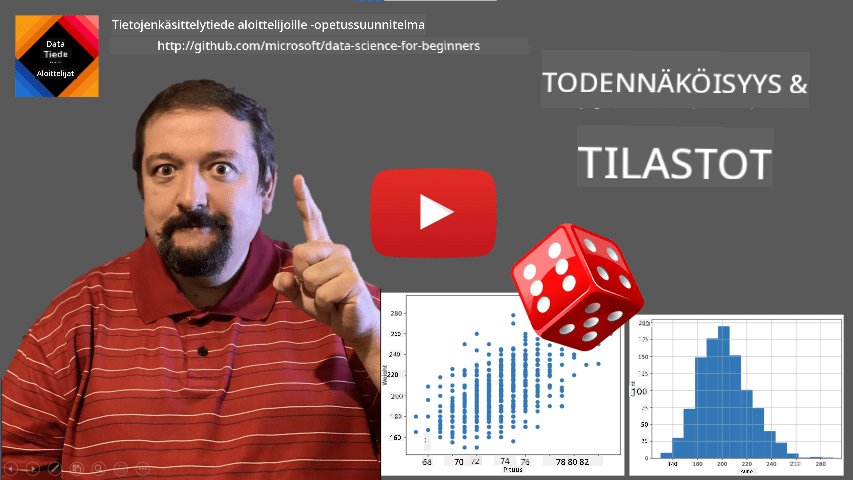
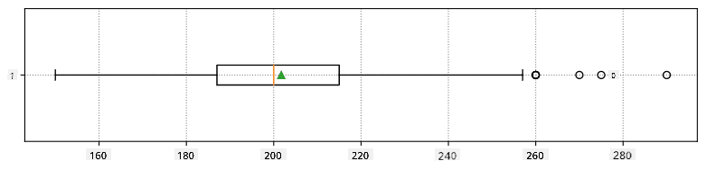
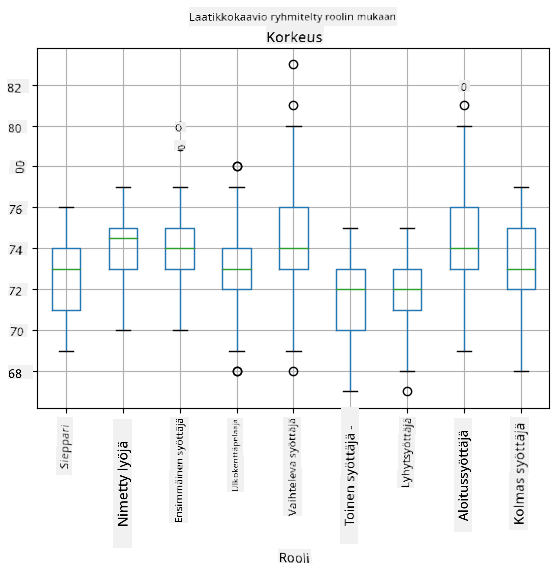
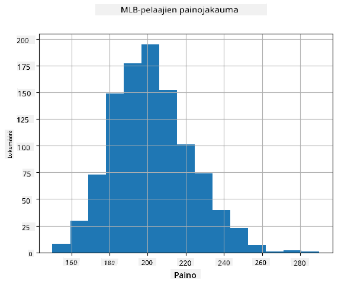
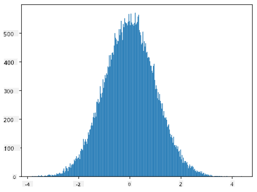
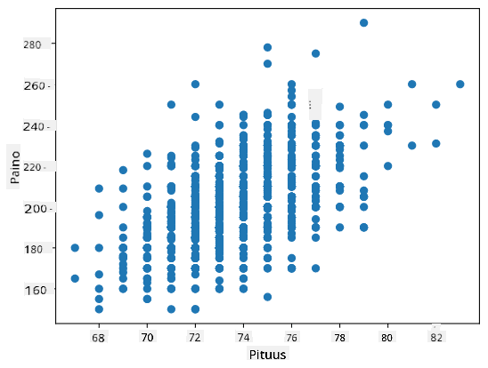

<!--
CO_OP_TRANSLATOR_METADATA:
{
  "original_hash": "b706a07cfa87ba091cbb91e0aa775600",
  "translation_date": "2025-08-26T21:46:18+00:00",
  "source_file": "1-Introduction/04-stats-and-probability/README.md",
  "language_code": "fi"
}
-->
# Lyhyt johdatus tilastotieteeseen ja todennäköisyyksiin

| ](../../sketchnotes/04-Statistics-Probability.png)|
|:---:|
| Tilastotiede ja todennäköisyydet - _Sketchnote by [@nitya](https://twitter.com/nitya)_ |

Tilastotiede ja todennäköisyysteoria ovat kaksi läheisesti toisiinsa liittyvää matematiikan osa-aluetta, jotka ovat erittäin merkityksellisiä datatieteessä. On mahdollista käsitellä dataa ilman syvällistä matematiikan tuntemusta, mutta on silti parempi tuntea ainakin peruskäsitteet. Tässä esittelemme lyhyen johdannon, joka auttaa sinua pääsemään alkuun.

[](https://youtu.be/Z5Zy85g4Yjw)

## [Esiluennon kysely](https://purple-hill-04aebfb03.1.azurestaticapps.net/quiz/6)

## Todennäköisyys ja satunnaismuuttujat

**Todennäköisyys** on luku välillä 0 ja 1, joka ilmaisee, kuinka todennäköinen jokin **tapahtuma** on. Se määritellään positiivisten lopputulosten (jotka johtavat tapahtumaan) lukumääränä jaettuna kaikkien lopputulosten lukumäärällä, olettaen että kaikki lopputulokset ovat yhtä todennäköisiä. Esimerkiksi, kun heitämme noppaa, todennäköisyys saada parillinen luku on 3/6 = 0.5.

Kun puhumme tapahtumista, käytämme **satunnaismuuttujia**. Esimerkiksi satunnaismuuttuja, joka edustaa noppaa heitettäessä saatua lukua, voi saada arvoja välillä 1–6. Lukuja 1–6 kutsutaan **otosavaruudeksi**. Voimme puhua satunnaismuuttujan todennäköisyydestä saada tietty arvo, esimerkiksi P(X=3)=1/6.

Edellisen esimerkin satunnaismuuttujaa kutsutaan **diskreetiksi**, koska sen otosavaruus on laskettavissa, eli siinä on erillisiä arvoja, jotka voidaan luetella. On myös tapauksia, joissa otosavaruus on reaaliarvojen väli tai koko reaaliarvojen joukko. Tällaisia muuttujia kutsutaan **jatkuviksi**. Hyvä esimerkki on bussin saapumisaika.

## Todennäköisyysjakauma

Diskreettien satunnaismuuttujien tapauksessa on helppo kuvata kunkin tapahtuman todennäköisyys funktiolla P(X). Jokaiselle otosavaruuden *S* arvolle *s* se antaa luvun välillä 0 ja 1 siten, että kaikkien P(X=s) arvojen summa kaikille tapahtumille on 1.

Tunnetuin diskreetti jakauma on **tasajakauma**, jossa otosavaruudessa on N elementtiä, joista jokaisen todennäköisyys on 1/N.

Jatkuvan muuttujan todennäköisyysjakauman kuvaaminen on vaikeampaa, kun arvot ovat peräisin jostain välistä [a,b] tai koko reaaliarvojen joukosta ℝ. Mietitään esimerkiksi bussin saapumisaikaa. Todellisuudessa jokaiselle tarkalle saapumisajalle *t* bussin saapumisen todennäköisyys on 0!

> Nyt tiedät, että tapahtumat, joiden todennäköisyys on 0, tapahtuvat, ja vieläpä usein! Ainakin joka kerta, kun bussi saapuu!

Voimme puhua vain muuttujan todennäköisyydestä osua tiettyyn arvojen väliin, esim. P(t<sub>1</sub>≤X<t<sub>2</sub>). Tässä tapauksessa todennäköisyysjakauma kuvataan **todennäköisyystiheysfunktiolla** p(x), siten että


Jatkuvan tasajakauman analogia on **jatkuva tasajakauma**, joka määritellään rajallisella välillä. Todennäköisyys, että arvo X osuu välin pituuteen l, on verrannollinen l:ään ja kasvaa arvoon 1.

Toinen tärkeä jakauma on **normaalijakauma**, josta puhumme tarkemmin myöhemmin.

## Keskiarvo, varianssi ja keskihajonta

Oletetaan, että otamme n näytettä satunnaismuuttujasta X: x<sub>1</sub>, x<sub>2</sub>, ..., x<sub>n</sub>. Voimme määritellä **keskiarvon** (tai **aritmeettisen keskiarvon**) perinteisellä tavalla (x<sub>1</sub>+x<sub>2</sub>+x<sub>n</sub>)/n. Kun kasvatamme otoksen kokoa (eli otamme rajan n→∞), saamme jakauman keskiarvon (jota kutsutaan myös **odotusarvoksi**). Merkitsemme odotusarvon **E**(x).

> On osoitettavissa, että mille tahansa diskreetille jakaumalle, jonka arvot ovat {x<sub>1</sub>, x<sub>2</sub>, ..., x<sub>N</sub>} ja vastaavat todennäköisyydet p<sub>1</sub>, p<sub>2</sub>, ..., p<sub>N</sub>, odotusarvo on E(X)=x<sub>1</sub>p<sub>1</sub>+x<sub>2</sub>p<sub>2</sub>+...+x<sub>N</sub>p<sub>N</sub>.

Arvojen hajonnan tunnistamiseksi voimme laskea varianssin σ<sup>2</sup> = ∑(x<sub>i</sub> - μ)<sup>2</sup>/n, missä μ on otoksen keskiarvo. Arvoa σ kutsutaan **keskihajonnaksi**, ja σ<sup>2</sup> kutsutaan **varianssiksi**.

## Moodi, mediaani ja kvartiilit

Joskus keskiarvo ei kuvaa riittävän hyvin "tyypillistä" arvoa datalle. Esimerkiksi, kun on muutama äärimmäinen arvo, jotka ovat täysin poikkeavia, ne voivat vaikuttaa keskiarvoon. Toinen hyvä indikaattori on **mediaani**, arvo, jonka alapuolella on puolet datapisteistä ja yläpuolella toinen puoli.

Datajakauman ymmärtämiseksi on hyödyllistä puhua **kvartiileista**:

* Ensimmäinen kvartiili, eli Q1, on arvo, jonka alapuolella on 25 % datasta
* Kolmas kvartiili, eli Q3, on arvo, jonka alapuolella on 75 % datasta

Graafisesti voimme esittää mediaanin ja kvartiilien suhteen diagrammissa, jota kutsutaan **laatikko-kaavioksi**:


Tässä laskemme myös **kvartiilivälin** IQR=Q3-Q1 ja niin sanotut **poikkeamat** - arvot, jotka ovat alueen [Q1-1.5*IQR,Q3+1.5*IQR] ulkopuolella.

Pienelle mahdollisten arvojen joukolle hyvä "tyypillinen" arvo on se, joka esiintyy useimmin, ja sitä kutsutaan **moodiksi**. Sitä käytetään usein kategorisessa datassa, kuten väreissä. Mietitään tilannetta, jossa meillä on kaksi ryhmää ihmisiä - osa, jotka suosivat vahvasti punaista, ja toiset, jotka suosivat sinistä. Jos koodaisimme värit numeroilla, suosikkivärin keskiarvo olisi jossain oranssin ja vihreän spektrissä, mikä ei kuvaisi kummankaan ryhmän todellista mieltymystä. Moodi olisi kuitenkin joko yksi väreistä tai molemmat värit, jos niiden kannattajien määrä on sama (tässä tapauksessa otosta kutsutaan **monimoodiseksi**).

## Reaaliaikainen data

Kun analysoimme tosielämän dataa, ne eivät usein ole satunnaismuuttujia siinä mielessä, että emme tee kokeita tuntemattomalla lopputuloksella. Esimerkiksi, mietitään baseball-joukkueen pelaajia ja heidän kehon tietojaan, kuten pituutta, painoa ja ikää. Nämä luvut eivät ole täysin satunnaisia, mutta voimme silti soveltaa samoja matemaattisia käsitteitä. Esimerkiksi ihmisten painojen sarjaa voidaan pitää satunnaismuuttujan arvojen sarjana. Alla on Major League Baseball -pelaajien painojen sarja [tästä datasetistä](http://wiki.stat.ucla.edu/socr/index.php/SOCR_Data_MLB_HeightsWeights) (mukavuuden vuoksi vain ensimmäiset 20 arvoa näytetään):

```
[180.0, 215.0, 210.0, 210.0, 188.0, 176.0, 209.0, 200.0, 231.0, 180.0, 188.0, 180.0, 185.0, 160.0, 180.0, 185.0, 197.0, 189.0, 185.0, 219.0]
```

> **Huomio**: Katso esimerkki tämän datasetin käsittelystä [liitteenä olevasta muistikirjasta](notebook.ipynb). Tämän oppitunnin aikana on myös useita haasteita, jotka voit suorittaa lisäämällä koodia muistikirjaan. Jos et ole varma, miten käsitellä dataa, älä huoli - palaamme datan käsittelyyn Pythonilla myöhemmin. Jos et tiedä, miten suorittaa koodia Jupyter Notebookissa, katso [tämä artikkeli](https://soshnikov.com/education/how-to-execute-notebooks-from-github/).

Tässä on laatikko-kaavio, joka näyttää keskiarvon, mediaanin ja kvartiilit datallemme:



Koska datamme sisältää tietoa eri pelaajien **rooleista**, voimme myös tehdä laatikko-kaavion roolin mukaan - tämä antaa meille käsityksen siitä, miten parametrit eroavat roolien välillä. Tällä kertaa tarkastelemme pituutta:



Tämä diagrammi viittaa siihen, että keskimäärin ensimmäisen pesän pelaajien pituus on suurempi kuin toisen pesän pelaajien pituus. Myöhemmin tässä oppitunnissa opimme, miten voimme testata tätä hypoteesia muodollisemmin ja miten voimme osoittaa, että datamme on tilastollisesti merkittävää tämän osoittamiseksi.

> Kun työskentelemme tosielämän datan kanssa, oletamme, että kaikki datapisteet ovat otoksia jostain todennäköisyysjakaumasta. Tämä oletus mahdollistaa koneoppimistekniikoiden soveltamisen ja toimivien ennustemallien rakentamisen.

Jotta voimme nähdä, millainen datamme jakauma on, voimme piirtää diagrammin, jota kutsutaan **histogrammiksi**. X-akselilla on eri painovälien lukumäärä (niin sanotut **binit**), ja pystyakseli näyttää, kuinka monta kertaa satunnaismuuttujan otos oli kyseisessä välissä.



Tästä histogrammista näet, että kaikki arvot keskittyvät tietyn keskimääräisen painon ympärille, ja mitä kauemmas keskimääräisestä painosta mennään, sitä harvemmin kyseisen painon arvoja esiintyy. Eli on hyvin epätodennäköistä, että baseball-pelaajan paino poikkeaisi merkittävästi keskimääräisestä painosta. Painojen varianssi osoittaa, kuinka paljon painot todennäköisesti eroavat keskiarvosta.

> Jos otamme muiden ihmisten painoja, jotka eivät ole baseball-liigasta, jakauma on todennäköisesti erilainen. Jakauman muoto pysyy kuitenkin samana, mutta keskiarvo ja varianssi muuttuvat. Joten jos koulutamme mallimme baseball-pelaajilla, se todennäköisesti antaa vääriä tuloksia, kun sitä sovelletaan yliopisto-opiskelijoihin, koska taustalla oleva jakauma on erilainen.

## Normaalijakauma

Painojen jakauma, jonka näimme yllä, on hyvin tyypillinen, ja monet tosielämän mittaukset noudattavat samaa tyyppistä jakaumaa, mutta eri keskiarvolla ja varianssilla. Tätä jakaumaa kutsutaan **normaalijakaumaksi**, ja sillä on erittäin tärkeä rooli tilastotieteessä.

Normaalijakauman käyttäminen on oikea tapa luoda satunnaisia painoja potentiaalisille baseball-pelaajille. Kun tiedämme keskimääräisen painon `mean` ja keskihajonnan `std`, voimme luoda 1000 painonäytettä seuraavalla tavalla:
```python
samples = np.random.normal(mean,std,1000)
``` 

Jos piirrämme luotujen näytteiden histogrammin, näemme kuvan, joka on hyvin samanlainen kuin yllä esitetty. Ja jos lisäämme näytteiden määrää ja binien määrää, voimme luoda kuvan normaalijakaumasta, joka on lähempänä ihanteellista:



*Normaalijakauma keskiarvolla=0 ja keskihajonnalla=1*

## Luottamusvälit

Kun puhumme baseball-pelaajien painoista, oletamme, että on olemassa tietty **satunnaismuuttuja W**, joka vastaa kaikkien baseball-pelaajien painojen ideaalista todennäköisyysjakaumaa (niin sanottu **populaatio**). Painojemme sarja vastaa kaikkien baseball-pelaajien alijoukkoa, jota kutsumme **otokseksi**. Mielenkiintoinen kysymys on, voimmeko tietää W:n jakauman parametrit, eli populaation keskiarvon ja varianssin?

Helpoin vastaus olisi laskea otoksen keskiarvo ja varianssi. Kuitenkin voi käydä niin, että satunnainen otoksemme ei edusta tarkasti koko populaatiota. Siksi on järkevää puhua **luottamusvälistä**.
> **Luottamusväli** on arvio populaation todellisesta keskiarvosta annetun otoksen perusteella, joka on tarkka tietyllä todennäköisyydellä (tai **luottamustasolla**).
Oletetaan, että meillä on otos X<sub>1</sub>, ..., X<sub>n</sub> jakaumastamme. Joka kerta, kun otamme otoksen jakaumastamme, saamme eri keskiarvon μ. Näin ollen μ voidaan pitää satunnaismuuttujana. **Luottamusväli** luottamustasolla p on arvojen pari (L<sub>p</sub>,R<sub>p</sub>), siten että **P**(L<sub>p</sub>≤μ≤R<sub>p</sub>) = p, eli todennäköisyys, että mitattu keskiarvo osuu välin sisään, on p.

On tämän lyhyen johdannon ulkopuolella käsitellä yksityiskohtaisesti, miten nämä luottamusvälit lasketaan. Lisätietoja löytyy [Wikipediasta](https://en.wikipedia.org/wiki/Confidence_interval). Lyhyesti sanottuna määrittelemme lasketun otoskeskiarvon jakauman suhteessa populaation todelliseen keskiarvoon, jota kutsutaan **Studentin jakaumaksi**.

> **Mielenkiintoinen fakta**: Studentin jakauma on nimetty matemaatikko William Sealy Gossetin mukaan, joka julkaisi artikkelinsa salanimellä "Student". Hän työskenteli Guinnessin panimossa, ja erään version mukaan hänen työnantajansa ei halunnut yleisön tietävän, että he käyttivät tilastollisia testejä raaka-aineiden laadun määrittämiseen.

Jos haluamme arvioida populaation keskiarvon μ luottamustasolla p, meidän täytyy ottaa *(1-p)/2-prosenttipiste* Studentin jakaumasta A, joka voidaan joko hakea taulukoista tai laskea tilasto-ohjelmistojen sisäänrakennetuilla funktioilla (esim. Python, R jne.). Tällöin μ:n väli olisi X±A*D/√n, missä X on otoksen saatu keskiarvo ja D on keskihajonta.

> **Huomio**: Emme myöskään käsittele tärkeää käsitettä [vapausasteet](https://en.wikipedia.org/wiki/Degrees_of_freedom_(statistics)), joka on merkittävä Studentin jakauman yhteydessä. Voit tutustua kattavampiin tilastotieteen kirjoihin ymmärtääksesi tämän käsitteen syvällisemmin.

Esimerkki painojen ja pituuksien luottamusvälin laskemisesta löytyy [liitetyistä muistikirjoista](notebook.ipynb).

| p    | Painon keskiarvo |
|------|------------------|
| 0.85 | 201.73±0.94      |
| 0.90 | 201.73±1.08      |
| 0.95 | 201.73±1.28      |

Huomaa, että mitä korkeampi luottamustodennäköisyys on, sitä laajempi on luottamusväli.

## Hypoteesin testaus

Baseball-pelaajien aineistossamme on erilaisia pelaajarooleja, jotka voidaan tiivistää alla olevaan taulukkoon (katso [liitetty muistikirja](notebook.ipynb), jossa näytetään, miten tämä taulukko voidaan laskea):

| Rooli             | Pituus     | Paino      | Määrä |
|-------------------|------------|------------|-------|
| Catcher           | 72.723684  | 204.328947 | 76    |
| Designated_Hitter | 74.222222  | 220.888889 | 18    |
| First_Baseman     | 74.000000  | 213.109091 | 55    |
| Outfielder        | 73.010309  | 199.113402 | 194   |
| Relief_Pitcher    | 74.374603  | 203.517460 | 315   |
| Second_Baseman    | 71.362069  | 184.344828 | 58    |
| Shortstop         | 71.903846  | 182.923077 | 52    |
| Starting_Pitcher  | 74.719457  | 205.163636 | 221   |
| Third_Baseman     | 73.044444  | 200.955556 | 45    |

Voimme huomata, että ensimmäisten basemenien keskipituus on suurempi kuin toisten basemenien. Näin ollen voimme olla houkuteltuja päättelemään, että **ensimmäiset basemenit ovat pidempiä kuin toiset basemenit**.

> Tätä väitettä kutsutaan **hypoteesiksi**, koska emme tiedä, onko se tosiasiallisesti totta vai ei.

Kuitenkin ei ole aina selvää, voimmeko tehdä tämän johtopäätöksen. Yllä olevasta keskustelusta tiedämme, että jokaisella keskiarvolla on siihen liittyvä luottamusväli, ja näin ollen tämä ero voi olla vain tilastollinen virhe. Tarvitsemme jonkin muodollisemman tavan testata hypoteesimme.

Lasketaan luottamusvälit erikseen ensimmäisten ja toisten basemenien pituuksille:

| Luottamus | Ensimmäiset basemenit | Toiset basemenit |
|-----------|-----------------------|------------------|
| 0.85      | 73.62..74.38          | 71.04..71.69     |
| 0.90      | 73.56..74.44          | 70.99..71.73     |
| 0.95      | 73.47..74.53          | 70.92..71.81     |

Voimme nähdä, että millään luottamustasolla välit eivät mene päällekkäin. Tämä todistaa hypoteesimme, että ensimmäiset basemenit ovat pidempiä kuin toiset basemenit.

Muodollisemmin, ongelma, jota ratkaisemme, on nähdä, ovatko **kaksi todennäköisyysjakaumaa samat**, tai ainakin onko niillä samat parametrit. Riippuen jakaumasta, meidän täytyy käyttää erilaisia testejä. Jos tiedämme, että jakaumamme ovat normaalijakaumia, voimme soveltaa **[Studentin t-testiä](https://en.wikipedia.org/wiki/Student%27s_t-test)**.

Studentin t-testissä laskemme niin sanotun **t-arvon**, joka osoittaa keskiarvojen eron ottaen huomioon varianssin. On osoitettu, että t-arvo noudattaa **Studentin jakaumaa**, mikä mahdollistaa kynnysarvon saamisen annetulle luottamustasolle **p** (tämä voidaan laskea tai katsoa numeerisista taulukoista). Sitten vertaamme t-arvoa tähän kynnysarvoon hyväksyäksemme tai hylätäksemme hypoteesin.

Pythonissa voimme käyttää **SciPy**-kirjastoa, joka sisältää `ttest_ind`-funktion (monien muiden hyödyllisten tilastollisten funktioiden lisäksi!). Se laskee t-arvon puolestamme ja tekee myös käänteisen luottamustason p-arvon haun, jotta voimme vain katsoa luottamustasoa tehdäksemme johtopäätöksen.

Esimerkiksi vertailumme ensimmäisten ja toisten basemenien pituuksista antaa seuraavat tulokset: 
```python
from scipy.stats import ttest_ind

tval, pval = ttest_ind(df.loc[df['Role']=='First_Baseman',['Height']], df.loc[df['Role']=='Designated_Hitter',['Height']],equal_var=False)
print(f"T-value = {tval[0]:.2f}\nP-value: {pval[0]}")
```
```
T-value = 7.65
P-value: 9.137321189738925e-12
```
Tässä tapauksessa p-arvo on hyvin alhainen, mikä tarkoittaa, että on vahvaa näyttöä siitä, että ensimmäiset basemenit ovat pidempiä.

On myös muita hypoteeseja, joita voimme haluta testata, esimerkiksi:
* Todistaa, että annettu otos noudattaa jotain jakaumaa. Esimerkissämme oletimme, että pituudet ovat normaalijakautuneita, mutta tämä vaatii muodollisen tilastollisen vahvistuksen.
* Todistaa, että otoksen keskiarvo vastaa jotain ennalta määriteltyä arvoa
* Verrata useiden otosten keskiarvoja (esim. mikä on onnellisuustasojen ero eri ikäryhmien välillä)

## Suurten lukujen laki ja keskeinen raja-arvolause

Yksi syy siihen, miksi normaalijakauma on niin tärkeä, on niin sanottu **keskeinen raja-arvolause**. Oletetaan, että meillä on suuri otos riippumattomia N arvoja X<sub>1</sub>, ..., X<sub>N</sub>, jotka on otettu mistä tahansa jakaumasta, jonka keskiarvo on μ ja varianssi σ<sup>2</sup>. Tällöin, kun N on riittävän suuri (toisin sanoen kun N→∞), keskiarvo Σ<sub>i</sub>X<sub>i</sub> on normaalijakautunut, keskiarvolla μ ja varianssilla σ<sup>2</sup>/N.

> Toinen tapa tulkita keskeistä raja-arvolausetta on sanoa, että riippumatta jakaumasta, kun lasket minkä tahansa satunnaismuuttujan arvojen summan keskiarvon, päädyt normaalijakaumaan.

Keskeisestä raja-arvolauseesta seuraa myös, että kun N→∞, otoskeskiarvon todennäköisyys olla yhtä suuri kuin μ lähestyy arvoa 1. Tätä kutsutaan **suurten lukujen laiksi**.

## Kovaranssi ja korrelaatio

Yksi asioista, joita data-analytiikka tekee, on löytää yhteyksiä datan välillä. Sanomme, että kaksi jonoa **korreloivat**, kun ne käyttäytyvät samankaltaisesti samaan aikaan, eli ne joko nousevat/laskevat samanaikaisesti tai toinen nousee, kun toinen laskee ja päinvastoin. Toisin sanoen, niiden välillä näyttää olevan jokin yhteys.

> Korrelaatio ei välttämättä tarkoita kausaalista suhdetta kahden jonon välillä; joskus molemmat muuttujat voivat riippua jostain ulkoisesta syystä, tai voi olla puhdasta sattumaa, että kaksi jonoa korreloivat. Kuitenkin vahva matemaattinen korrelaatio on hyvä indikaatio siitä, että kaksi muuttujaa ovat jollain tavalla yhteydessä.

Matemaattisesti pääkäsite, joka osoittaa kahden satunnaismuuttujan välisen yhteyden, on **kovarianssi**, joka lasketaan näin: Cov(X,Y) = **E**\[(X-**E**(X))(Y-**E**(Y))\]. Laskemme molempien muuttujien poikkeaman niiden keskiarvoista ja sitten näiden poikkeamien tulon. Jos molemmat muuttujat poikkeavat yhdessä, tulo on aina positiivinen arvo, joka lisää positiivista kovarianssia. Jos molemmat muuttujat poikkeavat epäsynkronisesti (eli toinen laskee keskiarvon alapuolelle, kun toinen nousee keskiarvon yläpuolelle), saamme aina negatiivisia lukuja, jotka lisäävät negatiivista kovarianssia. Jos poikkeamat eivät ole riippuvaisia, ne summautuvat suunnilleen nollaan.

Kovarianssin itseisarvo ei kerro paljon siitä, kuinka suuri korrelaatio on, koska se riippuu todellisten arvojen suuruudesta. Normalisoidaksemme sen voimme jakaa kovarianssin molempien muuttujien keskihajonnalla saadaksemme **korrelaation**. Hyvä puoli on, että korrelaatio on aina välillä [-1,1], missä 1 tarkoittaa vahvaa positiivista korrelaatiota arvojen välillä, -1 vahvaa negatiivista korrelaatiota ja 0 ei korrelaatiota lainkaan (muuttujat ovat riippumattomia).

**Esimerkki**: Voimme laskea korrelaation baseball-pelaajien painojen ja pituuksien välillä yllä mainitusta aineistosta:
```python
print(np.corrcoef(weights,heights))
```
Tuloksena saamme **korrelaatiomatriisin**, joka näyttää tältä:
```
array([[1.        , 0.52959196],
       [0.52959196, 1.        ]])
```

> Korrelaatiomatriisi C voidaan laskea mille tahansa määrälle syötejonoja S<sub>1</sub>, ..., S<sub>n</sub>. Arvo C<sub>ij</sub> on korrelaatio S<sub>i</sub>:n ja S<sub>j</sub>:n välillä, ja diagonaalielementit ovat aina 1 (joka on myös S<sub>i</sub>:n itsekorrelaatio).

Tässä tapauksessa arvo 0.53 osoittaa, että painon ja pituuden välillä on jonkin verran korrelaatiota. Voimme myös tehdä hajontakaavion yhdestä arvosta toista vastaan nähdäksesi suhteen visuaalisesti:



> Lisää esimerkkejä korrelaatiosta ja kovarianssista löytyy [liitetyssä muistikirjassa](notebook.ipynb).

## Yhteenveto

Tässä osiossa olemme oppineet:

* datan perus tilastollisia ominaisuuksia, kuten keskiarvo, varianssi, moodi ja kvartiilit
* satunnaismuuttujien erilaisia jakaumia, mukaan lukien normaalijakauma
* kuinka löytää korrelaatio eri ominaisuuksien välillä
* kuinka käyttää matematiikan ja tilastotieteen välineitä hypoteesien todistamiseen
* kuinka laskea satunnaismuuttujan luottamusvälejä annetun otoksen perusteella

Vaikka tämä ei olekaan kattava lista todennäköisyyslaskennan ja tilastotieteen aiheista, sen pitäisi riittää antamaan sinulle hyvä lähtökohta tähän kurssiin.

## 🚀 Haaste

Käytä muistikirjan esimerkkikoodia testataksesi muita hypoteeseja:
1. Ensimmäiset basemenit ovat vanhempia kuin toiset basemenit
2. Ensimmäiset basemenit ovat pidempiä kuin kolmannet basemenit
3. Shortstopit ovat pidempiä kuin toiset basemenit

## [Luennon jälkeinen kysely](https://purple-hill-04aebfb03.1.azurestaticapps.net/quiz/7)

## Kertaus ja itseopiskelu

Todennäköisyyslaskenta ja tilastotiede on niin laaja aihe, että se ansaitsee oman kurssinsa. Jos olet kiinnostunut syventymään teoriaan, voit jatkaa lukemalla joitakin seuraavista kirjoista:

1. [Carlos Fernandez-Granda](https://cims.nyu.edu/~cfgranda/) New Yorkin yliopistosta on laatinut erinomaiset luentomuistiinpanot [Probability and Statistics for Data Science](https://cims.nyu.edu/~cfgranda/pages/stuff/probability_stats_for_DS.pdf) (saatavilla verkossa)
1. [Peter ja Andrew Bruce. Practical Statistics for Data Scientists.](https://www.oreilly.com/library/view/practical-statistics-for/9781491952955/) [[esimerkkikoodi R:ssä](https://github.com/andrewgbruce/statistics-for-data-scientists)]. 
1. [James D. Miller. Statistics for Data Science](https://www.packtpub.com/product/statistics-for-data-science/9781788290678) [[esimerkkikoodi R:ssä](https://github.com/PacktPublishing/Statistics-for-Data-Science)]

## Tehtävä

[Pieni diabetes-tutkimus](assignment.md)

## Kiitokset

Tämän oppitunnin on kirjoittanut ♥️:lla [Dmitry Soshnikov](http://soshnikov.com)

---

**Vastuuvapauslauseke**:  
Tämä asiakirja on käännetty käyttämällä tekoälypohjaista käännöspalvelua [Co-op Translator](https://github.com/Azure/co-op-translator). Vaikka pyrimme tarkkuuteen, huomioithan, että automaattiset käännökset voivat sisältää virheitä tai epätarkkuuksia. Alkuperäinen asiakirja sen alkuperäisellä kielellä tulisi pitää ensisijaisena lähteenä. Kriittisen tiedon osalta suositellaan ammattimaista ihmiskäännöstä. Emme ole vastuussa väärinkäsityksistä tai virhetulkinnoista, jotka johtuvat tämän käännöksen käytöstä.