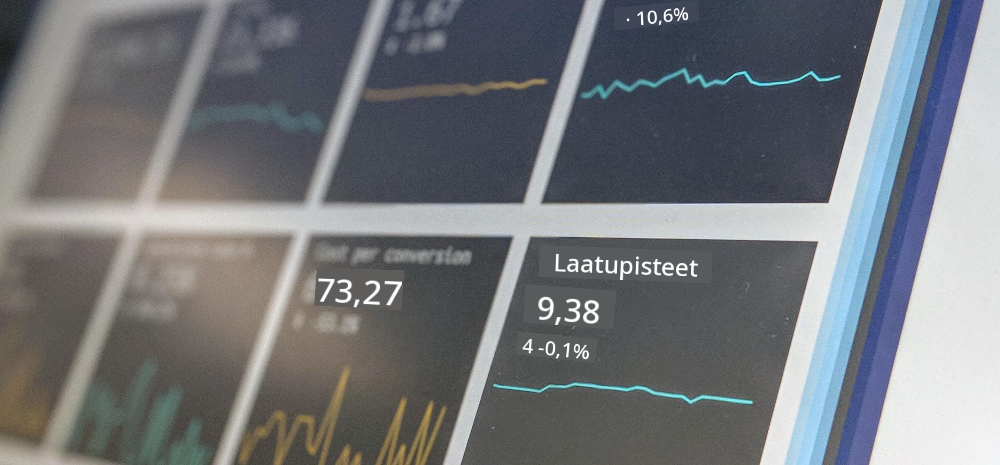

<!--
CO_OP_TRANSLATOR_METADATA:
{
  "original_hash": "696a8474a01054281704cbfb09148949",
  "translation_date": "2025-08-26T21:14:17+00:00",
  "source_file": "1-Introduction/README.md",
  "language_code": "fi"
}
-->
# Johdatus Data Scienceen

> Kuva: <a href="https://unsplash.com/@dawson2406?utm_source=unsplash&utm_medium=referral&utm_content=creditCopyText">Stephen Dawson</a> palvelussa <a href="https://unsplash.com/s/photos/data?utm_source=unsplash&utm_medium=referral&utm_content=creditCopyText">Unsplash</a>
  
Näissä oppitunneissa opit, miten Data Science määritellään, ja tutustut eettisiin näkökohtiin, jotka data scientistin tulee ottaa huomioon. Lisäksi opit, mitä data tarkoittaa, ja saat perustiedot tilastotieteestä ja todennäköisyyslaskennasta, jotka ovat Data Sciencen keskeisiä akateemisia aloja.

### Aiheet

1. [Data Sciencen määrittely](01-defining-data-science/README.md)
2. [Data Sciencen etiikka](02-ethics/README.md)
3. [Datan määrittely](03-defining-data/README.md)
4. [Johdatus tilastotieteeseen ja todennäköisyyslaskentaan](04-stats-and-probability/README.md)

### Tekijät

Nämä oppitunnit on kirjoitettu ❤️:lla [Nitya Narasimhan](https://twitter.com/nitya) ja [Dmitry Soshnikov](https://twitter.com/shwars).

---

**Vastuuvapauslauseke**:  
Tämä asiakirja on käännetty käyttämällä tekoälypohjaista käännöspalvelua [Co-op Translator](https://github.com/Azure/co-op-translator). Vaikka pyrimme tarkkuuteen, huomioithan, että automaattiset käännökset voivat sisältää virheitä tai epätarkkuuksia. Alkuperäistä asiakirjaa sen alkuperäisellä kielellä tulisi pitää ensisijaisena lähteenä. Kriittisen tiedon osalta suositellaan ammattimaista ihmiskäännöstä. Emme ole vastuussa väärinkäsityksistä tai virhetulkinnoista, jotka johtuvat tämän käännöksen käytöstä.