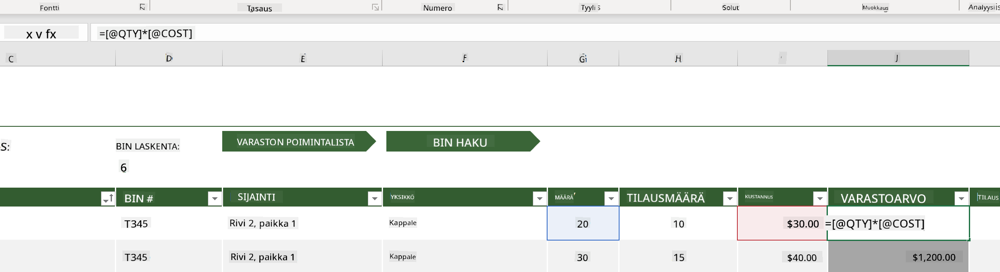
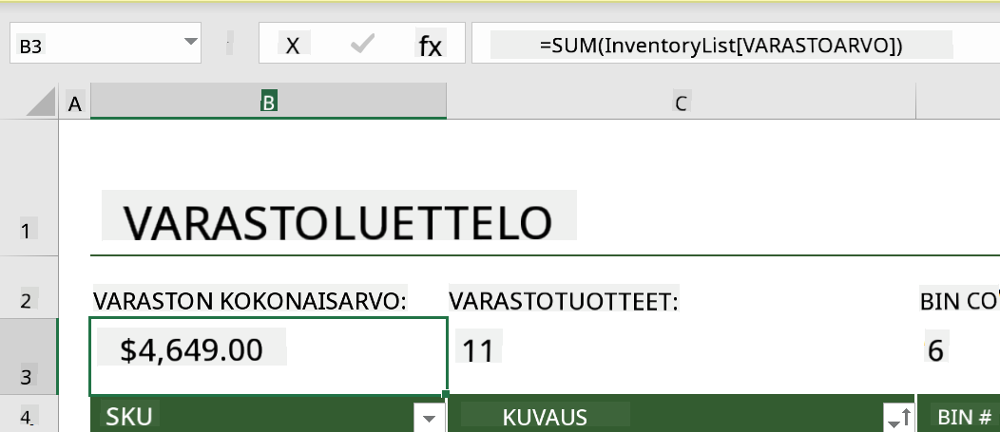
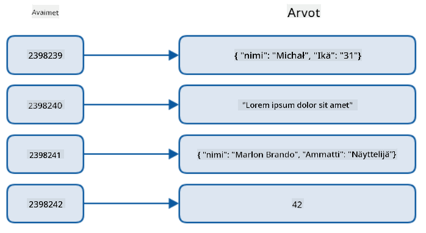
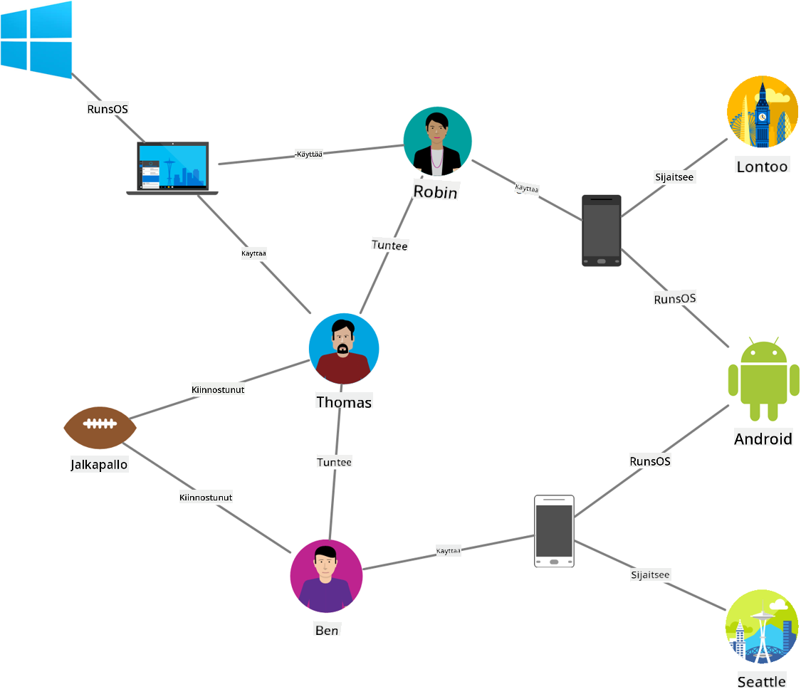
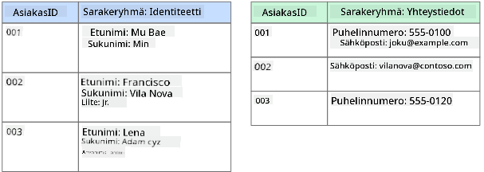
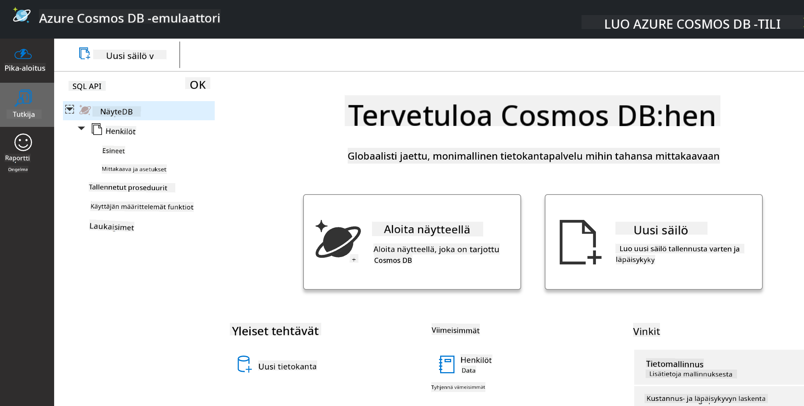
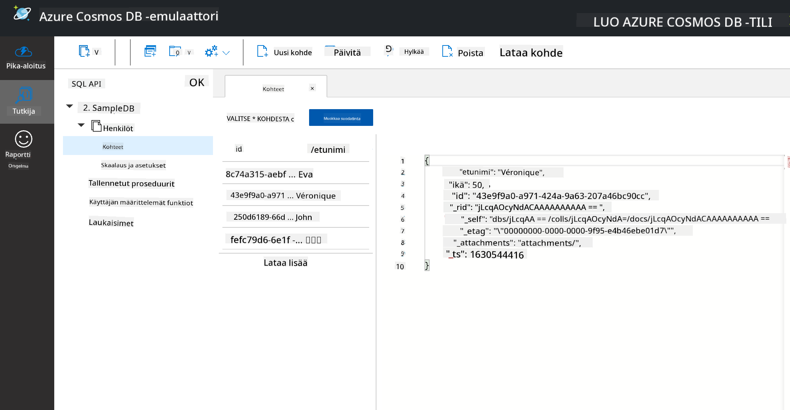
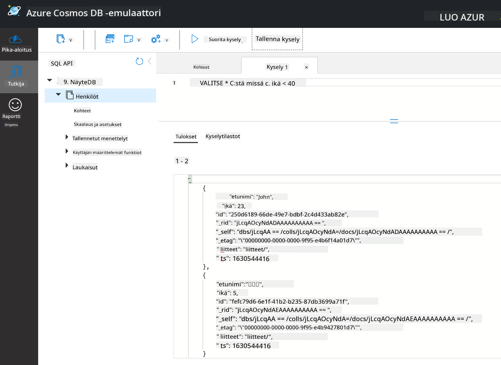

<!--
CO_OP_TRANSLATOR_METADATA:
{
  "original_hash": "32ddfef8121650f2ca2f3416fd283c37",
  "translation_date": "2025-08-26T21:11:19+00:00",
  "source_file": "2-Working-With-Data/06-non-relational/README.md",
  "language_code": "fi"
}
-->
# Työskentely datan kanssa: Ei-relationaalinen data

| ](../../sketchnotes/06-NoSQL.png)|
|:---:|
|Työskentely NoSQL-datan kanssa - _Sketchnote by [@nitya](https://twitter.com/nitya)_ |

## [Esiluennon kysely](https://purple-hill-04aebfb03.1.azurestaticapps.net/quiz/10)

Data ei rajoitu vain relationaalisiin tietokantoihin. Tämä oppitunti keskittyy ei-relationaaliseen dataan ja kattaa taulukkolaskentaohjelmien ja NoSQL:n perusteet.

## Taulukkolaskentaohjelmat

Taulukkolaskentaohjelmat ovat suosittu tapa tallentaa ja tutkia dataa, koska niiden käyttöönotto ja aloittaminen vaatii vähemmän työtä. Tässä oppitunnissa opit taulukkolaskentaohjelman peruskomponentit sekä kaavat ja funktiot. Esimerkit havainnollistetaan Microsoft Excelillä, mutta useimmat osat ja aiheet ovat samankaltaisia verrattuna muihin taulukkolaskentaohjelmiin.


Taulukkolaskentaohjelman tiedosto on käytettävissä tietokoneen, laitteen tai pilvipohjaisen tiedostojärjestelmän kautta. Ohjelmisto voi olla selainpohjainen tai sovellus, joka täytyy asentaa tietokoneelle tai ladata sovelluksena. Excelissä näitä tiedostoja kutsutaan myös **työkirjoiksi**, ja tätä terminologiaa käytetään loppuoppitunnin ajan.

Työkirja sisältää yhden tai useamman **laskentataulukon**, jotka on merkitty välilehdillä. Laskentataulukossa on suorakulmioita, joita kutsutaan **soluiksi**, ja ne sisältävät varsinaisen datan. Solu on rivin ja sarakkeen leikkauspiste, jossa sarakkeet on merkitty aakkosilla ja rivit numeroilla. Joissakin taulukkolaskentaohjelmissa ensimmäiset rivit sisältävät otsikoita, jotka kuvaavat solun dataa.

Näiden Excel-työkirjan peruselementtien avulla käytämme esimerkkiä [Microsoft Templates](https://templates.office.com/) -sivustolta, joka keskittyy varastonhallintaan, ja käymme läpi taulukkolaskentaohjelman lisäosia.

### Varastonhallinta

Taulukkolaskentatiedosto nimeltä "InventoryExample" on muotoiltu varaston kohteiden taulukkolaskenta, joka sisältää kolme laskentataulukkoa, joiden välilehdet on nimetty "Inventory List", "Inventory Pick List" ja "Bin Lookup". Rivin 4 otsikko Inventory List -laskentataulukossa kuvaa kunkin solun arvon otsikkosarakkeessa.



On tilanteita, joissa solun arvo riippuu muiden solujen arvoista. Inventory List -taulukkolaskenta seuraa jokaisen varastokohteen kustannuksia, mutta entä jos haluamme tietää koko varaston arvon? [**Kaavat**](https://support.microsoft.com/en-us/office/overview-of-formulas-34519a4e-1e8d-4f4b-84d4-d642c4f63263) suorittavat toimintoja soludatalla ja niitä käytetään laskemaan varaston arvo tässä esimerkissä. Tämä taulukkolaskenta käyttää kaavaa Inventory Value -sarakkeessa laskemaan kunkin kohteen arvon kertomalla QTY-otsikon alla oleva määrä ja COST-otsikon alla olevat kustannukset. Kaksoisnapsauttamalla tai korostamalla solua näet kaavan. Huomaat, että kaavat alkavat yhtäläisyysmerkillä, jota seuraa laskenta tai operaatio.



Voimme käyttää toista kaavaa lisätäksemme kaikki Inventory Value -arvot yhteen saadaksemme kokonaisarvon. Tämä voitaisiin laskea lisäämällä jokainen solu yhteen, mutta se voi olla työlästä. Excelissä on [**funktioita**](https://support.microsoft.com/en-us/office/sum-function-043e1c7d-7726-4e80-8f32-07b23e057f89), eli ennalta määritettyjä kaavoja, jotka suorittavat laskelmia soluarvoilla. Funktiot vaativat argumentteja, jotka ovat laskelmissa tarvittavia arvoja. Kun funktiot vaativat useamman kuin yhden argumentin, ne täytyy luetella tietyssä järjestyksessä, muuten funktio ei välttämättä laske oikeaa arvoa. Tässä esimerkissä käytetään SUM-funktiota, ja Inventory Value -arvoja käytetään argumenttina laskemaan kokonaisarvo, joka on listattu rivillä 3, sarakkeessa B (tunnetaan myös nimellä B3).

## NoSQL

NoSQL on yleistermi erilaisille tavoille tallentaa ei-relationaalista dataa, ja sitä voidaan tulkita "non-SQL", "non-relationaalinen" tai "ei vain SQL". Tämän tyyppiset tietokantajärjestelmät voidaan luokitella neljään tyyppiin.


> Lähde: [Michał Białecki Blog](https://www.michalbialecki.com/2018/03/18/azure-cosmos-db-key-value-database-cloud/)

[Avain-arvo](https://docs.microsoft.com/en-us/azure/architecture/data-guide/big-data/non-relational-data#keyvalue-data-stores) -tietokannat yhdistävät ainutlaatuiset avaimet, jotka ovat arvoon liittyvä yksilöllinen tunniste. Nämä parit tallennetaan [hash-taulukkoon](https://www.hackerearth.com/practice/data-structures/hash-tables/basics-of-hash-tables/tutorial/) sopivan hash-funktion avulla.


> Lähde: [Microsoft](https://docs.microsoft.com/en-us/azure/cosmos-db/graph/graph-introduction#graph-database-by-example)

[Graafi](https://docs.microsoft.com/en-us/azure/architecture/data-guide/big-data/non-relational-data#graph-data-stores) -tietokannat kuvaavat datan suhteita ja esitetään solmujen ja reunojen kokoelmana. Solmu edustaa entiteettiä, jotain, joka on olemassa todellisessa maailmassa, kuten opiskelija tai pankkitiliote. Reunat edustavat kahden entiteetin välistä suhdetta. Jokaisella solmulla ja reunalla on ominaisuuksia, jotka tarjoavat lisätietoa solmuista ja reunoista.



[Saraketietokannat](https://docs.microsoft.com/en-us/azure/architecture/data-guide/big-data/non-relational-data#columnar-data-stores) järjestävät datan sarakkeisiin ja riveihin kuten relationaalisessa rakenteessa, mutta jokainen sarake on jaettu ryhmiin, joita kutsutaan sarakeperheiksi, joissa kaikki yhden sarakkeen data liittyy toisiinsa ja voidaan hakea ja muuttaa yhtenä yksikkönä.

### Dokumenttitietokannat Azure Cosmos DB:llä

[Dokumenttitietokannat](https://docs.microsoft.com/en-us/azure/architecture/data-guide/big-data/non-relational-data#document-data-stores) perustuvat avain-arvo-tietokannan käsitteeseen ja koostuvat kentistä ja objektien arvoista. Tämä osio tutkii dokumenttitietokantoja Cosmos DB -emulaattorin avulla.

Cosmos DB -tietokanta täyttää "ei vain SQL" -määritelmän, jossa Cosmos DB:n dokumenttitietokanta käyttää SQL:ää datan kyselyyn. [Edellinen oppitunti](../05-relational-databases/README.md) SQL:stä kattaa kielen perusteet, ja voimme soveltaa joitakin samoja kyselyitä dokumenttitietokantaan täällä. Käytämme Cosmos DB -emulaattoria, joka mahdollistaa dokumenttitietokannan luomisen ja tutkimisen paikallisesti tietokoneella. Lue lisää emulaattorista [täältä](https://docs.microsoft.com/en-us/azure/cosmos-db/local-emulator?tabs=ssl-netstd21).

Dokumentti on kenttien ja objektien arvojen kokoelma, jossa kentät kuvaavat, mitä objektin arvo edustaa. Alla on esimerkki dokumentista.

```json
{
    "firstname": "Eva",
    "age": 44,
    "id": "8c74a315-aebf-4a16-bb38-2430a9896ce5",
    "_rid": "bHwDAPQz8s0BAAAAAAAAAA==",
    "_self": "dbs/bHwDAA==/colls/bHwDAPQz8s0=/docs/bHwDAPQz8s0BAAAAAAAAAA==/",
    "_etag": "\"00000000-0000-0000-9f95-010a691e01d7\"",
    "_attachments": "attachments/",
    "_ts": 1630544034
}
```

Tämän dokumentin kiinnostavat kentät ovat: `firstname`, `id` ja `age`. Loput kentät, joissa on alaviivoja, on luotu Cosmos DB:ssä.

#### Datan tutkiminen Cosmos DB -emulaattorilla

Voit ladata ja asentaa emulaattorin [Windowsille täältä](https://aka.ms/cosmosdb-emulator). Katso tämä [dokumentaatio](https://docs.microsoft.com/en-us/azure/cosmos-db/local-emulator?tabs=ssl-netstd21#run-on-linux-macos) vaihtoehdoista emulaattorin käyttämiseen macOS:llä ja Linuxilla.

Emulaattori avaa selainikkunan, jossa Explorer-näkymä mahdollistaa dokumenttien tutkimisen.



Jos seuraat mukana, napsauta "Start with Sample" luodaksesi esimerkkitietokannan nimeltä SampleDB. Jos laajennat SampleDB:tä napsauttamalla nuolta, löydät säiliön nimeltä `Persons`. Säiliö sisältää kokoelman kohteita, jotka ovat säiliön dokumentteja. Voit tutkia neljää yksittäistä dokumenttia kohdassa `Items`.



#### Dokumenttidatan kysely Cosmos DB -emulaattorilla

Voimme myös kysellä esimerkkidataa napsauttamalla uutta SQL Query -painiketta (toinen painike vasemmalta).

`SELECT * FROM c` palauttaa kaikki dokumentit säiliössä. Lisätään where-lauseke ja etsitään kaikki alle 40-vuotiaat.

`SELECT * FROM c where c.age < 40`



Kysely palauttaa kaksi dokumenttia, huomaa, että kunkin dokumentin age-arvo on alle 40.

#### JSON ja dokumentit

Jos tunnet JavaScript Object Notationin (JSON), huomaat, että dokumentit näyttävät samankaltaisilta kuin JSON. Tämän hakemiston `PersonsData.json`-tiedosto sisältää lisää dataa, jonka voit ladata Persons-säiliöön emulaattorissa `Upload Item` -painikkeen avulla.

Useimmissa tapauksissa JSON-dataa palauttavat API:t voidaan siirtää suoraan ja tallentaa dokumenttitietokantoihin. Alla on toinen dokumentti, joka edustaa Microsoftin Twitter-tilin twiittejä, jotka haettiin Twitter-API:n avulla ja lisättiin Cosmos DB:hen.

```json
{
    "created_at": "2021-08-31T19:03:01.000Z",
    "id": "1432780985872142341",
    "text": "Blank slate. Like this tweet if you’ve ever painted in Microsoft Paint before. https://t.co/cFeEs8eOPK",
    "_rid": "dhAmAIUsA4oHAAAAAAAAAA==",
    "_self": "dbs/dhAmAA==/colls/dhAmAIUsA4o=/docs/dhAmAIUsA4oHAAAAAAAAAA==/",
    "_etag": "\"00000000-0000-0000-9f84-a0958ad901d7\"",
    "_attachments": "attachments/",
    "_ts": 1630537000
```

Tämän dokumentin kiinnostavat kentät ovat: `created_at`, `id` ja `text`.

## 🚀 Haaste

Hakemistossa on `TwitterData.json`-tiedosto, jonka voit ladata SampleDB-tietokantaan. Suosittelemme, että lisäät sen erilliseen säiliöön. Tämä voidaan tehdä seuraavasti:

1. Napsauta oikeassa yläkulmassa olevaa uutta säiliö-painiketta
1. Valitse olemassa oleva tietokanta (SampleDB), luo säiliön id
1. Aseta ositusavain `/id`
1. Napsauta OK (voit ohittaa muut tiedot tässä näkymässä, koska tämä on pieni datasetti, joka toimii paikallisesti koneellasi)
1. Avaa uusi säiliösi ja lataa Twitter Data -tiedosto `Upload Item` -painikkeella

Yritä suorittaa muutama SELECT-kysely löytääksesi dokumentit, joissa tekstikentässä on Microsoft. Vinkki: kokeile käyttää [LIKE-avainsanaa](https://docs.microsoft.com/en-us/azure/cosmos-db/sql/sql-query-keywords#using-like-with-the--wildcard-character).

## [Jälkiluennon kysely](https://purple-hill-04aebfb03.1.azurestaticapps.net/quiz/11)

## Kertaus ja itseopiskelu

- Taulukkolaskentaohjelmaan on lisätty joitakin lisämuotoiluja ja ominaisuuksia, joita tämä oppitunti ei kata. Microsoftilla on [laaja dokumentaatio- ja videokirjasto](https://support.microsoft.com/excel) Excelistä, jos haluat oppia lisää.

- Tämä arkkitehtuuridokumentaatio kuvaa ei-relationaalisen datan eri tyyppejä: [Ei-relationaalinen data ja NoSQL](https://docs.microsoft.com/en-us/azure/architecture/data-guide/big-data/non-relational-data)

- Cosmos DB on pilvipohjainen ei-relationaalinen tietokanta, joka voi myös tallentaa oppitunnilla mainitut NoSQL-tyypit. Lue lisää näistä tyypeistä tässä [Cosmos DB Microsoft Learn -moduulissa](https://docs.microsoft.com/en-us/learn/paths/work-with-nosql-data-in-azure-cosmos-db/).

## Tehtävä

[Soda Profits](assignment.md)

---

**Vastuuvapauslauseke**:  
Tämä asiakirja on käännetty käyttämällä tekoälypohjaista käännöspalvelua [Co-op Translator](https://github.com/Azure/co-op-translator). Vaikka pyrimme tarkkuuteen, huomioithan, että automaattiset käännökset voivat sisältää virheitä tai epätarkkuuksia. Alkuperäinen asiakirja sen alkuperäisellä kielellä tulisi pitää ensisijaisena lähteenä. Kriittisen tiedon osalta suositellaan ammattimaista ihmiskäännöstä. Emme ole vastuussa väärinkäsityksistä tai virhetulkinnoista, jotka johtuvat tämän käännöksen käytöstä.