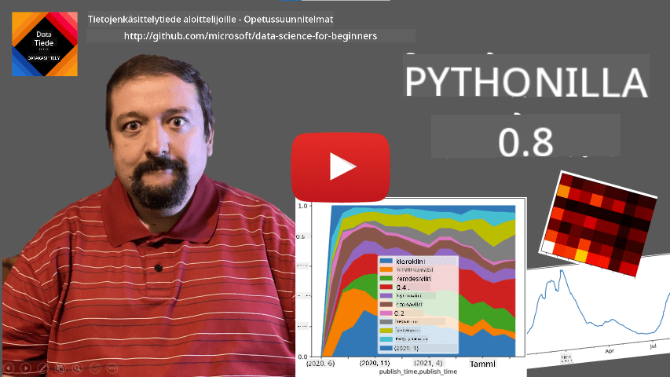
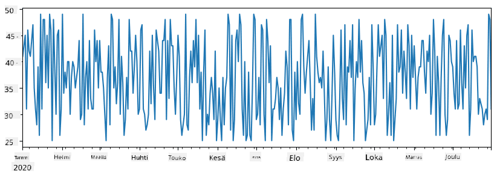
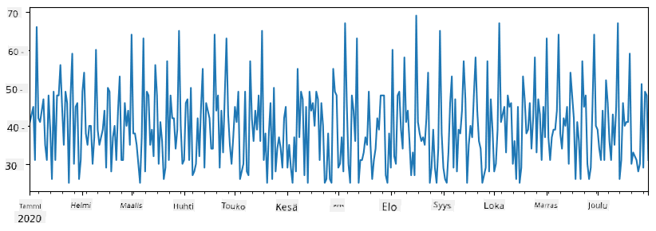
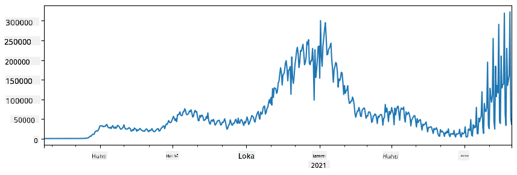
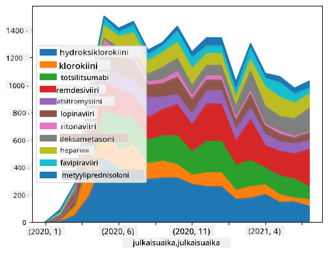

<!--
CO_OP_TRANSLATOR_METADATA:
{
  "original_hash": "7bfec050f4717dcc2dfd028aca9d21f3",
  "translation_date": "2025-09-06T15:48:25+00:00",
  "source_file": "2-Working-With-Data/07-python/README.md",
  "language_code": "fi"
}
-->
# Työskentely datan kanssa: Python ja Pandas-kirjasto

|  ](../../sketchnotes/07-WorkWithPython.png) |
| :-------------------------------------------------------------------------------------------------------: |
|                 Työskentely Pythonin kanssa - _Sketchnote by [@nitya](https://twitter.com/nitya)_         |

[](https://youtu.be/dZjWOGbsN4Y)

Vaikka tietokannat tarjoavat erittäin tehokkaita tapoja tallentaa dataa ja tehdä kyselyitä kyselykielillä, joustavin tapa käsitellä dataa on kirjoittaa oma ohjelma datan muokkaamiseen. Monissa tapauksissa tietokantakysely olisi tehokkaampi tapa. Kuitenkin joissakin tapauksissa, kun tarvitaan monimutkaisempaa datan käsittelyä, sitä ei voida helposti tehdä SQL:llä.  
Datan käsittelyä voidaan ohjelmoida millä tahansa ohjelmointikielellä, mutta tietyt kielet ovat korkeammalla tasolla datan käsittelyn suhteen. Datatieteilijät suosivat yleensä yhtä seuraavista kielistä:

* **[Python](https://www.python.org/)**, yleiskäyttöinen ohjelmointikieli, jota pidetään usein yhtenä parhaista vaihtoehdoista aloittelijoille sen yksinkertaisuuden vuoksi. Pythonilla on paljon lisäkirjastoja, jotka voivat auttaa ratkaisemaan monia käytännön ongelmia, kuten datan purkaminen ZIP-arkistosta tai kuvan muuntaminen harmaasävyksi. Datatieteen lisäksi Pythonia käytetään usein myös verkkokehityksessä.  
* **[R](https://www.r-project.org/)** on perinteinen työkalu, joka on kehitetty tilastollisen datan käsittelyä varten. Se sisältää laajan kirjastojen arkiston (CRAN), mikä tekee siitä hyvän valinnan datan käsittelyyn. R ei kuitenkaan ole yleiskäyttöinen ohjelmointikieli, ja sitä käytetään harvoin datatieteen ulkopuolella.  
* **[Julia](https://julialang.org/)** on toinen kieli, joka on kehitetty erityisesti datatiedettä varten. Sen tarkoituksena on tarjota parempaa suorituskykyä kuin Python, mikä tekee siitä erinomaisen työkalun tieteellisiin kokeiluihin.

Tässä oppitunnissa keskitymme Pythonin käyttöön yksinkertaisessa datan käsittelyssä. Oletamme, että sinulla on perustiedot kielestä. Jos haluat syvemmän katsauksen Pythonista, voit tutustua johonkin seuraavista resursseista:

* [Learn Python in a Fun Way with Turtle Graphics and Fractals](https://github.com/shwars/pycourse) - GitHub-pohjainen pikaopas Python-ohjelmointiin  
* [Take your First Steps with Python](https://docs.microsoft.com/en-us/learn/paths/python-first-steps/?WT.mc_id=academic-77958-bethanycheum) Oppimispolku [Microsoft Learn](http://learn.microsoft.com/?WT.mc_id=academic-77958-bethanycheum) -sivustolla  

Data voi olla monessa eri muodossa. Tässä oppitunnissa tarkastelemme kolmea datan muotoa - **taulukkomuotoista dataa**, **tekstiä** ja **kuvia**.

Keskitymme muutamaan esimerkkiin datan käsittelystä sen sijaan, että antaisimme kattavan yleiskatsauksen kaikista asiaan liittyvistä kirjastoista. Tämä antaa sinulle käsityksen siitä, mitä on mahdollista tehdä, ja auttaa sinua ymmärtämään, mistä löytää ratkaisuja ongelmiisi tarvittaessa.

> **Hyödyllisin neuvo**. Kun sinun täytyy suorittaa jokin datan käsittelytoimenpide, jota et osaa tehdä, yritä etsiä sitä internetistä. [Stackoverflow](https://stackoverflow.com/) sisältää yleensä paljon hyödyllisiä Python-koodiesimerkkejä moniin tyypillisiin tehtäviin.

## [Ennakkokysely](https://ff-quizzes.netlify.app/en/ds/quiz/12)

## Taulukkomuotoinen data ja DataFrame-rakenteet

Olet jo tutustunut taulukkomuotoiseen dataan, kun puhuimme relaatiotietokannoista. Kun sinulla on paljon dataa, joka on tallennettu moniin eri linkitettyihin tauluihin, SQL:n käyttö on ehdottomasti järkevää. Kuitenkin on monia tapauksia, joissa meillä on yksittäinen datataulukko, ja meidän täytyy saada siitä **ymmärrystä** tai **oivalluksia**, kuten jakauma tai arvojen välinen korrelaatio. Datatieteessä on paljon tilanteita, joissa alkuperäistä dataa täytyy muokata ja sen jälkeen visualisoida. Molemmat vaiheet voidaan helposti tehdä Pythonilla.

Pythonissa on kaksi hyödyllistä kirjastoa, jotka auttavat sinua käsittelemään taulukkomuotoista dataa:
* **[Pandas](https://pandas.pydata.org/)** mahdollistaa niin sanottujen **DataFrame-rakenteiden** käsittelyn, jotka ovat analogisia relaatiotaulukoille. Voit käyttää nimettyjä sarakkeita ja suorittaa erilaisia operaatioita riveille, sarakkeille ja DataFrameille yleisesti.  
* **[Numpy](https://numpy.org/)** on kirjasto, joka on tarkoitettu **tensorien**, eli monidimensionaalisten **taulukoiden**, käsittelyyn. Taulukko sisältää saman tyyppisiä arvoja, ja se on yksinkertaisempi kuin DataFrame, mutta tarjoaa enemmän matemaattisia operaatioita ja aiheuttaa vähemmän ylikuormitusta.

Lisäksi on muutama muu kirjasto, jotka sinun kannattaa tietää:
* **[Matplotlib](https://matplotlib.org/)** on kirjasto, jota käytetään datan visualisointiin ja graafien piirtämiseen  
* **[SciPy](https://www.scipy.org/)** on kirjasto, joka sisältää lisätieteellisiä funktioita. Olemme jo törmänneet tähän kirjastoon, kun puhuimme todennäköisyyksistä ja tilastoista  

Tässä on koodiesimerkki, jota yleensä käytetään näiden kirjastojen tuomiseen Python-ohjelman alkuun:
```python
import numpy as np
import pandas as pd
import matplotlib.pyplot as plt
from scipy import ... # you need to specify exact sub-packages that you need
``` 

Pandas-kirjasto keskittyy muutamaan peruskäsitteeseen.

### Sarjat (Series)

**Sarja** on arvojen jono, joka muistuttaa listaa tai numpy-taulukkoa. Suurin ero on, että sarjalla on myös **indeksi**, ja kun teemme operaatioita sarjoilla (esim. lisäämme niitä), indeksi otetaan huomioon. Indeksi voi olla yksinkertainen kokonaisluku (se on oletusindeksi, kun luodaan sarja listasta tai taulukosta), tai sillä voi olla monimutkainen rakenne, kuten aikaväli.

> **Huomio**: Mukana olevassa notebookissa [`notebook.ipynb`](notebook.ipynb) on johdantokoodia Pandas-kirjastoon. Tässä esittelemme vain joitakin esimerkkejä, ja olet ehdottomasti tervetullut tutustumaan koko notebookiin.

Otetaan esimerkki: haluamme analysoida jäätelökioskimme myyntiä. Luodaan sarja myyntilukuja (myytyjen tuotteiden määrä päivittäin) tietylle ajanjaksolle:

```python
start_date = "Jan 1, 2020"
end_date = "Mar 31, 2020"
idx = pd.date_range(start_date,end_date)
print(f"Length of index is {len(idx)}")
items_sold = pd.Series(np.random.randint(25,50,size=len(idx)),index=idx)
items_sold.plot()
```


Oletetaan nyt, että järjestämme joka viikko juhlat ystäville, ja otamme juhliin 10 ylimääräistä jäätelöpakkausta. Voimme luoda toisen sarjan, joka on indeksoitu viikoittain, osoittamaan tätä:
```python
additional_items = pd.Series(10,index=pd.date_range(start_date,end_date,freq="W"))
```
Kun lisäämme kaksi sarjaa yhteen, saamme kokonaismäärän:
```python
total_items = items_sold.add(additional_items,fill_value=0)
total_items.plot()
```


> **Huomio**: Emme käytä yksinkertaista syntaksia `total_items+additional_items`. Jos tekisimme niin, saisimme paljon `NaN` (*Not a Number*) -arvoja tuloksena olevaan sarjaan. Tämä johtuu siitä, että `additional_items`-sarjassa on puuttuvia arvoja joillekin indeksipisteille, ja `NaN`-arvon lisääminen mihin tahansa johtaa `NaN`:iin. Siksi meidän täytyy määrittää `fill_value`-parametri lisäyksen aikana.

Aikasarjojen kanssa voimme myös **resamplata** sarjan eri aikaväleillä. Esimerkiksi, jos haluamme laskea keskimääräisen myyntimäärän kuukausittain, voimme käyttää seuraavaa koodia:
```python
monthly = total_items.resample("1M").mean()
ax = monthly.plot(kind='bar')
```


### DataFrame

DataFrame on pohjimmiltaan kokoelma sarjoja, joilla on sama indeksi. Voimme yhdistää useita sarjoja DataFrameksi:
```python
a = pd.Series(range(1,10))
b = pd.Series(["I","like","to","play","games","and","will","not","change"],index=range(0,9))
df = pd.DataFrame([a,b])
```
Tämä luo vaakasuoran taulukon, joka näyttää tältä:
|     | 0   | 1    | 2   | 3   | 4      | 5   | 6      | 7    | 8    |
| --- | --- | ---- | --- | --- | ------ | --- | ------ | ---- | ---- |
| 0   | 1   | 2    | 3   | 4   | 5      | 6   | 7      | 8    | 9    |
| 1   | I   | like | to  | use | Python | and | Pandas | very | much |

Voimme myös käyttää sarjoja sarakkeina ja määrittää sarakenimet sanakirjan avulla:
```python
df = pd.DataFrame({ 'A' : a, 'B' : b })
```
Tämä antaa meille taulukon, joka näyttää tältä:

|     | A   | B      |
| --- | --- | ------ |
| 0   | 1   | I      |
| 1   | 2   | like   |
| 2   | 3   | to     |
| 3   | 4   | use    |
| 4   | 5   | Python |
| 5   | 6   | and    |
| 6   | 7   | Pandas |
| 7   | 8   | very   |
| 8   | 9   | much   |

**Huomio**: Voimme myös saada tämän taulukon asettelun transponoimalla edellisen taulukon, esimerkiksi kirjoittamalla 
```python
df = pd.DataFrame([a,b]).T..rename(columns={ 0 : 'A', 1 : 'B' })
```
Tässä `.T` tarkoittaa DataFramen transponointia, eli rivien ja sarakkeiden vaihtamista, ja `rename`-operaatio mahdollistaa sarakkeiden uudelleennimeämisen vastaamaan edellistä esimerkkiä.

Tässä on muutamia tärkeimpiä operaatioita, joita voimme suorittaa DataFrameille:

**Sarakkeiden valinta**. Voimme valita yksittäisiä sarakkeita kirjoittamalla `df['A']` - tämä operaatio palauttaa sarjan. Voimme myös valita osajoukon sarakkeista toiseen DataFrameen kirjoittamalla `df[['B','A']]` - tämä palauttaa toisen DataFramen.

**Rivien suodatus** tiettyjen kriteerien perusteella. Esimerkiksi, jos haluamme jättää vain rivit, joissa sarakkeen `A` arvo on suurempi kuin 5, voimme kirjoittaa `df[df['A']>5]`.

> **Huomio**: Suodatuksen toiminta on seuraava. Lauseke `df['A']<5` palauttaa totuusarvosarjan, joka osoittaa, onko lauseke `True` vai `False` kullekin alkuperäisen sarjan `df['A']` elementille. Kun totuusarvosarjaa käytetään indeksinä, se palauttaa DataFramen rivien osajoukon. Siksi ei ole mahdollista käyttää mielivaltaisia Pythonin totuuslausekkeita, esimerkiksi kirjoittamalla `df[df['A']>5 and df['A']<7]` olisi väärin. Sen sijaan sinun tulisi käyttää erityistä `&`-operaatiota totuusarvosarjoille, kirjoittamalla `df[(df['A']>5) & (df['A']<7)]` (*sulkeet ovat tässä tärkeitä*).

**Uusien laskettavien sarakkeiden luominen**. Voimme helposti luoda uusia laskettavia sarakkeita DataFrameille käyttämällä intuitiivisia lausekkeita, kuten tämä:
```python
df['DivA'] = df['A']-df['A'].mean() 
``` 
Tämä esimerkki laskee sarakkeen A poikkeaman sen keskiarvosta. Mitä tässä oikeastaan tapahtuu, on se, että laskemme sarjan ja sitten määritämme tämän sarjan vasemmalle puolelle, luoden uuden sarakkeen. Siksi emme voi käyttää operaatioita, jotka eivät ole yhteensopivia sarjojen kanssa, esimerkiksi alla oleva koodi on väärin:
```python
# Wrong code -> df['ADescr'] = "Low" if df['A'] < 5 else "Hi"
df['LenB'] = len(df['B']) # <- Wrong result
``` 
Viimeinen esimerkki, vaikka se on syntaktisesti oikein, antaa meille väärän tuloksen, koska se määrittää sarjan `B` pituuden kaikille sarakkeen arvoille, eikä yksittäisten elementtien pituutta, kuten tarkoitimme.

Jos meidän täytyy laskea monimutkaisia lausekkeita, voimme käyttää `apply`-funktiota. Viimeinen esimerkki voidaan kirjoittaa seuraavasti:
```python
df['LenB'] = df['B'].apply(lambda x : len(x))
# or 
df['LenB'] = df['B'].apply(len)
```

Yllä olevien operaatioiden jälkeen meillä on seuraava DataFrame:

|     | A   | B      | DivA | LenB |
| --- | --- | ------ | ---- | ---- |
| 0   | 1   | I      | -4.0 | 1    |
| 1   | 2   | like   | -3.0 | 4    |
| 2   | 3   | to     | -2.0 | 2    |
| 3   | 4   | use    | -1.0 | 3    |
| 4   | 5   | Python | 0.0  | 6    |
| 5   | 6   | and    | 1.0  | 3    |
| 6   | 7   | Pandas | 2.0  | 6    |
| 7   | 8   | very   | 3.0  | 4    |
| 8   | 9   | much   | 4.0  | 4    |

**Rivien valinta numeroiden perusteella** voidaan tehdä käyttämällä `iloc`-rakennetta. Esimerkiksi, jos haluamme valita ensimmäiset 5 riviä DataFramesta:
```python
df.iloc[:5]
```

**Ryhmittely** on usein käytetty tapa saada tuloksia, jotka muistuttavat *pivot-taulukoita* Excelissä. Oletetaan, että haluamme laskea sarakkeen `A` keskiarvon jokaiselle annetulle `LenB`-arvolle. Voimme ryhmitellä DataFramen `LenB`-sarakkeen mukaan ja kutsua `mean`-funktiota:
```python
df.groupby(by='LenB')[['A','DivA']].mean()
```
Jos meidän täytyy laskea keskiarvo ja elementtien lukumäärä ryhmässä, voimme käyttää monimutkaisempaa `aggregate`-funktiota:
```python
df.groupby(by='LenB') \
 .aggregate({ 'DivA' : len, 'A' : lambda x: x.mean() }) \
 .rename(columns={ 'DivA' : 'Count', 'A' : 'Mean'})
```
Tämä antaa meille seuraavan taulukon:

| LenB | Count | Mean     |
| ---- | ----- | -------- |
| 1    | 1     | 1.000000 |
| 2    | 1     | 3.000000 |
| 3    | 2     | 5.000000 |
| 4    | 3     | 6.333333 |
| 6    | 2     | 6.000000 |

### Datan hankinta
Olemme nähneet, kuinka helppoa on luoda Series- ja DataFrame-objekteja Pythonilla. Kuitenkin data tulee yleensä tekstitiedostona tai Excel-taulukkona. Onneksi Pandas tarjoaa yksinkertaisen tavan ladata dataa levyltä. Esimerkiksi CSV-tiedoston lukeminen on yhtä helppoa kuin tämä:
```python
df = pd.read_csv('file.csv')
```
Näemme lisää esimerkkejä datan lataamisesta, mukaan lukien sen hakeminen ulkoisilta verkkosivuilta, "Haaste"-osiossa.

### Tulostaminen ja Visualisointi

Data Scientistin täytyy usein tutkia dataa, joten on tärkeää pystyä visualisoimaan sitä. Kun DataFrame on suuri, haluamme monesti varmistaa, että kaikki toimii oikein tulostamalla ensimmäiset rivit. Tämä onnistuu kutsumalla `df.head()`. Jos suoritat sen Jupyter Notebookissa, se tulostaa DataFramen siistissä taulukkomuodossa.

Olemme myös nähneet `plot`-funktion käytön tiettyjen sarakkeiden visualisointiin. Vaikka `plot` on erittäin hyödyllinen moniin tehtäviin ja tukee monia eri kaaviotyyppejä `kind=`-parametrin avulla, voit aina käyttää raakaa `matplotlib`-kirjastoa monimutkaisempien kaavioiden luomiseen. Käsittelemme datan visualisointia yksityiskohtaisesti erillisissä kurssin osioissa.

Tämä yleiskatsaus kattaa Pandasin tärkeimmät käsitteet, mutta kirjasto on erittäin monipuolinen, eikä sen käyttömahdollisuuksilla ole rajoja! Käytetään nyt tätä tietoa tietyn ongelman ratkaisemiseen.

## 🚀 Haaste 1: COVID-leviämisen analysointi

Ensimmäinen ongelma, johon keskitymme, on COVID-19:n epidemian leviämisen mallintaminen. Tätä varten käytämme dataa tartunnan saaneiden henkilöiden määrästä eri maissa, jonka tarjoaa [Center for Systems Science and Engineering](https://systems.jhu.edu/) (CSSE) [Johns Hopkins University](https://jhu.edu/):sta. Datasetti on saatavilla [tässä GitHub-repositoriossa](https://github.com/CSSEGISandData/COVID-19).

Koska haluamme demonstroida, miten dataa käsitellään, kutsumme sinut avaamaan [`notebook-covidspread.ipynb`](notebook-covidspread.ipynb) ja lukemaan sen alusta loppuun. Voit myös suorittaa soluja ja tehdä joitakin haasteita, jotka olemme jättäneet sinulle loppuun.



> Jos et tiedä, miten suorittaa koodia Jupyter Notebookissa, tutustu [tähän artikkeliin](https://soshnikov.com/education/how-to-execute-notebooks-from-github/).

## Työskentely jäsentämättömän datan kanssa

Vaikka data tulee usein taulukkomuodossa, joissakin tapauksissa meidän täytyy käsitellä vähemmän jäsenneltyä dataa, kuten tekstiä tai kuvia. Tällöin, jotta voimme soveltaa edellä nähtyjä datankäsittelytekniikoita, meidän täytyy jotenkin **jäsentää** data. Tässä muutamia esimerkkejä:

* Avainsanojen poimiminen tekstistä ja niiden esiintymistiheyden tarkastelu
* Neuroverkkojen käyttö tiedon poimimiseen kuvassa olevista objekteista
* Tunteiden analysointi videokameran syötteestä

## 🚀 Haaste 2: COVID-tutkimuspapereiden analysointi

Tässä haasteessa jatkamme COVID-pandemian aihetta ja keskitymme tieteellisten papereiden käsittelyyn aiheesta. [CORD-19 Dataset](https://www.kaggle.com/allen-institute-for-ai/CORD-19-research-challenge) sisältää yli 7000 (kirjoitushetkellä) paperia COVID:sta, saatavilla metadatan ja tiivistelmien kanssa (ja noin puolessa tapauksista myös koko teksti).

Täydellinen esimerkki tämän datasetin analysoinnista [Text Analytics for Health](https://docs.microsoft.com/azure/cognitive-services/text-analytics/how-tos/text-analytics-for-health/?WT.mc_id=academic-77958-bethanycheum) -kognitiivisen palvelun avulla on kuvattu [tässä blogikirjoituksessa](https://soshnikov.com/science/analyzing-medical-papers-with-azure-and-text-analytics-for-health/). Keskustelemme yksinkertaistetusta versiosta tästä analyysistä.

> **NOTE**: Emme tarjoa datasetin kopiota osana tätä repositoriota. Sinun täytyy ensin ladata [`metadata.csv`](https://www.kaggle.com/allen-institute-for-ai/CORD-19-research-challenge?select=metadata.csv) tiedosto [tästä Kaggle-datasetistä](https://www.kaggle.com/allen-institute-for-ai/CORD-19-research-challenge). Rekisteröityminen Kaggleen saattaa olla tarpeen. Voit myös ladata datasetin ilman rekisteröitymistä [täältä](https://ai2-semanticscholar-cord-19.s3-us-west-2.amazonaws.com/historical_releases.html), mutta se sisältää kaikki kokotekstit metadatatiedoston lisäksi.

Avaa [`notebook-papers.ipynb`](notebook-papers.ipynb) ja lue se alusta loppuun. Voit myös suorittaa soluja ja tehdä joitakin haasteita, jotka olemme jättäneet sinulle loppuun.



## Kuvadatan käsittely

Viime aikoina on kehitetty erittäin tehokkaita AI-malleja, jotka mahdollistavat kuvien ymmärtämisen. Monet tehtävät voidaan ratkaista esikoulutettujen neuroverkkojen tai pilvipalveluiden avulla. Esimerkkejä:

* **Kuvien luokittelu**, joka auttaa kategorisoimaan kuvan ennalta määriteltyihin luokkiin. Voit helposti kouluttaa omia kuvien luokittelijoita palveluilla, kuten [Custom Vision](https://azure.microsoft.com/services/cognitive-services/custom-vision-service/?WT.mc_id=academic-77958-bethanycheum).
* **Objektien tunnistus** kuvassa. Palvelut, kuten [Computer Vision](https://azure.microsoft.com/services/cognitive-services/computer-vision/?WT.mc_id=academic-77958-bethanycheum), voivat tunnistaa useita yleisiä objekteja, ja voit kouluttaa [Custom Vision](https://azure.microsoft.com/services/cognitive-services/custom-vision-service/?WT.mc_id=academic-77958-bethanycheum) -mallin tunnistamaan tiettyjä kiinnostavia objekteja.
* **Kasvojen tunnistus**, mukaan lukien ikä, sukupuoli ja tunteiden tunnistus. Tämä voidaan tehdä [Face API](https://azure.microsoft.com/services/cognitive-services/face/?WT.mc_id=academic-77958-bethanycheum) avulla.

Kaikki nämä pilvipalvelut voidaan kutsua [Python SDK:iden](https://docs.microsoft.com/samples/azure-samples/cognitive-services-python-sdk-samples/cognitive-services-python-sdk-samples/?WT.mc_id=academic-77958-bethanycheum) avulla, ja ne voidaan helposti sisällyttää datan tutkimustyöhön.

Tässä muutamia esimerkkejä kuvadatalähteiden tutkimisesta:
* Blogikirjoituksessa [How to Learn Data Science without Coding](https://soshnikov.com/azure/how-to-learn-data-science-without-coding/) tutkimme Instagram-kuvia yrittäen ymmärtää, mikä saa ihmiset antamaan enemmän tykkäyksiä kuvalle. Ensin poimimme mahdollisimman paljon tietoa kuvista [Computer Vision](https://azure.microsoft.com/services/cognitive-services/computer-vision/?WT.mc_id=academic-77958-bethanycheum) avulla, ja sitten käytämme [Azure Machine Learning AutoML](https://docs.microsoft.com/azure/machine-learning/concept-automated-ml/?WT.mc_id=academic-77958-bethanycheum) -palvelua tulkittavan mallin rakentamiseen.
* [Facial Studies Workshop](https://github.com/CloudAdvocacy/FaceStudies) -työpajassa käytämme [Face API](https://azure.microsoft.com/services/cognitive-services/face/?WT.mc_id=academic-77958-bethanycheum) -palvelua poimimaan tunteita tapahtumien valokuvista, jotta voimme yrittää ymmärtää, mikä tekee ihmiset onnellisiksi.

## Yhteenveto

Olipa sinulla jo jäsenneltyä tai jäsentämätöntä dataa, Pythonilla voit suorittaa kaikki datankäsittelyyn ja ymmärtämiseen liittyvät vaiheet. Se on todennäköisesti joustavin tapa datankäsittelyyn, ja siksi suurin osa data-analyytikoista käyttää Pythonia ensisijaisena työkalunaan. Pythonin syvällinen oppiminen on luultavasti hyvä idea, jos olet vakavissasi datatieteen urasi suhteen!

## [Luennon jälkeinen kysely](https://ff-quizzes.netlify.app/en/ds/quiz/13)

## Kertaus ja itseopiskelu

**Kirjat**
* [Wes McKinney. Python for Data Analysis: Data Wrangling with Pandas, NumPy, and IPython](https://www.amazon.com/gp/product/1491957662)

**Verkkoresurssit**
* Virallinen [10 minutes to Pandas](https://pandas.pydata.org/pandas-docs/stable/user_guide/10min.html) -opas
* [Dokumentaatio Pandas-visualisoinnista](https://pandas.pydata.org/pandas-docs/stable/user_guide/visualization.html)

**Pythonin oppiminen**
* [Learn Python in a Fun Way with Turtle Graphics and Fractals](https://github.com/shwars/pycourse)
* [Take your First Steps with Python](https://docs.microsoft.com/learn/paths/python-first-steps/?WT.mc_id=academic-77958-bethanycheum) -oppimispolku [Microsoft Learn](http://learn.microsoft.com/?WT.mc_id=academic-77958-bethanycheum) -sivustolla

## Tehtävä

[Suorita yksityiskohtaisempi datatutkimus yllä oleville haasteille](assignment.md)

## Tekijät

Tämän oppitunnin on kirjoittanut ♥️:lla [Dmitry Soshnikov](http://soshnikov.com)

---

**Vastuuvapauslauseke**:  
Tämä asiakirja on käännetty käyttämällä tekoälypohjaista käännöspalvelua [Co-op Translator](https://github.com/Azure/co-op-translator). Vaikka pyrimme tarkkuuteen, huomioithan, että automaattiset käännökset voivat sisältää virheitä tai epätarkkuuksia. Alkuperäistä asiakirjaa sen alkuperäisellä kielellä tulisi pitää ensisijaisena lähteenä. Kriittisen tiedon osalta suositellaan ammattimaista ihmiskäännöstä. Emme ole vastuussa väärinkäsityksistä tai virhetulkinnoista, jotka johtuvat tämän käännöksen käytöstä.