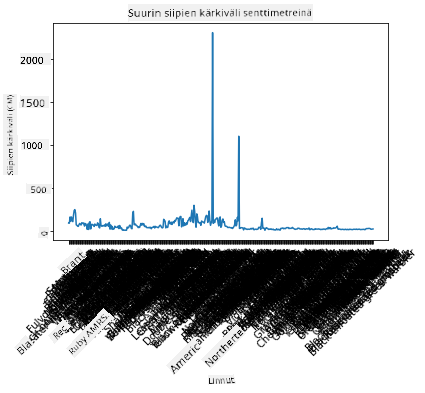
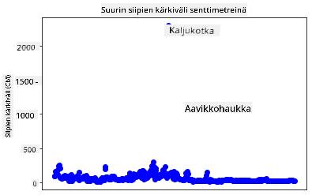
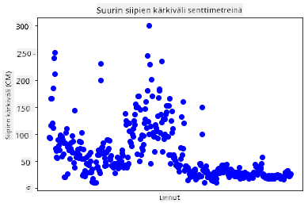
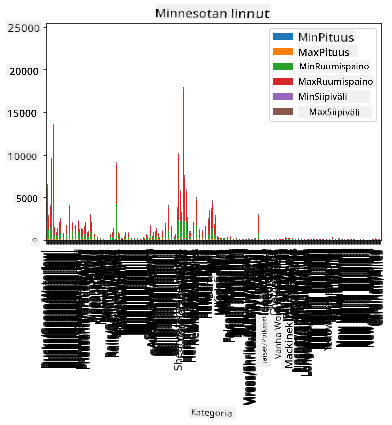
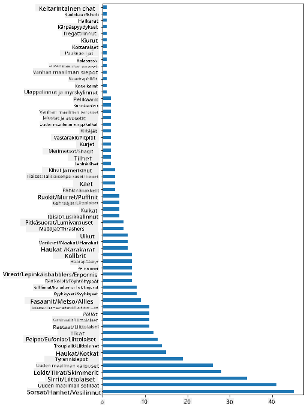
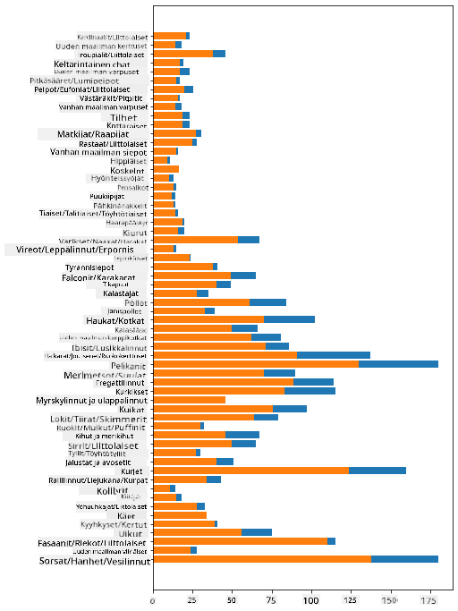

<!--
CO_OP_TRANSLATOR_METADATA:
{
  "original_hash": "69b32b6789a91f796ebc7a02f5575e03",
  "translation_date": "2025-09-04T19:43:01+00:00",
  "source_file": "3-Data-Visualization/09-visualization-quantities/README.md",
  "language_code": "fi"
}
-->
# Määrien visualisointi

| ](../../sketchnotes/09-Visualizing-Quantities.png)|
|:---:|
| Määrien visualisointi - _Sketchnote by [@nitya](https://twitter.com/nitya)_ |

Tässä oppitunnissa tutustut siihen, miten voit käyttää yhtä monista saatavilla olevista Python-kirjastoista oppiaksesi luomaan kiinnostavia visualisointeja määrän käsitteen ympärillä. Käyttämällä puhdistettua datasettiä Minnesotan linnuista voit oppia monia mielenkiintoisia faktoja paikallisesta eläimistöstä.  
## [Ennakkokysely](https://purple-hill-04aebfb03.1.azurestaticapps.net/quiz/16)

## Havainnoi siipien kärkiväliä Matplotlibilla

Erinomainen kirjasto erilaisten yksinkertaisten ja monimutkaisten kaavioiden ja diagrammien luomiseen on [Matplotlib](https://matplotlib.org/stable/index.html). Yleisesti ottaen datan visualisointi näiden kirjastojen avulla sisältää seuraavat vaiheet: tunnista datakehyksen osat, joita haluat käsitellä, tee tarvittavat muunnokset datalle, määritä x- ja y-akselin arvot, päätä minkä tyyppisen kaavion haluat näyttää ja lopuksi näytä kaavio. Matplotlib tarjoaa laajan valikoiman visualisointeja, mutta tässä oppitunnissa keskitymme niihin, jotka sopivat parhaiten määrän visualisointiin: viivakaaviot, hajontakaaviot ja pylväsdiagrammit.

> ✅ Käytä parasta kaaviotyyppiä datasi rakenteen ja kertomasi tarinan mukaan.  
> - Aikatrendien analysointiin: viiva  
> - Arvojen vertailuun: pylväs, sarake, piirakka, hajontakaavio  
> - Osien suhteiden näyttämiseen kokonaisuuteen: piirakka  
> - Datan jakauman näyttämiseen: hajontakaavio, pylväs  
> - Trendien näyttämiseen: viiva, sarake  
> - Arvojen välisten suhteiden näyttämiseen: viiva, hajontakaavio, kupla  

Jos sinulla on datasetti ja haluat selvittää, kuinka paljon tiettyä kohdetta on mukana, ensimmäinen tehtäväsi on tarkastella sen arvoja.  

✅ Matplotlibille on saatavilla erittäin hyviä 'cheat sheet' -muistilappuja [täällä](https://matplotlib.org/cheatsheets/cheatsheets.pdf).

## Luo viivakaavio lintujen siipien kärkiväliarvoista

Avaa `notebook.ipynb` tiedosto tämän oppitunnin kansion juuresta ja lisää solu.

> Huom: data on tallennettu tämän repositorion juureen `/data`-kansioon.

```python
import pandas as pd
import matplotlib.pyplot as plt
birds = pd.read_csv('../../data/birds.csv')
birds.head()
```  
Tämä data sisältää sekä tekstiä että numeroita:

|      | Nimi                         | Tieteellinen nimi      | Kategoria             | Lahko        | Heimo    | Suku        | Suojelustatus       | MinPituus | MaxPituus | MinPaino    | MaxPaino    | MinSiipiväli | MaxSiipiväli |
| ---: | :--------------------------- | :--------------------- | :-------------------- | :----------- | :------- | :---------- | :----------------- | --------: | --------: | ----------: | ----------: | ----------: | ----------: |
|    0 | Mustavatsainen viheltävä ankka | Dendrocygna autumnalis | Ankat/hanhet/vesilinnut | Anseriformes | Anatidae | Dendrocygna | LC                 |        47 |        56 |         652 |        1020 |          76 |          94 |
|    1 | Ruostoviheltävä ankka         | Dendrocygna bicolor    | Ankat/hanhet/vesilinnut | Anseriformes | Anatidae | Dendrocygna | LC                 |        45 |        53 |         712 |        1050 |          85 |          93 |
|    2 | Lumihanhi                     | Anser caerulescens     | Ankat/hanhet/vesilinnut | Anseriformes | Anatidae | Anser       | LC                 |        64 |        79 |        2050 |        4050 |         135 |         165 |
|    3 | Rossin hanhi                  | Anser rossii           | Ankat/hanhet/vesilinnut | Anseriformes | Anatidae | Anser       | LC                 |      57.3 |        64 |        1066 |        1567 |         113 |         116 |
|    4 | Iso valkoposkihanhi           | Anser albifrons        | Ankat/hanhet/vesilinnut | Anseriformes | Anatidae | Anser       | LC                 |        64 |        81 |        1930 |        3310 |         130 |         165 |

Aloitetaan piirtämällä osa numeerisesta datasta perusviivakaavion avulla. Oletetaan, että haluat tarkastella näiden mielenkiintoisten lintujen maksimaalista siipiväliä.

```python
wingspan = birds['MaxWingspan'] 
wingspan.plot()
```  


Mitä huomaat heti? Näyttää olevan ainakin yksi poikkeama - melkoiset siivet! 2300 senttimetrin siipiväli vastaa 23 metriä - vaeltavatko Pterodaktyylit Minnesotassa? Tutkitaan asiaa.

Vaikka voisit tehdä nopean lajittelun Excelissä löytääksesi nämä poikkeamat, jotka ovat todennäköisesti kirjoitusvirheitä, jatka visualisointiprosessia työskentelemällä suoraan kaaviosta.

Lisää x-akselille etiketit, jotka näyttävät, minkä tyyppisistä linnuista on kyse:

```
plt.title('Max Wingspan in Centimeters')
plt.ylabel('Wingspan (CM)')
plt.xlabel('Birds')
plt.xticks(rotation=45)
x = birds['Name'] 
y = birds['MaxWingspan']

plt.plot(x, y)

plt.show()
```  


Vaikka etikettien kiertokulma on asetettu 45 asteeseen, niitä on liian paljon luettavaksi. Kokeillaan toista strategiaa: merkitään vain poikkeamat ja asetetaan etiketit kaavion sisälle. Voit käyttää hajontakaaviota tehdäksesi tilaa etiketeille:

```python
plt.title('Max Wingspan in Centimeters')
plt.ylabel('Wingspan (CM)')
plt.tick_params(axis='both',which='both',labelbottom=False,bottom=False)

for i in range(len(birds)):
    x = birds['Name'][i]
    y = birds['MaxWingspan'][i]
    plt.plot(x, y, 'bo')
    if birds['MaxWingspan'][i] > 500:
        plt.text(x, y * (1 - 0.05), birds['Name'][i], fontsize=12)
    
plt.show()
```  
Mitä tässä tapahtuu? Käytit `tick_params`-funktiota piilottaaksesi alareunan etiketit ja loit silmukan lintudatasetin yli. Piirtämällä kaavion pienillä pyöreillä sinisillä pisteillä käyttämällä `bo`, tarkistit, onko linnulla maksimaalinen siipiväli yli 500 ja näytit sen etiketin pisteen vieressä, jos näin oli. Siirsit etikettejä hieman y-akselilla (`y * (1 - 0.05)`) ja käytit linnun nimeä etiketiksi.

Mitä huomasit?

  
## Suodata dataasi

Sekä valkopäämerikotka että preeriakotka, vaikka todennäköisesti hyvin suuria lintuja, näyttävät olevan virheellisesti merkittyjä, ja niiden maksimaaliseen siipiväliin on lisätty ylimääräinen `0`. On epätodennäköistä, että kohtaat valkopäämerikotkan, jonka siipiväli on 25 metriä, mutta jos näin käy, kerro meille! Luodaan uusi datakehys ilman näitä kahta poikkeamaa:

```python
plt.title('Max Wingspan in Centimeters')
plt.ylabel('Wingspan (CM)')
plt.xlabel('Birds')
plt.tick_params(axis='both',which='both',labelbottom=False,bottom=False)
for i in range(len(birds)):
    x = birds['Name'][i]
    y = birds['MaxWingspan'][i]
    if birds['Name'][i] not in ['Bald eagle', 'Prairie falcon']:
        plt.plot(x, y, 'bo')
plt.show()
```  

Suodattamalla poikkeamat pois datasi on nyt yhtenäisempää ja ymmärrettävämpää.



Nyt kun meillä on puhtaampi datasetti ainakin siipivälin osalta, tutkitaan lisää näitä lintuja.

Vaikka viiva- ja hajontakaaviot voivat näyttää tietoa datan arvoista ja niiden jakaumista, haluamme pohtia datasetin sisältämiä arvoja. Voisit luoda visualisointeja vastataksesi seuraaviin kysymyksiin määristä:

> Kuinka monta lintukategoriaa on olemassa ja mikä on niiden lukumäärä?  
> Kuinka monta lintua on sukupuuttoon kuolleita, uhanalaisia, harvinaisia tai yleisiä?  
> Kuinka monta eri sukua ja lahkoa on Linnaeuksen terminologian mukaan?  
## Tutki pylväsdiagrammeja

Pylväsdiagrammit ovat käytännöllisiä, kun haluat näyttää datan ryhmittelyjä. Tutkitaan datasetin lintukategorioita nähdäksemme, mikä on yleisin lukumäärän perusteella.

Luo peruspylväsdiagrammi notebook-tiedostossa.

✅ Huomaa, että voit joko suodattaa pois kaksi poikkeamalintua, jotka tunnistimme edellisessä osiossa, korjata niiden siipivälin kirjoitusvirheen tai jättää ne mukaan näihin harjoituksiin, jotka eivät riipu siipiväliarvoista.

Jos haluat luoda pylväsdiagrammin, voit valita datan, johon haluat keskittyä. Pylväsdiagrammeja voidaan luoda raakadatasta:

```python
birds.plot(x='Category',
        kind='bar',
        stacked=True,
        title='Birds of Minnesota')

```  


Tämä pylväsdiagrammi on kuitenkin lukukelvoton, koska siinä on liikaa ryhmittelemätöntä dataa. Sinun täytyy valita vain data, jonka haluat piirtää, joten tarkastellaan lintujen pituutta niiden kategorian perusteella.  

Suodata datasi sisältämään vain lintujen kategoriat.  

✅ Huomaa, että käytät Pandasia datan hallintaan ja annat Matplotlibin hoitaa kaavioiden piirtämisen.

Koska kategorioita on paljon, voit näyttää tämän diagrammin pystysuunnassa ja säätää sen korkeutta, jotta kaikki data mahtuu mukaan:

```python
category_count = birds.value_counts(birds['Category'].values, sort=True)
plt.rcParams['figure.figsize'] = [6, 12]
category_count.plot.barh()
```  


Tämä pylväsdiagrammi näyttää hyvän näkymän lintujen lukumäärästä kussakin kategoriassa. Silmänräpäyksessä näet, että suurin määrä lintuja tällä alueella kuuluu Ankat/hanhet/vesilinnut-kategoriaan. Minnesota on '10 000 järven maa', joten tämä ei ole yllättävää!

✅ Kokeile joitakin muita laskentoja tässä datasetissä. Yllättääkö jokin sinut?

## Datan vertailu

Voit kokeilla eri ryhmitellyn datan vertailuja luomalla uusia akseleita. Kokeile lintujen MaxPituuden vertailua niiden kategorian perusteella:

```python
maxlength = birds['MaxLength']
plt.barh(y=birds['Category'], width=maxlength)
plt.rcParams['figure.figsize'] = [6, 12]
plt.show()
```  


Tässä ei ole mitään yllättävää: kolibrit ovat pienimpiä MaxPituuden osalta verrattuna pelikaaniin tai hanhiin. On hyvä, kun data on loogista!

Voit luoda mielenkiintoisempia pylväsdiagrammeja päällekkäin asetetulla datalla. Asetetaan päällekkäin Minimi- ja Maksimipituus tietyn lintukategorian osalta:

```python
minLength = birds['MinLength']
maxLength = birds['MaxLength']
category = birds['Category']

plt.barh(category, maxLength)
plt.barh(category, minLength)

plt.show()
```  
Tässä kaaviossa näet kunkin lintukategorian Minimi- ja Maksimipituuden vaihteluvälin. Voit turvallisesti sanoa, että tämän datan perusteella mitä suurempi lintu, sitä laajempi sen pituusvaihteluväli. Mielenkiintoista!



## 🚀 Haaste

Tämä lintudatasetti tarjoaa runsaasti tietoa eri lintutyypeistä tietyssä ekosysteemissä. Etsi internetistä muita lintuihin liittyviä datasettiä. Harjoittele kaavioiden ja diagrammien luomista näiden lintujen ympärille löytääksesi faktoja, joita et aiemmin tiennyt.

## [Jälkikysely](https://ff-quizzes.netlify.app/en/ds/)

## Kertaus & Itseopiskelu

Tämä ensimmäinen oppitunti on antanut sinulle tietoa siitä, miten käyttää Matplotlibia määrien visualisointiin. Tutki muita tapoja työskennellä datasetin kanssa visualisointia varten. [Plotly](https://github.com/plotly/plotly.py) on yksi, jota emme käsittele näissä oppitunneissa, joten tutustu siihen, mitä se voi tarjota.  
## Tehtävä

[Viivat, hajonnat ja pylväät](assignment.md)  

---

**Vastuuvapauslauseke**:  
Tämä asiakirja on käännetty käyttämällä tekoälypohjaista käännöspalvelua [Co-op Translator](https://github.com/Azure/co-op-translator). Vaikka pyrimme tarkkuuteen, huomioithan, että automaattiset käännökset voivat sisältää virheitä tai epätarkkuuksia. Alkuperäinen asiakirja sen alkuperäisellä kielellä tulisi pitää ensisijaisena lähteenä. Kriittisen tiedon osalta suositellaan ammattimaista ihmiskäännöstä. Emme ole vastuussa väärinkäsityksistä tai virhetulkinnoista, jotka johtuvat tämän käännöksen käytöstä.