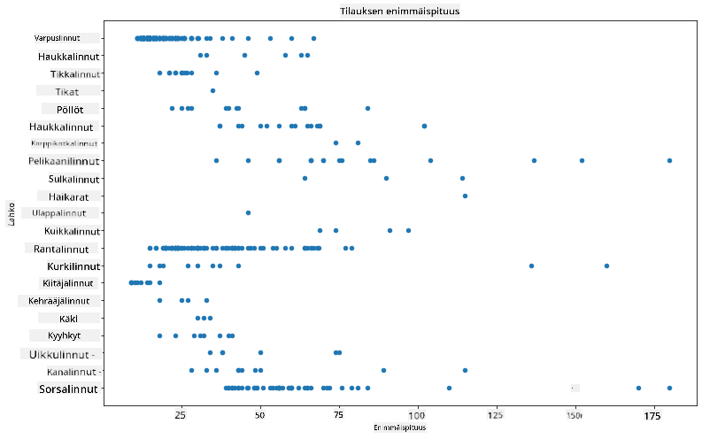
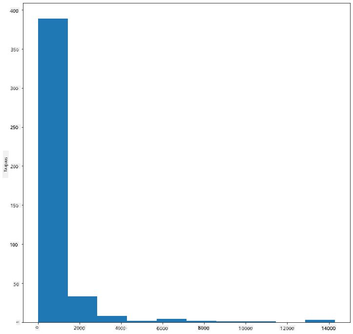
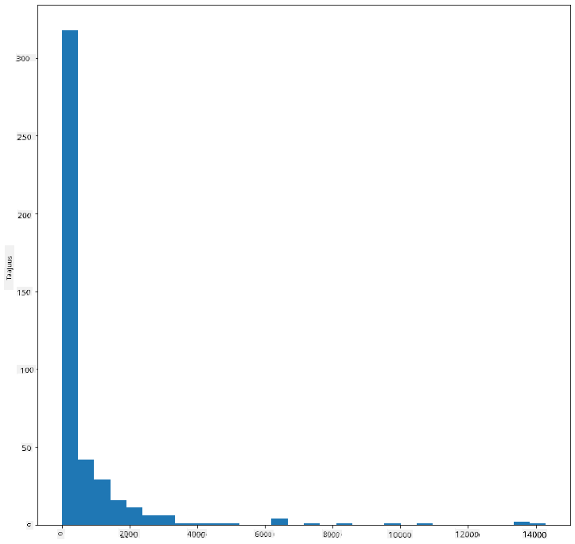
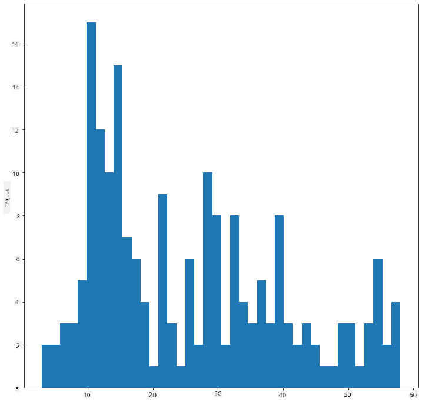
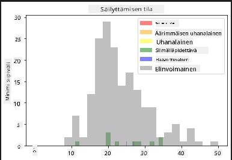
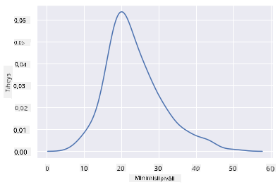
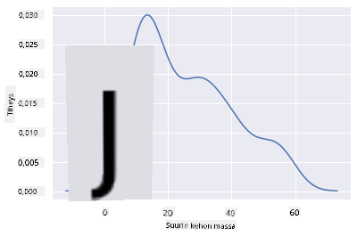
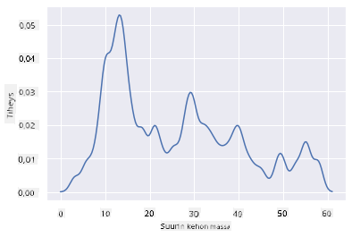
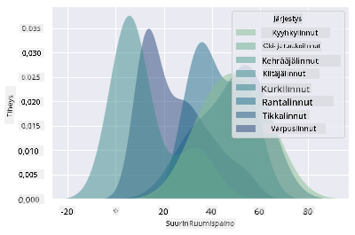
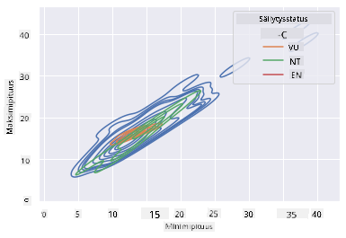

<!--
CO_OP_TRANSLATOR_METADATA:
{
  "original_hash": "02ce904bc1e2bfabb7dc05c25aae375c",
  "translation_date": "2025-09-04T19:44:37+00:00",
  "source_file": "3-Data-Visualization/10-visualization-distributions/README.md",
  "language_code": "fi"
}
-->
# Visualisointi: Jakaumat

| ](../../sketchnotes/10-Visualizing-Distributions.png)|
|:---:|
| Jakaumien visualisointi - _Sketchnote by [@nitya](https://twitter.com/nitya)_ |

Edellisessä osiossa opit mielenkiintoisia asioita Minnesotan lintuihin liittyvästä datasetistä. Löysit virheellistä dataa visualisoimalla poikkeamia ja tarkastelit lintukategorioiden eroja niiden maksimipituuden perusteella.

## [Ennakkokysely](https://purple-hill-04aebfb03.1.azurestaticapps.net/quiz/18)
## Tutustu lintudatasettiin

Yksi tapa tutkia dataa on tarkastella sen jakaumaa eli sitä, miten data on järjestetty akselilla. Ehkä haluaisit esimerkiksi oppia datasetin yleisestä jakaumasta Minnesotan lintujen maksimisiipivälin tai maksimikehon massan osalta.

Tutkitaanpa joitakin faktoja datasetin jakaumista. Tämän osion juurikansiossa olevassa _notebook.ipynb_-tiedostossa tuo Pandas, Matplotlib ja datasi:

```python
import pandas as pd
import matplotlib.pyplot as plt
birds = pd.read_csv('../../data/birds.csv')
birds.head()
```

|      | Nimi                         | Tieteellinen nimi      | Kategoria             | Lahko        | Heimo    | Suku        | Suojelustatus       | MinPituus | MaxPituus | MinKehonMassa | MaxKehonMassa | MinSiipiväli | MaxSiipiväli |
| ---: | :--------------------------- | :--------------------- | :-------------------- | :----------- | :------- | :---------- | :----------------- | --------: | --------: | ----------: | ----------: | ----------: | ----------: |
|    0 | Mustavatsainen viheltävä ankka | Dendrocygna autumnalis | Ankat/hanhet/vesilinnut | Anseriformes | Anatidae | Dendrocygna | LC                 |        47 |        56 |         652 |        1020 |          76 |          94 |
|    1 | Ruostevatsainen viheltävä ankka | Dendrocygna bicolor    | Ankat/hanhet/vesilinnut | Anseriformes | Anatidae | Dendrocygna | LC                 |        45 |        53 |         712 |        1050 |          85 |          93 |
|    2 | Lumihanhi                   | Anser caerulescens     | Ankat/hanhet/vesilinnut | Anseriformes | Anatidae | Anser       | LC                 |        64 |        79 |        2050 |        4050 |         135 |         165 |
|    3 | Rossin hanhi                 | Anser rossii           | Ankat/hanhet/vesilinnut | Anseriformes | Anatidae | Anser       | LC                 |      57.3 |        64 |        1066 |        1567 |         113 |         116 |
|    4 | Iso valkoposkihanhi          | Anser albifrons        | Ankat/hanhet/vesilinnut | Anseriformes | Anatidae | Anser       | LC                 |        64 |        81 |        1930 |        3310 |         130 |         165 |

Yleisesti ottaen datan jakaumaa voi tarkastella nopeasti käyttämällä hajontakaaviota, kuten teimme edellisessä osiossa:

```python
birds.plot(kind='scatter',x='MaxLength',y='Order',figsize=(12,8))

plt.title('Max Length per Order')
plt.ylabel('Order')
plt.xlabel('Max Length')

plt.show()
```


Tämä antaa yleiskuvan lintujen kehon pituuden jakaumasta per lahko, mutta se ei ole optimaalinen tapa esittää todellisia jakaumia. Tämä tehtävä hoidetaan yleensä histogrammin avulla.

## Työskentely histogrammien kanssa

Matplotlib tarjoaa erinomaisia tapoja visualisoida datan jakaumia histogrammien avulla. Tämä kaaviotyyppi muistuttaa pylväsdiagrammia, jossa jakauma näkyy pylväiden nousuina ja laskuina. Histogrammin luomiseen tarvitaan numeerista dataa. Histogrammin luomiseksi voit piirtää kaavion määrittämällä tyypiksi 'hist' histogrammia varten. Tämä kaavio näyttää MaxBodyMass-jakauman koko datasetin numeerisen datan osalta. Jakamalla sille annettu data pienempiin osiin (bins), se voi näyttää datan arvojen jakauman:

```python
birds['MaxBodyMass'].plot(kind = 'hist', bins = 10, figsize = (12,12))
plt.show()
```


Kuten näet, suurin osa datasetin yli 400 linnusta sijoittuu alle 2000 Max Body Mass -arvoon. Saat lisää tietoa datasta muuttamalla `bins`-parametrin suuremmaksi, esimerkiksi 30:

```python
birds['MaxBodyMass'].plot(kind = 'hist', bins = 30, figsize = (12,12))
plt.show()
```


Tämä kaavio näyttää jakauman hieman tarkemmalla tavalla. Vähemmän vasemmalle vinoutunut kaavio voidaan luoda varmistamalla, että valitset vain tietyn alueen sisällä olevan datan:

Suodata datasi niin, että saat vain ne linnut, joiden kehon massa on alle 60, ja näytä 40 `bins`:

```python
filteredBirds = birds[(birds['MaxBodyMass'] > 1) & (birds['MaxBodyMass'] < 60)]      
filteredBirds['MaxBodyMass'].plot(kind = 'hist',bins = 40,figsize = (12,12))
plt.show()     
```


✅ Kokeile muita suodattimia ja datapisteitä. Näytä datan koko jakauma poistamalla `['MaxBodyMass']`-suodatin, jotta näet nimettyjä jakaumia.

Histogrammi tarjoaa myös mukavia väritys- ja nimitysparannuksia, joita kannattaa kokeilla:

Luo 2D-histogrammi vertaillaksesi kahden jakauman välistä suhdetta. Verrataan `MaxBodyMass` ja `MaxLength`. Matplotlib tarjoaa sisäänrakennetun tavan näyttää yhtymäkohdat kirkkaammilla väreillä:

```python
x = filteredBirds['MaxBodyMass']
y = filteredBirds['MaxLength']

fig, ax = plt.subplots(tight_layout=True)
hist = ax.hist2d(x, y)
```
Näyttää siltä, että näiden kahden elementin välillä on odotettu korrelaatio odotetulla akselilla, ja yksi erityisen vahva yhtymäkohta:


Histogrammit toimivat oletuksena hyvin numeerisen datan kanssa. Entä jos haluat nähdä jakaumia tekstidatan perusteella? 
## Tutki datasettiä tekstidatan jakaumien osalta 

Tämä datasetti sisältää myös hyvää tietoa lintujen kategoriasta sekä niiden suvusta, lajista ja heimosta sekä suojelustatuksesta. Tutkitaanpa tätä suojelustatustietoa. Mikä on lintujen jakauma niiden suojelustatuksen mukaan?

> ✅ Datasetissä käytetään useita lyhenteitä kuvaamaan suojelustatusta. Nämä lyhenteet tulevat [IUCN:n punaisista luokista](https://www.iucnredlist.org/), organisaatiosta, joka luokittelee lajien statuksen.
> 
> - CR: Äärimmäisen uhanalainen
> - EN: Uhanalainen
> - EX: Sukupuuttoon kuollut
> - LC: Elinvoimainen
> - NT: Lähes uhanalainen
> - VU: Haavoittuvainen

Nämä ovat tekstipohjaisia arvoja, joten sinun täytyy tehdä muunnos histogrammin luomiseksi. Käytä filteredBirds-dataframea ja näytä sen suojelustatus yhdessä minimisiipivälin kanssa. Mitä huomaat? 

```python
x1 = filteredBirds.loc[filteredBirds.ConservationStatus=='EX', 'MinWingspan']
x2 = filteredBirds.loc[filteredBirds.ConservationStatus=='CR', 'MinWingspan']
x3 = filteredBirds.loc[filteredBirds.ConservationStatus=='EN', 'MinWingspan']
x4 = filteredBirds.loc[filteredBirds.ConservationStatus=='NT', 'MinWingspan']
x5 = filteredBirds.loc[filteredBirds.ConservationStatus=='VU', 'MinWingspan']
x6 = filteredBirds.loc[filteredBirds.ConservationStatus=='LC', 'MinWingspan']

kwargs = dict(alpha=0.5, bins=20)

plt.hist(x1, **kwargs, color='red', label='Extinct')
plt.hist(x2, **kwargs, color='orange', label='Critically Endangered')
plt.hist(x3, **kwargs, color='yellow', label='Endangered')
plt.hist(x4, **kwargs, color='green', label='Near Threatened')
plt.hist(x5, **kwargs, color='blue', label='Vulnerable')
plt.hist(x6, **kwargs, color='gray', label='Least Concern')

plt.gca().set(title='Conservation Status', ylabel='Min Wingspan')
plt.legend();
```



Näyttää siltä, ettei minimisiipivälin ja suojelustatuksen välillä ole hyvää korrelaatiota. Testaa datasetin muita elementtejä tällä menetelmällä. Voit kokeilla myös erilaisia suodattimia. Löydätkö mitään korrelaatiota?

## Tiheyskaaviot

Olet ehkä huomannut, että tähän mennessä tarkastellut histogrammit ovat "askelmia" eivätkä virtaa sujuvasti kaaren muodossa. Näyttääksesi tasaisemman tiheyskaavion, voit kokeilla tiheyskaaviota.

Tiheyskaavioiden kanssa työskentelyä varten tutustu uuteen visualisointikirjastoon, [Seaborn](https://seaborn.pydata.org/generated/seaborn.kdeplot.html). 

Lataa Seaborn ja kokeile perus tiheyskaaviota:

```python
import seaborn as sns
import matplotlib.pyplot as plt
sns.kdeplot(filteredBirds['MinWingspan'])
plt.show()
```


Voit nähdä, kuinka kaavio muistuttaa aiempaa minimisiipivälin kaaviota; se on vain hieman tasaisempi. Seabornin dokumentaation mukaan "histogrammiin verrattuna KDE voi tuottaa kaavion, joka on vähemmän sekava ja helpommin tulkittava, erityisesti piirtäessä useita jakaumia. Mutta se voi aiheuttaa vääristymiä, jos taustalla oleva jakauma on rajattu tai ei tasainen. Kuten histogrammi, myös esityksen laatu riippuu hyvien tasoitusparametrien valinnasta." [lähde](https://seaborn.pydata.org/generated/seaborn.kdeplot.html) Toisin sanoen, poikkeamat saavat kaaviosi käyttäytymään huonosti.

Jos haluaisit palata siihen epätasaiseen MaxBodyMass-linjaan toisessa rakentamassasi kaaviossa, voisit tasoittaa sen hyvin luomalla sen uudelleen tällä menetelmällä:

```python
sns.kdeplot(filteredBirds['MaxBodyMass'])
plt.show()
```


Jos haluaisit tasaisen, mutta ei liian tasaisen linjan, muokkaa `bw_adjust`-parametria: 

```python
sns.kdeplot(filteredBirds['MaxBodyMass'], bw_adjust=.2)
plt.show()
```


✅ Lue tämän kaaviotyypin käytettävissä olevista parametreista ja kokeile!

Tämä kaaviotyyppi tarjoaa kauniisti selittäviä visualisointeja. Muutamalla koodirivillä voit esimerkiksi näyttää lintujen maksimikehon massan tiheyden per lahko:

```python
sns.kdeplot(
   data=filteredBirds, x="MaxBodyMass", hue="Order",
   fill=True, common_norm=False, palette="crest",
   alpha=.5, linewidth=0,
)
```



Voit myös kartoittaa useiden muuttujien tiheyden yhdessä kaaviossa. Testaa lintujen MaxLength ja MinLength verrattuna niiden suojelustatukseen:

```python
sns.kdeplot(data=filteredBirds, x="MinLength", y="MaxLength", hue="ConservationStatus")
```



Ehkä kannattaa tutkia, onko 'Haavoittuvien' lintujen klusteri niiden pituuksien mukaan merkityksellinen vai ei.

## 🚀 Haaste

Histogrammit ovat kehittyneempiä kaaviotyyppejä kuin perushajontakaaviot, pylväsdiagrammit tai viivakaaviot. Etsi internetistä hyviä esimerkkejä histogrammien käytöstä. Miten niitä käytetään, mitä ne osoittavat ja millä aloilla tai tutkimusalueilla niitä yleensä käytetään?

## [Jälkikysely](https://ff-quizzes.netlify.app/en/ds/)

## Kertaus ja itseopiskelu

Tässä osiossa käytit Matplotlibia ja aloitit työskentelyn Seabornin kanssa näyttääkseen kehittyneempiä kaavioita. Tutki Seabornin `kdeplot`-toimintoa, "jatkuva todennäköisyystiheyskäyrä yhdessä tai useammassa ulottuvuudessa". Lue [dokumentaatio](https://seaborn.pydata.org/generated/seaborn.kdeplot.html) ymmärtääksesi, miten se toimii.

## Tehtävä

[Käytä taitojasi](assignment.md)

---

**Vastuuvapauslauseke**:  
Tämä asiakirja on käännetty käyttämällä tekoälypohjaista käännöspalvelua [Co-op Translator](https://github.com/Azure/co-op-translator). Vaikka pyrimme tarkkuuteen, huomioithan, että automaattiset käännökset voivat sisältää virheitä tai epätarkkuuksia. Alkuperäistä asiakirjaa sen alkuperäisellä kielellä tulisi pitää ensisijaisena lähteenä. Kriittisen tiedon osalta suositellaan ammattimaista ihmiskäännöstä. Emme ole vastuussa väärinkäsityksistä tai virhetulkinnoista, jotka johtuvat tämän käännöksen käytöstä.