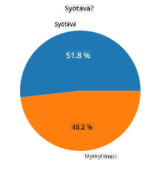
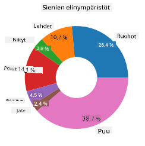
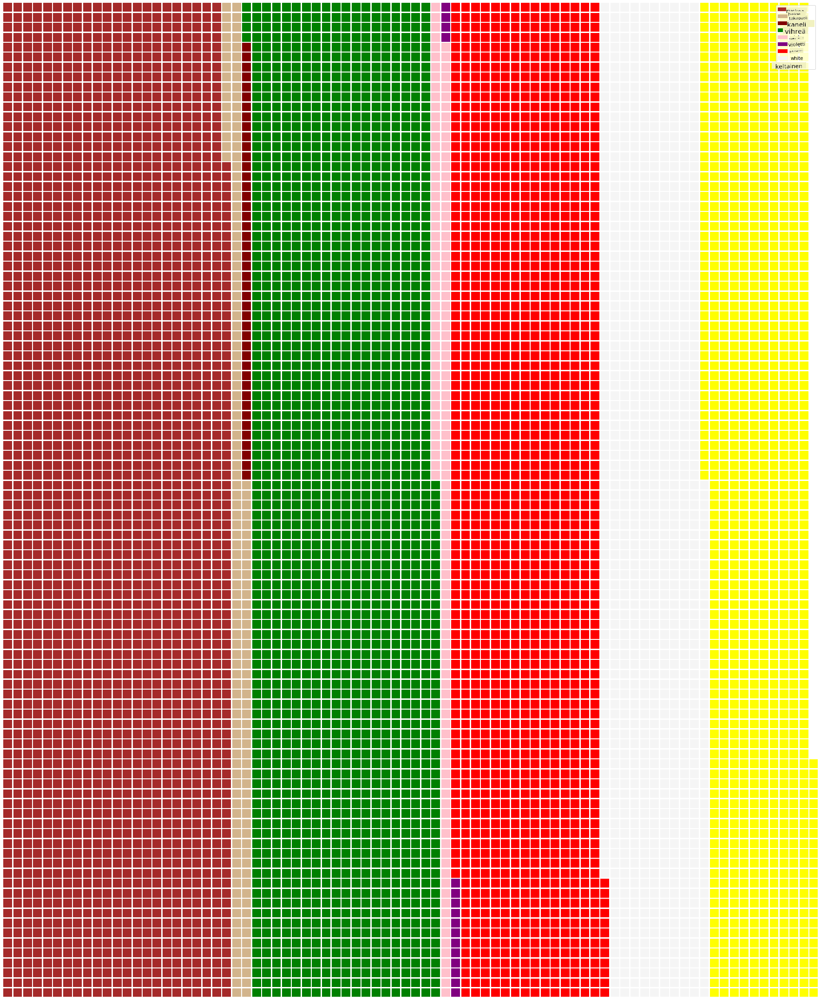

<!--
CO_OP_TRANSLATOR_METADATA:
{
  "original_hash": "cc490897ee2d276870472bcb31602d03",
  "translation_date": "2025-09-04T19:42:33+00:00",
  "source_file": "3-Data-Visualization/11-visualization-proportions/README.md",
  "language_code": "fi"
}
-->
# Visualisoi osuuksia

| ](../../sketchnotes/11-Visualizing-Proportions.png)|
|:---:|
|Osuuksien visualisointi - _Sketchnote by [@nitya](https://twitter.com/nitya)_ |

Tässä oppitunnissa käytät luontoon keskittyvää datasettiä visualisoidaksesi osuuksia, kuten kuinka monta erilaista sienityyppiä esiintyy datasetissä, joka käsittelee sieniä. Tutustutaan näihin kiehtoviin sieniin datasetin avulla, joka on peräisin Audubonilta ja sisältää tietoja 23 kiduksellisen sienen lajista Agaricus- ja Lepiota-suvuista. Kokeilet herkullisia visualisointeja, kuten:

- Piirakkakaavioita 🥧
- Donitsikaavioita 🍩
- Vohvelikaavioita 🧇

> 💡 Microsoft Researchin [Charticulator](https://charticulator.com) on erittäin mielenkiintoinen projekti, joka tarjoaa ilmaisen vedä ja pudota -käyttöliittymän datavisualisointeihin. Yhdessä heidän tutoriaaleistaan käytetään myös tätä sienidatasettiä! Voit siis tutkia dataa ja oppia kirjaston käyttöä samanaikaisesti: [Charticulator-tutoriaali](https://charticulator.com/tutorials/tutorial4.html).

## [Oppitunnin jälkeinen kysely](https://ff-quizzes.netlify.app/en/ds/)

## Tutustu sieniin 🍄

Sienet ovat erittäin mielenkiintoisia. Tuodaan datasetti niiden tutkimiseksi:

```python
import pandas as pd
import matplotlib.pyplot as plt
mushrooms = pd.read_csv('../../data/mushrooms.csv')
mushrooms.head()
```
Taulukko tulostetaan, ja siinä on loistavaa dataa analysoitavaksi:


| luokka    | lakin muoto | lakin pinta | lakin väri | mustelmat | haju     | kiduskiinnitys | kidusväli   | kiduskoko | kidusväri  | jalan muoto | jalan juuri | jalan pinta renkaan yläpuolella | jalan pinta renkaan alapuolella | jalan väri renkaan yläpuolella | jalan väri renkaan alapuolella | verhon tyyppi | verhon väri | renkaiden määrä | renkaan tyyppi | itiöprintin väri | populaatio | elinympäristö |
| --------- | ----------- | ----------- | ---------- | --------- | -------- | -------------- | ----------- | --------- | ---------- | ----------- | ----------- | ------------------------------- | ------------------------------- | ----------------------------- | ----------------------------- | ------------- | ---------- | --------------- | ------------- | ---------------- | ---------- | ------------- |
| Myrkyllinen | Kupera     | Sileä       | Ruskea     | Mustelmat | Pistävä  | Vapaa          | Tiivis      | Kapea     | Musta      | Laajeneva   | Tasainen    | Sileä                          | Sileä                          | Valkoinen                     | Valkoinen                     | Osittainen    | Valkoinen  | Yksi            | Riippuva      | Musta            | Hajallaan  | Kaupunki      |
| Syötävä    | Kupera     | Sileä       | Keltainen  | Mustelmat | Manteli  | Vapaa          | Tiivis      | Leveä     | Musta      | Laajeneva   | Nuija       | Sileä                          | Sileä                          | Valkoinen                     | Valkoinen                     | Osittainen    | Valkoinen  | Yksi            | Riippuva      | Ruskea           | Lukuisia   | Ruohikko      |
| Syötävä    | Kellomainen | Sileä       | Valkoinen  | Mustelmat | Anis     | Vapaa          | Tiivis      | Leveä     | Ruskea     | Laajeneva   | Nuija       | Sileä                          | Sileä                          | Valkoinen                     | Valkoinen                     | Osittainen    | Valkoinen  | Yksi            | Riippuva      | Ruskea           | Lukuisia   | Niitty        |
| Myrkyllinen | Kupera     | Suomuinen   | Valkoinen  | Mustelmat | Pistävä  | Vapaa          | Tiivis      | Kapea     | Ruskea     | Laajeneva   | Tasainen    | Sileä                          | Sileä                          | Valkoinen                     | Valkoinen                     | Osittainen    | Valkoinen  | Yksi            | Riippuva      | Musta            | Hajallaan  | Kaupunki      |

Heti huomaat, että kaikki data on tekstimuotoista. Sinun täytyy muuntaa tämä data, jotta voit käyttää sitä kaaviossa. Suurin osa datasta on itse asiassa esitetty objektina:

```python
print(mushrooms.select_dtypes(["object"]).columns)
```

Tuloste on:

```output
Index(['class', 'cap-shape', 'cap-surface', 'cap-color', 'bruises', 'odor',
       'gill-attachment', 'gill-spacing', 'gill-size', 'gill-color',
       'stalk-shape', 'stalk-root', 'stalk-surface-above-ring',
       'stalk-surface-below-ring', 'stalk-color-above-ring',
       'stalk-color-below-ring', 'veil-type', 'veil-color', 'ring-number',
       'ring-type', 'spore-print-color', 'population', 'habitat'],
      dtype='object')
```
Muunna tämä data ja muuta 'luokka'-sarake kategoriaksi:

```python
cols = mushrooms.select_dtypes(["object"]).columns
mushrooms[cols] = mushrooms[cols].astype('category')
```

```python
edibleclass=mushrooms.groupby(['class']).count()
edibleclass
```

Kun tulostat sienidatan, näet, että se on ryhmitelty kategorioihin myrkyllisen/syötävän luokan mukaan:


|           | lakin muoto | lakin pinta | lakin väri | mustelmat | haju | kiduskiinnitys | kidusväli   | kiduskoko | kidusväri  | jalan muoto | ... | jalan pinta renkaan alapuolella | jalan väri renkaan yläpuolella | jalan väri renkaan alapuolella | verhon tyyppi | verhon väri | renkaiden määrä | renkaan tyyppi | itiöprintin väri | populaatio | elinympäristö |
| --------- | ----------- | ----------- | ---------- | --------- | ---- | -------------- | ----------- | --------- | ---------- | ----------- | --- | ------------------------------- | ----------------------------- | ----------------------------- | ------------- | ---------- | --------------- | ------------- | ---------------- | ---------- | ------------- |
| luokka    |             |             |            |           |      |                |             |           |            |             |     |                               |                             |                             |               |            |                 |               |                  |            |               |
| Syötävä   | 4208        | 4208        | 4208       | 4208      | 4208 | 4208           | 4208        | 4208      | 4208       | 4208        | ... | 4208                          | 4208                        | 4208                        | 4208          | 4208       | 4208            | 4208          | 4208             | 4208       | 4208          |
| Myrkyllinen | 3916      | 3916        | 3916       | 3916      | 3916 | 3916           | 3916        | 3916      | 3916       | 3916        | ... | 3916                          | 3916                        | 3916                        | 3916          | 3916       | 3916            | 3916          | 3916             | 3916       | 3916          |

Jos noudatat tämän taulukon järjestystä luodaksesi luokkakategorian tunnisteet, voit rakentaa piirakkakaavion:

## Piirakka!

```python
labels=['Edible','Poisonous']
plt.pie(edibleclass['population'],labels=labels,autopct='%.1f %%')
plt.title('Edible?')
plt.show()
```
Voila, piirakkakaavio, joka näyttää tämän datan osuudet näiden kahden sieniluokan mukaan. On erittäin tärkeää saada tunnisteiden järjestys oikein, erityisesti tässä, joten varmista tunnisteiden järjestys ennen kaavion rakentamista!



## Donitsit!

Hieman visuaalisesti kiinnostavampi piirakkakaavio on donitsikaavio, joka on piirakkakaavio, jossa on reikä keskellä. Tarkastellaan dataamme tällä menetelmällä.

Tutkitaan eri elinympäristöjä, joissa sienet kasvavat:

```python
habitat=mushrooms.groupby(['habitat']).count()
habitat
```
Tässä ryhmitellään data elinympäristön mukaan. Niitä on listattu 7, joten käytä niitä donitsikaavion tunnisteina:

```python
labels=['Grasses','Leaves','Meadows','Paths','Urban','Waste','Wood']

plt.pie(habitat['class'], labels=labels,
        autopct='%1.1f%%', pctdistance=0.85)
  
center_circle = plt.Circle((0, 0), 0.40, fc='white')
fig = plt.gcf()

fig.gca().add_artist(center_circle)
  
plt.title('Mushroom Habitats')
  
plt.show()
```



Tämä koodi piirtää kaavion ja keskirenkaan, ja lisää sen kaavioon. Muokkaa keskirenkaan leveyttä muuttamalla arvoa `0.40`.

Donitsikaavioita voi muokata monin tavoin tunnisteiden muuttamiseksi. Tunnisteet voidaan erityisesti korostaa luettavuuden parantamiseksi. Lue lisää [dokumentaatiosta](https://matplotlib.org/stable/gallery/pie_and_polar_charts/pie_and_donut_labels.html?highlight=donut).

Kun tiedät, miten ryhmitellä dataa ja näyttää sen piirakkana tai donitsina, voit tutkia muita kaaviotyyppejä. Kokeile vohvelikaaviota, joka on vain erilainen tapa tutkia määriä.
## Vohvelit!

'Vohveli'-tyyppinen kaavio on erilainen tapa visualisoida määriä 2D-ruudukon neliöinä. Kokeile visualisoida eri sienilakkivärien määriä tässä datasetissä. Tätä varten sinun täytyy asentaa apukirjasto nimeltä [PyWaffle](https://pypi.org/project/pywaffle/) ja käyttää Matplotlibia:

```python
pip install pywaffle
```

Valitse segmentti datastasi ryhmittelyä varten:

```python
capcolor=mushrooms.groupby(['cap-color']).count()
capcolor
```

Luo vohvelikaavio luomalla tunnisteet ja ryhmittelemällä datasi:

```python
import pandas as pd
import matplotlib.pyplot as plt
from pywaffle import Waffle
  
data ={'color': ['brown', 'buff', 'cinnamon', 'green', 'pink', 'purple', 'red', 'white', 'yellow'],
    'amount': capcolor['class']
     }
  
df = pd.DataFrame(data)
  
fig = plt.figure(
    FigureClass = Waffle,
    rows = 100,
    values = df.amount,
    labels = list(df.color),
    figsize = (30,30),
    colors=["brown", "tan", "maroon", "green", "pink", "purple", "red", "whitesmoke", "yellow"],
)
```

Vohvelikaaviota käyttämällä näet selvästi tämän sienidatasetin lakin värien osuudet. Mielenkiintoista on, että datasetissä on paljon vihreälakkisia sieniä!



✅ PyWaffle tukee kaavioiden sisällä ikoneita, jotka käyttävät mitä tahansa [Font Awesomen](https://fontawesome.com/) saatavilla olevaa ikonia. Kokeile luoda vieläkin mielenkiintoisempia vohvelikaavioita käyttämällä ikoneita neliöiden sijaan.

Tässä oppitunnissa opit kolme tapaa visualisoida osuuksia. Ensin sinun täytyy ryhmitellä data kategorioihin ja sitten päättää, mikä on paras tapa esittää data - piirakka, donitsi tai vohveli. Kaikki ovat herkullisia ja tarjoavat käyttäjälle välittömän katsauksen datasettiin.

## 🚀 Haaste

Kokeile luoda nämä herkulliset kaaviot uudelleen [Charticulatorissa](https://charticulator.com).
## [Oppitunnin jälkeinen kysely](https://purple-hill-04aebfb03.1.azurestaticapps.net/quiz/21)

## Kertaus & Itseopiskelu

Joskus ei ole ilmeistä, milloin käyttää piirakka-, donitsi- tai vohvelikaaviota. Tässä muutamia artikkeleita aiheesta:

https://www.beautiful.ai/blog/battle-of-the-charts-pie-chart-vs-donut-chart

https://medium.com/@hypsypops/pie-chart-vs-donut-chart-showdown-in-the-ring-5d24fd86a9ce

https://www.mit.edu/~mbarker/formula1/f1help/11-ch-c6.htm

https://medium.datadriveninvestor.com/data-visualization-done-the-right-way-with-tableau-waffle-chart-fdf2a19be402

Tee tutkimusta löytääksesi lisää tietoa tästä hankalasta päätöksestä.
## Tehtävä

[Kokeile Excelissä](assignment.md)

---

**Vastuuvapauslauseke**:  
Tämä asiakirja on käännetty käyttämällä tekoälypohjaista käännöspalvelua [Co-op Translator](https://github.com/Azure/co-op-translator). Vaikka pyrimme tarkkuuteen, huomioithan, että automaattiset käännökset voivat sisältää virheitä tai epätarkkuuksia. Alkuperäistä asiakirjaa sen alkuperäisellä kielellä tulisi pitää ensisijaisena lähteenä. Kriittisen tiedon osalta suositellaan ammattimaista ihmiskäännöstä. Emme ole vastuussa väärinkäsityksistä tai virhetulkinnoista, jotka johtuvat tämän käännöksen käytöstä.