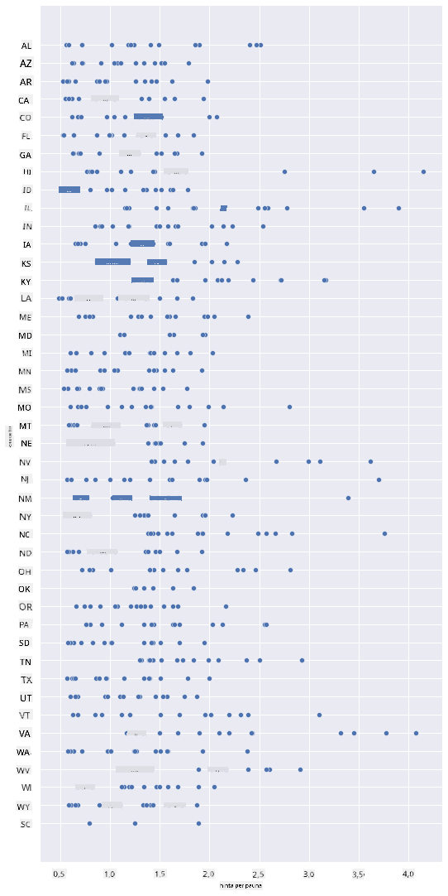
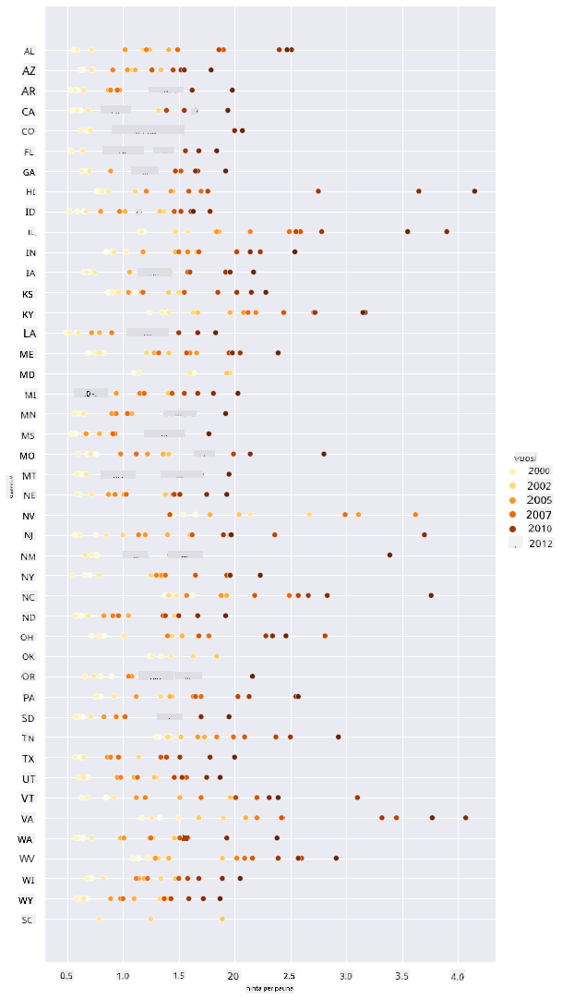
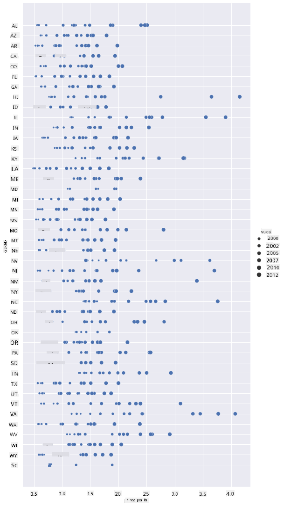
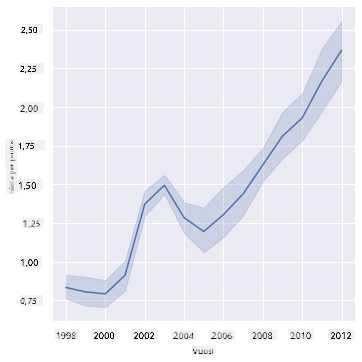
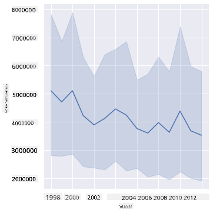
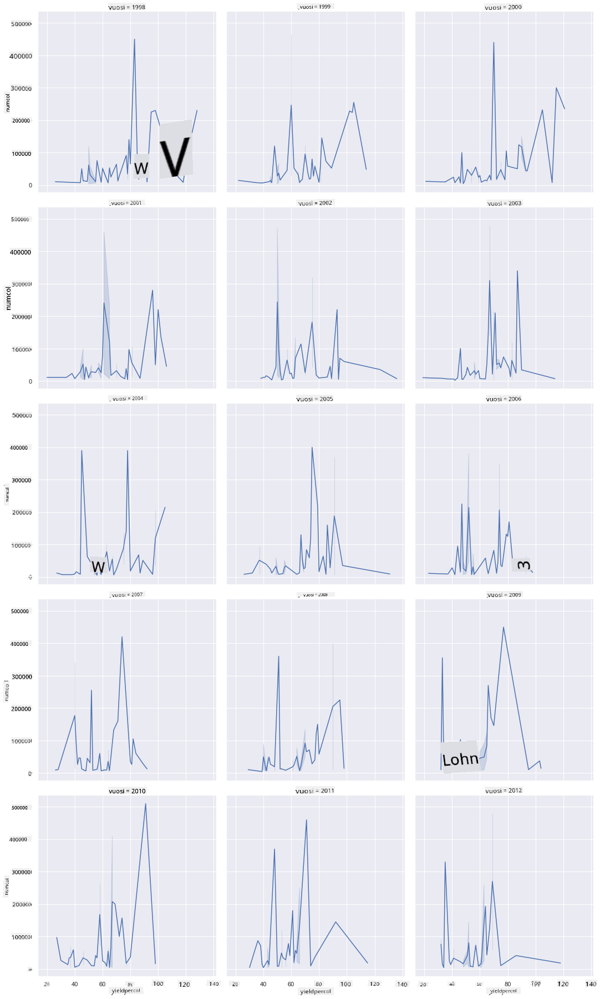
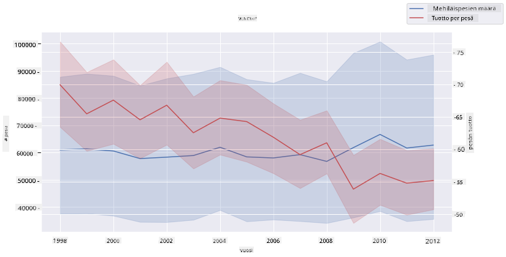

<!--
CO_OP_TRANSLATOR_METADATA:
{
  "original_hash": "b29e427401499e81f4af55a8c4afea76",
  "translation_date": "2025-09-04T19:44:05+00:00",
  "source_file": "3-Data-Visualization/12-visualization-relationships/README.md",
  "language_code": "fi"
}
-->
# Suhteiden visualisointi: Kaikki hunajasta 🍯

| ](../../sketchnotes/12-Visualizing-Relationships.png)|
|:---:|
|Suhteiden visualisointi - _Sketchnote by [@nitya](https://twitter.com/nitya)_ |

Jatkaen tutkimuksemme luontoteemaa, tutustutaan mielenkiintoisiin visualisointeihin, jotka esittävät eri hunajatyyppeihin liittyviä suhteita Yhdysvaltain maatalousministeriön ([United States Department of Agriculture](https://www.nass.usda.gov/About_NASS/index.php)) tuottaman datasetin pohjalta.

Tämä noin 600 kohteen datasetti näyttää hunajantuotannon monissa Yhdysvaltain osavaltioissa. Esimerkiksi voit tarkastella mehiläispesien määrää, tuottoa per pesä, kokonaistuotantoa, varastoja, hintaa per pauna ja hunajan tuotannon arvoa tietyssä osavaltiossa vuosina 1998–2012, yksi rivi per vuosi jokaiselle osavaltiolle.

Olisi mielenkiintoista visualisoida suhde tietyn osavaltion vuosittaisen tuotannon ja esimerkiksi hunajan hinnan välillä kyseisessä osavaltiossa. Vaihtoehtoisesti voisit visualisoida osavaltioiden hunajan tuoton per pesä. Tämä ajanjakso kattaa tuhoisan 'CCD:n' eli 'Colony Collapse Disorderin', joka havaittiin ensimmäisen kerran vuonna 2006 (http://npic.orst.edu/envir/ccd.html), joten datasetti on merkityksellinen tutkittavaksi. 🐝

## [Ennakkokysely](https://purple-hill-04aebfb03.1.azurestaticapps.net/quiz/22)

Tässä oppitunnissa voit käyttää Seaborn-kirjastoa, jota olet käyttänyt aiemmin, visualisoidaksesi muuttujien välisiä suhteita. Erityisen mielenkiintoinen on Seabornin `relplot`-toiminto, joka mahdollistaa hajontakaavioiden ja viivakaavioiden nopean visualisoinnin '[tilastollisista suhteista](https://seaborn.pydata.org/tutorial/relational.html?highlight=relationships)', mikä auttaa datatieteilijää ymmärtämään paremmin, miten muuttujat liittyvät toisiinsa.

## Hajontakaaviot

Käytä hajontakaaviota näyttääksesi, miten hunajan hinta on kehittynyt vuosittain osavaltioittain. Seabornin `relplot` ryhmittelee kätevästi osavaltioiden dataa ja näyttää datapisteet sekä kategoriselle että numeeriselle datalle.

Aloitetaan datan ja Seabornin tuonnilla:

```python
import pandas as pd
import matplotlib.pyplot as plt
import seaborn as sns
honey = pd.read_csv('../../data/honey.csv')
honey.head()
```
Huomaat, että hunajadatassa on useita mielenkiintoisia sarakkeita, kuten vuosi ja hinta per pauna. Tutkitaan tätä dataa ryhmiteltynä Yhdysvaltain osavaltioittain:

| osavaltio | pesämäärä | tuotto/pesä | kokonaistuotanto | varastot | hinta/lb | tuotantoarvo | vuosi |
| --------- | --------- | ----------- | ---------------- | -------- | -------- | ------------ | ----- |
| AL        | 16000     | 71          | 1136000          | 159000   | 0.72     | 818000       | 1998 |
| AZ        | 55000     | 60          | 3300000          | 1485000  | 0.64     | 2112000      | 1998 |
| AR        | 53000     | 65          | 3445000          | 1688000  | 0.59     | 2033000      | 1998 |
| CA        | 450000    | 83          | 37350000         | 12326000 | 0.62     | 23157000     | 1998 |
| CO        | 27000     | 72          | 1944000          | 1594000  | 0.7      | 1361000      | 1998 |

Luo perushajontakaavio, joka näyttää hunajan hinnan ja sen alkuperäosavaltion välisen suhteen. Tee `y`-akselista tarpeeksi korkea, jotta kaikki osavaltiot näkyvät:

```python
sns.relplot(x="priceperlb", y="state", data=honey, height=15, aspect=.5);
```


Näytä nyt sama data hunajan värimaailmalla, joka havainnollistaa hinnan kehitystä vuosien varrella. Voit tehdä tämän lisäämällä 'hue'-parametrin, joka näyttää muutoksen vuosi vuodelta:

> ✅ Lue lisää [Seabornin väripaleteista](https://seaborn.pydata.org/tutorial/color_palettes.html) - kokeile kaunista sateenkaarivärimaailmaa!

```python
sns.relplot(x="priceperlb", y="state", hue="year", palette="YlOrBr", data=honey, height=15, aspect=.5);
```


Tämän värimaailman muutoksen avulla näet selvästi vahvan kehityksen hunajan hinnassa vuosien varrella. Jos tarkastelet datasetistä esimerkkijoukkoa (valitse esimerkiksi Arizona), voit nähdä hinnan nousun vuosi vuodelta, muutamia poikkeuksia lukuun ottamatta:

| osavaltio | pesämäärä | tuotto/pesä | kokonaistuotanto | varastot | hinta/lb | tuotantoarvo | vuosi |
| --------- | --------- | ----------- | ---------------- | -------- | -------- | ------------ | ----- |
| AZ        | 55000     | 60          | 3300000          | 1485000  | 0.64     | 2112000      | 1998 |
| AZ        | 52000     | 62          | 3224000          | 1548000  | 0.62     | 1999000      | 1999 |
| AZ        | 40000     | 59          | 2360000          | 1322000  | 0.73     | 1723000      | 2000 |
| AZ        | 43000     | 59          | 2537000          | 1142000  | 0.72     | 1827000      | 2001 |
| AZ        | 38000     | 63          | 2394000          | 1197000  | 1.08     | 2586000      | 2002 |
| AZ        | 35000     | 72          | 2520000          | 983000   | 1.34     | 3377000      | 2003 |
| AZ        | 32000     | 55          | 1760000          | 774000   | 1.11     | 1954000      | 2004 |
| AZ        | 36000     | 50          | 1800000          | 720000   | 1.04     | 1872000      | 2005 |
| AZ        | 30000     | 65          | 1950000          | 839000   | 0.91     | 1775000      | 2006 |
| AZ        | 30000     | 64          | 1920000          | 902000   | 1.26     | 2419000      | 2007 |
| AZ        | 25000     | 64          | 1600000          | 336000   | 1.26     | 2016000      | 2008 |
| AZ        | 20000     | 52          | 1040000          | 562000   | 1.45     | 1508000      | 2009 |
| AZ        | 24000     | 77          | 1848000          | 665000   | 1.52     | 2809000      | 2010 |
| AZ        | 23000     | 53          | 1219000          | 427000   | 1.55     | 1889000      | 2011 |
| AZ        | 22000     | 46          | 1012000          | 253000   | 1.79     | 1811000      | 2012 |

Toinen tapa visualisoida tätä kehitystä on käyttää kokoa värin sijaan. Värisokeille käyttäjille tämä voi olla parempi vaihtoehto. Muokkaa visualisointiasi näyttämään hinnan nousu pisteen koon kasvuna:

```python
sns.relplot(x="priceperlb", y="state", size="year", data=honey, height=15, aspect=.5);
```
Näet pisteiden koon kasvavan vähitellen.



Onko tämä yksinkertainen tapaus kysynnästä ja tarjonnasta? Ilmastonmuutoksen ja pesäkatojen kaltaisten tekijöiden vuoksi, onko hunajaa vähemmän saatavilla ostettavaksi vuosi vuodelta, ja siksi hinta nousee?

Tutkiaksemme korrelaatiota joidenkin datasetin muuttujien välillä, tarkastellaan viivakaavioita.

## Viivakaaviot

Kysymys: Onko hunajan hinnassa per pauna selkeä nousu vuosi vuodelta? Tämä voidaan helposti havaita luomalla yksittäinen viivakaavio:

```python
sns.relplot(x="year", y="priceperlb", kind="line", data=honey);
```
Vastaus: Kyllä, muutamia poikkeuksia lukuun ottamatta vuoden 2003 tienoilla:



✅ Koska Seaborn aggregoi dataa yhden viivan ympärille, se näyttää "useat mittaukset kussakin x-arvossa piirtämällä keskiarvon ja 95 %:n luottamusvälin keskiarvon ympärille". [Lähde](https://seaborn.pydata.org/tutorial/relational.html). Tämä aikaa vievä toiminto voidaan poistaa lisäämällä `ci=None`.

Kysymys: No, vuonna 2003 näkyykö myös piikki hunajan tarjonnassa? Entä jos tarkastelet kokonaistuotantoa vuosi vuodelta?

```python
sns.relplot(x="year", y="totalprod", kind="line", data=honey);
```



Vastaus: Ei oikeastaan. Jos tarkastelet kokonaistuotantoa, se näyttää itse asiassa kasvaneen kyseisenä vuonna, vaikka yleisesti ottaen hunajan tuotantomäärä on laskussa näinä vuosina.

Kysymys: Siinä tapauksessa, mikä olisi voinut aiheuttaa piikin hunajan hinnassa vuoden 2003 tienoilla?

Tämän selvittämiseksi voit tutkia facet grid -visualisointia.

## Facet gridit

Facet gridit ottavat yhden datasetin osan (meidän tapauksessamme voit valita 'vuoden', jotta vältetään liian monien facetien tuottaminen). Seaborn voi sitten tehdä kaavion jokaiselle facetille valituista x- ja y-koordinaateista helpomman visuaalisen vertailun mahdollistamiseksi. Erottuuko vuosi 2003 tässä vertailussa?

Luo facet grid jatkamalla `relplot`-toiminnon käyttöä, kuten [Seabornin dokumentaatio](https://seaborn.pydata.org/generated/seaborn.FacetGrid.html?highlight=facetgrid#seaborn.FacetGrid) suosittelee.

```python
sns.relplot(
    data=honey, 
    x="yieldpercol", y="numcol",
    col="year", 
    col_wrap=3,
    kind="line"
```
Tässä visualisoinnissa voit verrata tuottoa per pesä ja pesien määrää vuosi vuodelta rinnakkain, sarakkeiden wrap-asetuksella 3:



Tässä datasetissä mikään ei erityisesti erotu pesien määrän ja niiden tuoton osalta vuosi vuodelta ja osavaltio osavaltiolta. Onko olemassa toinen tapa tarkastella korrelaatiota näiden kahden muuttujan välillä?

## Kaksiviivaiset kaaviot

Kokeile moniviivakaaviota asettamalla kaksi viivakaaviota päällekkäin, käyttämällä Seabornin 'despine'-toimintoa poistaaksesi niiden ylä- ja oikeat reunat, ja käyttämällä `ax.twinx`-toimintoa [Matplotlibista](https://matplotlib.org/stable/api/_as_gen/matplotlib.axes.Axes.twinx.html). Twinx mahdollistaa kaavion jakamaan x-akselin ja näyttämään kaksi y-akselia. Näytä tuotto per pesä ja pesien määrä päällekkäin:

```python
fig, ax = plt.subplots(figsize=(12,6))
lineplot = sns.lineplot(x=honey['year'], y=honey['numcol'], data=honey, 
                        label = 'Number of bee colonies', legend=False)
sns.despine()
plt.ylabel('# colonies')
plt.title('Honey Production Year over Year');

ax2 = ax.twinx()
lineplot2 = sns.lineplot(x=honey['year'], y=honey['yieldpercol'], ax=ax2, color="r", 
                         label ='Yield per colony', legend=False) 
sns.despine(right=False)
plt.ylabel('colony yield')
ax.figure.legend();
```


Vaikka mikään ei erityisesti erotu vuoden 2003 tienoilla, tämä antaa meille mahdollisuuden päättää oppitunti hieman iloisemmalla nuotilla: vaikka pesien määrä on yleisesti laskussa, pesien määrä näyttää vakiintuvan, vaikka niiden tuotto per pesä on laskussa.

Hyvä mehiläiset, jatkakaa! 🐝❤️

## 🚀 Haaste

Tässä oppitunnissa opit lisää hajontakaavioiden ja facet gridien käytöstä. Haasta itsesi luomaan facet grid käyttäen eri datasettiä, ehkä sellaista, jota käytit aiemmissa oppitunneissa. Huomaa, kuinka kauan niiden luominen kestää ja kuinka sinun täytyy olla varovainen facetien määrän suhteen näitä tekniikoita käyttäessäsi.

## [Jälkikysely](https://ff-quizzes.netlify.app/en/ds/)

## Kertaus & Itseopiskelu

Viivakaaviot voivat olla yksinkertaisia tai melko monimutkaisia. Lue lisää [Seabornin dokumentaatiosta](https://seaborn.pydata.org/generated/seaborn.lineplot.html) eri tavoista, joilla voit rakentaa niitä. Yritä parantaa oppitunnilla luomiasi viivakaavioita dokumentaatiossa mainituilla muilla menetelmillä.

## Tehtävä

[Sukella mehiläispesään](assignment.md)

---

**Vastuuvapauslauseke**:  
Tämä asiakirja on käännetty käyttämällä tekoälypohjaista käännöspalvelua [Co-op Translator](https://github.com/Azure/co-op-translator). Vaikka pyrimme tarkkuuteen, huomioithan, että automaattiset käännökset voivat sisältää virheitä tai epätarkkuuksia. Alkuperäistä asiakirjaa sen alkuperäisellä kielellä tulisi pitää ensisijaisena lähteenä. Kriittisen tiedon osalta suositellaan ammattimaista ihmiskäännöstä. Emme ole vastuussa väärinkäsityksistä tai virhetulkinnoista, jotka johtuvat tämän käännöksen käytöstä.