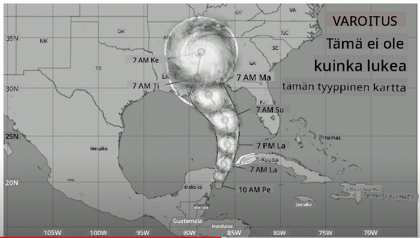
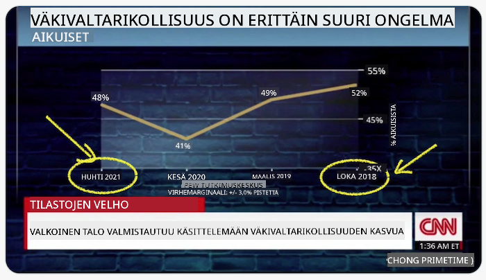
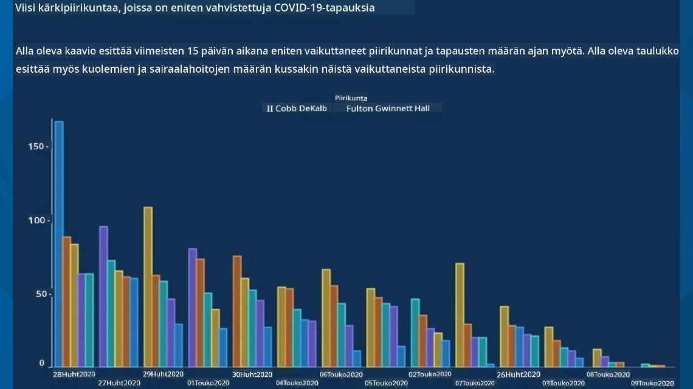
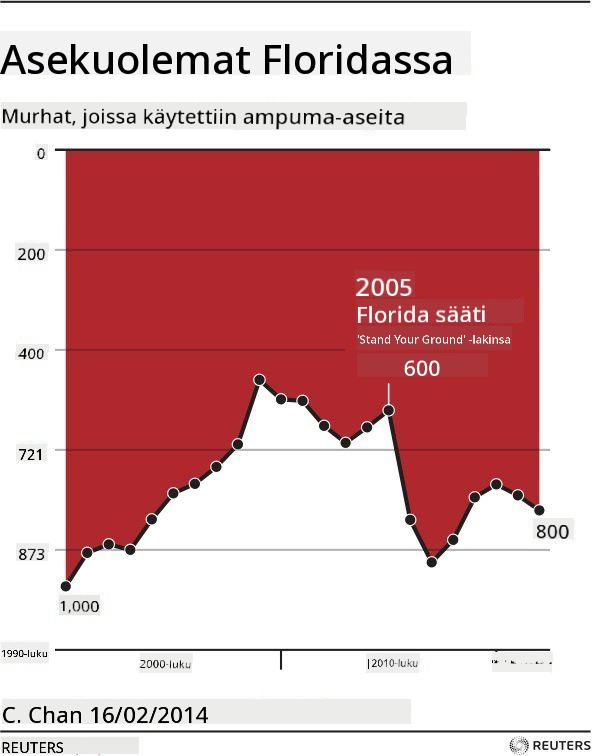
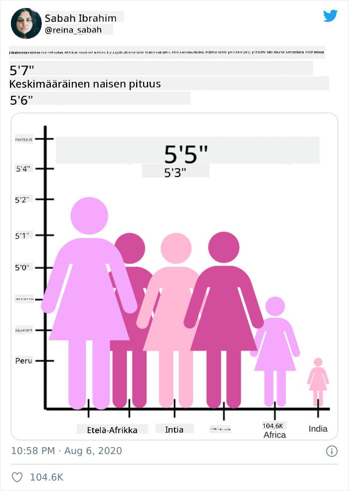
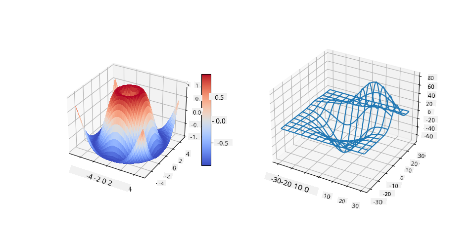
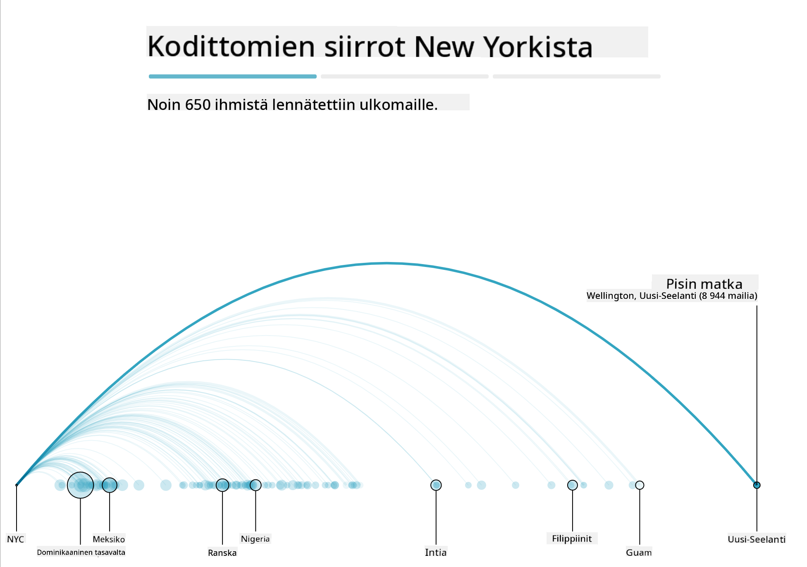
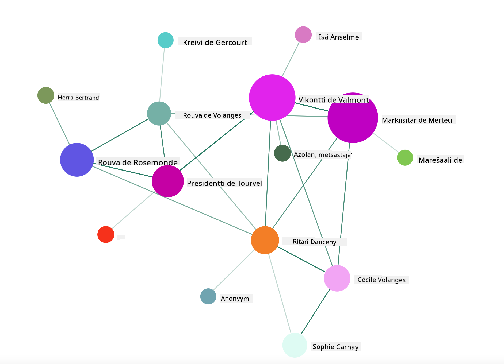

<!--
CO_OP_TRANSLATOR_METADATA:
{
  "original_hash": "4ec4747a9f4f7d194248ea29903ae165",
  "translation_date": "2025-08-26T22:44:57+00:00",
  "source_file": "3-Data-Visualization/13-meaningful-visualizations/README.md",
  "language_code": "fi"
}
-->
# Merkityksellisten visualisointien luominen

| ](../../sketchnotes/13-MeaningfulViz.png)|
|:---:|
| Merkitykselliset visualisoinnit - _Sketchnote by [@nitya](https://twitter.com/nitya)_ |

> "Jos kidutat dataa tarpeeksi kauan, se tunnustaa mitä tahansa" -- [Ronald Coase](https://en.wikiquote.org/wiki/Ronald_Coase)

Yksi datatieteilijän perustaidoista on kyky luoda merkityksellinen datavisualisointi, joka auttaa vastaamaan kysymyksiin, joita sinulla saattaa olla. Ennen datan visualisointia sinun tulee varmistaa, että se on puhdistettu ja valmisteltu, kuten teit aiemmissa oppitunneissa. Tämän jälkeen voit alkaa päättää, miten data esitetään parhaiten.

Tässä oppitunnissa tarkastellaan:

1. Kuinka valita oikea kaaviotyyppi
2. Kuinka välttää harhaanjohtavia kaavioita
3. Kuinka käyttää värejä
4. Kuinka muotoilla kaaviot luettavuuden parantamiseksi
5. Kuinka rakentaa animoituja tai 3D-kaavioita
6. Kuinka luoda luova visualisointi

## [Ennakkokysely](https://purple-hill-04aebfb03.1.azurestaticapps.net/quiz/24)

## Valitse oikea kaaviotyyppi

Aiemmissa oppitunneissa kokeilit erilaisten datavisualisointien luomista Matplotlibin ja Seabornin avulla. Yleisesti ottaen voit valita [oikeanlaisen kaavion](https://chartio.com/learn/charts/how-to-select-a-data-vizualization/) kysymyksen perusteella käyttämällä tätä taulukkoa:

| Tarve:                     | Käytä:                         |
| -------------------------- | ------------------------------ |
| Näytä datan trendit ajan myötä | Viivakaavio                   |
| Vertaa kategorioita        | Pylväskaavio, piirakkakaavio    |
| Vertaa kokonaismääriä      | Piirakkakaavio, pinottu pylväskaavio |
| Näytä suhteet              | Hajontakaavio, viivakaavio, facet, kaksoisviiva |
| Näytä jakaumat             | Hajontakaavio, histogrammi, laatikkokaavio |
| Näytä osuudet              | Piirakkakaavio, donitsikaavio, vohvelikaavio |

> ✅ Datan rakenteesta riippuen saatat joutua muuntamaan sen tekstistä numeeriseksi, jotta kaavio tukee sitä.

## Vältä harhaanjohtamista

Vaikka datatieteilijä valitsisi oikean kaavion oikealle datalle, on monia tapoja esittää dataa harhaanjohtavasti, usein datan luotettavuuden kustannuksella. Harhaanjohtavia kaavioita ja infografiikoita löytyy runsaasti!

[](https://www.youtube.com/watch?v=oX74Nge8Wkw "How charts lie")

> 🎥 Klikkaa yllä olevaa kuvaa nähdäksesi konferenssipuheen harhaanjohtavista kaavioista

Tämä kaavio kääntää X-akselin näyttääkseen totuuden vastakohdan päivämäärän perusteella:



[Tämä kaavio](https://media.firstcoastnews.com/assets/WTLV/images/170ae16f-4643-438f-b689-50d66ca6a8d8/170ae16f-4643-438f-b689-50d66ca6a8d8_1140x641.jpg) on vielä harhaanjohtavampi, sillä katsojan huomio kiinnittyy oikealle ja hän saattaa päätellä, että COVID-tapaukset ovat vähentyneet eri maakunnissa ajan myötä. Todellisuudessa, jos tarkastelet päivämääriä, huomaat, että ne on järjestetty uudelleen antamaan harhaanjohtava laskeva trendi.



Tämä tunnettu esimerkki käyttää värejä JA käännettyä Y-akselia harhauttamiseen: sen sijaan, että asekuolemat olisivat lisääntyneet asemyönteisen lainsäädännön jälkeen, katsoja saattaa erehtyä luulemaan päinvastaista.



Tämä outo kaavio näyttää, kuinka mittasuhteita voidaan manipuloida, huvittavin seurauksin:



Vertailu, joka ei ole vertailukelpoista, on toinen hämärä temppu. On olemassa [upea verkkosivusto](https://tylervigen.com/spurious-correlations), joka esittelee 'näennäisiä korrelaatioita', kuten Mainen avioeroprosentin ja margariinin kulutuksen välistä yhteyttä. Redditissä on myös ryhmä, joka kerää [huonoja datan käyttöesimerkkejä](https://www.reddit.com/r/dataisugly/top/?t=all).

On tärkeää ymmärtää, kuinka helposti silmä voi tulla harhaanjohdetuksi huonoilla kaavioilla. Vaikka datatieteilijän tarkoitus olisi hyvä, huonon kaaviotyypin valinta, kuten piirakkakaavio, jossa on liian monta kategoriaa, voi olla harhaanjohtavaa.

## Värit

Edellä mainitussa 'Floridan aseväkivalta' -kaaviossa näit, kuinka värit voivat tuoda lisämerkityksen kaavioihin, erityisesti niihin, joita ei ole suunniteltu Matplotlibin ja Seabornin kaltaisten kirjastojen avulla, jotka sisältävät erilaisia tarkistettuja värikirjastoja ja -paletteja. Jos teet kaavion käsin, tutustu hieman [väriteoriaan](https://colormatters.com/color-and-design/basic-color-theory).

> ✅ Ole tietoinen, kun suunnittelet kaavioita, että saavutettavuus on tärkeä osa visualisointia. Jotkut käyttäjistäsi saattavat olla värisokeita – näkyykö kaaviosi hyvin näkövammaisille käyttäjille?

Ole varovainen valitessasi värejä kaaviollesi, sillä värit voivat välittää merkityksiä, joita et ehkä tarkoittanut. 'Pinkit naiset' yllä olevassa 'pituus' -kaaviossa antavat selvästi 'naisellisen' merkityksen, joka lisää kaavion outoutta.

Vaikka [värien merkitys](https://colormatters.com/color-symbolism/the-meanings-of-colors) voi vaihdella eri puolilla maailmaa ja muuttua sävyn mukaan, yleisesti ottaen värien merkitykset sisältävät:

| Väri   | Merkitys            |
| ------ | ------------------- |
| punainen | voima              |
| sininen  | luottamus, uskollisuus |
| keltainen | onnellisuus, varovaisuus |
| vihreä   | ekologia, onni, kateus |
| violetti | onnellisuus         |
| oranssi  | eloisuus            |

Jos sinua pyydetään rakentamaan kaavio mukautetuilla väreillä, varmista, että kaaviosi ovat sekä saavutettavia että valitsemasi väri vastaa merkitystä, jonka haluat välittää.

## Kaavioiden muotoilu luettavuuden parantamiseksi

Kaaviot eivät ole merkityksellisiä, jos ne eivät ole luettavia! Käytä hetki kaavion leveyden ja korkeuden muotoiluun, jotta se skaalautuu hyvin datan kanssa. Jos yksi muuttuja (kuten kaikki 50 osavaltiota) täytyy näyttää, esitä ne pystysuunnassa Y-akselilla, jos mahdollista, jotta vältät vaakasuunnassa vieritettävän kaavion.

Merkitse akselit, tarjoa selite tarvittaessa ja lisää työkaluja datan parempaan ymmärtämiseen.

Jos datasi on tekstuaalista ja X-akselilla pitkää, voit kallistaa tekstiä paremman luettavuuden saavuttamiseksi. [Matplotlib](https://matplotlib.org/stable/tutorials/toolkits/mplot3d.html) tarjoaa 3D-plottausta, jos datasi tukee sitä. Kehittyneitä datavisualisointeja voidaan tuottaa käyttämällä `mpl_toolkits.mplot3d`.



## Animaatio ja 3D-kaavioiden näyttö

Jotkut parhaista datavisualisoinneista nykyään ovat animoituja. Shirley Wu on tehnyt upeita visualisointeja D3:lla, kuten '[film flowers](http://bl.ocks.org/sxywu/raw/d612c6c653fb8b4d7ff3d422be164a5d/)', jossa jokainen kukka on elokuvan visualisointi. Toinen esimerkki Guardianille on 'bussed out', interaktiivinen kokemus, joka yhdistää visualisointeja Greensockin ja D3:n kanssa sekä artikkelimuotoisen tarinankerronnan, joka näyttää, kuinka NYC käsittelee kodittomien ongelmaa kuljettamalla ihmisiä pois kaupungista.



> "Bussed Out: How America Moves its Homeless" Guardianilta [the Guardian](https://www.theguardian.com/us-news/ng-interactive/2017/dec/20/bussed-out-america-moves-homeless-people-country-study). Visualisoinnit: Nadieh Bremer & Shirley Wu

Vaikka tämä oppitunti ei riitä opettamaan näitä tehokkaita visualisointikirjastoja syvällisesti, kokeile D3:ta Vue.js-sovelluksessa käyttämällä kirjastoa, joka näyttää visualisoinnin kirjasta "Dangerous Liaisons" animoituna sosiaalisena verkostona.

> "Les Liaisons Dangereuses" on kirjeromaanimuotoinen teos, eli romaani, joka esitetään kirjeiden sarjana. Kirjoitettu vuonna 1782 Choderlos de Laclosin toimesta, se kertoo kahden ranskalaisen aristokraatin, Vicomte de Valmontin ja Marquise de Merteuilin, moraalittomista sosiaalisista juonitteluista 1700-luvun lopulla. Molemmat kohtaavat lopulta tuhon, mutta eivät ennen kuin aiheuttavat suurta sosiaalista vahinkoa. Romaani etenee kirjeiden kautta, jotka on kirjoitettu eri ihmisille heidän piireissään, juonitellen kostoa tai yksinkertaisesti aiheuttaen ongelmia. Luo näiden kirjeiden visualisointi löytääksesi narratiivin keskeiset hahmot visuaalisesti.

Toteutat verkkosovelluksen, joka näyttää animoidun näkymän tästä sosiaalisesta verkostosta. Se käyttää kirjastoa, joka on rakennettu luomaan [verkoston visualisointi](https://github.com/emiliorizzo/vue-d3-network) Vue.js:n ja D3:n avulla. Kun sovellus on käynnissä, voit siirtää solmuja näytöllä ja järjestellä dataa uudelleen.



## Projekti: Luo kaavio, joka näyttää verkoston D3.js:n avulla

> Tämän oppitunnin kansiossa on `solution`-kansio, josta löydät valmiin projektin viitteeksi.

1. Seuraa README.md-tiedoston ohjeita aloituskansion juuresta. Varmista, että sinulla on NPM ja Node.js asennettuna koneellesi ennen projektin riippuvuuksien asentamista.

2. Avaa `starter/src`-kansio. Löydät `assets`-kansion, jossa on .json-tiedosto, joka sisältää kaikki kirjeet romaanista, numeroituina, 'to' ja 'from' -merkinnöillä.

3. Täydennä koodi tiedostossa `components/Nodes.vue`, jotta visualisointi toimii. Etsi metodi nimeltä `createLinks()` ja lisää seuraava sisäkkäinen silmukka.

Käy läpi .json-objekti, jotta saat kirjeiden 'to' ja 'from' -datan ja rakenna `links`-objekti, jotta visualisointikirjasto voi käyttää sitä:

```javascript
//loop through letters
      let f = 0;
      let t = 0;
      for (var i = 0; i < letters.length; i++) {
          for (var j = 0; j < characters.length; j++) {
              
            if (characters[j] == letters[i].from) {
              f = j;
            }
            if (characters[j] == letters[i].to) {
              t = j;
            }
        }
        this.links.push({ sid: f, tid: t });
      }
  ```

Käynnistä sovelluksesi terminaalista (npm run serve) ja nauti visualisoinnista!

## 🚀 Haaste

Tutki internetiä löytääksesi harhaanjohtavia visualisointeja. Kuinka tekijä harhauttaa käyttäjää, ja onko se tarkoituksellista? Yritä korjata visualisoinnit näyttämään, miltä niiden pitäisi näyttää.

## [Jälkikysely](https://purple-hill-04aebfb03.1.azurestaticapps.net/quiz/25)

## Kertaus ja itseopiskelu

Tässä muutamia artikkeleita harhaanjohtavista datavisualisoinneista:

https://gizmodo.com/how-to-lie-with-data-visualization-1563576606

http://ixd.prattsi.org/2017/12/visual-lies-usability-in-deceptive-data-visualizations/

Tutustu näihin mielenkiintoisiin visualisointeihin historiallisista aineistoista ja esineistä:

https://handbook.pubpub.org/

Lue tämä artikkeli siitä, kuinka animaatio voi parantaa visualisointeja:

https://medium.com/@EvanSinar/use-animation-to-supercharge-data-visualization-cd905a882ad4

## Tehtävä

[Rakenna oma mukautettu visualisointi](assignment.md)

---

**Vastuuvapauslauseke**:  
Tämä asiakirja on käännetty käyttämällä tekoälypohjaista käännöspalvelua [Co-op Translator](https://github.com/Azure/co-op-translator). Pyrimme tarkkuuteen, mutta huomioithan, että automaattiset käännökset voivat sisältää virheitä tai epätarkkuuksia. Alkuperäistä asiakirjaa sen alkuperäisellä kielellä tulee pitää ensisijaisena lähteenä. Kriittisen tiedon osalta suositellaan ammattimaista ihmiskääntämistä. Emme ole vastuussa tämän käännöksen käytöstä aiheutuvista väärinkäsityksistä tai tulkintavirheistä.