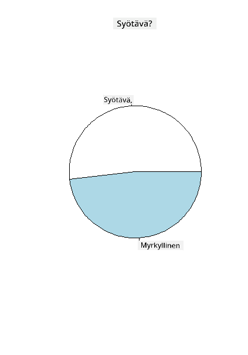
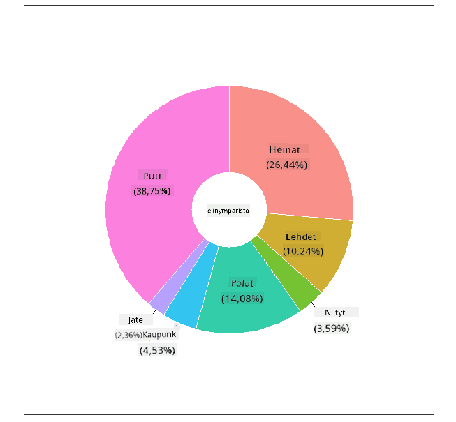
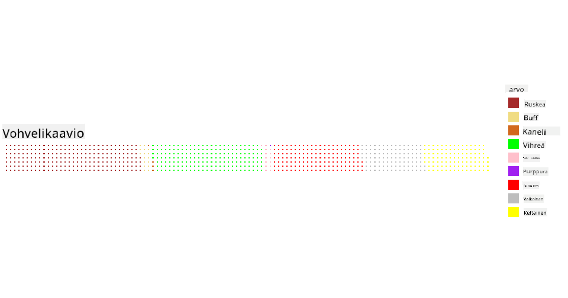

<!--
CO_OP_TRANSLATOR_METADATA:
{
  "original_hash": "47028abaaafa2bcb1079702d20569066",
  "translation_date": "2025-08-26T23:15:35+00:00",
  "source_file": "3-Data-Visualization/R/11-visualization-proportions/README.md",
  "language_code": "fi"
}
-->
# Visualisoi osuuksia

| ](../../../sketchnotes/11-Visualizing-Proportions.png)|
|:---:|
|Osuuksien visualisointi - _Sketchnote by [@nitya](https://twitter.com/nitya)_ |

Tässä oppitunnissa käytät luontoon keskittyvää datasettiä visualisoidaksesi osuuksia, kuten kuinka monta erilaista sienityyppiä esiintyy datasetissä, joka käsittelee sieniä. Tutustutaan näihin kiehtoviin sieniin käyttämällä Audubonin lähdedataa, joka sisältää tietoja 23 kiduksellisen sienen lajista Agaricus- ja Lepiota-heimoista. Kokeilet herkullisia visualisointeja, kuten:

- Piirakkakaavioita 🥧
- Donitsikaavioita 🍩
- Vohvelikaavioita 🧇

> 💡 Microsoft Researchin [Charticulator](https://charticulator.com) on erittäin mielenkiintoinen projekti, joka tarjoaa ilmaisen vedä ja pudota -käyttöliittymän datavisualisointeihin. Yhdessä heidän tutoriaaleistaan käytetään myös tätä sienidatasettiä! Voit siis tutkia dataa ja oppia kirjaston käytön samanaikaisesti: [Charticulator-tutoriaali](https://charticulator.com/tutorials/tutorial4.html).

## [Esiluennon kysely](https://purple-hill-04aebfb03.1.azurestaticapps.net/quiz/20)

## Tutustu sieniin 🍄

Sienet ovat erittäin mielenkiintoisia. Tuodaan datasetti niiden tutkimiseksi:

```r
mushrooms = read.csv('../../data/mushrooms.csv')
head(mushrooms)
```
Taulukko tulostetaan, ja siinä on loistavaa dataa analysoitavaksi:


| luokka    | lakin muoto | lakin pinta | lakin väri | mustelmat | haju    | kidusten kiinnitys | kidusten väli | kidusten koko | kidusten väri | jalan muoto | jalan juuri | jalan pinta renkaan yläpuolella | jalan pinta renkaan alapuolella | jalan väri renkaan yläpuolella | jalan väri renkaan alapuolella | verhon tyyppi | verhon väri | renkaiden määrä | renkaan tyyppi | itiöiden väri | populaatio | elinympäristö |
| --------- | ----------- | ----------- | ---------- | --------- | ------- | ------------------ | ------------- | ------------- | ------------- | ----------- | ---------- | ------------------------------ | ------------------------------ | ------------------------------ | ------------------------------ | ------------- | ---------- | --------------- | ------------- | ------------- | ---------- | ------------- |
| Myrkyllinen | Kupera    | Sileä       | Ruskea     | Mustelmat | Pistävä | Vapaa              | Tiivis        | Kapea         | Musta         | Laajeneva   | Tasainen   | Sileä                         | Sileä                         | Valkoinen                      | Valkoinen                      | Osittainen    | Valkoinen  | Yksi            | Riippuva      | Musta         | Hajallaan  | Kaupunki      |
| Syötävä    | Kupera    | Sileä       | Keltainen  | Mustelmat | Manteli | Vapaa              | Tiivis        | Leveä         | Musta         | Laajeneva   | Nuija      | Sileä                         | Sileä                         | Valkoinen                      | Valkoinen                      | Osittainen    | Valkoinen  | Yksi            | Riippuva      | Ruskea        | Lukuisia   | Ruohikko      |
| Syötävä    | Kellomainen | Sileä      | Valkoinen  | Mustelmat | Anis    | Vapaa              | Tiivis        | Leveä         | Ruskea        | Laajeneva   | Nuija      | Sileä                         | Sileä                         | Valkoinen                      | Valkoinen                      | Osittainen    | Valkoinen  | Yksi            | Riippuva      | Ruskea        | Lukuisia   | Niitty        |
| Myrkyllinen | Kupera    | Suomuinen   | Valkoinen  | Mustelmat | Pistävä | Vapaa              | Tiivis        | Kapea         | Ruskea        | Laajeneva   | Tasainen   | Sileä                         | Sileä                         | Valkoinen                      | Valkoinen                      | Osittainen    | Valkoinen  | Yksi            | Riippuva      | Musta         | Hajallaan  | Kaupunki      |
| Syötävä    | Kupera    | Sileä       | Vihreä     | Ei mustelmia | Ei hajua | Vapaa            | Ahdas         | Leveä         | Musta         | Kapeneva    | Tasainen   | Sileä                         | Sileä                         | Valkoinen                      | Valkoinen                      | Osittainen    | Valkoinen  | Yksi            | Häviävä       | Ruskea        | Runsas     | Ruohikko      |
| Syötävä    | Kupera    | Suomuinen   | Keltainen  | Mustelmat | Manteli | Vapaa              | Tiivis        | Leveä         | Ruskea        | Laajeneva   | Nuija      | Sileä                         | Sileä                         | Valkoinen                      | Valkoinen                      | Osittainen    | Valkoinen  | Yksi            | Riippuva      | Musta         | Lukuisia   | Ruohikko      |

Heti huomaat, että kaikki data on tekstimuotoista. Sinun täytyy muuntaa tämä data, jotta voit käyttää sitä kaaviossa. Suurin osa datasta on itse asiassa esitetty objektina:

```r
names(mushrooms)
```

Tulostus näyttää tältä:

```output
[1] "class"                    "cap.shape"               
 [3] "cap.surface"              "cap.color"               
 [5] "bruises"                  "odor"                    
 [7] "gill.attachment"          "gill.spacing"            
 [9] "gill.size"                "gill.color"              
[11] "stalk.shape"              "stalk.root"              
[13] "stalk.surface.above.ring" "stalk.surface.below.ring"
[15] "stalk.color.above.ring"   "stalk.color.below.ring"  
[17] "veil.type"                "veil.color"              
[19] "ring.number"              "ring.type"               
[21] "spore.print.color"        "population"              
[23] "habitat"            
```
Muunna 'luokka'-sarake kategorioiksi:

```r
library(dplyr)
grouped=mushrooms %>%
  group_by(class) %>%
  summarise(count=n())
```

Kun tulostat sienidatan, näet, että se on ryhmitelty kategorioihin myrkyllisten/syötävien luokkien mukaan:
```r
View(grouped)
```

| luokka | määrä |
| --------- | --------- |
| Syötävä | 4208 |
| Myrkyllinen | 3916 |

Jos noudatat tämän taulukon järjestystä luodessasi luokkakategorioiden tunnisteita, voit rakentaa piirakkakaavion.

## Piirakka!

```r
pie(grouped$count,grouped$class, main="Edible?")
```
Voila, piirakkakaavio, joka näyttää tämän datan osuudet näiden kahden sieniluokan mukaan. On erittäin tärkeää saada tunnisteiden järjestys oikein, erityisesti tässä, joten varmista tunnisteiden järjestys ennen kaavion rakentamista!



## Donitsit!

Hieman visuaalisesti kiinnostavampi piirakkakaavio on donitsikaavio, joka on piirakkakaavio, jossa on reikä keskellä. Tarkastellaan dataa tällä menetelmällä.

Tutustu sienien eri elinympäristöihin:

```r
library(dplyr)
habitat=mushrooms %>%
  group_by(habitat) %>%
  summarise(count=n())
View(habitat)
```
Tulostus näyttää tältä:
| elinympäristö | määrä |
| --------- | --------- |
| Ruohikko    | 2148 |
| Lehdet | 832 |
| Niityt    | 292 |
| Polut | 1144 |
| Kaupunki    | 368 |
| Jäte | 192 |
| Puu | 3148 |

Tässä ryhmitellään data elinympäristön mukaan. Niitä on 7, joten käytä niitä tunnisteina donitsikaaviossa:

```r
library(ggplot2)
library(webr)
PieDonut(habitat, aes(habitat, count=count))
```



Tämä koodi käyttää kahta kirjastoa - ggplot2 ja webr. Käyttämällä webr-kirjaston PieDonut-funktiota voimme helposti luoda donitsikaavion!

Donitsikaavioita R:ssä voidaan tehdä myös pelkästään ggplot2-kirjastolla. Voit oppia lisää siitä [täältä](https://www.r-graph-gallery.com/128-ring-or-donut-plot.html) ja kokeilla itse.

Kun tiedät, miten ryhmitellä dataa ja esittää se piirakkana tai donitsina, voit tutkia muita kaaviotyyppejä. Kokeile vohvelikaaviota, joka on vain erilainen tapa tutkia määriä.

## Vohvelit!

'Vohveli'-tyyppinen kaavio on erilainen tapa visualisoida määriä 2D-ruudukon neliöinä. Kokeile visualisoida eri sienilakkien värien määriä tässä datasetissä. Tätä varten sinun täytyy asentaa apukirjasto nimeltä [waffle](https://cran.r-project.org/web/packages/waffle/waffle.pdf) ja käyttää sitä visualisoinnin luomiseen:

```r
install.packages("waffle", repos = "https://cinc.rud.is")
```

Valitse segmentti datastasi ryhmittelyä varten:

```r
library(dplyr)
cap_color=mushrooms %>%
  group_by(cap.color) %>%
  summarise(count=n())
View(cap_color)
```

Luo vohvelikaavio luomalla tunnisteet ja ryhmittelemällä data:

```r
library(waffle)
names(cap_color$count) = paste0(cap_color$cap.color)
waffle((cap_color$count/10), rows = 7, title = "Waffle Chart")+scale_fill_manual(values=c("brown", "#F0DC82", "#D2691E", "green", 
                                                                                     "pink", "purple", "red", "grey", 
                                                                                     "yellow","white"))
```

Vohvelikaaviota käyttämällä voit selkeästi nähdä sienilakkien värien osuudet tässä datasetissä. Mielenkiintoista on, että on paljon vihreälakkisia sieniä!



Tässä oppitunnissa opit kolme tapaa visualisoida osuuksia. Ensin sinun täytyy ryhmitellä data kategorioihin ja sitten päättää, mikä on paras tapa esittää data - piirakka, donitsi tai vohveli. Kaikki ovat herkullisia ja tarjoavat käyttäjälle välittömän katsauksen datasettiin.

## 🚀 Haaste

Kokeile luoda nämä herkulliset kaaviot uudelleen [Charticulatorissa](https://charticulator.com).
## [Jälkiluennon kysely](https://purple-hill-04aebfb03.1.azurestaticapps.net/quiz/21)

## Kertaus & Itseopiskelu

Joskus ei ole selvää, milloin käyttää piirakka-, donitsi- tai vohvelikaaviota. Tässä muutamia artikkeleita aiheesta:

https://www.beautiful.ai/blog/battle-of-the-charts-pie-chart-vs-donut-chart

https://medium.com/@hypsypops/pie-chart-vs-donut-chart-showdown-in-the-ring-5d24fd86a9ce

https://www.mit.edu/~mbarker/formula1/f1help/11-ch-c6.htm

https://medium.datadriveninvestor.com/data-visualization-done-the-right-way-with-tableau-waffle-chart-fdf2a19be402

Tee tutkimusta löytääksesi lisää tietoa tästä hankalasta päätöksestä.

## Tehtävä

[Kokeile Excelissä](assignment.md)

---

**Vastuuvapauslauseke**:  
Tämä asiakirja on käännetty käyttämällä tekoälypohjaista käännöspalvelua [Co-op Translator](https://github.com/Azure/co-op-translator). Vaikka pyrimme tarkkuuteen, huomioithan, että automaattiset käännökset voivat sisältää virheitä tai epätarkkuuksia. Alkuperäinen asiakirja sen alkuperäisellä kielellä tulisi pitää ensisijaisena lähteenä. Kriittisen tiedon osalta suositellaan ammattimaista ihmiskäännöstä. Emme ole vastuussa väärinkäsityksistä tai virhetulkinnoista, jotka johtuvat tämän käännöksen käytöstä.