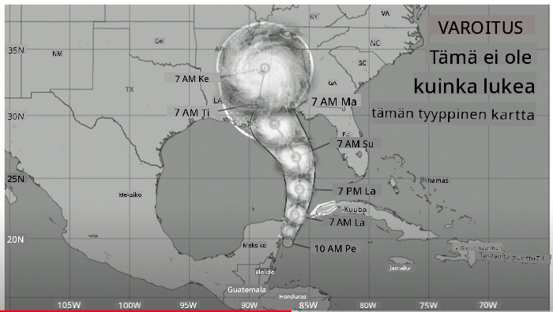
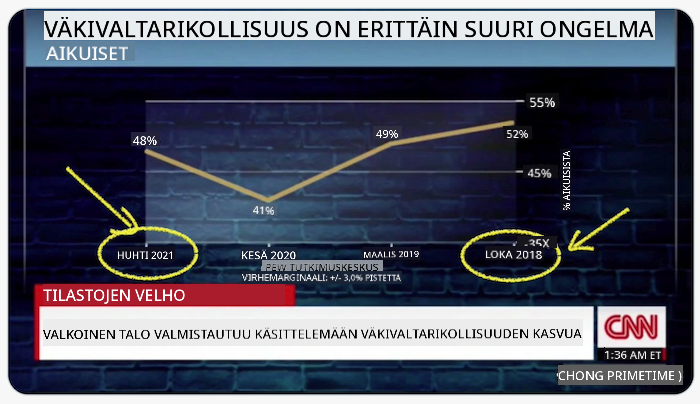
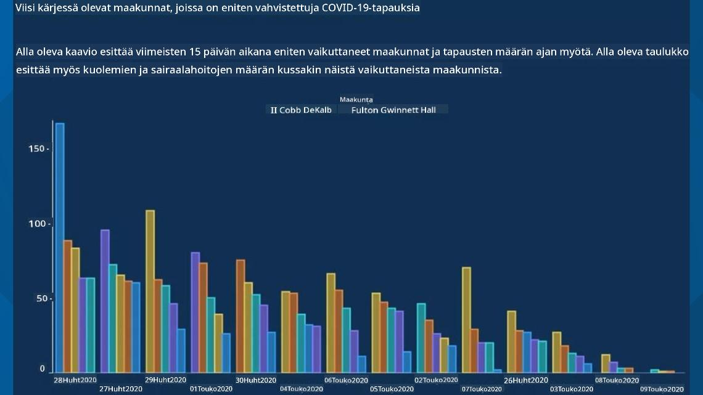
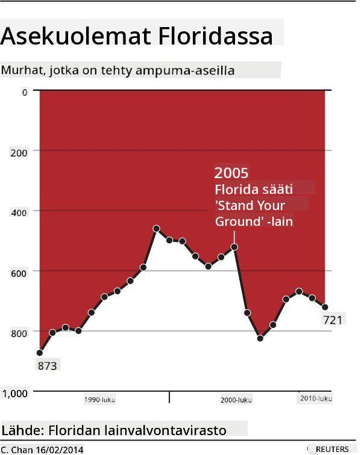
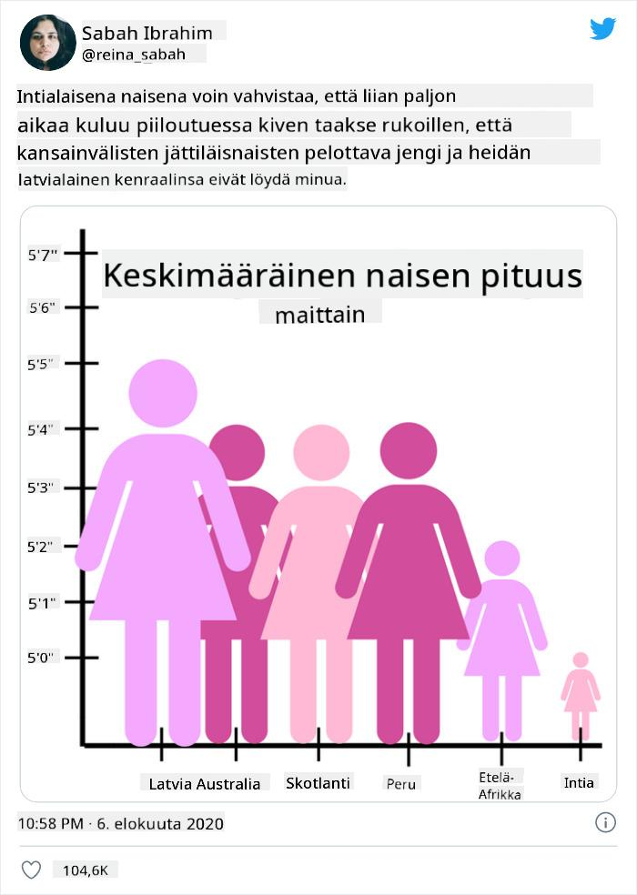
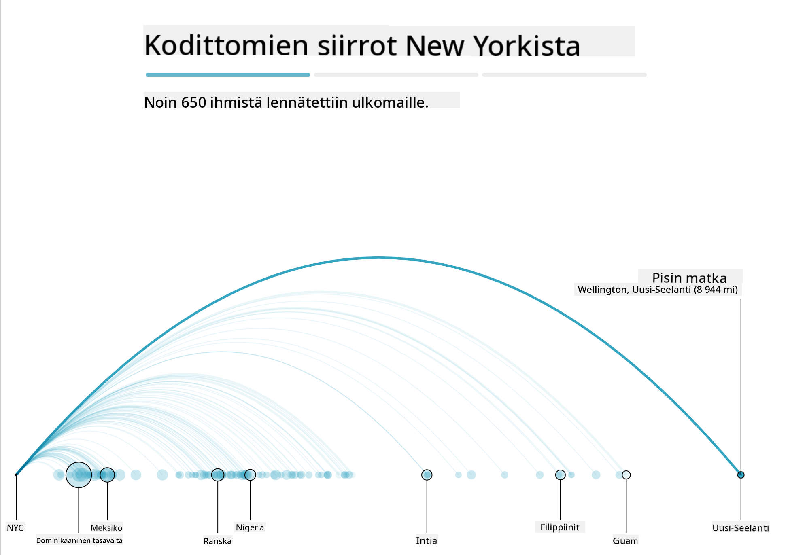
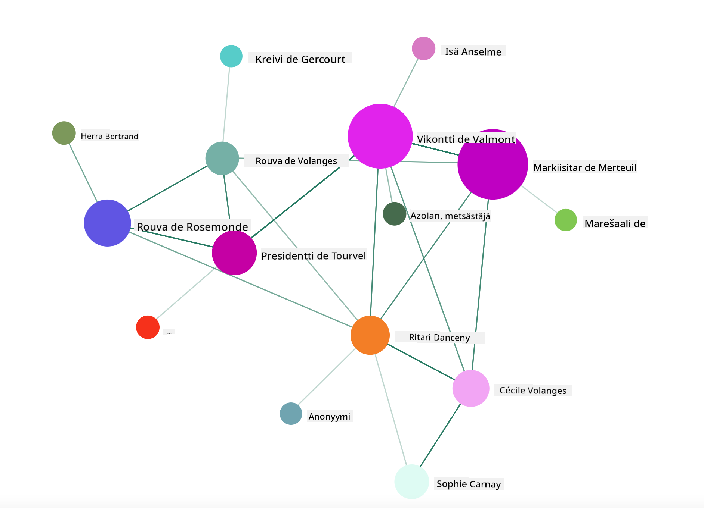

<!--
CO_OP_TRANSLATOR_METADATA:
{
  "original_hash": "b4039f1c76548d144a0aee0bf28304ec",
  "translation_date": "2025-08-26T23:12:41+00:00",
  "source_file": "3-Data-Visualization/R/13-meaningful-vizualizations/README.md",
  "language_code": "fi"
}
-->
# Merkityksellisten visualisointien luominen

| ](../../../sketchnotes/13-MeaningfulViz.png)|
|:---:|
| Merkitykselliset visualisoinnit - _Sketchnote by [@nitya](https://twitter.com/nitya)_ |

> "Jos kidutat dataa tarpeeksi kauan, se tunnustaa mitä tahansa" -- [Ronald Coase](https://en.wikiquote.org/wiki/Ronald_Coase)

Yksi datatieteilijän perustaidoista on kyky luoda merkityksellinen datavisualisointi, joka auttaa vastaamaan kysymyksiin. Ennen datan visualisointia on varmistettava, että data on puhdistettu ja valmisteltu, kuten teit aiemmissa oppitunneissa. Tämän jälkeen voit alkaa päättää, miten data esitetään parhaiten.

Tässä oppitunnissa käsitellään:

1. Kuinka valita oikea kaaviotyyppi
2. Kuinka välttää harhaanjohtavia kaavioita
3. Kuinka käyttää värejä oikein
4. Kuinka muotoilla kaaviot luettavuuden parantamiseksi
5. Kuinka rakentaa animoituja tai 3D-kaavioita
6. Kuinka luoda luovia visualisointeja

## [Esiluentakysely](https://purple-hill-04aebfb03.1.azurestaticapps.net/quiz/24)

## Valitse oikea kaaviotyyppi

Aiemmissa oppitunneissa kokeilit erilaisten datavisualisointien rakentamista Matplotlibin ja Seabornin avulla. Yleisesti ottaen voit valita [oikeanlaisen kaavion](https://chartio.com/learn/charts/how-to-select-a-data-vizualization/) kysymyksesi perusteella seuraavan taulukon avulla:

| Tarve:                     | Käytä:                         |
| -------------------------- | ----------------------------- |
| Näytä datan trendit ajan myötä | Viivakaavio                   |
| Vertaile kategorioita       | Pylväskaavio, piirakkakaavio   |
| Vertaile kokonaismääriä     | Piirakkakaavio, pinottu pylväskaavio |
| Näytä suhteita              | Hajontakaavio, viivakaavio, facet, kaksoisviiva |
| Näytä jakaumia              | Hajontakaavio, histogrammi, laatikkokaavio |
| Näytä osuuksia              | Piirakkakaavio, donitsikaavio, vohvelikaavio |

> ✅ Riippuen datasi rakenteesta, saatat joutua muuntamaan sen tekstistä numeeriseksi, jotta kaavio tukee sitä.

## Vältä harhaanjohtavuutta

Vaikka datatieteilijä valitsisi oikean kaavion oikealle datalle, on monia tapoja esittää dataa harhaanjohtavasti, usein datan kustannuksella. Harhaanjohtavia kaavioita ja infografiikoita on paljon!

[](https://www.youtube.com/watch?v=oX74Nge8Wkw "How charts lie")

> 🎥 Klikkaa yllä olevaa kuvaa nähdäksesi konferenssipuheen harhaanjohtavista kaavioista

Tässä kaaviossa X-akseli on käännetty, jotta totuus näyttäisi päinvastaiselta päivämäärien perusteella:



[Tämä kaavio](https://media.firstcoastnews.com/assets/WTLV/images/170ae16f-4643-438f-b689-50d66ca6a8d8/170ae16f-4643-438f-b689-50d66ca6a8d8_1140x641.jpg) on vielä harhaanjohtavampi, sillä katsojan huomio kiinnittyy oikealle, jolloin syntyy vaikutelma, että COVID-tapaukset ovat vähentyneet eri maakunnissa. Tarkemmin katsottuna päivämäärät on kuitenkin järjestetty uudelleen, jotta saadaan aikaan harhaanjohtava laskeva trendi.



Tämä tunnettu esimerkki käyttää värejä JA käännettyä Y-akselia harhauttaakseen: sen sijaan, että asekuolemat olisivat lisääntyneet aselainsäädännön muutosten jälkeen, katsoja saadaan uskomaan päinvastaista:



Tämä outo kaavio näyttää, kuinka mittasuhteita voidaan manipuloida huvittavin seurauksin:



Vertailu, joka ei ole vertailukelpoista, on toinen kyseenalainen temppu. On olemassa [mahtava verkkosivusto](https://tylervigen.com/spurious-correlations), joka esittelee "näennäisiä korrelaatioita", kuten Mainen avioeroprosentin ja margariinin kulutuksen välisiä "faktoja". Redditissä on myös ryhmä, joka kerää [huonoja datan käyttötapoja](https://www.reddit.com/r/dataisugly/top/?t=all).

On tärkeää ymmärtää, kuinka helposti silmä voi tulla harhaanjohdetuksi huonoilla kaavioilla. Vaikka datatieteilijän tarkoitus olisi hyvä, huonon kaaviotyypin, kuten liian monia kategorioita sisältävän piirakkakaavion, valinta voi olla harhaanjohtavaa.

## Värit

Yllä olevassa "Floridan aserikollisuus" -kaaviossa näit, kuinka värit voivat tuoda lisämerkityksen kaavioihin, erityisesti sellaisiin, joita ei ole suunniteltu käyttämällä esimerkiksi ggplot2- tai RColorBrewer-kirjastoja, jotka sisältävät valmiiksi testattuja värikirjastoja ja -paletteja. Jos teet kaavion käsin, tutustu hieman [väriteoriaan](https://colormatters.com/color-and-design/basic-color-theory).

> ✅ Ole tietoinen, että saavutettavuus on tärkeä osa visualisointia. Jotkut käyttäjistäsi saattavat olla värisokeita – näkyykö kaaviosi hyvin myös näkövammaisille käyttäjille?

Ole varovainen valitessasi värejä kaavioosi, sillä värit voivat välittää merkityksiä, joita et ehkä tarkoittanut. Esimerkiksi yllä olevan "pinkit naiset" -kaavion värit antavat kaaviolle selvästi "feminiinisen" merkityksen, mikä lisää sen outoutta.

Vaikka [värien merkitys](https://colormatters.com/color-symbolism/the-meanings-of-colors) voi vaihdella eri puolilla maailmaa ja muuttua sävyn mukaan, yleisesti ottaen värit merkitsevät seuraavaa:

| Väri   | Merkitys            |
| ------ | ------------------- |
| punainen | voima              |
| sininen  | luottamus, uskollisuus |
| keltainen | ilo, varovaisuus  |
| vihreä   | ekologia, onni, kateus |
| violetti | ilo                |
| oranssi  | eloisuus           |

Jos sinua pyydetään rakentamaan kaavio mukautetuilla väreillä, varmista, että kaaviosi ovat sekä saavutettavia että valitsemasi värit vastaavat haluamaasi merkitystä.

## Kaavioiden muotoilu luettavuuden parantamiseksi

Kaaviot eivät ole merkityksellisiä, jos ne eivät ole luettavia! Käytä hetki kaavion leveyden ja korkeuden muotoiluun, jotta se skaalautuu hyvin datasi kanssa. Jos yksi muuttuja (kuten kaikki 50 osavaltiota) täytyy näyttää, esitä ne pystysuunnassa Y-akselilla, jos mahdollista, jotta vältät vaakasuunnassa vieritettävän kaavion.

Merkitse akselit, lisää selite tarvittaessa ja tarjoa työkaluja datan parempaan ymmärtämiseen.

Jos datasi on tekstuaalista ja X-akselilla on paljon tekstiä, voit kallistaa tekstiä luettavuuden parantamiseksi. [plot3D](https://cran.r-project.org/web/packages/plot3D/index.html) tarjoaa 3D-plottausta, jos datasi tukee sitä. Sen avulla voidaan tuottaa hienostuneita datavisualisointeja.


## Animaatio ja 3D-kaavioiden näyttäminen

Jotkut parhaista datavisualisoinneista nykyään ovat animoituja. Shirley Wu on tehnyt upeita visualisointeja D3:lla, kuten '[film flowers](http://bl.ocks.org/sxywu/raw/d612c6c653fb8b4d7ff3d422be164a5d/)', jossa jokainen kukka on elokuvan visualisointi. Toinen esimerkki Guardianille on 'bussed out', interaktiivinen kokemus, joka yhdistää visualisointeja Greensockin ja D3:n avulla sekä artikkelin, joka kertoo, kuinka NYC käsittelee kodittomien ongelmaa lähettämällä ihmisiä pois kaupungista.



> "Bussed Out: How America Moves its Homeless" [Guardianista](https://www.theguardian.com/us-news/ng-interactive/2017/dec/20/bussed-out-america-moves-homeless-people-country-study). Visualisoinnit: Nadieh Bremer & Shirley Wu

Vaikka tämä oppitunti ei riitä opettamaan näitä tehokkaita visualisointikirjastoja syvällisesti, kokeile D3:ta Vue.js-sovelluksessa käyttämällä kirjastoa, joka näyttää visualisoinnin kirjasta "Dangerous Liaisons" animoituna sosiaalisena verkostona.

> "Les Liaisons Dangereuses" on kirjeromaanimuotoinen teos, joka koostuu kirjeistä. Choderlos de Laclos kirjoitti sen vuonna 1782, ja se kertoo kahden moraalittoman ranskalaisen aristokraatin, Vicomte de Valmontin ja Marquise de Merteuilin, juonittelusta. Molemmat kohtaavat lopulta tuhon, mutta eivät ennen kuin aiheuttavat suurta sosiaalista vahinkoa. Kirjeiden avulla voit visualisoida tarinan keskeiset hahmot visuaalisesti.

Toteutat verkkosovelluksen, joka näyttää animoidun näkymän tästä sosiaalisesta verkostosta. Se käyttää kirjastoa, joka on rakennettu [verkoston visualisointiin](https://github.com/emiliorizzo/vue-d3-network) Vue.js:n ja D3:n avulla. Kun sovellus on käynnissä, voit siirrellä solmuja näytöllä ja järjestellä dataa uudelleen.



## Projekti: Rakenna kaavio, joka näyttää verkoston D3.js:llä

> Tämän oppitunnin kansiossa on `solution`-kansio, josta löydät valmiin projektin viitteeksi.

1. Seuraa README.md-tiedoston ohjeita aloituskansion juuresta. Varmista, että sinulla on NPM ja Node.js asennettuna koneellesi ennen projektin riippuvuuksien asentamista.

2. Avaa `starter/src`-kansio. Löydät sieltä `assets`-kansion, jossa on .json-tiedosto, joka sisältää kaikki kirjeet kirjasta, numeroituina, ja niissä on 'to' ja 'from' -merkinnät.

3. Täydennä koodi `components/Nodes.vue`-tiedostossa, jotta visualisointi toimii. Etsi metodi nimeltä `createLinks()` ja lisää seuraava sisäkkäinen silmukka.

Käy läpi .json-objekti, tallenna kirjeiden 'to' ja 'from' -data ja rakenna `links`-objekti, jotta visualisointikirjasto voi käyttää sitä:

```javascript
//loop through letters
      let f = 0;
      let t = 0;
      for (var i = 0; i < letters.length; i++) {
          for (var j = 0; j < characters.length; j++) {
              
            if (characters[j] == letters[i].from) {
              f = j;
            }
            if (characters[j] == letters[i].to) {
              t = j;
            }
        }
        this.links.push({ sid: f, tid: t });
      }
  ```

Käynnistä sovelluksesi terminaalista (npm run serve) ja nauti visualisoinnista!

## 🚀 Haaste

Etsi internetistä harhaanjohtavia visualisointeja. Kuinka tekijä harhauttaa käyttäjää, ja onko se tarkoituksellista? Yritä korjata visualisoinnit ja näytä, miltä niiden pitäisi näyttää.

## [Jälkiluentakysely](https://purple-hill-04aebfb03.1.azurestaticapps.net/quiz/25)

## Kertaus ja itseopiskelu

Tässä muutamia artikkeleita harhaanjohtavista datavisualisoinneista:

https://gizmodo.com/how-to-lie-with-data-visualization-1563576606

http://ixd.prattsi.org/2017/12/visual-lies-usability-in-deceptive-data-visualizations/

Tutustu näihin mielenkiintoisiin visualisointeihin historiallisista aineistoista ja esineistä:

https://handbook.pubpub.org/

Lue tämä artikkeli siitä, kuinka animaatio voi parantaa visualisointeja:

https://medium.com/@EvanSinar/use-animation-to-supercharge-data-visualization-cd905a882ad4

## Tehtävä

[Rakenna oma mukautettu visualisointisi](assignment.md)

---

**Vastuuvapauslauseke**:  
Tämä asiakirja on käännetty käyttämällä tekoälypohjaista käännöspalvelua [Co-op Translator](https://github.com/Azure/co-op-translator). Vaikka pyrimme tarkkuuteen, huomioithan, että automaattiset käännökset voivat sisältää virheitä tai epätarkkuuksia. Alkuperäinen asiakirja sen alkuperäisellä kielellä tulisi pitää ensisijaisena lähteenä. Kriittisen tiedon osalta suositellaan ammattimaista ihmiskäännöstä. Emme ole vastuussa väärinkäsityksistä tai virhetulkinnoista, jotka johtuvat tämän käännöksen käytöstä.