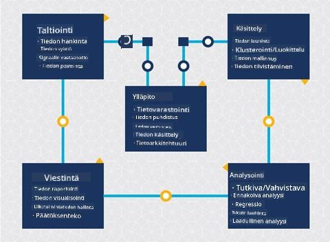
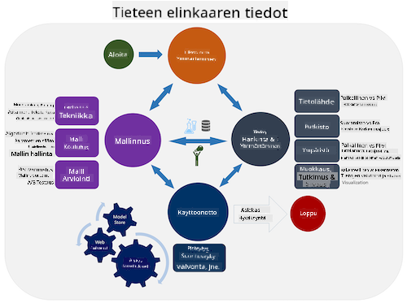
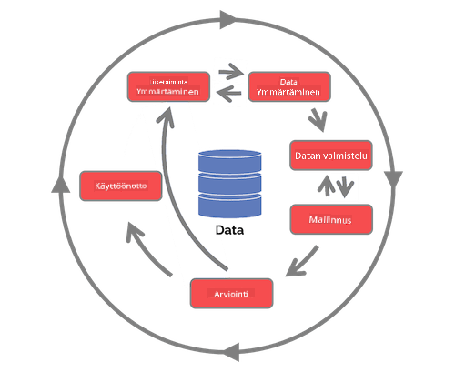

<!--
CO_OP_TRANSLATOR_METADATA:
{
  "original_hash": "07e12a25d20b8f191e3cb651c27fdb2b",
  "translation_date": "2025-09-06T21:12:50+00:00",
  "source_file": "4-Data-Science-Lifecycle/14-Introduction/README.md",
  "language_code": "fi"
}
-->
# Johdatus data-analytiikan elinkaareen

| ](../../sketchnotes/14-DataScience-Lifecycle.png)|
|:---:|
| Johdatus data-analytiikan elinkaareen - _Sketchnote by [@nitya](https://twitter.com/nitya)_ |

## [Ennakkokysely](https://ff-quizzes.netlify.app/en/ds/quiz/26)

Olet luultavasti jo huomannut, että data-analytiikka on prosessi. Tämä prosessi voidaan jakaa viiteen vaiheeseen:

- Tiedon kerääminen
- Tiedon käsittely
- Analyysi
- Viestintä
- Ylläpito

Tämä oppitunti keskittyy elinkaaren kolmeen osaan: tiedon keräämiseen, käsittelyyn ja ylläpitoon.

  
> Kuva: [Berkeley School of Information](https://ischoolonline.berkeley.edu/data-science/what-is-data-science/)

## Tiedon kerääminen

Elinkaaren ensimmäinen vaihe on erittäin tärkeä, sillä seuraavat vaiheet riippuvat siitä. Käytännössä tämä vaihe yhdistää kaksi osaa: tiedon hankkimisen sekä tarkoituksen ja ratkaistavien ongelmien määrittelyn.  
Projektin tavoitteiden määrittely vaatii syvempää ymmärrystä ongelmasta tai kysymyksestä. Ensiksi meidän täytyy tunnistaa ja hankkia ne, joiden ongelma tarvitsee ratkaisua. Nämä voivat olla yrityksen sidosryhmiä tai projektin sponsoreita, jotka voivat auttaa tunnistamaan, kuka tai mikä hyötyy projektista sekä mitä ja miksi he sitä tarvitsevat. Hyvin määritelty tavoite tulisi olla mitattavissa ja kvantifioitavissa, jotta hyväksyttävä tulos voidaan määritellä.

Kysymyksiä, joita data-analyytikko voi esittää:
- Onko tätä ongelmaa lähestytty aiemmin? Mitä havaittiin?
- Ymmärtävätkö kaikki osapuolet tarkoituksen ja tavoitteen?
- Onko epäselvyyksiä ja miten niitä voidaan vähentää?
- Mitkä ovat rajoitteet?
- Miltä lopputulos mahdollisesti näyttää?
- Kuinka paljon resursseja (aikaa, ihmisiä, laskentatehoa) on käytettävissä?

Seuraavaksi tunnistetaan, kerätään ja lopulta tutkitaan dataa, joka tarvitaan näiden tavoitteiden saavuttamiseksi. Tiedon hankinnan tässä vaiheessa data-analyytikon täytyy myös arvioida datan määrä ja laatu. Tämä vaatii jonkin verran datan tutkimista, jotta voidaan varmistaa, että hankittu data tukee halutun tuloksen saavuttamista.

Kysymyksiä, joita data-analyytikko voi esittää datasta:
- Mitä dataa minulla on jo saatavilla?
- Kuka omistaa tämän datan?
- Mitä yksityisyyteen liittyviä huolenaiheita on?
- Onko minulla tarpeeksi dataa tämän ongelman ratkaisemiseksi?
- Onko data riittävän laadukasta tähän ongelmaan?
- Jos löydän lisätietoa datan kautta, pitäisikö meidän harkita tavoitteiden muuttamista tai uudelleenmäärittelyä?

## Tiedon käsittely

Elinkaaren käsittelyvaihe keskittyy datan kuvioiden löytämiseen sekä mallintamiseen. Joitakin käsittelyvaiheessa käytettyjä tekniikoita ovat tilastolliset menetelmät, jotka paljastavat datan kuvioita. Tyypillisesti tämä olisi ihmiselle työläs tehtävä suuren datamäärän kanssa, ja siksi tietokoneet tekevät raskaan työn prosessin nopeuttamiseksi. Tämä vaihe on myös se, jossa data-analytiikka ja koneoppiminen kohtaavat. Kuten opit ensimmäisessä oppitunnissa, koneoppiminen on prosessi, jossa rakennetaan malleja datan ymmärtämiseksi. Mallit ovat datan muuttujien välisten suhteiden esityksiä, jotka auttavat ennustamaan tuloksia.

Yleisiä tekniikoita tässä vaiheessa käsitellään ML for Beginners -opetussuunnitelmassa. Seuraa linkkejä oppiaksesi lisää:

- [Luokittelu](https://github.com/microsoft/ML-For-Beginners/tree/main/4-Classification): Datan järjestäminen kategorioihin tehokkaampaa käyttöä varten.
- [Klusterointi](https://github.com/microsoft/ML-For-Beginners/tree/main/5-Clustering): Datan ryhmittely samankaltaisiin ryhmiin.
- [Regressio](https://github.com/microsoft/ML-For-Beginners/tree/main/2-Regression): Muuttujien välisten suhteiden määrittäminen arvojen ennustamiseksi tai arvioimiseksi.

## Ylläpito

Elinkaaren kaaviossa saatat huomata, että ylläpito sijoittuu tiedon keräämisen ja käsittelyn väliin. Ylläpito on jatkuva prosessi, jossa hallitaan, säilytetään ja suojataan dataa projektin aikana, ja se tulisi ottaa huomioon koko projektin ajan.

### Datan säilyttäminen

Päätökset siitä, miten ja missä dataa säilytetään, voivat vaikuttaa säilytyksen kustannuksiin sekä siihen, kuinka nopeasti dataa voidaan käyttää. Tällaisia päätöksiä ei todennäköisesti tee yksin data-analyytikko, mutta hän saattaa joutua tekemään valintoja siitä, miten dataa käsitellään sen säilytyspaikan perusteella.

Tässä joitakin nykyaikaisten datan säilytysjärjestelmien ominaisuuksia, jotka voivat vaikuttaa näihin valintoihin:

**Paikallinen vs ulkoinen vs julkinen tai yksityinen pilvi**

Paikallinen viittaa datan hallintaan omalla laitteistolla, kuten palvelimella, jossa dataa säilytetään kiintolevyillä. Ulkoinen taas tarkoittaa laitteistoa, jota et omista, kuten datakeskusta. Julkinen pilvi on suosittu vaihtoehto datan säilyttämiseen, joka ei vaadi tietoa siitä, miten tai missä dataa tarkalleen säilytetään. Julkinen viittaa yhtenäiseen infrastruktuuriin, jota kaikki pilven käyttäjät jakavat. Joillakin organisaatioilla on tiukat turvallisuuspolitiikat, jotka vaativat täydellisen pääsyn laitteistoon, jossa dataa säilytetään, ja ne käyttävät yksityistä pilveä, joka tarjoaa omat pilvipalvelut. Opit lisää datasta pilvessä [myöhemmissä oppitunneissa](https://github.com/microsoft/Data-Science-For-Beginners/tree/main/5-Data-Science-In-Cloud).

**Kylmä vs kuuma data**

Kun koulutat mallejasi, saatat tarvita enemmän koulutusdataa. Jos olet tyytyväinen mallisi toimintaan, lisää dataa saapuu mallin tarkoituksen täyttämiseksi. Joka tapauksessa datan säilytyksen ja käytön kustannukset kasvavat datan määrän kasvaessa. Harvoin käytetyn datan, eli kylmän datan, erottaminen usein käytetystä kuumasta datasta voi olla edullisempi säilytysvaihtoehto laitteiston tai ohjelmistopalveluiden kautta. Jos kylmää dataa täytyy käyttää, sen hakeminen voi kestää hieman kauemmin verrattuna kuumaan dataan.

### Datan hallinta

Työskennellessäsi datan kanssa saatat huomata, että osa datasta täytyy puhdistaa käyttämällä joitakin tekniikoita, jotka käsitellään oppitunnissa, joka keskittyy [datan valmisteluun](https://github.com/microsoft/Data-Science-For-Beginners/tree/main/2-Working-With-Data/08-data-preparation), jotta voidaan rakentaa tarkkoja malleja. Kun uutta dataa saapuu, se tarvitsee samoja sovelluksia laadun yhtenäisyyden ylläpitämiseksi. Joissakin projekteissa käytetään automatisoituja työkaluja datan puhdistamiseen, yhdistämiseen ja pakkaamiseen ennen kuin data siirretään lopulliseen sijaintiinsa. Azure Data Factory on esimerkki tällaisesta työkalusta.

### Datan suojaaminen

Yksi datan suojaamisen päämääristä on varmistaa, että datan kanssa työskentelevät hallitsevat, mitä kerätään ja missä kontekstissa sitä käytetään. Datan suojaaminen sisältää pääsyn rajoittamisen vain niille, jotka sitä tarvitsevat, paikallisten lakien ja säädösten noudattamisen sekä eettisten standardien ylläpitämisen, kuten käsitellään [etiikkaa käsittelevässä oppitunnissa](https://github.com/microsoft/Data-Science-For-Beginners/tree/main/1-Introduction/02-ethics).

Tässä joitakin asioita, joita tiimi voi tehdä turvallisuuden huomioimiseksi:
- Varmistaa, että kaikki data on salattu
- Tarjota asiakkaille tietoa siitä, miten heidän dataansa käytetään
- Poistaa datan käyttöoikeudet niiltä, jotka ovat poistuneet projektista
- Sallia vain tiettyjen projektin jäsenten muokata dataa

## 🚀 Haaste

Data-analytiikan elinkaaresta on monia versioita, joissa jokaisella vaiheella voi olla eri nimet ja eri määrä vaiheita, mutta ne sisältävät samat prosessit, jotka mainittiin tässä oppitunnissa.

Tutki [Team Data Science Process -elinkaarta](https://docs.microsoft.com/en-us/azure/architecture/data-science-process/lifecycle) ja [Cross-industry standard process for data mining](https://www.datascience-pm.com/crisp-dm-2/). Nimeä kolme yhtäläisyyttä ja eroa näiden kahden välillä.

|Team Data Science Process (TDSP)|Cross-industry standard process for data mining (CRISP-DM)|
|--|--|
| |  |
| Kuva: [Microsoft](https://docs.microsoft.comazure/architecture/data-science-process/lifecycle) | Kuva: [Data Science Process Alliance](https://www.datascience-pm.com/crisp-dm-2/) |

## [Jälkikysely](https://ff-quizzes.netlify.app/en/ds/quiz/27)

## Kertaus ja itseopiskelu

Data-analytiikan elinkaaren soveltaminen sisältää useita rooleja ja tehtäviä, joissa jotkut keskittyvät tiettyihin vaiheiden osiin. Team Data Science Process tarjoaa muutamia resursseja, jotka selittävät rooleja ja tehtäviä, joita joku voi projektissa hoitaa.

* [Team Data Science Process -roolit ja tehtävät](https://docs.microsoft.com/en-us/azure/architecture/data-science-process/roles-tasks)
* [Suorita data-analytiikan tehtäviä: tutkiminen, mallintaminen ja käyttöönotto](https://docs.microsoft.com/en-us/azure/architecture/data-science-process/execute-data-science-tasks)

## Tehtävä

[Datasetin arviointi](assignment.md)

---

**Vastuuvapauslauseke**:  
Tämä asiakirja on käännetty käyttämällä tekoälypohjaista käännöspalvelua [Co-op Translator](https://github.com/Azure/co-op-translator). Vaikka pyrimme tarkkuuteen, huomioithan, että automaattiset käännökset voivat sisältää virheitä tai epätarkkuuksia. Alkuperäistä asiakirjaa sen alkuperäisellä kielellä tulee pitää ensisijaisena lähteenä. Kriittisen tiedon osalta suositellaan ammattimaista ihmiskääntämistä. Emme ole vastuussa tämän käännöksen käytöstä aiheutuvista väärinkäsityksistä tai virhetulkinnoista.