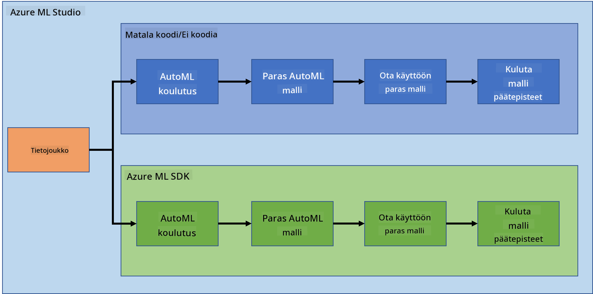
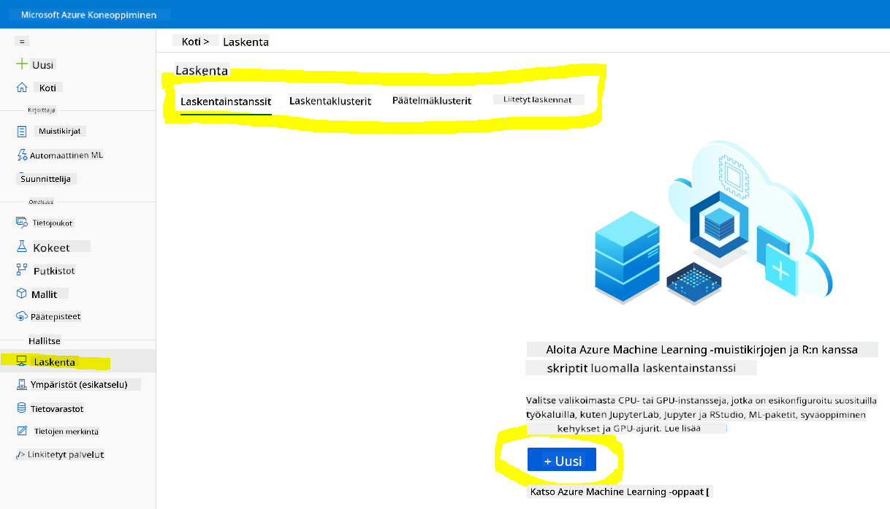
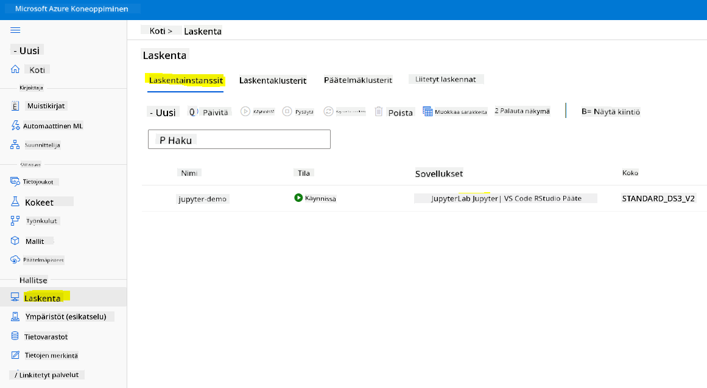
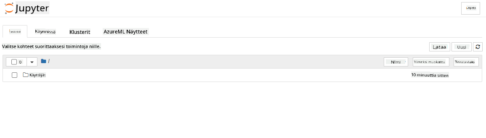

<!--
CO_OP_TRANSLATOR_METADATA:
{
  "original_hash": "73dead89dc2ddda4d6ec0232814a191e",
  "translation_date": "2025-08-26T22:16:57+00:00",
  "source_file": "5-Data-Science-In-Cloud/19-Azure/README.md",
  "language_code": "fi"
}
-->
# Data Science pilvessä: "Azure ML SDK" -tapa

| ](../../sketchnotes/19-DataScience-Cloud.png)|
|:---:|
| Data Science pilvessä: Azure ML SDK - _Sketchnote by [@nitya](https://twitter.com/nitya)_ |

Sisällysluettelo:

- [Data Science pilvessä: "Azure ML SDK" -tapa](../../../../5-Data-Science-In-Cloud/19-Azure)
  - [Ennakkokysely](../../../../5-Data-Science-In-Cloud/19-Azure)
  - [1. Johdanto](../../../../5-Data-Science-In-Cloud/19-Azure)
    - [1.1 Mikä on Azure ML SDK?](../../../../5-Data-Science-In-Cloud/19-Azure)
    - [1.2 Sydämen vajaatoiminnan ennustamisprojekti ja datasetin esittely](../../../../5-Data-Science-In-Cloud/19-Azure)
  - [2. Mallin kouluttaminen Azure ML SDK:lla](../../../../5-Data-Science-In-Cloud/19-Azure)
    - [2.1 Azure ML -työtilan luominen](../../../../5-Data-Science-In-Cloud/19-Azure)
    - [2.2 Laskentayksikön luominen](../../../../5-Data-Science-In-Cloud/19-Azure)
    - [2.3 Datasetin lataaminen](../../../../5-Data-Science-In-Cloud/19-Azure)
    - [2.4 Notebookien luominen](../../../../5-Data-Science-In-Cloud/19-Azure)
    - [2.5 Mallin kouluttaminen](../../../../5-Data-Science-In-Cloud/19-Azure)
      - [2.5.1 Työtilan, kokeen, laskentaklusterin ja datasetin määrittäminen](../../../../5-Data-Science-In-Cloud/19-Azure)
      - [2.5.2 AutoML-konfiguraatio ja koulutus](../../../../5-Data-Science-In-Cloud/19-Azure)
  - [3. Mallin käyttöönotto ja päätepisteen hyödyntäminen Azure ML SDK:lla](../../../../5-Data-Science-In-Cloud/19-Azure)
    - [3.1 Parhaan mallin tallentaminen](../../../../5-Data-Science-In-Cloud/19-Azure)
    - [3.2 Mallin käyttöönotto](../../../../5-Data-Science-In-Cloud/19-Azure)
    - [3.3 Päätepisteen hyödyntäminen](../../../../5-Data-Science-In-Cloud/19-Azure)
  - [🚀 Haaste](../../../../5-Data-Science-In-Cloud/19-Azure)
  - [Loppukysely](../../../../5-Data-Science-In-Cloud/19-Azure)
  - [Kertaus ja itseopiskelu](../../../../5-Data-Science-In-Cloud/19-Azure)
  - [Tehtävä](../../../../5-Data-Science-In-Cloud/19-Azure)

## [Ennakkokysely](https://purple-hill-04aebfb03.1.azurestaticapps.net/quiz/36)

## 1. Johdanto

### 1.1 Mikä on Azure ML SDK?

Data-analyytikot ja tekoälykehittäjät käyttävät Azure Machine Learning SDK:ta rakentaakseen ja suorittaakseen koneoppimisen työnkulkuja Azure Machine Learning -palvelun avulla. Palvelua voi käyttää missä tahansa Python-ympäristössä, kuten Jupyter Notebooksissa, Visual Studio Codessa tai suosikkisi Python-IDE:ssä.

SDK:n keskeiset alueet:

- Tutki, valmistele ja hallitse koneoppimiskokeiden datasetien elinkaarta.
- Hallitse pilviresursseja koneoppimiskokeiden monitorointiin, lokitukseen ja organisointiin.
- Kouluta malleja joko paikallisesti tai pilviresursseja käyttäen, mukaan lukien GPU-kiihdytetty mallikoulutus.
- Käytä automatisoitua koneoppimista, joka hyväksyy konfiguraatioparametrit ja koulutusdatan. Se käy automaattisesti läpi algoritmeja ja hyperparametrien asetuksia löytääkseen parhaan mallin ennusteiden suorittamiseen.
- Ota käyttöön verkkopalveluita, jotka muuntavat koulutetut mallisi RESTful-palveluiksi, joita voi käyttää missä tahansa sovelluksessa.

[Lisätietoja Azure Machine Learning SDK:sta](https://docs.microsoft.com/python/api/overview/azure/ml?WT.mc_id=academic-77958-bethanycheum&ocid=AID3041109)

[Edellisessä oppitunnissa](../18-Low-Code/README.md) opimme, kuinka kouluttaa, ottaa käyttöön ja hyödyntää mallia Low code/No code -menetelmällä. Käytimme sydämen vajaatoiminnan datasettiä ennustemallin luomiseen. Tässä oppitunnissa teemme täsmälleen saman, mutta käyttäen Azure Machine Learning SDK:ta.



### 1.2 Sydämen vajaatoiminnan ennustamisprojekti ja datasetin esittely

Katso [täältä](../18-Low-Code/README.md) sydämen vajaatoiminnan ennustamisprojekti ja datasetin esittely.

## 2. Mallin kouluttaminen Azure ML SDK:lla
### 2.1 Azure ML -työtilan luominen

Yksinkertaisuuden vuoksi työskentelemme jupyter-notebookissa. Tämä tarkoittaa, että sinulla on jo työtila ja laskentayksikkö. Jos sinulla on jo työtila, voit siirtyä suoraan kohtaan 2.3 Notebookien luominen.

Jos ei, seuraa ohjeita kohdassa **2.1 Azure ML -työtilan luominen** [edellisessä oppitunnissa](../18-Low-Code/README.md) luodaksesi työtilan.

### 2.2 Laskentayksikön luominen

[Azure ML -työtilassa](https://ml.azure.com/), jonka loimme aiemmin, siirry Compute-valikkoon, ja näet käytettävissä olevat laskentaresurssit.



Luodaan laskentayksikkö jupyter-notebookin käyttöä varten. 
1. Klikkaa + Uusi -painiketta. 
2. Anna laskentayksikölle nimi.
3. Valitse vaihtoehdot: CPU tai GPU, VM-koko ja ytimien määrä.
4. Klikkaa Luo-painiketta.

Onnittelut, olet juuri luonut laskentayksikön! Käytämme tätä laskentayksikköä notebookin luomiseen kohdassa [Notebookien luominen](../../../../5-Data-Science-In-Cloud/19-Azure).

### 2.3 Datasetin lataaminen
Katso [edellinen oppitunti](../18-Low-Code/README.md) kohdasta **2.3 Datasetin lataaminen**, jos et ole vielä ladannut datasettiä.

### 2.4 Notebookien luominen

> **_HUOM:_** Seuraavassa vaiheessa voit joko luoda uuden notebookin alusta alkaen tai ladata [luomamme notebookin](notebook.ipynb) Azure ML Studioosi. Lataamista varten klikkaa "Notebook"-valikkoa ja lataa notebook.

Notebookit ovat erittäin tärkeä osa data-analytiikkaprosessia. Niitä voidaan käyttää tutkimaan dataa (EDA), kutsumaan laskentaklusteria mallin kouluttamiseen tai kutsumaan inferenssiklusteria päätepisteen käyttöönottoon.

Notebookin luomiseen tarvitsemme laskentayksikön, joka palvelee jupyter-notebook-instanssia. Palaa [Azure ML -työtilaan](https://ml.azure.com/) ja klikkaa Laskentayksiköt. Laskentayksiköiden listassa pitäisi näkyä [aiemmin luomamme laskentayksikkö](../../../../5-Data-Science-In-Cloud/19-Azure). 

1. Sovellukset-osiossa klikkaa Jupyter-vaihtoehtoa. 
2. Ruksaa "Kyllä, ymmärrän" -ruutu ja klikkaa Jatka-painiketta.

3. Tämä avaa uuden selaimen välilehden jupyter-notebook-instanssillasi. Klikkaa "Uusi"-painiketta luodaksesi notebookin.



Nyt kun meillä on notebook, voimme aloittaa mallin kouluttamisen Azure ML SDK:lla.

### 2.5 Mallin kouluttaminen

Ensinnäkin, jos sinulla on epäilyksiä, viittaa [Azure ML SDK -dokumentaatioon](https://docs.microsoft.com/python/api/overview/azure/ml?WT.mc_id=academic-77958-bethanycheum&ocid=AID3041109). Se sisältää kaikki tarvittavat tiedot moduuleista, joita käsittelemme tässä oppitunnissa.

#### 2.5.1 Työtilan, kokeen, laskentaklusterin ja datasetin määrittäminen

Lataa `workspace` konfiguraatiotiedostosta seuraavalla koodilla:

```python
from azureml.core import Workspace
ws = Workspace.from_config()
```

Tämä palauttaa `Workspace`-tyyppisen objektin, joka edustaa työtilaa. Sitten sinun täytyy luoda `experiment` seuraavalla koodilla:

```python
from azureml.core import Experiment
experiment_name = 'aml-experiment'
experiment = Experiment(ws, experiment_name)
```
Työtilasta voi hakea tai luoda kokeen kokeen nimen avulla. Kokeen nimi täytyy olla 3-36 merkkiä pitkä, alkaa kirjaimella tai numerolla, ja voi sisältää vain kirjaimia, numeroita, alaviivoja ja viivoja. Jos koetta ei löydy työtilasta, uusi koe luodaan.

Nyt sinun täytyy luoda laskentaklusteri koulutusta varten seuraavalla koodilla. Huomaa, että tämä vaihe voi kestää muutaman minuutin. 

```python
from azureml.core.compute import AmlCompute

aml_name = "heart-f-cluster"
try:
    aml_compute = AmlCompute(ws, aml_name)
    print('Found existing AML compute context.')
except:
    print('Creating new AML compute context.')
    aml_config = AmlCompute.provisioning_configuration(vm_size = "Standard_D2_v2", min_nodes=1, max_nodes=3)
    aml_compute = AmlCompute.create(ws, name = aml_name, provisioning_configuration = aml_config)
    aml_compute.wait_for_completion(show_output = True)

cts = ws.compute_targets
compute_target = cts[aml_name]
```

Voit hakea datasetin työtilasta datasetin nimen avulla seuraavasti:

```python
dataset = ws.datasets['heart-failure-records']
df = dataset.to_pandas_dataframe()
df.describe()
```
#### 2.5.2 AutoML-konfiguraatio ja koulutus

AutoML-konfiguraation määrittämiseen käytetään [AutoMLConfig-luokkaa](https://docs.microsoft.com/python/api/azureml-train-automl-client/azureml.train.automl.automlconfig(class)?WT.mc_id=academic-77958-bethanycheum&ocid=AID3041109).

Kuten dokumentaatiossa kuvataan, konfiguraatiossa on paljon parametreja, joilla voit leikkiä. Tässä projektissa käytämme seuraavia parametreja:

- `experiment_timeout_minutes`: Maksimiaika (minuuteissa), jonka koe saa kestää ennen automaattista pysäytystä ja tulosten saatavuutta.
- `max_concurrent_iterations`: Maksimimäärä samanaikaisia koulutuskierroksia kokeessa.
- `primary_metric`: Ensisijainen metriikka kokeen tilan määrittämiseen.
- `compute_target`: Azure Machine Learning -laskentakohde, jossa automatisoitu koneoppimiskoe suoritetaan.
- `task`: Suoritettavan tehtävän tyyppi. Arvot voivat olla 'classification', 'regression' tai 'forecasting' riippuen ratkaistavasta koneoppimisongelmasta.
- `training_data`: Koulutusdata, jota käytetään kokeessa. Sen tulee sisältää sekä koulutusominaisuudet että label-sarake (valinnaisesti näytepainot-sarake).
- `label_column_name`: Label-sarakkeen nimi.
- `path`: Täydellinen polku Azure Machine Learning -projektikansioon.
- `enable_early_stopping`: Ota käyttöön varhainen lopetus, jos tulos ei parane lyhyellä aikavälillä.
- `featurization`: Indikaattori siitä, tehdäänkö featurointi automaattisesti vai ei, tai käytetäänkö mukautettua featurointia.
- `debug_log`: Lokitiedosto, johon kirjoitetaan debug-tietoja.

```python
from azureml.train.automl import AutoMLConfig

project_folder = './aml-project'

automl_settings = {
    "experiment_timeout_minutes": 20,
    "max_concurrent_iterations": 3,
    "primary_metric" : 'AUC_weighted'
}

automl_config = AutoMLConfig(compute_target=compute_target,
                             task = "classification",
                             training_data=dataset,
                             label_column_name="DEATH_EVENT",
                             path = project_folder,  
                             enable_early_stopping= True,
                             featurization= 'auto',
                             debug_log = "automl_errors.log",
                             **automl_settings
                            )
```
Kun konfiguraatio on asetettu, voit kouluttaa mallin seuraavalla koodilla. Tämä vaihe voi kestää jopa tunnin klusterin koosta riippuen.

```python
remote_run = experiment.submit(automl_config)
```
Voit käyttää RunDetails-widgettiä näyttämään eri kokeet.
```python
from azureml.widgets import RunDetails
RunDetails(remote_run).show()
```
## 3. Mallin käyttöönotto ja päätepisteen hyödyntäminen Azure ML SDK:lla

### 3.1 Parhaan mallin tallentaminen

`remote_run` on [AutoMLRun](https://docs.microsoft.com/python/api/azureml-train-automl-client/azureml.train.automl.run.automlrun?WT.mc_id=academic-77958-bethanycheum&ocid=AID3041109)-tyyppinen objekti. Tämä objekti sisältää `get_output()`-metodin, joka palauttaa parhaan ajon ja vastaavan sovitetun mallin.

```python
best_run, fitted_model = remote_run.get_output()
```
Voit nähdä parhaan mallin käytetyt parametrit tulostamalla fitted_modelin ja tarkastella parhaan mallin ominaisuuksia käyttämällä [get_properties()](https://docs.microsoft.com/python/api/azureml-core/azureml.core.run(class)?view=azure-ml-py#azureml_core_Run_get_properties?WT.mc_id=academic-77958-bethanycheum&ocid=AID3041109)-metodia.

```python
best_run.get_properties()
```

Rekisteröi malli [register_model](https://docs.microsoft.com/python/api/azureml-train-automl-client/azureml.train.automl.run.automlrun?view=azure-ml-py#register-model-model-name-none--description-none--tags-none--iteration-none--metric-none-?WT.mc_id=academic-77958-bethanycheum&ocid=AID3041109)-metodilla.
```python
model_name = best_run.properties['model_name']
script_file_name = 'inference/score.py'
best_run.download_file('outputs/scoring_file_v_1_0_0.py', 'inference/score.py')
description = "aml heart failure project sdk"
model = best_run.register_model(model_name = model_name,
                                model_path = './outputs/',
                                description = description,
                                tags = None)
```
### 3.2 Mallin käyttöönotto

Kun paras malli on tallennettu, voimme ottaa sen käyttöön [InferenceConfig](https://docs.microsoft.com/python/api/azureml-core/azureml.core.model.inferenceconfig?view=azure-ml-py?ocid=AID3041109)-luokan avulla. InferenceConfig edustaa konfiguraatioasetuksia mukautetulle ympäristölle, jota käytetään käyttöönotossa. [AciWebservice](https://docs.microsoft.com/python/api/azureml-core/azureml.core.webservice.aciwebservice?view=azure-ml-py)-luokka edustaa koneoppimismallia, joka on otettu käyttöön verkkopalvelupäätepisteenä Azure Container Instancesissa. Käyttöön otettu palvelu luodaan mallista, skriptistä ja siihen liittyvistä tiedostoista. Tuloksena oleva verkkopalvelu on kuormantasattu HTTP-päätepiste REST-API:lla. Voit lähettää dataa tähän API:iin ja saada mallin palauttaman ennusteen.

Malli otetaan käyttöön [deploy](https://docs.microsoft.com/python/api/azureml-core/azureml.core.model(class)?view=azure-ml-py#deploy-workspace--name--models--inference-config-none--deployment-config-none--deployment-target-none--overwrite-false--show-output-false-?WT.mc_id=academic-77958-bethanycheum&ocid=AID3041109)-metodilla.

```python
from azureml.core.model import InferenceConfig, Model
from azureml.core.webservice import AciWebservice

inference_config = InferenceConfig(entry_script=script_file_name, environment=best_run.get_environment())

aciconfig = AciWebservice.deploy_configuration(cpu_cores = 1,
                                               memory_gb = 1,
                                               tags = {'type': "automl-heart-failure-prediction"},
                                               description = 'Sample service for AutoML Heart Failure Prediction')

aci_service_name = 'automl-hf-sdk'
aci_service = Model.deploy(ws, aci_service_name, [model], inference_config, aciconfig)
aci_service.wait_for_deployment(True)
print(aci_service.state)
```
Tämä vaihe voi kestää muutaman minuutin.

### 3.3 Päätepisteen hyödyntäminen

Voit hyödyntää päätepistettä luomalla näytesyötteen:

```python
data = {
    "data":
    [
        {
            'age': "60",
            'anaemia': "false",
            'creatinine_phosphokinase': "500",
            'diabetes': "false",
            'ejection_fraction': "38",
            'high_blood_pressure': "false",
            'platelets': "260000",
            'serum_creatinine': "1.40",
            'serum_sodium': "137",
            'sex': "false",
            'smoking': "false",
            'time': "130",
        },
    ],
}

test_sample = str.encode(json.dumps(data))
```
Ja sitten voit lähettää tämän syötteen mallillesi ennustetta varten:
```python
response = aci_service.run(input_data=test_sample)
response
```  
Tämän pitäisi tuottaa `'{"result": [false]}'`. Tämä tarkoittaa, että lähettämämme potilastieto tuotti ennusteen `false`, mikä tarkoittaa, että tämän henkilön sydänkohtauksen riski on epätodennäköinen.

Onnittelut! Olet juuri käyttänyt Azure ML:ssä koulutettua ja julkaistua mallia Azure ML SDK:n avulla!

> **_NOTE:_** Kun olet valmis projektin kanssa, muista poistaa kaikki resurssit.

## 🚀 Haaste

SDK:n avulla voi tehdä paljon muutakin, mutta valitettavasti emme voi käydä kaikkea läpi tässä oppitunnissa. Hyvä uutinen on, että oppimalla selaamaan SDK-dokumentaatiota pääset pitkälle omatoimisesti. Tutustu Azure ML SDK -dokumentaatioon ja etsi `Pipeline`-luokka, jonka avulla voit luoda työnkulkuja. Pipeline on kokoelma vaiheita, jotka voidaan suorittaa yhtenäisenä prosessina.

**VIHJE:** Mene [SDK-dokumentaatioon](https://docs.microsoft.com/python/api/overview/azure/ml/?view=azure-ml-py?WT.mc_id=academic-77958-bethanycheum&ocid=AID3041109) ja kirjoita hakukenttään avainsanoja, kuten "Pipeline". Hakutuloksista pitäisi löytyä `azureml.pipeline.core.Pipeline`-luokka.

## [Oppitunnin jälkeinen kysely](https://purple-hill-04aebfb03.1.azurestaticapps.net/quiz/37)

## Kertaus ja itseopiskelu

Tässä oppitunnissa opit, kuinka kouluttaa, julkaista ja käyttää mallia sydämen vajaatoiminnan riskin ennustamiseen Azure ML SDK:n avulla pilvessä. Katso tämä [dokumentaatio](https://docs.microsoft.com/python/api/overview/azure/ml/?view=azure-ml-py?WT.mc_id=academic-77958-bethanycheum&ocid=AID3041109) saadaksesi lisätietoa Azure ML SDK:sta. Kokeile luoda oma malli Azure ML SDK:n avulla.

## Tehtävä

[Data Science -projekti Azure ML SDK:ta käyttäen](assignment.md)

---

**Vastuuvapauslauseke**:  
Tämä asiakirja on käännetty käyttämällä tekoälypohjaista käännöspalvelua [Co-op Translator](https://github.com/Azure/co-op-translator). Vaikka pyrimme tarkkuuteen, huomioithan, että automaattiset käännökset voivat sisältää virheitä tai epätarkkuuksia. Alkuperäistä asiakirjaa sen alkuperäisellä kielellä tulisi pitää ensisijaisena lähteenä. Kriittisen tiedon osalta suositellaan ammattimaista ihmiskäännöstä. Emme ole vastuussa tämän käännöksen käytöstä johtuvista väärinkäsityksistä tai virhetulkinnoista.