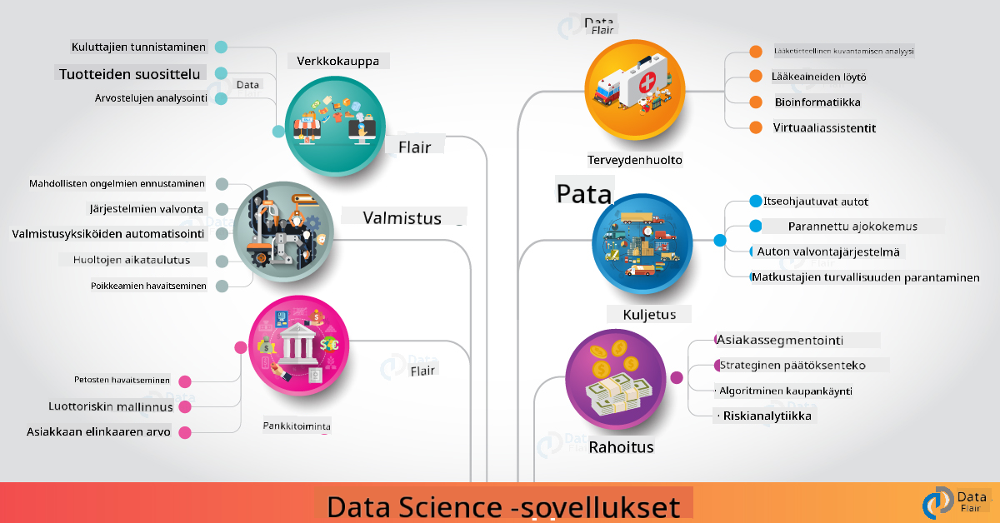

<!--
CO_OP_TRANSLATOR_METADATA:
{
  "original_hash": "f95679140c7cb39c30ccba535cd8f03f",
  "translation_date": "2025-09-04T19:46:48+00:00",
  "source_file": "6-Data-Science-In-Wild/20-Real-World-Examples/README.md",
  "language_code": "fi"
}
-->
# Data Science in the Real World

|  ](../../sketchnotes/20-DataScience-RealWorld.png) |
| :--------------------------------------------------------------------------------------------------------------: |
|               Data Science In The Real World - _Sketchnote by [@nitya](https://twitter.com/nitya)_               |

Olemme melkein tämän oppimismatkan lopussa!

Aloitimme määritelmillä data-analytiikasta ja etiikasta, tutkimme erilaisia työkaluja ja tekniikoita data-analyysiin ja visualisointiin, kävimme läpi data-analytiikan elinkaaren ja tarkastelimme, miten pilvipalvelut voivat auttaa skaalaamaan ja automatisoimaan data-analytiikan työnkulkuja. Joten saatat miettiä: _"Miten voin soveltaa näitä oppeja todellisiin tilanteisiin?"_

Tässä oppitunnissa tutkimme data-analytiikan käytännön sovelluksia eri toimialoilla ja sukellamme erityisiin esimerkkeihin tutkimuksen, digitaalisen humanismin ja kestävän kehityksen konteksteissa. Tarkastelemme opiskelijaprojektimahdollisuuksia ja päätämme hyödyllisiin resursseihin, jotka auttavat sinua jatkamaan oppimismatkaasi!

## Ennakkokysely

[Ennakkokysely](https://ff-quizzes.netlify.app/en/ds/)

## Data-analytiikka + Teollisuus

AI:n demokratisoinnin ansiosta kehittäjien on nyt helpompi suunnitella ja integroida AI-pohjaista päätöksentekoa ja dataan perustuvia oivalluksia käyttäjäkokemuksiin ja kehitystyönkulkuun. Tässä muutamia esimerkkejä siitä, miten data-analytiikkaa "sovelletaan" käytännön sovelluksiin eri toimialoilla:

 * [Google Flu Trends](https://www.wired.com/2015/10/can-learn-epic-failure-google-flu-trends/) käytti data-analytiikkaa korreloimaan hakutermit influenssatrendien kanssa. Vaikka lähestymistavassa oli puutteita, se lisäsi tietoisuutta dataan perustuvien terveydenhuollon ennusteiden mahdollisuuksista (ja haasteista).

 * [UPS Reittiennusteet](https://www.technologyreview.com/2018/11/21/139000/how-ups-uses-ai-to-outsmart-bad-weather/) - selittää, miten UPS käyttää data-analytiikkaa ja koneoppimista ennustamaan optimaalisia toimitusreittejä ottaen huomioon sääolosuhteet, liikennemallit, toimitusaikataulut ja paljon muuta.

 * [NYC Taksireittien Visualisointi](http://chriswhong.github.io/nyctaxi/) - data, joka kerättiin [tietopyyntölakien](https://chriswhong.com/open-data/foil_nyc_taxi/) avulla, auttoi visualisoimaan yhden päivän NYC:n taksien elämästä, auttaen ymmärtämään, miten ne navigoivat vilkkaassa kaupungissa, kuinka paljon rahaa ne ansaitsevat ja matkojen keston 24 tunnin aikana.

 * [Uber Data Science Workbench](https://eng.uber.com/dsw/) - käyttää dataa (nouto- ja jättöpaikat, matkan kesto, suosituimmat reitit jne.), joka kerätään miljoonista Uber-matkoista *päivittäin*, rakentaakseen data-analytiikkatyökalun hinnoittelun, turvallisuuden, petosten havaitsemisen ja navigointipäätösten tueksi.

 * [Urheiluanalytiikka](https://towardsdatascience.com/scope-of-analytics-in-sports-world-37ed09c39860) - keskittyy _ennakoivaan analytiikkaan_ (joukkue- ja pelaaja-analyysi - ajattele [Moneyball](https://datasciencedegree.wisconsin.edu/blog/moneyball-proves-importance-big-data-big-ideas/) - ja fanien hallinta) ja _datavisualisointiin_ (joukkue- ja fanidashboardit, pelit jne.) sovelluksilla, kuten kykyjenetsintä, urheilupelaaminen ja varaston/tilojen hallinta.

 * [Data-analytiikka pankkialalla](https://data-flair.training/blogs/data-science-in-banking/) - korostaa data-analytiikan arvoa rahoitusalalla sovelluksilla, jotka vaihtelevat riskimallinnuksesta ja petosten havaitsemisesta asiakassegmentointiin, reaaliaikaisiin ennusteisiin ja suosittelujärjestelmiin. Ennakoiva analytiikka ohjaa myös kriittisiä mittareita, kuten [luottoluokituksia](https://dzone.com/articles/using-big-data-and-predictive-analytics-for-credit).

 * [Data-analytiikka terveydenhuollossa](https://data-flair.training/blogs/data-science-in-healthcare/) - korostaa sovelluksia, kuten lääketieteellinen kuvantaminen (esim. MRI, röntgen, CT-skannaus), genomiikka (DNA-sekvensointi), lääkekehitys (riskinarviointi, onnistumisen ennustaminen), ennakoiva analytiikka (potilashoito ja toimituslogistiikka), tautien seuranta ja ehkäisy jne.

 Kuva: [Data Flair: 6 Amazing Data Science Applications ](https://data-flair.training/blogs/data-science-applications/)

Kuvassa näkyy muita aloja ja esimerkkejä data-analytiikan tekniikoiden soveltamisesta. Haluatko tutkia muita sovelluksia? Katso [Review & Self Study](../../../../6-Data-Science-In-Wild/20-Real-World-Examples) -osio alta.

## Data-analytiikka + Tutkimus

|  ](../../sketchnotes/20-DataScience-Research.png) |
| :---------------------------------------------------------------------------------------------------------------: |
|              Data Science & Research - _Sketchnote by [@nitya](https://twitter.com/nitya)_              |

Vaikka käytännön sovellukset keskittyvät usein teollisuuden käyttötapauksiin laajassa mittakaavassa, _tutkimus_ sovellukset ja projektit voivat olla hyödyllisiä kahdesta näkökulmasta:

* _innovaatiomahdollisuudet_ - tutkia edistyneiden konseptien nopeaa prototyyppausta ja käyttäjäkokemusten testausta seuraavan sukupolven sovelluksille.
* _käyttöönoton haasteet_ - tutkia data-analytiikkateknologioiden mahdollisia haittoja tai tahattomia seurauksia käytännön konteksteissa.

Opiskelijoille nämä tutkimusprojektit voivat tarjota sekä oppimis- että yhteistyömahdollisuuksia, jotka parantavat ymmärrystä aiheesta ja laajentavat tietoisuutta ja vuorovaikutusta asiaankuuluvien ihmisten tai tiimien kanssa, jotka työskentelevät kiinnostuksen kohteena olevilla alueilla. Miltä tutkimusprojektit näyttävät ja miten ne voivat vaikuttaa?

Tarkastellaan yhtä esimerkkiä - [MIT Gender Shades Study](http://gendershades.org/overview.html) Joy Buolamwinilta (MIT Media Labs) ja [merkittävä tutkimuspaperi](http://proceedings.mlr.press/v81/buolamwini18a/buolamwini18a.pdf), jonka hän kirjoitti yhdessä Timnit Gebrun (silloin Microsoft Research) kanssa, keskittyen:

 * **Mitä:** Tutkimusprojektin tavoitteena oli _arvioida sukupuoleen ja ihonväriin perustuvaa vinoutta automaattisissa kasvoanalyysialgoritmeissa ja -datalähteissä_.
 * **Miksi:** Kasvoanalyysiä käytetään esimerkiksi lainvalvonnassa, lentokenttien turvallisuudessa, rekrytointijärjestelmissä ja muissa konteksteissa, joissa epätarkat luokitukset (esim. vinoutumisen vuoksi) voivat aiheuttaa taloudellisia ja sosiaalisia haittoja kohteena oleville yksilöille tai ryhmille. Vinoumien ymmärtäminen (ja niiden poistaminen tai lieventäminen) on avain oikeudenmukaisuuteen käytössä.
 * **Miten:** Tutkijat huomasivat, että olemassa olevat vertailuarvot käyttivät pääasiassa vaaleaihoisia henkilöitä, ja loivat uuden datasarjan (yli 1000 kuvaa), joka oli _tasapainoisempi_ sukupuolen ja ihonvärin suhteen. Datasarjaa käytettiin kolmen sukupuoliluokittelutuotteen (Microsoft, IBM & Face++) tarkkuuden arviointiin.

Tulokset osoittivat, että vaikka kokonaisluokittelutarkkuus oli hyvä, virheprosenttien ero eri alaryhmien välillä oli huomattava - **väärin sukupuolittaminen** oli yleisempää naisilla tai tummaihoisilla henkilöillä, mikä viittasi vinoumaan.

**Keskeiset tulokset:** Lisäsi tietoisuutta siitä, että data-analytiikka tarvitsee enemmän _edustavia datasarjoja_ (tasapainoiset alaryhmät) ja enemmän _inklusiivisia tiimejä_ (monipuoliset taustat) tunnistamaan ja poistamaan tai lieventämään tällaisia vinoumia AI-ratkaisujen varhaisessa vaiheessa. Tällaiset tutkimusponnistelut ovat myös keskeisiä monille organisaatioille, jotka määrittelevät periaatteita ja käytäntöjä _vastuulliselle AI:lle_ parantaakseen oikeudenmukaisuutta AI-tuotteissaan ja -prosesseissaan.

**Haluatko oppia Microsoftin asiaankuuluvista tutkimusponnisteluista?**

* Tutustu [Microsoft Research Projects](https://www.microsoft.com/research/research-area/artificial-intelligence/?facet%5Btax%5D%5Bmsr-research-area%5D%5B%5D=13556&facet%5Btax%5D%5Bmsr-content-type%5D%5B%5D=msr-project) tekoälyn alalla.
* Tutki opiskelijaprojekteja [Microsoft Research Data Science Summer School](https://www.microsoft.com/en-us/research/academic-program/data-science-summer-school/).
* Katso [Fairlearn](https://fairlearn.org/) -projekti ja [Responsible AI](https://www.microsoft.com/en-us/ai/responsible-ai?activetab=pivot1%3aprimaryr6) -aloitteet.

## Data-analytiikka + Humanismi

|  ](../../sketchnotes/20-DataScience-Humanities.png) |
| :---------------------------------------------------------------------------------------------------------------: |
|              Data Science & Digital Humanities - _Sketchnote by [@nitya](https://twitter.com/nitya)_              |

Digitaalinen humanismi [on määritelty](https://digitalhumanities.stanford.edu/about-dh-stanford) "kokoelmaksi käytäntöjä ja lähestymistapoja, jotka yhdistävät laskennalliset menetelmät humanistiseen tutkimukseen". [Stanfordin projektit](https://digitalhumanities.stanford.edu/projects), kuten _"rebooting history"_ ja _"poetic thinking"_, havainnollistavat yhteyttä [digitaalisen humanismin ja data-analytiikan välillä](https://digitalhumanities.stanford.edu/digital-humanities-and-data-science) - korostaen tekniikoita, kuten verkkoanalyysi, informaatiovisualisointi, spatiaalinen ja tekstianalyysi, jotka voivat auttaa meitä tarkastelemaan historiallisia ja kirjallisia datasarjoja uusien oivallusten ja näkökulmien saamiseksi.

*Haluatko tutkia ja laajentaa projektia tällä alueella?*

Tutustu ["Emily Dickinson and the Meter of Mood"](https://gist.github.com/jlooper/ce4d102efd057137bc000db796bfd671) -projektiin, joka on loistava esimerkki [Jen Looperilta](https://twitter.com/jenlooper). Projekti kysyy, miten voimme käyttää data-analytiikkaa tarkastelemaan uudelleen tuttua runoutta ja arvioimaan sen merkitystä ja tekijän panosta uusissa konteksteissa. Esimerkiksi, _voimmeko ennustaa vuodenajan, jolloin runo on kirjoitettu, analysoimalla sen sävyä tai sentimenttiä_ - ja mitä tämä kertoo tekijän mielentilasta kyseisenä ajanjaksona?

Vastataksemme tähän kysymykseen seuraamme data-analytiikan elinkaaren vaiheita:
 * [`Datan hankinta`](https://gist.github.com/jlooper/ce4d102efd057137bc000db796bfd671#acquiring-the-dataset) - kerätäksemme relevantin datasarjan analysointia varten. Vaihtoehtoja ovat esimerkiksi API:n käyttö (esim. [Poetry DB API](https://poetrydb.org/index.html)) tai verkkosivujen kaavinta (esim. [Project Gutenberg](https://www.gutenberg.org/files/12242/12242-h/12242-h.htm)) työkaluilla, kuten [Scrapy](https://scrapy.org/).
 * [`Datan puhdistus`](https://gist.github.com/jlooper/ce4d102efd057137bc000db796bfd671#clean-the-data) - selittää, miten tekstiä voidaan muotoilla, puhdistaa ja yksinkertaistaa perusvälineillä, kuten Visual Studio Code ja Microsoft Excel.
 * [`Datan analyysi`](https://gist.github.com/jlooper/ce4d102efd057137bc000db796bfd671#working-with-the-data-in-a-notebook) - selittää, miten voimme tuoda datasarjan "Notebooks"-ympäristöön analysointia varten Python-pakettien (kuten pandas, numpy ja matplotlib) avulla datan järjestämiseksi ja visualisoimiseksi.
 * [`Sentimenttianalyysi`](https://gist.github.com/jlooper/ce4d102efd057137bc000db796bfd671#sentiment-analysis-using-cognitive-services) - selittää, miten voimme integroida pilvipalveluja, kuten Text Analytics, käyttämällä vähäkoodisia työkaluja, kuten [Power Automate](https://flow.microsoft.com/en-us/) automatisoitujen datankäsittelytyönkulkujen luomiseen.

Tämän työnkulun avulla voimme tutkia vuodenaikojen vaikutuksia runojen sentimenttiin ja auttaa meitä muodostamaan omia näkemyksiämme tekijästä. Kokeile itse - ja laajenna notebookia kysyäksesi muita kysymyksiä tai visualisoidaksesi dataa uusilla tavoilla!

> Voit käyttää joitakin työkaluja [Digital Humanities toolkit](https://github.com/Digital-Humanities-Toolkit) -kokoelmasta näiden tutkimuspolkujen edistämiseksi.

## Data-analytiikka + Kestävä kehitys

|  ](../../sketchnotes/20-DataScience-Sustainability.png) |
| :---------------------------------------------------------------------------------------------------------------: |
|              Data Science & Sustainability - _Sketchnote by [@nitya](https://twitter.com/nitya)_              |

[2030 Agenda For Sustainable Development](https://sdgs.un.org/2030agenda) - jonka kaikki Yhdistyneiden Kansakuntien jäsenet hyväksyivät vuonna 2015 - määrittää 17 tavoitetta, mukaan lukien tavoitteet, jotka keskittyvät **planeetan suojelemiseen** rappeutumiselta ja ilmastonmuutoksen vaikutuksilta. [Microsoft Sustainability](https://www.microsoft.com/en-us/sustainability) -aloite tukee näitä tavoitteita tutkimalla, miten teknologiaratkaisut voivat tukea ja rakentaa kestävämpiä tulevaisuuksia [keskittyen neljään tavoitteeseen](https://dev.to/azure/a-visual-guide-to-sustainable-software-engineering-53hh) - olla hiilinegatiivinen, vesipositiivinen, jätteetön ja biologisesti monimuotoinen vuoteen 2030 mennessä.

Näiden haasteiden ratkaiseminen skaalautuvasti ja ajallaan vaatii pilvipohjaista ajattelua - ja suuria datamääriä. [Planetary Computer](https://planetarycomputer.microsoft.com/) -aloite tarjoaa neljä komponenttia, jotka auttavat data-analytiikan asiantuntijoita ja kehittäjiä tässä työssä:

 * [Data Catalog](https://planetarycomputer.microsoft.com/catalog) - sisältää petatavujen verran Earth Systems -dataa (ilmainen ja Azure-isännöity).
 * [Planetary API](https://planetarycomputer.microsoft.com/docs/reference/stac/) - auttaa käyttäjiä etsimään relevanttia dataa ajan ja paikan mukaan.
 * [Hub](https://planetarycomputer.microsoft.com/docs/overview/environment/) - hallittu ympäristö tutkijoille massiivisten paikkatietoaineistojen käsittelyyn.
 * [Applications](https://planetarycomputer.microsoft.com/applications) - esittelee käyttötapauksia ja työkaluja kestävän kehityksen oivallusten tueksi.
**Planetary Computer -projekti on tällä hetkellä esikatseluvaiheessa (syyskuu 2021)** - näin voit aloittaa kestävän kehityksen ratkaisujen edistämisen datatieteen avulla.

* [Pyydä käyttöoikeutta](https://planetarycomputer.microsoft.com/account/request) aloittaaksesi tutkimisen ja verkostoitumisen muiden kanssa.
* [Tutustu dokumentaatioon](https://planetarycomputer.microsoft.com/docs/overview/about) ymmärtääksesi tuetut tietoaineistot ja API:t.
* Tutustu sovelluksiin, kuten [Ecosystem Monitoring](https://analytics-lab.org/ecosystemmonitoring/), saadaksesi inspiraatiota sovellusideoihin.

Pohdi, kuinka voit käyttää datavisualisointia tuomaan esiin tai korostamaan merkittäviä havaintoja esimerkiksi ilmastonmuutoksen ja metsäkadon kaltaisista aiheista. Tai mieti, kuinka havainnot voivat auttaa luomaan uusia käyttäjäkokemuksia, jotka motivoivat käyttäytymismuutoksia kohti kestävämpää elämäntapaa.

## Datatiede + Opiskelijat

Olemme keskustelleet tosielämän sovelluksista teollisuudessa ja tutkimuksessa sekä tutkineet datatieteen sovellusesimerkkejä digitaalisen humanismin ja kestävän kehityksen aloilla. Kuinka siis voit kehittää taitojasi ja jakaa asiantuntemustasi datatieteen aloittelijana?

Tässä muutamia esimerkkejä datatieteen opiskelijaprojekteista inspiraatioksi.

* [MSR Data Science Summer School](https://www.microsoft.com/en-us/research/academic-program/data-science-summer-school/#!projects) ja GitHub [projektit](https://github.com/msr-ds3), joissa tutkitaan aiheita kuten:
   - [Rotusyrjintä poliisin voimankäytössä](https://www.microsoft.com/en-us/research/video/data-science-summer-school-2019-replicating-an-empirical-analysis-of-racial-differences-in-police-use-of-force/) | [Github](https://github.com/msr-ds3/stop-question-frisk)
   - [NYC:n metrojärjestelmän luotettavuus](https://www.microsoft.com/en-us/research/video/data-science-summer-school-2018-exploring-the-reliability-of-the-nyc-subway-system/) | [Github](https://github.com/msr-ds3/nyctransit)
* [Materiaalisen kulttuurin digitalisointi: Sirkapin sosioekonomisten jakautumien tutkiminen](https://claremont.maps.arcgis.com/apps/Cascade/index.html?appid=bdf2aef0f45a4674ba41cd373fa23afc) - [Ornella Altunyan](https://twitter.com/ornelladotcom) ja tiimi Claremontissa, käyttäen [ArcGIS StoryMaps](https://storymaps.arcgis.com/).

## 🚀 Haaste

Etsi artikkeleita, jotka suosittelevat datatieteen projekteja aloittelijoille - kuten [nämä 50 aihealuetta](https://www.upgrad.com/blog/data-science-project-ideas-topics-beginners/) tai [nämä 21 projektia](https://www.intellspot.com/data-science-project-ideas) tai [nämä 16 projektia lähdekoodilla](https://data-flair.training/blogs/data-science-project-ideas/), joita voit purkaa ja muokata. Älä unohda blogata oppimismatkastasi ja jakaa havaintojasi kanssamme.

## Luentojälkeinen kysely

## [Luentojälkeinen kysely](https://ff-quizzes.netlify.app/en/ds/)

## Kertaus & Itseopiskelu

Haluatko tutkia lisää käyttötapauksia? Tässä muutamia aiheeseen liittyviä artikkeleita:
* [17 datatieteen sovellusta ja esimerkkiä](https://builtin.com/data-science/data-science-applications-examples) - heinäkuu 2021
* [11 hämmästyttävää datatieteen sovellusta tosielämässä](https://myblindbird.com/data-science-applications-real-world/) - toukokuu 2021
* [Datatiede tosielämässä](https://towardsdatascience.com/data-science-in-the-real-world/home) - artikkelikokoelma
* Datatiede: [Koulutus](https://data-flair.training/blogs/data-science-in-education/), [Maatalous](https://data-flair.training/blogs/data-science-in-agriculture/), [Rahoitus](https://data-flair.training/blogs/data-science-in-finance/), [Elokuvat](https://data-flair.training/blogs/data-science-at-movies/) ja paljon muuta.

## Tehtävä

[Tutki Planetary Computer -tietoaineistoa](assignment.md)

---

**Vastuuvapauslauseke**:  
Tämä asiakirja on käännetty käyttämällä tekoälypohjaista käännöspalvelua [Co-op Translator](https://github.com/Azure/co-op-translator). Vaikka pyrimme tarkkuuteen, huomioithan, että automaattiset käännökset voivat sisältää virheitä tai epätarkkuuksia. Alkuperäinen asiakirja sen alkuperäisellä kielellä tulisi pitää ensisijaisena lähteenä. Kriittisen tiedon osalta suositellaan ammattimaista ihmiskäännöstä. Emme ole vastuussa väärinkäsityksistä tai virhetulkinnoista, jotka johtuvat tämän käännöksen käytöstä.