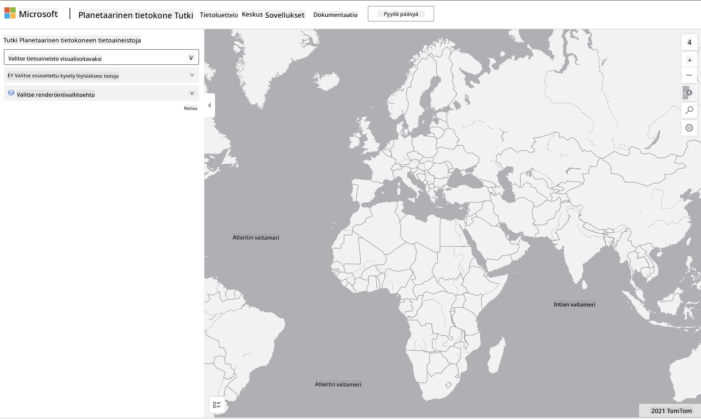

<!--
CO_OP_TRANSLATOR_METADATA:
{
  "original_hash": "d1e05715f9d97de6c4f1fb0c5a4702c0",
  "translation_date": "2025-08-26T21:56:37+00:00",
  "source_file": "6-Data-Science-In-Wild/20-Real-World-Examples/assignment.md",
  "language_code": "fi"
}
-->
# Tutustu Planetary Computer -tietoaineistoon

## Ohjeet

Tässä oppitunnissa käsittelimme erilaisia data-analytiikan sovellusalueita - syventyen esimerkkeihin, jotka liittyvät tutkimukseen, kestävyyteen ja digitaaliseen humanismiin. Tässä tehtävässä tutustut yhteen näistä esimerkeistä tarkemmin ja sovellat oppimiasi tietoja datan visualisoinnista ja analysoinnista saadaksesi oivalluksia kestävyyteen liittyvästä datasta.

[Planetary Computer](https://planetarycomputer.microsoft.com/) -projekti tarjoaa tietoaineistoja ja API-rajapintoja, joihin pääsee käsiksi käyttäjätilin avulla - pyydä tili, jos haluat kokeilla tehtävän bonusvaihetta. Sivustolla on myös [Explorer](https://planetarycomputer.microsoft.com/explore) -toiminto, jota voi käyttää ilman käyttäjätiliä.

`Vaiheet:`
Explorer-käyttöliittymä (näkyy alla olevassa kuvakaappauksessa) antaa mahdollisuuden valita tietoaineiston (tarjolla olevista vaihtoehdoista), esiasetetun kyselyn (datan suodattamiseen) ja visualisointivaihtoehdon (relevantin visualisoinnin luomiseen). Tässä tehtävässä sinun tehtäväsi on:

 1. Lue [Explorer-dokumentaatio](https://planetarycomputer.microsoft.com/docs/overview/explorer/) - ymmärrä vaihtoehdot.
 2. Tutustu tietoaineistojen [luetteloon](https://planetarycomputer.microsoft.com/catalog) - opi kunkin tarkoitus.
 3. Käytä Exploreria - valitse kiinnostava tietoaineisto, valitse relevantti kysely ja visualisointivaihtoehto.

`Tehtäväsi:`
Tutki nyt selaimessa luotua visualisointia ja vastaa seuraaviin kysymyksiin:
 * Mitä _ominaisuuksia_ tietoaineistossa on?
 * Mitä _oivalluksia_ tai tuloksia visualisointi tarjoaa?
 * Mitkä ovat näiden oivallusten _vaikutukset_ projektin kestävyyden tavoitteisiin?
 * Mitkä ovat visualisoinnin _rajoitukset_ (eli mitä oivalluksia et saanut)?
 * Jos saisit raakadataa, millaisia _vaihtoehtoisia visualisointeja_ loisit ja miksi?

`Bonus-pisteet:`
Hae käyttäjätiliä - ja kirjaudu sisään, kun hakemuksesi hyväksytään.
 * Käytä _Launch Hub_ -vaihtoehtoa avataksesi raakadata Notebookissa.
 * Tutki dataa interaktiivisesti ja toteuta vaihtoehtoiset visualisoinnit, joita ajattelit.
 * Analysoi nyt omia visualisointejasi - pystyitkö saamaan oivalluksia, jotka jäivät aiemmin puuttumaan?

## Arviointikriteerit

Erinomainen | Riittävä | Parannettavaa
--- | --- | -- |
Kaikki viisi ydinkysymystä on vastattu. Opiskelija on selkeästi tunnistanut, miten nykyiset ja vaihtoehtoiset visualisoinnit voivat tarjota oivalluksia kestävyyden tavoitteista tai tuloksista. | Opiskelija on vastannut vähintään kolmeen kysymykseen yksityiskohtaisesti, osoittaen käytännön kokemusta Explorerista. | Opiskelija ei ole vastannut useisiin kysymyksiin tai on antanut riittämättömiä vastauksia - mikä osoittaa, ettei tehtävää ole tehty merkityksellisellä tavalla. |

---

**Vastuuvapauslauseke**:  
Tämä asiakirja on käännetty käyttämällä tekoälypohjaista käännöspalvelua [Co-op Translator](https://github.com/Azure/co-op-translator). Vaikka pyrimme tarkkuuteen, huomioithan, että automaattiset käännökset voivat sisältää virheitä tai epätarkkuuksia. Alkuperäistä asiakirjaa sen alkuperäisellä kielellä tulisi pitää ensisijaisena lähteenä. Kriittisen tiedon osalta suositellaan ammattimaista ihmiskäännöstä. Emme ole vastuussa väärinkäsityksistä tai virhetulkinnoista, jotka johtuvat tämän käännöksen käytöstä.