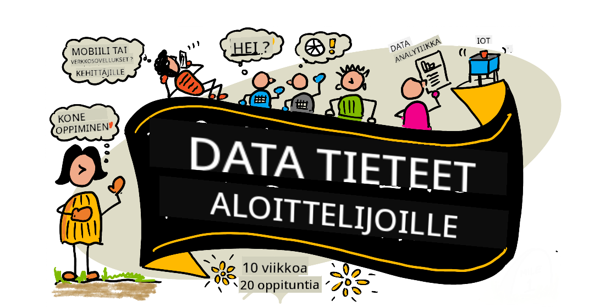

<!--
CO_OP_TRANSLATOR_METADATA:
{
  "original_hash": "26afff0d5c802e24a14f000c9c9f4614",
  "translation_date": "2025-11-18T17:38:31+00:00",
  "source_file": "README.md",
  "language_code": "fi"
}
-->
# Data Science aloittelijoille - Opetussuunnitelma

Azure Cloud Advocates Microsoftilta tarjoavat mielellään 10 viikon, 20 oppitunnin opetussuunnitelman, joka käsittelee data-analytiikkaa. Jokainen oppitunti sisältää ennakkokyselyn ja jälkikyselyn, kirjalliset ohjeet oppitunnin suorittamiseen, ratkaisun ja tehtävän. Projektipohjainen oppimismetodimme antaa mahdollisuuden oppia tekemällä, mikä on todistetusti tehokas tapa omaksua uusia taitoja.

**Sydämellinen kiitos kirjoittajillemme:** [Jasmine Greenaway](https://www.twitter.com/paladique), [Dmitry Soshnikov](http://soshnikov.com), [Nitya Narasimhan](https://twitter.com/nitya), [Jalen McGee](https://twitter.com/JalenMcG), [Jen Looper](https://twitter.com/jenlooper), [Maud Levy](https://twitter.com/maudstweets), [Tiffany Souterre](https://twitter.com/TiffanySouterre), [Christopher Harrison](https://www.twitter.com/geektrainer).

**🙏 Erityiskiitos 🙏 [Microsoft Student Ambassador](https://studentambassadors.microsoft.com/) -kirjoittajille, arvioijille ja sisällön tuottajille,** erityisesti Aaryan Arora, [Aditya Garg](https://github.com/AdityaGarg00), [Alondra Sanchez](https://www.linkedin.com/in/alondra-sanchez-molina/), [Ankita Singh](https://www.linkedin.com/in/ankitasingh007), [Anupam Mishra](https://www.linkedin.com/in/anupam--mishra/), [Arpita Das](https://www.linkedin.com/in/arpitadas01/), ChhailBihari Dubey, [Dibri Nsofor](https://www.linkedin.com/in/dibrinsofor), [Dishita Bhasin](https://www.linkedin.com/in/dishita-bhasin-7065281bb), [Majd Safi](https://www.linkedin.com/in/majd-s/), [Max Blum](https://www.linkedin.com/in/max-blum-6036a1186/), [Miguel Correa](https://www.linkedin.com/in/miguelmque/), [Mohamma Iftekher (Iftu) Ebne Jalal](https://twitter.com/iftu119), [Nawrin Tabassum](https://www.linkedin.com/in/nawrin-tabassum), [Raymond Wangsa Putra](https://www.linkedin.com/in/raymond-wp/), [Rohit Yadav](https://www.linkedin.com/in/rty2423), Samridhi Sharma, [Sanya Sinha](https://www.linkedin.com/mwlite/in/sanya-sinha-13aab1200),
[Sheena Narula](https://www.linkedin.com/in/sheena-narua-n/), [Tauqeer Ahmad](https://www.linkedin.com/in/tauqeerahmad5201/), Yogendrasingh Pawar , [Vidushi Gupta](https://www.linkedin.com/in/vidushi-gupta07/), [Jasleen Sondhi](https://www.linkedin.com/in/jasleen-sondhi/)

||
|:---:|
| Data Science aloittelijoille - _Sketchnote by [@nitya](https://twitter.com/nitya)_ |

### 🌐 Monikielinen tuki

#### Tuettu GitHub Actionin kautta (automaattinen ja aina ajan tasalla)

<!-- CO-OP TRANSLATOR LANGUAGES TABLE START -->
[Arabic](../ar/README.md) | [Bengali](../bn/README.md) | [Bulgarian](../bg/README.md) | [Burmese (Myanmar)](../my/README.md) | [Chinese (Simplified)](../zh/README.md) | [Chinese (Traditional, Hong Kong)](../hk/README.md) | [Chinese (Traditional, Macau)](../mo/README.md) | [Chinese (Traditional, Taiwan)](../tw/README.md) | [Croatian](../hr/README.md) | [Czech](../cs/README.md) | [Danish](../da/README.md) | [Dutch](../nl/README.md) | [Estonian](../et/README.md) | [Finnish](./README.md) | [French](../fr/README.md) | [German](../de/README.md) | [Greek](../el/README.md) | [Hebrew](../he/README.md) | [Hindi](../hi/README.md) | [Hungarian](../hu/README.md) | [Indonesian](../id/README.md) | [Italian](../it/README.md) | [Japanese](../ja/README.md) | [Korean](../ko/README.md) | [Lithuanian](../lt/README.md) | [Malay](../ms/README.md) | [Marathi](../mr/README.md) | [Nepali](../ne/README.md) | [Nigerian Pidgin](../pcm/README.md) | [Norwegian](../no/README.md) | [Persian (Farsi)](../fa/README.md) | [Polish](../pl/README.md) | [Portuguese (Brazil)](../br/README.md) | [Portuguese (Portugal)](../pt/README.md) | [Punjabi (Gurmukhi)](../pa/README.md) | [Romanian](../ro/README.md) | [Russian](../ru/README.md) | [Serbian (Cyrillic)](../sr/README.md) | [Slovak](../sk/README.md) | [Slovenian](../sl/README.md) | [Spanish](../es/README.md) | [Swahili](../sw/README.md) | [Swedish](../sv/README.md) | [Tagalog (Filipino)](../tl/README.md) | [Tamil](../ta/README.md) | [Thai](../th/README.md) | [Turkish](../tr/README.md) | [Ukrainian](../uk/README.md) | [Urdu](../ur/README.md) | [Vietnamese](../vi/README.md)
<!-- CO-OP TRANSLATOR LANGUAGES TABLE END -->

**Jos haluat lisätä tuettuja kieliä, lista löytyy [täältä](https://github.com/Azure/co-op-translator/blob/main/getting_started/supported-languages.md)**

#### Liity yhteisöömme 

Meillä on käynnissä Discordissa oppimissarja tekoälyn kanssa, opi lisää ja liity mukaan [Learn with AI Series](https://aka.ms/learnwithai/discord) 18.–30. syyskuuta 2025. Saat vinkkejä ja neuvoja GitHub Copilotin käytöstä data-analytiikassa.

# Oletko opiskelija?

Aloita seuraavilla resursseilla:

- [Student Hub -sivu](https://docs.microsoft.com/en-gb/learn/student-hub?WT.mc_id=academic-77958-bethanycheum) Tältä sivulta löydät aloittelijaresursseja, opiskelijapaketit ja jopa tapoja saada ilmainen sertifikaattivoucher. Tämä on sivu, jonka haluat tallentaa kirjanmerkkeihin ja tarkistaa säännöllisesti, sillä sisältöä vaihdetaan vähintään kuukausittain.
- [Microsoft Learn Student Ambassadors](https://studentambassadors.microsoft.com?WT.mc_id=academic-77958-bethanycheum) Liity maailmanlaajuiseen opiskelijalähettiläiden yhteisöön, tämä voi olla sinun tiesi Microsoftiin.

# Aloittaminen

## 📚 Dokumentaatio

- **[Asennusohje](INSTALLATION.md)** - Vaiheittaiset asennusohjeet aloittelijoille
- **[Käyttöohje](USAGE.md)** - Esimerkkejä ja yleisiä työnkulkuja
- **[Vianetsintä](TROUBLESHOOTING.md)** - Ratkaisuja yleisiin ongelmiin
- **[Ohjeet osallistumiseen](CONTRIBUTING.md)** - Kuinka osallistua tähän projektiin
- **[Opettajille](for-teachers.md)** - Opetusohjeet ja luokkahuoneresurssit

## 👨‍🎓 Opiskelijoille
> **Täysin aloittelijat**: Uusi data-analytiikassa? Aloita [aloittelijaystävällisistä esimerkeistä](examples/README.md)! Nämä yksinkertaiset, hyvin kommentoidut esimerkit auttavat sinua ymmärtämään perusteet ennen kuin sukellat koko opetussuunnitelmaan.
> **[Opiskelijat](https://aka.ms/student-page)**: jos haluat käyttää tätä opetussuunnitelmaa itsenäisesti, haaroita koko repo ja suorita harjoitukset itsenäisesti aloittaen ennakkokyselystä. Lue sitten luento ja suorita loput aktiviteetit. Yritä luoda projektit ymmärtämällä oppitunnit sen sijaan, että kopioisit ratkaisukoodin; kuitenkin kyseinen koodi löytyy /solutions-kansioista jokaisessa projektiin keskittyvässä oppitunnissa. Toinen idea voisi olla muodostaa opiskeluryhmä ystävien kanssa ja käydä sisältö läpi yhdessä. Jatko-opiskelua varten suosittelemme [Microsoft Learn](https://docs.microsoft.com/en-us/users/jenlooper-2911/collections/qprpajyoy3x0g7?WT.mc_id=academic-77958-bethanycheum).

**Pikakäynnistys:**
1. Tarkista [Asennusohje](INSTALLATION.md) ympäristön asettamiseksi
2. Tutustu [Käyttöohjeeseen](USAGE.md) oppiaksesi käyttämään opetussuunnitelmaa
3. Aloita oppitunnista 1 ja etene järjestyksessä
4. Liity [Discord-yhteisöömme](https://aka.ms/ds4beginners/discord) saadaksesi tukea

## 👩‍🏫 Opettajille

> **Opettajat**: olemme [lisänneet joitakin ehdotuksia](for-teachers.md) siitä, miten käyttää tätä opetussuunnitelmaa. Haluaisimme kuulla palautettasi [keskustelufoorumillamme](https://github.com/microsoft/Data-Science-For-Beginners/discussions)!

## Tapaa tiimi

**Gif by** [Mohit Jaisal](https://www.linkedin.com/in/mohitjaisal)

> 🎥 Klikkaa yllä olevaa kuvaa nähdäksesi videon projektista ja sen luoneista henkilöistä!

## Pedagogiikka
Olemme valinneet kaksi pedagogista periaatetta tämän opetussuunnitelman rakentamisessa: varmistamme, että se on projektipohjainen ja sisältää usein toistuvia kyselyitä. Tämän sarjan lopussa opiskelijat ovat oppineet datatieteen perusperiaatteet, mukaan lukien eettiset käsitteet, datan valmistelu, erilaiset tavat työskennellä datan kanssa, datan visualisointi, data-analyysi, datatieteen käytännön sovellukset ja paljon muuta.

Lisäksi matalan kynnyksen kysely ennen oppituntia ohjaa opiskelijan huomion oppimaan aihetta, kun taas toinen kysely oppitunnin jälkeen varmistaa tiedon säilymisen. Tämä opetussuunnitelma on suunniteltu joustavaksi ja hauskaksi, ja sen voi suorittaa kokonaan tai osittain. Projektit alkavat pienistä ja muuttuvat yhä monimutkaisemmiksi 10 viikon jakson loppuun mennessä.

> Löydä [Toimintaohjeet](CODE_OF_CONDUCT.md), [Osallistumisohjeet](CONTRIBUTING.md), [Käännösohjeet](TRANSLATIONS.md). Otamme mielellämme vastaan rakentavaa palautettasi!

## Jokainen oppitunti sisältää:

- Valinnainen luonnoskuva
- Valinnainen lisävideo
- Lämmittelykysely ennen oppituntia
- Kirjallinen oppitunti
- Projektipohjaisissa oppitunneissa vaiheittaiset ohjeet projektin rakentamiseen
- Tietotarkistukset
- Haaste
- Lisälukemista
- Tehtävä
- [Oppitunnin jälkeinen kysely](https://ff-quizzes.netlify.app/en/)

> **Huomio kyselyistä**: Kaikki kyselyt löytyvät Quiz-App-kansiosta, yhteensä 40 kyselyä, joissa on kolme kysymystä kussakin. Ne on linkitetty oppituntien sisällä, mutta kyselysovelluksen voi ajaa paikallisesti tai julkaista Azureen; seuraa ohjeita `quiz-app`-kansiossa. Kyselyitä lokalisoidaan vähitellen.

## 🎓 Esimerkkejä aloittelijoille

**Uusi datatieteessä?** Olemme luoneet erityisen [esimerkkikansion](examples/README.md), jossa on yksinkertaista ja hyvin kommentoitua koodia, joka auttaa sinua alkuun:

- 🌟 **Hello World** - Ensimmäinen datatiedeohjelmasi
- 📂 **Datan lataaminen** - Opettele lukemaan ja tutkimaan datasettiä
- 📊 **Yksinkertainen analyysi** - Laske tilastoja ja löydä kuvioita
- 📈 **Perusvisualisointi** - Luo kaavioita ja grafiikoita
- 🔬 **Käytännön projekti** - Täydellinen työnkulku alusta loppuun

Jokainen esimerkki sisältää yksityiskohtaisia kommentteja, jotka selittävät jokaisen vaiheen, joten ne sopivat täydellisesti aloittelijoille!

👉 **[Aloita esimerkeistä](examples/README.md)** 👈

## Oppitunnit

||
|:---:|
| Datatiede aloittelijoille: Reittikartta - _Luonnoskuva [@nitya](https://twitter.com/nitya)_ |

| Oppitunnin numero | Aihe | Oppituntiryhmä | Oppimistavoitteet | Linkitetty oppitunti | Tekijä |
| :-----------: | :----------------------------------------: | :--------------------------------------------------: | :-----------------------------------------------------------------------------------------------------------------------------------------------------------------------: | :---------------------------------------------------------------------: | :----: |
| 01 | Datatieteen määrittely | [Johdanto](1-Introduction/README.md) | Opettele datatieteen peruskäsitteet ja sen yhteys tekoälyyn, koneoppimiseen ja big dataan. | [oppitunti](1-Introduction/01-defining-data-science/README.md) [video](https://youtu.be/beZ7Mb_oz9I) | [Dmitry](http://soshnikov.com) |
| 02 | Datatieteen etiikka | [Johdanto](1-Introduction/README.md) | Datan eettiset käsitteet, haasteet ja viitekehykset. | [oppitunti](1-Introduction/02-ethics/README.md) | [Nitya](https://twitter.com/nitya) |
| 03 | Datan määrittely | [Johdanto](1-Introduction/README.md) | Kuinka data luokitellaan ja sen yleiset lähteet. | [oppitunti](1-Introduction/03-defining-data/README.md) | [Jasmine](https://www.twitter.com/paladique) |
| 04 | Johdatus tilastoihin ja todennäköisyyteen | [Johdanto](1-Introduction/README.md) | Matematiikan tekniikat todennäköisyyden ja tilastojen avulla datan ymmärtämiseksi. | [oppitunti](1-Introduction/04-stats-and-probability/README.md) [video](https://youtu.be/Z5Zy85g4Yjw) | [Dmitry](http://soshnikov.com) |
| 05 | Työskentely relaatiodatan kanssa | [Työskentely datan kanssa](2-Working-With-Data/README.md) | Johdatus relaatiodataan ja perusteet relaatiodatan tutkimiseen ja analysointiin Structured Query Language -kielellä, joka tunnetaan myös nimellä SQL (lausutaan "si-kuel"). | [oppitunti](2-Working-With-Data/05-relational-databases/README.md) | [Christopher](https://www.twitter.com/geektrainer) | | |
| 06 | Työskentely NoSQL-datan kanssa | [Työskentely datan kanssa](2-Working-With-Data/README.md) | Johdatus ei-relaatiodataan, sen eri tyyppeihin ja perusteet dokumenttitietokantojen tutkimiseen ja analysointiin. | [oppitunti](2-Working-With-Data/06-non-relational/README.md) | [Jasmine](https://twitter.com/paladique)|
| 07 | Työskentely Pythonin kanssa | [Työskentely datan kanssa](2-Working-With-Data/README.md) | Perusteet Pythonin käytöstä datan tutkimiseen Pandas-kirjastojen avulla. Suositellaan perustason ymmärrystä Python-ohjelmoinnista. | [oppitunti](2-Working-With-Data/07-python/README.md) [video](https://youtu.be/dZjWOGbsN4Y) | [Dmitry](http://soshnikov.com) |
| 08 | Datan valmistelu | [Työskentely datan kanssa](2-Working-With-Data/README.md) | Aiheita datan puhdistamisen ja muuntamisen tekniikoista, jotta voidaan käsitellä puuttuvan, epätarkan tai epätäydellisen datan haasteita. | [oppitunti](2-Working-With-Data/08-data-preparation/README.md) | [Jasmine](https://www.twitter.com/paladique) |
| 09 | Määrien visualisointi | [Datan visualisointi](3-Data-Visualization/README.md) | Opettele käyttämään Matplotlibia lintudatan visualisointiin 🦆 | [oppitunti](3-Data-Visualization/09-visualization-quantities/README.md) | [Jen](https://twitter.com/jenlooper) |
| 10 | Datan jakaumien visualisointi | [Datan visualisointi](3-Data-Visualization/README.md) | Havainnointien ja trendien visualisointi tietyllä aikavälillä. | [oppitunti](3-Data-Visualization/10-visualization-distributions/README.md) | [Jen](https://twitter.com/jenlooper) |
| 11 | Suhteiden visualisointi | [Datan visualisointi](3-Data-Visualization/README.md) | Yhteyksien ja korrelaatioiden visualisointi dataryhmien ja niiden muuttujien välillä. | [oppitunti](3-Data-Visualization/12-visualization-relationships/README.md) | [Jen](https://twitter.com/jenlooper) |
| 13 | Merkitykselliset visualisoinnit | [Datan visualisointi](3-Data-Visualization/README.md) | Tekniikat ja ohjeet, jotka tekevät visualisoinneistasi arvokkaita tehokkaaseen ongelmanratkaisuun ja oivalluksiin. | [oppitunti](3-Data-Visualization/13-meaningful-visualizations/README.md) | [Jen](https://twitter.com/jenlooper) |
| 14 | Johdatus datatieteen elinkaareen | [Elinkaari](4-Data-Science-Lifecycle/README.md) | Johdatus datatieteen elinkaareen ja sen ensimmäiseen vaiheeseen, datan hankintaan ja uuttamiseen. | [oppitunti](4-Data-Science-Lifecycle/14-Introduction/README.md) | [Jasmine](https://twitter.com/paladique) |
| 15 | Analysointi | [Elinkaari](4-Data-Science-Lifecycle/README.md) | Datatieteen elinkaaren vaihe, joka keskittyy datan analysointitekniikoihin. | [oppitunti](4-Data-Science-Lifecycle/15-analyzing/README.md) | [Jasmine](https://twitter.com/paladique) | | |
| 16 | Viestintä | [Elinkaari](4-Data-Science-Lifecycle/README.md) | Datatieteen elinkaaren vaihe, joka keskittyy datasta saatujen oivallusten esittämiseen päätöksentekijöille ymmärrettävällä tavalla. | [oppitunti](4-Data-Science-Lifecycle/16-communication/README.md) | [Jalen](https://twitter.com/JalenMcG) | | |
| 17 | Datatiede pilvessä | [Pilvidata](5-Data-Science-In-Cloud/README.md) | Tämä oppituntisarja esittelee datatieteen pilvessä ja sen hyödyt. | [oppitunti](5-Data-Science-In-Cloud/17-Introduction/README.md) | [Tiffany](https://twitter.com/TiffanySouterre) ja [Maud](https://twitter.com/maudstweets) |
| 18 | Datatiede pilvessä | [Pilvidata](5-Data-Science-In-Cloud/README.md) | Mallien kouluttaminen Low Code -työkaluilla. |[oppitunti](5-Data-Science-In-Cloud/18-Low-Code/README.md) | [Tiffany](https://twitter.com/TiffanySouterre) ja [Maud](https://twitter.com/maudstweets) |
| 19 | Datatiede pilvessä | [Pilvidata](5-Data-Science-In-Cloud/README.md) | Mallien julkaiseminen Azure Machine Learning Studiossa. | [oppitunti](5-Data-Science-In-Cloud/19-Azure/README.md)| [Tiffany](https://twitter.com/TiffanySouterre) ja [Maud](https://twitter.com/maudstweets) |
| 20 | Datatiede käytännössä | [Käytännössä](6-Data-Science-In-Wild/README.md) | Datatieteen ohjaamat projektit tosielämässä. | [oppitunti](6-Data-Science-In-Wild/20-Real-World-Examples/README.md) | [Nitya](https://twitter.com/nitya) |

## GitHub Codespaces

Noudata näitä ohjeita avataksesi tämän esimerkin Codespacessa:
1. Klikkaa Code-pudotusvalikkoa ja valitse Open with Codespaces -vaihtoehto.
2. Valitse + New codespace paneelin alareunasta.
Lisätietoja löydät [GitHub-dokumentaatiosta](https://docs.github.com/en/codespaces/developing-in-codespaces/creating-a-codespace-for-a-repository#creating-a-codespace).

## VSCode Remote - Containers
Noudata näitä ohjeita avataksesi tämän repositorion kontissa paikallisella koneellasi ja VSCode-ohjelmalla käyttäen VS Code Remote - Containers -laajennusta:

1. Jos käytät kehityskonttia ensimmäistä kertaa, varmista, että järjestelmäsi täyttää vaatimukset (esim. Docker asennettuna) [aloitusdokumentaatiossa](https://code.visualstudio.com/docs/devcontainers/containers#_getting-started).

Tämän repositorion käyttöön voit joko avata repositorion eristetyssä Docker-volyymissä:

**Huomio**: Tämä käyttää taustalla Remote-Containers: **Clone Repository in Container Volume...** -komentoa lähdekoodin kloonaamiseen Docker-volyymiin paikallisen tiedostojärjestelmän sijaan. [Volyymit](https://docs.docker.com/storage/volumes/) ovat suositeltu mekanismi konttidatan säilyttämiseen.

Tai avata paikallisesti kloonatun tai ladatun version repositoriosta:

- Kloonaa tämä repositorio paikalliselle tiedostojärjestelmällesi.
- Paina F1 ja valitse **Remote-Containers: Open Folder in Container...** -komento.
- Valitse kloonattu kopio tästä kansiosta, odota konttia käynnistymään ja kokeile asioita.

## Offline-käyttö

Voit käyttää tätä dokumentaatiota offline-tilassa käyttämällä [Docsifyä](https://docsify.js.org/#/). Haaroita tämä repositorio, [asenna Docsify](https://docsify.js.org/#/quickstart) paikalliselle koneellesi, ja kirjoita tämän repositorion juurikansiossa `docsify serve`. Verkkosivusto palvelee portissa 3000 localhostissa: `localhost:3000`.

> Huomio, muistikirjoja ei renderöidä Docsifyllä, joten kun tarvitset muistikirjan suorittamista, tee se erikseen VS Codessa Python-ytimen avulla.

## Muut opetussuunnitelmat

Tiimimme tuottaa muita opetussuunnitelmia! Tutustu:

<!-- CO-OP TRANSLATOR OTHER COURSES START -->
### Azure / Edge / MCP / Agents

  

---

### Generatiivisen tekoälyn sarja  
  
[-9333EA?style=for-the-badge&labelColor=E5E7EB&color=9333EA)](https://github.com/microsoft/Generative-AI-for-beginners-dotnet?WT.mc_id=academic-105485-koreyst)  
[-C084FC?style=for-the-badge&labelColor=E5E7EB&color=C084FC)](https://github.com/microsoft/generative-ai-for-beginners-java?WT.mc_id=academic-105485-koreyst)  
[-E879F9?style=for-the-badge&labelColor=E5E7EB&color=E879F9)](https://github.com/microsoft/generative-ai-with-javascript?WT.mc_id=academic-105485-koreyst)

---

### Ydinkoulutus  
  
  
  
  
  
  

---

### Copilot-sarja  
  
  
  
<!-- CO-OP TRANSLATOR OTHER COURSES END -->

## Apua saatavilla  

**Ongelmia?** Katso [Vianmääritysopas](TROUBLESHOOTING.md) yleisten ongelmien ratkaisuihin.

Jos jäät jumiin tai sinulla on kysymyksiä tekoälysovellusten rakentamisesta, liity muiden oppijoiden ja kokeneiden kehittäjien keskusteluihin MCP:stä. Se on tukevainen yhteisö, jossa kysymykset ovat tervetulleita ja tietoa jaetaan avoimesti.

Jos sinulla on palautetta tuotteesta tai kohtaat virheitä rakentamisen aikana, käy täällä:

---

<!-- CO-OP TRANSLATOR DISCLAIMER START -->
**Vastuuvapauslauseke**:  
Tämä asiakirja on käännetty käyttämällä tekoälypohjaista käännöspalvelua [Co-op Translator](https://github.com/Azure/co-op-translator). Vaikka pyrimme tarkkuuteen, huomioithan, että automaattiset käännökset voivat sisältää virheitä tai epätarkkuuksia. Alkuperäistä asiakirjaa sen alkuperäisellä kielellä tulisi pitää ensisijaisena lähteenä. Kriittisen tiedon osalta suositellaan ammattimaista ihmiskäännöstä. Emme ole vastuussa tämän käännöksen käytöstä johtuvista väärinkäsityksistä tai virhetulkinnoista.
<!-- CO-OP TRANSLATOR DISCLAIMER END -->