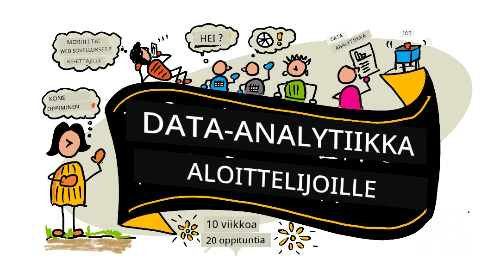
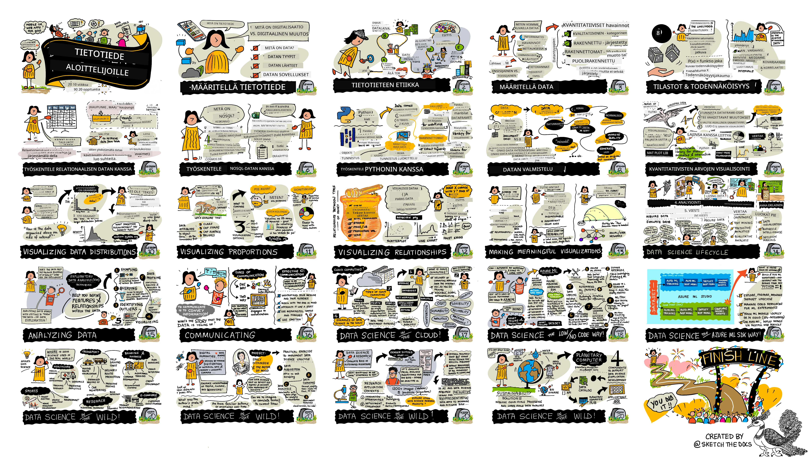

# Data Science aloittelijoille - Opetussuunnitelma

[](https://github.com/codespaces/new?hide_repo_select=true&ref=main&repo=344191198)

[](https://github.com/microsoft/Data-Science-For-Beginners/blob/master/LICENSE)
[](https://GitHub.com/microsoft/Data-Science-For-Beginners/graphs/contributors/)
[](https://GitHub.com/microsoft/Data-Science-For-Beginners/issues/)
[](https://GitHub.com/microsoft/Data-Science-For-Beginners/pulls/)
[](http://makeapullrequest.com)

[](https://GitHub.com/microsoft/Data-Science-For-Beginners/watchers/)
[](https://GitHub.com/microsoft/Data-Science-For-Beginners/network/)
[](https://GitHub.com/microsoft/Data-Science-For-Beginners/stargazers/)


[](https://discord.gg/nTYy5BXMWG)

[](https://aka.ms/foundry/forum)

Microsoftin Azure Cloud Advocates tarjoaa 10 viikon, 20 oppitunnin opetussuunnitelman, joka käsittelee data sciencea. Jokainen oppitunti sisältää esilukukyselyt ja jälkilukukyselyt, kirjalliset ohjeet tehtävän suorittamiseen, ratkaisun ja harjoituksen. Projektipohjainen pedagogiikkamme antaa sinun oppia rakentamisen kautta, mikä on todistettu tapa saada uudet taidot "takertumaan".

**Sydämellinen kiitos tekijöillemme:** [Jasmine Greenaway](https://www.twitter.com/paladique), [Dmitry Soshnikov](http://soshnikov.com), [Nitya Narasimhan](https://twitter.com/nitya), [Jalen McGee](https://twitter.com/JalenMcG), [Jen Looper](https://twitter.com/jenlooper), [Maud Levy](https://twitter.com/maudstweets), [Tiffany Souterre](https://twitter.com/TiffanySouterre), [Christopher Harrison](https://www.twitter.com/geektrainer).

**🙏 Erityiskiitos 🙏 [Microsoft Student Ambassador](https://studentambassadors.microsoft.com/) -tekijöillemme, tarkastajille ja sisällöntuottajille,** erityisesti Aaryan Arora, [Aditya Garg](https://github.com/AdityaGarg00), [Alondra Sanchez](https://www.linkedin.com/in/alondra-sanchez-molina/), [Ankita Singh](https://www.linkedin.com/in/ankitasingh007), [Anupam Mishra](https://www.linkedin.com/in/anupam--mishra/), [Arpita Das](https://www.linkedin.com/in/arpitadas01/), ChhailBihari Dubey, [Dibri Nsofor](https://www.linkedin.com/in/dibrinsofor), [Dishita Bhasin](https://www.linkedin.com/in/dishita-bhasin-7065281bb), [Majd Safi](https://www.linkedin.com/in/majd-s/), [Max Blum](https://www.linkedin.com/in/max-blum-6036a1186/), [Miguel Correa](https://www.linkedin.com/in/miguelmque/), [Mohamma Iftekher (Iftu) Ebne Jalal](https://twitter.com/iftu119), [Nawrin Tabassum](https://www.linkedin.com/in/nawrin-tabassum), [Raymond Wangsa Putra](https://www.linkedin.com/in/raymond-wp/), [Rohit Yadav](https://www.linkedin.com/in/rty2423), Samridhi Sharma, [Sanya Sinha](https://www.linkedin.com/mwlite/in/sanya-sinha-13aab1200),
[Sheena Narula](https://www.linkedin.com/in/sheena-narua-n/), [Tauqeer Ahmad](https://www.linkedin.com/in/tauqeerahmad5201/), Yogendrasingh Pawar , [Vidushi Gupta](https://www.linkedin.com/in/vidushi-gupta07/), [Jasleen Sondhi](https://www.linkedin.com/in/jasleen-sondhi/)

||
|:---:|
| Data Science Aloittelijoille - _Piirrosmuistio tekijältä [@nitya](https://twitter.com/nitya)_ |

### 🌐 Monikielinen tuki

#### Tuettu GitHub Actionin kautta (Automaattinen & aina ajan tasalla)

<!-- CO-OP TRANSLATOR LANGUAGES TABLE START -->
[Arabic](../ar/README.md) | [Bengali](../bn/README.md) | [Bulgarian](../bg/README.md) | [Burmese (Myanmar)](../my/README.md) | [Chinese (Simplified)](../zh-CN/README.md) | [Chinese (Traditional, Hong Kong)](../zh-HK/README.md) | [Chinese (Traditional, Macau)](../zh-MO/README.md) | [Chinese (Traditional, Taiwan)](../zh-TW/README.md) | [Croatian](../hr/README.md) | [Czech](../cs/README.md) | [Danish](../da/README.md) | [Dutch](../nl/README.md) | [Estonian](../et/README.md) | [Finnish](./README.md) | [French](../fr/README.md) | [German](../de/README.md) | [Greek](../el/README.md) | [Hebrew](../he/README.md) | [Hindi](../hi/README.md) | [Hungarian](../hu/README.md) | [Indonesian](../id/README.md) | [Italian](../it/README.md) | [Japanese](../ja/README.md) | [Kannada](../kn/README.md) | [Khmer](../km/README.md) | [Korean](../ko/README.md) | [Lithuanian](../lt/README.md) | [Malay](../ms/README.md) | [Malayalam](../ml/README.md) | [Marathi](../mr/README.md) | [Nepali](../ne/README.md) | [Nigerian Pidgin](../pcm/README.md) | [Norwegian](../no/README.md) | [Persian (Farsi)](../fa/README.md) | [Polish](../pl/README.md) | [Portuguese (Brazil)](../pt-BR/README.md) | [Portuguese (Portugal)](../pt-PT/README.md) | [Punjabi (Gurmukhi)](../pa/README.md) | [Romanian](../ro/README.md) | [Russian](../ru/README.md) | [Serbian (Cyrillic)](../sr/README.md) | [Slovak](../sk/README.md) | [Slovenian](../sl/README.md) | [Spanish](../es/README.md) | [Swahili](../sw/README.md) | [Swedish](../sv/README.md) | [Tagalog (Filipino)](../tl/README.md) | [Tamil](../ta/README.md) | [Telugu](../te/README.md) | [Thai](../th/README.md) | [Turkish](../tr/README.md) | [Ukrainian](../uk/README.md) | [Urdu](../ur/README.md) | [Vietnamese](../vi/README.md)

> **Haluatko kloonata paikallisesti?**
>
> Tämä repositorio sisältää yli 50 käännöstä, mikä kasvattaa latauskokoa merkittävästi. Kloonaa ilman käännöksiä käyttämällä sparse checkoutia:
>
> **Bash / macOS / Linux:**
> ```bash
> git clone --filter=blob:none --sparse https://github.com/microsoft/Data-Science-For-Beginners.git
> cd Data-Science-For-Beginners
> git sparse-checkout set --no-cone '/*' '!translations' '!translated_images'
> ```
>
> **CMD (Windows):**
> ```cmd
> git clone --filter=blob:none --sparse https://github.com/microsoft/Data-Science-For-Beginners.git
> cd Data-Science-For-Beginners
> git sparse-checkout set --no-cone "/*" "!translations" "!translated_images"
> ```
>
> Näin saat kaiken kurssin suorittamiseen tarvittavan paljon nopeammalla latauksella.
<!-- CO-OP TRANSLATOR LANGUAGES TABLE END -->

**Jos haluat tukea lisää käännöskieliä, ne löytyvät [täältä](https://github.com/Azure/co-op-translator/blob/main/getting_started/supported-languages.md)**

#### Liity yhteisöömme 
[](https://discord.gg/nTYy5BXMWG)

Meillä on käynnissä Discordissa Learn with AI -sarja, opi lisää ja liity mukaan osoitteessa [Learn with AI Series](https://aka.ms/learnwithai/discord) ajalla 18.-30. syyskuuta 2025. Saat vinkkejä ja niksejä GitHub Copilotin käytöstä data science -tehtävissä.


# Oletko opiskelija?

Aloita seuraavista resursseista:

- [Student Hub -sivu](https://docs.microsoft.com/en-gb/learn/student-hub?WT.mc_id=academic-77958-bethanycheum) Löydät täältä aloittelijan resurssit, opiskelijapaketit ja jopa tapoja saada ilmainen sertifiointivoucher. Tämä on sivu, jonka haluat laittaa kirjanmerkkeihin ja tarkistaa aika ajoin, koska sisältöä päivitetään vähintään kuukausittain.
- [Microsoft Learn Student Ambassadors](https://studentambassadors.microsoft.com?WT.mc_id=academic-77958-bethanycheum) Liity maailmanlaajuiseen opiskelija-ambasaddor -yhteisöön, tämä voi olla tapasi päästä Microsoftille.

# Aloittaminen

## 📚 Dokumentaatio

- **[Asennusopas](INSTALLATION.md)** - Aloittelijoille suunnatut askel askeleelta -asennusohjeet
- **[Käyttöopas](USAGE.md)** - Esimerkkejä ja yleisiä työnkulkuja
- **[Vianmääritys](TROUBLESHOOTING.md)** - Ratkaisuja yleisiin ongelmiin
- **[Osallistumisopas](CONTRIBUTING.md)** - Kuinka osallistua tähän projektiin
- **[Opettajille](for-teachers.md)** - Ohjeita opettamiseen ja luokkaresursseja

## 👨‍🎓 Opiskelijoille
> **Täysin aloittelijat**: Data science on uusi aihe? Aloita [aloittelijaystävällisistä esimerkeistämme](examples/README.md)! Nämä yksinkertaiset, hyvin kommentoidut esimerkit auttavat sinua ymmärtämään perusteet ennen koko opetussuunnitelmaan sukeltamista.
> **[Opiskelijat](https://aka.ms/student-page)**: käytä tätä opetussuunnitelmaa itsenäisesti kloonaamalla koko repo ja suorittamalla harjoitukset omaan tahtiin, aloittaen luennon esikyselyllä. Lue sitten luento ja tee loput tehtävistä. Yritä luoda projektit ymmärtämällä oppitunnit sen sijaan, että kopioisit ratkaisukoodin; koodi on kuitenkin saatavilla kunkin projektiin keskittyvän oppitunnin /solutions -kansiossa. Toinen idea on muodostaa opintoryhmä ystävien kanssa ja käydä sisältö läpi yhdessä. Jatko-opiskeluun suosittelemme [Microsoft Learnia](https://docs.microsoft.com/en-us/users/jenlooper-2911/collections/qprpajyoy3x0g7?WT.mc_id=academic-77958-bethanycheum).

**Pikakäynnistys:**
1. Tutustu [Asennusoppaaseen](INSTALLATION.md) ympäristön asettamiseksi
2. Käy läpi [Käyttöopas](USAGE.md) oppiaksesi, miten opetussuunnitelmaa käytetään
3. Aloita Oppitunnista 1 ja etene peräkkäin
4. Liity tukiyhteisöömme Discordissa osoitteessa [Discord community](https://aka.ms/ds4beginners/discord)

## 👩‍🏫 Opettajille
> **Opettajat**: olemme [sisällyttäneet muutamia ehdotuksia](for-teachers.md) tämän opetussuunnitelman käyttämiseen. Arvostamme palautettanne [keskustelufoorumillamme](https://github.com/microsoft/Data-Science-For-Beginners/discussions)!

## Tutustu tiimiin

[](https://youtu.be/8mzavjQSMM4 "Mainosvideo")

**Gifin tekijä:** [Mohit Jaisal](https://www.linkedin.com/in/mohitjaisal)

> 🎥 Napsauta yllä olevaa kuvaa nähdäksesi videon projektista ja sen luojista!

## Pedagogiikka

Olemme valinneet kaksi pedagogista periaatetta tämän opetussuunnitelman rakentamisessa: varmistaa, että se on projekti-pohjainen ja että se sisältää säännöllisiä tietokilpailuja. Sarjan lopussa opiskelijat ovat oppineet datatieteen perusperiaatteet, mukaan lukien eettiset käsitteet, datan valmistelun, erilaiset tavat työskennellä datan kanssa, datan visualisoinnin, data-analyysin, datatieteen todelliset käyttötapaukset ja muuta.

Lisäksi matalan panoksen tietokilpailu ennen opetusta asettaa opiskelijalle oppimisen tavoitteen, kun taas toinen tietokilpailu oppitunnin jälkeen varmistaa paremman tiedon säilymisen. Tämä opetussuunnitelma on suunniteltu joustavaksi ja hauskaksi, ja se voidaan suorittaa kokonaisuudessaan tai osittain. Projektit alkavat pieninä ja monimutkaistuvat vähitellen 10 viikon syklin aikana.

> Löydät [käyttäytymissääntömme](CODE_OF_CONDUCT.md), [osallistumisoppaat](CONTRIBUTING.md), [käännösohjeet](TRANSLATIONS.md). Otamme mielellämme vastaan rakentavaa palautetta!

## Jokainen oppitunti sisältää:

- Valinnainen muistiinpanokuvaus
- Valinnainen lisävideo
- Esivalmistelun tietokilpailu
- Kirjallinen oppitunti
- Projekti-pohjaisissa oppitunneissa vaiheittaiset ohjeet projektin rakentamiseen
- Tietojen tarkastukset
- Haaste
- Lisälukemista
- Tehtävän
- [Oppitunnin jälkeinen tietokilpailu](https://ff-quizzes.netlify.app/en/)

> **Tietokilpailuihin liittyvä huomio**: Kaikki tietokilpailut löytyvät Quiz-App-kansiosta, yhteensä 40 tietokilpailua, joissa jokaisessa on kolme kysymystä. Niihin on linkkejä oppitunneista, mutta tietokilpailusovellusta voi käyttää myös paikallisesti tai ottaa käyttöön Azureen; seuraa ohjeita `quiz-app`-kansiossa. Ne lokalisoidaan vähitellen.

## 🎓 Aloittelijaystävälliset esimerkit

**Uusi datatieteessä?** Olemme luoneet erityisen [esimerkkihakemiston](examples/README.md), jossa on yksinkertaista ja hyvin kommentoitua koodia auttamaan sinua alkuun:

- 🌟 **Hei maailma** - Ensimmäinen datatieteen ohjelmasi
- 📂 **Datan lataus** - Opettele lukemaan ja tutkimaan aineistoja
- 📊 **Yksinkertainen analyysi** - Laske tilastoja ja löydä kuvioita
- 📈 **Perusvisualisointi** - Luo kaavioita ja graafeja
- 🔬 **Todellinen projekti** - Täydellinen työnkulku alusta loppuun

Jokainen esimerkki sisältää yksityiskohtaiset kommentit, jotka selittävät jokaisen vaiheen, tehden niistä täydellisiä aivan aloittelijoille!

👉 **[Aloita esimerkeistä](examples/README.md)** 👈

## Oppitunnit


||
|:---:|
| Data Science For Beginners: Roadmap - _Muistiinpanokuvaus tekijä [@nitya](https://twitter.com/nitya)_ |


| Oppitunnin numero | Aihe | Oppituntiryhmä | Oppimistavoitteet | Linkitetty oppitunti | Tekijä |
| :-----------: | :----------------------------------------: | :--------------------------------------------------: | :-----------------------------------------------------------------------------------------------------------------------------------------------------------------------: | :---------------------------------------------------------------------: | :----: |
| 01 | Datatieteen määrittely | [Johdanto](1-Introduction/README.md) | Opettele datatieteen peruskäsitteet ja sen yhteys tekoälyyn, koneoppimiseen ja big dataan. | [oppitunti](1-Introduction/01-defining-data-science/README.md) [video](https://youtu.be/beZ7Mb_oz9I) | [Dmitry](http://soshnikov.com) |
| 02 | Datatieteen etiikka | [Johdanto](1-Introduction/README.md) | Datatieteen eettiset käsitteet, haasteet ja viitekehykset. | [oppitunti](1-Introduction/02-ethics/README.md) | [Nitya](https://twitter.com/nitya) |
| 03 | Datan määrittely | [Johdanto](1-Introduction/README.md) | Kuinka data luokitellaan ja sen yleisimmät lähteet. | [oppitunti](1-Introduction/03-defining-data/README.md) | [Jasmine](https://www.twitter.com/paladique) |
| 04 | Johdatus tilastotieteeseen ja todennäköisyyslaskentaan | [Johdanto](1-Introduction/README.md) | Todennäköisyyslaskennan ja tilastotieteen matemaattiset menetelmät datan ymmärtämiseksi. | [oppitunti](1-Introduction/04-stats-and-probability/README.md) [video](https://youtu.be/Z5Zy85g4Yjw) | [Dmitry](http://soshnikov.com) |
| 05 | Relational datan käsittely | [Datatyöskentely](2-Working-With-Data/README.md) | Johdatus relaatiodataan ja sen perusteisiin relaatiodatan tutkimisessa ja analysoinnissa rakenteellisella kyselykielellä (SQL, lausutaan "see-quell"). | [oppitunti](2-Working-With-Data/05-relational-databases/README.md) | [Christopher](https://www.twitter.com/geektrainer) | | |
| 06 | Ei-relationaalisen datan käsittely | [Datatyöskentely](2-Working-With-Data/README.md) | Johdatus ei-relationaaliseen dataan, sen erilaisiin tyyppeihin ja dokumenttitietokantojen tutkimisen ja analysoinnin perusteisiin. | [oppitunti](2-Working-With-Data/06-non-relational/README.md) | [Jasmine](https://twitter.com/paladique)|
| 07 | Pythonin käyttö datan käsittelyssä | [Datatyöskentely](2-Working-With-Data/README.md) | Pythonin perusteet datan tutkimiseen, esimerkiksi Pandas-kirjastojen avulla. Perustason Python-ohjelmointitaito suositeltavaa. | [oppitunti](2-Working-With-Data/07-python/README.md) [video](https://youtu.be/dZjWOGbsN4Y) | [Dmitry](http://soshnikov.com) |
| 08 | Datan valmistelu | [Datatyöskentely](2-Working-With-Data/README.md) | Aiheita liittyen datan puhdistamiseen ja muuntamiseen puuttuvan, virheellisen tai epätäydellisen datan käsittelemiseksi. | [oppitunti](2-Working-With-Data/08-data-preparation/README.md) | [Jasmine](https://www.twitter.com/paladique) |
| 09 | Määrien visualisointi | [Datavisualisointi](3-Data-Visualization/README.md) | Opettele käyttämään Matplotlibia lintudatan visualisointiin 🦆 | [oppitunti](3-Data-Visualization/09-visualization-quantities/README.md) | [Jen](https://twitter.com/jenlooper) |
| 10 | Datan jakaumien visualisointi | [Datavisualisointi](3-Data-Visualization/README.md) | Havainnointien ja trendien visualisointi tietyssä aikavälissä. | [oppitunti](3-Data-Visualization/10-visualization-distributions/README.md) | [Jen](https://twitter.com/jenlooper) |
| 11 | Suhteellisten osuuksien visualisointi | [Datavisualisointi](3-Data-Visualization/README.md) | Diskreettien ja ryhmiteltyjen prosenttiosuuksien visualisointi. | [oppitunti](3-Data-Visualization/11-visualization-proportions/README.md) | [Jen](https://twitter.com/jenlooper) |
| 12 | Suhteiden visualisointi | [Datavisualisointi](3-Data-Visualization/README.md) | Yhteyksien ja korrelaatioiden visualisointi datan ja sen muuttujien välillä. | [oppitunti](3-Data-Visualization/12-visualization-relationships/README.md) | [Jen](https://twitter.com/jenlooper) |
| 13 | Merkitykselliset visualisoinnit | [Datavisualisointi](3-Data-Visualization/README.md) | Tekniikat ja ohjeet visualisointien arvon lisäämiseksi tehokkaaseen ongelmanratkaisuun ja oivalluksiin. | [oppitunti](3-Data-Visualization/13-meaningful-visualizations/README.md) | [Jen](https://twitter.com/jenlooper) |
| 14 | Johdatus datatieteen elinkaareen | [Elinkaari](4-Data-Science-Lifecycle/README.md) | Johdatus datatieteen elinkaareen ja sen ensimmäiseen vaiheeseen, datan hankintaan ja poimintaan. | [oppitunti](4-Data-Science-Lifecycle/14-Introduction/README.md) | [Jasmine](https://twitter.com/paladique) |
| 15 | Analysointi | [Elinkaari](4-Data-Science-Lifecycle/README.md) | Tämä vaihe datatieteen elinkaaressa keskittyy datan analysointimenetelmiin. | [oppitunti](4-Data-Science-Lifecycle/15-analyzing/README.md) | [Jasmine](https://twitter.com/paladique) | | |
| 16 | Viestintä | [Elinkaari](4-Data-Science-Lifecycle/README.md) | Tämä vaihe datatieteen elinkaaressa keskittyy datasta saatujen oivallusten esittämiseen siten, että päätöksentekijöiden on helpompi ymmärtää niitä. | [oppitunti](4-Data-Science-Lifecycle/16-communication/README.md) | [Jalen](https://twitter.com/JalenMcG) | | |
| 17 | Datatiede pilvessä | [PilviData](5-Data-Science-In-Cloud/README.md) | Sarja oppitunteja, jotka esittelevät datatiedettä pilvessä ja sen etuja. | [oppitunti](5-Data-Science-In-Cloud/17-Introduction/README.md) | [Tiffany](https://twitter.com/TiffanySouterre) ja [Maud](https://twitter.com/maudstweets) |
| 18 | Datatiede pilvessä | [PilviData](5-Data-Science-In-Cloud/README.md) | Mallien kouluttaminen matalan koodin työkaluilla. |[oppitunti](5-Data-Science-In-Cloud/18-Low-Code/README.md) | [Tiffany](https://twitter.com/TiffanySouterre) ja [Maud](https://twitter.com/maudstweets) |
| 19 | Datatiede pilvessä | [PilviData](5-Data-Science-In-Cloud/README.md) | Mallien käyttöönotto Azure Machine Learning Studion avulla. | [oppitunti](5-Data-Science-In-Cloud/19-Azure/README.md)| [Tiffany](https://twitter.com/TiffanySouterre) ja [Maud](https://twitter.com/maudstweets) |
| 20 | Datatiede käytännössä | [Käytännössä](6-Data-Science-In-Wild/README.md) | Datatieteeseen perustuvat projektit todellisessa maailmassa. | [oppitunti](6-Data-Science-In-Wild/20-Real-World-Examples/README.md) | [Nitya](https://twitter.com/nitya) |

## GitHub Codespaces

Seuraa näitä ohjeita avataksesi tämän esimerkin Codespacessa:
1. Klikkaa Koodi-pudotusvalikkoa ja valitse Avaa Codespacella.
2. Valitse + Uusi kooditila ruudun alareunasta.
Lisätietoja löydät [GitHubin ohjeista](https://docs.github.com/en/codespaces/developing-in-codespaces/creating-a-codespace-for-a-repository#creating-a-codespace).

## VSCode Remote - Containers
Seuraa näitä ohjeita avataksesi tämän repo-containereissa paikallisella koneellasi ja VSCodea käyttäen VS Code Remote - Containers -laajennuksella:

1. Jos käytät kehityssäiliötä ensimmäistä kertaa, varmista, että järjestelmäsi täyttää vaatimukset (esim. Dockerin asentaminen) [aloitusohjeissa](https://code.visualstudio.com/docs/devcontainers/containers#_getting-started).

Tämän repon käyttämiseen voit joko avata repohakemiston eristetyssä Docker-volyymissa:

**Huom:** Tämän alla käytetään Remote-Containers: **Clone Repository in Container Volume...** -komentoa kloonaamaan lähdekoodi Docker-volyymiin paikallisen tiedostojärjestelmän sijaan. [Volyymit](https://docs.docker.com/storage/volumes/) ovat suositeltava keino säilyttää konttien tieto.

Tai avaa paikallisesti kloonattu tai ladattu versio reposta:

- Kloonaa tämä repository paikalliselle tiedostojärjestelmällesi.
- Paina F1 ja valitse **Remote-Containers: Open Folder in Container...** -komento.
- Valitse kloonattu kansio, odota konttikäynnistystä ja kokeile.

## Offline-käyttö

Voit käyttää tätä dokumentaatiota offline-tilassa käyttämällä [Docsify](https://docsify.js.org/#/). Forkkaa repo, [asenna Docsify](https://docsify.js.org/#/quickstart) paikalliselle koneellesi, sitten tämän repohakemiston juuressa kirjoita `docsify serve`. Sivusto palvelutetaan portissa 3000 paikallisessa ympäristössä: `localhost:3000`.

> Huomaa, että muistikirjoja (notebookeja) ei renderöidä Docsifylla, joten kun tarvitset muistikirjan suorittamista, tee se erikseen VS Codessa käyttämällä Python-ydintä.

## Muut opetussuunnitelmat

Tiimimme tuottaa myös muita opetussuunnitelmia! Katso:

<!-- CO-OP TRANSLATOR OTHER COURSES START -->
### LangChain
[](https://aka.ms/langchain4j-for-beginners)
[](https://aka.ms/langchainjs-for-beginners?WT.mc_id=m365-94501-dwahlin)
[](https://github.com/microsoft/langchain-for-beginners?WT.mc_id=m365-94501-dwahlin)
---

### Azure / Edge / MCP / Agentit
[](https://github.com/microsoft/AZD-for-beginners?WT.mc_id=academic-105485-koreyst)
[](https://github.com/microsoft/edgeai-for-beginners?WT.mc_id=academic-105485-koreyst)
[](https://github.com/microsoft/mcp-for-beginners?WT.mc_id=academic-105485-koreyst)
[](https://github.com/microsoft/ai-agents-for-beginners?WT.mc_id=academic-105485-koreyst)

---
 
### Generatiivisen tekoälyn sarja
[](https://github.com/microsoft/generative-ai-for-beginners?WT.mc_id=academic-105485-koreyst)
[-9333EA?style=for-the-badge&labelColor=E5E7EB&color=9333EA)](https://github.com/microsoft/Generative-AI-for-beginners-dotnet?WT.mc_id=academic-105485-koreyst)
[-C084FC?style=for-the-badge&labelColor=E5E7EB&color=C084FC)](https://github.com/microsoft/generative-ai-for-beginners-java?WT.mc_id=academic-105485-koreyst)
[-E879F9?style=for-the-badge&labelColor=E5E7EB&color=E879F9)](https://github.com/microsoft/generative-ai-with-javascript?WT.mc_id=academic-105485-koreyst)

---
 
### Ydinohjaus
[](https://aka.ms/ml-beginners?WT.mc_id=academic-105485-koreyst)
[](https://aka.ms/datascience-beginners?WT.mc_id=academic-105485-koreyst)
[](https://aka.ms/ai-beginners?WT.mc_id=academic-105485-koreyst)
[](https://github.com/microsoft/Security-101?WT.mc_id=academic-96948-sayoung)
[](https://aka.ms/webdev-beginners?WT.mc_id=academic-105485-koreyst)
[](https://aka.ms/iot-beginners?WT.mc_id=academic-105485-koreyst)
[](https://github.com/microsoft/xr-development-for-beginners?WT.mc_id=academic-105485-koreyst)

---
 
### Copilot-sarja
[](https://aka.ms/GitHubCopilotAI?WT.mc_id=academic-105485-koreyst)
[](https://github.com/microsoft/mastering-github-copilot-for-dotnet-csharp-developers?WT.mc_id=academic-105485-koreyst)
[](https://github.com/microsoft/CopilotAdventures?WT.mc_id=academic-105485-koreyst)
<!-- CO-OP TRANSLATOR OTHER COURSES END -->

## Apua saa pyytää

**Koetko ongelmia?** Tarkista [Vianmääritysohje](TROUBLESHOOTING.md) yleisimpiin ongelmiin ratkaisuja.

Jos juutut tai sinulla on kysymyksiä tekoälysovellusten rakentamisesta, liity oppijoiden ja kokeneiden kehittäjien keskusteluihin MCP:stä. Se on kannustava yhteisö, jossa kysymyksiä saa esittää ja tietoa jaetaan vapaasti.

[](https://discord.gg/nTYy5BXMWG)

Jos sinulla on palautetta tuotteesta tai kohtaat virheitä rakentaessasi, käy:

[](https://aka.ms/foundry/forum)

---

<!-- CO-OP TRANSLATOR DISCLAIMER START -->
**Vastuuvapauslauseke**:
Tämä asiakirja on käännetty käyttämällä tekoälypohjaista käännöspalvelua [Co-op Translator](https://github.com/Azure/co-op-translator). Vaikka pyrimme tarkkuuteen, ole hyvä ja ota huomioon, että automaattikäännöksissä voi esiintyä virheitä tai epätarkkuuksia. Alkuperäistä asiakirjaa sen alkuperäiskielellä tulee pitää auktoritatiivisena lähteenä. Tärkeissä tiedoissa suositellaan ammattimaista ihmiskäännöstä. Emme ole vastuussa tämän käännöksen käytöstä aiheutuvista väärinymmärryksistä tai virhetulkinnoista.
<!-- CO-OP TRANSLATOR DISCLAIMER END -->