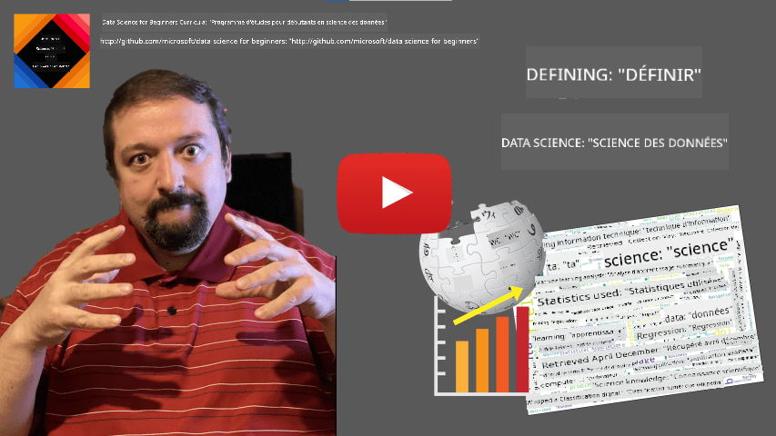
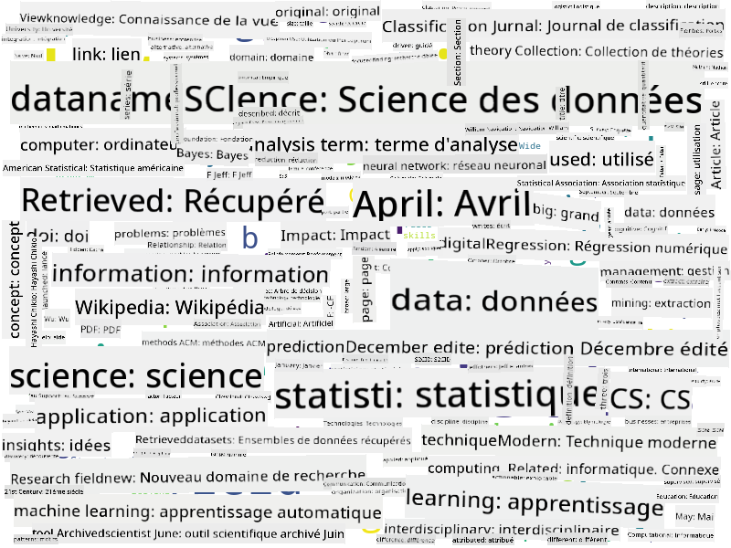

<!--
CO_OP_TRANSLATOR_METADATA:
{
  "original_hash": "43212cc1ac137b7bb1dcfb37ca06b0f4",
  "translation_date": "2025-10-25T18:33:03+00:00",
  "source_file": "1-Introduction/01-defining-data-science/README.md",
  "language_code": "fr"
}
-->
# Définir la Science des Données

|  ](../../sketchnotes/01-Definitions.png) |
| :----------------------------------------------------------------------------------------------------: |
|              Définir la Science des Données - _Sketchnote par [@nitya](https://twitter.com/nitya)_     |

---

## [Quiz avant le cours](https://ff-quizzes.netlify.app/en/ds/quiz/0)

## Qu'est-ce que les données ?
Dans notre vie quotidienne, nous sommes constamment entourés de données. Le texte que vous lisez actuellement est une donnée. La liste des numéros de téléphone de vos amis dans votre smartphone est une donnée, tout comme l'heure actuelle affichée sur votre montre. En tant qu'êtres humains, nous manipulons naturellement des données en comptant l'argent que nous avons ou en écrivant des lettres à nos amis.

Cependant, les données sont devenues beaucoup plus cruciales avec la création des ordinateurs. Le rôle principal des ordinateurs est d'effectuer des calculs, mais ils ont besoin de données pour fonctionner. Ainsi, nous devons comprendre comment les ordinateurs stockent et traitent les données.

Avec l'émergence d'Internet, le rôle des ordinateurs en tant qu'outils de gestion des données a augmenté. Si vous y réfléchissez, nous utilisons maintenant de plus en plus les ordinateurs pour le traitement et la communication des données, plutôt que pour des calculs réels. Lorsque nous écrivons un e-mail à un ami ou recherchons des informations sur Internet, nous créons, stockons, transmettons et manipulons des données.
> Vous souvenez-vous de la dernière fois où vous avez utilisé un ordinateur pour effectuer un calcul ?

## Qu'est-ce que la Science des Données ?

Sur [Wikipedia](https://en.wikipedia.org/wiki/Data_science), la **Science des Données** est définie comme *un domaine scientifique qui utilise des méthodes scientifiques pour extraire des connaissances et des informations à partir de données structurées et non structurées, et appliquer ces connaissances et informations exploitables dans divers domaines d'application*.

Cette définition met en lumière les aspects importants suivants de la science des données :

* L'objectif principal de la science des données est d'**extraire des connaissances** des données, en d'autres termes - **comprendre** les données, trouver des relations cachées et construire un **modèle**.
* La science des données utilise des **méthodes scientifiques**, telles que la probabilité et les statistiques. En fait, lorsque le terme *science des données* a été introduit pour la première fois, certaines personnes ont soutenu que la science des données n'était qu'un nouveau nom à la mode pour les statistiques. Aujourd'hui, il est évident que le domaine est beaucoup plus vaste.
* Les connaissances obtenues doivent être appliquées pour produire des **informations exploitables**, c'est-à-dire des informations pratiques que vous pouvez appliquer à des situations réelles en entreprise.
* Nous devons être capables de travailler avec des données **structurées** et **non structurées**. Nous reviendrons sur les différents types de données plus tard dans le cours.
* Le **domaine d'application** est un concept important, et les spécialistes en science des données ont souvent besoin d'un certain degré d'expertise dans le domaine du problème, par exemple : finance, médecine, marketing, etc.

> Un autre aspect important de la Science des Données est qu'elle étudie comment les données peuvent être collectées, stockées et manipulées à l'aide d'ordinateurs. Alors que les statistiques nous fournissent des bases mathématiques, la science des données applique des concepts mathématiques pour réellement tirer des informations des données.

Une des façons (attribuée à [Jim Gray](https://en.wikipedia.org/wiki/Jim_Gray_(computer_scientist))) de considérer la science des données est de la voir comme un paradigme distinct de la science :
* **Empirique**, où nous nous basons principalement sur des observations et les résultats d'expériences
* **Théorique**, où de nouveaux concepts émergent à partir des connaissances scientifiques existantes
* **Computationnelle**, où nous découvrons de nouveaux principes basés sur des expériences computationnelles
* **Basée sur les données**, en découvrant des relations et des modèles dans les données  

## Autres domaines connexes

Étant donné que les données sont omniprésentes, la science des données est également un domaine vaste, touchant de nombreuses autres disciplines.

<dl>
<dt>Bases de données</dt>
<dd>
Un aspect crucial est <b>comment stocker</b> les données, c'est-à-dire comment les structurer de manière à permettre un traitement plus rapide. Il existe différents types de bases de données qui stockent des données structurées et non structurées, que <a href="../../2-Working-With-Data/README.md">nous examinerons dans notre cours</a>.
</dd>
<dt>Big Data</dt>
<dd>
Souvent, nous devons stocker et traiter de très grandes quantités de données avec une structure relativement simple. Il existe des approches et des outils spécifiques pour stocker ces données de manière distribuée sur un cluster informatique et les traiter efficacement.
</dd>
<dt>Apprentissage automatique</dt>
<dd>
Une façon de comprendre les données est de <b>construire un modèle</b> capable de prédire un résultat souhaité. Développer des modèles à partir de données est appelé <b>apprentissage automatique</b>. Vous pouvez consulter notre <a href="https://aka.ms/ml-beginners">programme d'apprentissage automatique pour débutants</a> pour en savoir plus.
</dd>
<dt>Intelligence artificielle</dt>
<dd>
Un domaine de l'apprentissage automatique connu sous le nom d'intelligence artificielle (IA) repose également sur les données et implique la construction de modèles très complexes qui imitent les processus de pensée humaine. Les méthodes d'IA permettent souvent de transformer des données non structurées (par exemple, le langage naturel) en informations structurées.
</dd>
<dt>Visualisation</dt>
<dd>
De grandes quantités de données sont incompréhensibles pour un être humain, mais une fois que nous créons des visualisations utiles à partir de ces données, nous pouvons mieux les comprendre et en tirer des conclusions. Ainsi, il est important de connaître de nombreuses façons de visualiser les informations - un sujet que nous aborderons dans la <a href="../../3-Data-Visualization/README.md">Section 3</a> de notre cours. Les domaines connexes incluent également les <b>infographies</b> et l'<b'interaction homme-machine</b> en général.
</dd>
</dl>

## Types de données

Comme nous l'avons déjà mentionné, les données sont partout. Nous devons simplement les capturer de la bonne manière ! Il est utile de distinguer les données **structurées** des données **non structurées**. Les premières sont généralement représentées sous une forme bien structurée, souvent sous forme de tableau ou de plusieurs tableaux, tandis que les secondes ne sont qu'une collection de fichiers. Parfois, on peut également parler de données **semi-structurées**, qui ont une sorte de structure pouvant varier considérablement.

| Structurées                                                                | Semi-structurées                                                                               | Non structurées                        |
| -------------------------------------------------------------------------- | --------------------------------------------------------------------------------------------- | -------------------------------------- |
| Liste de personnes avec leurs numéros de téléphone                         | Pages Wikipédia avec des liens                                                                | Texte de l'Encyclopédie Britannica     |
| Température dans toutes les pièces d'un bâtiment chaque minute des 20 dernières années | Collection d'articles scientifiques au format JSON avec auteurs, date de publication et résumé | Partage de fichiers avec des documents d'entreprise |
| Données sur l'âge et le sexe de toutes les personnes entrant dans le bâtiment | Pages Internet                                                                                | Flux vidéo brut d'une caméra de surveillance |

## Où trouver des données

Il existe de nombreuses sources possibles de données, et il serait impossible de toutes les lister ! Cependant, mentionnons quelques endroits typiques où vous pouvez trouver des données :

* **Structurées**
  - **Internet des objets** (IoT), y compris les données provenant de différents capteurs, tels que les capteurs de température ou de pression, qui fournissent de nombreuses données utiles. Par exemple, si un bâtiment de bureaux est équipé de capteurs IoT, nous pouvons contrôler automatiquement le chauffage et l'éclairage pour minimiser les coûts.
  - **Enquêtes** que nous demandons aux utilisateurs de remplir après un achat ou après avoir visité un site web.
  - **Analyse du comportement** peut, par exemple, nous aider à comprendre jusqu'où un utilisateur explore un site et quelle est la raison typique de son départ.
* **Non structurées**
  - **Textes** peuvent être une source riche d'informations, comme un **score de sentiment global**, ou l'extraction de mots-clés et de significations sémantiques.
  - **Images** ou **vidéos**. Une vidéo d'une caméra de surveillance peut être utilisée pour estimer le trafic sur la route et informer les gens des embouteillages potentiels.
  - Les **journaux de serveur web** peuvent être utilisés pour comprendre quelles pages de notre site sont les plus souvent visitées et pendant combien de temps.
* Semi-structurées
  - Les graphes des **réseaux sociaux** peuvent être d'excellentes sources de données sur les personnalités des utilisateurs et leur potentiel à diffuser des informations.
  - Lorsque nous avons un tas de photographies d'une fête, nous pouvons essayer d'extraire des données sur la **dynamique de groupe** en construisant un graphe des personnes prenant des photos ensemble.

En connaissant les différentes sources possibles de données, vous pouvez essayer de réfléchir à différents scénarios où les techniques de science des données peuvent être appliquées pour mieux comprendre la situation et améliorer les processus commerciaux.

## Ce que vous pouvez faire avec les données

En Science des Données, nous nous concentrons sur les étapes suivantes du parcours des données :

<dl>
<dt>1) Acquisition des données</dt>
<dd>
La première étape consiste à collecter les données. Bien que dans de nombreux cas, cela puisse être un processus simple, comme des données arrivant dans une base de données à partir d'une application web, parfois nous devons utiliser des techniques spéciales. Par exemple, les données provenant des capteurs IoT peuvent être abondantes, et il est judicieux d'utiliser des points de collecte intermédiaires tels que IoT Hub pour collecter toutes les données avant de les traiter davantage.
</dd>
<dt>2) Stockage des données</dt>
<dd>
Stocker des données peut être un défi, surtout si nous parlons de big data. Lorsqu'on décide comment stocker les données, il est logique d'anticiper la manière dont vous souhaitez interroger les données à l'avenir. Il existe plusieurs façons de stocker les données :
<ul>
<li>Une base de données relationnelle stocke une collection de tableaux et utilise un langage spécial appelé SQL pour les interroger. En général, les tableaux sont organisés en différents groupes appelés schémas. Dans de nombreux cas, nous devons convertir les données de leur forme originale pour qu'elles s'adaptent au schéma.</li>
<li><a href="https://en.wikipedia.org/wiki/NoSQL">Une base de données NoSQL</a>, comme <a href="https://azure.microsoft.com/services/cosmos-db/?WT.mc_id=academic-77958-bethanycheum">CosmosDB</a>, n'impose pas de schémas aux données et permet de stocker des données plus complexes, par exemple des documents JSON hiérarchiques ou des graphes. Cependant, les bases de données NoSQL n'ont pas les capacités de requête riches de SQL et ne peuvent pas imposer l'intégrité référentielle, c'est-à-dire des règles sur la structure des données dans les tableaux et les relations entre les tableaux.</li>
<li>Le stockage dans un <a href="https://en.wikipedia.org/wiki/Data_lake">Data Lake</a> est utilisé pour de grandes collections de données sous forme brute et non structurée. Les Data Lakes sont souvent utilisés avec le big data, où toutes les données ne peuvent pas tenir sur une seule machine et doivent être stockées et traitées par un cluster de serveurs. <a href="https://en.wikipedia.org/wiki/Apache_Parquet">Parquet</a> est le format de données souvent utilisé en conjonction avec le big data.</li> 
</ul>
</dd>
<dt>3) Traitement des données</dt>
<dd>
C'est la partie la plus passionnante du parcours des données, qui consiste à convertir les données de leur forme originale en une forme utilisable pour la visualisation ou l'entraînement de modèles. Lorsqu'on travaille avec des données non structurées telles que des textes ou des images, nous pouvons avoir besoin d'utiliser des techniques d'IA pour extraire des <b>caractéristiques</b> des données, les convertissant ainsi en une forme structurée.
</dd>
<dt>4) Visualisation / Analyse humaine</dt>
<dd>
Souvent, pour comprendre les données, nous devons les visualiser. En ayant de nombreuses techniques de visualisation différentes dans notre boîte à outils, nous pouvons trouver la bonne perspective pour en tirer des informations. Souvent, un spécialiste en science des données doit "jouer avec les données", les visualiser plusieurs fois et rechercher des relations. De plus, nous pouvons utiliser des techniques statistiques pour tester des hypothèses ou prouver une corrélation entre différents éléments de données.
</dd>
<dt>5) Entraînement d'un modèle prédictif</dt>
<dd>
Étant donné que l'objectif ultime de la science des données est de pouvoir prendre des décisions basées sur les données, nous pouvons vouloir utiliser les techniques de <a href="http://github.com/microsoft/ml-for-beginners">l'apprentissage automatique</a> pour construire un modèle prédictif. Nous pourrons ensuite utiliser ce modèle pour faire des prédictions en utilisant de nouveaux ensembles de données ayant des structures similaires.
</dd>
</dl>

Bien sûr, selon les données réelles, certaines étapes peuvent être absentes (par exemple, lorsque nous avons déjà les données dans la base de données ou lorsque nous n'avons pas besoin d'entraîner un modèle), ou certaines étapes peuvent être répétées plusieurs fois (comme le traitement des données).

## Numérisation et transformation numérique

Au cours de la dernière décennie, de nombreuses entreprises ont commencé à comprendre l'importance des données dans la prise de décisions commerciales. Pour appliquer les principes de la science des données à la gestion d'une entreprise, il faut d'abord collecter des données, c'est-à-dire traduire les processus commerciaux en forme numérique. Cela s'appelle la **numérisation**. L'application des techniques de science des données à ces données pour orienter les décisions peut entraîner des augmentations significatives de la productivité (ou même un pivot commercial), appelé **transformation numérique**.

Prenons un exemple. Supposons que nous ayons un cours de science des données (comme celui-ci) que nous proposons en ligne aux étudiants, et que nous souhaitions utiliser la science des données pour l'améliorer. Comment pouvons-nous le faire ?

Nous pouvons commencer par nous demander "Que peut-on numériser ?" La manière la plus simple serait de mesurer le temps qu'il faut à chaque étudiant pour terminer chaque module, et de mesurer les connaissances acquises en donnant un test à choix multiples à la fin de chaque module. En calculant la moyenne du temps nécessaire pour terminer chaque module parmi tous les étudiants, nous pouvons identifier les modules qui posent le plus de difficultés et travailler à les simplifier.
> Vous pourriez argumenter que cette approche n'est pas idéale, car les modules peuvent avoir des longueurs différentes. Il serait probablement plus juste de diviser le temps par la longueur du module (en nombre de caractères) et de comparer ces valeurs à la place.

Lorsque nous commençons à analyser les résultats des tests à choix multiples, nous pouvons essayer de déterminer quels concepts posent des difficultés de compréhension aux étudiants, et utiliser ces informations pour améliorer le contenu. Pour ce faire, nous devons concevoir des tests de manière à ce que chaque question corresponde à un concept ou une unité de connaissance spécifique.

Si nous voulons aller encore plus loin, nous pouvons tracer le temps nécessaire pour chaque module en fonction de la catégorie d'âge des étudiants. Nous pourrions découvrir que, pour certaines catégories d'âge, il faut un temps excessivement long pour terminer le module, ou que les étudiants abandonnent avant de le terminer. Cela peut nous aider à fournir des recommandations d'âge pour le module et à minimiser l'insatisfaction des utilisateurs due à des attentes erronées.

## 🚀 Défi

Dans ce défi, nous allons essayer de trouver des concepts pertinents dans le domaine de la Data Science en analysant des textes. Nous prendrons un article de Wikipédia sur la Data Science, téléchargerons et traiterons le texte, puis créerons un nuage de mots comme celui-ci :

Visitez [`notebook.ipynb`](../../../../1-Introduction/01-defining-data-science/notebook.ipynb ':ignore') pour parcourir le code. Vous pouvez également exécuter le code et voir comment il effectue toutes les transformations de données en temps réel.

> Si vous ne savez pas comment exécuter du code dans un Jupyter Notebook, consultez [cet article](https://soshnikov.com/education/how-to-execute-notebooks-from-github/).

## [Quiz après le cours](https://ff-quizzes.netlify.app/en/ds/quiz/1)

## Devoirs

* **Tâche 1** : Modifiez le code ci-dessus pour découvrir les concepts liés aux domaines du **Big Data** et du **Machine Learning**.
* **Tâche 2** : [Réfléchissez à des scénarios de Data Science](assignment.md)

## Crédits

Cette leçon a été rédigée avec ♥️ par [Dmitry Soshnikov](http://soshnikov.com)

---

**Avertissement** :  
Ce document a été traduit à l'aide du service de traduction automatique [Co-op Translator](https://github.com/Azure/co-op-translator). Bien que nous nous efforcions d'assurer l'exactitude, veuillez noter que les traductions automatisées peuvent contenir des erreurs ou des inexactitudes. Le document original dans sa langue d'origine doit être considéré comme la source faisant autorité. Pour des informations critiques, il est recommandé de recourir à une traduction humaine professionnelle. Nous ne sommes pas responsables des malentendus ou des interprétations erronées résultant de l'utilisation de cette traduction.