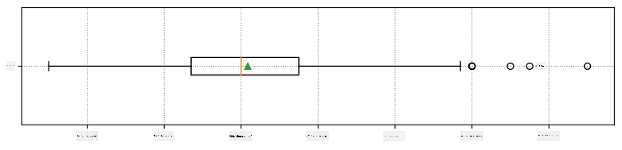
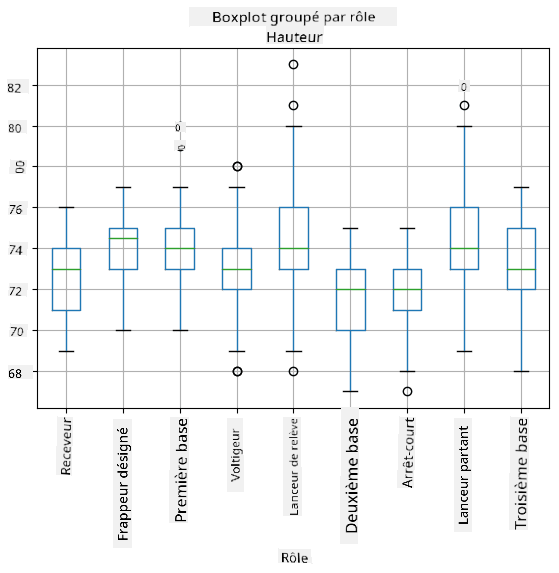
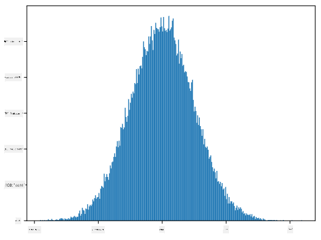

<!--
CO_OP_TRANSLATOR_METADATA:
{
  "original_hash": "b706a07cfa87ba091cbb91e0aa775600",
  "translation_date": "2025-08-25T17:05:45+00:00",
  "source_file": "1-Introduction/04-stats-and-probability/README.md",
  "language_code": "fr"
}
-->
# Une brève introduction aux statistiques et à la probabilité

| ](../../sketchnotes/04-Statistics-Probability.png)|
|:---:|
| Statistiques et Probabilité - _Sketchnote par [@nitya](https://twitter.com/nitya)_ |

La théorie des statistiques et des probabilités sont deux domaines des mathématiques étroitement liés et très pertinents pour la science des données. Il est possible de travailler avec des données sans une connaissance approfondie des mathématiques, mais il est tout de même préférable de connaître au moins quelques concepts de base. Voici une courte introduction pour vous aider à démarrer.

[](https://youtu.be/Z5Zy85g4Yjw)

## [Quiz avant le cours](https://purple-hill-04aebfb03.1.azurestaticapps.net/quiz/6)

## Probabilité et variables aléatoires

La **probabilité** est un nombre compris entre 0 et 1 qui exprime à quel point un **événement** est probable. Elle est définie comme le nombre de résultats positifs (qui mènent à l'événement), divisé par le nombre total de résultats, en supposant que tous les résultats sont également probables. Par exemple, lorsque nous lançons un dé, la probabilité d'obtenir un nombre pair est de 3/6 = 0,5.

Lorsque nous parlons d'événements, nous utilisons des **variables aléatoires**. Par exemple, la variable aléatoire qui représente le nombre obtenu en lançant un dé prendra des valeurs de 1 à 6. L'ensemble des nombres de 1 à 6 est appelé **espace d'échantillonnage**. Nous pouvons parler de la probabilité qu'une variable aléatoire prenne une certaine valeur, par exemple P(X=3)=1/6.

La variable aléatoire dans l'exemple précédent est appelée **discrète**, car elle a un espace d'échantillonnage dénombrable, c'est-à-dire qu'il existe des valeurs distinctes qui peuvent être énumérées. Il existe des cas où l'espace d'échantillonnage est un intervalle de nombres réels, ou l'ensemble complet des nombres réels. Ces variables sont appelées **continues**. Un bon exemple est l'heure d'arrivée d'un bus.

## Distribution de probabilité

Dans le cas des variables aléatoires discrètes, il est facile de décrire la probabilité de chaque événement par une fonction P(X). Pour chaque valeur *s* de l'espace d'échantillonnage *S*, elle donnera un nombre compris entre 0 et 1, de sorte que la somme de toutes les valeurs de P(X=s) pour tous les événements soit égale à 1.

La distribution discrète la plus connue est la **distribution uniforme**, dans laquelle il existe un espace d'échantillonnage de N éléments, avec une probabilité égale de 1/N pour chacun d'eux.

Il est plus difficile de décrire la distribution de probabilité d'une variable continue, avec des valeurs tirées d'un intervalle [a,b], ou de l'ensemble complet des nombres réels ℝ. Prenons l'exemple de l'heure d'arrivée d'un bus. En réalité, pour chaque heure d'arrivée exacte *t*, la probabilité qu'un bus arrive exactement à cette heure est de 0 !

> Maintenant, vous savez que des événements avec une probabilité de 0 se produisent, et très souvent ! Au moins chaque fois qu'un bus arrive !

Nous ne pouvons parler que de la probabilité qu'une variable tombe dans un intervalle donné de valeurs, par exemple P(t<sub>1</sub>≤X<t<sub>2</sub>). Dans ce cas, la distribution de probabilité est décrite par une **fonction de densité de probabilité** p(x), telle que


Un analogue continu de la distribution uniforme est appelé **uniforme continue**, qui est défini sur un intervalle fini. La probabilité que la valeur X tombe dans un intervalle de longueur l est proportionnelle à l, et peut atteindre 1.

Une autre distribution importante est la **distribution normale**, dont nous parlerons plus en détail ci-dessous.

## Moyenne, variance et écart-type

Supposons que nous tirons une séquence de n échantillons d'une variable aléatoire X : x<sub>1</sub>, x<sub>2</sub>, ..., x<sub>n</sub>. Nous pouvons définir la **moyenne** (ou **moyenne arithmétique**) de la séquence de manière traditionnelle comme (x<sub>1</sub>+x<sub>2</sub>+x<sub>n</sub>)/n. En augmentant la taille de l'échantillon (c'est-à-dire en prenant la limite avec n→∞), nous obtiendrons la moyenne (également appelée **espérance**) de la distribution. Nous noterons l'espérance par **E**(x).

> Il peut être démontré que pour toute distribution discrète avec des valeurs {x<sub>1</sub>, x<sub>2</sub>, ..., x<sub>N</sub>} et des probabilités correspondantes p<sub>1</sub>, p<sub>2</sub>, ..., p<sub>N</sub>, l'espérance serait égale à E(X)=x<sub>1</sub>p<sub>1</sub>+x<sub>2</sub>p<sub>2</sub>+...+x<sub>N</sub>p<sub>N</sub>.

Pour identifier à quel point les valeurs sont dispersées, nous pouvons calculer la variance σ<sup>2</sup> = ∑(x<sub>i</sub> - μ)<sup>2</sup>/n, où μ est la moyenne de la séquence. La valeur σ est appelée **écart-type**, et σ<sup>2</sup> est appelée **variance**.

## Mode, médiane et quartiles

Parfois, la moyenne ne représente pas adéquatement la valeur "typique" des données. Par exemple, lorsqu'il y a quelques valeurs extrêmes complètement hors de portée, elles peuvent affecter la moyenne. Une autre bonne indication est la **médiane**, une valeur telle que la moitié des points de données sont inférieurs à celle-ci, et l'autre moitié - supérieurs.

Pour mieux comprendre la distribution des données, il est utile de parler des **quartiles** :

* Le premier quartile, ou Q1, est une valeur telle que 25 % des données sont inférieures à celle-ci.
* Le troisième quartile, ou Q3, est une valeur telle que 75 % des données sont inférieures à celle-ci.

Graphiquement, nous pouvons représenter la relation entre la médiane et les quartiles dans un diagramme appelé **boîte à moustaches** :


Ici, nous calculons également l'**étendue interquartile** IQR=Q3-Q1, et les **valeurs aberrantes** - des valeurs qui se situent en dehors des limites [Q1-1.5*IQR, Q3+1.5*IQR].

Pour une distribution finie contenant un petit nombre de valeurs possibles, une bonne valeur "typique" est celle qui apparaît le plus fréquemment, appelée **mode**. Cela s'applique souvent aux données catégoriques, comme les couleurs. Considérons une situation où nous avons deux groupes de personnes - certains qui préfèrent fortement le rouge, et d'autres qui préfèrent le bleu. Si nous codons les couleurs par des nombres, la moyenne pour une couleur préférée serait quelque part dans le spectre orange-vert, ce qui ne reflète pas les préférences réelles d'aucun groupe. Cependant, le mode serait soit l'une des couleurs, soit les deux couleurs, si le nombre de personnes votant pour elles est égal (dans ce cas, nous appelons l'échantillon **multimodal**).

## Données du monde réel

Lorsque nous analysons des données du monde réel, elles ne sont souvent pas des variables aléatoires à proprement parler, dans le sens où nous ne réalisons pas d'expériences avec des résultats inconnus. Par exemple, considérons une équipe de joueurs de baseball, et leurs données corporelles, telles que la taille, le poids et l'âge. Ces nombres ne sont pas exactement aléatoires, mais nous pouvons tout de même appliquer les mêmes concepts mathématiques. Par exemple, une séquence de poids de personnes peut être considérée comme une séquence de valeurs tirées d'une variable aléatoire. Voici la séquence des poids de joueurs de baseball réels de la [Major League Baseball](http://mlb.mlb.com/index.jsp), tirée de [ce jeu de données](http://wiki.stat.ucla.edu/socr/index.php/SOCR_Data_MLB_HeightsWeights) (pour votre commodité, seules les 20 premières valeurs sont affichées) :

```
[180.0, 215.0, 210.0, 210.0, 188.0, 176.0, 209.0, 200.0, 231.0, 180.0, 188.0, 180.0, 185.0, 160.0, 180.0, 185.0, 197.0, 189.0, 185.0, 219.0]
```

> **Note** : Pour voir un exemple de travail avec ce jeu de données, consultez le [notebook associé](../../../../1-Introduction/04-stats-and-probability/notebook.ipynb). Il y a également un certain nombre de défis tout au long de cette leçon, et vous pouvez les compléter en ajoutant du code à ce notebook. Si vous ne savez pas comment manipuler les données, ne vous inquiétez pas - nous reviendrons sur le travail avec les données en utilisant Python plus tard. Si vous ne savez pas comment exécuter du code dans un Jupyter Notebook, consultez [cet article](https://soshnikov.com/education/how-to-execute-notebooks-from-github/).

Voici le diagramme en boîte montrant la moyenne, la médiane et les quartiles pour nos données :



Comme nos données contiennent des informations sur différents **rôles** de joueurs, nous pouvons également réaliser un diagramme en boîte par rôle - cela nous permettra de comprendre comment les valeurs des paramètres diffèrent selon les rôles. Cette fois, nous considérerons la taille :



Ce diagramme suggère qu'en moyenne, la taille des joueurs de première base est supérieure à celle des joueurs de deuxième base. Plus tard dans cette leçon, nous apprendrons comment tester cette hypothèse de manière plus formelle, et comment démontrer que nos données sont statistiquement significatives pour le prouver.

> Lorsque nous travaillons avec des données du monde réel, nous supposons que tous les points de données sont des échantillons tirés d'une certaine distribution de probabilité. Cette hypothèse nous permet d'appliquer des techniques d'apprentissage automatique et de construire des modèles prédictifs fonctionnels.

Pour voir quelle est la distribution de nos données, nous pouvons tracer un graphique appelé **histogramme**. L'axe X contiendra un certain nombre d'intervalles de poids différents (appelés **bins**), et l'axe vertical montrera le nombre de fois où notre échantillon de variable aléatoire se trouvait dans un intervalle donné.


À partir de cet histogramme, vous pouvez voir que toutes les valeurs sont centrées autour d'un certain poids moyen, et plus nous nous éloignons de ce poids, moins il est probable de rencontrer des poids de cette valeur. Autrement dit, il est très improbable que le poids d'un joueur de baseball soit très différent du poids moyen. La variance des poids montre dans quelle mesure les poids sont susceptibles de différer de la moyenne.

> Si nous prenons les poids d'autres personnes, pas de la ligue de baseball, la distribution sera probablement différente. Cependant, la forme de la distribution restera la même, mais la moyenne et la variance changeront. Ainsi, si nous entraînons notre modèle sur des joueurs de baseball, il est probable qu'il donne des résultats erronés lorsqu'il est appliqué à des étudiants d'une université, car la distribution sous-jacente est différente.

## Distribution normale

La distribution des poids que nous avons vue ci-dessus est très typique, et de nombreuses mesures du monde réel suivent le même type de distribution, mais avec des moyennes et des variances différentes. Cette distribution est appelée **distribution normale**, et elle joue un rôle très important en statistiques.

Utiliser une distribution normale est une méthode correcte pour générer des poids aléatoires de joueurs de baseball potentiels. Une fois que nous connaissons le poids moyen `mean` et l'écart-type `std`, nous pouvons générer 1000 échantillons de poids de la manière suivante :
```python
samples = np.random.normal(mean,std,1000)
```

Si nous traçons l'histogramme des échantillons générés, nous verrons une image très similaire à celle montrée ci-dessus. Et si nous augmentons le nombre d'échantillons et le nombre de bins, nous pouvons générer une image d'une distribution normale plus proche de l'idéal :



*Distribution normale avec moyenne=0 et écart-type=1*

## Intervalles de confiance

Lorsque nous parlons des poids des joueurs de baseball, nous supposons qu'il existe une certaine **variable aléatoire W** qui correspond à la distribution de probabilité idéale des poids de tous les joueurs de baseball (appelée **population**). Notre séquence de poids correspond à un sous-ensemble de tous les joueurs de baseball que nous appelons **échantillon**. Une question intéressante est : pouvons-nous connaître les paramètres de la distribution de W, c'est-à-dire la moyenne et la variance de la population ?

La réponse la plus simple serait de calculer la moyenne et la variance de notre échantillon. Cependant, il pourrait arriver que notre échantillon aléatoire ne représente pas fidèlement la population complète. Ainsi, il est logique de parler d'**intervalle de confiance**.
> **L'intervalle de confiance** est l'estimation de la moyenne réelle de la population à partir de notre échantillon, avec une précision selon une certaine probabilité (ou **niveau de confiance**).
Supposons que nous avons un échantillon X<sub>1</sub>, ..., X<sub>n</sub> issu de notre distribution. Chaque fois que nous tirons un échantillon de notre distribution, nous obtenons une valeur moyenne différente μ. Ainsi, μ peut être considéré comme une variable aléatoire. Un **intervalle de confiance** avec une confiance p est une paire de valeurs (L<sub>p</sub>,R<sub>p</sub>), telle que **P**(L<sub>p</sub>≤μ≤R<sub>p</sub>) = p, c'est-à-dire que la probabilité que la valeur moyenne mesurée tombe dans l'intervalle est égale à p.

Il dépasse le cadre de cette introduction de discuter en détail comment ces intervalles de confiance sont calculés. Vous pouvez trouver plus de détails [sur Wikipédia](https://en.wikipedia.org/wiki/Confidence_interval). En résumé, nous définissons la distribution de la moyenne d'échantillon calculée par rapport à la moyenne réelle de la population, appelée **distribution de Student**.

> **Fait intéressant** : La distribution de Student porte le nom du mathématicien William Sealy Gosset, qui a publié son article sous le pseudonyme "Student". Il travaillait dans la brasserie Guinness et, selon une version, son employeur ne voulait pas que le grand public sache qu'ils utilisaient des tests statistiques pour déterminer la qualité des matières premières.

Si nous voulons estimer la moyenne μ de notre population avec une confiance p, nous devons prendre le *percentile (1-p)/2* d'une distribution de Student A, qui peut être obtenu à partir de tables ou calculé à l'aide de fonctions intégrées dans des logiciels statistiques (par exemple Python, R, etc.). Ensuite, l'intervalle pour μ serait donné par X±A*D/√n, où X est la moyenne obtenue de l'échantillon, D est l'écart-type.

> **Note** : Nous omettons également la discussion d'un concept important des [degrés de liberté](https://en.wikipedia.org/wiki/Degrees_of_freedom_(statistics)), qui est essentiel en relation avec la distribution de Student. Vous pouvez consulter des livres plus complets sur les statistiques pour approfondir ce concept.

Un exemple de calcul d'intervalle de confiance pour les poids et les tailles est donné dans les [notebooks associés](../../../../1-Introduction/04-stats-and-probability/notebook.ipynb).

| p    | Moyenne du poids |
|------|------------------|
| 0.85 | 201.73±0.94      |
| 0.90 | 201.73±1.08      |
| 0.95 | 201.73±1.28      |

Remarquez que plus la probabilité de confiance est élevée, plus l'intervalle de confiance est large.

## Test d'hypothèse

Dans notre ensemble de données sur les joueurs de baseball, il existe différents rôles de joueurs, qui peuvent être résumés ci-dessous (consultez le [notebook associé](../../../../1-Introduction/04-stats-and-probability/notebook.ipynb) pour voir comment ce tableau peut être calculé) :

| Rôle               | Taille   | Poids    | Nombre |
|--------------------|----------|----------|--------|
| Receveur           | 72.723684 | 204.328947 | 76     |
| Frappeur désigné   | 74.222222 | 220.888889 | 18     |
| Premier but        | 74.000000 | 213.109091 | 55     |
| Champ extérieur    | 73.010309 | 199.113402 | 194    |
| Lanceur de relève  | 74.374603 | 203.517460 | 315    |
| Deuxième but       | 71.362069 | 184.344828 | 58     |
| Arrêt-court        | 71.903846 | 182.923077 | 52     |
| Lanceur partant    | 74.719457 | 205.163636 | 221    |
| Troisième but      | 73.044444 | 200.955556 | 45     |

Nous pouvons remarquer que la taille moyenne des premiers buts est supérieure à celle des deuxièmes buts. Ainsi, nous pourrions être tentés de conclure que **les premiers buts sont plus grands que les deuxièmes buts**.

> Cette affirmation est appelée **une hypothèse**, car nous ne savons pas si le fait est réellement vrai ou non.

Cependant, il n'est pas toujours évident de pouvoir tirer cette conclusion. D'après la discussion ci-dessus, nous savons que chaque moyenne a un intervalle de confiance associé, et donc cette différence peut simplement être une erreur statistique. Nous avons besoin d'une méthode plus formelle pour tester notre hypothèse.

Calculons les intervalles de confiance séparément pour les tailles des premiers et des deuxièmes buts :

| Confiance | Premiers buts | Deuxièmes buts |
|-----------|---------------|----------------|
| 0.85      | 73.62..74.38  | 71.04..71.69   |
| 0.90      | 73.56..74.44  | 70.99..71.73   |
| 0.95      | 73.47..74.53  | 70.92..71.81   |

Nous pouvons voir qu'à aucun niveau de confiance les intervalles ne se chevauchent. Cela prouve notre hypothèse selon laquelle les premiers buts sont plus grands que les deuxièmes buts.

Plus formellement, le problème que nous résolvons est de voir si **deux distributions de probabilité sont identiques**, ou du moins ont les mêmes paramètres. Selon la distribution, nous devons utiliser différents tests pour cela. Si nous savons que nos distributions sont normales, nous pouvons appliquer le **[test t de Student](https://en.wikipedia.org/wiki/Student%27s_t-test)**.

Dans le test t de Student, nous calculons ce qu'on appelle la **valeur t**, qui indique la différence entre les moyennes, en tenant compte de la variance. Il est démontré que la valeur t suit la **distribution de Student**, ce qui nous permet d'obtenir la valeur seuil pour un niveau de confiance donné **p** (cela peut être calculé ou consulté dans des tables numériques). Nous comparons ensuite la valeur t à ce seuil pour approuver ou rejeter l'hypothèse.

En Python, nous pouvons utiliser le package **SciPy**, qui inclut la fonction `ttest_ind` (en plus de nombreuses autres fonctions statistiques utiles !). Elle calcule la valeur t pour nous et effectue également la recherche inverse de la valeur p de confiance, afin que nous puissions simplement regarder la confiance pour tirer une conclusion.

Par exemple, notre comparaison entre les tailles des premiers et des deuxièmes buts nous donne les résultats suivants : 
```python
from scipy.stats import ttest_ind

tval, pval = ttest_ind(df.loc[df['Role']=='First_Baseman',['Height']], df.loc[df['Role']=='Designated_Hitter',['Height']],equal_var=False)
print(f"T-value = {tval[0]:.2f}\nP-value: {pval[0]}")
```
```
T-value = 7.65
P-value: 9.137321189738925e-12
```
Dans notre cas, la valeur p est très faible, ce qui signifie qu'il existe des preuves solides soutenant que les premiers buts sont plus grands.

Il existe également différents types d'hypothèses que nous pourrions vouloir tester, par exemple :
* Prouver qu'un échantillon donné suit une distribution. Dans notre cas, nous avons supposé que les tailles sont distribuées normalement, mais cela nécessite une vérification statistique formelle.
* Prouver que la valeur moyenne d'un échantillon correspond à une valeur prédéfinie.
* Comparer les moyennes de plusieurs échantillons (par exemple, quelle est la différence dans les niveaux de bonheur entre différents groupes d'âge).

## Loi des grands nombres et théorème central limite

L'une des raisons pour lesquelles la distribution normale est si importante est le **théorème central limite**. Supposons que nous avons un grand échantillon de N valeurs indépendantes X<sub>1</sub>, ..., X<sub>N</sub>, échantillonnées à partir de n'importe quelle distribution avec une moyenne μ et une variance σ<sup>2</sup>. Ensuite, pour un N suffisamment grand (en d'autres termes, lorsque N→∞), la moyenne Σ<sub>i</sub>X<sub>i</sub> serait distribuée normalement, avec une moyenne μ et une variance σ<sup>2</sup>/N.

> Une autre façon d'interpréter le théorème central limite est de dire que, quelle que soit la distribution, lorsque vous calculez la moyenne d'une somme de valeurs de variables aléatoires, vous obtenez une distribution normale.

D'après le théorème central limite, il s'ensuit également que, lorsque N→∞, la probabilité que la moyenne de l'échantillon soit égale à μ devient 1. Cela est connu sous le nom de **loi des grands nombres**.

## Covariance et corrélation

L'une des choses que fait la science des données est de trouver des relations entre les données. Nous disons que deux séquences **corrèlent** lorsqu'elles présentent un comportement similaire au même moment, c'est-à-dire qu'elles augmentent/diminuent simultanément, ou qu'une séquence augmente lorsque l'autre diminue et vice versa. En d'autres termes, il semble y avoir une relation entre deux séquences.

> La corrélation n'indique pas nécessairement une relation causale entre deux séquences ; parfois, les deux variables peuvent dépendre d'une cause externe, ou cela peut être purement par hasard que les deux séquences corrèlent. Cependant, une corrélation mathématique forte est une bonne indication que deux variables sont d'une certaine manière connectées.

Mathématiquement, le concept principal qui montre la relation entre deux variables aléatoires est la **covariance**, qui est calculée comme suit : Cov(X,Y) = **E**\[(X-**E**(X))(Y-**E**(Y))\]. Nous calculons la déviation des deux variables par rapport à leurs valeurs moyennes, puis le produit de ces déviations. Si les deux variables dévient ensemble, le produit sera toujours une valeur positive, ce qui donnera une covariance positive. Si les deux variables dévient de manière désynchronisée (c'est-à-dire qu'une tombe en dessous de la moyenne lorsque l'autre dépasse la moyenne), nous obtiendrons toujours des nombres négatifs, ce qui donnera une covariance négative. Si les déviations ne sont pas dépendantes, elles s'additionneront à peu près à zéro.

La valeur absolue de la covariance ne nous dit pas grand-chose sur l'ampleur de la corrélation, car elle dépend de la magnitude des valeurs réelles. Pour la normaliser, nous pouvons diviser la covariance par l'écart-type des deux variables, pour obtenir la **corrélation**. L'avantage est que la corrélation est toujours dans la plage [-1,1], où 1 indique une forte corrélation positive entre les valeurs, -1 une forte corrélation négative, et 0 aucune corrélation (les variables sont indépendantes).

**Exemple** : Nous pouvons calculer la corrélation entre les poids et les tailles des joueurs de baseball à partir de l'ensemble de données mentionné ci-dessus :
```python
print(np.corrcoef(weights,heights))
```
En conséquence, nous obtenons une **matrice de corrélation** comme celle-ci :
```
array([[1.        , 0.52959196],
       [0.52959196, 1.        ]])
```

> La matrice de corrélation C peut être calculée pour n'importe quel nombre de séquences d'entrée S<sub>1</sub>, ..., S<sub>n</sub>. La valeur de C<sub>ij</sub> est la corrélation entre S<sub>i</sub> et S<sub>j</sub>, et les éléments diagonaux sont toujours 1 (ce qui est également l'auto-corrélation de S<sub>i</sub>).

Dans notre cas, la valeur 0.53 indique qu'il existe une certaine corrélation entre le poids et la taille d'une personne. Nous pouvons également réaliser un diagramme de dispersion d'une valeur par rapport à l'autre pour voir la relation visuellement :


> Plus d'exemples de corrélation et de covariance peuvent être trouvés dans le [notebook associé](../../../../1-Introduction/04-stats-and-probability/notebook.ipynb).

## Conclusion

Dans cette section, nous avons appris :

* les propriétés statistiques de base des données, telles que la moyenne, la variance, le mode et les quartiles
* les différentes distributions de variables aléatoires, y compris la distribution normale
* comment trouver la corrélation entre différentes propriétés
* comment utiliser un appareil mathématique et statistique solide pour prouver certaines hypothèses
* comment calculer des intervalles de confiance pour une variable aléatoire donnée un échantillon de données

Bien que cette liste ne soit certainement pas exhaustive des sujets qui existent dans la probabilité et les statistiques, elle devrait suffire à vous donner un bon départ dans ce cours.

## 🚀 Défi

Utilisez le code d'exemple dans le notebook pour tester d'autres hypothèses :
1. Les premiers buts sont plus âgés que les deuxièmes buts
2. Les premiers buts sont plus grands que les troisièmes buts
3. Les arrêts-courts sont plus grands que les deuxièmes buts

## [Quiz post-lecture](https://purple-hill-04aebfb03.1.azurestaticapps.net/quiz/7)

## Révision et auto-apprentissage

La probabilité et les statistiques sont un sujet si vaste qu'il mérite son propre cours. Si vous souhaitez approfondir la théorie, vous pouvez continuer à lire certains des livres suivants :

1. [Carlos Fernandez-Granda](https://cims.nyu.edu/~cfgranda/) de l'Université de New York propose d'excellentes notes de cours [Probability and Statistics for Data Science](https://cims.nyu.edu/~cfgranda/pages/stuff/probability_stats_for_DS.pdf) (disponibles en ligne)
1. [Peter et Andrew Bruce. Practical Statistics for Data Scientists.](https://www.oreilly.com/library/view/practical-statistics-for/9781491952955/) [[code d'exemple en R](https://github.com/andrewgbruce/statistics-for-data-scientists)]. 
1. [James D. Miller. Statistics for Data Science](https://www.packtpub.com/product/statistics-for-data-science/9781788290678) [[code d'exemple en R](https://github.com/PacktPublishing/Statistics-for-Data-Science)]

## Devoir

[Petite étude sur le diabète](assignment.md)

## Crédits

Cette leçon a été rédigée avec ♥️ par [Dmitry Soshnikov](http://soshnikov.com)

**Avertissement** :  
Ce document a été traduit à l'aide du service de traduction automatique [Co-op Translator](https://github.com/Azure/co-op-translator). Bien que nous nous efforcions d'assurer l'exactitude, veuillez noter que les traductions automatisées peuvent contenir des erreurs ou des inexactitudes. Le document original dans sa langue d'origine doit être considéré comme la source faisant autorité. Pour des informations critiques, il est recommandé de recourir à une traduction professionnelle réalisée par un humain. Nous déclinons toute responsabilité en cas de malentendus ou d'interprétations erronées résultant de l'utilisation de cette traduction.