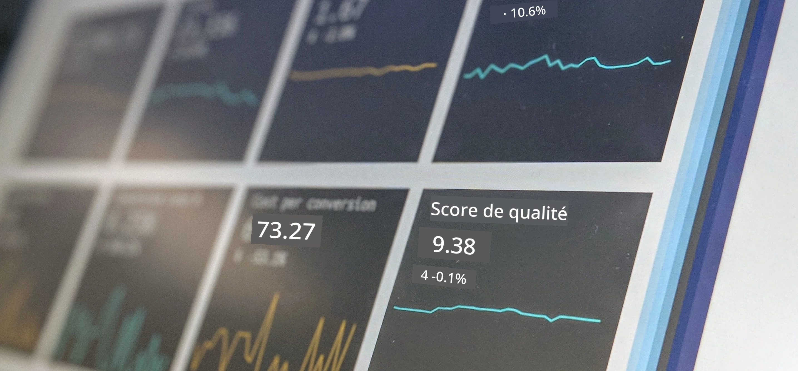

<!--
CO_OP_TRANSLATOR_METADATA:
{
  "original_hash": "696a8474a01054281704cbfb09148949",
  "translation_date": "2025-08-25T16:38:21+00:00",
  "source_file": "1-Introduction/README.md",
  "language_code": "fr"
}
-->
# Introduction à la Science des Données

> Photo par <a href="https://unsplash.com/@dawson2406?utm_source=unsplash&utm_medium=referral&utm_content=creditCopyText">Stephen Dawson</a> sur <a href="https://unsplash.com/s/photos/data?utm_source=unsplash&utm_medium=referral&utm_content=creditCopyText">Unsplash</a>
  
Dans ces leçons, vous découvrirez comment la Science des Données est définie et vous apprendrez les considérations éthiques qu'un data scientist doit prendre en compte. Vous apprendrez également ce que sont les données et vous vous familiariserez avec les bases des statistiques et de la probabilité, les domaines académiques fondamentaux de la Science des Données.

### Sujets

1. [Définir la Science des Données](01-defining-data-science/README.md)
2. [Éthique en Science des Données](02-ethics/README.md)
3. [Définir les Données](03-defining-data/README.md)
4. [Introduction aux Statistiques et à la Probabilité](04-stats-and-probability/README.md)

### Crédits

Ces leçons ont été écrites avec ❤️ par [Nitya Narasimhan](https://twitter.com/nitya) et [Dmitry Soshnikov](https://twitter.com/shwars).

**Avertissement** :  
Ce document a été traduit à l'aide du service de traduction automatique [Co-op Translator](https://github.com/Azure/co-op-translator). Bien que nous nous efforcions d'assurer l'exactitude, veuillez noter que les traductions automatisées peuvent contenir des erreurs ou des inexactitudes. Le document original dans sa langue d'origine doit être considéré comme la source faisant autorité. Pour des informations critiques, il est recommandé de faire appel à une traduction humaine professionnelle. Nous déclinons toute responsabilité en cas de malentendus ou d'interprétations erronées résultant de l'utilisation de cette traduction.