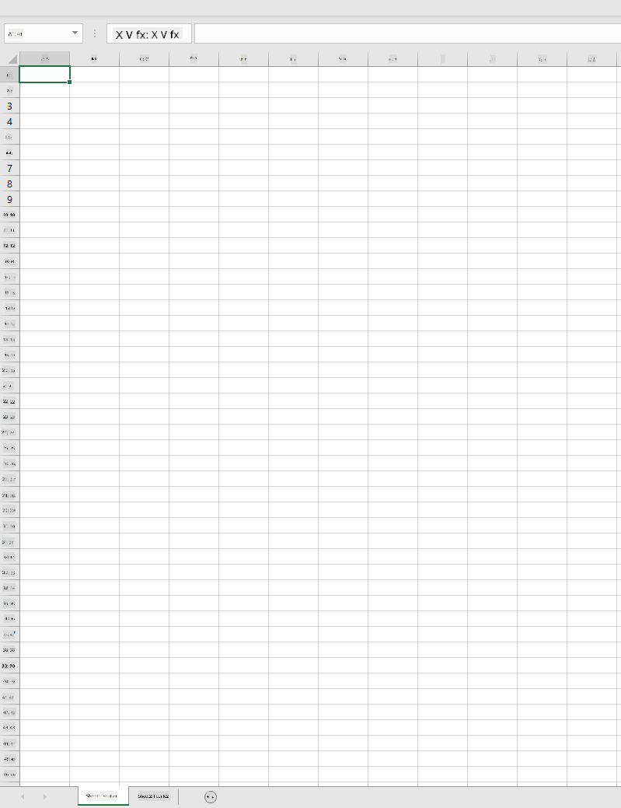
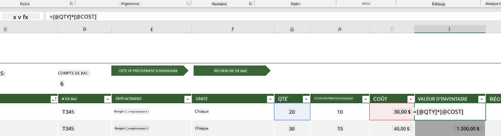
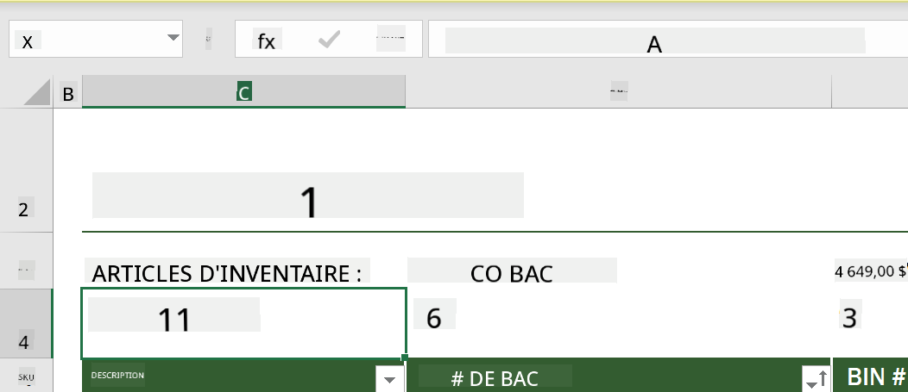
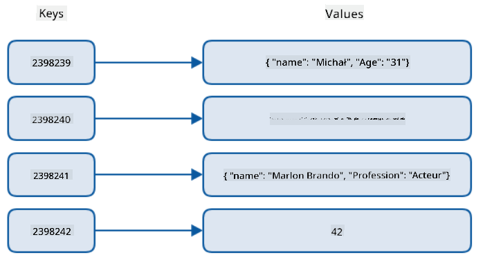
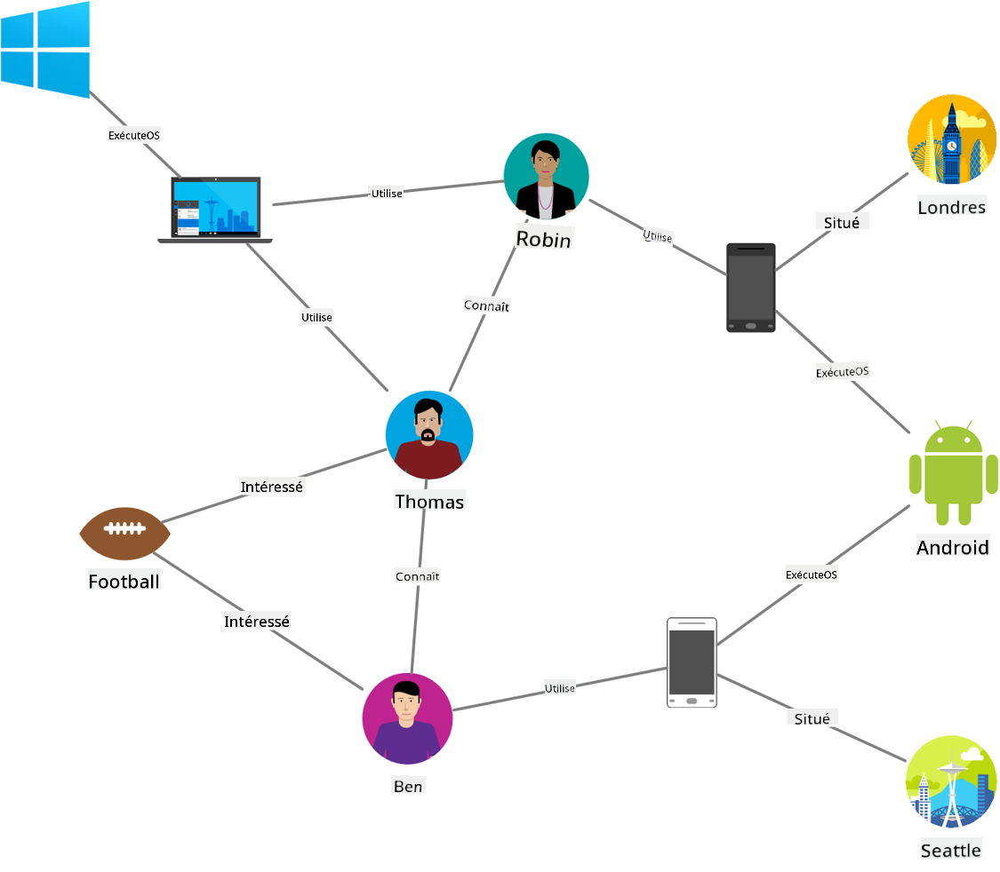
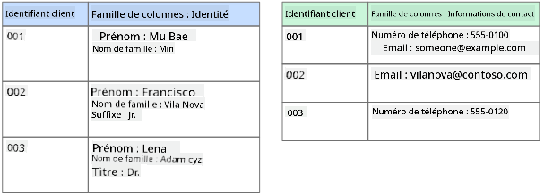
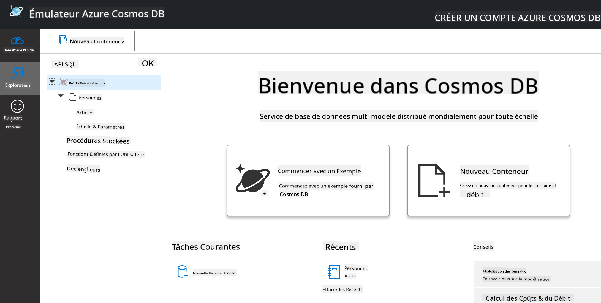
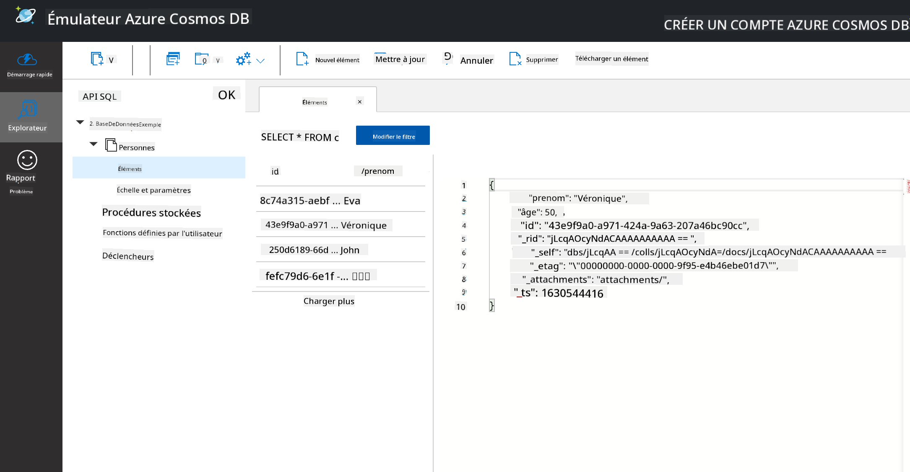

<!--
CO_OP_TRANSLATOR_METADATA:
{
  "original_hash": "32ddfef8121650f2ca2f3416fd283c37",
  "translation_date": "2025-08-25T16:34:07+00:00",
  "source_file": "2-Working-With-Data/06-non-relational/README.md",
  "language_code": "fr"
}
-->
# Travailler avec les données : Données non relationnelles

| ](../../sketchnotes/06-NoSQL.png)|
|:---:|
|Travailler avec des données NoSQL - _Sketchnote par [@nitya](https://twitter.com/nitya)_ |

## [Quiz avant le cours](https://purple-hill-04aebfb03.1.azurestaticapps.net/quiz/10)

Les données ne se limitent pas aux bases de données relationnelles. Cette leçon se concentre sur les données non relationnelles et couvrira les bases des tableurs et du NoSQL.

## Tableurs

Les tableurs sont un moyen populaire de stocker et d'explorer des données, car ils nécessitent peu de configuration pour commencer. Dans cette leçon, vous apprendrez les composants de base d'un tableur, ainsi que les formules et fonctions. Les exemples seront illustrés avec Microsoft Excel, mais la plupart des éléments et sujets auront des noms et étapes similaires dans d'autres logiciels de tableur.



Un tableur est un fichier accessible dans le système de fichiers d'un ordinateur, d'un appareil ou d'un système de fichiers basé sur le cloud. Le logiciel lui-même peut être basé sur un navigateur ou une application qui doit être installée sur un ordinateur ou téléchargée en tant qu'application. Dans Excel, ces fichiers sont également définis comme des **classeurs**, et cette terminologie sera utilisée pour le reste de cette leçon.

Un classeur contient une ou plusieurs **feuilles de calcul**, où chaque feuille est identifiée par des onglets. Une feuille de calcul est composée de rectangles appelés **cellules**, qui contiennent les données réelles. Une cellule est l'intersection d'une ligne et d'une colonne, où les colonnes sont identifiées par des lettres alphabétiques et les lignes par des chiffres. Certains tableurs contiennent des en-têtes dans les premières lignes pour décrire les données d'une cellule.

Avec ces éléments de base d'un classeur Excel, nous utiliserons un exemple tiré des [modèles Microsoft](https://templates.office.com/) axé sur un inventaire pour explorer d'autres parties d'un tableur.

### Gérer un inventaire

Le fichier de tableur nommé "InventoryExample" est un tableur formaté contenant des articles d'un inventaire, répartis sur trois feuilles de calcul, dont les onglets sont intitulés "Inventory List", "Inventory Pick List" et "Bin Lookup". La ligne 4 de la feuille "Inventory List" est l'en-tête, qui décrit la valeur de chaque cellule dans la colonne d'en-tête.



Il existe des cas où une cellule dépend des valeurs d'autres cellules pour générer sa propre valeur. Le tableur "Inventory List" suit le coût de chaque article de l'inventaire, mais que faire si nous avons besoin de connaître la valeur totale de l'inventaire ? Les [**formules**](https://support.microsoft.com/fr-fr/office/overview-of-formulas-34519a4e-1e8d-4f4b-84d4-d642c4f63263) effectuent des actions sur les données des cellules et sont utilisées pour calculer la valeur de l'inventaire dans cet exemple. Ce tableur utilise une formule dans la colonne "Inventory Value" pour calculer la valeur de chaque article en multipliant la quantité sous l'en-tête QTY par le coût sous l'en-tête COST. Un double-clic ou une sélection d'une cellule permet de voir la formule. Vous remarquerez que les formules commencent par un signe égal, suivi du calcul ou de l'opération.



Nous pouvons utiliser une autre formule pour additionner toutes les valeurs de la colonne "Inventory Value" afin d'obtenir la valeur totale. Cela pourrait être calculé en additionnant chaque cellule, mais cela peut être une tâche fastidieuse. Excel propose des [**fonctions**](https://support.microsoft.com/fr-fr/office/sum-function-043e1c7d-7726-4e80-8f32-07b23e057f89), ou formules prédéfinies, pour effectuer des calculs sur les valeurs des cellules. Les fonctions nécessitent des arguments, qui sont les valeurs requises pour effectuer ces calculs. Lorsque les fonctions nécessitent plusieurs arguments, ils doivent être listés dans un ordre particulier, sinon la fonction risque de ne pas calculer la valeur correcte. Cet exemple utilise la fonction SUM et les valeurs de la colonne "Inventory Value" comme argument pour générer le total indiqué sous la ligne 3, colonne B (également appelée B3).

## NoSQL

NoSQL est un terme générique pour désigner les différentes façons de stocker des données non relationnelles et peut être interprété comme "non-SQL", "non-relationnel" ou "pas seulement SQL". Ces types de systèmes de bases de données peuvent être classés en 4 catégories.

  
> Source : [Blog de Michał Białecki](https://www.michalbialecki.com/2018/03/18/azure-cosmos-db-key-value-database-cloud/)

Les bases de données [clé-valeur](https://docs.microsoft.com/fr-fr/azure/architecture/data-guide/big-data/non-relational-data#keyvalue-data-stores) associent des clés uniques, qui sont des identifiants uniques, à une valeur. Ces paires sont stockées à l'aide d'une [table de hachage](https://www.hackerearth.com/practice/data-structures/hash-tables/basics-of-hash-tables/tutorial/) avec une fonction de hachage appropriée.

  
> Source : [Microsoft](https://docs.microsoft.com/fr-fr/azure/cosmos-db/graph/graph-introduction#graph-database-by-example)

Les bases de données [graphe](https://docs.microsoft.com/fr-fr/azure/architecture/data-guide/big-data/non-relational-data#graph-data-stores) décrivent les relations dans les données et sont représentées comme une collection de nœuds et d'arêtes. Un nœud représente une entité, quelque chose qui existe dans le monde réel, comme un étudiant ou un relevé bancaire. Les arêtes représentent la relation entre deux entités. Chaque nœud et chaque arête ont des propriétés qui fournissent des informations supplémentaires.



Les bases de données [en colonnes](https://docs.microsoft.com/fr-fr/azure/architecture/data-guide/big-data/non-relational-data#columnar-data-stores) organisent les données en colonnes et lignes, comme une structure relationnelle, mais chaque colonne est divisée en groupes appelés familles de colonnes, où toutes les données sous une colonne sont liées et peuvent être récupérées ou modifiées en une seule unité.

### Bases de données documentaires avec Azure Cosmos DB

Les bases de données [documentaires](https://docs.microsoft.com/fr-fr/azure/architecture/data-guide/big-data/non-relational-data#document-data-stores) s'appuient sur le concept de base de données clé-valeur et sont constituées d'une série de champs et d'objets. Cette section explore les bases de données documentaires avec l'émulateur Cosmos DB.

Une base de données Cosmos DB correspond à la définition de "Pas seulement SQL", où la base documentaire de Cosmos DB repose sur SQL pour interroger les données. La [leçon précédente](../05-relational-databases/README.md) sur SQL couvre les bases du langage, et nous pourrons appliquer certaines des mêmes requêtes à une base documentaire ici. Nous utiliserons l'émulateur Cosmos DB, qui nous permet de créer et d'explorer une base documentaire localement sur un ordinateur. En savoir plus sur l'émulateur [ici](https://docs.microsoft.com/fr-fr/azure/cosmos-db/local-emulator?tabs=ssl-netstd21).

Un document est une collection de champs et de valeurs d'objets, où les champs décrivent ce que représente la valeur de l'objet. Voici un exemple de document.

```json
{
    "firstname": "Eva",
    "age": 44,
    "id": "8c74a315-aebf-4a16-bb38-2430a9896ce5",
    "_rid": "bHwDAPQz8s0BAAAAAAAAAA==",
    "_self": "dbs/bHwDAA==/colls/bHwDAPQz8s0=/docs/bHwDAPQz8s0BAAAAAAAAAA==/",
    "_etag": "\"00000000-0000-0000-9f95-010a691e01d7\"",
    "_attachments": "attachments/",
    "_ts": 1630544034
}
```

Les champs d'intérêt dans ce document sont : `firstname`, `id` et `age`. Les autres champs avec des underscores ont été générés par Cosmos DB.

#### Explorer les données avec l'émulateur Cosmos DB

Vous pouvez télécharger et installer l'émulateur [pour Windows ici](https://aka.ms/cosmosdb-emulator). Consultez cette [documentation](https://docs.microsoft.com/fr-fr/azure/cosmos-db/local-emulator?tabs=ssl-netstd21#run-on-linux-macos) pour des options sur son exécution sous macOS et Linux.

L'émulateur lance une fenêtre de navigateur, où la vue Explorer permet d'explorer les documents.



Si vous suivez, cliquez sur "Start with Sample" pour générer une base de données exemple appelée SampleDB. Si vous développez SampleDB en cliquant sur la flèche, vous trouverez un conteneur appelé `Persons`. Un conteneur contient une collection d'éléments, qui sont les documents dans le conteneur. Vous pouvez explorer les quatre documents individuels sous `Items`.



#### Interroger les données documentaires avec l'émulateur Cosmos DB

Nous pouvons également interroger les données d'exemple en cliquant sur le bouton "New SQL Query" (deuxième bouton à gauche).

`SELECT * FROM c` retourne tous les documents dans le conteneur. Ajoutons une clause WHERE pour trouver toutes les personnes de moins de 40 ans.

`SELECT * FROM c where c.age < 40`


La requête retourne deux documents. Remarquez que la valeur `age` pour chaque document est inférieure à 40.

#### JSON et documents

Si vous êtes familier avec le JavaScript Object Notation (JSON), vous remarquerez que les documents ressemblent à du JSON. Il y a un fichier `PersonsData.json` dans ce répertoire avec plus de données que vous pouvez télécharger dans le conteneur `Persons` de l'émulateur via le bouton `Upload Item`.

Dans la plupart des cas, les API qui retournent des données JSON peuvent être directement transférées et stockées dans des bases de données documentaires. Voici un autre document, représentant des tweets du compte Twitter de Microsoft, récupérés via l'API Twitter, puis insérés dans Cosmos DB.

```json
{
    "created_at": "2021-08-31T19:03:01.000Z",
    "id": "1432780985872142341",
    "text": "Blank slate. Like this tweet if you’ve ever painted in Microsoft Paint before. https://t.co/cFeEs8eOPK",
    "_rid": "dhAmAIUsA4oHAAAAAAAAAA==",
    "_self": "dbs/dhAmAA==/colls/dhAmAIUsA4o=/docs/dhAmAIUsA4oHAAAAAAAAAA==/",
    "_etag": "\"00000000-0000-0000-9f84-a0958ad901d7\"",
    "_attachments": "attachments/",
    "_ts": 1630537000
```

Les champs d'intérêt dans ce document sont : `created_at`, `id` et `text`.

## 🚀 Défi

Il y a un fichier `TwitterData.json` que vous pouvez télécharger dans la base de données SampleDB. Il est recommandé de l'ajouter à un conteneur séparé. Cela peut être fait en :

1. Cliquant sur le bouton "New Container" en haut à droite  
1. Sélectionnant la base de données existante (SampleDB) et en créant un ID de conteneur  
1. Définissant la clé de partition sur `/id`  
1. Cliquant sur OK (vous pouvez ignorer le reste des informations dans cette vue, car il s'agit d'un petit ensemble de données exécuté localement sur votre machine)  
1. Ouvrant votre nouveau conteneur et téléchargeant le fichier Twitter Data avec le bouton `Upload Item`  

Essayez d'exécuter quelques requêtes SELECT pour trouver les documents contenant "Microsoft" dans le champ `text`. Astuce : essayez d'utiliser le [mot-clé LIKE](https://docs.microsoft.com/fr-fr/azure/cosmos-db/sql/sql-query-keywords#using-like-with-the--wildcard-character).

## [Quiz après le cours](https://purple-hill-04aebfb03.1.azurestaticapps.net/quiz/11)

## Révision et auto-apprentissage

- Il y a des fonctionnalités et des formats supplémentaires ajoutés à ce tableur que cette leçon ne couvre pas. Microsoft propose une [grande bibliothèque de documentation et de vidéos](https://support.microsoft.com/excel) sur Excel si vous souhaitez en apprendre davantage.

- Cette documentation architecturale détaille les caractéristiques des différents types de données non relationnelles : [Données non relationnelles et NoSQL](https://docs.microsoft.com/fr-fr/azure/architecture/data-guide/big-data/non-relational-data).

- Cosmos DB est une base de données non relationnelle basée sur le cloud qui peut également stocker les différents types NoSQL mentionnés dans cette leçon. Apprenez-en plus sur ces types dans ce [module Microsoft Learn sur Cosmos DB](https://docs.microsoft.com/fr-fr/learn/paths/work-with-nosql-data-in-azure-cosmos-db/).

## Devoir

[Soda Profits](assignment.md)

**Avertissement** :  
Ce document a été traduit à l'aide du service de traduction automatique [Co-op Translator](https://github.com/Azure/co-op-translator). Bien que nous nous efforcions d'assurer l'exactitude, veuillez noter que les traductions automatisées peuvent contenir des erreurs ou des inexactitudes. Le document original dans sa langue d'origine doit être considéré comme la source faisant autorité. Pour des informations critiques, il est recommandé de faire appel à une traduction humaine professionnelle. Nous déclinons toute responsabilité en cas de malentendus ou d'interprétations erronées résultant de l'utilisation de cette traduction.